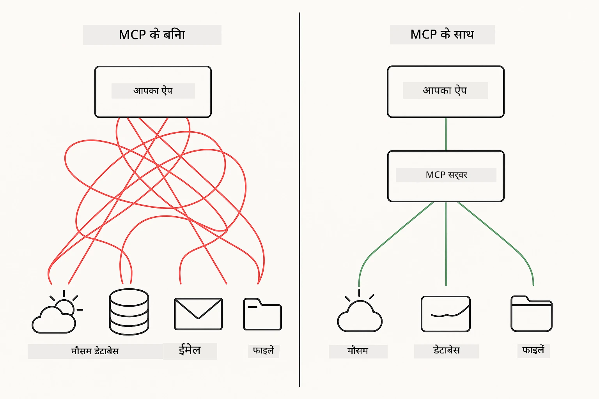
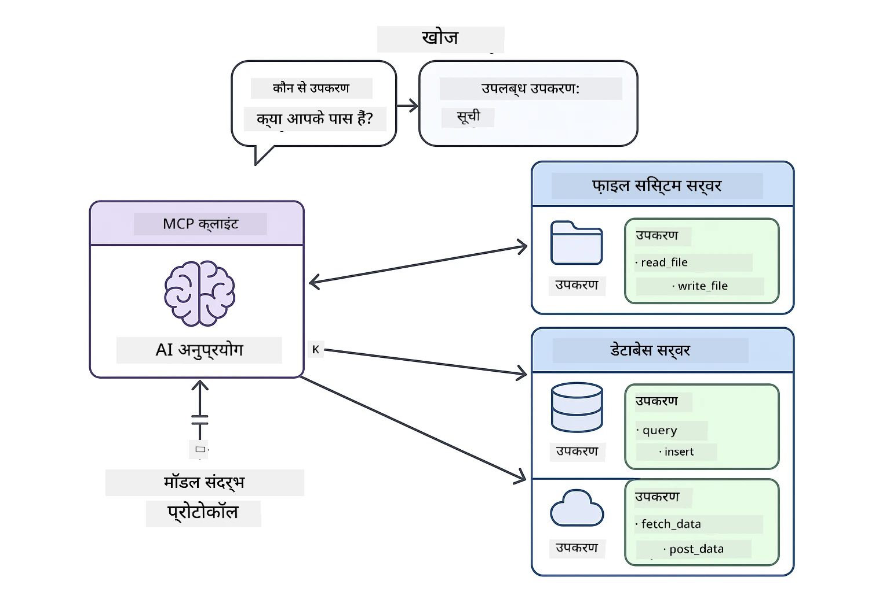
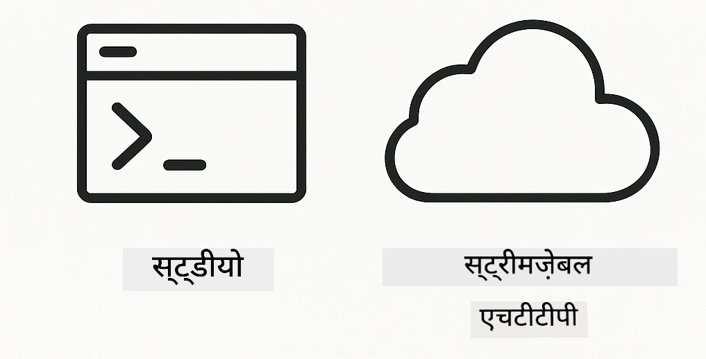
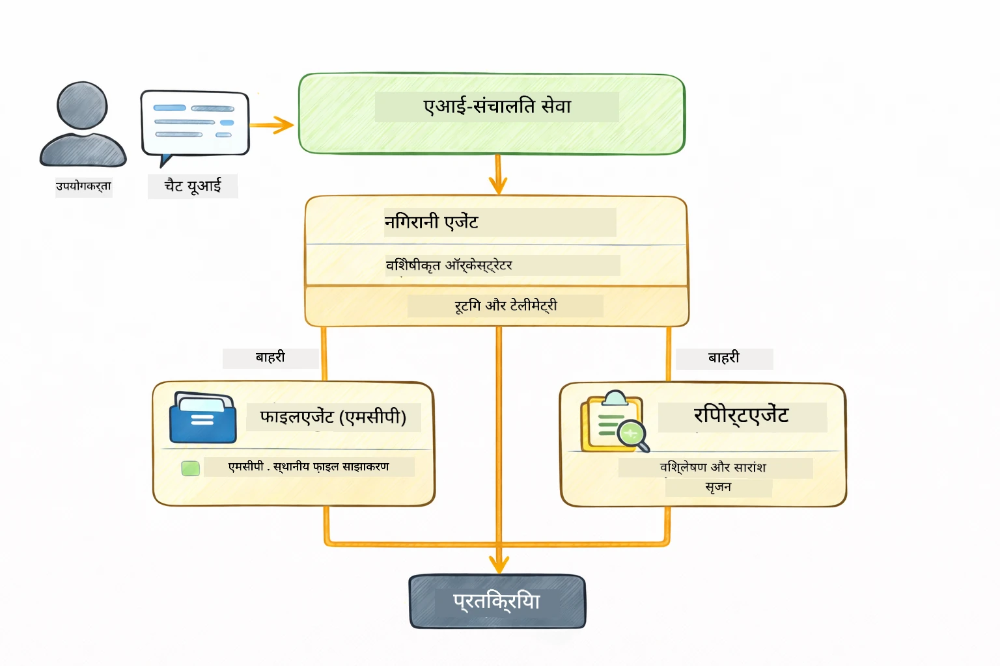

<!--
CO_OP_TRANSLATOR_METADATA:
{
  "original_hash": "6c816d130a1fa47570c11907e72d84ae",
  "translation_date": "2026-01-05T22:27:38+00:00",
  "source_file": "05-mcp/README.md",
  "language_code": "hi"
}
-->
# मॉड्यूल 05: मॉडल कॉन्टेक्स्ट प्रोटोकॉल (MCP)

## विषय सूची

- [आप क्या सीखेंगे](../../../05-mcp)
- [MCP क्या है?](../../../05-mcp)
- [MCP कैसे काम करता है](../../../05-mcp)
- [एजेंटिक मॉड्यूल](../../../05-mcp)
- [उदाहरण चलाना](../../../05-mcp)
  - [पूर्व आवश्यकताएँ](../../../05-mcp)
- [त्वरित प्रारंभ](../../../05-mcp)
  - [फ़ाइल संचालन (Stdio)](../../../05-mcp)
  - [सुपरवाइजर एजेंट](../../../05-mcp)
    - [आउटपुट को समझना](../../../05-mcp)
    - [प्रतिक्रिया रणनीतियाँ](../../../05-mcp)
    - [एजेंटिक मॉड्यूल फीचर्स का स्पष्टीकरण](../../../05-mcp)
- [मुख्य अवधारणाएँ](../../../05-mcp)
- [बधाई हो!](../../../05-mcp)
  - [अगला क्या है?](../../../05-mcp)

## आप क्या सीखेंगे

आपने कॉन्वर्सेशनल AI बनाया है, प्रॉम्प्ट्स महारत हासिल की है, दस्तावेज़ों में प्रतिक्रिया को ग्राउंड किया है और टूल्स के साथ एजेंट बनाए हैं। लेकिन वे सभी टूल आपके विशिष्ट एप्लिकेशन के लिए कस्टम बनाए गए थे। यदि आप अपने AI को एक मानकीकृत उपकरण पारिस्थितिकी तंत्र तक पहुंच प्रदान कर सकें जो कोई भी बना और साझा कर सके तो? इस मॉड्यूल में, आप Model Context Protocol (MCP) और LangChain4j के एजेंटिक मॉड्यूल के साथ ऐसा करना सीखेंगे। हम पहले एक साधारण MCP फ़ाइल रीडर दिखाते हैं और फिर दिखाते हैं कि यह आसानी से सुपरवाइजर एजेंट पैटर्न का उपयोग करके उन्नत एजेंटिक वर्कफ़्लोज़ में कैसे एकीकृत होता है।

## MCP क्या है?

Model Context Protocol (MCP) यही प्रदान करता है - AI एप्लिकेशन के लिए बाहरी टूल खोजने और उपयोग करने का एक मानक तरीका। हर डेटा स्रोत या सेवा के लिए कस्टम एकीकरण लिखने के बजाय, आप उन MCP सर्वरों से कनेक्ट होते हैं जो अपनी क्षमताओं को एक सुसंगत प्रारूप में प्रस्तुत करते हैं। आपका AI एजेंट फिर इन टूल्स को स्वतः खोज और उपयोग कर सकता है।



*MCP से पहले: जटिल पॉइंट-टू-पॉइंट एकीकरण। MCP के बाद: एक प्रोटोकॉल, अनंत संभावनाएँ।*

MCP AI विकास में एक मूल समस्या हल करता है: हर एकीकरण कस्टम होता है। GitHub तक पहुंचना चाहते हैं? कस्टम कोड। फ़ाइलें पढ़ना चाहते हैं? कस्टम कोड। डेटाबेस क्वेरी करना चाहते हैं? कस्टम कोड। और ये एकीकरण किसी अन्य AI एप्लिकेशन के साथ काम नहीं करते।

MCP इसे मानकीकृत करता है। एक MCP सर्वर साफ़ विवरण और स्कीमाओं के साथ टूल पेश करता है। कोई भी MCP क्लाइंट कनेक्ट हो सकता है, उपलब्ध टूल खोज सकता है, और उनका उपयोग कर सकता है। एक बार बनाएँ, हर जगह उपयोग करें।



*मॉडल कॉन्टेक्स्ट प्रोटोकॉल वास्तुकला - मानकीकृत टूल खोज और निष्पादन*

## MCP कैसे काम करता है

**सर्वर-क्लाइंट आर्किटेक्चर**

MCP क्लाइंट-सर्वर मॉडल का उपयोग करता है। सर्वर टूल प्रदान करते हैं - फ़ाइल पढ़ना, डेटाबेस क्वेरी करना, API कॉल करना। क्लाइंट (आपका AI एप्लिकेशन) सर्वरों से कनेक्ट होते हैं और उनके टूल्स का उपयोग करते हैं।

LangChain4j के साथ MCP उपयोग करने के लिए, इस Maven निर्भरता को जोड़ें:

```xml
<dependency>
    <groupId>dev.langchain4j</groupId>
    <artifactId>langchain4j-mcp</artifactId>
    <version>${langchain4j.version}</version>
</dependency>
```

**टूल खोज**

जब आपका क्लाइंट MCP सर्वर से जुड़ता है, तो वह पूछता है "आपके पास कौन-कौन से टूल हैं?" सर्वर उपलब्ध टूल्स की सूची विवरण और पैरामीटर स्कीमाओं के साथ देता है। आपका AI एजेंट तब उपयोगकर्ता अनुरोधों के आधार पर यह तय कर सकता है कि कौन से टूल उपयोग करने हैं।

**ट्रांसपोर्ट तंत्र**

MCP विभिन्न ट्रांसपोर्ट तंत्रों का समर्थन करता है। यह मॉड्यूल स्थानीय प्रक्रियाओं के लिए Stdio ट्रांसपोर्ट प्रदर्शित करता है:



*MCP ट्रांसपोर्ट तंत्र: HTTP दूरस्थ सर्वरों के लिए, Stdio स्थानीय प्रक्रियाओं के लिए*

**Stdio** - [StdioTransportDemo.java](../../../05-mcp/src/main/java/com/example/langchain4j/mcp/StdioTransportDemo.java)

स्थानीय प्रक्रियाओं के लिए। आपका एप्लिकेशन एक सर्वर को subprocess के रूप में प्रारंभ करता है और मानक इनपुट/आउटपुट के माध्यम से संवाद करता है। फ़ाइल सिस्टम एक्सेस या कमांड-लाइन टूल्स के लिए उपयोगी।

```java
McpTransport stdioTransport = new StdioMcpTransport.Builder()
    .command(List.of(
        npmCmd, "exec",
        "@modelcontextprotocol/server-filesystem@2025.12.18",
        resourcesDir
    ))
    .logEvents(false)
    .build();
```

> **🤖 [GitHub Copilot](https://github.com/features/copilot) चैट के साथ आज़माएँ:** [`StdioTransportDemo.java`](../../../05-mcp/src/main/java/com/example/langchain4j/mcp/StdioTransportDemo.java) खोलें और पूछें:
> - "Stdio ट्रांसपोर्ट कैसे काम करता है और मुझे HTTP के मुकाबले कब इसका उपयोग करना चाहिए?"
> - "LangChain4j MCP सर्वर प्रक्रियाओं के जीवनचक्र को कैसे प्रबंधित करता है?"
> - "AI को फ़ाइल सिस्टम की पहुंच देने के सुरक्षा निहितार्थ क्या हैं?"

## एजेंटिक मॉड्यूल

जहाँ MCP मानकीकृत टूल प्रदान करता है, LangChain4j का **एजेंटिक मॉड्यूल** उन टूल्स का समन्वय करने वाले एजेंट बनाने का एक घोषणात्मक तरीका प्रदान करता है। `@Agent` एनोटेशन और `AgenticServices` आपको एजेंट व्यवहार को इन्टरफेस के माध्यम से परिभाषित करने देते हैं, बजाय इम्पेरेटिव कोड के।

इस मॉड्यूल में, आप **सुपरवाइजर एजेंट** पैटर्न का अन्वेषण करेंगे — एक उन्नत एजेंटिक AI दृष्टिकोण जहाँ "सुपरवाइजर" एजेंट यूज़र अनुरोधों के आधार पर गतिशील रूप से उप-एजेंटों को कॉल करने का निर्णय लेता है। हम दोनों अवधारणाओं को जोड़ेंगे, जिसमें हमारे उप-एजेंट में MCP-संचालित फ़ाइल पहुंच क्षमताएँ होंगी।

एजेंटिक मॉड्यूल उपयोग करने के लिए, यह Maven निर्भरता जोड़ें:

```xml
<dependency>
    <groupId>dev.langchain4j</groupId>
    <artifactId>langchain4j-agentic</artifactId>
    <version>${langchain4j.mcp.version}</version>
</dependency>
```

> **⚠️ प्रायोगिक:** `langchain4j-agentic` मॉड्यूल **प्रयोगात्मक** है और परिवर्तन के अधीन है। AI सहायक बनाने का स्थिर तरीका `langchain4j-core` के साथ कस्टम टूल्स (मॉड्यूल 04) है।

## उदाहरण चलाना

### पूर्व आवश्यकताएँ

- Java 21+, Maven 3.9+
- Node.js 16+ और npm (MCP सर्वरों के लिए)
- `.env` फ़ाइल में पर्यावरण चर कॉन्फ़िगर (रूट डायरेक्ट्री से):
  - `AZURE_OPENAI_ENDPOINT`, `AZURE_OPENAI_API_KEY`, `AZURE_OPENAI_DEPLOYMENT` (मॉड्यूल 01-04 के समान)

> **ध्यान दें:** यदि आपने अभी तक अपने पर्यावरण चर सेट नहीं किए हैं, तो निर्देशों के लिए [Module 00 - Quick Start](../00-quick-start/README.md) देखें, या रूट डायरेक्ट्री में `.env.example` को `.env` में कॉपी करें और अपने मान भरें।

## त्वरित प्रारंभ

**VS Code का उपयोग कर:** बस किसी भी डेमो फ़ाइल पर Explorer में राइट-क्लिक करें और **"Run Java"** चुनें, या Run and Debug पैनल से लॉन्च कॉन्फ़िगरेशन का उपयोग करें (इससे पहले सुनिश्चित करें कि आपने टोकन `.env` फ़ाइल में जोड़ा है)।

**Maven का उपयोग कर:** वैकल्पिक रूप से, आप नीचे दिए गए उदाहरणों के साथ कमांड लाइन से चला सकते हैं।

### फ़ाइल संचालन (Stdio)

यह स्थानीय subprocess आधारित टूल्स का प्रदर्शन करता है।

**✅ कोई पूर्व आवश्यकताएँ नहीं हैं** - MCP सर्वर अपने आप शुरू हो जाता है।

**स्टार्ट स्क्रिप्ट्स का उपयोग (सिफारिश):**

स्टार्ट स्क्रिप्ट्स स्वचालित रूप से रूट `.env` फ़ाइल से पर्यावरण चर लोड करती हैं:

**Bash:**
```bash
cd 05-mcp
chmod +x start-stdio.sh
./start-stdio.sh
```

**PowerShell:**
```powershell
cd 05-mcp
.\start-stdio.ps1
```

**VS Code का उपयोग करें:** `StdioTransportDemo.java` पर राइट-क्लिक करें और **"Run Java"** चुनें (सुनिश्चित करें कि आपका `.env` फ़ाइल कॉन्फ़िगर है)।

एप्लिकेशन अपने आप फ़ाइल सिस्टम MCP सर्वर शुरू करता है और एक स्थानीय फ़ाइल पढ़ता है। देखें कि subprocess प्रबंधन आपके लिए कैसे संभाला जाता है।

**अपेक्षित आउटपुट:**
```
Assistant response: The file provides an overview of LangChain4j, an open-source Java library
for integrating Large Language Models (LLMs) into Java applications...
```

### सुपरवाइजर एजेंट

**सुपरवाइजर एजेंट पैटर्न** एक **लचीला** एजेंटिक AI रूप है। एक सुपरवाइजर LLM का उपयोग करता है ताकि उपयोगकर्ता के अनुरोध के आधार पर स्वायत्त रूप से यह तय किया जा सके कि कौन से एजेंट्स को बुलाना है। अगले उदाहरण में, हम MCP-संचालित फ़ाइल एक्सेस को LLM एजेंट के साथ जोड़ते हैं ताकि एक सुपरवाइज़्ड फ़ाइल रीड → रिपोर्ट वर्कफ़्लो बनाया जा सके।

डेमो में, `FileAgent` MCP फ़ाइल सिस्टम टूल्स का उपयोग करके फ़ाइल पढ़ता है, और `ReportAgent` एक कार्यकारी सारांश (1 वाक्य), 3 मुख्य बिंदु, और सिफारिशों के साथ एक संरचित रिपोर्ट तैयार करता है। सुपरवाइजर इस प्रक्रिया का स्वचालित समन्वय करता है:



```
┌─────────────┐      ┌──────────────┐
│  FileAgent  │ ───▶ │ ReportAgent  │
│ (MCP tools) │      │  (pure LLM)  │
└─────────────┘      └──────────────┘
   outputKey:           outputKey:
  'fileContent'         'report'
```

प्रत्येक एजेंट अपना आउटपुट **एजेंटिक स्कोप** (साझा मेमोरी) में संग्रहीत करता है, जिससे डाउनस्ट्रीम एजेंट्स पिछले परिणामों तक पहुंच सकते हैं। यह दिखाता है कि MCP टूल्स एजेंटिक वर्कफ़्लोज़ में कैसे सहजता से एकीकृत होते हैं — सुपरवाइजर को यह जानने की ज़रूरत नहीं कि फ़ाइलें कैसे पढ़ी जाती हैं, केवल यह जानना होता है कि `FileAgent` ऐसा कर सकता है।

#### डेमो चलाना

स्टार्ट स्क्रिप्ट्स स्वचालित रूप से रूट `.env` फ़ाइल से पर्यावरण चर लोड करती हैं:

**Bash:**
```bash
cd 05-mcp
chmod +x start-supervisor.sh
./start-supervisor.sh
```

**PowerShell:**
```powershell
cd 05-mcp
.\start-supervisor.ps1
```

**VS Code का उपयोग करें:** `SupervisorAgentDemo.java` पर राइट-क्लिक करें और **"Run Java"** चुनें (सुनिश्चित करें कि आपका `.env` फ़ाइल कॉन्फ़िगर है)।

#### सुपरवाइजर कैसे काम करता है

```java
// चरण 1: FileAgent MCP उपकरणों का उपयोग करके फाइलें पढ़ता है
FileAgent fileAgent = AgenticServices.agentBuilder(FileAgent.class)
        .chatModel(model)
        .toolProvider(mcpToolProvider)  // फाइल ऑपरेशन के लिए MCP उपकरण हैं
        .build();

// चरण 2: ReportAgent संरचित रिपोर्ट बनाता है
ReportAgent reportAgent = AgenticServices.agentBuilder(ReportAgent.class)
        .chatModel(model)
        .build();

// Supervisor फाइल → रिपोर्ट कार्य प्रवाह का संयोजन करता है
SupervisorAgent supervisor = AgenticServices.supervisorBuilder()
        .chatModel(model)
        .subAgents(fileAgent, reportAgent)
        .responseStrategy(SupervisorResponseStrategy.LAST)  // अंतिम रिपोर्ट लौटाएं
        .build();

// Supervisor अनुरोध के आधार पर कौन से एजेंट को बुलाना है, तय करता है
String response = supervisor.invoke("Read the file at /path/file.txt and generate a report");
```

#### प्रतिक्रिया रणनीतियाँ

जब आप `SupervisorAgent` कॉन्फ़िगर करते हैं, तो आप यह निर्दिष्ट करते हैं कि उप-एजेंट्स के कार्य पूरा करने के बाद यह अंतिम उत्तर उपयोगकर्ता को कैसे प्रस्तुत करे। उपलब्ध रणनीतियाँ हैं:

| रणनीति | विवरण |
|----------|-------------|
| **LAST** | सुपरवाइजर उस अंतिम उप-एजेंट या टूल का आउटपुट लौटाता है जिसे कॉल किया गया था। यह उपयोगी होता है जब कार्यप्रवाह में अंतिम एजेंट विशेष रूप से पूर्ण, अंतिम उत्तर उत्पन्न करने के लिए बनाया गया हो (जैसे, अनुसंधान पाइपलाइन में "सारांश एजेंट")। |
| **SUMMARY** | सुपरवाइजर अपने आंतरिक भाषा मॉडल (LLM) का उपयोग करके पूरी बातचीत और सभी उप-एजेंट आउटपुट का सारांश तैयार करता है, फिर वह सारांश अंतिम प्रतिक्रिया के रूप में लौटाता है। यह उपयोगकर्ता को एक साफ़, समेकित उत्तर प्रदान करता है। |
| **SCORED** | सिस्टम आंतरिक LLM का उपयोग करके अंतिम प्रतिक्रिया और बातचीत के सारांश दोनों को मूल उपयोगकर्ता अनुरोध के खिलाफ स्कोर करता है, और जो भी आउटपुट उच्च स्कोर प्राप्त करता है उसे लौटाता है। |

पूर्ण कार्यान्वयन के लिए देखें [SupervisorAgentDemo.java](../../../05-mcp/src/main/java/com/example/langchain4j/mcp/SupervisorAgentDemo.java)।

> **🤖 [GitHub Copilot](https://github.com/features/copilot) चैट के साथ आज़माएँ:** [`SupervisorAgentDemo.java`](../../../05-mcp/src/main/java/com/example/langchain4j/mcp/SupervisorAgentDemo.java) खोलें और पूछें:
> - "सुपरवाइजर यह कैसे तय करता है कि कौन से एजेंट को बुलाना है?"
> - "सुपरवाइजर और सिक्वेंशियल वर्कफ़्लो पैटर्न में क्या अंतर है?"
> - "मैं सुपरवाइजर की योजना बनाने के व्यवहार को कैसे अनुकूलित कर सकता हूँ?"

#### आउटपुट को समझना

जब आप डेमो चलाएंगे, तो आप देखेंगे कि सुपरवाइजर कई एजेंटों को कैसे समन्वयित करता है। यहाँ प्रत्येक खंड का अर्थ है:

```
======================================================================
  FILE → REPORT WORKFLOW DEMO
======================================================================

This demo shows a clear 2-step workflow: read a file, then generate a report.
The Supervisor orchestrates the agents automatically based on the request.
```

**हेडर** वर्कफ़्लो अवधारणा को प्रस्तुत करता है: फ़ाइल पढ़ने से रिपोर्ट निर्माण तक एक केंद्रित पाइपलाइन।

```
--- WORKFLOW ---------------------------------------------------------
  ┌─────────────┐      ┌──────────────┐
  │  FileAgent  │ ───▶ │ ReportAgent  │
  │ (MCP tools) │      │  (pure LLM)  │
  └─────────────┘      └──────────────┘
   outputKey:           outputKey:
   'fileContent'        'report'

--- AVAILABLE AGENTS -------------------------------------------------
  [FILE]   FileAgent   - Reads files via MCP → stores in 'fileContent'
  [REPORT] ReportAgent - Generates structured report → stores in 'report'
```

**वर्कफ़्लो आरेख** एजेंटों के बीच डेटा प्रवाह दिखाता है। प्रत्येक एजेंट की विशिष्ट भूमिका होती है:
- **FileAgent** MCP टूल्स का उपयोग करके फ़ाइलें पढ़ता है और कच्चा कंटेंट `fileContent` में संग्रहीत करता है
- **ReportAgent** उस कंटेंट का उपयोग करता है और `report` में संरचित रिपोर्ट बनाता है

```
--- USER REQUEST -----------------------------------------------------
  "Read the file at .../file.txt and generate a report on its contents"
```

**उपयोगकर्ता अनुरोध** कार्य दिखाता है। सुपरवाइजर इसे पार्स करता है और तय करता है कि FileAgent → ReportAgent को बुलाना है।

```
--- SUPERVISOR ORCHESTRATION -----------------------------------------
  The Supervisor decides which agents to invoke and passes data between them...

  +-- STEP 1: Supervisor chose -> FileAgent (reading file via MCP)
  |
  |   Input: .../file.txt
  |
  |   Result: LangChain4j is an open-source, provider-agnostic Java framework for building LLM...
  +-- [OK] FileAgent (reading file via MCP) completed

  +-- STEP 2: Supervisor chose -> ReportAgent (generating structured report)
  |
  |   Input: LangChain4j is an open-source, provider-agnostic Java framew...
  |
  |   Result: Executive Summary...
  +-- [OK] ReportAgent (generating structured report) completed
```

**सुपरवाइजर समन्वय** 2-चरणीय प्रवाह दिखाता है:
1. **FileAgent** MCP के माध्यम से फ़ाइल पढ़ता है और कंटेंट को संग्रहीत करता है
2. **ReportAgent** कंटेंट प्राप्त करता है और एक संरचित रिपोर्ट बनाता है

सुपरवाइजर ने यह निर्णय उपयोगकर्ता के अनुरोध के आधार पर **स्वायत्त रूप से** लिया।

```
--- FINAL RESPONSE ---------------------------------------------------
Executive Summary
...

Key Points
...

Recommendations
...

--- AGENTIC SCOPE (Data Flow) ----------------------------------------
  Each agent stores its output for downstream agents to consume:
  * fileContent: LangChain4j is an open-source, provider-agnostic Java framework...
  * report: Executive Summary...
```

#### एजेंटिक मॉड्यूल फीचर्स का स्पष्टीकरण

उदाहरण एजेंटिक मॉड्यूल की कई उन्नत विशेषताओं को प्रदर्शित करता है। आइए एजेंटिक स्कोप और एजेंट लिस्नर्स पर नज़र डालें।

**एजेंटिक स्कोप** साझा मेमोरी दिखाता है जहाँ एजेंट्स ने `@Agent(outputKey="...")` का उपयोग करके अपने परिणाम संग्रहीत किए। इससे यह संभव होता है:
- बाद के एजेंट पहले एजेंट के आउटपुट तक पहुँच सकते हैं
- सुपरवाइजर अंतिम प्रतिक्रिया को संश्लेषित कर सकता है
- आप देख सकते हैं कि प्रत्येक एजेंट ने क्या उत्पादन किया

```java
ResultWithAgenticScope<String> result = supervisor.invokeWithAgenticScope(request);
AgenticScope scope = result.agenticScope();
String fileContent = scope.readState("fileContent");  // FileAgent से कच्चा फ़ाइल डेटा
String report = scope.readState("report");            // ReportAgent से संरचित रिपोर्ट
```

**एजेंट लिस्नर्स** एजेंट निष्पादन की निगरानी और डिबगिंग सक्षम करते हैं। डेमो में जो चरण-दर-चरण आउटपुट आप देखते हैं वह एक AgentListener से आता है जो प्रत्येक एजेंट आवाहन से जुड़ा है:
- **beforeAgentInvocation** - जब सुपरवाइजर एजेंट चुनता है तब कॉल होता है, आपको यह दिखाता है कि कौन सा एजेंट चुना गया और क्यों
- **afterAgentInvocation** - जब एजेंट पूरा होता है तब कॉल होता है, इसके परिणाम दिखाता है
- **inheritedBySubagents** - यदि सत्य है, तो यह लिस्नर सभी एजेंटों की पदानुक्रम की निगरानी करता है

```java
AgentListener monitor = new AgentListener() {
    private int step = 0;
    
    @Override
    public void beforeAgentInvocation(AgentRequest request) {
        step++;
        System.out.println("  +-- STEP " + step + ": " + request.agentName());
    }
    
    @Override
    public void afterAgentInvocation(AgentResponse response) {
        System.out.println("  +-- [OK] " + response.agentName() + " completed");
    }
    
    @Override
    public boolean inheritedBySubagents() {
        return true; // सभी उप-एजेंट्स तक प्रसारित करें
    }
};
```

सुपरवाइजर पैटर्न के अलावा, `langchain4j-agentic` मॉड्यूल कई शक्तिशाली वर्कफ़्लो पैटर्न और फीचर्स प्रदान करता है:

| पैटर्न | विवरण | उपयोग का मामला |
|---------|-------------|----------|
| **Sequential** | एजेंटों को क्रम में निष्पादित करें, आउटपुट अगली स्टेप में जाता है | पाइपलाइंस: अनुसंधान → विश्लेषण → रिपोर्ट |
| **Parallel** | एजेंटों को एक साथ चलाएं | स्वतंत्र कार्य: मौसम + समाचार + स्टॉक्स |
| **Loop** | शर्त पूरी होने तक पुनरावृत्ति करें | गुणवत्ता स्कोरिंग: स्कोर ≥ 0.8 तक सुधार |
| **Conditional** | शर्तों के आधार पर मार्ग निर्धारण करें | वर्गीकरण → विशेषज्ञ एजेंट को भेजना |
| **Human-in-the-Loop** | मानव जाँच बिंदु जोड़ें | अनुमोदन वर्कफ़्लो, सामग्री समीक्षा |

## मुख्य अवधारणाएँ

अब जब आप MCP और एजेंटिक मॉड्यूल को क्रियान्वयन में देख चुके हैं, तो चलिए संक्षेप करते हैं कि प्रत्येक दृष्टिकोण कब उपयोग करना चाहिए।

**MCP** आदर्श है जब आप मौजूदा टूल पारिस्थितिक तंत्रों का लाभ उठाना चाहते हैं, ऐसे टूल बनाना चाहते हैं जिन्हें कई एप्लिकेशन साझा कर सकें, तीसरे पक्ष की सेवाओं को मानक प्रोटोकॉल के साथ एकीकृत करना चाहते हैं, या कोड बदले बिना टूल कार्यान्वयनों को स्वैप करना चाहते हैं।

**एजेंटिक मॉड्यूल** तब सबसे अच्छा काम करता है जब आप `@Agent` एनोटेशन के साथ घोषणात्मक एजेंट परिभाषाएँ चाहते हैं, वर्कफ़्लो समन्वय (क्रमिक, लूप, समानांतर) की ज़रूरत होती है, अनिवार्य कोड की बजाय इंटरफ़ेस-आधारित एजेंट डिजाइन पसंद करते हैं, या कई एजेंट्स को मिलाकर उपयोग करते हैं जो `outputKey` के माध्यम से आउटपुट साझा करते हैं।

**सुपरवाइजर एजेंट पैटर्न** तब चमकता है जब वर्कफ़्लो पहले से पूर्वानुमानित नहीं होता और आप चाहते हैं कि LLM निर्णय ले, जब आपके पास कई विशेषज्ञ एजेंट होते हैं जिन्हें गतिशील समन्वय की आवश्यकता होती है, जब आप बातचीत प्रणालियाँ बनाते हैं जो विभिन्न क्षमताओं पर रूटिंग करती हैं, या जब आप सबसे लचीला, अनुकूलनीय एजेंट व्यवहार चाहते हैं।
## बधाई हो!

आपने LangChain4j for Beginners कोर्स पूरा कर लिया है। आपने सीखा है:

- मेमोरी के साथ कॉन्वर्सेशनल AI कैसे बनाएं (मॉड्यूल 01)
- विभिन्न कार्यों के लिए प्रॉम्प्ट इंजीनियरिंग पैटर्न (मॉड्यूल 02)
- RAG के साथ अपने दस्तावेज़ों में प्रतिक्रियाओं को आधार देना (मॉड्यूल 03)
- कस्टम टूल्स के साथ बेसिक AI एजेंट्स (सहायक) बनाना (मॉड्यूल 04)
- LangChain4j MCP और Agentic मॉड्यूल के साथ मानकीकृत टूल्स का एकीकरण (मॉड्यूल 05)

### अब क्या?

मॉड्यूल पूरा करने के बाद, LangChain4j परीक्षण अवधारणाओं को क्रियान्वित देखना चाहते हैं, तो [Testing Guide](../docs/TESTING.md) देखें।

**अधिकारिक संसाधन:**
- [LangChain4j Documentation](https://docs.langchain4j.dev/) - व्यापक गाइड और API संदर्भ
- [LangChain4j GitHub](https://github.com/langchain4j/langchain4j) - स्रोत कोड और उदाहरण
- [LangChain4j Tutorials](https://docs.langchain4j.dev/tutorials/) - विभिन्न उपयोग मामलों के लिए चरण-दर-चरण ट्यूटोरियल

इस कोर्स को पूरा करने के लिए आपका धन्यवाद!

---

**नेविगेशन:** [← पिछला: मॉड्यूल 04 - टूल्स](../04-tools/README.md) | [मुख्य पृष्ठ पर वापस जाएं](../README.md)

---

<!-- CO-OP TRANSLATOR DISCLAIMER START -->
**अस्वीकरण**:  
यह दस्तावेज़ AI अनुवाद सेवा [Co-op Translator](https://github.com/Azure/co-op-translator) का उपयोग करके अनुवादित किया गया है। जबकि हम सटीकता के लिए प्रयासरत हैं, कृपया ध्यान दें कि स्वचालित अनुवाद में त्रुटियाँ या अशुद्धियाँ हो सकती हैं। मूल दस्तावेज़ अपनी मूल भाषा में ही अधिकारिक स्रोत माना जाना चाहिए। महत्वपूर्ण जानकारी के लिए, पेशेवर मानव अनुवाद की सिफारिश की जाती है। इस अनुवाद के उपयोग से उत्पन्न किसी भी गलतफहमी या गलत व्याख्या के लिए हम उत्तरदायी नहीं हैं।
<!-- CO-OP TRANSLATOR DISCLAIMER END -->