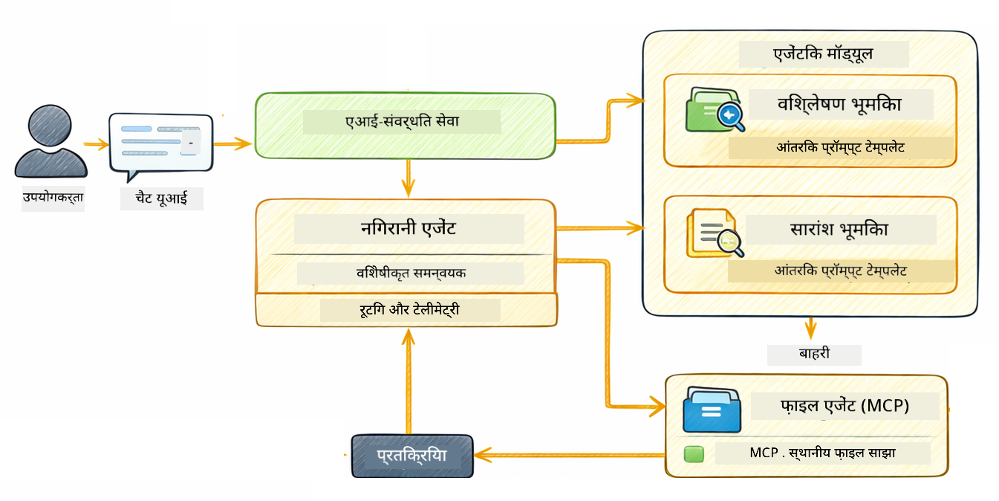

<!--
CO_OP_TRANSLATOR_METADATA:
{
  "original_hash": "f89f4c106d110e4943c055dd1a2f1dff",
  "translation_date": "2025-12-30T22:25:59+00:00",
  "source_file": "05-mcp/README.md",
  "language_code": "hi"
}
-->
# मॉड्यूल 05: Model Context Protocol (MCP)

## Table of Contents

- [आप क्या सीखेंगे](../../../05-mcp)
- [MCP क्या है?](../../../05-mcp)
- [MCP कैसे काम करता है](../../../05-mcp)
- [एजेंटिक मॉड्यूल](../../../05-mcp)
- [उदाहरण चलाना](../../../05-mcp)
  - [पूर्व-आवश्यकताएँ](../../../05-mcp)
- [त्वरित प्रारंभ](../../../05-mcp)
  - [फ़ाइल संचालन (Stdio)](../../../05-mcp)
  - [Supervisor Agent](../../../05-mcp)
    - [आउटपुट को समझना](../../../05-mcp)
    - [एजेंटिक मॉड्यूल सुविधाओं की व्याख्या](../../../05-mcp)
- [प्रमुख अवधारणाएँ](../../../05-mcp)
- [बधाई हो!](../../../05-mcp)
  - [अगला क्या?](../../../05-mcp)

## What You'll Learn

आपने संवादात्मक AI बनाया है, प्रॉम्प्ट्स में महारत हासिल की है, दस्तावेज़ों में उत्तरों को ग्राउंड किया है, और टूल्स के साथ एजेंट बनाए हैं। लेकिन उन सभी टूल्स को आपके विशेष एप्लिकेशन के लिए कस्टम-बनाया गया था। क्या होगा यदि आप अपने AI को ऐसे मानकीकृत टूल्स के इकोसिस्टम तक पहुँच दे सकें जिसे कोई भी बना कर साझा कर सके? इस मॉड्यूल में, आप Model Context Protocol (MCP) और LangChain4j के agentic मॉड्यूल के साथ यह कैसे किया जाता है सीखेंगे। हम पहले एक सरल MCP फ़ाइल रीडर दिखाते हैं और फिर दिखाते हैं कि यह Supervisor Agent पैटर्न का उपयोग करके उन्नत agentic वर्कफ़्लोज़ में कितनी आसानी से एकीकृत हो जाता है।

## What is MCP?

Model Context Protocol (MCP) ठीक वही प्रदान करता है - AI एप्लिकेशन के लिए बाहरी टूल्स को खोजने और उपयोग करने का एक मानकीकृत तरीका। प्रत्येक डेटा स्रोत या सेवा के लिए कस्टम इंटीग्रेशन लिखने के बजाय, आप उन MCP सर्वरों से जुड़ते हैं जो अपनी क्षमताओं को एक सुसंगत फ़ॉर्मेट में प्रकट करते हैं। आपका AI एजेंट तब स्वचालित रूप से इन टूल्स को खोज और उपयोग कर सकता है।


*MCP से पहले: जटिल बिंदु-से-बिंदु इंटीग्रेशन। MCP के बाद: एक प्रोटोकॉल, अनंत संभावनाएँ।*

MCP AI विकास में एक मौलिक समस्या को हल करता है: हर इंटीग्रेशन कस्टम है। GitHub तक पहुँचनी है? कस्टम कोड। फ़ाइलें पढ़नी हैं? कस्टम कोड। डेटाबेस से क्वेरी करनी है? कस्टम कोड। और इन किसी भी इंटीग्रेशनों का अन्य AI एप्लिकेशनों के साथ काम करने का सामान्य तरीका नहीं था।

MCP इसे मानकीकृत करता है। एक MCP सर्वर स्पष्ट विवरण और स्कीमाओं के साथ टूल्स को प्रकट करता है। कोई भी MCP क्लाइंट कनेक्ट, उपलब्ध टूल्स की खोज, और उन्हें उपयोग कर सकता है। एक बार बनाएँ, हर जगह उपयोग करें।


*Model Context Protocol आर्किटेक्चर - मानकीकृत टूल डिस्कवरी और निष्पादन*

## How MCP Works

**Server-Client Architecture**

MCP क्लाइंट-सर्वर मॉडल का उपयोग करता है। सर्वर टूल्स प्रदान करते हैं - फ़ाइलें पढ़ना, डेटाबेस क्वेरी करना, APIs को कॉल करना। क्लाइंट (आपका AI एप्लिकेशन) सर्वरों से जुड़ता है और उनके टूल्स का उपयोग करता है।

LangChain4j के साथ MCP का उपयोग करने के लिए, यह Maven निर्भरता जोड़ें:

```xml
<dependency>
    <groupId>dev.langchain4j</groupId>
    <artifactId>langchain4j-mcp</artifactId>
    <version>${langchain4j.version}</version>
</dependency>
```

**Tool Discovery**

जब आपका क्लाइंट किसी MCP सर्वर से जुड़ता है, तो वह पूछता है "आपके पास कौन से टूल्स हैं?" सर्वर उपलब्ध टूल्स की सूची के साथ उत्तर देता है, प्रत्येक के साथ विवरण और पैरामीटर स्कीमा। आपका AI एजेंट तब उपयोगकर्ता अनुरोधों के आधार पर कौन से टूल्स उपयोग करने का निर्णय ले सकता है।

**Transport Mechanisms**

MCP विभिन्न ट्रांसपोर्ट तंत्रों का समर्थन करता है। यह मॉड्यूल स्थानीय प्रक्रियाओं के लिए Stdio ट्रांसपोर्ट का प्रदर्शन करता है:


*MCP ट्रांसपोर्ट तंत्र: रिमोट सर्वरों के लिए HTTP, स्थानीय प्रक्रियाओं के लिए Stdio*

**Stdio** - [StdioTransportDemo.java](../../../05-mcp/src/main/java/com/example/langchain4j/mcp/StdioTransportDemo.java)

स्थानीय प्रक्रियाओं के लिए। आपका एप्लिकेशन एक सर्वर को subprocess के रूप में स्पॉन करता है और मानक इनपुट/आउटपुट के माध्यम से संवाद करता है। फ़ाइल सिस्टम एक्सेस या कमांड-लाइन टूल्स के लिए उपयोगी।

```java
McpTransport stdioTransport = new StdioMcpTransport.Builder()
    .command(List.of(
        npmCmd, "exec",
        "@modelcontextprotocol/server-filesystem@2025.12.18",
        resourcesDir
    ))
    .logEvents(false)
    .build();
```

> **🤖 GitHub Copilot के साथ आज़माएँ:** Open [`StdioTransportDemo.java`](../../../05-mcp/src/main/java/com/example/langchain4j/mcp/StdioTransportDemo.java) और पूछें:
> - "Stdio ट्रांसपोर्ट कैसे काम करता है और मुझे इसे HTTP के बजाय कब उपयोग करना चाहिए?"
> - "LangChain4j कैसे स्पॉन किए गए MCP सर्वर प्रक्रियाओं के लाइफसाइकल को प्रबंधित करता है?"
> - "AI को फ़ाइल सिस्टम तक पहुँच देने के सुरक्षा निहितार्थ क्या हैं?"

## The Agentic Module

हालांकि MCP मानकीकृत टूल्स प्रदान करता है, LangChain4j का **agentic मॉड्यूल** उन टूल्स को ऑर्केस्ट्रेट करने वाले एजेंट्स बनाने का एक घोषणात्मक तरीका प्रदान करता है। `@Agent` एनोटेशन और `AgenticServices` आपको इम्पेरेटिव कोड के बजाय इंटरफेस के माध्यम से एजेंट व्यवहार परिभाषित करने देते हैं।

इस मॉड्यूल में, आप **Supervisor Agent** पैटर्न का अन्वेषण करेंगे — एक उन्नत agentic AI दृष्टिकोण जहां एक "सुपरवाइज़र" एजेंट उपयोगकर्ता अनुरोधों के आधार पर गतिशील रूप से यह निर्णय लेता है कि कौन से सब-एजेंट्स को invoke करना है। हम इन दोनों अवधारणाओं को इस तरह मिलाएंगे कि हमारे एक सब-एजेंट को MCP-संचालित फ़ाइल एक्सेस क्षमताएँ दी जाएँ।

agentic मॉड्यूल का उपयोग करने के लिए, यह Maven निर्भरता जोड़ें:

```xml
<dependency>
    <groupId>dev.langchain4j</groupId>
    <artifactId>langchain4j-agentic</artifactId>
    <version>${langchain4j.mcp.version}</version>
</dependency>
```

> **⚠️ प्रायोगिक:** `langchain4j-agentic` मॉड्यूल **प्रायोगिक** है और बदल सकता है। AI असिस्टेंट बनाने का स्थिर तरीका अभी भी `langchain4j-core` के साथ कस्टम टूल्स है (मॉड्यूल 04)।

## Running the Examples

### Prerequisites

- Java 21+, Maven 3.9+
- Node.js 16+ और npm (MCP सर्वरों के लिए)
- `.env` फ़ाइल में रूट डायरेक्टरी से कॉन्फ़िगर किए गए पर्यावरण चर:
  - **StdioTransportDemo के लिए:** `GITHUB_TOKEN` (GitHub Personal Access Token)
  - **SupervisorAgentDemo के लिए:** `AZURE_OPENAI_ENDPOINT`, `AZURE_OPENAI_API_KEY`, `AZURE_OPENAI_DEPLOYMENT` (मॉड्यूल 01-04 के समान)

> **नोट:** यदि आपने अभी तक अपने परिवेश चर सेट नहीं किए हैं, तो निर्देशों के लिए देखें [Module 00 - Quick Start](../00-quick-start/README.md), या रूट डायरेक्टरी में `.env.example` को `.env` में कॉपी करें और अपनी मान भरें।

## Quick Start

**VS Code का उपयोग करते हुए:** Explorer में किसी भी डेमो फ़ाइल पर राइट-क्लिक करें और **"Run Java"** चुनें, या Run and Debug पैनल से लॉन्च कॉन्फ़िगरेशन का उपयोग करें (सुनिश्चित करें कि आपने पहले `.env` फ़ाइल में अपना टोकन जोड़ दिया है)।

**Maven का उपयोग करते हुए:** वैकल्पिक रूप से, आप नीचे दिए गए उदाहरणों के साथ कमांड लाइन से चला सकते हैं।

### File Operations (Stdio)

यह स्थानीय subprocess-आधारित टूल्स का प्रदर्शन करता है।

**✅ किसी पूर्व-आवश्यकता की ज़रूरत नहीं है** - MCP सर्वर स्वचालित रूप से स्पॉन हो जाता है।

**VS Code का उपयोग करते हुए:** `StdioTransportDemo.java` पर राइट-क्लिक करें और **"Run Java"** चुनें।

**Maven का उपयोग करते हुए:**

**Bash:**
```bash
export GITHUB_TOKEN=your_token_here
cd 05-mcp
mvn compile exec:java -Dexec.mainClass=com.example.langchain4j.mcp.StdioTransportDemo
```

**PowerShell:**
```powershell
$env:GITHUB_TOKEN=your_token_here
cd 05-mcp
mvn --% compile exec:java -Dexec.mainClass=com.example.langchain4j.mcp.StdioTransportDemo
```

एप्लिकेशन स्वतः ही एक फ़ाइल सिस्टम MCP सर्वर स्पॉन करता है और एक स्थानीय फ़ाइल पढ़ता है। ध्यान दें कि subprocess प्रबंधन आपके लिए कैसे संभाला जाता है।

**प्रत्याशित आउटपुट:**
```
Assistant response: The file provides an overview of LangChain4j, an open-source Java library
for integrating Large Language Models (LLMs) into Java applications...
```

### Supervisor Agent




**Supervisor Agent पैटर्न** एक **लचीला** एजेंटिक AI रूप है। निर्धारित वर्कफ़्लोज़ (क्रमिक, लूप, समानांतर) के विपरीत, एक Supervisor उपयोगकर्ता के अनुरोध के आधार पर किस एजेंट को invoke करना है यह स्वायत्त रूप से निर्णय लेने के लिए एक LLM का उपयोग करता है।

**Supervisor को MCP के साथ मिलाना:** इस उदाहरण में, हम `FileAgent` को `toolProvider(mcpToolProvider)` के माध्यम से MCP फ़ाइल सिस्टम टूल्स तक पहुँच देते हैं। जब उपयोगकर्ता "एक फ़ाइल पढ़ें और विश्लेषण करें" पूछता है, तो Supervisor अनुरोध का विश्लेषण करता है और एक निष्पादन योजना बनाता है। फिर यह अनुरोध `FileAgent` को रूट करता है, जो MCP का `read_file` टूल उपयोग करके सामग्री प्राप्त करता है। Supervisor उस सामग्री को व्याख्या के लिए `AnalysisAgent` को पास करता है, और वैकल्पिक रूप से परिणाम संक्षेप करने के लिए `SummaryAgent` को invoke करता है।

यह प्रदर्शित करता है कि MCP टूल्स एजेंटिक वर्कफ़्लोज़ में कितनी सहजता से एकीकृत होते हैं — Supervisor को यह जानने की आवश्यकता नहीं है कि फ़ाइलें कैसे पढ़ी जाती हैं, केवल यह कि `FileAgent` इसे कर सकता है। Supervisor विभिन्न प्रकार के अनुरोधों के लिए गतिशील रूप से अनुकूलित होता है और या तो अंतिम एजेंट के उत्तर को या सभी संचालन का सारांश लौटाता है।

**आरंभ स्क्रिप्ट्स का उपयोग (अनुशंसित):**

स्टार्ट स्क्रिप्ट्स रूट `.env` फ़ाइल से पर्यावरण चर स्वचालित रूप से लोड करती हैं:

**Bash:**
```bash
cd 05-mcp
chmod +x start.sh
./start.sh
```

**PowerShell:**
```powershell
cd 05-mcp
.\start.ps1
```

**VS Code का उपयोग करते हुए:** `SupervisorAgentDemo.java` पर राइट-क्लिक करें और **"Run Java"** चुनें (सुनिश्चित करें कि आपकी `.env` फ़ाइल कॉन्फ़िगर है)।

**Supervisor कैसे काम करता है:**

```java
// विशिष्ट क्षमताओं वाले कई एजेंट परिभाषित करें
FileAgent fileAgent = AgenticServices.agentBuilder(FileAgent.class)
        .chatModel(model)
        .toolProvider(mcpToolProvider)  // फाइल संचालन के लिए MCP उपकरण हैं
        .build();

AnalysisAgent analysisAgent = AgenticServices.agentBuilder(AnalysisAgent.class)
        .chatModel(model)
        .build();

SummaryAgent summaryAgent = AgenticServices.agentBuilder(SummaryAgent.class)
        .chatModel(model)
        .build();

// इन एजेंटों का समन्वय करने वाला एक Supervisor बनाएं
SupervisorAgent supervisor = AgenticServices.supervisorBuilder()
        .chatModel(model)  // "planner" मॉडल
        .subAgents(fileAgent, analysisAgent, summaryAgent)
        .responseStrategy(SupervisorResponseStrategy.SUMMARY)
        .build();

// Supervisor स्वायत्त रूप से तय करता है कि किन एजेंटों को बुलाना है
// बस एक प्राकृतिक भाषा अनुरोध दें - LLM निष्पादन की योजना बनाता है
String response = supervisor.invoke("Read the file at /path/file.txt and analyze it");
```

पूरा कार्यान्वयन देखने के लिए देखें [SupervisorAgentDemo.java](../../../05-mcp/src/main/java/com/example/langchain4j/mcp/SupervisorAgentDemo.java)।

> **🤖 GitHub Copilot के साथ आज़माएँ:** Open [`SupervisorAgentDemo.java`](../../../05-mcp/src/main/java/com/example/langchain4j/mcp/SupervisorAgentDemo.java) और पूछें:
> - "Supervisor यह कैसे तय करता है कि किन एजेंट्स को invoke करना है?"
> - "Supervisor और Sequential वर्कफ्लो पैटर्न में क्या अंतर है?"
> - "मैं Supervisor की योजना बनाने के व्यवहार को कैसे कस्टमाइज़ कर सकता हूँ?"

#### Understanding the Output

जब आप डेमो चलाते हैं, तो आप देखेंगे कि Supervisor कई एजेंट्स को कैसे ऑर्केस्ट्रेट करता है इसका एक संरचित वॉकथ्रू। यहाँ हर सेक्शन का क्या मतलब है:

```
======================================================================
  SUPERVISOR AGENT DEMO
======================================================================

This demo shows how a Supervisor Agent orchestrates multiple specialized agents.
The Supervisor uses an LLM to decide which agent to call based on the task.
```

**हेडर** डेमो का परिचय कराता है और मुख्य अवधारणा समझाता है: Supervisor निर्णय लेने के लिए हार्डकोडेड नियमों के बजाय एक LLM का उपयोग करता है कि कौन से एजेंट्स को कॉल किया जाए।

```
--- AVAILABLE AGENTS -------------------------------------------------
  [FILE]     FileAgent     - Reads files using MCP filesystem tools
  [ANALYZE]  AnalysisAgent - Analyzes content for structure, tone, and themes
  [SUMMARY]  SummaryAgent  - Creates concise summaries of content
```

**उपलब्ध एजेंट्स** उस तीन विशिष्ट एजेंट्स को दिखाता है में से Supervisor चुन सकता है। प्रत्येक एजेंट की एक विशिष्ट क्षमता होती है:
- **FileAgent** MCP टूल्स का उपयोग करके फ़ाइलें पढ़ सकता है (बाहरी क्षमता)
- **AnalysisAgent** सामग्री का विश्लेषण करता है (ख़ाली LLM क्षमता)
- **SummaryAgent** सारांश बनाता है (ख़ाली LLM क्षमता)

```
--- USER REQUEST -----------------------------------------------------
  "Read the file at .../file.txt and analyze what it's about"
```

**User Request** दिखाता है कि क्या पूछा गया था। Supervisor को इसे पार्स करना होगा और निर्णय लेना होगा कि कौन से एजेंट्स को invoke किया जाए।

```
--- SUPERVISOR ORCHESTRATION -----------------------------------------
  The Supervisor will now decide which agents to invoke and in what order...

  +-- STEP 1: Supervisor chose -> FileAgent (reading file via MCP)
  |
  |   Input: .../file.txt
  |
  |   Result: LangChain4j is an open-source Java library designed to simplify...
  +-- [OK] FileAgent (reading file via MCP) completed

  +-- STEP 2: Supervisor chose -> AnalysisAgent (analyzing content)
  |
  |   Input: LangChain4j is an open-source Java library...
  |
  |   Result: Structure: The content is organized into clear paragraphs that int...
  +-- [OK] AnalysisAgent (analyzing content) completed
```

**Supervisor Orchestration** वह जगह है जहाँ जादू होता है। देखें कैसे:
1. Supervisor ने **सबसे पहले FileAgent चुना** क्योंकि अनुरोध में "फ़ाइल पढ़ें" का ज़िक्र था
2. FileAgent ने फ़ाइल सामग्री प्राप्त करने के लिए MCP का `read_file` टूल उपयोग किया
3. इसके बाद Supervisor ने **AnalysisAgent चुना** और फ़ाइल सामग्री उसे पास की
4. AnalysisAgent ने संरचना, टोन और थीम का विश्लेषण किया

ध्यान दें कि Supervisor ने ये निर्णय उपयोगकर्ता के अनुरोध के आधार पर **स्वायत्त रूप से** लिये — कोई हार्डकोडेड वर्कफ़्लो नहीं!

**अंतिम उत्तर** उन सभी एजेंट्स के आउटपुट को संयोजित करके Supervisor का संश्लेषित उत्तर है। उदाहरण एजेंटिक स्कोप को डंप करता है जो प्रत्येक एजेंट द्वारा संग्रहीत सारांश और विश्लेषण परिणाम दिखाता है।

```
--- FINAL RESPONSE ---------------------------------------------------
I read the contents of the file and analyzed its structure, tone, and key themes.
The file introduces LangChain4j as an open-source Java library for integrating
large language models...

--- AGENTIC SCOPE (Shared Memory) ------------------------------------
  Agents store their results in a shared scope for other agents to use:
  * summary: LangChain4j is an open-source Java library...
  * analysis: Structure: The content is organized into clear paragraphs that in...
```

### एजेंटिक मॉड्यूल सुविधाओं की व्याख्या

यह उदाहरण agentic मॉड्यूल की कई उन्नत सुविधाओं को प्रदर्शित करता है। आइए Agentic Scope और Agent Listeners पर करीब से नज़र डालें।

**Agentic Scope** वह साझा मेमोरी दिखाता है जहाँ एजेंट्स ने अपने परिणाम `@Agent(outputKey="...")` का उपयोग करके संग्रहीत किए। इससे यह संभव होता है कि:
- बाद के एजेंट पहले एजेंट्स के आउटपुट तक पहुँच सकें
- Supervisor अंतिम उत्तर को संश्लेषित कर सके
- आप यह निरीक्षण कर सकें कि हर एजेंट ने क्या उत्पादित किया

```java
ResultWithAgenticScope<String> result = supervisor.invokeWithAgenticScope(request);
AgenticScope scope = result.agenticScope();
String story = scope.readState("story");
List<AgentInvocation> history = scope.agentInvocations("analysisAgent");
```

**Agent Listeners** एजेंट निष्पादन की निगरानी और डिबगिंग सक्षम करते हैं। डेमो में आप जो स्टेप-बाय-स्टेप आउटपुट देखते हैं वह एक AgentListener से आता है जो प्रत्येक एजेंट invocation से हुक होता है:
- **beforeAgentInvocation** - जब Supervisor किसी एजेंट का चयन करता है तब कॉल होता है, जिससे आप देख सकते हैं कि कौन सा एजेंट चुना गया और क्यों
- **afterAgentInvocation** - जब एक एजेंट पूरा होता है तब कॉल होता है, इसका परिणाम दिखाते हुए
- **inheritedBySubagents** - जब true होता है, तो लिसनर हायरेरकी में सभी एजेंट्स की निगरानी करता है

```java
AgentListener monitor = new AgentListener() {
    private int step = 0;
    
    @Override
    public void beforeAgentInvocation(AgentRequest request) {
        step++;
        System.out.println("  +-- STEP " + step + ": " + request.agentName());
    }
    
    @Override
    public void afterAgentInvocation(AgentResponse response) {
        System.out.println("  +-- [OK] " + response.agentName() + " completed");
    }
    
    @Override
    public boolean inheritedBySubagents() {
        return true; // सभी उप-एजेंटों तक प्रसारित करें
    }
};
```

Supervisor पैटर्न के अलावा, `langchain4j-agentic` मॉड्यूल कई शक्तिशाली वर्कफ़्लो पैटर्न और सुविधाएँ प्रदान करता है:

| Pattern | Description | Use Case |
|---------|-------------|----------|
| **Sequential** | एजेंट्स को क्रम में निष्पादित करें, आउटपुट अगले में प्रवाहित होता है | पाइपलाइन्स: शोध → विश्लेषण → रिपोर्ट |
| **Parallel** | एजेंट्स को समानांतर चलाएँ | स्वतंत्र कार्य: मौसम + समाचार + स्टॉक्स |
| **Loop** | शर्त पूरी होने तक पुनरावृत्ति करें | गुणवत्ता स्कोरिंग: तब तक परिष्कृत करें जब तक स्कोर ≥ 0.8 न हो |
| **Conditional** | शर्तों के आधार पर मार्गदर्शन करें | वर्गीकृत करें → विशेषज्ञ एजेंट को रूट करें |
| **Human-in-the-Loop** | मानव चेकपॉइंट जोड़ें | अप्रूवल वर्कफ़्लोज़, सामग्री समीक्षा |

## Key Concepts

**MCP** तब आदर्श है जब आप मौजूदा टूल इकोसिस्टम का लाभ उठाना चाहते हैं, ऐसे टूल बनाना चाहते हैं जिन्हें कई एप्लिकेशन साझा कर सकें, थर्ड-पार्टी सेवाओं को मानक प्रोटोकॉल के साथ एकीकृत करना चाहते हैं, या टूल इम्प्लीमेंटेशन को बिना कोड बदले स्वैप करना चाहते हैं।

**एजेंटिक मॉड्यूल** तब सबसे अच्छा काम करता है जब आप `@Agent` एनोटेशन के साथ घोषणात्मक एजेंट परिभाषाएँ चाहते हैं, वर्कफ़्लो ऑर्केस्ट्रेशन (क्रमिक, लूप, समानांतर) की ज़रूरत हो, इंटरफेस-आधारित एजेंट डिज़ाइन को इम्पेरेटिव कोड पर प्राथमिकता दें, या कई एजेंट मिलाकर साझा आउटपुट के माध्यम से काम कर रहे हों और `outputKey` का उपयोग कर रहे हों।

**Supervisor Agent पैटर्न** तब उत्कृष्ट है जब वर्कफ़्लो पहले से अनुमानित नहीं है और आप चाहते हैं कि LLM निर्णय ले, जब आपके पास कई विशेषज्ञ एजेंट हों जिन्हें गतिशील ऑर्केस्ट्रेशन की आवश्यकता हो, जब आप उन संवादात्मक सिस्टमों का निर्माण कर रहे हों जो विभिन्न क्षमताओं की ओर रूट करते हों, या जब आप सबसे लचीला, अनुकूली एजेंट व्यवहार चाहते हों।

## Congratulations!

आपने LangChain4j for Beginners पाठ्यक्रम पूरा कर लिया है। आपने सीखा:

- मेमोरी के साथ संवादात्मक AI कैसे बनाएं (मॉड्यूल 01)
- विभिन्न कार्यों के लिए प्रॉम्प्ट इंजीनियरिंग पैटर्न (मॉड्यूल 02)
- RAG के साथ अपने दस्तावेज़ों में उत्तरों को ग्राउंड करना (मॉड्यूल 03)
- कस्टम टूल्स के साथ बुनियादी AI एजेंट बनाना (सहायक) (मॉड्यूल 04)
- LangChain4j MCP और Agentic मॉड्यूल (Module 05) के साथ मानकीकृत टूल्स का एकीकरण

### अगला क्या?

मॉड्यूल पूरा करने के बाद, LangChain4j के परीक्षण अवधारणाओं को व्यावहारिक रूप में देखने के लिए [परीक्षण गाइड](../docs/TESTING.md) देखें।

**आधिकारिक संसाधन:**
- [LangChain4j Documentation](https://docs.langchain4j.dev/) - व्यापक मार्गदर्शिकाएँ और API संदर्भ
- [LangChain4j GitHub](https://github.com/langchain4j/langchain4j) - स्रोत कोड और उदाहरण
- [LangChain4j Tutorials](https://docs.langchain4j.dev/tutorials/) - विभिन्न उपयोग मामलों के लिए चरण-दर-चरण ट्यूटोरियल

इस पाठ्यक्रम को पूरा करने के लिए धन्यवाद!

---

**Navigation:** [← पिछला: मॉड्यूल 04 - टूल्स](../04-tools/README.md) | [मुख्य पर वापस](../README.md)

---

<!-- CO-OP TRANSLATOR DISCLAIMER START -->
अस्वीकरण:
यह दस्तावेज़ एआई अनुवाद सेवा [Co-op Translator](https://github.com/Azure/co-op-translator) का उपयोग करके अनुवादित किया गया है। हम सटीकता के लिए प्रयास करते हैं, लेकिन कृपया ध्यान दें कि स्वचालित अनुवादों में त्रुटियाँ या अशुद्धियाँ हो सकती हैं। मूल दस्तावेज़ उसकी मूल भाषा में ही प्राधिकृत/अधिकारिक स्रोत माना जाना चाहिए। महत्वपूर्ण जानकारी के लिए पेशेवर मानव अनुवाद की सलाह दी जाती है। इस अनुवाद के उपयोग से उत्पन्न किसी भी गलतफहमी या गलत व्याख्या के लिए हम उत्तरदायी नहीं हैं।
<!-- CO-OP TRANSLATOR DISCLAIMER END -->