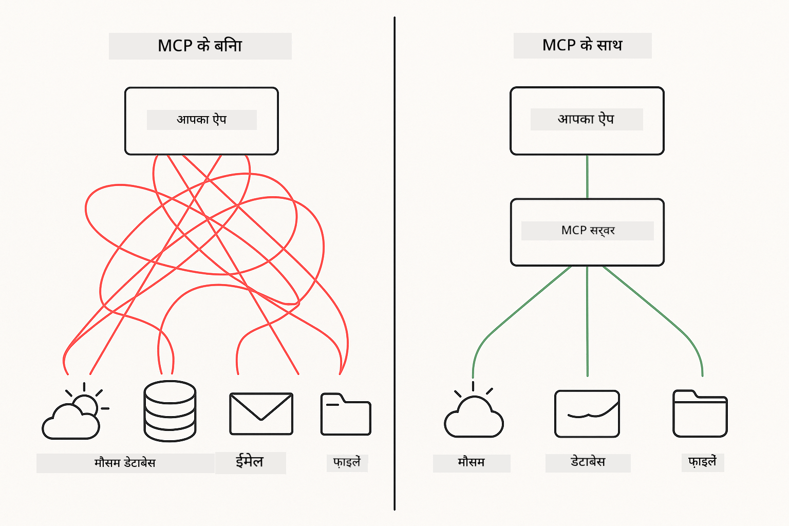
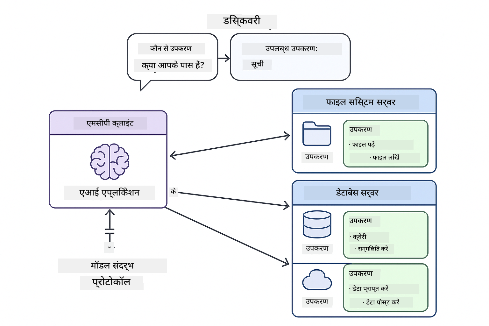

<!--
CO_OP_TRANSLATOR_METADATA:
{
  "original_hash": "c25ec1f10ef156c53e190cdf8b0711ab",
  "translation_date": "2025-12-13T17:44:24+00:00",
  "source_file": "05-mcp/README.md",
  "language_code": "hi"
}
-->
# Module 05: मॉडल संदर्भ प्रोटोकॉल (MCP)

## सामग्री तालिका

- [आप क्या सीखेंगे](../../../05-mcp)
- [MCP को समझना](../../../05-mcp)
- [MCP कैसे काम करता है](../../../05-mcp)
  - [सर्वर-क्लाइंट आर्किटेक्चर](../../../05-mcp)
  - [टूल डिस्कवरी](../../../05-mcp)
  - [ट्रांसपोर्ट मैकेनिज्म](../../../05-mcp)
- [पूर्वापेक्षाएँ](../../../05-mcp)
- [यह मॉड्यूल क्या कवर करता है](../../../05-mcp)
- [त्वरित शुरुआत](../../../05-mcp)
  - [उदाहरण 1: रिमोट कैलकुलेटर (स्ट्रीम करने योग्य HTTP)](../../../05-mcp)
  - [उदाहरण 2: फ़ाइल संचालन (Stdio)](../../../05-mcp)
  - [उदाहरण 3: गिट विश्लेषण (डॉकर)](../../../05-mcp)
- [मुख्य अवधारणाएँ](../../../05-mcp)
  - [ट्रांसपोर्ट चयन](../../../05-mcp)
  - [टूल डिस्कवरी](../../../05-mcp)
  - [सेशन प्रबंधन](../../../05-mcp)
  - [क्रॉस-प्लेटफ़ॉर्म विचार](../../../05-mcp)
- [MCP कब उपयोग करें](../../../05-mcp)
- [MCP इकोसिस्टम](../../../05-mcp)
- [बधाई हो!](../../../05-mcp)
  - [अगला क्या है?](../../../05-mcp)
- [समस्या निवारण](../../../05-mcp)

## आप क्या सीखेंगे

आपने संवादात्मक AI बनाया है, प्रॉम्प्ट्स में महारत हासिल की है, दस्तावेज़ों में प्रतिक्रियाओं को ग्राउंड किया है, और टूल्स के साथ एजेंट बनाए हैं। लेकिन वे सभी टूल्स आपके विशिष्ट एप्लिकेशन के लिए कस्टम बनाए गए थे। क्या होगा अगर आप अपने AI को एक मानकीकृत टूल इकोसिस्टम तक पहुंच दे सकें जिसे कोई भी बना और साझा कर सकता है?

मॉडल संदर्भ प्रोटोकॉल (MCP) बिल्कुल यही प्रदान करता है - AI एप्लिकेशन के लिए बाहरी टूल्स को खोजने और उपयोग करने का एक मानक तरीका। प्रत्येक डेटा स्रोत या सेवा के लिए कस्टम इंटीग्रेशन लिखने के बजाय, आप MCP सर्वरों से जुड़ते हैं जो अपनी क्षमताओं को एक सुसंगत प्रारूप में प्रदर्शित करते हैं। आपका AI एजेंट तब इन टूल्स को स्वचालित रूप से खोज और उपयोग कर सकता है।



*MCP से पहले: जटिल पॉइंट-टू-पॉइंट इंटीग्रेशन। MCP के बाद: एक प्रोटोकॉल, अनंत संभावनाएँ।*

## MCP को समझना

MCP AI विकास में एक मौलिक समस्या को हल करता है: हर इंटीग्रेशन कस्टम होता है। GitHub तक पहुंचना चाहते हैं? कस्टम कोड। फ़ाइलें पढ़ना चाहते हैं? कस्टम कोड। डेटाबेस क्वेरी करना चाहते हैं? कस्टम कोड। और ये कोई भी इंटीग्रेशन अन्य AI एप्लिकेशन के साथ काम नहीं करता।

MCP इसे मानकीकृत करता है। एक MCP सर्वर टूल्स को स्पष्ट विवरण और स्कीमाओं के साथ प्रदर्शित करता है। कोई भी MCP क्लाइंट जुड़ सकता है, उपलब्ध टूल्स को खोज सकता है, और उनका उपयोग कर सकता है। एक बार बनाएं, हर जगह उपयोग करें।



*मॉडल संदर्भ प्रोटोकॉल आर्किटेक्चर - मानकीकृत टूल डिस्कवरी और निष्पादन*

## MCP कैसे काम करता है

**सर्वर-क्लाइंट आर्किटेक्चर**

MCP क्लाइंट-सर्वर मॉडल का उपयोग करता है। सर्वर टूल्स प्रदान करते हैं - फ़ाइलें पढ़ना, डेटाबेस क्वेरी करना, API कॉल करना। क्लाइंट (आपका AI एप्लिकेशन) सर्वरों से जुड़ता है और उनके टूल्स का उपयोग करता है।

**टूल डिस्कवरी**

जब आपका क्लाइंट MCP सर्वर से जुड़ता है, तो वह पूछता है "आपके पास कौन से टूल्स हैं?" सर्वर उपलब्ध टूल्स की सूची के साथ जवाब देता है, प्रत्येक के विवरण और पैरामीटर स्कीमाओं के साथ। आपका AI एजेंट तब उपयोगकर्ता अनुरोधों के आधार पर कौन से टूल्स उपयोग करने हैं, तय कर सकता है।

**ट्रांसपोर्ट मैकेनिज्म**

MCP दो ट्रांसपोर्ट मैकेनिज्म परिभाषित करता है: रिमोट सर्वरों के लिए HTTP, स्थानीय प्रक्रियाओं (जिसमें Docker कंटेनर शामिल हैं) के लिए Stdio:


*MCP ट्रांसपोर्ट मैकेनिज्म: रिमोट सर्वरों के लिए HTTP, स्थानीय प्रक्रियाओं के लिए Stdio (जिसमें Docker कंटेनर शामिल हैं)*

**Streamable HTTP** - [StreamableHttpDemo.java](../../../05-mcp/src/main/java/com/example/langchain4j/mcp/StreamableHttpDemo.java)

रिमोट सर्वरों के लिए। आपका एप्लिकेशन नेटवर्क पर कहीं चल रहे सर्वर को HTTP अनुरोध भेजता है। रियल-टाइम संचार के लिए Server-Sent Events का उपयोग करता है।

```java
McpTransport httpTransport = new StreamableHttpMcpTransport.Builder()
    .url("http://localhost:3001/mcp")
    .timeout(Duration.ofSeconds(60))
    .logRequests(true)
    .logResponses(true)
    .build();
```

> **🤖 [GitHub Copilot](https://github.com/features/copilot) चैट के साथ प्रयास करें:** [`StreamableHttpDemo.java`](../../../05-mcp/src/main/java/com/example/langchain4j/mcp/StreamableHttpDemo.java) खोलें और पूछें:
> - "MCP सीधे टूल इंटीग्रेशन से कैसे अलग है जैसे Module 04 में?"
> - "एप्लिकेशन के बीच टूल साझा करने के लिए MCP के उपयोग के क्या लाभ हैं?"
> - "MCP सर्वरों से कनेक्शन विफलताओं या टाइमआउट को कैसे संभालूं?"

**Stdio** - [StdioTransportDemo.java](../../../05-mcp/src/main/java/com/example/langchain4j/mcp/StdioTransportDemo.java)

स्थानीय प्रक्रियाओं के लिए। आपका एप्लिकेशन एक subprocess के रूप में सर्वर शुरू करता है और मानक इनपुट/आउटपुट के माध्यम से संवाद करता है। फ़ाइल सिस्टम एक्सेस या कमांड-लाइन टूल्स के लिए उपयोगी।

```java
McpTransport stdioTransport = new StdioMcpTransport.Builder()
    .command(List.of(
        npmCmd, "exec",
        "@modelcontextprotocol/server-filesystem@0.6.2",
        resourcesDir
    ))
    .logEvents(false)
    .build();
```

> **🤖 [GitHub Copilot](https://github.com/features/copilot) चैट के साथ प्रयास करें:** [`StdioTransportDemo.java`](../../../05-mcp/src/main/java/com/example/langchain4j/mcp/StdioTransportDemo.java) खोलें और पूछें:
> - "Stdio ट्रांसपोर्ट कैसे काम करता है और मुझे इसे HTTP के मुकाबले कब उपयोग करना चाहिए?"
> - "LangChain4j MCP सर्वर प्रक्रियाओं के जीवनचक्र का प्रबंधन कैसे करता है?"
> - "AI को फ़ाइल सिस्टम की पहुंच देने के सुरक्षा निहितार्थ क्या हैं?"

**Docker (Stdio का उपयोग करता है)** - [GitRepositoryAnalyzer.java](../../../05-mcp/src/main/java/com/example/langchain4j/mcp/GitRepositoryAnalyzer.java)

कंटेनराइज्ड सेवाओं के लिए। `docker run` के माध्यम से Docker कंटेनर के साथ संवाद करने के लिए stdio ट्रांसपोर्ट का उपयोग करता है। जटिल निर्भरताओं या पृथक वातावरण के लिए अच्छा।

```java
McpTransport dockerTransport = new StdioMcpTransport.Builder()
    .command(List.of(
        "docker", "run",
        "-e", "GITHUB_PERSONAL_ACCESS_TOKEN=" + System.getenv("GITHUB_TOKEN"),
        "-v", volumeMapping,
        "-i", "mcp/git"
    ))
    .logEvents(true)
    .build();
```

> **🤖 [GitHub Copilot](https://github.com/features/copilot) चैट के साथ प्रयास करें:** [`GitRepositoryAnalyzer.java`](../../../05-mcp/src/main/java/com/example/langchain4j/mcp/GitRepositoryAnalyzer.java) खोलें और पूछें:
> - "Docker ट्रांसपोर्ट MCP सर्वरों को कैसे पृथक करता है और इसके क्या लाभ हैं?"
> - "होस्ट और MCP कंटेनरों के बीच डेटा साझा करने के लिए वॉल्यूम माउंट्स को कैसे कॉन्फ़िगर करें?"
> - "उत्पादन में Docker-आधारित MCP सर्वर जीवनचक्र प्रबंधन के लिए सर्वोत्तम प्रथाएँ क्या हैं?"

## उदाहरण चलाना

### पूर्वापेक्षाएँ

- Java 21+, Maven 3.9+
- Node.js 16+ और npm (MCP सर्वरों के लिए)
- **Docker Desktop** - उदाहरण 3 के लिए **चल रहा होना चाहिए** (केवल इंस्टॉल नहीं)
- GitHub पर्सनल एक्सेस टोकन `.env` फ़ाइल में कॉन्फ़िगर किया हुआ (Module 00 से)

> **नोट:** यदि आपने अभी तक अपना GitHub टोकन सेटअप नहीं किया है, तो निर्देशों के लिए [Module 00 - Quick Start](../00-quick-start/README.md) देखें।

> **⚠️ Docker उपयोगकर्ताओं के लिए:** उदाहरण 3 चलाने से पहले, `docker ps` के साथ Docker Desktop चल रहा है यह सत्यापित करें। यदि कनेक्शन त्रुटियाँ दिखती हैं, तो Docker Desktop शुरू करें और लगभग 30 सेकंड तक प्रतीक्षा करें।

## त्वरित शुरुआत

**VS Code का उपयोग करते हुए:** एक्सप्लोरर में किसी भी डेमो फ़ाइल पर राइट-क्लिक करें और **"Run Java"** चुनें, या रन और डिबग पैनल से लॉन्च कॉन्फ़िगरेशन का उपयोग करें (पहले सुनिश्चित करें कि आपने अपना टोकन `.env` फ़ाइल में जोड़ा है)।

**Maven का उपयोग करते हुए:** वैकल्पिक रूप से, आप नीचे दिए गए उदाहरणों के साथ कमांड लाइन से चला सकते हैं।

**⚠️ महत्वपूर्ण:** कुछ उदाहरणों के लिए पूर्वापेक्षाएँ हैं (जैसे MCP सर्वर शुरू करना या Docker इमेज बनाना)। चलाने से पहले प्रत्येक उदाहरण की आवश्यकताएँ जांचें।

### उदाहरण 1: रिमोट कैलकुलेटर (स्ट्रीम करने योग्य HTTP)

यह नेटवर्क-आधारित टूल इंटीग्रेशन को प्रदर्शित करता है।

**⚠️ पूर्वापेक्षा:** आपको पहले MCP सर्वर शुरू करना होगा (नीचे टर्मिनल 1 देखें)।

**टर्मिनल 1 - MCP सर्वर शुरू करें:**

**Bash:**
```bash
git clone https://github.com/modelcontextprotocol/servers.git
cd servers/src/everything
npm install
node dist/streamableHttp.js
```

**PowerShell:**
```powershell
git clone https://github.com/modelcontextprotocol/servers.git
cd servers/src/everything
npm install
node dist/streamableHttp.js
```

**टर्मिनल 2 - उदाहरण चलाएं:**

**VS Code का उपयोग करते हुए:** `StreamableHttpDemo.java` पर राइट-क्लिक करें और **"Run Java"** चुनें।

**Maven का उपयोग करते हुए:**

**Bash:**
```bash
export GITHUB_TOKEN=your_token_here
cd 05-mcp
mvn compile exec:java -Dexec.mainClass=com.example.langchain4j.mcp.StreamableHttpDemo
```

**PowerShell:**
```powershell
$env:GITHUB_TOKEN=your_token_here
cd 05-mcp
mvn --% compile exec:java -Dexec.mainClass=com.example.langchain4j.mcp.StreamableHttpDemo
```

एजेंट उपलब्ध टूल्स को खोजता है, फिर कैलकुलेटर का उपयोग करके जोड़ करता है।

### उदाहरण 2: फ़ाइल संचालन (Stdio)

यह स्थानीय subprocess-आधारित टूल्स को प्रदर्शित करता है।

**✅ कोई पूर्वापेक्षा आवश्यक नहीं** - MCP सर्वर स्वचालित रूप से शुरू हो जाता है।

**VS Code का उपयोग करते हुए:** `StdioTransportDemo.java` पर राइट-क्लिक करें और **"Run Java"** चुनें।

**Maven का उपयोग करते हुए:**

**Bash:**
```bash
export GITHUB_TOKEN=your_token_here
cd 05-mcp
mvn compile exec:java -Dexec.mainClass=com.example.langchain4j.mcp.StdioTransportDemo
```

**PowerShell:**
```powershell
$env:GITHUB_TOKEN=your_token_here
cd 05-mcp
mvn --% compile exec:java -Dexec.mainClass=com.example.langchain4j.mcp.StdioTransportDemo
```

एप्लिकेशन स्वचालित रूप से एक फ़ाइल सिस्टम MCP सर्वर शुरू करता है और एक स्थानीय फ़ाइल पढ़ता है। ध्यान दें कि subprocess प्रबंधन आपके लिए कैसे संभाला जाता है।

**अपेक्षित आउटपुट:**
```
Assistant response: The content of the file is "Kaboom!".
```

### उदाहरण 3: गिट विश्लेषण (डॉकर)

यह कंटेनराइज्ड टूल सर्वरों को प्रदर्शित करता है।

**⚠️ पूर्वापेक्षाएँ:** 
1. **Docker Desktop चल रहा होना चाहिए** (केवल इंस्टॉल नहीं)
2. **Windows उपयोगकर्ता:** WSL 2 मोड की सिफारिश की जाती है (Docker Desktop Settings → General → "Use the WSL 2 based engine")। Hyper-V मोड के लिए मैनुअल फ़ाइल शेयरिंग कॉन्फ़िगरेशन आवश्यक है।
3. आपको पहले Docker इमेज बनानी होगी (नीचे टर्मिनल 1 देखें)

**Docker चल रहा है यह सत्यापित करें:**

**Bash:**
```bash
docker ps  # कंटेनर सूची दिखानी चाहिए, त्रुटि नहीं
```

**PowerShell:**
```powershell
docker ps  # कंटेनर सूची दिखानी चाहिए, त्रुटि नहीं
```

यदि आपको "Cannot connect to Docker daemon" या "The system cannot find the file specified" जैसी त्रुटि मिलती है, तो Docker Desktop शुरू करें और इसे प्रारंभ करने के लिए लगभग 30 सेकंड प्रतीक्षा करें।

**समस्या निवारण:**
- यदि AI खाली रिपॉजिटरी या कोई फ़ाइल नहीं रिपोर्ट करता है, तो वॉल्यूम माउंट (`-v`) काम नहीं कर रहा है।
- **Windows Hyper-V उपयोगकर्ता:** प्रोजेक्ट डायरेक्टरी को Docker Desktop Settings → Resources → File sharing में जोड़ें, फिर Docker Desktop पुनः प्रारंभ करें।
- **सिफारिश की गई समाधान:** स्वचालित फ़ाइल शेयरिंग के लिए WSL 2 मोड पर स्विच करें (Settings → General → "Use the WSL 2 based engine" सक्षम करें)।

**टर्मिनल 1 - Docker इमेज बनाएं:**

**Bash:**
```bash
cd servers/src/git
docker build -t mcp/git .
```

**PowerShell:**
```powershell
cd servers/src/git
docker build -t mcp/git .
```

**टर्मिनल 2 - विश्लेषक चलाएं:**

**VS Code का उपयोग करते हुए:** `GitRepositoryAnalyzer.java` पर राइट-क्लिक करें और **"Run Java"** चुनें।

**Maven का उपयोग करते हुए:**

**Bash:**
```bash
export GITHUB_TOKEN=your_token_here
cd 05-mcp
mvn compile exec:java -Dexec.mainClass=com.example.langchain4j.mcp.GitRepositoryAnalyzer
```

**PowerShell:**
```powershell
$env:GITHUB_TOKEN=your_token_here
cd 05-mcp
mvn --% compile exec:java -Dexec.mainClass=com.example.langchain4j.mcp.GitRepositoryAnalyzer
```

एप्लिकेशन एक Docker कंटेनर लॉन्च करता है, आपका रिपॉजिटरी माउंट करता है, और AI एजेंट के माध्यम से रिपॉजिटरी संरचना और सामग्री का विश्लेषण करता है।

## मुख्य अवधारणाएँ

**ट्रांसपोर्ट चयन**

अपने टूल्स के स्थान के आधार पर चुनें:
- रिमोट सेवाएँ → स्ट्रीम करने योग्य HTTP
- स्थानीय फ़ाइल सिस्टम → Stdio
- जटिल निर्भरताएँ → Docker

**टूल डिस्कवरी**

MCP क्लाइंट जुड़ते समय उपलब्ध टूल्स को स्वचालित रूप से खोजते हैं। आपका AI एजेंट टूल विवरण देखता है और उपयोगकर्ता के अनुरोध के आधार पर कौन से टूल्स उपयोग करने हैं, तय करता है।

**सेशन प्रबंधन**

स्ट्रीम करने योग्य HTTP ट्रांसपोर्ट सेशन्स बनाए रखता है, जिससे रिमोट सर्वरों के साथ स्थिति आधारित इंटरैक्शन संभव होता है। Stdio और Docker ट्रांसपोर्ट आमतौर पर स्टेटलेस होते हैं।

**क्रॉस-प्लेटफ़ॉर्म विचार**

उदाहरण प्लेटफ़ॉर्म भिन्नताओं को स्वचालित रूप से संभालते हैं (Windows बनाम Unix कमांड भिन्नताएँ, Docker के लिए पथ रूपांतरण)। यह विभिन्न वातावरणों में उत्पादन तैनाती के लिए महत्वपूर्ण है।

## MCP कब उपयोग करें

**MCP का उपयोग करें जब:**
- आप मौजूदा टूल इकोसिस्टम का लाभ उठाना चाहते हैं
- ऐसे टूल बना रहे हैं जिन्हें कई एप्लिकेशन उपयोग करेंगे
- मानक प्रोटोकॉल के साथ तृतीय-पक्ष सेवाओं को एकीकृत कर रहे हैं
- आप बिना कोड परिवर्तन के टूल कार्यान्वयन बदलना चाहते हैं

**कस्टम टूल्स (Module 04) का उपयोग करें जब:**
- एप्लिकेशन-विशिष्ट कार्यक्षमता बना रहे हों
- प्रदर्शन महत्वपूर्ण हो (MCP में ओवरहेड होता है)
- आपके टूल सरल हों और पुन: उपयोग न हों
- आपको निष्पादन पर पूर्ण नियंत्रण चाहिए

## MCP इकोसिस्टम

मॉडल संदर्भ प्रोटोकॉल एक खुला मानक है जिसमें बढ़ता हुआ इकोसिस्टम है:

- सामान्य कार्यों के लिए आधिकारिक MCP सर्वर (फ़ाइल सिस्टम, Git, डेटाबेस)
- विभिन्न सेवाओं के लिए समुदाय-योगदान किए गए सर्वर
- मानकीकृत टूल विवरण और स्कीमा
- क्रॉस-फ्रेमवर्क संगतता (किसी भी MCP क्लाइंट के साथ काम करता है)

इस मानकीकरण का अर्थ है कि एक AI एप्लिकेशन के लिए बनाए गए टूल अन्य के साथ भी काम करते हैं, जिससे क्षमताओं का साझा इकोसिस्टम बनता है।

## बधाई हो!

आपने LangChain4j for Beginners कोर्स पूरा कर लिया है। आपने सीखा है:

- मेमोरी के साथ संवादात्मक AI कैसे बनाएं (Module 01)
- विभिन्न कार्यों के लिए प्रॉम्प्ट इंजीनियरिंग पैटर्न (Module 02)
- अपने दस्तावेज़ों में प्रतिक्रियाओं को RAG के साथ ग्राउंड करना (Module 03)
- कस्टम टूल्स के साथ AI एजेंट बनाना (Module 04)
- MCP के माध्यम से मानकीकृत टूल्स को एकीकृत करना (Module 05)

अब आपके पास उत्पादन AI एप्लिकेशन बनाने की नींव है। आपने जो अवधारणाएँ सीखी हैं वे विशिष्ट फ्रेमवर्क या मॉडलों से स्वतंत्र हैं - ये AI इंजीनियरिंग के मौलिक पैटर्न हैं।

### अगला क्या है?

मॉड्यूल पूरा करने के बाद, LangChain4j परीक्षण अवधारणाओं को क्रियान्वित देखने के लिए [Testing Guide](../docs/TESTING.md) का अन्वेषण करें।

**आधिकारिक संसाधन:**
- [LangChain4j दस्तावेज़](https://docs.langchain4j.dev/) - व्यापक गाइड और API संदर्भ
- [LangChain4j GitHub](https://github.com/langchain4j/langchain4j) - स्रोत कोड और उदाहरण
- [LangChain4j ट्यूटोरियल](https://docs.langchain4j.dev/tutorials/) - विभिन्न उपयोग मामलों के लिए चरण-दर-चरण ट्यूटोरियल

इस कोर्स को पूरा करने के लिए धन्यवाद!

---

**नेविगेशन:** [← पिछला: Module 04 - Tools](../04-tools/README.md) | [मुख्य पृष्ठ पर वापस जाएं](../README.md)

---

## समस्या निवारण

### PowerShell Maven कमांड सिंटैक्स
**समस्या**: Maven कमांड त्रुटि `Unknown lifecycle phase ".mainClass=..."` के साथ विफल हो जाती हैं

**कारण**: PowerShell `=` को एक वेरिएबल असाइनमेंट ऑपरेटर के रूप में व्याख्यायित करता है, जिससे Maven प्रॉपर्टी सिंटैक्स टूट जाता है

**समाधान**: Maven कमांड से पहले stop-parsing ऑपरेटर `--%` का उपयोग करें:

**PowerShell:**
```powershell
mvn --% compile exec:java -Dexec.mainClass=com.example.langchain4j.mcp.StreamableHttpDemo
```

**Bash:**
```bash
mvn compile exec:java -Dexec.mainClass=com.example.langchain4j.mcp.StreamableHttpDemo
```

`--%` ऑपरेटर PowerShell को शेष सभी आर्गुमेंट्स को बिना व्याख्या किए सीधे Maven को पास करने के लिए कहता है।

### Docker कनेक्शन समस्याएँ

**समस्या**: Docker कमांड "Cannot connect to Docker daemon" या "The system cannot find the file specified" के साथ विफल हो जाती हैं

**कारण**: Docker Desktop चल नहीं रहा है या पूरी तरह से इनिशियलाइज़ नहीं हुआ है

**समाधान**: 
1. Docker Desktop शुरू करें
2. पूरी इनिशियलाइज़ेशन के लिए लगभग 30 सेकंड प्रतीक्षा करें
3. `docker ps` के साथ सत्यापित करें (यह कंटेनर सूची दिखानी चाहिए, त्रुटि नहीं)
4. फिर अपना उदाहरण चलाएं

### Windows Docker वॉल्यूम माउंटिंग

**समस्या**: Git रिपॉजिटरी एनालाइज़र खाली रिपॉजिटरी या कोई फाइलें नहीं दिखाता

**कारण**: फाइल शेयरिंग कॉन्फ़िगरेशन के कारण वॉल्यूम माउंट (`-v`) काम नहीं कर रहा है

**समाधान**:
- **सिफारिश की गई:** WSL 2 मोड में स्विच करें (Docker Desktop Settings → General → "Use the WSL 2 based engine")
- **वैकल्पिक (Hyper-V):** प्रोजेक्ट डायरेक्टरी को Docker Desktop Settings → Resources → File sharing में जोड़ें, फिर Docker Desktop को पुनः प्रारंभ करें

---

<!-- CO-OP TRANSLATOR DISCLAIMER START -->
**अस्वीकरण**:  
यह दस्तावेज़ AI अनुवाद सेवा [Co-op Translator](https://github.com/Azure/co-op-translator) का उपयोग करके अनुवादित किया गया है। जबकि हम सटीकता के लिए प्रयासरत हैं, कृपया ध्यान दें कि स्वचालित अनुवादों में त्रुटियाँ या अशुद्धियाँ हो सकती हैं। मूल दस्तावेज़ अपनी मूल भाषा में ही अधिकारिक स्रोत माना जाना चाहिए। महत्वपूर्ण जानकारी के लिए, पेशेवर मानव अनुवाद की सलाह दी जाती है। इस अनुवाद के उपयोग से उत्पन्न किसी भी गलतफहमी या गलत व्याख्या के लिए हम जिम्मेदार नहीं हैं।
<!-- CO-OP TRANSLATOR DISCLAIMER END -->