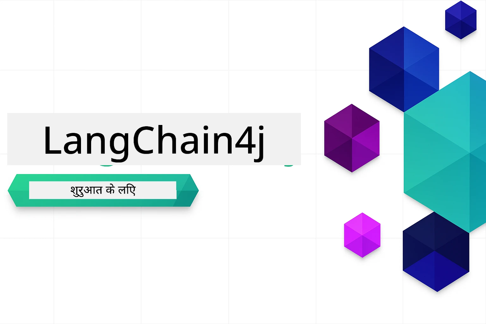

### 🌐 बहुभाषी समर्थन

#### GitHub Action के माध्यम से समर्थित (स्वचालित और हमेशा अपडेट)

<!-- CO-OP TRANSLATOR LANGUAGES TABLE START -->
[Arabic](../ar/README.md) | [Bengali](../bn/README.md) | [Bulgarian](../bg/README.md) | [Burmese (Myanmar)](../my/README.md) | [Chinese (Simplified)](../zh-CN/README.md) | [Chinese (Traditional, Hong Kong)](../zh-HK/README.md) | [Chinese (Traditional, Macau)](../zh-MO/README.md) | [Chinese (Traditional, Taiwan)](../zh-TW/README.md) | [Croatian](../hr/README.md) | [Czech](../cs/README.md) | [Danish](../da/README.md) | [Dutch](../nl/README.md) | [Estonian](../et/README.md) | [Finnish](../fi/README.md) | [French](../fr/README.md) | [German](../de/README.md) | [Greek](../el/README.md) | [Hebrew](../he/README.md) | [Hindi](./README.md) | [Hungarian](../hu/README.md) | [Indonesian](../id/README.md) | [Italian](../it/README.md) | [Japanese](../ja/README.md) | [Kannada](../kn/README.md) | [Korean](../ko/README.md) | [Lithuanian](../lt/README.md) | [Malay](../ms/README.md) | [Malayalam](../ml/README.md) | [Marathi](../mr/README.md) | [Nepali](../ne/README.md) | [Nigerian Pidgin](../pcm/README.md) | [Norwegian](../no/README.md) | [Persian (Farsi)](../fa/README.md) | [Polish](../pl/README.md) | [Portuguese (Brazil)](../pt-BR/README.md) | [Portuguese (Portugal)](../pt-PT/README.md) | [Punjabi (Gurmukhi)](../pa/README.md) | [Romanian](../ro/README.md) | [Russian](../ru/README.md) | [Serbian (Cyrillic)](../sr/README.md) | [Slovak](../sk/README.md) | [Slovenian](../sl/README.md) | [Spanish](../es/README.md) | [Swahili](../sw/README.md) | [Swedish](../sv/README.md) | [Tagalog (Filipino)](../tl/README.md) | [Tamil](../ta/README.md) | [Telugu](../te/README.md) | [Thai](../th/README.md) | [Turkish](../tr/README.md) | [Ukrainian](../uk/README.md) | [Urdu](../ur/README.md) | [Vietnamese](../vi/README.md)

> **स्थानीय रूप से क्लोन करना पसंद है?**

> इस रिपॉजिटरी में 50+ भाषा अनुवाद शामिल हैं जो डाउनलोड आकार को काफी बढ़ा देते हैं। अनुवादों के बिना क्लोन करने के लिए, sparse checkout का उपयोग करें:
> ```bash
> git clone --filter=blob:none --sparse https://github.com/microsoft/LangChain4j-for-Beginners.git
> cd LangChain4j-for-Beginners
> git sparse-checkout set --no-cone '/*' '!translations' '!translated_images'
> ```
> यह आपको कोर्स पूरा करने के लिए आवश्यक सब कुछ बहुत तेज़ डाउनलोड के साथ देता है।
<!-- CO-OP TRANSLATOR LANGUAGES TABLE END -->

# शुरुआती लोगों के लिए LangChain4j

LangChain4j और Azure OpenAI GPT-5 के साथ AI एप्लिकेशन बनाने के लिए एक कोर्स, बुनियादी चैट से लेकर AI एजेंट तक।

**LangChain4j में नया?** मुख्य शब्दों और अवधारणाओं की परिभाषाओं के लिए [शब्दावली](docs/GLOSSARY.md) देखें।

## विषय सूची

1. [त्वरित आरंभ](00-quick-start/README.md) - LangChain4j के साथ शुरू करें
2. [परिचय](01-introduction/README.md) - LangChain4j के मूलभूत सिद्धांत सीखें
3. [प्रॉम्प्ट इंजीनियरिंग](02-prompt-engineering/README.md) - प्रभावी प्रॉम्प्ट डिज़ाइन में महारत हासिल करें
4. [RAG (रिट्रीवल-अगमेंटेड जनरेशन)](03-rag/README.md) - बुद्धिमान ज्ञान आधारित सिस्टम बनाएं
5. [उपकरण](04-tools/README.md) - बाहरी उपकरणों और सरल सहायक उपकरण को एकीकृत करें
6. [MCP (मॉडल कॉन्टेक्स्ट प्रोटोकॉल)](05-mcp/README.md) - मॉडल कॉन्टेक्स्ट प्रोटोकॉल (MCP) और एजेंटिक मॉड्यूल के साथ काम करें
---

## सीखने का मार्ग

> **त्वरित आरंभ**

1. इस रिपॉजिटरी को अपने GitHub खाते में Fork करें
2. क्लिक करें **Code** → **Codespaces** टैब → **...** → **New with options...**
3. डिफ़ॉल्ट सेटिंग्स का उपयोग करें – यह कोर्स के लिए तैयार किए गए डेवलपमेंट कंटेनर का चयन करेगा
4. क्लिक करें **Create codespace**
5. वातावरण तैयार होने के लिए 5-10 मिनट प्रतीक्षा करें
6. सीधे [त्वरित आरंभ](./00-quick-start/README.md) पर जाएं और शुरू करें!

मॉड्यूल पूरा करने के बाद, LangChain4j परीक्षण अवधारणाओं को देखने के लिए [परीक्षण मार्गदर्शिका](docs/TESTING.md) खोजें।

> **नोट:** यह प्रशिक्षण GitHub मॉडल और Azure OpenAI दोनों का उपयोग करता है। [त्वरित आरंभ](00-quick-start/README.md) मॉड्यूल GitHub मॉडल का उपयोग करता है (Azure सदस्यता आवश्यक नहीं), जबकि मॉड्यूल 1-5 Azure OpenAI का उपयोग करते हैं।

## GitHub Copilot के साथ सीखना

जल्दी कोडिंग शुरू करने के लिए, इस प्रोजेक्ट को GitHub Codespace या आपके स्थानीय IDE में दिए गए devcontainer के साथ खोलें। इस कोर्स में उपयोग किया गया devcontainer GitHub Copilot के साथ पूर्व-कॉन्फ़िगर किया गया है, जो AI युग्मित प्रोग्रामिंग के लिए है।

प्रत्येक कोड उदाहरण में सुझाए गए प्रश्न शामिल हैं जिन्हें आप GitHub Copilot से पूछ सकते हैं ताकि आपकी समझ गहरी हो सके। खोजें 💡/🤖 संकेत:

- **Java फ़ाइल हेडर** - प्रत्येक उदाहरण के लिए विशिष्ट प्रश्न
- **मॉड्यूल README** - कोड उदाहरणों के बाद खोज प्रेरणा

**कैसे उपयोग करें:** कोई भी कोड फ़ाइल खोलें और सुझाए गए प्रश्न Copilot से पूछें। इसके पास पूरे कोडबेस का संदर्भ होता है और यह समझा सकता है, विस्तारित कर सकता है, और विकल्प सुझा सकता है।

और जानना चाहते हैं? देखें [AI युग्मित प्रोग्रामिंग के लिए Copilot](https://aka.ms/GitHubCopilotAI).

## अतिरिक्त संसाधन

<!-- CO-OP TRANSLATOR OTHER COURSES START -->
### LangChain
[](https://aka.ms/langchain4j-for-beginners)
[](https://aka.ms/langchainjs-for-beginners?WT.mc_id=m365-94501-dwahlin)

---

### Azure / Edge / MCP / एजेंट्स
[](https://github.com/microsoft/AZD-for-beginners?WT.mc_id=academic-105485-koreyst)
[](https://github.com/microsoft/edgeai-for-beginners?WT.mc_id=academic-105485-koreyst)
[](https://github.com/microsoft/mcp-for-beginners?WT.mc_id=academic-105485-koreyst)
[](https://github.com/microsoft/ai-agents-for-beginners?WT.mc_id=academic-105485-koreyst)

---
 
### जनरेटिव AI श्रृंखला
[](https://github.com/microsoft/generative-ai-for-beginners?WT.mc_id=academic-105485-koreyst)
[-9333EA?style=for-the-badge&labelColor=E5E7EB&color=9333EA)](https://github.com/microsoft/Generative-AI-for-beginners-dotnet?WT.mc_id=academic-105485-koreyst)
[-C084FC?style=for-the-badge&labelColor=E5E7EB&color=C084FC)](https://github.com/microsoft/generative-ai-for-beginners-java?WT.mc_id=academic-105485-koreyst)
[-E879F9?style=for-the-badge&labelColor=E5E7EB&color=E879F9)](https://github.com/microsoft/generative-ai-with-javascript?WT.mc_id=academic-105485-koreyst)

---
 
### कोर लर्निंग
[](https://aka.ms/ml-beginners?WT.mc_id=academic-105485-koreyst)
[](https://aka.ms/datascience-beginners?WT.mc_id=academic-105485-koreyst)
[](https://aka.ms/ai-beginners?WT.mc_id=academic-105485-koreyst)
[](https://github.com/microsoft/Security-101?WT.mc_id=academic-96948-sayoung)
[](https://aka.ms/webdev-beginners?WT.mc_id=academic-105485-koreyst)
[](https://aka.ms/iot-beginners?WT.mc_id=academic-105485-koreyst)
[](https://github.com/microsoft/xr-development-for-beginners?WT.mc_id=academic-105485-koreyst)

---
 
### Copilot श्रृंखला

[](https://aka.ms/GitHubCopilotAI?WT.mc_id=academic-105485-koreyst)
[](https://github.com/microsoft/mastering-github-copilot-for-dotnet-csharp-developers?WT.mc_id=academic-105485-koreyst)
[](https://github.com/microsoft/CopilotAdventures?WT.mc_id=academic-105485-koreyst)
<!-- CO-OP TRANSLATOR OTHER COURSES END -->

## सहायता प्राप्त करना

यदि आप फंस जाते हैं या AI ऐप बनाने के बारे में कोई प्रश्न हैं, तो शामिल हों:

[](https://aka.ms/foundry/discord)

यदि आपके पास उत्पाद प्रतिक्रिया या निर्माण के दौरान त्रुटियाँ हैं तो जाएं:

[](https://aka.ms/foundry/forum)

## लाइसेंस

MIT लाइसेंस - विवरण के लिए [LICENSE](../../LICENSE) फ़ाइल देखें।

---

<!-- CO-OP TRANSLATOR DISCLAIMER START -->
**अस्वीकरण**:  
यह दस्तावेज़ AI अनुवाद सेवा [Co-op Translator](https://github.com/Azure/co-op-translator) का उपयोग करके अनुवादित किया गया है। जबकि हम सटीकता के लिए प्रयासरत रहते हैं, कृपया ध्यान दें कि स्वचालित अनुवादों में त्रुटियाँ या अशुद्धियाँ हो सकती हैं। मूल दस्तावेज़ अपनी मूल भाषा में प्रामाणिक स्रोत माना जाना चाहिए। महत्वपूर्ण जानकारी के लिए पेशेवर मानव अनुवाद की सिफारिश की जाती है। इस अनुवाद के उपयोग से उत्पन्न किसी भी गलतफहमी या गलत व्याख्या के लिए हम उत्तरदायी नहीं हैं।
<!-- CO-OP TRANSLATOR DISCLAIMER END -->