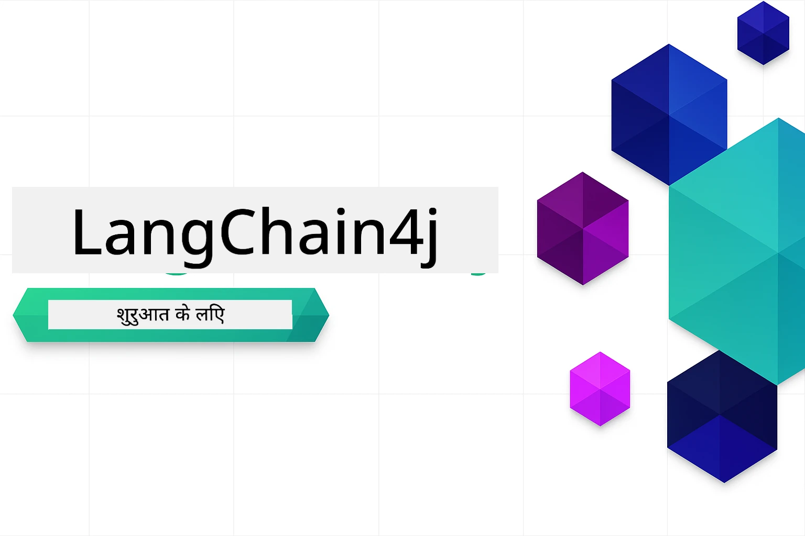

# शुरुआत के लिए LangChain4j

LangChain4j और Azure OpenAI GPT-5.2 के साथ AI एप्लिकेशन बनाने के लिए एक कोर्स, बेसिक चैट से लेकर AI एजेंट्स तक।

### 🌐 बहुभाषी समर्थन

#### GitHub Action के माध्यम से समर्थित (स्वचालित और हमेशा अपडेटेड)

<!-- CO-OP TRANSLATOR LANGUAGES TABLE START -->
[Arabic](../ar/README.md) | [Bengali](../bn/README.md) | [Bulgarian](../bg/README.md) | [Burmese (Myanmar)](../my/README.md) | [Chinese (Simplified)](../zh-CN/README.md) | [Chinese (Traditional, Hong Kong)](../zh-HK/README.md) | [Chinese (Traditional, Macau)](../zh-MO/README.md) | [Chinese (Traditional, Taiwan)](../zh-TW/README.md) | [Croatian](../hr/README.md) | [Czech](../cs/README.md) | [Danish](../da/README.md) | [Dutch](../nl/README.md) | [Estonian](../et/README.md) | [Finnish](../fi/README.md) | [French](../fr/README.md) | [German](../de/README.md) | [Greek](../el/README.md) | [Hebrew](../he/README.md) | [Hindi](./README.md) | [Hungarian](../hu/README.md) | [Indonesian](../id/README.md) | [Italian](../it/README.md) | [Japanese](../ja/README.md) | [Kannada](../kn/README.md) | [Khmer](../km/README.md) | [Korean](../ko/README.md) | [Lithuanian](../lt/README.md) | [Malay](../ms/README.md) | [Malayalam](../ml/README.md) | [Marathi](../mr/README.md) | [Nepali](../ne/README.md) | [Nigerian Pidgin](../pcm/README.md) | [Norwegian](../no/README.md) | [Persian (Farsi)](../fa/README.md) | [Polish](../pl/README.md) | [Portuguese (Brazil)](../pt-BR/README.md) | [Portuguese (Portugal)](../pt-PT/README.md) | [Punjabi (Gurmukhi)](../pa/README.md) | [Romanian](../ro/README.md) | [Russian](../ru/README.md) | [Serbian (Cyrillic)](../sr/README.md) | [Slovak](../sk/README.md) | [Slovenian](../sl/README.md) | [Spanish](../es/README.md) | [Swahili](../sw/README.md) | [Swedish](../sv/README.md) | [Tagalog (Filipino)](../tl/README.md) | [Tamil](../ta/README.md) | [Telugu](../te/README.md) | [Thai](../th/README.md) | [Turkish](../tr/README.md) | [Ukrainian](../uk/README.md) | [Urdu](../ur/README.md) | [Vietnamese](../vi/README.md)

> **स्थानीय क्लोन करना पसंद करते हैं?**
>
> इस रिपॉजिटरी में 50+ भाषा अनुवाद शामिल हैं जो डाउनलोड साइज को काफी बढ़ा देते हैं। अनुवादों के बिना क्लोन करने के लिए, sparse checkout का उपयोग करें:
>
> **Bash / macOS / Linux:**
> ```bash
> git clone --filter=blob:none --sparse https://github.com/microsoft/LangChain4j-for-Beginners.git
> cd LangChain4j-for-Beginners
> git sparse-checkout set --no-cone '/*' '!translations' '!translated_images'
> ```
>
> **CMD (Windows):**
> ```cmd
> git clone --filter=blob:none --sparse https://github.com/microsoft/LangChain4j-for-Beginners.git
> cd LangChain4j-for-Beginners
> git sparse-checkout set --no-cone "/*" "!translations" "!translated_images"
> ```
>
> इससे आपको कोर्स पूरा करने के लिए जरूरी हर चीज़ बहुत तेज़ डाउनलोड के साथ मिल जाएगी।
<!-- CO-OP TRANSLATOR LANGUAGES TABLE END -->

## सामग्री सूची

1. [परिचय](01-introduction/README.md) - LangChain4j के मूल सिद्धांत सीखें
2. [प्रांप्ट इंजीनियरिंग](02-prompt-engineering/README.md) - प्रभावी प्रांप्ट डिज़ाइन में निपुण बनें
3. [RAG (रिट्रीवल-ऑगमेंटेड जेनरेशन)](03-rag/README.md) - बुद्धिमान ज्ञान-आधारित सिस्टम बनाएं
4. [उपकरण](04-tools/README.md) - बाहरी उपकरण और सरल सहायक जोड़े
5. [MCP (मॉडल कॉन्टेक्सट प्रोटोकॉल)](05-mcp/README.md) - मॉडल कॉन्टेक्सट प्रोटोकॉल (MCP) और एजेंटिक मॉड्यूल्स के साथ काम करें

### वीडियो वॉकथ्रू

हर मॉड्यूल के साथ एक लाइव सत्र होता है जहाँ हम अवधारणाओं और कोड को कदम-दर-कदम समझाते हैं।

| मॉड्यूल | वीडियो |
|--------|-------|
| 01 - परिचय | [LangChain4j के साथ शुरुआत](https://www.youtube.com/live/nl_troDm8rQ) |
| 02 - प्रांप्ट इंजीनियरिंग | [LangChain4j के साथ प्रांप्ट इंजीनियरिंग](https://www.youtube.com/live/PJ6aBaE6bog) |
| 03 - RAG | [LangChain4j के साथ RAG](https://www.youtube.com/watch?v=_olq75ZH_eY) |
| 04 - उपकरण और 05 - MCP | [उपकरणों और MCP के साथ AI एजेंट्स](https://www.youtube.com/watch?v=O_J30kZc0rw) |

---

## सीखने का मार्ग

**LangChain4j में नए हैं?** प्रमुख शब्दों और अवधारणाओं की परिभाषाओं के लिए [शब्दावली](docs/GLOSSARY.md) देखें।

> **शीघ्र आरंभ**

1. इस रिपॉजिटरी को अपने GitHub खाते में Fork करें
2. क्लिक करें **Code** → **Codespaces** टैब → **...** → **New with options...**
3. डिफ़ॉल्ट विकल्प चुनें – यह इस कोर्स के लिए बनाए गए डेवेलपमेंट कंटेनर को सेलेक्ट करेगा
4. क्लिक करें **Create codespace**
5. पर्यावरण तैयार होने के लिए 5-10 मिनट प्रतीक्षा करें
6. शुरू करने के लिए सीधे [परिचय](./01-introduction/README.md) पर जाएं!

मॉड्यूल पूरा करने के बाद, LangChain4j के टेस्टिंग कॉन्सेप्ट्स को व्यावहारिक रूप में देखने के लिए [टेस्टिंग गाइड](docs/TESTING.md) देखें।

> **नोट:** यह प्रशिक्षण Azure OpenAI का उपयोग करता है। यदि आपके पास एक नहीं है तो [FREE Azure अकाउंट](https://aka.ms/azure-free-account) के साथ शुरू करें।


## GitHub Copilot के साथ सीखना

जल्दी से कोडिंग शुरू करने के लिए, इस प्रोजेक्ट को GitHub Codespace या आपके स्थानीय IDE में दिए गए devcontainer के साथ खोलें। इस कोर्स में उपयोग किए गए devcontainer में पहले से GitHub Copilot AI पेयर्ड प्रोग्रामिंग के लिए कॉन्फ़िगर किया गया है।

हर कोड उदाहरण में GitHub Copilot से पूछे जाने वाले सुझाए गए प्रश्न शामिल हैं ताकि आपकी समझ गहरी हो सके। 💡/🤖 संकेत खोजें:

- **Java फ़ाइल हेडर** - प्रत्येक उदाहरण के लिए विशिष्ट प्रश्न
- **मॉड्यूल README** - कोड उदाहरणों के बाद एक्सप्लोरेशन प्रॉम्प्ट

**कैसे उपयोग करें:** किसी भी कोड फ़ाइल को खोलें और Copilot से सुझाए गए प्रश्न पूछें। उसके पास कोडबेस का पूरा संदर्भ होता है और वह समझा सकता है, बढ़ा सकता है, और विकल्प सुझा सकता है।

अधिक जानना चाहते हैं? देखें [AI पेयर्ड प्रोग्रामिंग के लिए Copilot](https://aka.ms/GitHubCopilotAI)।

## अतिरिक्त संसाधन

<!-- CO-OP TRANSLATOR OTHER COURSES START -->
### LangChain
[](https://aka.ms/langchain4j-for-beginners)
[](https://aka.ms/langchainjs-for-beginners?WT.mc_id=m365-94501-dwahlin)
[](https://github.com/microsoft/langchain-for-beginners?WT.mc_id=m365-94501-dwahlin)
---

### Azure / Edge / MCP / Agents
[](https://github.com/microsoft/AZD-for-beginners?WT.mc_id=academic-105485-koreyst)
[](https://github.com/microsoft/edgeai-for-beginners?WT.mc_id=academic-105485-koreyst)
[](https://github.com/microsoft/mcp-for-beginners?WT.mc_id=academic-105485-koreyst)
[](https://github.com/microsoft/ai-agents-for-beginners?WT.mc_id=academic-105485-koreyst)

---
 
### Generative AI Series
[](https://github.com/microsoft/generative-ai-for-beginners?WT.mc_id=academic-105485-koreyst)
[-9333EA?style=for-the-badge&labelColor=E5E7EB&color=9333EA)](https://github.com/microsoft/Generative-AI-for-beginners-dotnet?WT.mc_id=academic-105485-koreyst)
[-C084FC?style=for-the-badge&labelColor=E5E7EB&color=C084FC)](https://github.com/microsoft/generative-ai-for-beginners-java?WT.mc_id=academic-105485-koreyst)
[-E879F9?style=for-the-badge&labelColor=E5E7EB&color=E879F9)](https://github.com/microsoft/generative-ai-with-javascript?WT.mc_id=academic-105485-koreyst)

---
 
### कोर लर्निंग
[](https://aka.ms/ml-beginners?WT.mc_id=academic-105485-koreyst)
[](https://aka.ms/datascience-beginners?WT.mc_id=academic-105485-koreyst)
[](https://aka.ms/ai-beginners?WT.mc_id=academic-105485-koreyst)
[](https://github.com/microsoft/Security-101?WT.mc_id=academic-96948-sayoung)
[](https://aka.ms/webdev-beginners?WT.mc_id=academic-105485-koreyst)
[](https://aka.ms/iot-beginners?WT.mc_id=academic-105485-koreyst)
[](https://github.com/microsoft/xr-development-for-beginners?WT.mc_id=academic-105485-koreyst)

---

### Copilot Series
[](https://aka.ms/GitHubCopilotAI?WT.mc_id=academic-105485-koreyst)
[](https://github.com/microsoft/mastering-github-copilot-for-dotnet-csharp-developers?WT.mc_id=academic-105485-koreyst)
[](https://github.com/microsoft/CopilotAdventures?WT.mc_id=academic-105485-koreyst)
<!-- CO-OP TRANSLATOR OTHER COURSES END -->

## सहायता प्राप्त करना

यदि आप अटक जाते हैं या AI ऐप्स बनाने के बारे में कोई प्रश्न है, तो जुड़ें:

[](https://aka.ms/foundry/discord)

यदि आपके पास उत्पाद प्रतिक्रिया या निर्माण के दौरान त्रुटियां हैं, तो जाएँ:

[](https://aka.ms/foundry/forum)

## लाइसेंस

MIT लाइसेंस - विवरण के लिए [LICENSE](../../LICENSE) फ़ाइल देखें।

---

<!-- CO-OP TRANSLATOR DISCLAIMER START -->
**अस्वीकरण**:
इस दस्तावेज़ का अनुवाद AI अनुवाद सेवा [Co-op Translator](https://github.com/Azure/co-op-translator) का उपयोग करके किया गया है। जबकि हम सटीकता के लिए प्रयास करते हैं, कृपया ध्यान दें कि स्वचालित अनुवादों में त्रुटियाँ या अशुद्धियाँ हो सकती हैं। मूल दस्तावेज़ अपनी मूल भाषा में ही प्रामाणिक स्रोत माना जाना चाहिए। महत्वपूर्ण जानकारी के लिए, पेशेवर मानव अनुवाद की सिफारिश की जाती है। इस अनुवाद के उपयोग से उत्पन्न किसी भी गलतफहमी या गलत व्याख्या के लिए हम उत्तरदायी नहीं हैं।
<!-- CO-OP TRANSLATOR DISCLAIMER END -->