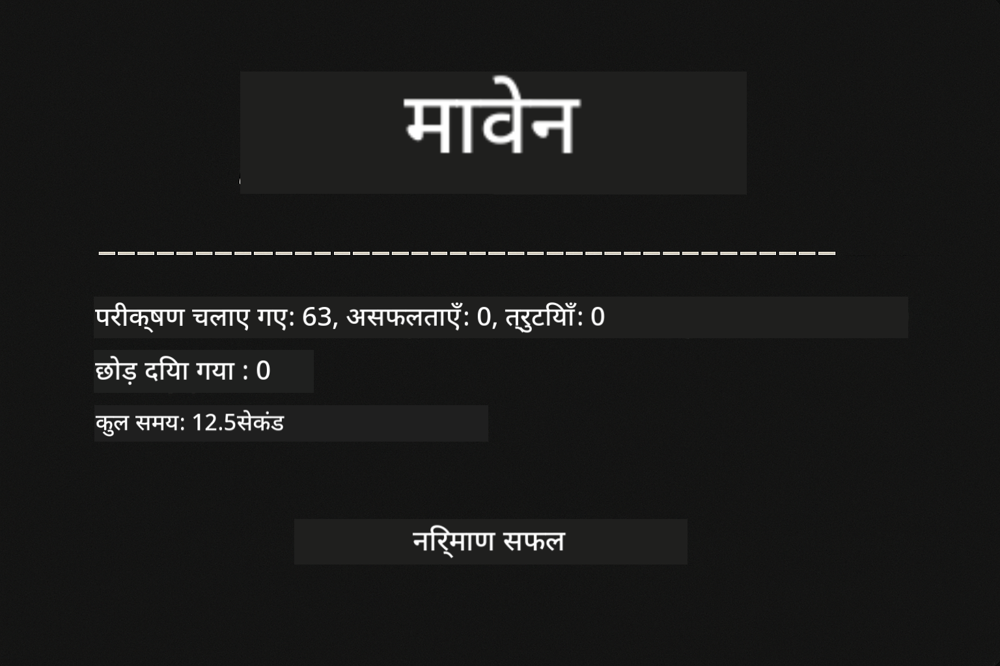
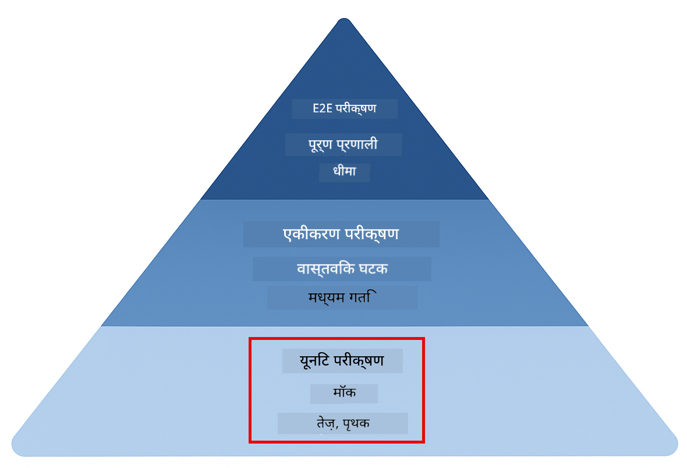
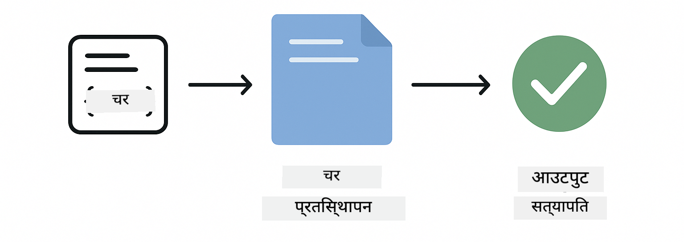
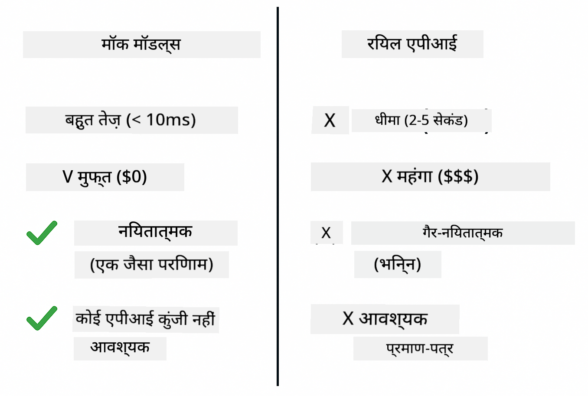
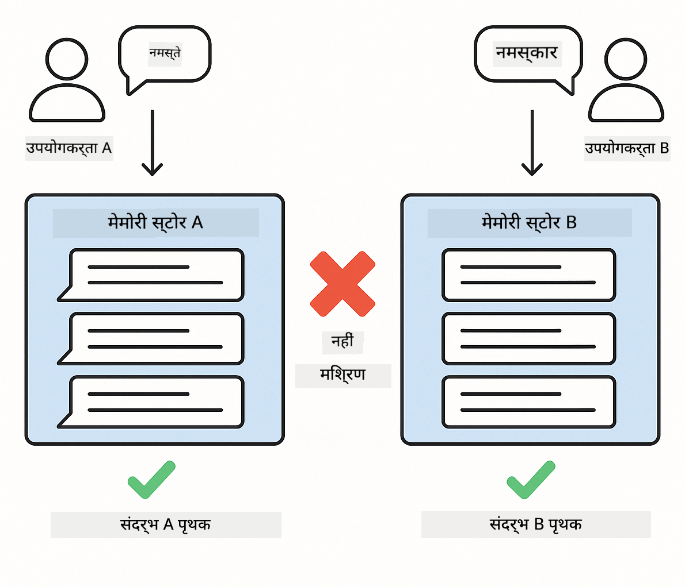

<!--
CO_OP_TRANSLATOR_METADATA:
{
  "original_hash": "b975537560c404d5f254331832811e78",
  "translation_date": "2025-12-13T20:48:51+00:00",
  "source_file": "docs/TESTING.md",
  "language_code": "hi"
}
-->
# LangChain4j अनुप्रयोगों का परीक्षण

## सामग्री तालिका

- [त्वरित प्रारंभ](../../../docs)
- [परीक्षण क्या कवर करते हैं](../../../docs)
- [परीक्षण चलाना](../../../docs)
- [VS कोड में परीक्षण चलाना](../../../docs)
- [परीक्षण पैटर्न](../../../docs)
- [परीक्षण दर्शन](../../../docs)
- [अगले कदम](../../../docs)

यह मार्गदर्शिका आपको उन परीक्षणों के माध्यम से ले जाती है जो दिखाते हैं कि API कुंजी या बाहरी सेवाओं की आवश्यकता के बिना AI अनुप्रयोगों का परीक्षण कैसे किया जाए।

## त्वरित प्रारंभ

सभी परीक्षण एक ही कमांड से चलाएं:

**Bash:**
```bash
mvn test
```

**PowerShell:**
```powershell
mvn --% test
```



*सफल परीक्षण निष्पादन जो सभी परीक्षणों को बिना किसी विफलता के पास दिखाता है*

## परीक्षण क्या कवर करते हैं

यह कोर्स **यूनिट परीक्षणों** पर केंद्रित है जो स्थानीय रूप से चलते हैं। प्रत्येक परीक्षण एक विशिष्ट LangChain4j अवधारणा को अलगाव में प्रदर्शित करता है।



*परीक्षण पिरामिड जो यूनिट परीक्षण (तेज, अलग), इंटीग्रेशन परीक्षण (वास्तविक घटक), और एंड-टू-एंड परीक्षण (पूर्ण सिस्टम के साथ Docker) के बीच संतुलन दिखाता है। यह प्रशिक्षण यूनिट परीक्षण को कवर करता है।*

| मॉड्यूल | परीक्षण | फोकस | मुख्य फ़ाइलें |
|--------|-------|-------|-----------|
| **00 - त्वरित प्रारंभ** | 6 | प्रॉम्प्ट टेम्पलेट और वेरिएबल प्रतिस्थापन | `SimpleQuickStartTest.java` |
| **01 - परिचय** | 8 | बातचीत मेमोरी और स्टेटफुल चैट | `SimpleConversationTest.java` |
| **02 - प्रॉम्प्ट इंजीनियरिंग** | 12 | GPT-5 पैटर्न, उत्सुकता स्तर, संरचित आउटपुट | `SimpleGpt5PromptTest.java` |
| **03 - RAG** | 10 | दस्तावेज़ इनजेशन, एम्बेडिंग, समानता खोज | `DocumentServiceTest.java` |
| **04 - टूल्स** | 12 | फ़ंक्शन कॉलिंग और टूल चेनिंग | `SimpleToolsTest.java` |
| **05 - MCP** | 15 | मॉडल कॉन्टेक्स्ट प्रोटोकॉल विथ Docker | `SimpleMcpTest.java`, `McpDockerTransportTest.java` |

## परीक्षण चलाना

**रूट से सभी परीक्षण चलाएं:**

**Bash:**
```bash
mvn test
```

**PowerShell:**
```powershell
mvn --% test
```

**किसी विशिष्ट मॉड्यूल के लिए परीक्षण चलाएं:**

**Bash:**
```bash
cd 01-introduction && mvn test
# या रूट से
mvn test -pl 01-introduction
```

**PowerShell:**
```powershell
cd 01-introduction; mvn --% test
# या रूट से
mvn --% test -pl 01-introduction
```

**एकल परीक्षण क्लास चलाएं:**

**Bash:**
```bash
mvn test -Dtest=SimpleConversationTest
```

**PowerShell:**
```powershell
mvn --% test -Dtest=SimpleConversationTest
```

**किसी विशिष्ट परीक्षण विधि को चलाएं:**

**Bash:**
```bash
mvn test -Dtest=SimpleConversationTest#वार्तालाप इतिहास बनाए रखना चाहिए
```

**PowerShell:**
```powershell
mvn --% test -Dtest=SimpleConversationTest#वार्तालाप इतिहास बनाए रखना चाहिए
```

## VS कोड में परीक्षण चलाना

यदि आप Visual Studio Code का उपयोग कर रहे हैं, तो टेस्ट एक्सप्लोरर परीक्षण चलाने और डिबग करने के लिए एक ग्राफिकल इंटरफ़ेस प्रदान करता है।


*VS कोड टेस्ट एक्सप्लोरर जो सभी जावा टेस्ट क्लासेस और व्यक्तिगत टेस्ट मेथड्स के साथ टेस्ट ट्री दिखाता है*

**VS कोड में परीक्षण चलाने के लिए:**

1. एक्टिविटी बार में बीकर आइकन पर क्लिक करके टेस्ट एक्सप्लोरर खोलें
2. सभी मॉड्यूल और टेस्ट क्लासेस देखने के लिए टेस्ट ट्री को विस्तृत करें
3. किसी भी परीक्षण के बगल में प्ले बटन पर क्लिक करके उसे व्यक्तिगत रूप से चलाएं
4. पूरी सूट को निष्पादित करने के लिए "Run All Tests" पर क्लिक करें
5. किसी भी परीक्षण पर राइट-क्लिक करें और "Debug Test" चुनें ताकि ब्रेकपॉइंट सेट कर सकें और कोड के माध्यम से स्टेप कर सकें

टेस्ट एक्सप्लोरर पास होने वाले परीक्षणों के लिए हरे चेकमार्क दिखाता है और विफल होने पर विस्तृत विफलता संदेश प्रदान करता है।

## परीक्षण पैटर्न


*LangChain4j अनुप्रयोगों के लिए छह परीक्षण पैटर्न: प्रॉम्प्ट टेम्पलेट, मॉडल मॉकिंग, बातचीत अलगाव, टूल्स परीक्षण, इन-मेमोरी RAG, और Docker इंटीग्रेशन*

### पैटर्न 1: प्रॉम्प्ट टेम्पलेट का परीक्षण

सबसे सरल पैटर्न प्रॉम्प्ट टेम्पलेट का परीक्षण करता है बिना किसी AI मॉडल को कॉल किए। आप सत्यापित करते हैं कि वेरिएबल प्रतिस्थापन सही ढंग से काम करता है और प्रॉम्प्ट अपेक्षित रूप में स्वरूपित हैं।



*प्रॉम्प्ट टेम्पलेट परीक्षण जो वेरिएबल प्रतिस्थापन प्रवाह दिखाता है: प्लेसहोल्डर्स के साथ टेम्पलेट → मान लागू किए गए → स्वरूपित आउटपुट सत्यापित*

```java
@Test
@DisplayName("Should format prompt template with variables")
void testPromptTemplateFormatting() {
    PromptTemplate template = PromptTemplate.from(
        "Best time to visit {{destination}} for {{activity}}?"
    );
    
    Prompt prompt = template.apply(Map.of(
        "destination", "Paris",
        "activity", "sightseeing"
    ));
    
    assertThat(prompt.text()).isEqualTo("Best time to visit Paris for sightseeing?");
}
```

यह परीक्षण `00-quick-start/src/test/java/com/example/langchain4j/quickstart/SimpleQuickStartTest.java` में है।

**इसे चलाएं:**

**Bash:**
```bash
cd 00-quick-start && mvn test -Dtest=SimpleQuickStartTest#परीक्षणप्रॉम्प्टटेम्पलेटफॉर्मेटिंग
```

**PowerShell:**
```powershell
cd 00-quick-start; mvn --% test -Dtest=SimpleQuickStartTest#परीक्षणप्रॉम्प्टटेम्पलेटफॉर्मेटिंग
```

### पैटर्न 2: भाषा मॉडल मॉकिंग

जब बातचीत लॉजिक का परीक्षण करते हैं, तो Mockito का उपयोग करके नकली मॉडल बनाएं जो पूर्वनिर्धारित प्रतिक्रियाएं लौटाते हैं। इससे परीक्षण तेज़, मुफ्त और निर्धारक होते हैं।



*तुलना दिखाती है कि परीक्षण के लिए मॉक क्यों पसंद किए जाते हैं: वे तेज़, मुफ्त, निर्धारक हैं और API कुंजी की आवश्यकता नहीं होती*

```java
@ExtendWith(MockitoExtension.class)
class SimpleConversationTest {
    
    private ConversationService conversationService;
    
    @Mock
    private OpenAiOfficialChatModel mockChatModel;
    
    @BeforeEach
    void setUp() {
        ChatResponse mockResponse = ChatResponse.builder()
            .aiMessage(AiMessage.from("This is a test response"))
            .build();
        when(mockChatModel.chat(anyList())).thenReturn(mockResponse);
        
        conversationService = new ConversationService(mockChatModel);
    }
    
    @Test
    void shouldMaintainConversationHistory() {
        String conversationId = conversationService.startConversation();
        
        ChatResponse mockResponse1 = ChatResponse.builder()
            .aiMessage(AiMessage.from("Response 1"))
            .build();
        ChatResponse mockResponse2 = ChatResponse.builder()
            .aiMessage(AiMessage.from("Response 2"))
            .build();
        ChatResponse mockResponse3 = ChatResponse.builder()
            .aiMessage(AiMessage.from("Response 3"))
            .build();
        
        when(mockChatModel.chat(anyList()))
            .thenReturn(mockResponse1)
            .thenReturn(mockResponse2)
            .thenReturn(mockResponse3);

        conversationService.chat(conversationId, "First message");
        conversationService.chat(conversationId, "Second message");
        conversationService.chat(conversationId, "Third message");

        List<ChatMessage> history = conversationService.getHistory(conversationId);
        assertThat(history).hasSize(6); // 3 उपयोगकर्ता + 3 एआई संदेश
    }
}
```

यह पैटर्न `01-introduction/src/test/java/com/example/langchain4j/service/SimpleConversationTest.java` में है। मॉक सुनिश्चित करता है कि व्यवहार सुसंगत रहे ताकि आप मेमोरी प्रबंधन को सही ढंग से सत्यापित कर सकें।

### पैटर्न 3: बातचीत अलगाव का परीक्षण

बातचीत मेमोरी को कई उपयोगकर्ताओं को अलग रखना चाहिए। यह परीक्षण सत्यापित करता है कि बातचीत संदर्भों को मिलाती नहीं है।



*बातचीत अलगाव परीक्षण जो विभिन्न उपयोगकर्ताओं के लिए अलग मेमोरी स्टोर दिखाता है ताकि संदर्भ मिश्रण से बचा जा सके*

```java
@Test
void shouldIsolateConversationsByid() {
    String conv1 = conversationService.startConversation();
    String conv2 = conversationService.startConversation();
    
    ChatResponse mockResponse = ChatResponse.builder()
        .aiMessage(AiMessage.from("Response"))
        .build();
    when(mockChatModel.chat(anyList())).thenReturn(mockResponse);

    conversationService.chat(conv1, "Message for conversation 1");
    conversationService.chat(conv2, "Message for conversation 2");

    List<ChatMessage> history1 = conversationService.getHistory(conv1);
    List<ChatMessage> history2 = conversationService.getHistory(conv2);
    
    assertThat(history1).hasSize(2);
    assertThat(history2).hasSize(2);
}
```

प्रत्येक बातचीत अपनी स्वतंत्र इतिहास रखती है। उत्पादन प्रणालियों में, यह अलगाव बहु-उपयोगकर्ता अनुप्रयोगों के लिए महत्वपूर्ण है।

### पैटर्न 4: टूल्स का स्वतंत्र परीक्षण

टूल्स वे फ़ंक्शन हैं जिन्हें AI कॉल कर सकता है। उन्हें सीधे परीक्षण करें ताकि यह सुनिश्चित हो सके कि वे AI निर्णयों से स्वतंत्र रूप से सही काम करते हैं।


*टूल्स का स्वतंत्र परीक्षण जो AI कॉल के बिना मॉक टूल निष्पादन दिखाता है ताकि व्यावसायिक लॉजिक सत्यापित किया जा सके*

```java
@Test
void shouldConvertCelsiusToFahrenheit() {
    TemperatureTool tempTool = new TemperatureTool();
    String result = tempTool.celsiusToFahrenheit(25.0);
    assertThat(result).containsPattern("77[.,]0°F");
}

@Test
void shouldDemonstrateToolChaining() {
    WeatherTool weatherTool = new WeatherTool();
    TemperatureTool tempTool = new TemperatureTool();

    String weatherResult = weatherTool.getCurrentWeather("Seattle");
    assertThat(weatherResult).containsPattern("\\d+°C");

    String conversionResult = tempTool.celsiusToFahrenheit(22.0);
    assertThat(conversionResult).containsPattern("71[.,]6°F");
}
```

ये परीक्षण `04-tools/src/test/java/com/example/langchain4j/agents/tools/SimpleToolsTest.java` से हैं जो AI की भागीदारी के बिना टूल लॉजिक को मान्य करते हैं। चेनिंग उदाहरण दिखाता है कि कैसे एक टूल का आउटपुट दूसरे के इनपुट में जाता है।

### पैटर्न 5: इन-मेमोरी RAG परीक्षण

RAG सिस्टम पारंपरिक रूप से वेक्टर डेटाबेस और एम्बेडिंग सेवाओं की आवश्यकता होती है। इन-मेमोरी पैटर्न आपको पूरी पाइपलाइन को बाहरी निर्भरताओं के बिना परीक्षण करने देता है।


*इन-मेमोरी RAG परीक्षण वर्कफ़्लो जो दस्तावेज़ पार्सिंग, एम्बेडिंग स्टोरेज, और समानता खोज दिखाता है बिना डेटाबेस की आवश्यकता के*

```java
@Test
void testProcessTextDocument() {
    String content = "This is a test document.\nIt has multiple lines.";
    InputStream inputStream = new ByteArrayInputStream(content.getBytes(StandardCharsets.UTF_8));
    
    DocumentService.ProcessedDocument result = 
        documentService.processDocument(inputStream, "test.txt");

    assertNotNull(result);
    assertTrue(result.segments().size() > 0);
    assertEquals("test.txt", result.segments().get(0).metadata().getString("filename"));
}
```

यह परीक्षण `03-rag/src/test/java/com/example/langchain4j/rag/service/DocumentServiceTest.java` से है जो मेमोरी में दस्तावेज़ बनाता है और चंकिंग तथा मेटाडेटा हैंडलिंग को सत्यापित करता है।

### पैटर्न 6: Docker के साथ इंटीग्रेशन परीक्षण

कुछ फीचर्स को वास्तविक इन्फ्रास्ट्रक्चर की आवश्यकता होती है। MCP मॉड्यूल Testcontainers का उपयोग करता है Docker कंटेनर चलाने के लिए इंटीग्रेशन परीक्षणों में। ये आपके कोड को वास्तविक सेवाओं के साथ काम करते हुए सत्यापित करते हैं जबकि परीक्षण अलगाव बनाए रखते हैं।


*MCP इंटीग्रेशन परीक्षण Testcontainers के साथ जो स्वचालित कंटेनर जीवनचक्र दिखाता है: शुरू, परीक्षण निष्पादन, बंद, और सफाई*

`05-mcp/src/test/java/com/example/langchain4j/mcp/McpDockerTransportTest.java` में परीक्षणों के लिए Docker चल रहा होना आवश्यक है।

**इन्हें चलाएं:**

**Bash:**
```bash
cd 05-mcp && mvn test
```

**PowerShell:**
```powershell
cd 05-mcp; mvn --% test
```

## परीक्षण दर्शन

अपने कोड का परीक्षण करें, AI का नहीं। आपके परीक्षणों को उस कोड को मान्य करना चाहिए जो आप लिखते हैं, यह जांच कर कि प्रॉम्प्ट कैसे बनाए जाते हैं, मेमोरी कैसे प्रबंधित होती है, और टूल्स कैसे निष्पादित होते हैं। AI प्रतिक्रियाएं भिन्न हो सकती हैं और परीक्षण दावों का हिस्सा नहीं होनी चाहिए। अपने आप से पूछें कि क्या आपका प्रॉम्प्ट टेम्पलेट सही ढंग से वेरिएबल प्रतिस्थापित करता है, न कि AI सही उत्तर देता है या नहीं।

भाषा मॉडलों के लिए मॉक का उपयोग करें। वे बाहरी निर्भरता हैं जो धीमे, महंगे, और गैर-निर्धारक होते हैं। मॉकिंग परीक्षणों को तेज़ बनाता है, मिलीसेकंड में सेकंड के बजाय, मुफ्त API लागत के बिना, और हर बार समान परिणाम के साथ।

परीक्षणों को स्वतंत्र रखें। प्रत्येक परीक्षण को अपना डेटा सेटअप करना चाहिए, अन्य परीक्षणों पर निर्भर नहीं होना चाहिए, और अपने बाद साफ़-सफाई करनी चाहिए। परीक्षण निष्पादन क्रम की परवाह किए बिना पास होने चाहिए।

खुशहाल मार्ग से परे किनारे के मामलों का परीक्षण करें। खाली इनपुट, बहुत बड़े इनपुट, विशेष वर्ण, अमान्य पैरामीटर, और सीमा स्थितियों को आजमाएं। ये अक्सर बग उजागर करते हैं जो सामान्य उपयोग नहीं दिखाता।

वर्णनात्मक नामों का उपयोग करें। `shouldMaintainConversationHistoryAcrossMultipleMessages()` की तुलना `test1()` से करें। पहला आपको ठीक-ठीक बताता है कि क्या परीक्षण किया जा रहा है, जिससे विफलताओं का डिबगिंग आसान हो जाती है।

## अगले कदम

अब जब आप परीक्षण पैटर्न समझ गए हैं, तो प्रत्येक मॉड्यूल में गहराई से जाएं:

- **[00 - त्वरित प्रारंभ](../00-quick-start/README.md)** - प्रॉम्प्ट टेम्पलेट मूल बातें शुरू करें
- **[01 - परिचय](../01-introduction/README.md)** - बातचीत मेमोरी प्रबंधन सीखें
- **[02 - प्रॉम्प्ट इंजीनियरिंग](../02-prompt-engineering/README.md)** - GPT-5 प्रॉम्प्टिंग पैटर्न मास्टर करें
- **[03 - RAG](../03-rag/README.md)** - रिट्रीवल-ऑगमेंटेड जनरेशन सिस्टम बनाएं
- **[04 - टूल्स](../04-tools/README.md)** - फ़ंक्शन कॉलिंग और टूल चेन लागू करें
- **[05 - MCP](../05-mcp/README.md)** - मॉडल कॉन्टेक्स्ट प्रोटोकॉल को Docker के साथ इंटीग्रेट करें

प्रत्येक मॉड्यूल की README यहां परीक्षण की गई अवधारणाओं के विस्तृत स्पष्टीकरण प्रदान करती है।

---

**नेविगेशन:** [← मुख्य पृष्ठ पर वापस](../README.md)

---

<!-- CO-OP TRANSLATOR DISCLAIMER START -->
**अस्वीकरण**:  
यह दस्तावेज़ AI अनुवाद सेवा [Co-op Translator](https://github.com/Azure/co-op-translator) का उपयोग करके अनुवादित किया गया है। जबकि हम सटीकता के लिए प्रयासरत हैं, कृपया ध्यान दें कि स्वचालित अनुवादों में त्रुटियाँ या अशुद्धियाँ हो सकती हैं। मूल दस्तावेज़ अपनी मूल भाषा में ही अधिकारिक स्रोत माना जाना चाहिए। महत्वपूर्ण जानकारी के लिए, पेशेवर मानव अनुवाद की सलाह दी जाती है। इस अनुवाद के उपयोग से उत्पन्न किसी भी गलतफहमी या गलत व्याख्या के लिए हम जिम्मेदार नहीं हैं।
<!-- CO-OP TRANSLATOR DISCLAIMER END -->