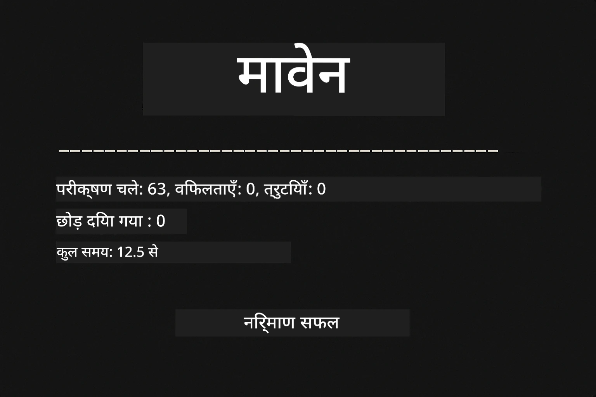
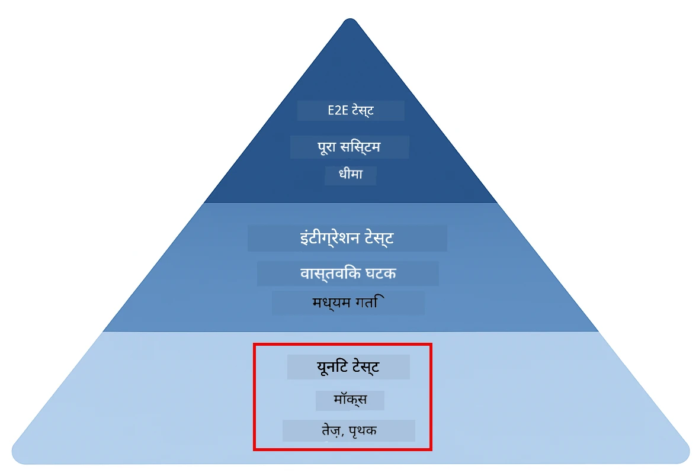
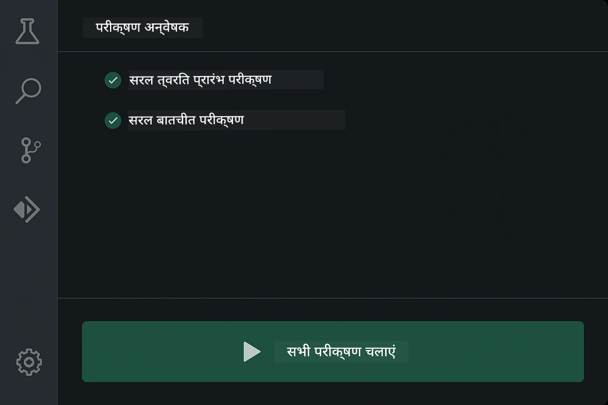
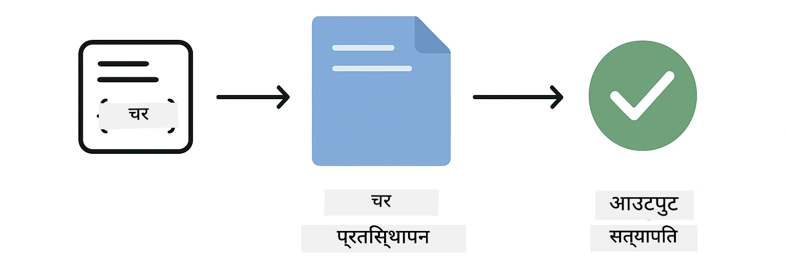
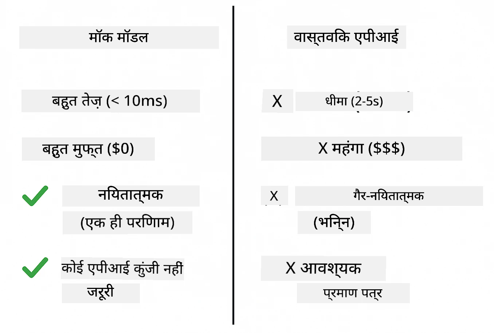
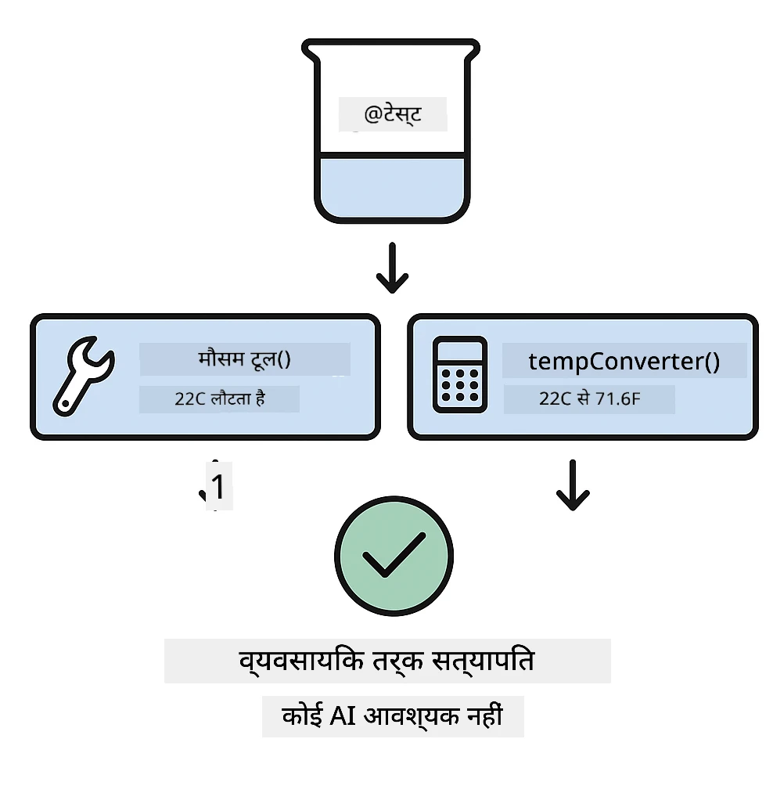
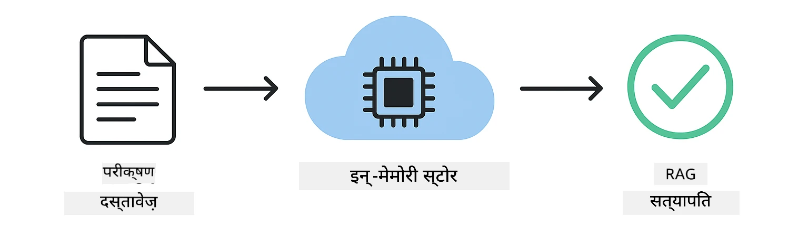

<!--
CO_OP_TRANSLATOR_METADATA:
{
  "original_hash": "ed93b3c14d58734ac10162967da958c1",
  "translation_date": "2025-12-30T22:33:55+00:00",
  "source_file": "docs/TESTING.md",
  "language_code": "hi"
}
-->
# LangChain4j अनुप्रयोगों का परीक्षण

## सामग्री

- [त्वरित शुरुआत](../../../docs)
- [परीक्षण क्या कवर करते हैं](../../../docs)
- [परीक्षण चलाना](../../../docs)
- [VS Code में परीक्षण चलाना](../../../docs)
- [परीक्षण पैटर्न](../../../docs)
- [परीक्षण दर्शन](../../../docs)
- [अगले कदम](../../../docs)

यह मार्गदर्शिका आपको उन परीक्षणों से परिचित कराती है जो यह दिखाते हैं कि बिना API कुंजियों या बाहरी सेवाओं के AI अनुप्रयोगों का कैसे परीक्षण किया जा सकता है।

## त्वरित शुरुआत

सभी परीक्षण एक ही कमांड से चलाएँ:

**Bash:**
```bash
mvn test
```

**PowerShell:**
```powershell
mvn --% test
```



*सफल परीक्षण निष्पादन जो दिखाता है कि सभी परीक्षण बिना किसी विफलता के पास हो गए हैं*

## परीक्षण क्या कवर करते हैं

यह पाठ्यक्रम उन **यूनिट परीक्षणों** पर केंद्रित है जो लोकली चलते हैं। प्रत्येक परीक्षण अलगाव में LangChain4j की एक विशिष्ट अवधारणा को प्रदर्शित करता है।



*परीक्षण पिरामिड जो यूनिट परीक्षणों (तेज़, अलग), इंटीग्रेशन परीक्षणों (वास्तविक घटक), और एंड-टू-एंड परीक्षणों के बीच संतुलन दिखाता है। यह प्रशिक्षण यूनिट परीक्षण को कवर करता है।*

| मॉड्यूल | परीक्षण | फोकस | प्रमुख फ़ाइलें |
|--------|-------|-------|-----------|
| **00 - Quick Start** | 6 | प्रॉम्प्ट टेम्पलेट और वैरिएबल प्रतिस्थापन | `SimpleQuickStartTest.java` |
| **01 - Introduction** | 8 | बातचीत मेमोरी और स्टेटफुल चैट | `SimpleConversationTest.java` |
| **02 - Prompt Engineering** | 12 | GPT-5 पैटर्न, उत्सुकता स्तर, संरचित आउटपुट | `SimpleGpt5PromptTest.java` |
| **03 - RAG** | 10 | दस्तावेज़ इनगेशन, एम्बेडिंग्स, समानता खोज | `DocumentServiceTest.java` |
| **04 - Tools** | 12 | फंक्शन कॉलिंग और टूल चेनिंग | `SimpleToolsTest.java` |
| **05 - MCP** | 8 | Stdio ट्रांसपोर्ट के साथ मॉडल कॉन्टेक्स्ट प्रोटोकॉल | `SimpleMcpTest.java` |

## परीक्षण चलाना

**रूट से सभी परीक्षण चलाएँ:**

**Bash:**
```bash
mvn test
```

**PowerShell:**
```powershell
mvn --% test
```

**किसी विशिष्ट मॉड्यूल के लिए परीक्षण चलाएँ:**

**Bash:**
```bash
cd 01-introduction && mvn test
# या रूट से
mvn test -pl 01-introduction
```

**PowerShell:**
```powershell
cd 01-introduction; mvn --% test
# या रूट से
mvn --% test -pl 01-introduction
```

**एकल परीक्षण क्लास चलाएँ:**

**Bash:**
```bash
mvn test -Dtest=SimpleConversationTest
```

**PowerShell:**
```powershell
mvn --% test -Dtest=SimpleConversationTest
```

**विशिष्ट परीक्षण मेथड चलाएँ:**

**Bash:**
```bash
mvn test -Dtest=SimpleConversationTest#वार्तालाप का इतिहास बनाए रखना चाहिए
```

**PowerShell:**
```powershell
mvn --% test -Dtest=SimpleConversationTest#बातचीत का इतिहास बनाए रखना चाहिए
```

## VS Code में परीक्षण चलाना

यदि आप Visual Studio Code का उपयोग कर रहे हैं, तो Test Explorer परीक्षणों को चलाने और डीबग करने के लिए एक ग्राफिकल इंटरफेस प्रदान करता है।



*VS Code Test Explorer जो सभी Java टेस्ट क्लास और व्यक्तिगत टेस्ट मेथड के साथ टेस्ट ट्री दिखाता है*

**VS Code में परीक्षण चलाने के लिए:**

1. Activity Bar में बीकर आइकन पर क्लिक करके Test Explorer खोलें
2. सभी मॉड्यूल और टेस्ट क्लास देखने के लिए टेस्ट ट्री को विस्तार दें
3. किसी भी टेस्ट के बगल में प्ले बटन पर क्लिक करके उसे अलग से चलाएँ
4. पूरी सूट को चलाने के लिए "सभी परीक्षण चलाएँ" पर क्लिक करें
5. किसी भी टेस्ट पर राइट-क्लिक करें और ब्रेकपॉइंट सेट करने और कोड में स्टेप करने के लिए "डिबग टेस्ट" चुनें

Test Explorer पास होने वाले परीक्षणों के लिए हरे चेकमार्क दिखाता है और जब परीक्षण असफल होते हैं तो विस्तृत त्रुटि संदेश प्रदान करता है।

## परीक्षण पैटर्न

### पैटर्न 1: प्रॉम्प्ट टेम्पलेट का परीक्षण

सबसे सरल पैटर्न बिना किसी AI मॉडल को कॉल किए प्रॉम्प्ट टेम्पलेट का परीक्षण करता है। आप सत्यापित करते हैं कि वैरिएबल प्रतिस्थापन सही ढंग से काम करता है और प्रॉम्प्ट अपेक्षित रूप में प्रारूपित होते हैं।



*प्रॉम्प्ट टेम्पलेट का परीक्षण जो वैरिएबल प्रतिस्थापन प्रवाह दिखाता है: प्लेसहोल्डर्स के साथ टेम्पलेट → मान लागू किए गए → स्वरूपित आउटपुट सत्यापित*

```java
@Test
@DisplayName("Should format prompt template with variables")
void testPromptTemplateFormatting() {
    PromptTemplate template = PromptTemplate.from(
        "Best time to visit {{destination}} for {{activity}}?"
    );
    
    Prompt prompt = template.apply(Map.of(
        "destination", "Paris",
        "activity", "sightseeing"
    ));
    
    assertThat(prompt.text()).isEqualTo("Best time to visit Paris for sightseeing?");
}
```

यह परीक्षण `00-quick-start/src/test/java/com/example/langchain4j/quickstart/SimpleQuickStartTest.java` में रहता है।

**इसे चलाएँ:**

**Bash:**
```bash
cd 00-quick-start && mvn test -Dtest=SimpleQuickStartTest#प्रॉम्प्ट टेम्पलेट स्वरूपण का परीक्षण
```

**PowerShell:**
```powershell
cd 00-quick-start; mvn --% test -Dtest=SimpleQuickStartTest#प्रॉम्प्ट टेम्पलेट स्वरूपण का परीक्षण
```

### पैटर्न 2: भाषा मॉडल का मॉकिंग

जब बातचीत लॉजिक का परीक्षण कर रहे हों, तो Mockito का उपयोग करके नकली मॉडल बनाएं जो पूर्वनिर्धारित उत्तर देते हैं। इससे परीक्षण तेज़, मुफ़्त और निर्धारक हो जाते हैं।



*तुलना दिखाती है कि परीक्षण के लिए मॉक क्यों पसंद किए जाते हैं: वे तेज़, मुफ़्त, निर्धारक होते हैं और उन्हें किसी API कुंजी की आवश्यकता नहीं होती*

```java
@ExtendWith(MockitoExtension.class)
class SimpleConversationTest {
    
    private ConversationService conversationService;
    
    @Mock
    private OpenAiOfficialChatModel mockChatModel;
    
    @BeforeEach
    void setUp() {
        ChatResponse mockResponse = ChatResponse.builder()
            .aiMessage(AiMessage.from("This is a test response"))
            .build();
        when(mockChatModel.chat(anyList())).thenReturn(mockResponse);
        
        conversationService = new ConversationService(mockChatModel);
    }
    
    @Test
    void shouldMaintainConversationHistory() {
        String conversationId = conversationService.startConversation();
        
        ChatResponse mockResponse1 = ChatResponse.builder()
            .aiMessage(AiMessage.from("Response 1"))
            .build();
        ChatResponse mockResponse2 = ChatResponse.builder()
            .aiMessage(AiMessage.from("Response 2"))
            .build();
        ChatResponse mockResponse3 = ChatResponse.builder()
            .aiMessage(AiMessage.from("Response 3"))
            .build();
        
        when(mockChatModel.chat(anyList()))
            .thenReturn(mockResponse1)
            .thenReturn(mockResponse2)
            .thenReturn(mockResponse3);

        conversationService.chat(conversationId, "First message");
        conversationService.chat(conversationId, "Second message");
        conversationService.chat(conversationId, "Third message");

        List<ChatMessage> history = conversationService.getHistory(conversationId);
        assertThat(history).hasSize(6); // 3 उपयोगकर्ता + 3 एआई संदेश
    }
}
```

यह पैटर्न `01-introduction/src/test/java/com/example/langchain4j/service/SimpleConversationTest.java` में दिखाई देता है। मॉक सुनिश्चित करता है कि व्यवहार सुसंगत रहे ताकि आप मेमोरी प्रबंधन सही ढंग से काम करता है यह सत्यापित कर सकें।

### पैटर्न 3: बातचीत पृथकता का परीक्षण

बातचीत मेमोरी को कई उपयोगकर्ताओं के लिए अलग रखना चाहिए। यह परीक्षण सत्यापित करता है कि बातचीत संदर्भ नहीं मिलाते।


*बातचीत पृथकता का परीक्षण जो अलग उपयोगकर्ताओं के लिए अलग मेमोरी स्टोर्स दिखाता है ताकि संदर्भों का मिल जाना रोका जा सके*

```java
@Test
void shouldIsolateConversationsByid() {
    String conv1 = conversationService.startConversation();
    String conv2 = conversationService.startConversation();
    
    ChatResponse mockResponse = ChatResponse.builder()
        .aiMessage(AiMessage.from("Response"))
        .build();
    when(mockChatModel.chat(anyList())).thenReturn(mockResponse);

    conversationService.chat(conv1, "Message for conversation 1");
    conversationService.chat(conv2, "Message for conversation 2");

    List<ChatMessage> history1 = conversationService.getHistory(conv1);
    List<ChatMessage> history2 = conversationService.getHistory(conv2);
    
    assertThat(history1).hasSize(2);
    assertThat(history2).hasSize(2);
}
```

प्रत्येक बातचीत अपनी स्वतंत्र इतिहास बनाए रखती है। उत्पादन प्रणालियों में यह पृथकता बहु-उपयोगकर्ता अनुप्रयोगों के लिए महत्वपूर्ण है।

### पैटर्न 4: टूल्स का स्वतंत्र परीक्षण

टूल्स वे फ़ंक्शंस हैं जिन्हें AI कॉल कर सकता है। इन्हें सीधे परीक्षण करें ताकि यह सुनिश्चित हो सके कि वे AI के निर्णयों से स्वतंत्र रूप से सही काम करते हैं।



*टूल्स का स्वतंत्र परीक्षण जो AI कॉल के बिना मॉक टूल निष्पादन दिखाता है ताकि बिजनेस लॉजिक सत्यापित किया जा सके*

```java
@Test
void shouldConvertCelsiusToFahrenheit() {
    TemperatureTool tempTool = new TemperatureTool();
    String result = tempTool.celsiusToFahrenheit(25.0);
    assertThat(result).containsPattern("77[.,]0°F");
}

@Test
void shouldDemonstrateToolChaining() {
    WeatherTool weatherTool = new WeatherTool();
    TemperatureTool tempTool = new TemperatureTool();

    String weatherResult = weatherTool.getCurrentWeather("Seattle");
    assertThat(weatherResult).containsPattern("\\d+°C");

    String conversionResult = tempTool.celsiusToFahrenheit(22.0);
    assertThat(conversionResult).containsPattern("71[.,]6°F");
}
```

ये परीक्षण `04-tools/src/test/java/com/example/langchain4j/agents/tools/SimpleToolsTest.java` से हैं और AI शामिल किए बिना टूल लॉजिक को मान्य करते हैं। चेनिंग उदाहरण दिखाता है कि कैसे एक टूल का आउटपुट दूसरे के इनपुट में फ़ीड होता है।

### पैटर्न 5: इन-मेमोरी RAG परीक्षण

RAG सिस्टम पारंपरिक रूप से वेक्टर डेटाबेस और एम्बेडिंग सेवाएँ मांगते हैं। इन-मेमोरी पैटर्न आपको बाहरी निर्भरताओं के बिना पूरे पाइपलाइन का परीक्षण करने देता है।



*इन-मेमोरी RAG परीक्षण वर्कफ़्लो जो दस्तावेज़ पार्सिंग, एम्बेडिंग स्टोरेज, और समानता खोज दिखाता है बिना डेटाबेस की आवश्यकता के*

```java
@Test
void testProcessTextDocument() {
    String content = "This is a test document.\nIt has multiple lines.";
    InputStream inputStream = new ByteArrayInputStream(content.getBytes(StandardCharsets.UTF_8));
    
    DocumentService.ProcessedDocument result = 
        documentService.processDocument(inputStream, "test.txt");

    assertNotNull(result);
    assertTrue(result.segments().size() > 0);
    assertEquals("test.txt", result.segments().get(0).metadata().getString("filename"));
}
```

यह परीक्षण `03-rag/src/test/java/com/example/langchain4j/rag/service/DocumentServiceTest.java` से मेमोरी में एक दस्तावेज़ बनाता है और चंकिंग और मेटाडाटा हैंडलिंग को सत्यापित करता है।

### पैटर्न 6: MCP इंटीग्रेशन परीक्षण

MCP मॉड्यूल stdio ट्रांसपोर्ट का उपयोग करके Model Context Protocol इंटीग्रेशन का परीक्षण करता है। ये परीक्षण सत्यापित करते हैं कि आपका अनुप्रयोग subprocess के रूप में MCP सर्वरों को स्पॉन कर सकता है और उनसे संवाद कर सकता है।

ये परीक्षण `05-mcp/src/test/java/com/example/langchain4j/mcp/SimpleMcpTest.java` में MCP क्लाइंट व्यवहार को मान्य करते हैं।

**इन्हें चलाएँ:**

**Bash:**
```bash
cd 05-mcp && mvn test
```

**PowerShell:**
```powershell
cd 05-mcp; mvn --% test
```

## परीक्षण दर्शन

अपने कोड का परीक्षण करें, AI का नहीं। आपके परीक्षणों को उस कोड को सत्यापित करना चाहिए जो आप लिखते हैं—जैसे कि प्रॉम्प्ट कैसे बनाए जाते हैं, मेमोरी कैसे प्रबंधित की जाती है, और टूल्स कैसे निष्पादित होते हैं। AI उत्तर बदलते रहते हैं और उन्हें परीक्षण सत्यापन का भाग नहीं होना चाहिए। अपने आप से पूछें कि क्या आपका प्रॉम्प्ट टेम्पलेट सही ढंग से वैरिएबल प्रतिस्थापित करता है, न कि यह कि AI सही उत्तर देता है या नहीं।

भाषा मॉडलों के लिए मॉक का उपयोग करें। वे बाहरी निर्भरताएँ हैं जो धीमी, महंगी और गैर-निर्धारक होती हैं। मॉकिंग से परीक्षण मिलीसेकंड में तेज़, बिना किसी API लागत के मुफ्त, और हर बार समान परिणाम देने वाले बन जाते हैं।

परीक्षणों को स्वतंत्र रखें। प्रत्येक परीक्षण को अपना डेटा सेटअप करना चाहिए, अन्य परीक्षणों पर निर्भर नहीं होना चाहिए, और अपने बाद साफ़-सफ़ाई करनी चाहिए। परीक्षणों को निष्पादन क्रम से स्वतंत्र रूप से पास होना चाहिए।

हैप्पी पाथ से परे एज केस का परीक्षण करें। खाली इनपुट, बहुत बड़े इनपुट, विशेष वर्ण, अमान्य पैरामीटर, और सीमा शर्तों का प्रयास करें। ये अक्सर उन बग्स को उजागर करते हैं जो सामान्य उपयोग प्रकट नहीं करते।

वर्णनात्मक नामों का उपयोग करें। `shouldMaintainConversationHistoryAcrossMultipleMessages()` की तुलना `test1()` से करें। पहला आपको ठीक-ठीक बताता है कि क्या परीक्षण किया जा रहा है, जिससे विफलताओं को डीबग करना बहुत आसान हो जाता है।

## अगले कदम

अब जब आप परीक्षण पैटर्न समझ गए हैं, तो प्रत्येक मॉड्यूल में गहराई से जाएँ:

- **[00 - त्वरित शुरुआत](../00-quick-start/README.md)** - प्रॉम्प्ट टेम्पलेट के बुनियादी सिद्धांतों से शुरू करें
- **[01 - परिचय](../01-introduction/README.md)** - बातचीत मेमोरी प्रबंधन सीखें
- **[02 - प्रॉम्प्ट इंजीनियरिंग](../02-prompt-engineering/README.md)** - GPT-5 प्रॉम्प्टिंग पैटर्न मास्टर करें
- **[03 - RAG](../03-rag/README.md)** - रिट्रीवल-ऑगमेंटेड जेनरेशन सिस्टम बनाएं
- **[04 - टूल्स](../04-tools/README.md)** - फंक्शन कॉलिंग और टूल चेन लागू करें
- **[05 - MCP](../05-mcp/README.md)** - Model Context Protocol को इंटीग्रेट करें

प्रत्येक मॉड्यूल का README यहां परीक्षण की गई अवधारणाओं के विस्तृत व्याख्याएँ प्रदान करता है।

---

**नेविगेशन:** [← मुख्य पृष्ठ पर वापस](../README.md)

---

<!-- CO-OP TRANSLATOR DISCLAIMER START -->
अस्वीकरण:
यह दस्तावेज़ AI अनुवाद सेवा [Co-op Translator](https://github.com/Azure/co-op-translator) का उपयोग करके अनुवादित किया गया है। हम सटीकता के लिए प्रयासरत हैं, तथापि कृपया ध्यान रखें कि स्वचालित अनुवादों में त्रुटियाँ या अशुद्धियाँ हो सकती हैं। मूल भाषा में उपलब्ध मूल दस्तावेज़ को अधिकारिक स्रोत माना जाना चाहिए। महत्वपूर्ण जानकारी के लिए पेशेवर मानव अनुवाद की सलाह दी जाती है। इस अनुवाद के उपयोग से उत्पन्न किसी भी गलतफहमी या गलत व्याख्या के लिए हम उत्तरदायी नहीं हैं।
<!-- CO-OP TRANSLATOR DISCLAIMER END -->