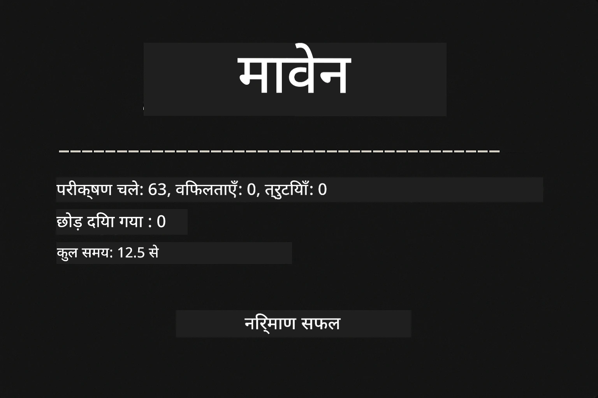
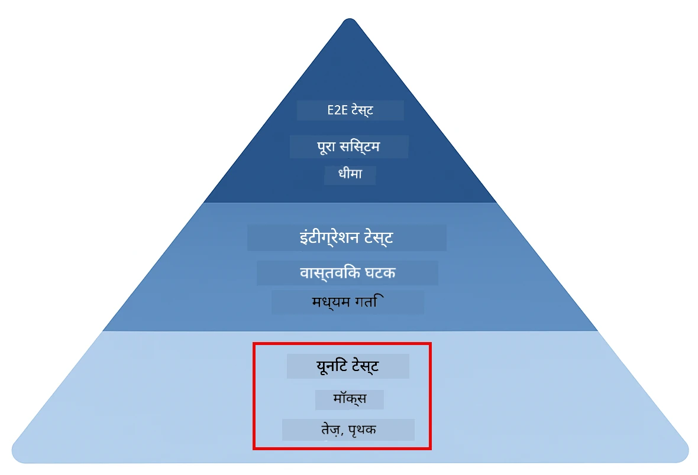
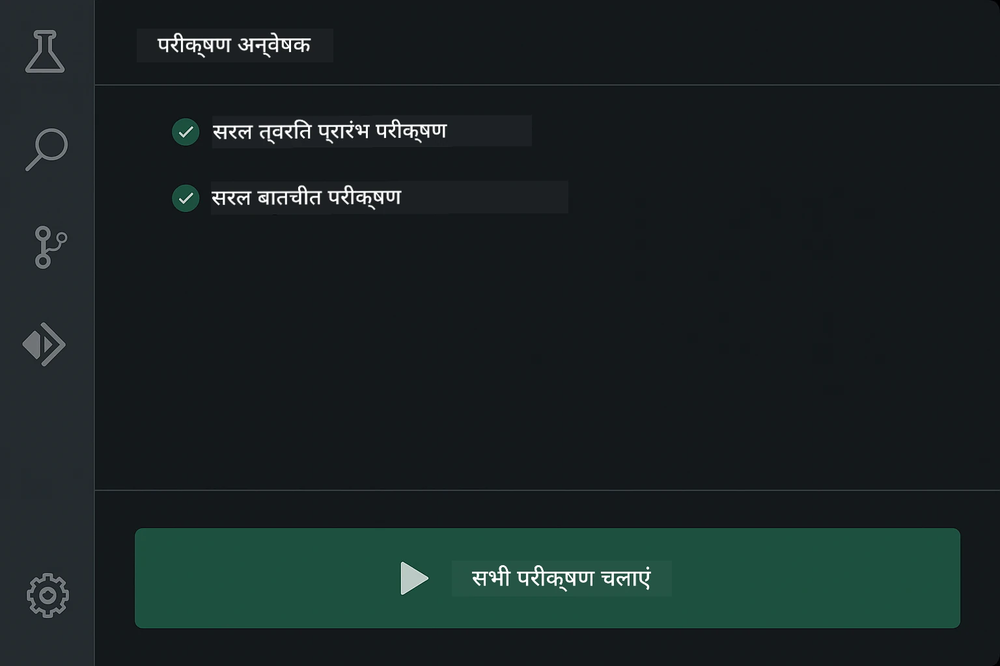
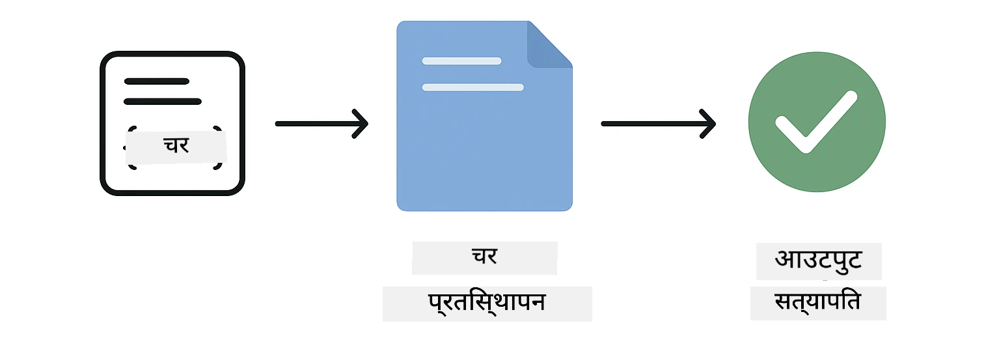
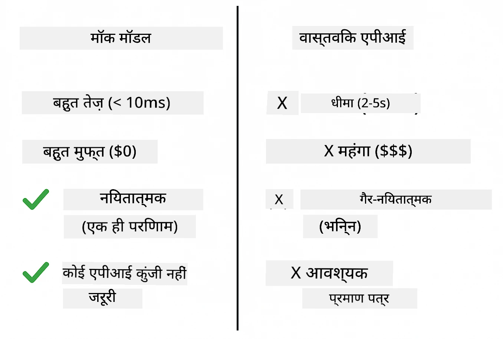
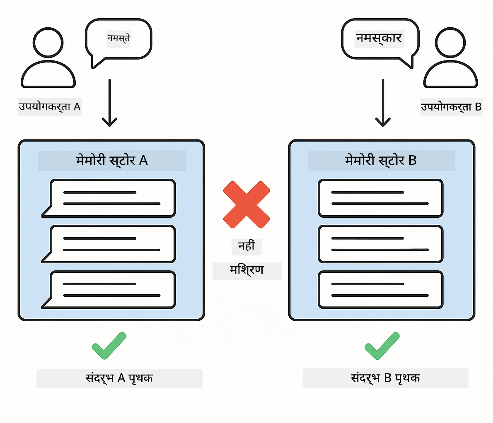
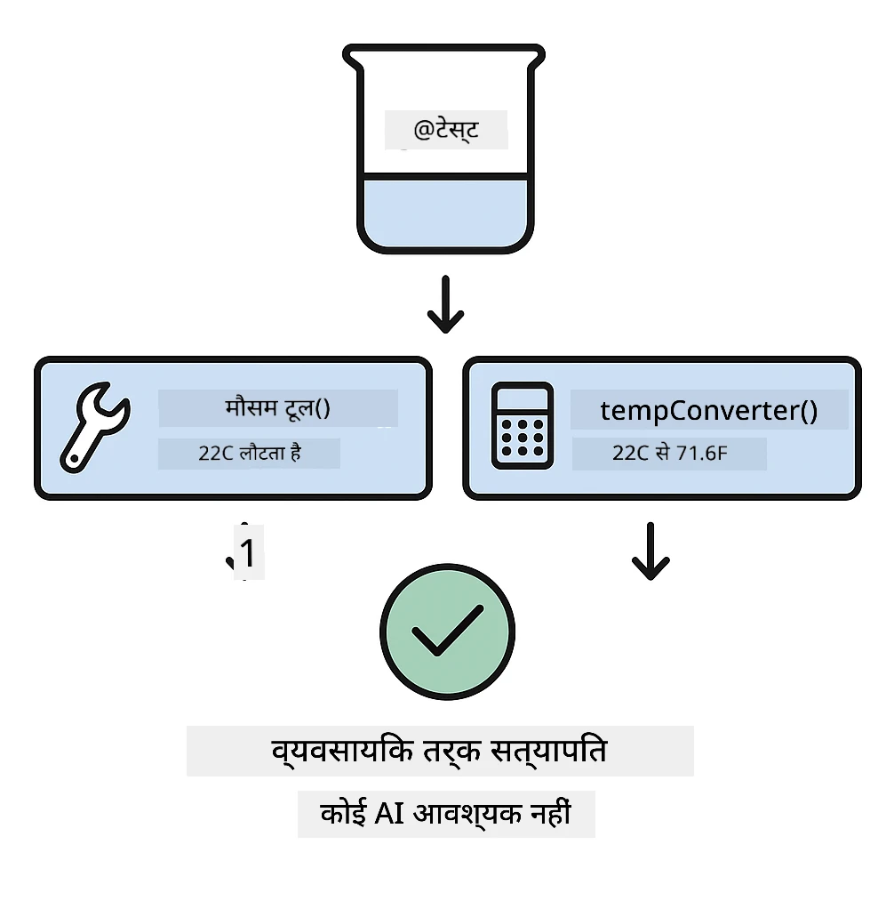
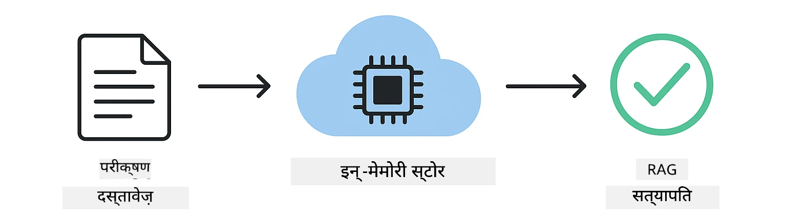

# LangChain4j एप्लिकेशन का परीक्षण

## विषय सूची

- [त्वरित आरंभ](#त्वरित-आरंभ)
- [परीक्षण में क्या शामिल है](#परीक्षण-में-क्या-शामिल-है)
- [परीक्षण कैसे चलाएं](#परीक्षण-कैसे-चलाएं)
- [VS कोड में परीक्षण चलाना](#vs-कोड-में-परीक्षण-चलाना)
- [परीक्षण के पैटर्न](#परीक्षण-के-पैटर्न)
- [परीक्षण के दर्शन](#परीक्षण-के-दर्शन)
- [अगले कदम](#अगले-कदम)

यह मार्गदर्शिका आपको उन परीक्षणों से परिचित कराती है जो यह दिखाते हैं कि एआई एप्लिकेशन को बिना API कुंजी या बाहरी सेवाओं की आवश्यकता के कैसे परीक्षण किया जाए।

## त्वरित आरंभ

सभी परीक्षणों को केवल एक कमांड से चलाएं:

**Bash:**
```bash
mvn test
```

**PowerShell:**
```powershell
mvn --% test
```

जब सभी परीक्षण सफल होते हैं, तो आपको नीचे दिए गए स्क्रीनशॉट जैसा आउटपुट दिखाई देगा — परीक्षण बिना किसी विफलता के चलते हैं।



*सभी परीक्षण सफलतापूर्वक चले और कोई विफलता नहीं हुई*

## परीक्षण में क्या शामिल है

यह कोर्स मुख्य रूप से **यूनिट टेस्ट** पर केंद्रित है जो स्थानीय रूप से चलते हैं। प्रत्येक परीक्षण LangChain4j की एक विशिष्ट अवधारणा को अकेले दिखाता है। नीचे दिया गया परीक्षण पिरामिड बताता है कि यूनिट टेस्ट कहाँ आते हैं — वे तेज़, विश्वसनीय आधार बनाते हैं जिस पर आपकी बाकी परीक्षण रणनीति आधारित होती है।



*टेस्टिंग पिरामिड जो यूनिट टेस्ट (तेज़, अलग) और इंटीग्रेशन टेस्ट (वास्तविक घटक) और एंड-टू-एंड टेस्ट के बीच संतुलन दिखाता है। यह प्रशिक्षण यूनिट परीक्षण को कवर करता है।*

| मॉड्यूल | परीक्षण | फोकस | मुख्य फ़ाइलें |
|--------|-------|-------|-----------|
| **01 - परिचय** | 8 | वार्तालाप स्मृति और स्टेटफुल चैट | `SimpleConversationTest.java` |
| **02 - प्रॉम्प्ट इंजीनियरिंग** | 12 | GPT-5.2 पैटर्न, उत्सुकता स्तर, संरचित आउटपुट | `SimpleGpt5PromptTest.java` |
| **03 - RAG** | 10 | दस्तावेज़ संग्रहण, एम्बेडिंग्स, समानता खोज | `DocumentServiceTest.java` |
| **04 - टूल्स** | 12 | फंक्शन कॉलिंग और टूल चेनिंग | `SimpleToolsTest.java`` |
| **05 - MCP** | 8 | मॉडल कंटेक्स्ट प्रोटोकॉल विथ स्टडियो ट्रांसपोर्ट | `SimpleMcpTest.java` |

## परीक्षण कैसे चलाएं

**रूट से सभी परीक्षण चलाएं:**

**Bash:**
```bash
mvn test
```

**PowerShell:**
```powershell
mvn --% test
```

**किसी विशेष मॉड्यूल के परीक्षण चलाएं:**

**Bash:**
```bash
cd 01-introduction && mvn test
# या रूट से
mvn test -pl 01-introduction
```

**PowerShell:**
```powershell
cd 01-introduction; mvn --% test
# या रूट से
mvn --% test -pl 01-introduction
```

**एकल टेस्ट क्लास चलाएं:**

**Bash:**
```bash
mvn test -Dtest=SimpleConversationTest
```

**PowerShell:**
```powershell
mvn --% test -Dtest=SimpleConversationTest
```

**विशिष्ट टेस्ट मेथड चलाएं:**

**Bash:**
```bash
mvn test -Dtest=SimpleConversationTest#वार्तालाप इतिहास बनाए रखना चाहिए
```

**PowerShell:**
```powershell
mvn --% test -Dtest=SimpleConversationTest#क्या बातचीत का इतिहास बनाए रखना चाहिए
```

## VS कोड में परीक्षण चलाना

यदि आप Visual Studio Code उपयोग कर रहे हैं, तो टेस्ट एक्सप्लोरर आपको परीक्षण चलाने और डीबग करने के लिए एक ग्राफिकल इंटरफेस प्रदान करता है।



*VS कोड टेस्ट एक्सप्लोरर सभी जावा टेस्ट क्लासेस और व्यक्तिगत टेस्ट मेथड्स के साथ टेस्ट ट्री दिखा रहा है*

**VS कोड में परीक्षण चलाने के लिए:**

1. एक्टिविटी बार में बीकर आइकन पर क्लिक करके टेस्ट एक्सप्लोरर खोलें
2. सभी मॉड्यूल और टेस्ट क्लासेस देखने के लिए टेस्ट ट्री विस्तारित करें
3. किसी भी टेस्ट के बगल में प्ले बटन पर क्लिक करके उसे व्यक्तिगत रूप से चलाएं
4. पूरे टेस्ट सूट को चलाने के लिए "Run All Tests" पर क्लिक करें
5. किसी भी टेस्ट पर राइट-क्लिक करें और "Debug Test" चुनें ताकि ब्रेकपॉइंट सेट करके कोड को चरण-दर-चरण चलाया जा सके

टेस्ट एक्सप्लोरर पास टेस्ट के लिए हरे चेकमार्क दिखाता है और विफल टेस्ट पर विस्तृत त्रुटि संदेश प्रदान करता है।

## परीक्षण के पैटर्न

### पैटर्न 1: प्रॉम्प्ट टेम्प्लेट का परीक्षण

सबसे सरल पैटर्न प्रॉम्प्ट टेम्प्लेट का परीक्षण करता है बिना किसी AI मॉडल को कॉल किए। आप सत्यापित करते हैं कि वेरिएबल प्रतिस्थापन सही ढंग से काम कर रहा है और प्रॉम्प्ट अपेक्षित फॉर्मेट में हैं।



*प्रॉम्प्ट टेम्प्लेट परीक्षण जो वेरिएबल प्रतिस्थापन फ्लो दिखाता है: प्लेसहोल्डर्स के साथ टेम्प्लेट → मान लागू किए गए → फॉर्मेटेड आउटपुट सत्यापित*

```java
@Test
@DisplayName("Should format prompt template with variables")
void testPromptTemplateFormatting() {
    PromptTemplate template = PromptTemplate.from(
        "Best time to visit {{destination}} for {{activity}}?"
    );
    
    Prompt prompt = template.apply(Map.of(
        "destination", "Paris",
        "activity", "sightseeing"
    ));
    
    assertThat(prompt.text()).isEqualTo("Best time to visit Paris for sightseeing?");
}
```

यह पैटर्न सत्यापित करता है कि वेरिएबल प्रतिस्थापन सही है और प्रॉम्प्ट अपेक्षित फॉर्मेट में हैं — किसी API कुंजी या मॉडल कॉल की आवश्यकता नहीं।

### पैटर्न 2: भाषा मॉडलों का मॉकिंग

जब वार्तालाप लॉजिक का परीक्षण किया जाता है, तो Mockito का उपयोग करके फेक मॉडल बनाएं जो पूर्वनिर्धारित प्रतिक्रियाएं लौटाते हैं। इससे परीक्षण तेज़, मुफ्त और निर्णायक होते हैं।



*तुलना दिखाती है कि मॉक क्यों परीक्षण के लिए बेहतर हैं: वे तेज़, मुफ्त, निर्णायक होते हैं और API कुंजी की जरूरत नहीं होती*

```java
@ExtendWith(MockitoExtension.class)
class SimpleConversationTest {
    
    private ConversationService conversationService;
    
    @Mock
    private OpenAiOfficialChatModel mockChatModel;
    
    @BeforeEach
    void setUp() {
        ChatResponse mockResponse = ChatResponse.builder()
            .aiMessage(AiMessage.from("This is a test response"))
            .build();
        when(mockChatModel.chat(anyList())).thenReturn(mockResponse);
        
        conversationService = new ConversationService(mockChatModel);
    }
    
    @Test
    void shouldMaintainConversationHistory() {
        String conversationId = conversationService.startConversation();
        
        ChatResponse mockResponse1 = ChatResponse.builder()
            .aiMessage(AiMessage.from("Response 1"))
            .build();
        ChatResponse mockResponse2 = ChatResponse.builder()
            .aiMessage(AiMessage.from("Response 2"))
            .build();
        ChatResponse mockResponse3 = ChatResponse.builder()
            .aiMessage(AiMessage.from("Response 3"))
            .build();
        
        when(mockChatModel.chat(anyList()))
            .thenReturn(mockResponse1)
            .thenReturn(mockResponse2)
            .thenReturn(mockResponse3);

        conversationService.chat(conversationId, "First message");
        conversationService.chat(conversationId, "Second message");
        conversationService.chat(conversationId, "Third message");

        List<ChatMessage> history = conversationService.getHistory(conversationId);
        assertThat(history).hasSize(6); // 3 उपयोगकर्ता + 3 एआई संदेश
    }
}
```

यह पैटर्न `01-introduction/src/test/java/com/example/langchain4j/service/SimpleConversationTest.java` में पाया जाता है। मॉक निश्चित व्यवहार सुनिश्चित करता है ताकि आप स्मृति प्रबंधन की जांच कर सकें।

### पैटर्न 3: वार्तालाप अलगाव का परीक्षण

वार्तालाप स्मृति को विभिन्न उपयोगकर्ताओं को अलग रखना चाहिए। यह परीक्षण सत्यापित करता है कि वार्तालाप संदर्भ नहीं मिलाते।



*वार्तालाप अलगाव परीक्षण जो दिखाता है कि अलग-अलग उपयोगकर्ताओं के लिए अलग स्मृति स्टोर होते हैं जिससे संदर्भ नहीं मिश्रित होता*

```java
@Test
void shouldIsolateConversationsByid() {
    String conv1 = conversationService.startConversation();
    String conv2 = conversationService.startConversation();
    
    ChatResponse mockResponse = ChatResponse.builder()
        .aiMessage(AiMessage.from("Response"))
        .build();
    when(mockChatModel.chat(anyList())).thenReturn(mockResponse);

    conversationService.chat(conv1, "Message for conversation 1");
    conversationService.chat(conv2, "Message for conversation 2");

    List<ChatMessage> history1 = conversationService.getHistory(conv1);
    List<ChatMessage> history2 = conversationService.getHistory(conv2);
    
    assertThat(history1).hasSize(2);
    assertThat(history2).hasSize(2);
}
```

प्रत्येक वार्तालाप अपनी स्वतंत्र इतिहास रखता है। उत्पादन सिस्टम में यह अलगाव मल्टी-यूजर एप्लिकेशन के लिए महत्वपूर्ण है।

### पैटर्न 4: टूल्स का स्वतंत्र परीक्षण

टूल्स वे फंक्शन हैं जिन्हें AI कॉल कर सकता है। इन्हें सीधे परीक्षण करें ताकि यह सुनिश्चित हो सके कि वे AI निर्णयों से स्वतंत्र सही काम करते हैं।



*टूल्स का स्वतंत्र परीक्षण जो दिखाता है कि मॉक टूल निष्पादन बिना AI कॉल के व्यावसायिक लॉजिक को सत्यापित करता है*

```java
@Test
void shouldConvertCelsiusToFahrenheit() {
    TemperatureTool tempTool = new TemperatureTool();
    String result = tempTool.celsiusToFahrenheit(25.0);
    assertThat(result).containsPattern("77[.,]0°F");
}

@Test
void shouldDemonstrateToolChaining() {
    WeatherTool weatherTool = new WeatherTool();
    TemperatureTool tempTool = new TemperatureTool();

    String weatherResult = weatherTool.getCurrentWeather("Seattle");
    assertThat(weatherResult).containsPattern("\\d+°C");

    String conversionResult = tempTool.celsiusToFahrenheit(22.0);
    assertThat(conversionResult).containsPattern("71[.,]6°F");
}
```

`04-tools/src/test/java/com/example/langchain4j/agents/tools/SimpleToolsTest.java` के ये परीक्षण टूल लॉजिक को AI भागीदारी के बिना सत्यापित करते हैं। चेनिंग उदाहरण दिखाता है कि कैसे एक टूल का आउटपुट दूसरे के इनपुट में जाता है।

### पैटर्न 5: इन-मेमोरी RAG परीक्षण

RAG सिस्टम पारंपरिक रूप से वेक्टर डेटाबेस और एम्बेडिंग सेवाओं की आवश्यकता रखते हैं। इन-मेमोरी पैटर्न पूरी पाइपलाइन को बाहरी निर्भरताओं के बिना परीक्षण करने देता है।



*इन-मेमोरी RAG परीक्षण वर्कफ़्लो दिखाता है जो दस्तावेज़ पार्सिंग, एम्बेडिंग स्टोरेज, और समानता खोज बिना डेटाबेस की जरूरत के करता है*

```java
@Test
void testProcessTextDocument() {
    String content = "This is a test document.\nIt has multiple lines.";
    InputStream inputStream = new ByteArrayInputStream(content.getBytes(StandardCharsets.UTF_8));
    
    DocumentService.ProcessedDocument result = 
        documentService.processDocument(inputStream, "test.txt");

    assertNotNull(result);
    assertTrue(result.segments().size() > 0);
    assertEquals("test.txt", result.segments().get(0).metadata().getString("filename"));
}
```

यह परीक्षण `03-rag/src/test/java/com/example/langchain4j/rag/service/DocumentServiceTest.java` से है जो मेमोरी में दस्तावेज़ बनाता है और चंकिनग तथा मेटाडेटा हैंडलिंग को सत्यापित करता है।

### पैटर्न 6: MCP इंटीग्रेशन परीक्षण

MCP मॉड्यूल मॉडल कंटेक्स्ट प्रोटोकॉल इंटीग्रेशन का परीक्षण stdio ट्रांसपोर्ट के साथ करता है। ये परीक्षण सत्यापित करते हैं कि आपका एप्लिकेशन MCP सर्वर्स को subprocess के रूप में स्पॉन कर सकता है और उनसे संवाद स्थापित कर सकता है।

`05-mcp/src/test/java/com/example/langchain4j/mcp/SimpleMcpTest.java` में ये परीक्षण MCP क्लाइंट व्यवहार को सत्यापित करते हैं।

**उन्हें चलाएं:**

**Bash:**
```bash
cd 05-mcp && mvn test
```

**PowerShell:**
```powershell
cd 05-mcp; mvn --% test
```

## परीक्षण के दर्शन

अपने कोड का परीक्षण करें, AI का नहीं। आपके परीक्षण लिखे गए कोड का सत्यापन करना चाहिए यह जांचकर कि प्रॉम्प्ट कैसे बनाए गए, स्मृति का प्रबंधन कैसे हुआ, और टूल कैसे क्रियान्वित हुए। AI उत्तर बदलते रहते हैं और उन्हें टेस्ट असर्शन में नहीं शामिल किया जाना चाहिए। स्वयं से पूछें कि क्या आपका प्रॉम्प्ट टेम्प्लेट सही वेरिएबल्स डाल रहा है, न कि AI सही उत्तर देता है या नहीं।

भाषा मॉडलों के लिए मॉक का उपयोग करें। वे बाहरी निर्भरताएं हैं जो धीमी, महँगी, और गैर-निर्णायक होती हैं। मॉकिंग से परीक्षण तेज़, मुफ्त, और हमेशा समान परिणाम के साथ होते हैं।

परीक्षण स्वतंत्र रखें। प्रत्येक परीक्षण अपनी डेटा सेटअप करे, अन्य परीक्षणों पर निर्भर न रहे, और अपने बाद साफ-सफाई करे। परीक्षण निष्पादन क्रम से स्वतंत्र होने चाहिए।

साधारण मार्ग के परे किनारे के मामलों का परीक्षण करें। खाली इनपुट, बहुत बड़े इनपुट, विशेष अक्षर, अमान्य पैरामीटर और सीमा शर्तें आजमाएं। ये अक्सर ऐसे बग्स उजागर करते हैं जो सामान्य उपयोग में नहीं दिखते।

वर्णनात्मक नामों का उपयोग करें। `shouldMaintainConversationHistoryAcrossMultipleMessages()` की तुलना `test1()` से करें। पहला नाम स्पष्ट करता है कि क्या परीक्षण हो रहा है, जिससे त्रुटि निवारण आसान होता है।

## अगले कदम

अब जब आप परीक्षण पैटर्न समझ गए हैं, तो प्रत्येक मॉड्यूल में गहराई से जाएं:

- **[01 - परिचय](../01-introduction/README.md)** - वार्तालाप स्मृति प्रबंधन सीखें
- **[02 - प्रॉम्प्ट इंजीनियरिंग](../02-prompt-engineering/README.md)** - GPT-5.2 प्रॉम्प्टिंग पैटर्न मास्टर करें
- **[03 - RAG](../03-rag/README.md)** - पुनःप्राप्ति-संवर्धित जनरेशन सिस्टम बनाएं
- **[04 - टूल्स](../04-tools/README.md)** - फंक्शन कॉलिंग और टूल चेन इम्प्लीमेंट करें
- **[05 - MCP](../05-mcp/README.md)** - मॉडल कंटेक्स्ट प्रोटोकॉल इंटीग्रेट करें

प्रत्येक मॉड्यूल का README यहां परीक्षण किए गए अवधारणाओं का विस्तृत विवरण प्रदान करता है।

---

**नेविगेशन:** [← मुख्य पृष्ठ पर वापस](../README.md)

---

<!-- CO-OP TRANSLATOR DISCLAIMER START -->
**अस्वीकरण**:
इस दस्तावेज़ का अनुवाद AI अनुवाद सेवा [Co-op Translator](https://github.com/Azure/co-op-translator) का उपयोग करके किया गया है। जबकि हम सटीकता के लिए प्रयास करते हैं, कृपया ध्यान दें कि स्वचालित अनुवादों में त्रुटियाँ या अशुद्धियाँ हो सकती हैं। मूल दस्तावेज़ अपनी मूल भाषा में ही प्रामाणिक स्रोत माना जाना चाहिए। महत्वपूर्ण जानकारी के लिए, पेशेवर मानव अनुवाद की सिफारिश की जाती है। इस अनुवाद के उपयोग से उत्पन्न किसी भी गलतफहमी या गलत व्याख्या के लिए हम उत्तरदायी नहीं हैं।
<!-- CO-OP TRANSLATOR DISCLAIMER END -->