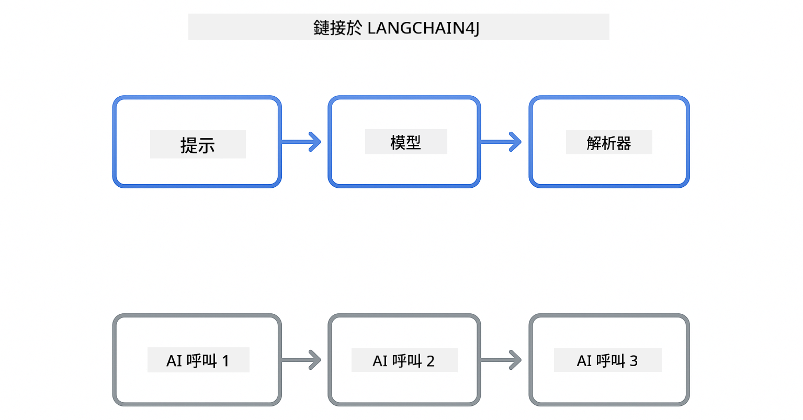

<!--
CO_OP_TRANSLATOR_METADATA:
{
  "original_hash": "377b3e3e6f8d02965bf0fbbc9ccb45c5",
  "translation_date": "2025-12-13T14:38:15+00:00",
  "source_file": "00-quick-start/README.md",
  "language_code": "hk"
}
-->
# Module 00: 快速開始

## 目錄

- [介紹](../../../00-quick-start)
- [什麼是 LangChain4j？](../../../00-quick-start)
- [LangChain4j 依賴](../../../00-quick-start)
- [先決條件](../../../00-quick-start)
- [設定](../../../00-quick-start)
  - [1. 取得你的 GitHub 令牌](../../../00-quick-start)
  - [2. 設定你的令牌](../../../00-quick-start)
- [執行範例](../../../00-quick-start)
  - [1. 基本聊天](../../../00-quick-start)
  - [2. 提示模式](../../../00-quick-start)
  - [3. 函數呼叫](../../../00-quick-start)
  - [4. 文件問答 (RAG)](../../../00-quick-start)
- [每個範例展示什麼](../../../00-quick-start)
- [下一步](../../../00-quick-start)
- [故障排除](../../../00-quick-start)

## 介紹

此快速入門旨在讓你盡快開始使用 LangChain4j。它涵蓋了使用 LangChain4j 和 GitHub 模型構建 AI 應用的絕對基礎。在接下來的模組中，你將使用 Azure OpenAI 與 LangChain4j 來構建更高級的應用。

## 什麼是 LangChain4j？

LangChain4j 是一個簡化構建 AI 驅動應用的 Java 函式庫。你不需要處理 HTTP 用戶端和 JSON 解析，而是使用乾淨的 Java API。

LangChain 中的「鏈」指的是將多個組件串接起來——你可能會將提示鏈接到模型，再鏈接到解析器，或者將多個 AI 呼叫串接起來，其中一個輸出作為下一個輸入。此快速入門專注於基礎，之後會探索更複雜的鏈。



*LangChain4j 中的組件串接——建構塊連接起來創造強大的 AI 工作流程*

我們將使用三個核心組件：

**ChatLanguageModel** - AI 模型互動的介面。呼叫 `model.chat("prompt")` 並獲得回應字串。我們使用 `OpenAiOfficialChatModel`，它可與 OpenAI 相容的端點（如 GitHub 模型）一起使用。

**AiServices** - 創建類型安全的 AI 服務介面。定義方法，使用 `@Tool` 註解，LangChain4j 負責協調。AI 會在需要時自動呼叫你的 Java 方法。

**MessageWindowChatMemory** - 維護對話歷史。沒有它，每個請求都是獨立的。有了它，AI 會記住之前的訊息並在多輪對話中保持上下文。


*LangChain4j 架構——核心組件協同工作，驅動你的 AI 應用*

## LangChain4j 依賴

此快速入門在 [`pom.xml`](../../../00-quick-start/pom.xml) 中使用兩個 Maven 依賴：

```xml
<!-- Core LangChain4j library -->
<dependency>
    <groupId>dev.langchain4j</groupId>
    <artifactId>langchain4j</artifactId> <!-- Inherited from BOM in root pom.xml -->
</dependency>

<!-- OpenAI integration (works with GitHub Models) -->
<dependency>
    <groupId>dev.langchain4j</groupId>
    <artifactId>langchain4j-open-ai-official</artifactId> <!-- Inherited from BOM in root pom.xml -->
</dependency>
```

`langchain4j-open-ai-official` 模組提供了連接到 OpenAI 相容 API 的 `OpenAiOfficialChatModel` 類。GitHub 模型使用相同的 API 格式，因此不需要特殊適配器——只需將基底 URL 指向 `https://models.github.ai/inference`。

## 先決條件

**使用開發容器？** Java 和 Maven 已預裝。你只需要一個 GitHub 個人存取令牌。

**本地開發：**
- Java 21+，Maven 3.9+
- GitHub 個人存取令牌（以下有說明）

> **注意：** 本模組使用 GitHub 模型的 `gpt-4.1-nano`。請勿修改程式碼中的模型名稱——它已配置為與 GitHub 可用模型相容。

## 設定

### 1. 取得你的 GitHub 令牌

1. 前往 [GitHub 設定 → 個人存取令牌](https://github.com/settings/personal-access-tokens)
2. 點擊「產生新令牌」
3. 設定描述性名稱（例如「LangChain4j Demo」）
4. 設定過期時間（建議 7 天）
5. 在「帳戶權限」中找到「Models」並設為「唯讀」
6. 點擊「產生令牌」
7. 複製並保存你的令牌——之後無法再看到

### 2. 設定你的令牌

**選項 1：使用 VS Code（推薦）**

如果你使用 VS Code，將令牌加入專案根目錄的 `.env` 檔案：

如果 `.env` 檔案不存在，請複製 `.env.example` 為 `.env`，或在專案根目錄建立新的 `.env` 檔案。

**範例 `.env` 檔案：**
```bash
# 在 /workspaces/LangChain4j-for-Beginners/.env
GITHUB_TOKEN=your_token_here
```

然後你可以在檔案總管中右鍵點擊任何範例檔案（例如 `BasicChatDemo.java`），選擇 **「執行 Java」**，或使用「執行與除錯」面板中的啟動設定。

**選項 2：使用終端機**

將令牌設為環境變數：

**Bash:**
```bash
export GITHUB_TOKEN=your_token_here
```

**PowerShell:**
```powershell
$env:GITHUB_TOKEN=your_token_here
```

## 執行範例

**使用 VS Code：** 只需在檔案總管中右鍵點擊任何範例檔案，選擇 **「執行 Java」**，或使用「執行與除錯」面板中的啟動設定（確保你已先將令牌加入 `.env` 檔案）。

**使用 Maven：** 你也可以從命令列執行：

### 1. 基本聊天

**Bash:**
```bash
mvn compile exec:java -Dexec.mainClass=com.example.langchain4j.quickstart.BasicChatDemo
```

**PowerShell:**
```powershell
mvn --% compile exec:java -Dexec.mainClass=com.example.langchain4j.quickstart.BasicChatDemo
```

### 2. 提示模式

**Bash:**
```bash
mvn compile exec:java -Dexec.mainClass=com.example.langchain4j.quickstart.PromptEngineeringDemo
```

**PowerShell:**
```powershell
mvn --% compile exec:java -Dexec.mainClass=com.example.langchain4j.quickstart.PromptEngineeringDemo
```

展示零次學習、少次學習、思維鏈和角色提示。

### 3. 函數呼叫

**Bash:**
```bash
mvn compile exec:java -Dexec.mainClass=com.example.langchain4j.quickstart.ToolIntegrationDemo
```

**PowerShell:**
```powershell
mvn --% compile exec:java -Dexec.mainClass=com.example.langchain4j.quickstart.ToolIntegrationDemo
```

AI 會在需要時自動呼叫你的 Java 方法。

### 4. 文件問答 (RAG)

**Bash:**
```bash
mvn compile exec:java -Dexec.mainClass=com.example.langchain4j.quickstart.SimpleReaderDemo
```

**PowerShell:**
```powershell
mvn --% compile exec:java -Dexec.mainClass=com.example.langchain4j.quickstart.SimpleReaderDemo
```

針對 `document.txt` 中的內容提問。

## 每個範例展示什麼

**基本聊天** - [BasicChatDemo.java](../../../00-quick-start/src/main/java/com/example/langchain4j/quickstart/BasicChatDemo.java)

從這裡開始，看看 LangChain4j 的最簡單用法。你會建立一個 `OpenAiOfficialChatModel`，用 `.chat()` 傳送提示，並獲得回應。這展示了基礎：如何用自訂端點和 API 金鑰初始化模型。理解這個模式後，其他功能都建立在此基礎上。

```java
ChatLanguageModel model = OpenAiOfficialChatModel.builder()
    .baseUrl("https://models.github.ai/inference")
    .apiKey(System.getenv("GITHUB_TOKEN"))
    .modelName("gpt-4.1-nano")
    .build();

String response = model.chat("What is LangChain4j?");
System.out.println(response);
```

> **🤖 使用 [GitHub Copilot](https://github.com/features/copilot) Chat 試試看：** 開啟 [`BasicChatDemo.java`](../../../00-quick-start/src/main/java/com/example/langchain4j/quickstart/BasicChatDemo.java) 並問：
> - 「我如何在這段程式碼中從 GitHub 模型切換到 Azure OpenAI？」
> - 「OpenAiOfficialChatModel.builder() 還能設定哪些參數？」
> - 「如何加入串流回應，而不是等待完整回應？」

**提示工程** - [PromptEngineeringDemo.java](../../../00-quick-start/src/main/java/com/example/langchain4j/quickstart/PromptEngineeringDemo.java)

既然你知道如何與模型對話，讓我們探索你對它說什麼。此範例使用相同模型設定，但展示四種不同的提示模式。試試零次學習提示以直接指令、少次學習提示以範例學習、思維鏈提示以揭示推理步驟，以及角色提示以設定上下文。你會看到同一模型根據提示方式給出截然不同的結果。

```java
PromptTemplate template = PromptTemplate.from(
    "What's the best time to visit {{destination}} for {{activity}}?"
);

Prompt prompt = template.apply(Map.of(
    "destination", "Paris",
    "activity", "sightseeing"
));

String response = model.chat(prompt.text());
```

> **🤖 使用 [GitHub Copilot](https://github.com/features/copilot) Chat 試試看：** 開啟 [`PromptEngineeringDemo.java`](../../../00-quick-start/src/main/java/com/example/langchain4j/quickstart/PromptEngineeringDemo.java) 並問：
> - 「零次學習和少次學習提示有什麼差別？什麼時候該用哪一種？」
> - 「temperature 參數如何影響模型回應？」
> - 「有哪些技術可以防止生產環境中的提示注入攻擊？」
> - 「如何為常用模式建立可重用的 PromptTemplate 物件？」

**工具整合** - [ToolIntegrationDemo.java](../../../00-quick-start/src/main/java/com/example/langchain4j/quickstart/ToolIntegrationDemo.java)

這是 LangChain4j 強大的地方。你會使用 `AiServices` 創建一個 AI 助手，可以呼叫你的 Java 方法。只需用 `@Tool("描述")` 註解方法，LangChain4j 會處理其餘——AI 會根據使用者的提問自動決定何時使用每個工具。這展示了函數呼叫，是構建能採取行動而不僅是回答問題的 AI 的關鍵技術。

```java
@Tool("Performs addition of two numeric values")
public double add(double a, double b) {
    return a + b;
}

MathAssistant assistant = AiServices.create(MathAssistant.class, model);
String response = assistant.chat("What is 25 plus 17?");
```

> **🤖 使用 [GitHub Copilot](https://github.com/features/copilot) Chat 試試看：** 開啟 [`ToolIntegrationDemo.java`](../../../00-quick-start/src/main/java/com/example/langchain4j/quickstart/ToolIntegrationDemo.java) 並問：
> - 「@Tool 註解如何運作？LangChain4j 背後做了什麼？」
> - 「AI 可以連續呼叫多個工具來解決複雜問題嗎？」
> - 「如果工具拋出例外，該如何處理錯誤？」
> - 「我如何整合真實 API，而不是這個計算器範例？」

**文件問答 (RAG)** - [SimpleReaderDemo.java](../../../00-quick-start/src/main/java/com/example/langchain4j/quickstart/SimpleReaderDemo.java)

這裡你會看到 RAG（檢索增強生成）的基礎。你不是依賴模型的訓練資料，而是從 [`document.txt`](../../../00-quick-start/document.txt) 載入內容並包含在提示中。AI 根據你的文件回答，而非其一般知識。這是構建能使用你自己資料的系統的第一步。

```java
Document document = FileSystemDocumentLoader.loadDocument("document.txt");
String content = document.text();

String prompt = "Based on this document: " + content + 
                "\nQuestion: What is the main topic?";
String response = model.chat(prompt);
```

> **注意：** 此簡單方法將整個文件載入提示。對於大型檔案（>10KB），你會超出上下文限制。模組 03 會介紹分塊和向量搜尋，用於生產級 RAG 系統。

> **🤖 使用 [GitHub Copilot](https://github.com/features/copilot) Chat 試試看：** 開啟 [`SimpleReaderDemo.java`](../../../00-quick-start/src/main/java/com/example/langchain4j/quickstart/SimpleReaderDemo.java) 並問：
> - 「RAG 如何防止 AI 幻覺，相較於使用模型訓練資料？」
> - 「這種簡單方法和使用向量嵌入檢索有什麼差別？」
> - 「我如何擴展以處理多個文件或更大的知識庫？」
> - 「結構化提示的最佳實踐是什麼，以確保 AI 只使用提供的上下文？」

## 除錯

範例包含 `.logRequests(true)` 和 `.logResponses(true)`，可在主控台顯示 API 呼叫，有助於排查認證錯誤、速率限制或意外回應。生產環境中請移除這些標誌以減少日誌噪音。

## 下一步

**下一模組：** [01-introduction - 使用 LangChain4j 和 Azure 上的 gpt-5 入門](../01-introduction/README.md)

---

**導覽：** [← 返回主頁](../README.md) | [下一步：模組 01 - 介紹 →](../01-introduction/README.md)

---

## 故障排除

### 第一次 Maven 建置

**問題：** 初次執行 `mvn clean compile` 或 `mvn package` 需要很長時間（10-15 分鐘）

**原因：** Maven 需要在第一次建置時下載所有專案依賴（Spring Boot、LangChain4j 函式庫、Azure SDK 等）。

**解決方案：** 這是正常行為。後續建置會快很多，因為依賴已快取在本地。下載時間取決於你的網路速度。

### PowerShell Maven 指令語法

**問題：** Maven 指令失敗，錯誤訊息為 `Unknown lifecycle phase ".mainClass=..."`

**原因：** PowerShell 將 `=` 解讀為變數賦值運算子，破壞了 Maven 屬性語法。

**解決方案：** 在 Maven 指令前使用停止解析運算子 `--%`：

**PowerShell:**
```powershell
mvn --% compile exec:java -Dexec.mainClass=com.example.langchain4j.quickstart.BasicChatDemo
```

**Bash:**
```bash
mvn compile exec:java -Dexec.mainClass=com.example.langchain4j.quickstart.BasicChatDemo
```

`--%` 運算子告訴 PowerShell 將後續所有參數原樣傳給 Maven，不做解析。

### Windows PowerShell Emoji 顯示問題

**問題：** AI 回應在 PowerShell 中顯示亂碼（例如 `????` 或 `â??`）而非表情符號

**原因：** PowerShell 預設編碼不支援 UTF-8 表情符號

**解決方案：** 執行 Java 應用前先執行此指令：
```cmd
chcp 65001
```

這會強制終端機使用 UTF-8 編碼。或者，使用支援更好 Unicode 的 Windows Terminal。

---

<!-- CO-OP TRANSLATOR DISCLAIMER START -->
**免責聲明**：  
本文件由 AI 翻譯服務 [Co-op Translator](https://github.com/Azure/co-op-translator) 進行翻譯。雖然我們致力於確保準確性，但請注意自動翻譯可能包含錯誤或不準確之處。原始文件的母語版本應被視為權威來源。對於重要資訊，建議採用專業人工翻譯。我們不對因使用本翻譯而引起的任何誤解或誤釋承擔責任。
<!-- CO-OP TRANSLATOR DISCLAIMER END -->