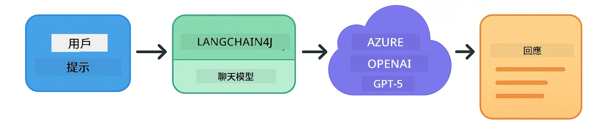
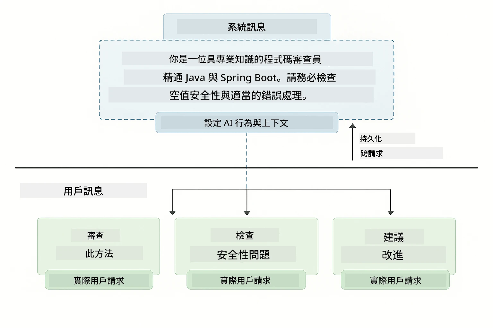
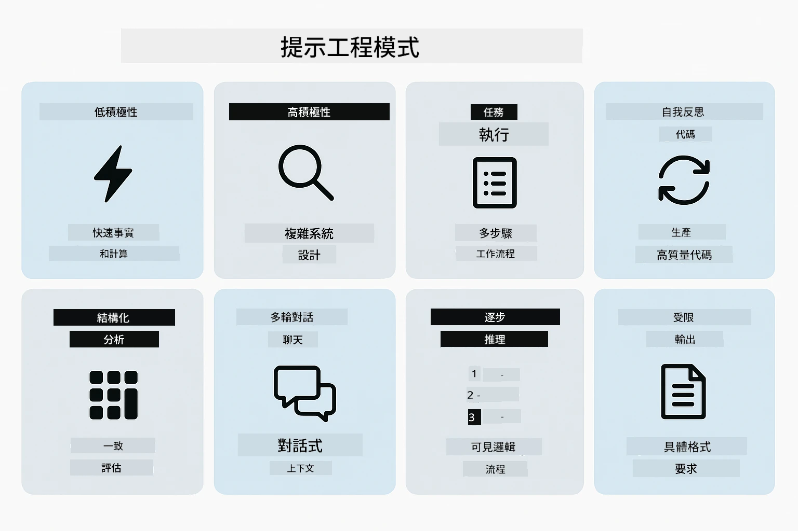
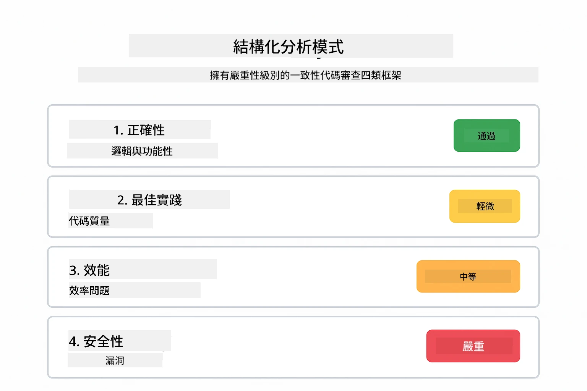
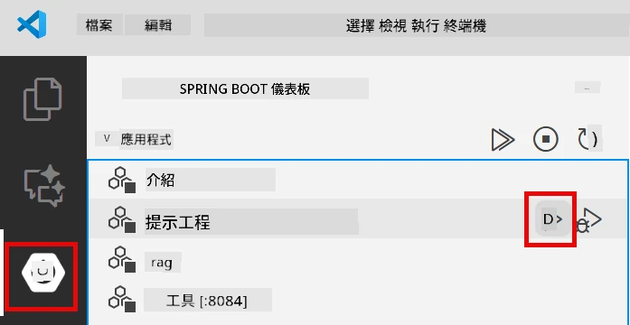
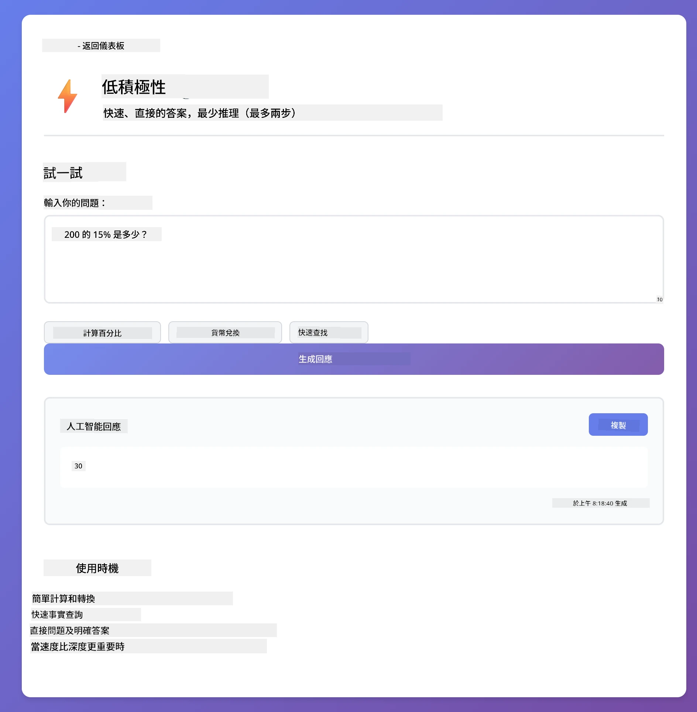
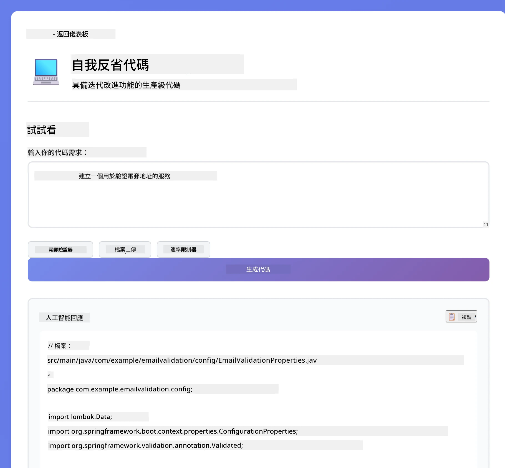
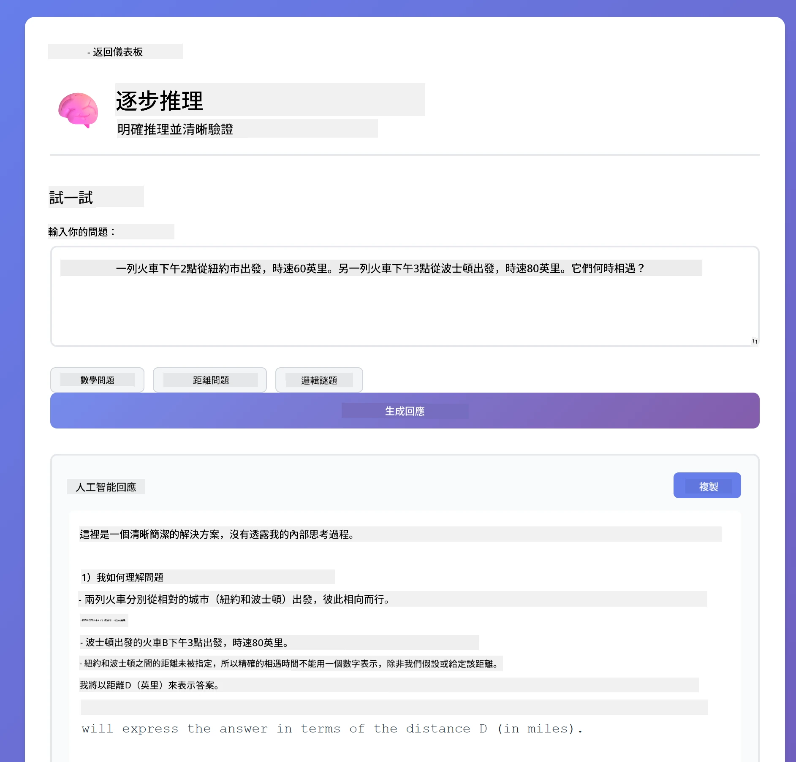
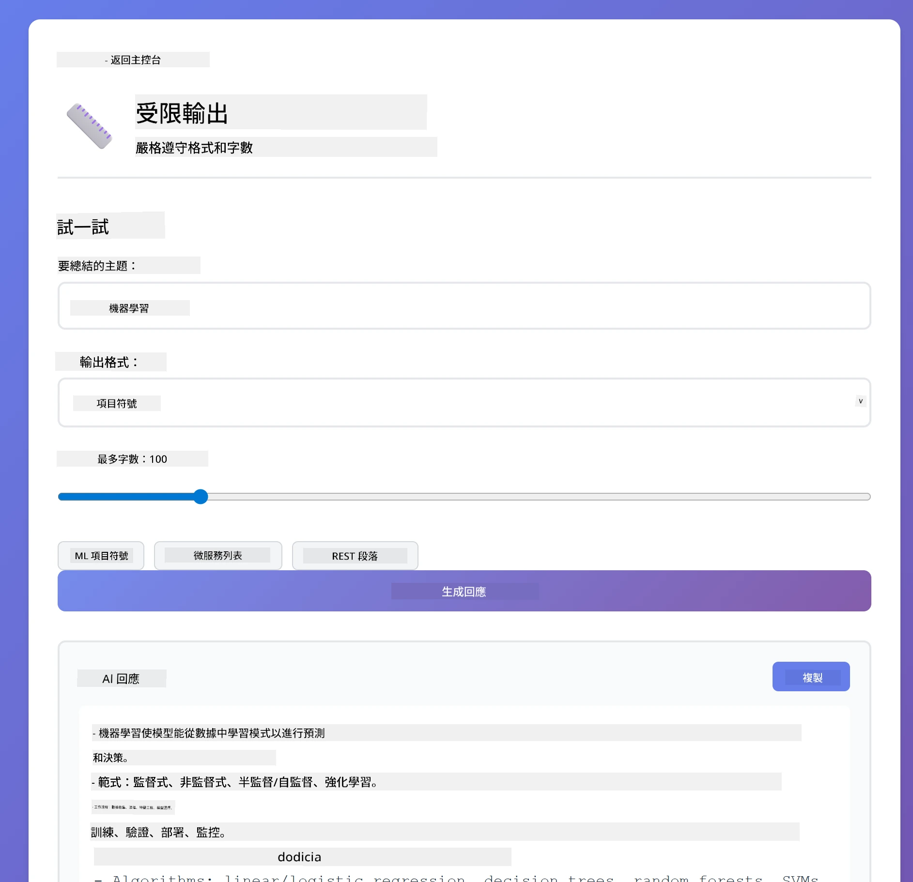

<!--
CO_OP_TRANSLATOR_METADATA:
{
  "original_hash": "8d787826cad7e92bf5cdbd116b1e6116",
  "translation_date": "2025-12-13T15:53:41+00:00",
  "source_file": "02-prompt-engineering/README.md",
  "language_code": "hk"
}
-->
# Module 02: 使用 GPT-5 的提示工程

## 目錄

- [你將學到什麼](../../../02-prompt-engineering)
- [先決條件](../../../02-prompt-engineering)
- [理解提示工程](../../../02-prompt-engineering)
- [如何使用 LangChain4j](../../../02-prompt-engineering)
- [核心模式](../../../02-prompt-engineering)
- [使用現有的 Azure 資源](../../../02-prompt-engineering)
- [應用程式截圖](../../../02-prompt-engineering)
- [探索模式](../../../02-prompt-engineering)
  - [低積極性 vs 高積極性](../../../02-prompt-engineering)
  - [任務執行（工具前言）](../../../02-prompt-engineering)
  - [自我反思代碼](../../../02-prompt-engineering)
  - [結構化分析](../../../02-prompt-engineering)
  - [多輪對話](../../../02-prompt-engineering)
  - [逐步推理](../../../02-prompt-engineering)
  - [受限輸出](../../../02-prompt-engineering)
- [你真正學到的是什麼](../../../02-prompt-engineering)
- [下一步](../../../02-prompt-engineering)

## 你將學到什麼

在上一個模組中，你已經了解記憶如何促進對話式 AI，並使用 GitHub Models 進行基本互動。現在我們將專注於如何提問——也就是提示本身——使用 Azure OpenAI 的 GPT-5。你如何結構提示會大幅影響你得到的回應品質。

我們使用 GPT-5 是因為它引入了推理控制——你可以告訴模型在回答前要思考多少。這使得不同的提示策略更明顯，並幫助你了解何時使用每種方法。我們也會受益於 Azure 對 GPT-5 較少的速率限制，相較於 GitHub Models。

## 先決條件

- 完成模組 01（已部署 Azure OpenAI 資源）
- 根目錄下有 `.env` 檔案，包含 Azure 憑證（由模組 01 的 `azd up` 建立）

> **注意：** 如果你還沒完成模組 01，請先按照那裡的部署說明操作。

## 理解提示工程

提示工程是設計輸入文字，使你能持續獲得所需結果的技術。它不只是提問，而是結構化請求，讓模型精確理解你想要什麼以及如何交付。

把它想像成給同事下指令。「修復錯誤」太模糊。「在 UserService.java 第 45 行加入 null 檢查以修復 null pointer exception」則很具體。語言模型也是如此——具體性和結構很重要。

## 如何使用 LangChain4j

本模組示範使用與前幾個模組相同的 LangChain4j 基礎，聚焦於提示結構和推理控制的進階提示模式。



*LangChain4j 如何將你的提示連接到 Azure OpenAI GPT-5*

**依賴項** — 模組 02 使用 `pom.xml` 中定義的以下 langchain4j 依賴：
```xml
<dependency>
    <groupId>dev.langchain4j</groupId>
    <artifactId>langchain4j</artifactId> <!-- Inherited from BOM in root pom.xml -->
</dependency>
<dependency>
    <groupId>dev.langchain4j</groupId>
    <artifactId>langchain4j-open-ai-official</artifactId> <!-- Inherited from BOM in root pom.xml -->
</dependency>
```

**OpenAiOfficialChatModel 配置** — [LangChainConfig.java](../../../02-prompt-engineering/src/main/java/com/example/langchain4j/prompts/config/LangChainConfig.java)

聊天模型以 Spring bean 方式手動配置，使用支援 Azure OpenAI 端點的 OpenAI 官方客戶端。與模組 01 的主要差異在於我們如何結構傳給 `chatModel.chat()` 的提示，而非模型本身的設定。

**系統與使用者訊息** — [Gpt5PromptService.java](../../../02-prompt-engineering/src/main/java/com/example/langchain4j/prompts/service/Gpt5PromptService.java)

LangChain4j 將訊息類型分開以提高清晰度。`SystemMessage` 設定 AI 的行為與上下文（例如「你是程式碼審查員」），而 `UserMessage` 則包含實際請求。這種分離讓你能在不同使用者查詢間維持一致的 AI 行為。

```java
SystemMessage systemMsg = SystemMessage.from(
    "You are a helpful Java programming expert."
);

UserMessage userMsg = UserMessage.from(
    "Explain what a List is in Java"
);

String response = chatModel.chat(systemMsg, userMsg);
```



*SystemMessage 提供持續上下文，UserMessages 包含個別請求*

**多輪對話的 MessageWindowChatMemory** — 對於多輪對話模式，我們重用模組 01 的 `MessageWindowChatMemory`。每個會話都有自己的記憶實例，存放在 `Map<String, ChatMemory>` 中，允許多個並行對話而不混淆上下文。

**提示模板** — 這裡的重點是提示工程，而非新的 LangChain4j API。每種模式（低積極性、高積極性、任務執行等）都使用相同的 `chatModel.chat(prompt)` 方法，但提示字串經過精心結構化。XML 標籤、指令和格式都是提示文字的一部分，而非 LangChain4j 功能。

**推理控制** — GPT-5 的推理深度透過提示指令控制，如「最多 2 步推理」或「徹底探索」。這是提示工程技巧，不是 LangChain4j 配置。該函式庫只是將你的提示傳遞給模型。

關鍵重點：LangChain4j 提供基礎設施（透過 [LangChainConfig.java](../../../02-prompt-engineering/src/main/java/com/example/langchain4j/prompts/config/LangChainConfig.java) 連接模型，記憶與訊息處理透過 [Gpt5PromptService.java](../../../02-prompt-engineering/src/main/java/com/example/langchain4j/prompts/service/Gpt5PromptService.java)），而本模組教你如何在此基礎上打造有效提示。

## 核心模式

並非所有問題都需要相同方法。有些問題需要快速回答，有些則需深入思考。有些需要可見推理，有些只要結果。本模組涵蓋八種提示模式——各自針對不同場景優化。你將嘗試所有模式，學習何時使用最合適。



*八種提示工程模式及其使用案例概覽*


*低積極性（快速、直接）與高積極性（徹底、探索）推理方法比較*

**低積極性（快速且聚焦）** — 適用於你想要快速、直接答案的簡單問題。模型進行最少推理——最多 2 步。用於計算、查詢或簡單問題。

```java
String prompt = """
    <reasoning_effort>low</reasoning_effort>
    <instruction>maximum 2 reasoning steps</instruction>
    
    What is 15% of 200?
    """;

String response = chatModel.chat(prompt);
```

> 💡 **使用 GitHub Copilot 探索：** 開啟 [`Gpt5PromptService.java`](../../../02-prompt-engineering/src/main/java/com/example/langchain4j/prompts/service/Gpt5PromptService.java) 並詢問：
> - 「低積極性與高積極性提示模式有何不同？」
> - 「提示中的 XML 標籤如何幫助結構化 AI 回應？」
> - 「何時應使用自我反思模式，何時用直接指令？」

**高積極性（深入且徹底）** — 適用於你想要全面分析的複雜問題。模型會徹底探索並展示詳細推理。用於系統設計、架構決策或複雜研究。

```java
String prompt = """
    <reasoning_effort>high</reasoning_effort>
    <instruction>explore thoroughly, show detailed reasoning</instruction>
    
    Design a caching strategy for a high-traffic REST API.
    """;

String response = chatModel.chat(prompt);
```

**任務執行（逐步進展）** — 適用於多步驟工作流程。模型先提供計劃，執行時逐步敘述，最後給出總結。用於遷移、實作或任何多步驟流程。

```java
String prompt = """
    <task>Create a REST endpoint for user registration</task>
    <preamble>Provide an upfront plan</preamble>
    <narration>Narrate each step as you work</narration>
    <summary>Summarize what was accomplished</summary>
    """;

String response = chatModel.chat(prompt);
```

連鎖思考提示明確要求模型展示推理過程，提升複雜任務的準確度。逐步拆解有助於人類與 AI 理解邏輯。

> **🤖 使用 [GitHub Copilot](https://github.com/features/copilot) Chat 試試：** 詢問此模式：
> - 「如何調整任務執行模式以適應長時間運行操作？」
> - 「在生產應用中結構化工具前言的最佳實踐是什麼？」
> - 「如何在 UI 中捕捉並顯示中間進度更新？」


*計劃 → 執行 → 總結的多步任務工作流程*

**自我反思代碼** — 用於生成生產級代碼。模型生成代碼，根據品質標準檢查並迭代改進。用於開發新功能或服務。

```java
String prompt = """
    <task>Create an email validation service</task>
    <quality_criteria>
    - Correct logic and error handling
    - Best practices (clean code, proper naming)
    - Performance optimization
    - Security considerations
    </quality_criteria>
    <instruction>Generate code, evaluate against criteria, improve iteratively</instruction>
    """;

String response = chatModel.chat(prompt);
```


*迭代改進循環——生成、評估、識別問題、改進、重複*

**結構化分析** — 用於一致性評估。模型使用固定框架（正確性、實踐、效能、安全性）審查代碼。用於程式碼審查或品質評估。

```java
String prompt = """
    <code>
    public List getUsers() {
        return database.query("SELECT * FROM users");
    }
    </code>
    
    <framework>
    Evaluate using these categories:
    1. Correctness - Logic and functionality
    2. Best Practices - Code quality
    3. Performance - Efficiency concerns
    4. Security - Vulnerabilities
    </framework>
    """;

String response = chatModel.chat(prompt);
```

> **🤖 使用 [GitHub Copilot](https://github.com/features/copilot) Chat 試試：** 詢問結構化分析：
> - 「如何為不同類型的程式碼審查自訂分析框架？」
> - 「以程式方式解析並處理結構化輸出的最佳方法是什麼？」
> - 「如何確保不同審查會話中嚴重性等級的一致性？」



*四類框架用於一致的程式碼審查，並帶有嚴重性等級*

**多輪對話** — 適用於需要上下文的對話。模型記住先前訊息並基於此回應。用於互動式幫助或複雜問答。

```java
ChatMemory memory = MessageWindowChatMemory.withMaxMessages(10);

memory.add(UserMessage.from("What is Spring Boot?"));
AiMessage aiMessage1 = chatModel.chat(memory.messages()).aiMessage();
memory.add(aiMessage1);

memory.add(UserMessage.from("Show me an example"));
AiMessage aiMessage2 = chatModel.chat(memory.messages()).aiMessage();
memory.add(aiMessage2);
```


*對話上下文如何隨多輪累積，直到達到 token 限制*

**逐步推理** — 適用於需要可見邏輯的問題。模型展示每步的明確推理。用於數學問題、邏輯謎題，或你想理解思考過程時。

```java
String prompt = """
    <instruction>Show your reasoning step-by-step</instruction>
    
    If a train travels 120 km in 2 hours, then stops for 30 minutes,
    then travels another 90 km in 1.5 hours, what is the average speed
    for the entire journey including the stop?
    """;

String response = chatModel.chat(prompt);
```


*將問題拆解為明確的邏輯步驟*

**受限輸出** — 適用於有特定格式要求的回應。模型嚴格遵守格式和長度規則。用於摘要或需要精確輸出結構時。

```java
String prompt = """
    <constraints>
    - Exactly 100 words
    - Bullet point format
    - Technical terms only
    </constraints>
    
    Summarize the key concepts of machine learning.
    """;

String response = chatModel.chat(prompt);
```


*強制特定格式、長度與結構要求*

## 使用現有的 Azure 資源

**驗證部署：**

確保根目錄有 `.env` 檔案，包含 Azure 憑證（模組 01 部署時建立）：
```bash
cat ../.env  # 應該顯示 AZURE_OPENAI_ENDPOINT、API_KEY、DEPLOYMENT
```

**啟動應用程式：**

> **注意：** 如果你已使用模組 01 的 `./start-all.sh` 啟動所有應用，本模組已在 8083 埠運行。你可以跳過以下啟動指令，直接前往 http://localhost:8083。

**選項 1：使用 Spring Boot Dashboard（推薦 VS Code 使用者）**

開發容器包含 Spring Boot Dashboard 擴充套件，提供視覺化介面管理所有 Spring Boot 應用。你可在 VS Code 左側活動列找到（尋找 Spring Boot 圖示）。

透過 Spring Boot Dashboard，你可以：
- 查看工作區內所有可用的 Spring Boot 應用
- 一鍵啟動/停止應用
- 即時查看應用日誌
- 監控應用狀態

只需點擊「prompt-engineering」旁的播放按鈕啟動本模組，或一次啟動所有模組。



**選項 2：使用 shell 腳本**

啟動所有網頁應用（模組 01-04）：

**Bash:**
```bash
cd ..  # 從根目錄開始
./start-all.sh
```

**PowerShell:**
```powershell
cd ..  # 從根目錄開始
.\start-all.ps1
```

或只啟動本模組：

**Bash:**
```bash
cd 02-prompt-engineering
./start.sh
```

**PowerShell:**
```powershell
cd 02-prompt-engineering
.\start.ps1
```

兩個腳本會自動從根目錄 `.env` 檔載入環境變數，且若 JAR 不存在會自動編譯。

> **注意：** 若你想先手動編譯所有模組再啟動：
>
> **Bash:**
> ```bash
> cd ..  # Go to root directory
> mvn clean package -DskipTests
> ```
>
> **PowerShell:**
> ```powershell
> cd ..  # Go to root directory
> mvn clean package -DskipTests
> ```

在瀏覽器開啟 http://localhost:8083。

**停止應用：**

**Bash:**
```bash
./stop.sh  # 僅此模組
# 或者
cd .. && ./stop-all.sh  # 所有模組
```

**PowerShell:**
```powershell
.\stop.ps1  # 僅此模組
# 或
cd ..; .\stop-all.ps1  # 所有模組
```

## 應用程式截圖


*主控台顯示所有 8 種提示工程模式及其特性與使用案例*

## 探索模式

網頁介面讓你嘗試不同提示策略。每種模式解決不同問題——試試看，看看何時每種方法最有效。

### 低積極性 vs 高積極性

用低積極性問個簡單問題，例如「200 的 15% 是多少？」你會得到即時、直接的答案。現在用高積極性問個複雜問題，例如「設計一個高流量 API 的快取策略」。觀察模型如何放慢速度並提供詳細推理。相同模型、相同問題結構——但提示告訴它要思考多少。


*快速計算，最少推理*


*全面快取策略 (2.8MB)*

### 任務執行（工具前言）

多步驟工作流程受惠於事先規劃和進度敘述。模型會概述它將做什麼，敘述每一步，然後總結結果。


*建立帶有逐步敘述的 REST 端點 (3.9MB)*

### 自我反思程式碼

試試「建立一個電子郵件驗證服務」。模型不只是生成程式碼然後停止，而是生成後根據品質標準評估，找出弱點並改進。你會看到它反覆迭代直到程式碼達到生產標準。



*完整的電子郵件驗證服務 (5.2MB)*

### 結構化分析

程式碼審查需要一致的評估框架。模型使用固定類別（正確性、實務、效能、安全性）及嚴重程度來分析程式碼。


*基於框架的程式碼審查*

### 多輪對話

問「什麼是 Spring Boot？」然後緊接著問「給我一個範例」。模型會記住你的第一個問題，並專門給你一個 Spring Boot 範例。沒有記憶，第二個問題會太模糊。


*跨問題的上下文保存*

### 逐步推理

選一個數學問題，分別用逐步推理和低熱情度嘗試。低熱情度只給你答案——快速但不透明。逐步推理會展示每個計算和決策。



*帶有明確步驟的數學問題*

### 受限輸出

當你需要特定格式或字數時，這個模式強制嚴格遵守。試著生成一個正好 100 字的項目符號格式摘要。



*帶格式控制的機器學習摘要*

## 你真正學到的是什麼

**推理努力改變一切**

GPT-5 讓你透過提示控制計算努力。低努力意味著快速回應且探索最少。高努力意味著模型花時間深入思考。你正在學習如何將努力與任務複雜度匹配——不要在簡單問題上浪費時間，也不要在複雜決策上草率。

**結構引導行為**

注意提示中的 XML 標籤？它們不是裝飾。模型比起自由文本，更可靠地遵循結構化指令。當你需要多步驟流程或複雜邏輯時，結構幫助模型追蹤目前位置和接下來的步驟。


*結構良好的提示解剖，有清晰區段和 XML 風格組織*

**透過自我評估提升品質**

自我反思模式透過明確品質標準運作。你不再只是希望模型「做對」，而是明確告訴它「對」是什麼：正確邏輯、錯誤處理、效能、安全性。模型能評估自身輸出並改進。這讓程式碼生成從抽獎變成一個流程。

**上下文是有限的**

多輪對話透過每次請求包含訊息歷史來運作。但有上限——每個模型都有最大 token 數。隨著對話增長，你需要策略來保留相關上下文而不超限。本模組展示記憶如何運作；之後你會學到何時摘要、何時忘記、何時檢索。

## 下一步

**下一模組：** [03-rag - RAG (檢索增強生成)](../03-rag/README.md)

---

**導覽：** [← 上一個：模組 01 - 介紹](../01-introduction/README.md) | [回主頁](../README.md) | [下一個：模組 03 - RAG →](../03-rag/README.md)

---

<!-- CO-OP TRANSLATOR DISCLAIMER START -->
**免責聲明**：  
本文件由 AI 翻譯服務 [Co-op Translator](https://github.com/Azure/co-op-translator) 進行翻譯。雖然我們致力於確保準確性，但請注意自動翻譯可能包含錯誤或不準確之處。原始文件的母語版本應被視為權威來源。對於重要資訊，建議採用專業人工翻譯。我們不對因使用本翻譯而引起的任何誤解或誤釋承擔責任。
<!-- CO-OP TRANSLATOR DISCLAIMER END -->