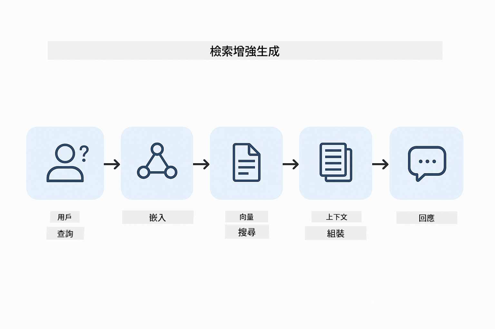
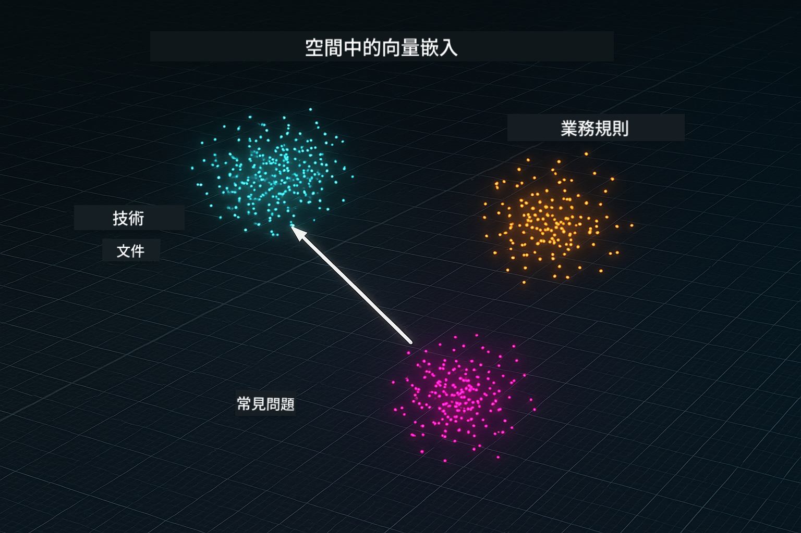
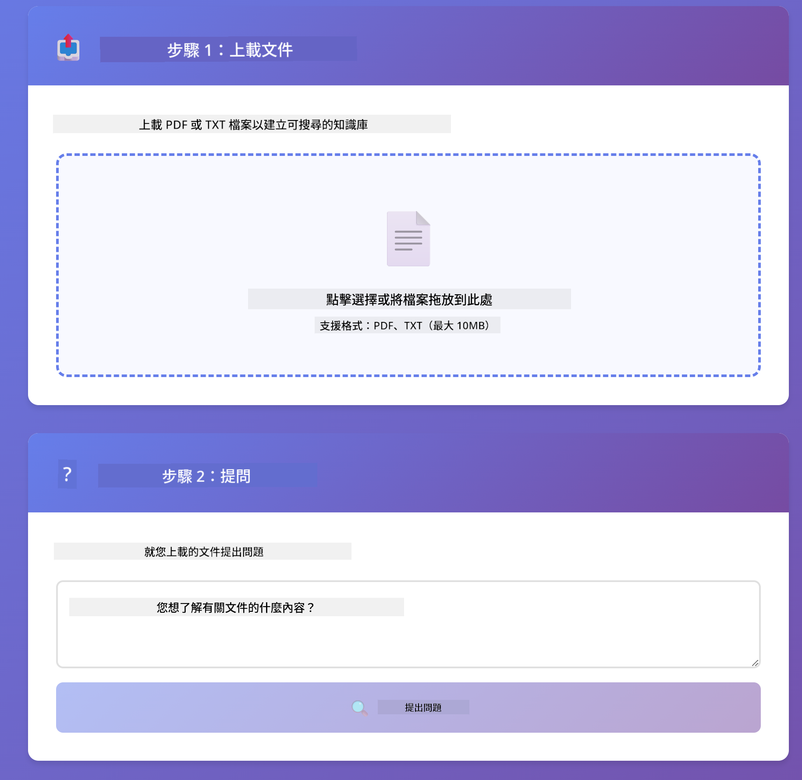

<!--
CO_OP_TRANSLATOR_METADATA:
{
  "original_hash": "f538a51cfd13147d40d84e936a0f485c",
  "translation_date": "2025-12-13T16:50:22+00:00",
  "source_file": "03-rag/README.md",
  "language_code": "hk"
}
-->
# Module 03: RAG (檢索增強生成)

## 目錄

- [你將學到什麼](../../../03-rag)
- [先決條件](../../../03-rag)
- [理解 RAG](../../../03-rag)
- [運作原理](../../../03-rag)
  - [文件處理](../../../03-rag)
  - [建立嵌入向量](../../../03-rag)
  - [語義搜尋](../../../03-rag)
  - [答案生成](../../../03-rag)
- [執行應用程式](../../../03-rag)
- [使用應用程式](../../../03-rag)
  - [上傳文件](../../../03-rag)
  - [提問](../../../03-rag)
  - [檢查來源參考](../../../03-rag)
  - [試驗提問](../../../03-rag)
- [關鍵概念](../../../03-rag)
  - [分塊策略](../../../03-rag)
  - [相似度分數](../../../03-rag)
  - [記憶體儲存](../../../03-rag)
  - [上下文視窗管理](../../../03-rag)
- [何時使用 RAG](../../../03-rag)
- [下一步](../../../03-rag)

## 你將學到什麼

在前面的模組中，你學會了如何與 AI 進行對話並有效地結構化提示。但有一個根本限制：語言模型只知道它在訓練期間學到的東西。它們無法回答關於你公司政策、專案文件或任何未經訓練的資訊的問題。

RAG（檢索增強生成）解決了這個問題。它不是試圖教模型你的資訊（這既昂貴又不切實際），而是賦予它搜尋你文件的能力。當有人提出問題時，系統會找到相關資訊並將其包含在提示中。模型然後根據檢索到的上下文來回答。

把 RAG 想像成給模型一個參考圖書館。當你提問時，系統會：

1. **使用者查詢** - 你提出問題
2. **嵌入向量** - 將你的問題轉換成向量
3. **向量搜尋** - 找出相似的文件分塊
4. **上下文組合** - 將相關分塊加入提示
5. **回應** - LLM 根據上下文生成答案

這使模型的回答基於你的實際資料，而不是依賴其訓練知識或憑空捏造答案。



*RAG 工作流程 - 從使用者查詢到語義搜尋再到上下文答案生成*

## 先決條件

- 完成模組 01（已部署 Azure OpenAI 資源）
- 根目錄有 `.env` 檔案，包含 Azure 認證（由模組 01 的 `azd up` 建立）

> **注意：** 如果你還沒完成模組 01，請先按照那裡的部署說明操作。

## 運作原理

**文件處理** - [DocumentService.java](../../../03-rag/src/main/java/com/example/langchain4j/rag/service/DocumentService.java)

當你上傳文件時，系統會將其拆分成分塊——較小的片段，能舒適地放入模型的上下文視窗。這些分塊會稍微重疊，以免在邊界處失去上下文。

```java
Document document = FileSystemDocumentLoader.loadDocument("sample-document.txt");

DocumentSplitter splitter = DocumentSplitters
    .recursive(300, 30, new OpenAiTokenizer());

List<TextSegment> segments = splitter.split(document);
```

> **🤖 嘗試使用 [GitHub Copilot](https://github.com/features/copilot) Chat：** 打開 [`DocumentService.java`](../../../03-rag/src/main/java/com/example/langchain4j/rag/service/DocumentService.java) 並詢問：
> - "LangChain4j 如何將文件拆分成分塊，為什麼重疊很重要？"
> - "不同文件類型的最佳分塊大小是多少，為什麼？"
> - "如何處理多語言或特殊格式的文件？"

**建立嵌入向量** - [LangChainRagConfig.java](../../../03-rag/src/main/java/com/example/langchain4j/rag/config/LangChainRagConfig.java)

每個分塊會被轉換成一個數值表示，稱為嵌入向量——本質上是一個捕捉文本意義的數學指紋。相似的文本會產生相似的嵌入向量。

```java
@Bean
public EmbeddingModel embeddingModel() {
    return OpenAiOfficialEmbeddingModel.builder()
        .baseUrl(azureOpenAiEndpoint)
        .apiKey(azureOpenAiKey)
        .modelName(azureEmbeddingDeploymentName)
        .build();
}

EmbeddingStore<TextSegment> embeddingStore = 
    new InMemoryEmbeddingStore<>();
```



*文件在嵌入空間中以向量表示——相似內容會聚集在一起*

**語義搜尋** - [RagService.java](../../../03-rag/src/main/java/com/example/langchain4j/rag/service/RagService.java)

當你提出問題時，你的問題也會被轉換成嵌入向量。系統將你的問題嵌入向量與所有文件分塊的嵌入向量進行比較。它會找到意義最相似的分塊——不只是匹配關鍵字，而是真正的語義相似度。

```java
Embedding queryEmbedding = embeddingModel.embed(question).content();

List<EmbeddingMatch<TextSegment>> matches = 
    embeddingStore.findRelevant(queryEmbedding, 5, 0.7);

for (EmbeddingMatch<TextSegment> match : matches) {
    String relevantText = match.embedded().text();
    double score = match.score();
}
```

> **🤖 嘗試使用 [GitHub Copilot](https://github.com/features/copilot) Chat：** 打開 [`RagService.java`](../../../03-rag/src/main/java/com/example/langchain4j/rag/service/RagService.java) 並詢問：
> - "嵌入向量的相似度搜尋如何運作，分數是如何決定的？"
> - "我應該使用什麼相似度閾值，這會如何影響結果？"
> - "如果找不到相關文件，我該怎麼辦？"

**答案生成** - [RagService.java](../../../03-rag/src/main/java/com/example/langchain4j/rag/service/RagService.java)

最相關的分塊會被包含在模型的提示中。模型閱讀這些特定分塊，並根據這些資訊回答你的問題。這防止了幻覺現象——模型只能根據眼前的內容回答。

## 執行應用程式

**確認部署：**

確保根目錄有 `.env` 檔案，包含 Azure 認證（在模組 01 中建立）：
```bash
cat ../.env  # 應該顯示 AZURE_OPENAI_ENDPOINT、API_KEY、DEPLOYMENT
```

**啟動應用程式：**

> **注意：** 如果你已經使用模組 01 的 `./start-all.sh` 啟動所有應用程式，本模組已在 8081 埠運行。你可以跳過以下啟動指令，直接訪問 http://localhost:8081。

**選項 1：使用 Spring Boot Dashboard（推薦 VS Code 使用者）**

開發容器包含 Spring Boot Dashboard 擴充功能，提供管理所有 Spring Boot 應用程式的視覺介面。你可以在 VS Code 左側的活動欄找到它（尋找 Spring Boot 圖示）。

在 Spring Boot Dashboard 中，你可以：
- 查看工作區中所有可用的 Spring Boot 應用程式
- 一鍵啟動/停止應用程式
- 實時查看應用程式日誌
- 監控應用程式狀態

只需點擊 "rag" 旁的播放按鈕啟動此模組，或一次啟動所有模組。


**選項 2：使用 shell 腳本**

啟動所有網頁應用程式（模組 01-04）：

**Bash:**
```bash
cd ..  # 從根目錄開始
./start-all.sh
```

**PowerShell:**
```powershell
cd ..  # 從根目錄開始
.\start-all.ps1
```

或只啟動本模組：

**Bash:**
```bash
cd 03-rag
./start.sh
```

**PowerShell:**
```powershell
cd 03-rag
.\start.ps1
```

兩個腳本會自動從根目錄 `.env` 檔案載入環境變數，且若 JAR 檔不存在會自動編譯。

> **注意：** 如果你想先手動編譯所有模組再啟動：
>
> **Bash:**
> ```bash
> cd ..  # Go to root directory
> mvn clean package -DskipTests
> ```
>
> **PowerShell:**
> ```powershell
> cd ..  # Go to root directory
> mvn clean package -DskipTests
> ```

在瀏覽器中打開 http://localhost:8081 。

**停止應用程式：**

**Bash:**
```bash
./stop.sh  # 只有此模組
# 或者
cd .. && ./stop-all.sh  # 所有模組
```

**PowerShell:**
```powershell
.\stop.ps1  # 僅此模組
# 或
cd ..; .\stop-all.ps1  # 所有模組
```

## 使用應用程式

此應用程式提供文件上傳與提問的網頁介面。

<a href="images/rag-homepage.png"></a>

*RAG 應用程式介面 - 上傳文件並提問*

**上傳文件**

先上傳一份文件——TXT 檔案最適合測試。本目錄中提供了一個 `sample-document.txt`，包含 LangChain4j 功能、RAG 實作和最佳實踐的資訊，非常適合測試系統。

系統會處理你的文件，拆分成分塊，並為每個分塊建立嵌入向量。這會在你上傳時自動完成。

**提問**

現在針對文件內容提出具體問題。試著問一些文件中明確陳述的事實。系統會搜尋相關分塊，將它們包含在提示中，並生成答案。

**檢查來源參考**

注意每個答案都包含來源參考及相似度分數。這些分數（0 到 1）顯示每個分塊與你問題的相關程度。分數越高表示匹配越好。這讓你可以根據來源資料驗證答案。

<a href="images/rag-query-results.png"></a>

*查詢結果顯示答案及來源參考和相關分數*

**試驗提問**

嘗試不同類型的問題：
- 具體事實：「主要主題是什麼？」
- 比較：「X 和 Y 有什麼差別？」
- 摘要：「請總結關於 Z 的重點」

觀察相關分數如何根據你的問題與文件內容的匹配程度變化。

## 關鍵概念

**分塊策略**

文件被拆分成 300 代幣的分塊，重疊 30 代幣。這種平衡確保每個分塊有足夠上下文且保持足夠小，能在提示中包含多個分塊。

**相似度分數**

分數範圍從 0 到 1：
- 0.7-1.0：高度相關，精確匹配
- 0.5-0.7：相關，有良好上下文
- 低於 0.5：被過濾，差異太大

系統只檢索高於最低閾值的分塊以確保品質。

**記憶體儲存**

本模組為簡化起見使用記憶體儲存。重啟應用程式後，上傳的文件會遺失。生產系統會使用持久化向量資料庫，如 Qdrant 或 Azure AI Search。

**上下文視窗管理**

每個模型有最大上下文視窗。你無法包含大型文件的所有分塊。系統會檢索最相關的前 N 個分塊（預設 5 個），以在限制內提供足夠上下文，確保答案準確。

## 何時使用 RAG

**使用 RAG 的情況：**
- 回答專有文件的問題
- 資訊經常變動（政策、價格、規格）
- 需要準確的來源引用
- 內容太大無法放入單一提示
- 需要可驗證、具根據的回答

**不適用 RAG 的情況：**
- 問題需要模型已有的一般知識
- 需要即時資料（RAG 只對上傳文件有效）
- 內容足夠小可直接放入提示

## 下一步

**下一模組：** [04-tools - 使用工具的 AI 代理](../04-tools/README.md)

---

**導覽：** [← 上一章：Module 02 - 提示工程](../02-prompt-engineering/README.md) | [回主頁](../README.md) | [下一章：Module 04 - 工具 →](../04-tools/README.md)

---

<!-- CO-OP TRANSLATOR DISCLAIMER START -->
**免責聲明**：  
本文件由 AI 翻譯服務 [Co-op Translator](https://github.com/Azure/co-op-translator) 進行翻譯。雖然我們致力於確保準確性，但請注意自動翻譯可能包含錯誤或不準確之處。原始文件的母語版本應被視為權威來源。對於重要資訊，建議採用專業人工翻譯。我們不對因使用本翻譯而引起的任何誤解或誤釋承擔責任。
<!-- CO-OP TRANSLATOR DISCLAIMER END -->