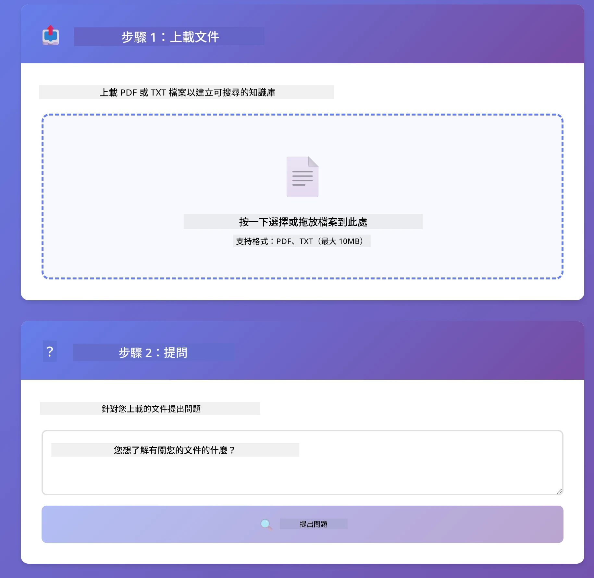

<!--
CO_OP_TRANSLATOR_METADATA:
{
  "original_hash": "81d087662fb3dd7b7124bce1a9c9ec86",
  "translation_date": "2026-01-05T22:02:52+00:00",
  "source_file": "03-rag/README.md",
  "language_code": "hk"
}
-->
# Module 03: RAG (檢索增強生成)

## 目錄

- [你將學到什麼](../../../03-rag)
- [先決條件](../../../03-rag)
- [理解 RAG](../../../03-rag)
- [運作原理](../../../03-rag)
  - [文件處理](../../../03-rag)
  - [建立嵌入](../../../03-rag)
  - [語意搜尋](../../../03-rag)
  - [答案生成](../../../03-rag)
- [執行應用程式](../../../03-rag)
- [使用應用程式](../../../03-rag)
  - [上傳文件](../../../03-rag)
  - [提問](../../../03-rag)
  - [檢視來源參考](../../../03-rag)
  - [實驗不同問題](../../../03-rag)
- [關鍵概念](../../../03-rag)
  - [分塊策略](../../../03-rag)
  - [相似度分數](../../../03-rag)
  - [記憶體中的儲存](../../../03-rag)
  - [上下文視窗管理](../../../03-rag)
- [何時需要 RAG](../../../03-rag)
- [後續步驟](../../../03-rag)

## 你將學到什麼

在先前的模組中，你已學會如何與 AI 交談並有效組織提示。但有一個根本限制：語言模型只能回答它訓練時所學到的知識。它無法回答關於你公司的政策、專案文件，或任何未被訓練的資訊。

RAG（檢索增強生成）解決了這個問題。它不是試圖教模型你的資訊（這昂貴且不切實際），而是給模型一個能力，讓它能搜尋你的文件。當有人提問時，系統會找到相關資料並將其加入提示中。模型接著根據檢索到的上下文作答。

把 RAG 想像成給模型一個參考圖書館。當你提問時，系統：

1. **用戶查詢** - 你提出問題
2. **嵌入** - 將你的問題轉換為向量
3. **向量搜尋** - 找出相似的文件分塊
4. **上下文組裝** - 將相關分塊加入提示
5. **回答** - LLM 根據上下文生成答案

這讓模型的回答建立在你實際資料上，而不是依賴訓練知識或憑空捏造答案。


*RAG 工作流程 - 從用戶查詢到語意搜尋再到上下文答案生成*

## 先決條件

- 已完成模組 01（部署 Azure OpenAI 資源）
- 根目錄有 `.env` 檔案，包含 Azure 憑證（由模組 01 的 `azd up` 建立）

> **注意：** 如果尚未完成模組 01，請先按照那裡的部署指示操作。

## 運作原理

### 文件處理

[DocumentService.java](../../../03-rag/src/main/java/com/example/langchain4j/rag/service/DocumentService.java)

當你上傳文件時，系統會將其拆分成分塊—適合在模型上下文視窗中容納的小部分。這些分塊有輕微重疊，以免在邊界處遺失上下文。

```java
Document document = FileSystemDocumentLoader.loadDocument("sample-document.txt");

DocumentSplitter splitter = DocumentSplitters
    .recursive(300, 30, new OpenAiTokenizer());

List<TextSegment> segments = splitter.split(document);
```

> **🤖 使用 [GitHub Copilot](https://github.com/features/copilot) 聊天試試：** 開啟 [`DocumentService.java`](../../../03-rag/src/main/java/com/example/langchain4j/rag/service/DocumentService.java)，並提問：
> - "LangChain4j 如何拆分文件成分塊，為什麼重疊很重要？"
> - "不同文件類型的最佳分塊大小是多少？為什麼？"
> - "我該如何處理多語言或特殊格式的文件？"

### 建立嵌入

[LangChainRagConfig.java](../../../03-rag/src/main/java/com/example/langchain4j/rag/config/LangChainRagConfig.java)

每個分塊會被轉換成數值表徵，稱為嵌入——本質上是一種數學指紋，捕捉文本的含義。相似的文本會產生相似的嵌入向量。

```java
@Bean
public EmbeddingModel embeddingModel() {
    return OpenAiOfficialEmbeddingModel.builder()
        .baseUrl(azureOpenAiEndpoint)
        .apiKey(azureOpenAiKey)
        .modelName(azureEmbeddingDeploymentName)
        .build();
}

EmbeddingStore<TextSegment> embeddingStore = 
    new InMemoryEmbeddingStore<>();
```


*文件在嵌入空間中以向量表示，相似內容會聚集*

### 語意搜尋

[RagService.java](../../../03-rag/src/main/java/com/example/langchain4j/rag/service/RagService.java)

當你提出問題時，問題也被轉為嵌入。系統將你的問題嵌入與所有文件分塊的嵌入值比較。它找到語意上最相似的分塊——不只是關鍵字匹配，而是真正的語意相似。

```java
Embedding queryEmbedding = embeddingModel.embed(question).content();

List<EmbeddingMatch<TextSegment>> matches = 
    embeddingStore.findRelevant(queryEmbedding, 5, 0.7);

for (EmbeddingMatch<TextSegment> match : matches) {
    String relevantText = match.embedded().text();
    double score = match.score();
}
```

> **🤖 使用 [GitHub Copilot](https://github.com/features/copilot) 聊天試試：** 開啟 [`RagService.java`](../../../03-rag/src/main/java/com/example/langchain4j/rag/service/RagService.java)，並提問：
> - "相似度搜尋如何用嵌入運作，分數怎麼決定？"
> - "我該使用什麼相似度閾值，這會如何影響結果？"
> - "如果找不到相關文件，我該怎麼處理？"

### 答案生成

[RagService.java](../../../03-rag/src/main/java/com/example/langchain4j/rag/service/RagService.java)

最相關的分塊會包含在模型的提示中。模型讀取這些特定分塊，並依據這些資訊回答你的問題。這防止幻覺現象——模型只能從呈現給它的內容回答。

## 執行應用程式

**確認部署：**

確保根目錄裡有 `.env` 檔案，含 Azure 資格證明（在模組 01 中建立）：
```bash
cat ../.env  # 應該顯示 AZURE_OPENAI_ENDPOINT、API_KEY、DEPLOYMENT
```

**啟動應用程式：**

> **注意：** 如果你已經在模組 01 使用 `./start-all.sh` 啟動所有應用程序，本模組已在 8081 埠口執行，可直接跳過以下啟動指令，並前往 http://localhost:8081 。

**選項 1：使用 Spring Boot 儀表板（VS Code 用戶推薦）**

開發容器包含 Spring Boot 儀表板擴展，提供視覺化介面來管理所有 Spring Boot 應用。可在 VS Code 左側活動列找到（尋找 Spring Boot 圖示）。

從 Spring Boot 儀表板，你可以：
- 查看工作區內所有可用的 Spring Boot 應用
- 一鍵啟動/停止應用
- 即時查看應用日誌
- 監控應用狀態

點擊 "rag" 旁的播放按鈕即可啟動此模組，或一次啟動所有模組。


**選項 2：使用 shell 腳本**

啟動所有網頁應用（模組 01-04）：

**Bash:**
```bash
cd ..  # 從根目錄開始
./start-all.sh
```

**PowerShell:**
```powershell
cd ..  # 從根目錄開始
.\start-all.ps1
```

或只啟動此模組：

**Bash:**
```bash
cd 03-rag
./start.sh
```

**PowerShell:**
```powershell
cd 03-rag
.\start.ps1
```

上述腳本會自動從根目錄 `.env` 載入環境變數，並在 JAR 不存在時編譯。

> **注意：** 若你想先手動編譯各模組再啟動：
>
> **Bash:**
> ```bash
> cd ..  # Go to root directory
> mvn clean package -DskipTests
> ```
>
> **PowerShell:**
> ```powershell
> cd ..  # Go to root directory
> mvn clean package -DskipTests
> ```

用瀏覽器開啟 http://localhost:8081 。

**停止應用程式：**

**Bash:**
```bash
./stop.sh  # 只有此模組
# 或者
cd .. && ./stop-all.sh  # 所有模組
```

**PowerShell:**
```powershell
.\stop.ps1  # 只有這個模組
# 或
cd ..; .\stop-all.ps1  # 所有模組
```

## 使用應用程式

此應用程式提供文件上傳與提問的網頁介面。

<a href="images/rag-homepage.png"></a>

*RAG 應用介面 - 上傳文件並提問*

### 上傳文件

先上傳文件—TXT 文件最適合用來測試。本目錄提供 `sample-document.txt` ，包含 LangChain4j 功能、RAG 實作與最佳實務說明，適合系統測試。

系統會處理你的文件，拆成分塊並建立每個分塊的嵌入。這會在你上傳時自動完成。

### 提問

現在對文件內容提出具體問題。試試清楚陳述在文件中的事實內容。系統會搜尋相關分塊，將它們加入提示並生成答案。

### 檢視來源參考

注意每個答案都包含帶有相似度分數的來源參考。這些分數（0 到 1）顯示每個分塊與你的問題相關程度。分數越高，匹配越好。讓你能對答案與原始資料進行核對。

<a href="images/rag-query-results.png"></a>

*查詢結果顯示答案與來源參考及相關度分數*

### 實驗不同問題

試試不同類型的問題：
- 具體事實： 「主要主題是什麼？」
- 比較： 「X 和 Y 有何不同？」
- 摘要： 「請總結關於 Z 的重點」

觀察相似度分數如何根據問題與文件內容的匹配度改變。

## 關鍵概念

### 分塊策略

文件拆分成 300 tokens 的分塊，並重疊 30 tokens。這種平衡確保每塊有足夠上下文有意義，且分塊足夠小，能在提示中容納多個分塊。

### 相似度分數

分數範圍 0 到 1：
- 0.7-1.0：高度相關，完全匹配
- 0.5-0.7：相關，有良好上下文
- 低於 0.5：被過濾，差異太大

系統只會檢索高於最低閾值的分塊，確保品質。

### 記憶體中的儲存

本模組使用記憶體中的儲存來簡化處理。當你重啟應用程式時，上傳的文件會遺失。生產系統會使用持久化向量資料庫，如 Qdrant 或 Azure AI Search。

### 上下文視窗管理

每個模型有最大上下文視窗。你無法將大型文件的所有分塊全放入提示。系統會提取最相關的前 N 個分塊（預設 5 個），以控制在限制內，同時提供足夠上下文以作準確回答。

## 何時需要 RAG

**使用 RAG 的場景：**
- 回答有關專有文件的問題
- 資訊經常變更（政策、價格、規格）
- 需要來源歸屬的準確性
- 內容過大無法放入單一提示
- 需要可驗證、具根據的回答

**不適用 RAG 的場景：**
- 問題需要模型已具備的一般知識
- 需要即時數據（RAG 運行於上傳文件之上）
- 內容小到可直接放入提示

## 後續步驟

**下一模組：** [04-tools - 使用工具的 AI 代理](../04-tools/README.md)

---

**導覽：** [← 上一章：Module 02 - 提示工程](../02-prompt-engineering/README.md) | [返回主頁](../README.md) | [下一章：Module 04 - 工具 →](../04-tools/README.md)

---

<!-- CO-OP TRANSLATOR DISCLAIMER START -->
**免責聲明**：  
本文件由 AI 翻譯服務 [Co-op Translator](https://github.com/Azure/co-op-translator) 提供翻譯。雖然我們致力於確保準確性，但請注意，自動翻譯可能包含錯誤或不準確之處。文件原文（母語版本）應被視為權威來源。對於關鍵資訊，建議採用專業人工翻譯。我們對因使用此翻譯而引起的任何誤解或誤釋不承擔任何責任。
<!-- CO-OP TRANSLATOR DISCLAIMER END -->