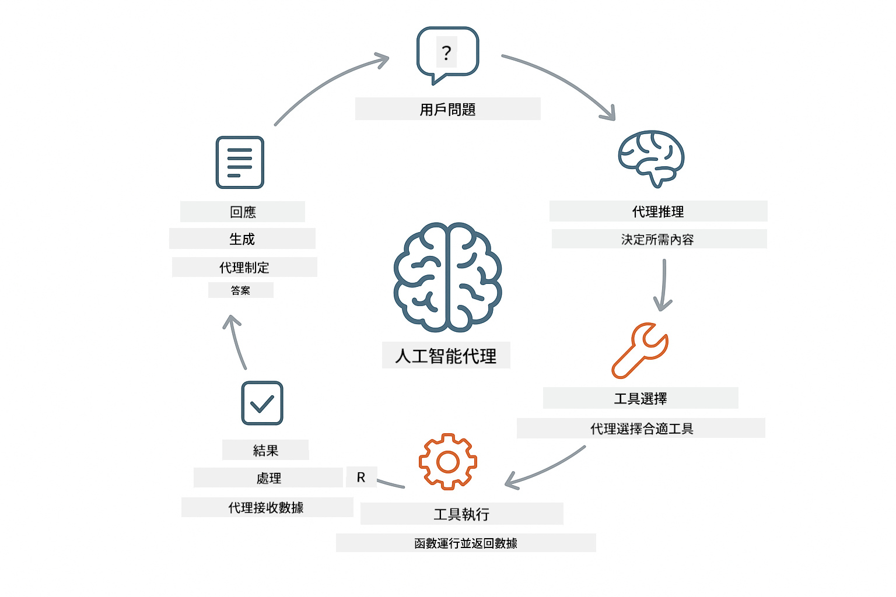
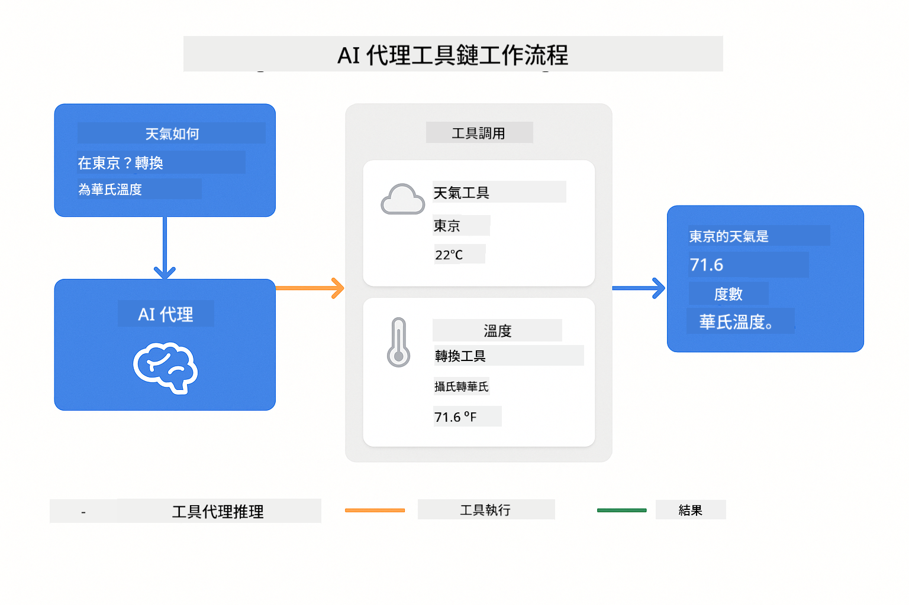
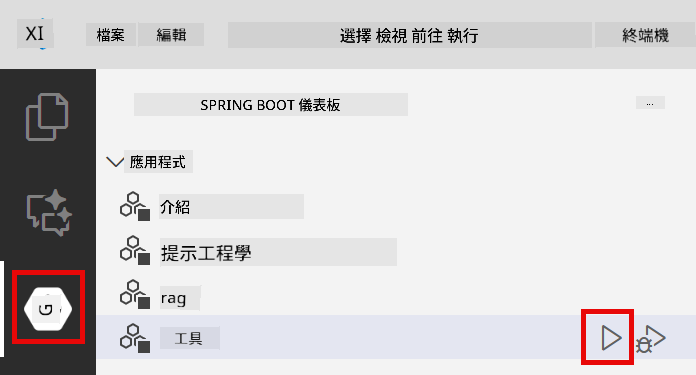
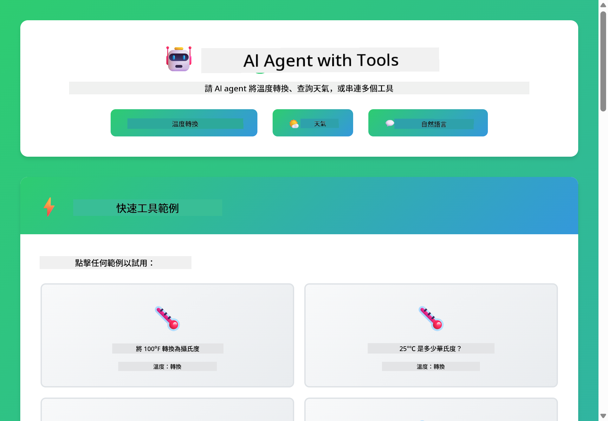
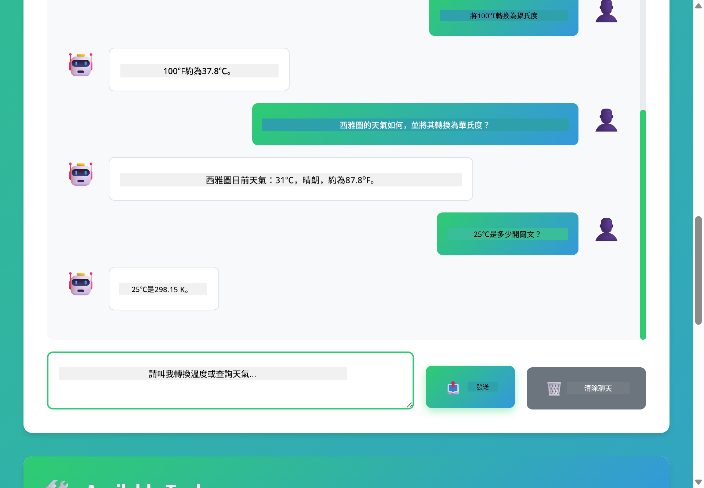

<!--
CO_OP_TRANSLATOR_METADATA:
{
  "original_hash": "aa23f106e7f53270924c9dd39c629004",
  "translation_date": "2025-12-13T18:31:32+00:00",
  "source_file": "04-tools/README.md",
  "language_code": "hk"
}
-->
# Module 04: AI Agents with Tools

## Table of Contents

- [What You'll Learn](../../../04-tools)
- [Prerequisites](../../../04-tools)
- [Understanding AI Agents with Tools](../../../04-tools)
- [How Tool Calling Works](../../../04-tools)
  - [Tool Definitions](../../../04-tools)
  - [Decision Making](../../../04-tools)
  - [Execution](../../../04-tools)
  - [Response Generation](../../../04-tools)
- [Tool Chaining](../../../04-tools)
- [Run the Application](../../../04-tools)
- [Using the Application](../../../04-tools)
  - [Try Simple Tool Usage](../../../04-tools)
  - [Test Tool Chaining](../../../04-tools)
  - [See Conversation Flow](../../../04-tools)
  - [Observe the Reasoning](../../../04-tools)
  - [Experiment with Different Requests](../../../04-tools)
- [Key Concepts](../../../04-tools)
  - [ReAct Pattern (Reasoning and Acting)](../../../04-tools)
  - [Tool Descriptions Matter](../../../04-tools)
  - [Session Management](../../../04-tools)
  - [Error Handling](../../../04-tools)
- [Available Tools](../../../04-tools)
- [When to Use Tool-Based Agents](../../../04-tools)
- [Next Steps](../../../04-tools)

## What You'll Learn

到目前為止，你已經學會如何與 AI 進行對話、有效地結構提示詞，並將回應根據你的文件進行基礎化。但仍有一個根本限制：語言模型只能生成文字。它們無法查詢天氣、執行計算、查詢資料庫或與外部系統互動。

工具改變了這一點。透過讓模型能夠調用函數，你將它從一個文字生成器轉變為一個能夠採取行動的代理。模型決定何時需要工具、使用哪個工具，以及傳遞什麼參數。你的程式碼執行該函數並返回結果。模型將該結果整合到回應中。

## Prerequisites

- 完成 Module 01（已部署 Azure OpenAI 資源）
- 根目錄下有 `.env` 檔案，包含 Azure 認證（由 Module 01 中的 `azd up` 建立）

> **注意：** 如果你尚未完成 Module 01，請先按照那裡的部署說明操作。

## Understanding AI Agents with Tools

具備工具的 AI 代理遵循一個推理與行動模式（ReAct）：

1. 使用者提出問題
2. 代理推理它需要知道什麼
3. 代理決定是否需要工具來回答
4. 如果需要，代理以正確參數調用相應工具
5. 工具執行並返回資料
6. 代理整合結果並提供最終答案



*ReAct 模式 - AI 代理如何在推理與行動間交替以解決問題*

這一過程是自動發生的。你定義工具及其描述，模型負責決定何時以及如何使用它們。

## How Tool Calling Works

**Tool Definitions** - [WeatherTool.java](../../../04-tools/src/main/java/com/example/langchain4j/agents/tools/WeatherTool.java) | [TemperatureTool.java](../../../04-tools/src/main/java/com/example/langchain4j/agents/tools/TemperatureTool.java)

你定義帶有清晰描述和參數規範的函數。模型在系統提示中看到這些描述，並理解每個工具的功能。

```java
@Component
public class WeatherTool {
    
    @Tool("Get the current weather for a location")
    public String getCurrentWeather(@P("Location name") String location) {
        // 你的天氣查詢邏輯
        return "Weather in " + location + ": 22°C, cloudy";
    }
}

@AiService
public interface Assistant {
    String chat(@MemoryId String sessionId, @UserMessage String message);
}

// 助手由 Spring Boot 自動連接：
// - ChatModel bean
// - 所有來自 @Component 類別的 @Tool 方法
// - 用於會話管理的 ChatMemoryProvider
```

> **🤖 嘗試使用 [GitHub Copilot](https://github.com/features/copilot) Chat：** 打開 [`WeatherTool.java`](../../../04-tools/src/main/java/com/example/langchain4j/agents/tools/WeatherTool.java) 並詢問：
> - 「我如何整合像 OpenWeatherMap 這樣的真實天氣 API，而非模擬資料？」
> - 「什麼樣的工具描述能幫助 AI 正確使用它？」
> - 「我如何在工具實作中處理 API 錯誤和速率限制？」

**Decision Making**

當使用者問「西雅圖的天氣如何？」時，模型識別出需要使用天氣工具。它生成一個函數調用，位置參數設為「Seattle」。

**Execution** - [AgentService.java](../../../04-tools/src/main/java/com/example/langchain4j/agents/service/AgentService.java)

Spring Boot 自動注入所有註冊的工具到聲明式的 `@AiService` 介面，LangChain4j 自動執行工具調用。

> **🤖 嘗試使用 [GitHub Copilot](https://github.com/features/copilot) Chat：** 打開 [`AgentService.java`](../../../04-tools/src/main/java/com/example/langchain4j/agents/service/AgentService.java) 並詢問：
> - 「ReAct 模式如何運作？為什麼對 AI 代理有效？」
> - 「代理如何決定使用哪個工具及其順序？」
> - 「如果工具執行失敗，應如何健全地處理錯誤？」

**Response Generation**

模型接收天氣資料，並將其格式化為自然語言回應給使用者。

### 為什麼使用聲明式 AI 服務？

本模組使用 LangChain4j 的 Spring Boot 整合，搭配聲明式的 `@AiService` 介面：

- **Spring Boot 自動注入** - ChatModel 和工具自動注入
- **@MemoryId 模式** - 自動基於會話的記憶管理
- **單一實例** - 助手只建立一次並重複使用以提升效能
- **型別安全執行** - 直接呼叫 Java 方法並進行型別轉換
- **多輪協調** - 自動處理工具串接
- **零樣板程式碼** - 無需手動呼叫 AiServices.builder() 或管理記憶 HashMap

其他方法（手動 `AiServices.builder()`）需要更多程式碼，且無法享受 Spring Boot 整合的優勢。

## Tool Chaining

**工具串接** - AI 可能會連續調用多個工具。問「西雅圖的天氣如何？我應該帶傘嗎？」並觀察它如何串接 `getCurrentWeather` 並推理是否需要雨具。

<a href="images/tool-chaining.png"></a>

*連續工具調用 - 一個工具的輸出作為下一個決策的輸入*

**優雅失敗** - 詢問模擬資料中沒有的城市天氣。工具返回錯誤訊息，AI 解釋無法提供幫助。工具安全失敗。

這在單一對話回合中發生。代理自主協調多個工具調用。

## Run the Application

**確認部署：**

確保根目錄有 `.env` 檔案，包含 Azure 認證（在 Module 01 中建立）：
```bash
cat ../.env  # 應該顯示 AZURE_OPENAI_ENDPOINT、API_KEY、DEPLOYMENT
```

**啟動應用程式：**

> **注意：** 如果你已使用 Module 01 的 `./start-all.sh` 啟動所有應用，本模組已在 8084 埠運行。你可以跳過以下啟動指令，直接訪問 http://localhost:8084。

**選項 1：使用 Spring Boot Dashboard（推薦 VS Code 使用者）**

開發容器包含 Spring Boot Dashboard 擴充套件，提供視覺化介面管理所有 Spring Boot 應用。你可以在 VS Code 左側活動欄找到（尋找 Spring Boot 圖示）。

從 Spring Boot Dashboard，你可以：
- 查看工作區內所有可用的 Spring Boot 應用
- 一鍵啟動/停止應用
- 實時查看應用日誌
- 監控應用狀態

只需點擊「tools」旁的播放按鈕啟動本模組，或一次啟動所有模組。



**選項 2：使用 shell 腳本**

啟動所有網頁應用（模組 01-04）：

**Bash:**
```bash
cd ..  # 從根目錄開始
./start-all.sh
```

**PowerShell:**
```powershell
cd ..  # 從根目錄開始
.\start-all.ps1
```

或只啟動本模組：

**Bash:**
```bash
cd 04-tools
./start.sh
```

**PowerShell:**
```powershell
cd 04-tools
.\start.ps1
```

兩個腳本會自動從根目錄 `.env` 檔載入環境變數，且若 JAR 不存在會自動編譯。

> **注意：** 若你想先手動編譯所有模組再啟動：
>
> **Bash:**
> ```bash
> cd ..  # Go to root directory
> mvn clean package -DskipTests
> ```
>
> **PowerShell:**
> ```powershell
> cd ..  # Go to root directory
> mvn clean package -DskipTests
> ```

在瀏覽器開啟 http://localhost:8084 。

**停止應用：**

**Bash:**
```bash
./stop.sh  # 僅此模組
# 或
cd .. && ./stop-all.sh  # 所有模組
```

**PowerShell:**
```powershell
.\stop.ps1  # 僅此模組
# 或
cd ..; .\stop-all.ps1  # 所有模組
```

## Using the Application

此應用提供網頁介面，讓你與具備天氣及溫度轉換工具的 AI 代理互動。

<a href="images/tools-homepage.png"></a>

*AI 代理工具介面 - 快速範例與聊天介面，方便與工具互動*

**嘗試簡單工具使用**

從簡單請求開始：「將 100 華氏度轉換為攝氏度」。代理識別需要溫度轉換工具，使用正確參數調用並返回結果。注意這感覺多自然——你不需指定使用哪個工具或如何調用。

**測試工具串接**

試試更複雜的：「西雅圖的天氣如何？幫我轉換成華氏度？」觀察代理分步處理。它先取得天氣（回傳攝氏度），識別需要轉換成華氏度，調用轉換工具，並將兩個結果合併成一個回應。

**查看對話流程**

聊天介面保留對話歷史，允許多輪互動。你可以看到所有先前的查詢與回應，方便追蹤對話並理解代理如何在多次交流中建立上下文。

<a href="images/tools-conversation-demo.png"></a>

*多輪對話展示簡單轉換、天氣查詢與工具串接*

**嘗試不同請求**

試試各種組合：
- 天氣查詢：「東京的天氣如何？」
- 溫度轉換：「25°C 是多少開爾文？」
- 組合查詢：「查詢巴黎天氣，告訴我是否高於 20°C」

注意代理如何解讀自然語言並映射到適當的工具調用。

## Key Concepts

**ReAct Pattern (Reasoning and Acting)**

代理在推理（決定要做什麼）與行動（使用工具）間交替。此模式使其能自主解決問題，而非僅回應指令。

**Tool Descriptions Matter**

工具描述的品質直接影響代理使用工具的效果。清晰、具體的描述幫助模型理解何時及如何調用每個工具。

**Session Management**

`@MemoryId` 註解啟用自動基於會話的記憶管理。每個會話 ID 獲得自己的 `ChatMemory` 實例，由 `ChatMemoryProvider` bean 管理，免除手動追蹤記憶。

**Error Handling**

工具可能失敗——API 超時、參數無效、外部服務故障。生產環境代理需要錯誤處理，讓模型能解釋問題或嘗試替代方案。

## Available Tools

**天氣工具**（示範用模擬資料）：
- 取得指定地點的當前天氣
- 取得多日天氣預報

**溫度轉換工具**：
- 攝氏轉華氏
- 華氏轉攝氏
- 攝氏轉開爾文
- 開爾文轉攝氏
- 華氏轉開爾文
- 開爾文轉華氏

這些是簡單範例，但此模式可擴展至任何函數：資料庫查詢、API 調用、計算、檔案操作或系統指令。

## When to Use Tool-Based Agents

**使用工具的時機：**
- 回答需要即時資料（天氣、股價、庫存）
- 需要執行超出簡單數學的計算
- 存取資料庫或 API
- 採取行動（發送郵件、建立工單、更新紀錄）
- 結合多個資料來源

**不適合使用工具的情況：**
- 問題可由一般知識回答
- 回應純屬對話性質
- 工具延遲會使體驗過慢

## Next Steps

**下一模組：** [05-mcp - Model Context Protocol (MCP)](../05-mcp/README.md)

---

**導航：** [← 上一章：Module 03 - RAG](../03-rag/README.md) | [回主頁](../README.md) | [下一章：Module 05 - MCP →](../05-mcp/README.md)

---

<!-- CO-OP TRANSLATOR DISCLAIMER START -->
**免責聲明**：  
本文件由 AI 翻譯服務 [Co-op Translator](https://github.com/Azure/co-op-translator) 進行翻譯。雖然我們致力於確保準確性，但請注意自動翻譯可能包含錯誤或不準確之處。原始文件的母語版本應被視為權威來源。對於重要資訊，建議採用專業人工翻譯。我們不對因使用本翻譯而引起的任何誤解或誤釋承擔責任。
<!-- CO-OP TRANSLATOR DISCLAIMER END -->