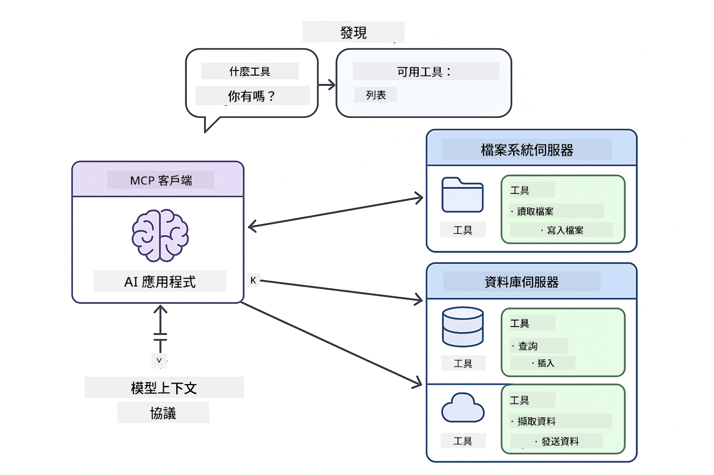
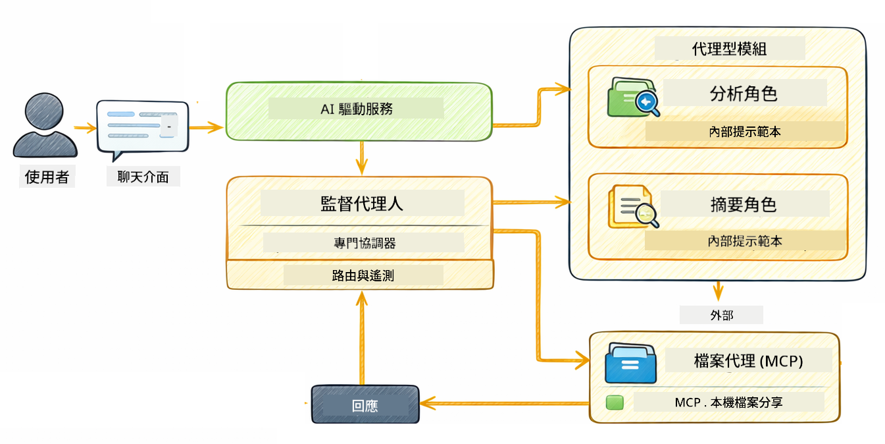

<!--
CO_OP_TRANSLATOR_METADATA:
{
  "original_hash": "f89f4c106d110e4943c055dd1a2f1dff",
  "translation_date": "2025-12-30T21:31:58+00:00",
  "source_file": "05-mcp/README.md",
  "language_code": "hk"
}
-->
# 模組 05：模型上下文協議 (MCP)

## 目錄

- [你會學到的內容](../../../05-mcp)
- [什麼是 MCP？](../../../05-mcp)
- [MCP 如何運作](../../../05-mcp)
- [Agentic 模組](../../../05-mcp)
- [執行範例](../../../05-mcp)
  - [先決條件](../../../05-mcp)
- [快速開始](../../../05-mcp)
  - [檔案操作（Stdio）](../../../05-mcp)
  - [監督者 Agent](../../../05-mcp)
    - [理解輸出](../../../05-mcp)
    - [Agentic 模組功能說明](../../../05-mcp)
- [關鍵概念](../../../05-mcp)
- [恭喜你！](../../../05-mcp)
  - [接下來？](../../../05-mcp)

## 你會學到的內容

你已經建立了會話式 AI、掌握了 prompt、能把回應落基於文件，並建立了帶有工具的 agents。但所有那些工具都是為你的特定應用量身打造的。若你可以讓你的 AI 存取一個標準化的工具生態系，任何人都可以建立並分享工具，那會如何？在本模組中，你將學習如何使用模型上下文協議（MCP）和 LangChain4j 的 agentic 模組來實現這件事。我們會先展示一個簡單的 MCP 檔案讀取器，然後示範它如何輕鬆整合到使用監督者 Agent 模式的進階 agentic 工作流程中。

## 什麼是 MCP？

模型上下文協議（MCP）正是為此而生 — 為 AI 應用提供一個標準化的方式來發現並使用外部工具。你不需要為每個資料來源或服務寫入客製化整合；只要連接到以一致格式揭露其能力的 MCP 伺服器。你的 AI agent 就可以自動發現並使用這些工具。


*在 MCP 之前：複雜的點對點整合。在 MCP 之後：一個協議，無限可能。*

MCP 解決了 AI 開發中的一個根本問題：每個整合都是客製化的。想存取 GitHub？客製化程式。想讀取檔案？客製化程式。想查詢資料庫？客製化程式。而這些整合都無法與其他 AI 應用互通。

MCP 將此標準化。MCP 伺服器以清楚的描述和 Schema 來揭露工具。任何 MCP 用戶端都可以連線、發現可用工具並使用它們。一次建立，到處使用。



*模型上下文協議架構 - 標準化的工具發現與執行*

## MCP 如何運作

**伺服器-用戶端 架構**

MCP 採用用戶端-伺服器模型。伺服器提供工具 — 讀取檔案、查詢資料庫、呼叫 API。用戶端（你的 AI 應用）連線到伺服器並使用其工具。

要在 LangChain4j 中使用 MCP，加入這個 Maven 相依性：

```xml
<dependency>
    <groupId>dev.langchain4j</groupId>
    <artifactId>langchain4j-mcp</artifactId>
    <version>${langchain4j.version}</version>
</dependency>
```

**工具發現**

當你的用戶端連線到 MCP 伺服器時，它會詢問「你有什麼工具？」伺服器會回應一份可用工具清單，每個工具都有描述和參數 schema。你的 AI agent 接著可以根據使用者的請求決定要使用哪些工具。

**傳輸機制**

MCP 支援不同的傳輸機制。本模組示範用於本地程序的 Stdio 傳輸：


*MCP 傳輸機制：遠端伺服器使用 HTTP，本地程序使用 Stdio*

**Stdio** - [StdioTransportDemo.java](../../../05-mcp/src/main/java/com/example/langchain4j/mcp/StdioTransportDemo.java)

適用於本地程序。你的應用會以子程序方式啟動一個伺服器，並透過標準輸入/輸出進行通訊。適合檔案系統存取或命令列工具。

```java
McpTransport stdioTransport = new StdioMcpTransport.Builder()
    .command(List.of(
        npmCmd, "exec",
        "@modelcontextprotocol/server-filesystem@2025.12.18",
        resourcesDir
    ))
    .logEvents(false)
    .build();
```

> **🤖 試試看 [GitHub Copilot](https://github.com/features/copilot) Chat：** 開啟 [`StdioTransportDemo.java`](../../../05-mcp/src/main/java/com/example/langchain4j/mcp/StdioTransportDemo.java) 並詢問：
> - 「Stdio 傳輸如何運作？在什麼情況下應該使用它而不是 HTTP？」
> - 「LangChain4j 如何管理被啟動的 MCP 伺服器程序的生命週期？」
> - 「讓 AI 存取檔案系統有哪些安全性影響？」

## Agentic 模組

雖然 MCP 提供了標準化工具，LangChain4j 的 **agentic 模組** 則提供一種宣告式的方式來建立協調這些工具的 agents。`@Agent` 註解和 `AgenticServices` 讓你透過介面而不是命令式程式碼來定義 agent 行為。

在本模組中，你將探索 **監督者 Agent（Supervisor Agent）** 模式 — 一種進階的 agentic AI 方法，其中一個「監督者」agent 會根據使用者請求動態決定要呼叫哪些子 agent。我們會把兩個概念結合，讓其中一個子 agent 獲得由 MCP 提供的檔案存取能力。

要使用 agentic 模組，加入這個 Maven 相依性：

```xml
<dependency>
    <groupId>dev.langchain4j</groupId>
    <artifactId>langchain4j-agentic</artifactId>
    <version>${langchain4j.mcp.version}</version>
</dependency>
```

> **⚠️ 實驗性功能：** `langchain4j-agentic` 模組屬於 **實驗性**，可能會變動。建立 AI 助手的穩定方式仍是使用 `langchain4j-core` 並搭配客製工具（模組 04）。

## 執行範例

### 先決條件

- Java 21+、Maven 3.9+
- Node.js 16+ 與 npm（供 MCP 伺服器使用）
- 在專案根目錄的 `.env` 檔中設定環境變數：
  - **For StdioTransportDemo:** `GITHUB_TOKEN` (GitHub Personal Access Token)
  - **For SupervisorAgentDemo:** `AZURE_OPENAI_ENDPOINT`, `AZURE_OPENAI_API_KEY`, `AZURE_OPENAI_DEPLOYMENT`（與模組 01-04 相同）

> **注意：** 如果你還沒設定環境變數，請參閱 [Module 00 - Quick Start](../00-quick-start/README.md) 的說明，或將 `.env.example` 複製為根目錄的 `.env` 並填入你的值。

## 快速開始

**使用 VS Code：** 在 Explorer 中右鍵任何範例檔案並選擇 **「執行 Java」**，或從「執行與除錯」面板使用啟動設定（請先將你的 token 加到 `.env` 檔中）。

**使用 Maven：** 或者，你也可以從命令列使用下面的範例執行。

### 檔案操作（Stdio）

此示範展示基於本地子程序的工具。

**✅ 不需要先決條件** - MCP 伺服器會自動被啟動。

**使用 VS Code：** 右鍵 `StdioTransportDemo.java` 並選擇 **「執行 Java」**。

**使用 Maven：**

**Bash:**
```bash
export GITHUB_TOKEN=your_token_here
cd 05-mcp
mvn compile exec:java -Dexec.mainClass=com.example.langchain4j.mcp.StdioTransportDemo
```

**PowerShell:**
```powershell
$env:GITHUB_TOKEN=your_token_here
cd 05-mcp
mvn --% compile exec:java -Dexec.mainClass=com.example.langchain4j.mcp.StdioTransportDemo
```

應用程式會自動啟動一個檔案系統的 MCP 伺服器並讀取本地檔案。注意子程序的管理是為你處理好的。

**預期輸出：**
```
Assistant response: The file provides an overview of LangChain4j, an open-source Java library
for integrating Large Language Models (LLMs) into Java applications...
```

### 監督者 Agent




**監督者 Agent 模式** 是 agentic AI 的一種 **彈性** 形式。不同於確定性的工作流程（順序、迴圈、平行），監督者使用 LLM 自主決定根據使用者的請求要呼叫哪些 agents。

**將監督者與 MCP 結合：** 在此範例中，我們透過 `toolProvider(mcpToolProvider)` 給 `FileAgent` 存取 MCP 檔案系統工具的能力。當使用者要求「讀取並分析一個檔案」時，監督者會分析請求並產生一個執行計畫。它接著將請求路由到 `FileAgent`，`FileAgent` 使用 MCP 的 `read_file` 工具擷取內容。監督者再將該內容傳給 `AnalysisAgent` 進行解讀，並可選地呼叫 `SummaryAgent` 來摘要結果。

這展示了 MCP 工具如何無縫整合到 agentic 工作流程中 — 監督者不需要知道檔案如何被讀取，只需知道 `FileAgent` 能做到。監督者會根據不同類型的請求動態調整，並回傳最後一個 agent 的回應或所有操作的摘要。

**使用啟動腳本（建議）：**

啟動腳本會自動從根目錄的 `.env` 檔載入環境變數：

**Bash:**
```bash
cd 05-mcp
chmod +x start.sh
./start.sh
```

**PowerShell:**
```powershell
cd 05-mcp
.\start.ps1
```

**使用 VS Code：** 右鍵 `SupervisorAgentDemo.java` 並選擇 **「執行 Java」**（確保你的 `.env` 檔已配置）。

**監督者如何運作：**

```java
// 定義多個具備特定能力的代理人
FileAgent fileAgent = AgenticServices.agentBuilder(FileAgent.class)
        .chatModel(model)
        .toolProvider(mcpToolProvider)  // 具有用於檔案操作的 MCP 工具
        .build();

AnalysisAgent analysisAgent = AgenticServices.agentBuilder(AnalysisAgent.class)
        .chatModel(model)
        .build();

SummaryAgent summaryAgent = AgenticServices.agentBuilder(SummaryAgent.class)
        .chatModel(model)
        .build();

// 建立一個統籌這些代理人的監督者
SupervisorAgent supervisor = AgenticServices.supervisorBuilder()
        .chatModel(model)  // 「planner」模型
        .subAgents(fileAgent, analysisAgent, summaryAgent)
        .responseStrategy(SupervisorResponseStrategy.SUMMARY)
        .build();

// 監督者會自主決定調用哪些代理人
// 只要傳入自然語言請求，LLM 就會規劃執行
String response = supervisor.invoke("Read the file at /path/file.txt and analyze it");
```

完整實作請參見 [SupervisorAgentDemo.java](../../../05-mcp/src/main/java/com/example/langchain4j/mcp/SupervisorAgentDemo.java)。

> **🤖 試試看 [GitHub Copilot](https://github.com/features/copilot) Chat：** 開啟 [`SupervisorAgentDemo.java`](../../../05-mcp/src/main/java/com/example/langchain4j/mcp/SupervisorAgentDemo.java) 並詢問：
> - 「監督者如何決定要呼叫哪些 agents？」
> - 「監督者和順序工作流程模式有什麼不同？」
> - 「我如何自訂監督者的規劃行為？」

#### 理解輸出

當你執行範例時，你會看到監督者如何協調多個 agents 的結構化演練。以下說明每個區段的意義：

```
======================================================================
  SUPERVISOR AGENT DEMO
======================================================================

This demo shows how a Supervisor Agent orchestrates multiple specialized agents.
The Supervisor uses an LLM to decide which agent to call based on the task.
```

**標頭** 介紹範例並說明核心概念：監督者使用 LLM（而非硬編碼規則）來決定要呼叫哪些 agents。

```
--- AVAILABLE AGENTS -------------------------------------------------
  [FILE]     FileAgent     - Reads files using MCP filesystem tools
  [ANALYZE]  AnalysisAgent - Analyzes content for structure, tone, and themes
  [SUMMARY]  SummaryAgent  - Creates concise summaries of content
```

**可用的 Agents** 顯示監督者可以選擇的三個專門化 agents。每個 agent 都有特定能力：
- **FileAgent** 可以使用 MCP 工具讀取檔案（外部能力）
- **AnalysisAgent** 解析內容（純 LLM 能力）
- **SummaryAgent** 產生摘要（純 LLM 能力）

```
--- USER REQUEST -----------------------------------------------------
  "Read the file at .../file.txt and analyze what it's about"
```

**使用者請求** 顯示使用者問了什麼。監督者必須解析這個請求並決定要呼叫哪些 agents。

```
--- SUPERVISOR ORCHESTRATION -----------------------------------------
  The Supervisor will now decide which agents to invoke and in what order...

  +-- STEP 1: Supervisor chose -> FileAgent (reading file via MCP)
  |
  |   Input: .../file.txt
  |
  |   Result: LangChain4j is an open-source Java library designed to simplify...
  +-- [OK] FileAgent (reading file via MCP) completed

  +-- STEP 2: Supervisor chose -> AnalysisAgent (analyzing content)
  |
  |   Input: LangChain4j is an open-source Java library...
  |
  |   Result: Structure: The content is organized into clear paragraphs that int...
  +-- [OK] AnalysisAgent (analyzing content) completed
```

**監督者協調** 就是魔法發生的地方。觀察：
1. 監督者 **首先選擇了 FileAgent**，因為請求提到「讀取檔案」
2. FileAgent 使用 MCP 的 `read_file` 工具取得檔案內容
3. 接著監督者 **選擇了 AnalysisAgent** 並將檔案內容傳給它
4. AnalysisAgent 分析結構、語氣與主題

注意監督者是根據使用者請求 **自主** 做出這些決策 — 沒有硬編碼的工作流程！

**最終回應** 是監督者綜合各個被呼叫 agent 輸出的回答。範例會顯示 agentic 作用域（agentic scope），展示每個 agent 存儲的摘要與分析結果。

```
--- FINAL RESPONSE ---------------------------------------------------
I read the contents of the file and analyzed its structure, tone, and key themes.
The file introduces LangChain4j as an open-source Java library for integrating
large language models...

--- AGENTIC SCOPE (Shared Memory) ------------------------------------
  Agents store their results in a shared scope for other agents to use:
  * summary: LangChain4j is an open-source Java library...
  * analysis: Structure: The content is organized into clear paragraphs that in...
```

### Agentic 模組功能說明

範例展示了 agentic 模組的多項進階功能。我們來更仔細看 Agentic 作用域與 Agent 監聽器。

**Agentic 作用域** 顯示 agents 存放其結果的共用記憶，使用 `@Agent(outputKey="...")`。這允許：
- 後續的 agents 存取先前 agents 的輸出
- 監督者綜合並產生最終回應
- 你檢視每個 agent 的產出

```java
ResultWithAgenticScope<String> result = supervisor.invokeWithAgenticScope(request);
AgenticScope scope = result.agenticScope();
String story = scope.readState("story");
List<AgentInvocation> history = scope.agentInvocations("analysisAgent");
```

**Agent 監聽器（Agent Listeners）** 允許監控與除錯 agent 執行。你在範例中看到逐步輸出的內容來自一個掛接到每次 agent 呼叫的 AgentListener：
- **beforeAgentInvocation** - 在監督者選擇一個 agent 時呼叫，讓你看到選擇了哪個 agent 以及原因
- **afterAgentInvocation** - 在 agent 完成時呼叫，顯示其結果
- **inheritedBySubagents** - 若為 true，監聽器會監控階層中的所有 agents

```java
AgentListener monitor = new AgentListener() {
    private int step = 0;
    
    @Override
    public void beforeAgentInvocation(AgentRequest request) {
        step++;
        System.out.println("  +-- STEP " + step + ": " + request.agentName());
    }
    
    @Override
    public void afterAgentInvocation(AgentResponse response) {
        System.out.println("  +-- [OK] " + response.agentName() + " completed");
    }
    
    @Override
    public boolean inheritedBySubagents() {
        return true; // 傳播至所有子代理
    }
};
```

除了監督者模式之外，`langchain4j-agentic` 模組還提供幾種強大的工作流程模式與功能：

| 模式 | 說明 | 使用情境 |
|---------|-------------|----------|
| **順序** | 按順序執行 agents，輸出流向下一個 | 流程：研究 → 分析 → 報告 |
| **平行** | 同時執行多個 agents | 獨立任務：天氣 + 新聞 + 股市 |
| **迴圈** | 重複執行直到滿足條件 | 品質評分：反覆精煉直到分數 ≥ 0.8 |
| **條件式** | 根據條件進行路由 | 分類 → 導向到專門 agent |
| **人類在迴路中** | 新增人工檢查點 | 核准流程、內容審查 |

## 關鍵概念

**MCP** 適用於你想利用既有的工具生態系、建立能被多個應用共用的工具、以標準協議整合第三方服務，或在不更改程式碼的情況下替換工具實作。

**Agentic 模組** 最適合在你想用 `@Agent` 註解做宣告式 agent 定義、需要工作流程協調（順序、迴圈、平行）、偏好以介面為基礎的 agent 設計而非命令式程式碼，或當你要結合多個 agents 並透過 `outputKey` 分享輸出時使用。

**監督者 Agent 模式** 特別適合在工作流程事先難以預測且你希望 LLM 做決策時、當你有多個專門化 agents 需要動態協調時、在構建會根據不同能力進行路由的會話系統時，或當你想要最靈活、最具適應性的 agent 行為時使用。

## 恭喜你！

你已完成 LangChain4j 初學者課程。你已經學會：

- 如何建立帶有記憶的會話式 AI（模組 01）
- 適用於不同任務的 prompt 工程模式（模組 02）
- 使用 RAG 將回應落基於文件（模組 03）
- 使用客製工具建立基本 AI agents（助理）（模組 04）
- 將標準化工具與 LangChain4j MCP 和 Agentic 模組整合 (Module 05)

### 接下來做什麼?

完成各模組後，請參閱[測試指南](../docs/TESTING.md) 以實際了解 LangChain4j 的測試概念。

**官方資源:**
- [LangChain4j Documentation](https://docs.langchain4j.dev/) - 完整指南與 API 參考
- [LangChain4j GitHub](https://github.com/langchain4j/langchain4j) - 原始碼與範例
- [LangChain4j 教學](https://docs.langchain4j.dev/tutorials/) - 針對各種使用情境的逐步教學

感謝你完成本課程！

---

**導覽:** [← 上一節: Module 04 - Tools](../04-tools/README.md) | [返回主頁](../README.md)

---

<!-- CO-OP TRANSLATOR DISCLAIMER START -->
免責聲明：
本文件已使用 AI 翻譯服務 Co‑op Translator (https://github.com/Azure/co-op-translator) 進行翻譯。儘管我們力求準確，請注意自動翻譯可能包含錯誤或不準確之處。原文應視為具權威性的參考來源。對於重要或關鍵資訊，建議採用專業人工翻譯。對於因使用本翻譯而引致的任何誤解或錯誤詮釋，我們概不負責。
<!-- CO-OP TRANSLATOR DISCLAIMER END -->