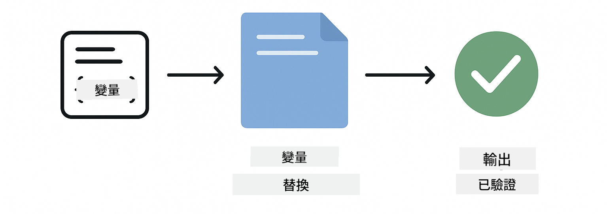
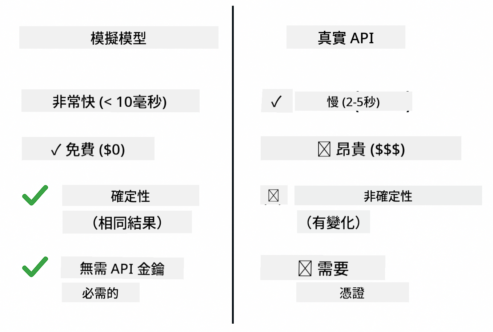
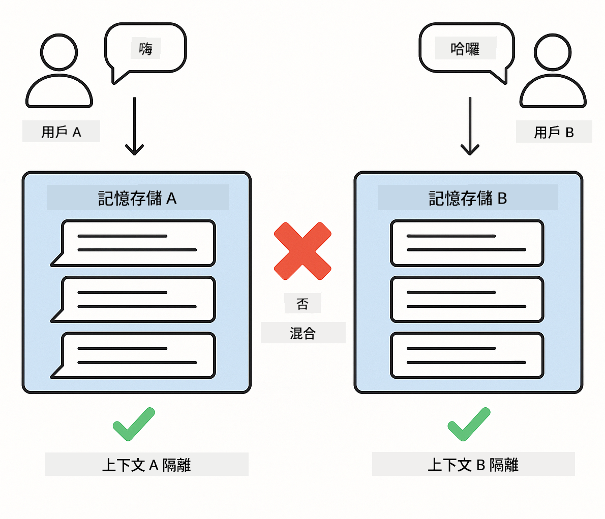
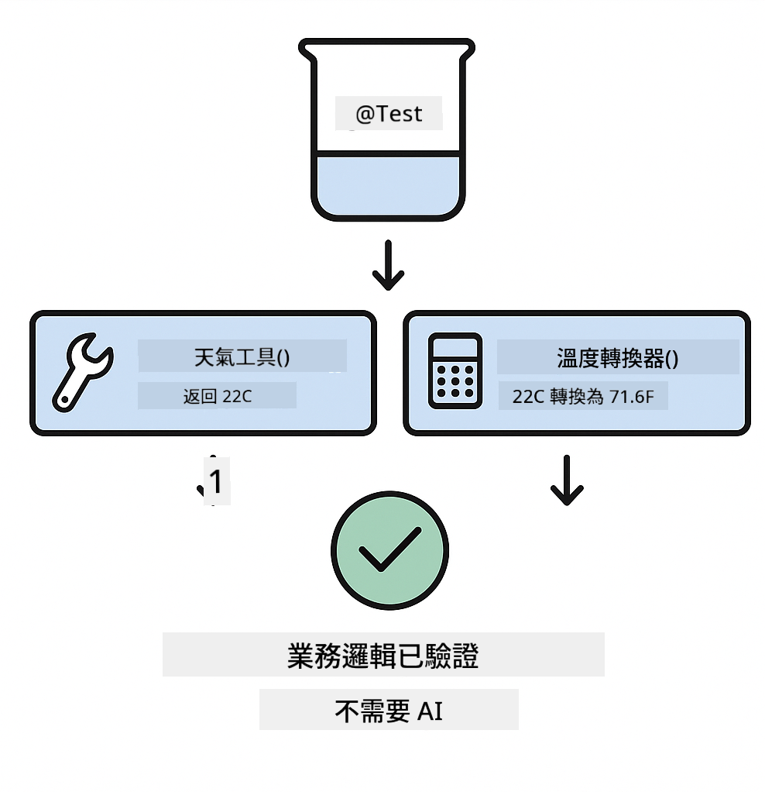
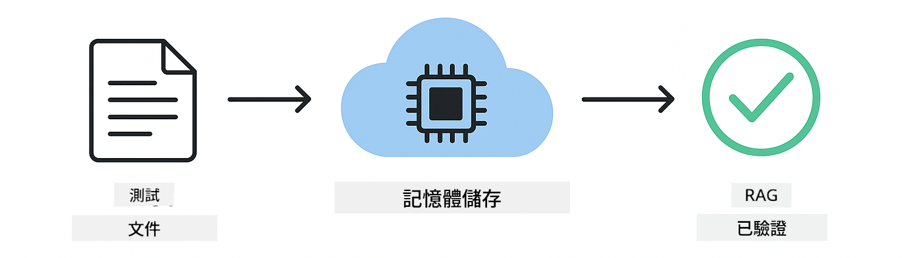

<!--
CO_OP_TRANSLATOR_METADATA:
{
  "original_hash": "b975537560c404d5f254331832811e78",
  "translation_date": "2025-12-13T20:43:13+00:00",
  "source_file": "docs/TESTING.md",
  "language_code": "hk"
}
-->
# 測試 LangChain4j 應用程式

## 目錄

- [快速開始](../../../docs)
- [測試涵蓋範圍](../../../docs)
- [執行測試](../../../docs)
- [在 VS Code 中執行測試](../../../docs)
- [測試模式](../../../docs)
- [測試理念](../../../docs)
- [下一步](../../../docs)

本指南將帶您了解示範如何測試 AI 應用程式的測試，無需 API 金鑰或外部服務。

## 快速開始

使用單一指令執行所有測試：

**Bash:**
```bash
mvn test
```

**PowerShell:**
```powershell
mvn --% test
```


*成功執行測試，所有測試皆通過且無失敗*

## 測試涵蓋範圍

本課程專注於本地執行的**單元測試**。每個測試皆獨立示範特定的 LangChain4j 概念。


*測試金字塔顯示單元測試（快速、獨立）、整合測試（真實元件）與端對端測試（使用 Docker 的完整系統）之間的平衡。本訓練涵蓋單元測試。*

| 模組 | 測試數量 | 重點 | 主要檔案 |
|--------|-------|-------|-----------|
| **00 - 快速開始** | 6 | 提示模板與變數替換 | `SimpleQuickStartTest.java` |
| **01 - 介紹** | 8 | 對話記憶與有狀態聊天 | `SimpleConversationTest.java` |
| **02 - 提示工程** | 12 | GPT-5 模式、積極程度、結構化輸出 | `SimpleGpt5PromptTest.java` |
| **03 - RAG** | 10 | 文件攝取、嵌入、相似度搜尋 | `DocumentServiceTest.java` |
| **04 - 工具** | 12 | 函數呼叫與工具串接 | `SimpleToolsTest.java` |
| **05 - MCP** | 15 | 使用 Docker 的模型上下文協定 | `SimpleMcpTest.java`, `McpDockerTransportTest.java` |

## 執行測試

**從根目錄執行所有測試：**

**Bash:**
```bash
mvn test
```

**PowerShell:**
```powershell
mvn --% test
```

**執行特定模組的測試：**

**Bash:**
```bash
cd 01-introduction && mvn test
# 或者從根目錄開始
mvn test -pl 01-introduction
```

**PowerShell:**
```powershell
cd 01-introduction; mvn --% test
# 或者從根目錄開始
mvn --% test -pl 01-introduction
```

**執行單一測試類別：**

**Bash:**
```bash
mvn test -Dtest=SimpleConversationTest
```

**PowerShell:**
```powershell
mvn --% test -Dtest=SimpleConversationTest
```

**執行特定測試方法：**

**Bash:**
```bash
mvn test -Dtest=SimpleConversationTest#應該保持對話歷史
```

**PowerShell:**
```powershell
mvn --% test -Dtest=SimpleConversationTest#應該保持對話歷史
```

## 在 VS Code 中執行測試

如果您使用 Visual Studio Code，測試總管提供圖形介面來執行與除錯測試。


*VS Code 測試總管顯示所有 Java 測試類別與個別測試方法的測試樹*

**在 VS Code 中執行測試：**

1. 點擊活動列中的燒杯圖示開啟測試總管
2. 展開測試樹以查看所有模組與測試類別
3. 點擊任一測試旁的播放按鈕以單獨執行
4. 點擊「執行所有測試」以執行整個測試套件
5. 右鍵點擊任一測試並選擇「除錯測試」以設定斷點並逐步執行程式碼

測試總管會以綠色勾勾顯示通過的測試，並在測試失敗時提供詳細錯誤訊息。

## 測試模式


*LangChain4j 應用程式的六種測試模式：提示模板、模型模擬、對話隔離、工具測試、記憶體內 RAG 以及 Docker 整合*

### 模式 1：測試提示模板

最簡單的模式是測試提示模板，不呼叫任何 AI 模型。您驗證變數替換是否正確，並確認提示格式符合預期。



*測試提示模板顯示變數替換流程：帶有佔位符的模板 → 套用值 → 驗證格式化輸出*

```java
@Test
@DisplayName("Should format prompt template with variables")
void testPromptTemplateFormatting() {
    PromptTemplate template = PromptTemplate.from(
        "Best time to visit {{destination}} for {{activity}}?"
    );
    
    Prompt prompt = template.apply(Map.of(
        "destination", "Paris",
        "activity", "sightseeing"
    ));
    
    assertThat(prompt.text()).isEqualTo("Best time to visit Paris for sightseeing?");
}
```

此測試位於 `00-quick-start/src/test/java/com/example/langchain4j/quickstart/SimpleQuickStartTest.java`。

**執行方式：**

**Bash:**
```bash
cd 00-quick-start && mvn test -Dtest=SimpleQuickStartTest#測試提示模板格式化
```

**PowerShell:**
```powershell
cd 00-quick-start; mvn --% test -Dtest=SimpleQuickStartTest#測試提示模板格式化
```

### 模式 2：模擬語言模型

測試對話邏輯時，使用 Mockito 建立回傳預設回應的假模型。這使測試快速、免費且可預測。



*比較顯示為何測試偏好使用模擬：快速、免費、可預測，且不需 API 金鑰*

```java
@ExtendWith(MockitoExtension.class)
class SimpleConversationTest {
    
    private ConversationService conversationService;
    
    @Mock
    private OpenAiOfficialChatModel mockChatModel;
    
    @BeforeEach
    void setUp() {
        ChatResponse mockResponse = ChatResponse.builder()
            .aiMessage(AiMessage.from("This is a test response"))
            .build();
        when(mockChatModel.chat(anyList())).thenReturn(mockResponse);
        
        conversationService = new ConversationService(mockChatModel);
    }
    
    @Test
    void shouldMaintainConversationHistory() {
        String conversationId = conversationService.startConversation();
        
        ChatResponse mockResponse1 = ChatResponse.builder()
            .aiMessage(AiMessage.from("Response 1"))
            .build();
        ChatResponse mockResponse2 = ChatResponse.builder()
            .aiMessage(AiMessage.from("Response 2"))
            .build();
        ChatResponse mockResponse3 = ChatResponse.builder()
            .aiMessage(AiMessage.from("Response 3"))
            .build();
        
        when(mockChatModel.chat(anyList()))
            .thenReturn(mockResponse1)
            .thenReturn(mockResponse2)
            .thenReturn(mockResponse3);

        conversationService.chat(conversationId, "First message");
        conversationService.chat(conversationId, "Second message");
        conversationService.chat(conversationId, "Third message");

        List<ChatMessage> history = conversationService.getHistory(conversationId);
        assertThat(history).hasSize(6); // 3 個用戶 + 3 個 AI 訊息
    }
}
```

此模式出現在 `01-introduction/src/test/java/com/example/langchain4j/service/SimpleConversationTest.java`。模擬確保行為一致，讓您能驗證記憶管理是否正確。

### 模式 3：測試對話隔離

對話記憶必須將多個使用者分開。此測試驗證對話不會混淆上下文。



*測試對話隔離顯示不同使用者的獨立記憶存儲，防止上下文混淆*

```java
@Test
void shouldIsolateConversationsByid() {
    String conv1 = conversationService.startConversation();
    String conv2 = conversationService.startConversation();
    
    ChatResponse mockResponse = ChatResponse.builder()
        .aiMessage(AiMessage.from("Response"))
        .build();
    when(mockChatModel.chat(anyList())).thenReturn(mockResponse);

    conversationService.chat(conv1, "Message for conversation 1");
    conversationService.chat(conv2, "Message for conversation 2");

    List<ChatMessage> history1 = conversationService.getHistory(conv1);
    List<ChatMessage> history2 = conversationService.getHistory(conv2);
    
    assertThat(history1).hasSize(2);
    assertThat(history2).hasSize(2);
}
```

每個對話維持獨立歷史。在生產系統中，這種隔離對多使用者應用程式至關重要。

### 模式 4：獨立測試工具

工具是 AI 可呼叫的函數。直接測試它們以確保無論 AI 決策如何，工具皆能正常運作。



*獨立測試工具顯示模擬工具執行，無需 AI 呼叫以驗證商業邏輯*

```java
@Test
void shouldConvertCelsiusToFahrenheit() {
    TemperatureTool tempTool = new TemperatureTool();
    String result = tempTool.celsiusToFahrenheit(25.0);
    assertThat(result).containsPattern("77[.,]0°F");
}

@Test
void shouldDemonstrateToolChaining() {
    WeatherTool weatherTool = new WeatherTool();
    TemperatureTool tempTool = new TemperatureTool();

    String weatherResult = weatherTool.getCurrentWeather("Seattle");
    assertThat(weatherResult).containsPattern("\\d+°C");

    String conversionResult = tempTool.celsiusToFahrenheit(22.0);
    assertThat(conversionResult).containsPattern("71[.,]6°F");
}
```

這些測試來自 `04-tools/src/test/java/com/example/langchain4j/agents/tools/SimpleToolsTest.java`，驗證工具邏輯無需 AI 參與。串接範例展示一個工具的輸出如何作為另一個工具的輸入。

### 模式 5：記憶體內 RAG 測試

RAG 系統傳統上需要向量資料庫與嵌入服務。記憶體內模式讓您無需外部依賴即可測試整個流程。



*記憶體內 RAG 測試工作流程顯示文件解析、嵌入存儲與相似度搜尋，無需資料庫*

```java
@Test
void testProcessTextDocument() {
    String content = "This is a test document.\nIt has multiple lines.";
    InputStream inputStream = new ByteArrayInputStream(content.getBytes(StandardCharsets.UTF_8));
    
    DocumentService.ProcessedDocument result = 
        documentService.processDocument(inputStream, "test.txt");

    assertNotNull(result);
    assertTrue(result.segments().size() > 0);
    assertEquals("test.txt", result.segments().get(0).metadata().getString("filename"));
}
```

此測試來自 `03-rag/src/test/java/com/example/langchain4j/rag/service/DocumentServiceTest.java`，在記憶體中建立文件並驗證分塊與元資料處理。

### 模式 6：使用 Docker 的整合測試

某些功能需要真實基礎設施。MCP 模組使用 Testcontainers 啟動 Docker 容器進行整合測試。這些測試驗證您的程式碼能與實際服務協同運作，同時保持測試隔離。


*MCP 整合測試使用 Testcontainers 顯示自動化容器生命週期：啟動、執行測試、停止與清理*

`05-mcp/src/test/java/com/example/langchain4j/mcp/McpDockerTransportTest.java` 中的測試需要 Docker 正在執行。

**執行方式：**

**Bash:**
```bash
cd 05-mcp && mvn test
```

**PowerShell:**
```powershell
cd 05-mcp; mvn --% test
```

## 測試理念

測試您的程式碼，而非 AI。您的測試應驗證您撰寫的程式碼，檢查提示如何構造、記憶如何管理、工具如何執行。AI 回應會變化，不應成為測試斷言的一部分。問自己提示模板是否正確替換變數，而非 AI 是否給出正確答案。

對語言模型使用模擬。它們是外部依賴，速度慢、成本高且結果不確定。模擬讓測試快速（毫秒級而非秒級）、免費（無 API 費用）且可預測（每次結果相同）。

保持測試獨立。每個測試應自行建立資料，不依賴其他測試，並自行清理。測試應不受執行順序影響而通過。

測試邊界條件，超越理想情況。嘗試空輸入、極大輸入、特殊字元、無效參數與邊界條件。這些常揭露正常使用不會暴露的錯誤。

使用具描述性的名稱。比較 `shouldMaintainConversationHistoryAcrossMultipleMessages()` 與 `test1()`。前者明確告訴您測試內容，讓除錯失敗更容易。

## 下一步

既然您已了解測試模式，深入探索各模組：

- **[00 - 快速開始](../00-quick-start/README.md)** - 從提示模板基礎開始
- **[01 - 介紹](../01-introduction/README.md)** - 學習對話記憶管理
- **[02 - 提示工程](../02-prompt-engineering/README.md)** - 精通 GPT-5 提示模式
- **[03 - RAG](../03-rag/README.md)** - 建立檢索增強生成系統
- **[04 - 工具](../04-tools/README.md)** - 實作函數呼叫與工具串接
- **[05 - MCP](../05-mcp/README.md)** - 整合模型上下文協定與 Docker

每個模組的 README 提供此處測試概念的詳細說明。

---

**導覽：** [← 返回主頁](../README.md)

---

<!-- CO-OP TRANSLATOR DISCLAIMER START -->
**免責聲明**：  
本文件由 AI 翻譯服務 [Co-op Translator](https://github.com/Azure/co-op-translator) 進行翻譯。雖然我們致力於確保準確性，但請注意自動翻譯可能包含錯誤或不準確之處。原始文件的母語版本應被視為權威來源。對於重要資訊，建議採用專業人工翻譯。我們不對因使用本翻譯而引起的任何誤解或誤釋承擔責任。
<!-- CO-OP TRANSLATOR DISCLAIMER END -->