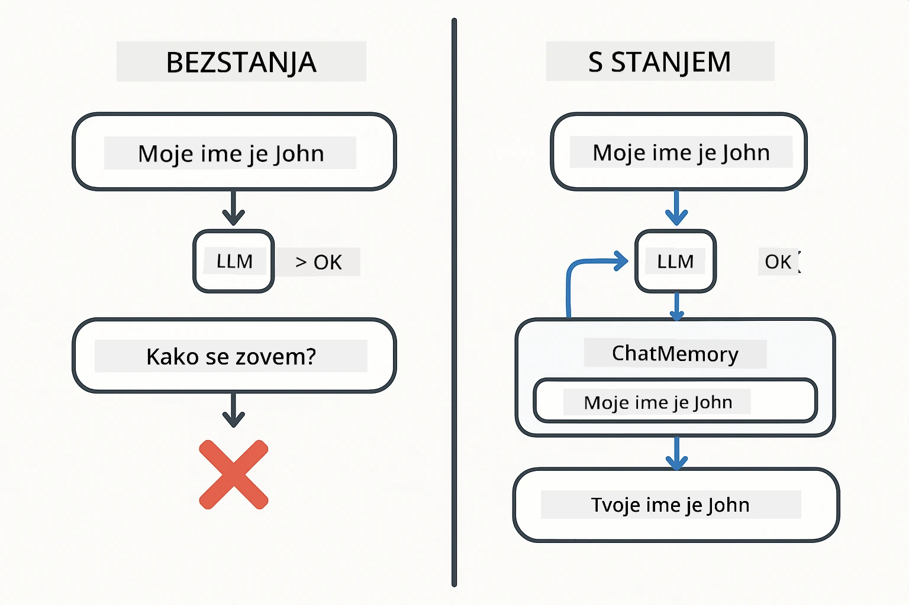
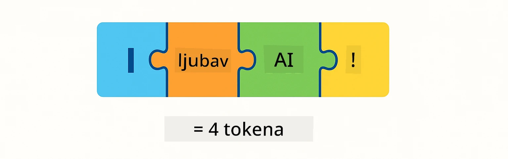
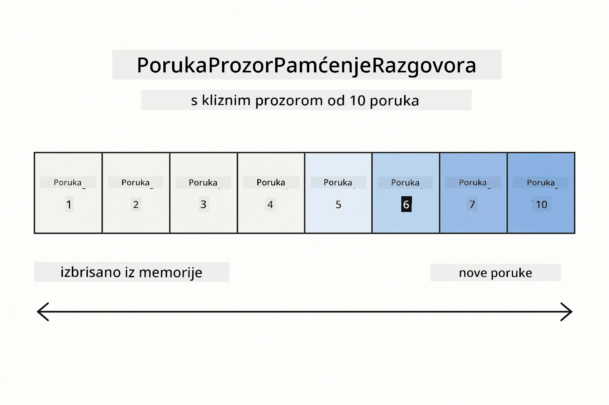
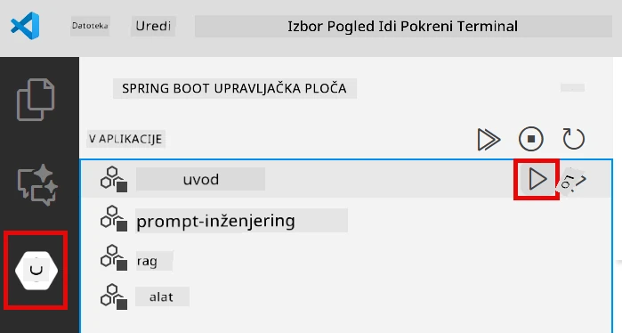
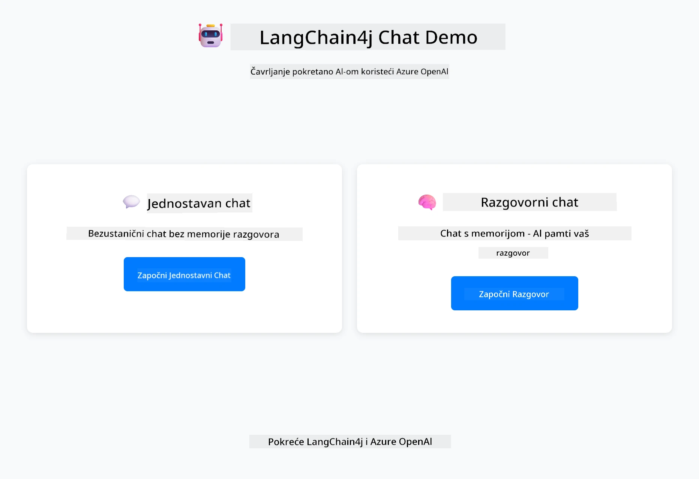
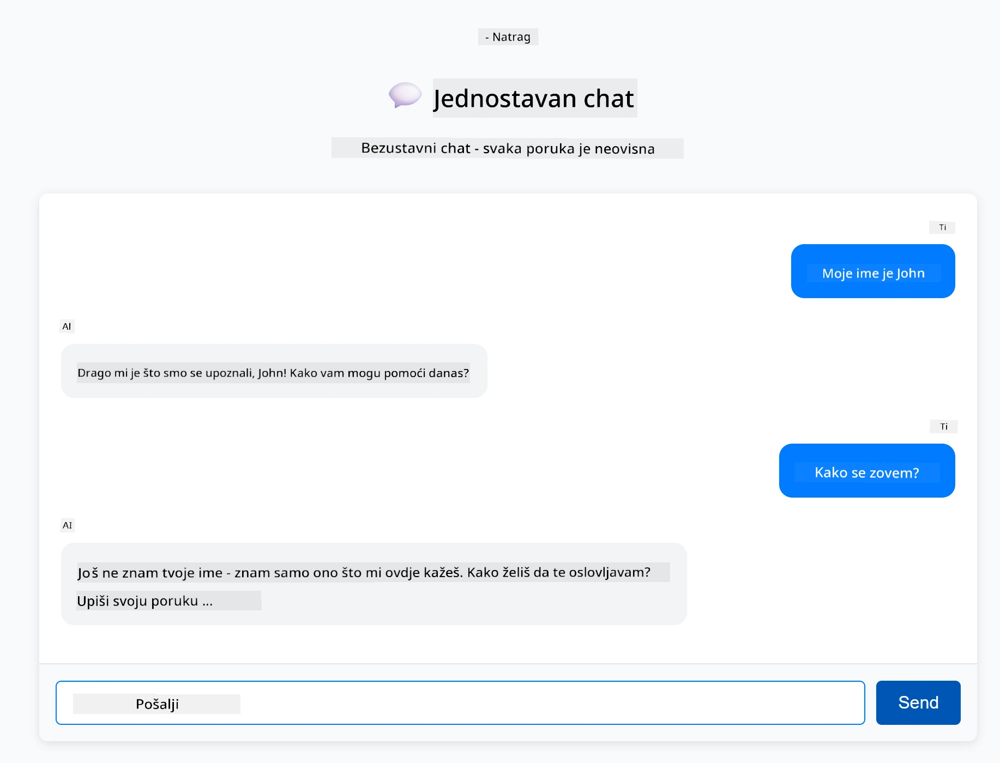
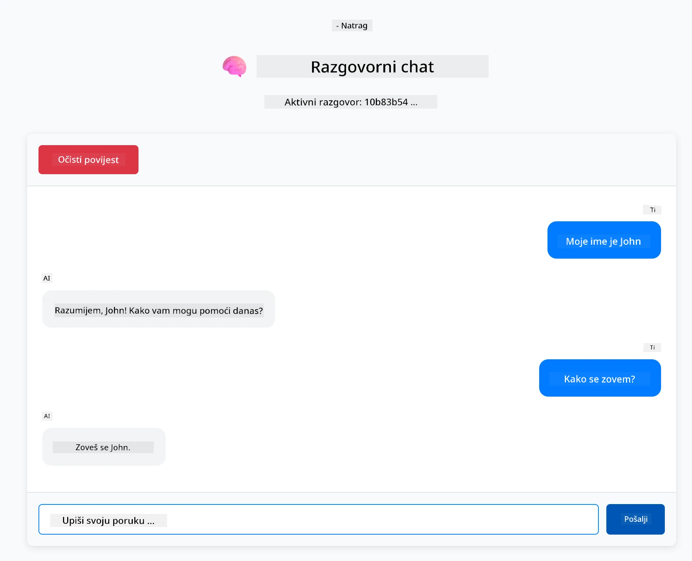

<!--
CO_OP_TRANSLATOR_METADATA:
{
  "original_hash": "c3e07ca58d0b8a3f47d3bf5728541e0a",
  "translation_date": "2025-12-13T14:07:21+00:00",
  "source_file": "01-introduction/README.md",
  "language_code": "hr"
}
-->
# Modul 01: Početak rada s LangChain4j

## Sadržaj

- [Što ćete naučiti](../../../01-introduction)
- [Preduvjeti](../../../01-introduction)
- [Razumijevanje osnovnog problema](../../../01-introduction)
- [Razumijevanje tokena](../../../01-introduction)
- [Kako memorija funkcionira](../../../01-introduction)
- [Kako se koristi LangChain4j](../../../01-introduction)
- [Postavljanje Azure OpenAI infrastrukture](../../../01-introduction)
- [Pokretanje aplikacije lokalno](../../../01-introduction)
- [Korištenje aplikacije](../../../01-introduction)
  - [Stateless chat (lijevi panel)](../../../01-introduction)
  - [Stateful chat (desni panel)](../../../01-introduction)
- [Sljedeći koraci](../../../01-introduction)

## Što ćete naučiti

Ako ste završili brzi početak, vidjeli ste kako poslati upite i dobiti odgovore. To je temelj, ali stvarne aplikacije trebaju više. Ovaj modul vas uči kako izgraditi konverzacijski AI koji pamti kontekst i održava stanje - razliku između jednokratne demonstracije i aplikacije spremne za produkciju.

Koristit ćemo Azure OpenAI GPT-5 kroz ovaj vodič jer njegove napredne sposobnosti rezoniranja čine ponašanje različitih obrazaca jasnijim. Kada dodate memoriju, jasno ćete vidjeti razliku. To olakšava razumijevanje što svaki dio donosi vašoj aplikaciji.

Izgradit ćete jednu aplikaciju koja demonstrira oba obrasca:

**Stateless chat** - Svaki zahtjev je neovisan. Model nema memoriju prethodnih poruka. Ovo je obrazac koji ste koristili u brzom početku.

**Stateful razgovor** - Svaki zahtjev uključuje povijest razgovora. Model održava kontekst kroz više okretaja. Ovo je ono što produkcijske aplikacije zahtijevaju.

## Preduvjeti

- Azure pretplata s pristupom Azure OpenAI
- Java 21, Maven 3.9+
- Azure CLI (https://learn.microsoft.com/en-us/cli/azure/install-azure-cli)
- Azure Developer CLI (azd) (https://learn.microsoft.com/en-us/azure/developer/azure-developer-cli/install-azd)

> **Napomena:** Java, Maven, Azure CLI i Azure Developer CLI (azd) su unaprijed instalirani u priloženom devcontaineru.

> **Napomena:** Ovaj modul koristi GPT-5 na Azure OpenAI. Postavljanje se automatski konfigurira putem `azd up` - nemojte mijenjati ime modela u kodu.

## Razumijevanje osnovnog problema

Jezični modeli su bez stanja. Svaki API poziv je neovisan. Ako pošaljete "Moje ime je John" i zatim pitate "Kako se zovem?", model nema pojma da ste se upravo predstavili. Svaki zahtjev tretira kao da je prvi razgovor koji ste ikada imali.

To je u redu za jednostavna pitanja i odgovore, ali beskorisno za stvarne aplikacije. Botovi za korisničku podršku trebaju pamtiti što ste im rekli. Osobni asistenti trebaju kontekst. Svaki višekratni razgovor zahtijeva memoriju.



*Razlika između stateless (neovisnih poziva) i stateful (svjesnih konteksta) razgovora*

## Razumijevanje tokena

Prije nego što zaronimo u razgovore, važno je razumjeti tokene - osnovne jedinice teksta koje jezični modeli obrađuju:



*Primjer kako se tekst razbija na tokene - "I love AI!" postaje 4 zasebne jedinice za obradu*

Tokeni su način na koji AI modeli mjere i obrađuju tekst. Riječi, interpunkcija, pa čak i razmaci mogu biti tokeni. Vaš model ima ograničenje koliko tokena može obraditi odjednom (400.000 za GPT-5, s do 272.000 ulaznih tokena i 128.000 izlaznih tokena). Razumijevanje tokena pomaže vam upravljati duljinom razgovora i troškovima.

## Kako memorija funkcionira

Memorija chata rješava problem bez stanja održavanjem povijesti razgovora. Prije nego što pošaljete zahtjev modelu, okvir dodaje relevantne prethodne poruke. Kada pitate "Kako se zovem?", sustav zapravo šalje cijelu povijest razgovora, dopuštajući modelu da vidi da ste ranije rekli "Moje ime je John."

LangChain4j pruža implementacije memorije koje to automatski upravljaju. Vi birate koliko poruka želite zadržati, a okvir upravlja kontekstnim prozorom.



*MessageWindowChatMemory održava klizni prozor nedavnih poruka, automatski odbacujući stare*

## Kako se koristi LangChain4j

Ovaj modul proširuje brzi početak integrirajući Spring Boot i dodajući memoriju razgovora. Evo kako se dijelovi uklapaju:

**Ovisnosti** - Dodajte dvije LangChain4j biblioteke:

```xml
<dependency>
    <groupId>dev.langchain4j</groupId>
    <artifactId>langchain4j</artifactId> <!-- Inherited from BOM in root pom.xml -->
</dependency>
<dependency>
    <groupId>dev.langchain4j</groupId>
    <artifactId>langchain4j-open-ai-official</artifactId> <!-- Inherited from BOM in root pom.xml -->
</dependency>
```

**Chat model** - Konfigurirajte Azure OpenAI kao Spring bean ([LangChainConfig.java](../../../01-introduction/src/main/java/com/example/langchain4j/config/LangChainConfig.java)):

```java
@Bean
public OpenAiOfficialChatModel openAiOfficialChatModel() {
    return OpenAiOfficialChatModel.builder()
            .baseUrl(azureEndpoint)
            .apiKey(azureApiKey)
            .modelName(deploymentName)
            .timeout(Duration.ofMinutes(5))
            .maxRetries(3)
            .build();
}
```

Builder čita vjerodajnice iz varijabli okoline postavljenih putem `azd up`. Postavljanje `baseUrl` na vaš Azure endpoint omogućuje OpenAI klijentu rad s Azure OpenAI.

**Memorija razgovora** - Pratite povijest chata s MessageWindowChatMemory ([ConversationService.java](../../../01-introduction/src/main/java/com/example/langchain4j/service/ConversationService.java)):

```java
ChatMemory memory = MessageWindowChatMemory.withMaxMessages(10);

memory.add(UserMessage.from("My name is John"));
memory.add(AiMessage.from("Nice to meet you, John!"));

memory.add(UserMessage.from("What's my name?"));
AiMessage aiMessage = chatModel.chat(memory.messages()).aiMessage();
memory.add(aiMessage);
```

Kreirajte memoriju s `withMaxMessages(10)` da zadržite posljednjih 10 poruka. Dodajte korisničke i AI poruke s tipiziranim omotačima: `UserMessage.from(text)` i `AiMessage.from(text)`. Dohvatite povijest s `memory.messages()` i pošaljite je modelu. Servis pohranjuje zasebne instance memorije po ID-u razgovora, omogućujući više korisnika da istovremeno razgovaraju.

> **🤖 Isprobajte s [GitHub Copilot](https://github.com/features/copilot) Chat:** Otvorite [`ConversationService.java`](../../../01-introduction/src/main/java/com/example/langchain4j/service/ConversationService.java) i pitajte:
> - "Kako MessageWindowChatMemory odlučuje koje poruke odbaciti kada je prozor pun?"
> - "Mogu li implementirati prilagođenu pohranu memorije koristeći bazu podataka umjesto memorije u RAM-u?"
> - "Kako bih dodao sažimanje za kompresiju stare povijesti razgovora?"

Stateless chat endpoint u potpunosti preskače memoriju - samo `chatModel.chat(prompt)` kao u brzom početku. Stateful endpoint dodaje poruke u memoriju, dohvaća povijest i uključuje taj kontekst sa svakim zahtjevom. Ista konfiguracija modela, različiti obrasci.

## Postavljanje Azure OpenAI infrastrukture

**Bash:**
```bash
cd 01-introduction
azd up  # Odaberite pretplatu i lokaciju (preporučeno eastus2)
```

**PowerShell:**
```powershell
cd 01-introduction
azd up  # Odaberite pretplatu i lokaciju (preporučeno eastus2)
```

> **Napomena:** Ako naiđete na grešku timeouta (`RequestConflict: Cannot modify resource ... provisioning state is not terminal`), jednostavno pokrenite `azd up` ponovno. Azure resursi se možda još uvijek postavljaju u pozadini, a ponovni pokušaj omogućuje dovršetak postavljanja kada resursi dođu do terminalnog stanja.

Ovo će:
1. Postaviti Azure OpenAI resurs s GPT-5 i modelima text-embedding-3-small
2. Automatski generirati `.env` datoteku u korijenu projekta s vjerodajnicama
3. Postaviti sve potrebne varijable okoline

**Imate problema s postavljanjem?** Pogledajte [README infrastrukture](infra/README.md) za detaljno rješavanje problema uključujući sukobe imena poddomena, korake ručnog postavljanja u Azure Portalu i smjernice za konfiguraciju modela.

**Provjerite je li postavljanje uspjelo:**

**Bash:**
```bash
cat ../.env  # Trebalo bi prikazati AZURE_OPENAI_ENDPOINT, API_KEY, itd.
```

**PowerShell:**
```powershell
Get-Content ..\.env  # Trebalo bi prikazati AZURE_OPENAI_ENDPOINT, API_KEY, itd.
```

> **Napomena:** `azd up` naredba automatski generira `.env` datoteku. Ako je kasnije trebate ažurirati, možete ili ručno urediti `.env` datoteku ili je ponovno generirati pokretanjem:
>
> **Bash:**
> ```bash
> cd ..
> bash .azd-env.sh
> ```
>
> **PowerShell:**
> ```powershell
> cd ..
> .\.azd-env.ps1
> ```

## Pokretanje aplikacije lokalno

**Provjerite postavljanje:**

Provjerite postoji li `.env` datoteka u korijenskom direktoriju s Azure vjerodajnicama:

**Bash:**
```bash
cat ../.env  # Trebalo bi prikazati AZURE_OPENAI_ENDPOINT, API_KEY, DEPLOYMENT
```

**PowerShell:**
```powershell
Get-Content ..\.env  # Trebalo bi prikazati AZURE_OPENAI_ENDPOINT, API_KEY, DEPLOYMENT
```

**Pokrenite aplikacije:**

**Opcija 1: Korištenje Spring Boot Dashboarda (preporučeno za VS Code korisnike)**

Dev container uključuje Spring Boot Dashboard ekstenziju, koja pruža vizualno sučelje za upravljanje svim Spring Boot aplikacijama. Možete je pronaći u Activity Baru na lijevoj strani VS Codea (potražite ikonu Spring Boota).

Iz Spring Boot Dashboarda možete:
- Vidjeti sve dostupne Spring Boot aplikacije u radnom prostoru
- Pokrenuti/zaustaviti aplikacije jednim klikom
- Pregledavati logove aplikacije u stvarnom vremenu
- Pratiti status aplikacije

Jednostavno kliknite gumb za pokretanje pored "introduction" da pokrenete ovaj modul, ili pokrenite sve module odjednom.



**Opcija 2: Korištenje shell skripti**

Pokrenite sve web aplikacije (moduli 01-04):

**Bash:**
```bash
cd ..  # Iz korijenskog direktorija
./start-all.sh
```

**PowerShell:**
```powershell
cd ..  # Iz korijenskog direktorija
.\start-all.ps1
```

Ili pokrenite samo ovaj modul:

**Bash:**
```bash
cd 01-introduction
./start.sh
```

**PowerShell:**
```powershell
cd 01-introduction
.\start.ps1
```

Obje skripte automatski učitavaju varijable okoline iz korijenske `.env` datoteke i izgradit će JAR-ove ako ne postoje.

> **Napomena:** Ako želite ručno izgraditi sve module prije pokretanja:
>
> **Bash:**
> ```bash
> cd ..  # Go to root directory
> mvn clean package -DskipTests
> ```
>
> **PowerShell:**
> ```powershell
> cd ..  # Go to root directory
> mvn clean package -DskipTests
> ```

Otvorite http://localhost:8080 u vašem pregledniku.

**Za zaustavljanje:**

**Bash:**
```bash
./stop.sh  # Samo ovaj modul
# Ili
cd .. && ./stop-all.sh  # Svi moduli
```

**PowerShell:**
```powershell
.\stop.ps1  # Samo ovaj modul
# Ili
cd ..; .\stop-all.ps1  # Svi moduli
```

## Korištenje aplikacije

Aplikacija pruža web sučelje s dvije implementacije chata jedna pored druge.



*Nadzorna ploča prikazuje opcije Simple Chat (stateless) i Conversational Chat (stateful)*

### Stateless chat (lijevi panel)

Isprobajte prvo ovo. Recite "Moje ime je John" i odmah zatim pitajte "Kako se zovem?" Model neće zapamtiti jer je svaka poruka neovisna. Ovo demonstrira osnovni problem integracije jezičnih modela - nema konteksta razgovora.



*AI ne pamti vaše ime iz prethodne poruke*

### Stateful chat (desni panel)

Sada isprobajte isti niz ovdje. Recite "Moje ime je John" i zatim "Kako se zovem?" Ovaj put se pamti. Razlika je MessageWindowChatMemory - održava povijest razgovora i uključuje je sa svakim zahtjevom. Tako funkcionira produkcijski konverzacijski AI.



*AI pamti vaše ime iz ranijeg dijela razgovora*

Oba panela koriste isti GPT-5 model. Jedina razlika je memorija. To jasno pokazuje što memorija donosi vašoj aplikaciji i zašto je ključna za stvarne slučajeve upotrebe.

## Sljedeći koraci

**Sljedeći modul:** [02-prompt-engineering - Inženjering upita s GPT-5](../02-prompt-engineering/README.md)

---

**Navigacija:** [← Prethodni: Modul 00 - Brzi početak](../00-quick-start/README.md) | [Natrag na početak](../README.md) | [Sljedeći: Modul 02 - Inženjering upita →](../02-prompt-engineering/README.md)

---

<!-- CO-OP TRANSLATOR DISCLAIMER START -->
**Odricanje od odgovornosti**:
Ovaj dokument preveden je pomoću AI usluge za prevođenje [Co-op Translator](https://github.com/Azure/co-op-translator). Iako nastojimo postići točnost, imajte na umu da automatski prijevodi mogu sadržavati pogreške ili netočnosti. Izvorni dokument na izvornom jeziku treba smatrati autoritativnim izvorom. Za kritične informacije preporučuje se profesionalni ljudski prijevod. Ne snosimo odgovornost za bilo kakva nesporazuma ili pogrešna tumačenja koja proizlaze iz korištenja ovog prijevoda.
<!-- CO-OP TRANSLATOR DISCLAIMER END -->