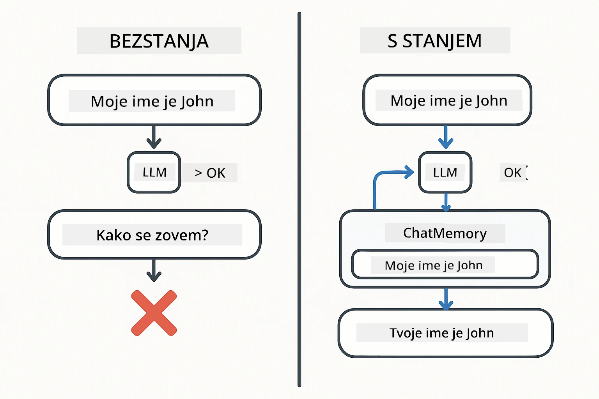
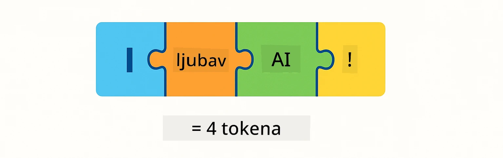
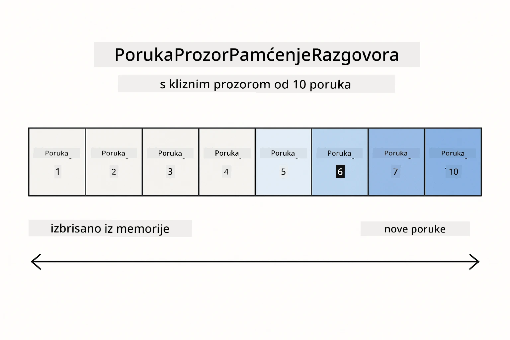
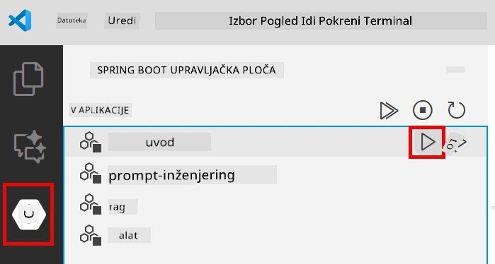
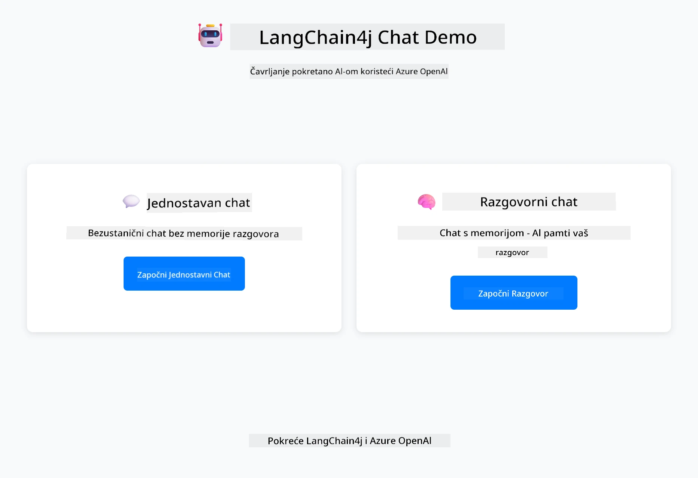
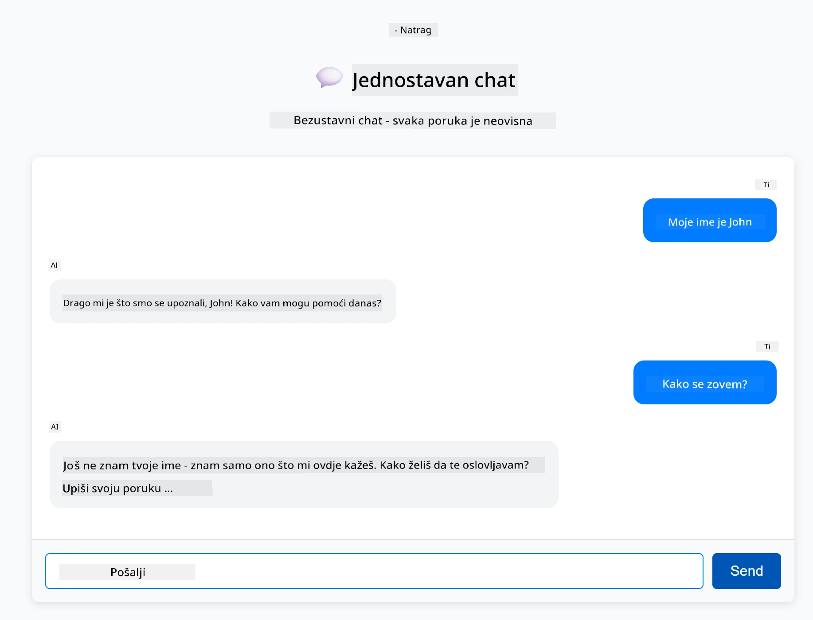
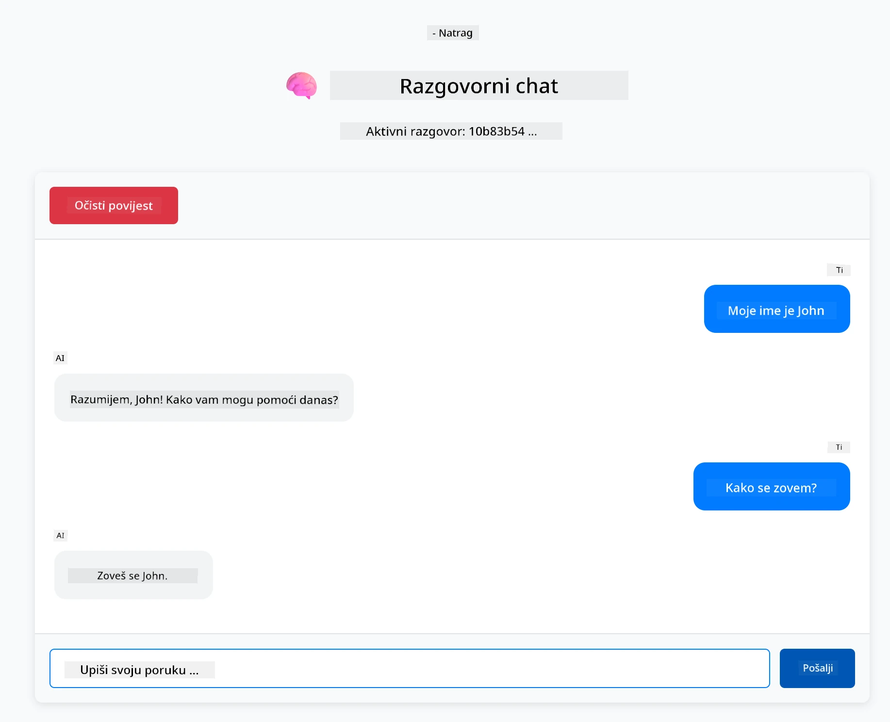

# Modul 01: Početak rada s LangChain4j

## Sadržaj

- [Video vodič](#video-vodič)
- [Što ćete naučiti](#što-ćete-naučiti)
- [Preduvjeti](#preduvjeti)
- [Razumijevanje osnovnog problema](#razumijevanje-osnovnog-problema)
- [Razumijevanje tokena](#razumijevanje-tokena)
- [Kako radna memorija funkcionira](#kako-radna-memorija-funkcionira)
- [Kako se koristi LangChain4j](#kako-se-koristi-langchain4j)
- [Implementacija Azure OpenAI infrastrukture](#implementacija-azure-openai-infrastrukture)
- [Pokretanje aplikacije lokalno](#pokretanje-aplikacije-lokalno)
- [Korištenje aplikacije](#korištenje-aplikacije)
  - [Statički razgovor (lijevi panel)](#statički-razgovor-lijevi-panel)
  - [Dinamički razgovor (desni panel)](#dinamički-razgovor-desni-panel)
- [Sljedeći koraci](#sljedeći-koraci)

## Video vodič

Pogledajte ovu snimku uživo koja objašnjava kako započeti s ovim modulom:

<a href="https://www.youtube.com/live/nl_troDm8rQ?si=6b85S8xGjWnT2fX9"></a>

## Što ćete naučiti

Ovo je vaša polazna točka s LangChain4j i Azure OpenAI. Počinjemo s osnovama i krećemo izgraditi proizvodne aplikacije. Ovaj modul se fokusira na konverzacijski AI koji pamti kontekst i održava stanje — temeljne koncepte na kojima se grade svi kasniji moduli.

Koristit ćemo Azure OpenAI-jev GPT-5.2 kroz ovaj vodič jer njegove napredne sposobnosti rezoniranja jasno pokazuju ponašanje raznih obrazaca. Kada dodate memoriju, razlika postaje očita. To olakšava razumijevanje što svaki dio donosi vašoj aplikaciji.

Izgradit ćete jednu aplikaciju koja demonstrira oba obrasca:

**Stateless Chat** - Svaki zahtjev je samostalan. Model nema memoriju prethodnih poruka. Ovo je najsimpiljnija polazna točka.

**Stateful Conversation** - Svaki zahtjev uključuje povijest razgovora. Model održava kontekst kroz više okretaja. To je ono što proizvodne aplikacije zahtijevaju.

## Preduvjeti

- Azure pretplata s pristupom Azure OpenAI
- Java 21, Maven 3.9+
- Azure CLI (https://learn.microsoft.com/en-us/cli/azure/install-azure-cli)
- Azure Developer CLI (azd) (https://learn.microsoft.com/en-us/azure/developer/azure-developer-cli/install-azd)

> **Napomena:** Java, Maven, Azure CLI i Azure Developer CLI (azd) su unaprijed instalirani u priloženom razvojnom kontejneru.

> **Napomena:** Ovaj modul koristi GPT-5.2 na Azure OpenAI. Implementacija se automatski konfigurira putem `azd up` - nemojte mijenjati ime modela u kodu.

## Razumijevanje osnovnog problema

Jezični modeli su bezstanja. Svaki API poziv je nezavisan. Ako pošaljete "Moje ime je John" pa zatim pitate "Kako se zovem?", model nema pojma da ste se upravo predstavili. Svaki zahtjev tretira kao da je prvi razgovor koji ste ikada vodili.

To je u redu za jednostavna pitanja i odgovore, ali beskorisno za stvarne aplikacije. Botovi za korisničku službu moraju pamtiti što ste im rekli. Osobni asistenti trebaju kontekst. Svaki višekratni razgovor zahtijeva memoriju.

Sljedeća dijagram prikazuje kontrast dvaju pristupa — lijevo je bezstanični poziv koji zaboravlja vaše ime; desno je sa stanjem, potpomognut ChatMemory, koji ga pamti.



*Razlika između bezstanih (nezavisnih poziva) i stanju svjesnih (kontekstnih) razgovora*

## Razumijevanje tokena

Prije nego što zaronimo u razgovore, važno je razumjeti tokene - osnovne jedinice teksta koje jezični modeli obrađuju:



*Primjer kako se tekst dijeli na tokene - "I love AI!" postaje 4 zasebne jedinice za obradu*

Tokeni su način na koji AI modeli mjere i obrađuju tekst. Riječi, interpunkcija pa čak i praznine mogu biti tokeni. Vaš model ima ograničenje koliko tokena može obraditi odjednom (400.000 za GPT-5.2, s do 272.000 ulaznih tokena i 128.000 izlaznih tokena). Razumijevanje tokena pomaže u upravljanju duljinom razgovora i troškovima.

## Kako radna memorija funkcionira

Chat memorija rješava problem bezstanja tako što održava povijest razgovora. Prije nego što pošaljete zahtjev modelu, okvir prethodno dodaje relevantne prethodne poruke. Kad pitate "Kako se zovem?", sustav zapravo šalje cijelu povijest razgovora, dopuštajući modelu da vidi da ste ranije rekli "Moje ime je John."

LangChain4j nudi implementacije memorije koje to automatski rješavaju. Vi birate koliko poruka želite sačuvati, a okvir upravlja kontekstnim prozorom. Dijagram ispod prikazuje kako MessageWindowChatMemory održava klizni prozor nedavnih poruka.



*MessageWindowChatMemory održava klizni prozor nedavnih poruka, automatski odbacujući stare*

## Kako se koristi LangChain4j

Ovaj modul integrira Spring Boot i dodaje memoriju za razgovor. Evo kako se elementi slagaju:

**Ovisnosti** - Dodajte dvije LangChain4j biblioteke:

```xml
<dependency>
    <groupId>dev.langchain4j</groupId>
    <artifactId>langchain4j</artifactId> <!-- Inherited from BOM in root pom.xml -->
</dependency>
<dependency>
    <groupId>dev.langchain4j</groupId>
    <artifactId>langchain4j-open-ai-official</artifactId> <!-- Inherited from BOM in root pom.xml -->
</dependency>
```
  
**Chat Model** - Konfigurirajte Azure OpenAI kao Spring bean ([LangChainConfig.java](../../../01-introduction/src/main/java/com/example/langchain4j/config/LangChainConfig.java)):

```java
@Bean
public OpenAiOfficialChatModel openAiOfficialChatModel() {
    return OpenAiOfficialChatModel.builder()
            .baseUrl(azureEndpoint)
            .apiKey(azureApiKey)
            .modelName(deploymentName)
            .timeout(Duration.ofMinutes(5))
            .maxRetries(3)
            .build();
}
```
  
Builder čita vjerodajnice iz varijabli okoline postavljenih `azd up`. Postavljanje `baseUrl` na vašu Azure krajnju točku omogućuje OpenAI klijentu rad s Azure OpenAI.

**Memorija razgovora** - Pratite povijest razgovora s MessageWindowChatMemory ([ConversationService.java](../../../01-introduction/src/main/java/com/example/langchain4j/service/ConversationService.java)):

```java
ChatMemory memory = MessageWindowChatMemory.withMaxMessages(10);

memory.add(UserMessage.from("My name is John"));
memory.add(AiMessage.from("Nice to meet you, John!"));

memory.add(UserMessage.from("What's my name?"));
AiMessage aiMessage = chatModel.chat(memory.messages()).aiMessage();
memory.add(aiMessage);
```
  
Kreirajte memoriju s `withMaxMessages(10)` za čuvanje posljednjih 10 poruka. Dodajte korisničke i AI poruke pomoću tipiziranih omotača: `UserMessage.from(text)` i `AiMessage.from(text)`. Dohvatite povijest s `memory.messages()` i pošaljite je modelu. Servis pohranjuje zasebne instance memorije po ID-u razgovora, dopuštajući višestrukim korisnicima istovremeni chat.

> **🤖 Isprobajte s [GitHub Copilot](https://github.com/features/copilot) Chat:** Otvorite [`ConversationService.java`](../../../01-introduction/src/main/java/com/example/langchain4j/service/ConversationService.java) i pitajte:
> - "Kako MessageWindowChatMemory odlučuje koje poruke odbaciti kada je prozor pun?"
> - "Mogu li implementirati prilagođenu pohranu memorije koristeći bazu podataka umjesto memorije?"
> - "Kako bih dodao sažimanje da komprimiram staru povijest razgovora?"

Endpoint za stateless chat u potpunosti preskače memoriju - samo `chatModel.chat(prompt)` kao u brzom početku. Stateful endpoint dodaje poruke u memoriju, dohvaća povijest i uključuje taj kontekst sa svakim zahtjevom. Ista konfiguracija modela, različiti obrasci.

## Implementacija Azure OpenAI infrastrukture

**Bash:**  
```bash
cd 01-introduction
azd up  # Odaberite pretplatu i lokaciju (preporučeno eastus2)
```
  
**PowerShell:**  
```powershell
cd 01-introduction
azd up  # Odaberite pretplatu i lokaciju (preporučeno eastus2)
```
  

> **Napomena:** Ako naiđete na grešku timeouta (`RequestConflict: Cannot modify resource ... provisioning state is not terminal`), jednostavno ponovno pokrenite `azd up`. Azure resursi se mogu još postavljati u pozadini, a ponovni pokušaj omogućuje dovršetak implementacije kada resursi dođu u terminalno stanje.

Ovo će:
1. Implementirati Azure OpenAI resurs s GPT-5.2 i modelima text-embedding-3-small  
2. Automatski generirati `.env` datoteku u korijenu projekta s vjerodajnicama  
3. Postaviti sve potrebne varijable okoline  

**Imate problema s implementacijom?** Pogledajte [Infrastructure README](infra/README.md) za detaljno rješavanje problema uključujući sukobe naziva poddomena, korake za ručnu implementaciju putem Azure Portala i upute za konfiguraciju modela.

**Provjerite je li implementacija uspjela:**

**Bash:**  
```bash
cat ../.env  # Trebalo bi prikazati AZURE_OPENAI_ENDPOINT, API_KEY itd.
```
  
**PowerShell:**  
```powershell
Get-Content ..\.env  # Trebao bi prikazati AZURE_OPENAI_ENDPOINT, API_KEY, itd.
```


> **Napomena:** `azd up` automatski generira `.env` datoteku. Ako je potrebno kasnije ažurirati, možete ju ili ručno urediti ili ponovno generirati pokretanjem:  
>  
> **Bash:**  
> ```bash
> cd ..
> bash .azd-env.sh
> ```
>  
> **PowerShell:**  
> ```powershell
> cd ..
> .\.azd-env.ps1
> ```
  

## Pokretanje aplikacije lokalno

**Provjerite implementaciju:**

Provjerite postoji li `.env` datoteka u korijenskom direktoriju s Azure vjerodajnicama. Pokrenite ovo iz direktorija modula (`01-introduction/`):

**Bash:**  
```bash
cat ../.env  # Trebalo bi prikazati AZURE_OPENAI_ENDPOINT, API_KEY, DEPLOYMENT
```
  
**PowerShell:**  
```powershell
Get-Content ..\.env  # Trebalo bi prikazati AZURE_OPENAI_ENDPOINT, API_KEY, DEPLOYMENT
```
  

**Pokrenite aplikacije:**

**Opcija 1: Korištenje Spring Boot Dashboarda (preporučeno za korisnike VS Code-a)**

Razvojni kontejner uključuje ekstenziju Spring Boot Dashboard, koja pruža vizualno sučelje za upravljanje svim Spring Boot aplikacijama. Možete ju pronaći u traci aktivnosti na lijevoj strani VS Code-a (potražite ikonu Spring Boota).

Iz Spring Boot Dashboarda možete:  
- Vidjeti sve dostupne Spring Boot aplikacije u prostoru za rad  
- Pokretati/zaustavljati aplikacije jednim klikom  
- Pratiti zapisnike aplikacije u stvarnom vremenu  
- Nadzirati stanje aplikacije

Jednostavno kliknite tipku za pokretanje pored "introduction" za pokretanje ovog modula ili pokrenite sve module odjednom.



*Spring Boot Dashboard u VS Codeu — pokrenite, zaustavite i pratite sve module s jednog mjesta*

**Opcija 2: Korištenje shell skripti**

Pokrenite sve web aplikacije (moduli 01-04):

**Bash:**  
```bash
cd ..  # Iz korijenskog direktorija
./start-all.sh
```
  
**PowerShell:**  
```powershell
cd ..  # Iz korijenskog direktorija
.\start-all.ps1
```
  

Ili pokrenite samo ovaj modul:

**Bash:**  
```bash
cd 01-introduction
./start.sh
```
  
**PowerShell:**  
```powershell
cd 01-introduction
.\start.ps1
```
  

Oba skripta automatski učitavaju varijable okoline iz korijenske `.env` datoteke i kompajlirat će JAR-ove ako ne postoje.

> **Napomena:** Ako želite ručno izgraditi sve module prije pokretanja:  
>  
> **Bash:**  
> ```bash
> cd ..  # Go to root directory
> mvn clean package -DskipTests
> ```
>  
> **PowerShell:**  
> ```powershell
> cd ..  # Go to root directory
> mvn clean package -DskipTests
> ```
  

Otvorite http://localhost:8080 u vašem pregledniku.

**Za zaustavljanje:**

**Bash:**  
```bash
./stop.sh  # Samo ovaj modul
# Ili
cd .. && ./stop-all.sh  # Svi moduli
```
  
**PowerShell:**  
```powershell
.\stop.ps1  # Samo ovaj modul
# Ili
cd ..; .\stop-all.ps1  # Svi moduli
```
  

## Korištenje aplikacije

Aplikacija pruža web sučelje s dvije implementacije chata jedna do druge.



*Prikaz nadzorne ploče s opcijama Simple Chat (bezstanje) i Conversational Chat (sa stanjem)*

### Statički razgovor (lijevi panel)

Probajte najprije ovo. Recite "Moje ime je John" i zatim odmah pitajte "Kako se zovem?" Model neće zapamtiti jer je svaka poruka samostalna. Ovo ilustrira osnovni problem integracije jezičnih modela - nema kontekst razgovora.



*AI ne pamti vaše ime iz prethodne poruke*

### Dinamički razgovor (desni panel)

Sada isprobajte isti redoslijed ovdje. Recite "Moje ime je John" pa zatim "Kako se zovem?" Ovog puta model pamti. Razlika je u MessageWindowChatMemory - on održava povijest razgovora i uključuje je sa svakim zahtjevom. Ovo je način na koji produkcijski konverzacijski AI radi.



*AI pamti vaše ime iz ranijeg dijela razgovora*

Oba panela koriste isti GPT-5.2 model. Jedina razlika je memorija. To jasno pokazuje što memorija donosi vašoj aplikaciji i zašto je bitna za stvarne slučajeve upotrebe.

## Sljedeći koraci

**Sljedeći modul:** [02-prompt-engineering - Inženjering upita s GPT-5.2](../02-prompt-engineering/README.md)

---

**Navigacija:** [← Nazad na početak](../README.md) | [Sljedeće: Modul 02 - Inženjering upita →](../02-prompt-engineering/README.md)

---

<!-- CO-OP TRANSLATOR DISCLAIMER START -->
**Napomena**:
Ovaj dokument je preveden korištenjem AI prevoditeljskog servisa [Co-op Translator](https://github.com/Azure/co-op-translator). Iako težimo točnosti, imajte na umu da automatski prijevodi mogu sadržavati greške ili netočnosti. Izvorni dokument na izvornom jeziku treba smatrati autoritativnim izvorom. Za važne informacije preporuča se profesionalni ljudski prijevod. Nismo odgovorni za bilo kakva nesporazumevanja ili pogrešne interpretacije koje proizlaze iz korištenja ovog prijevoda.
<!-- CO-OP TRANSLATOR DISCLAIMER END -->