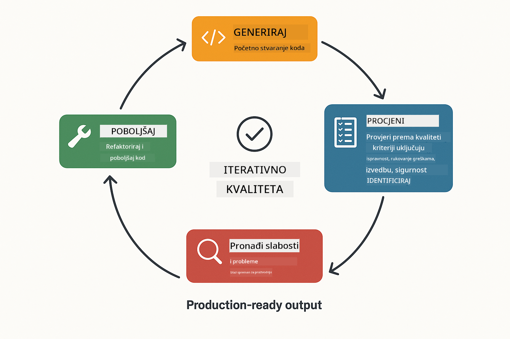
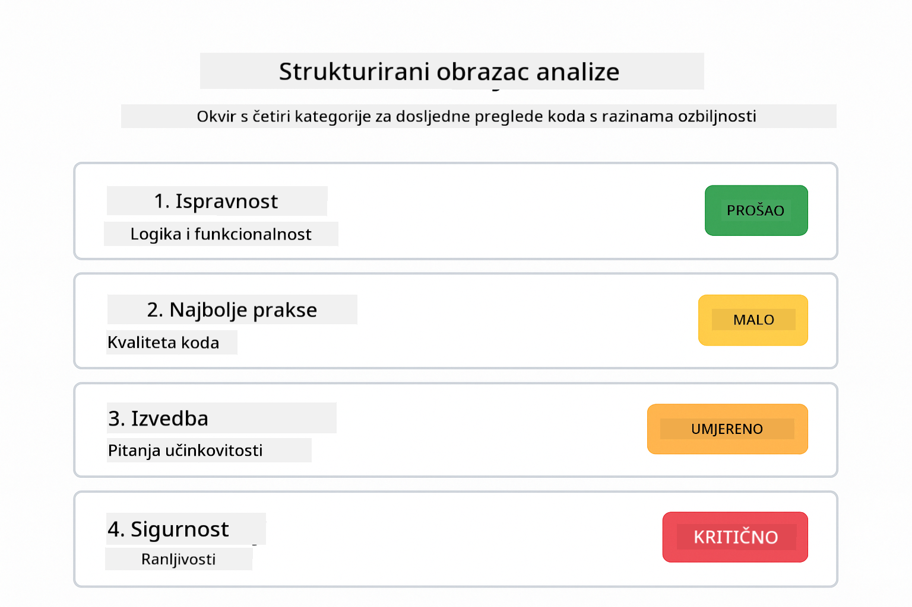
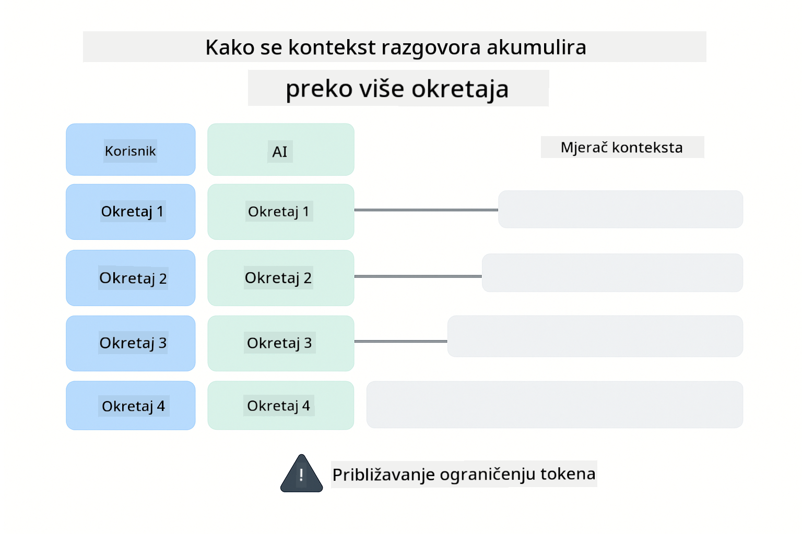
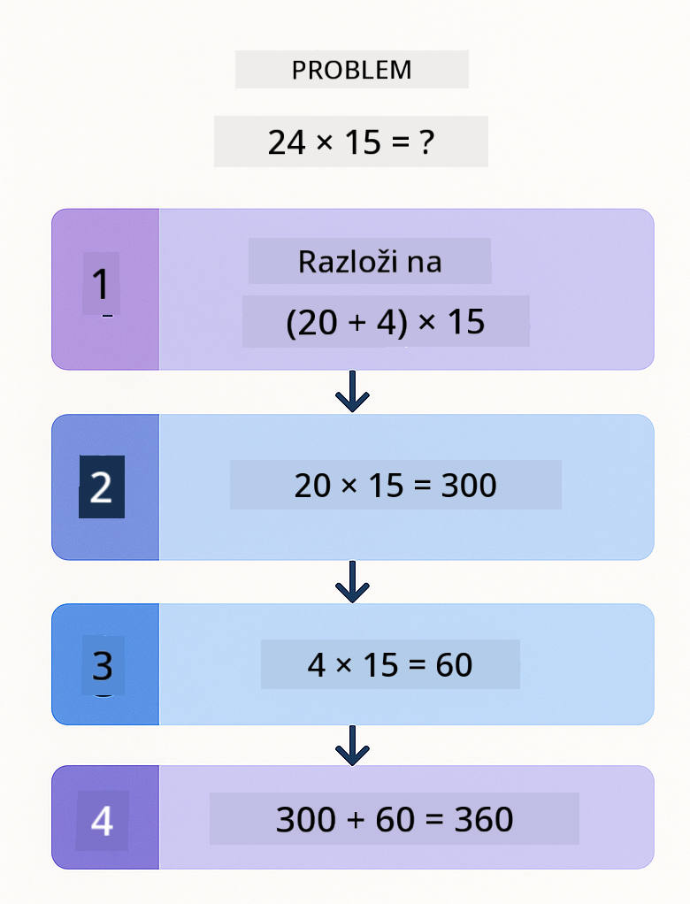
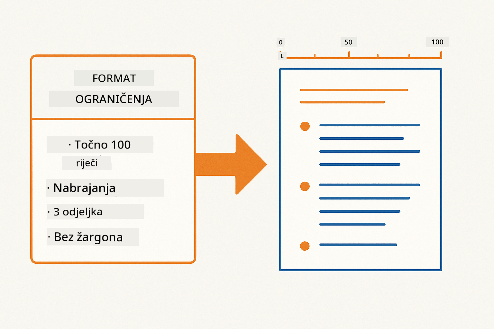
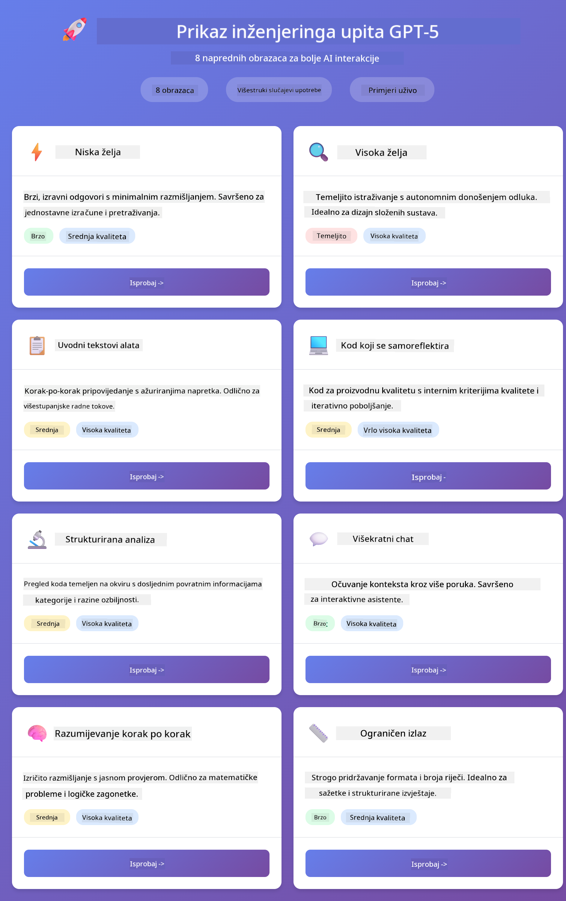
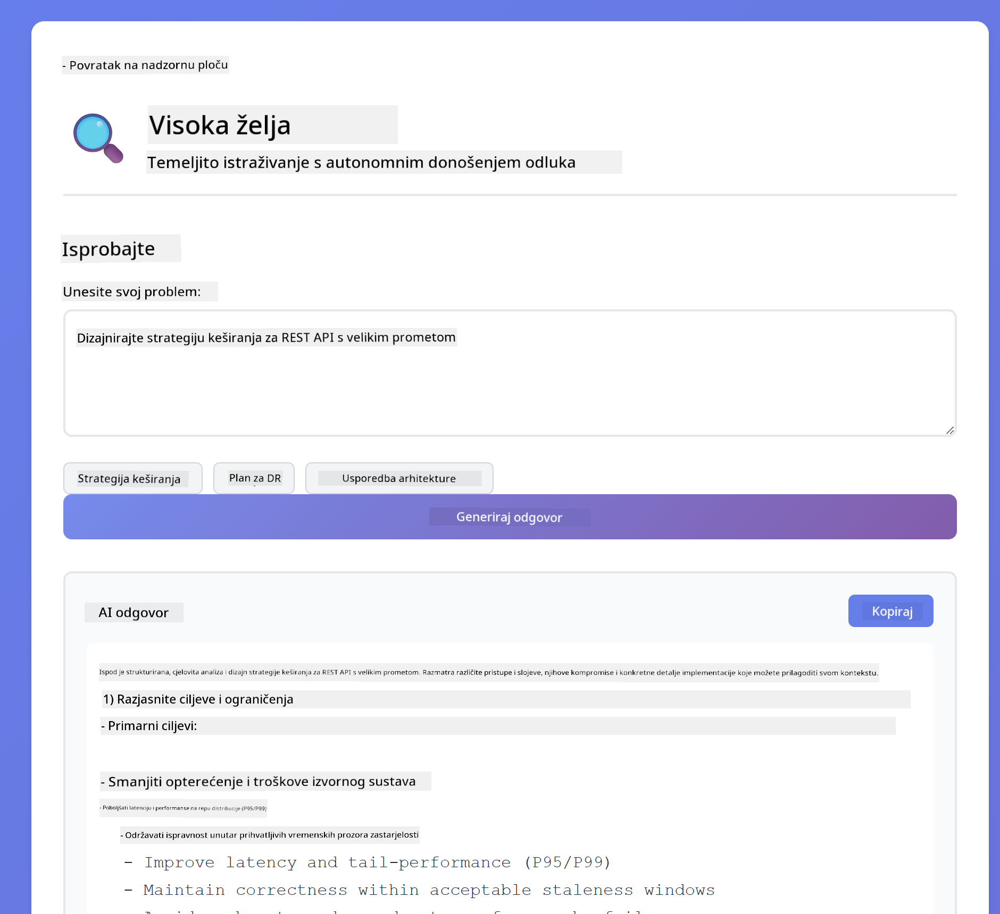
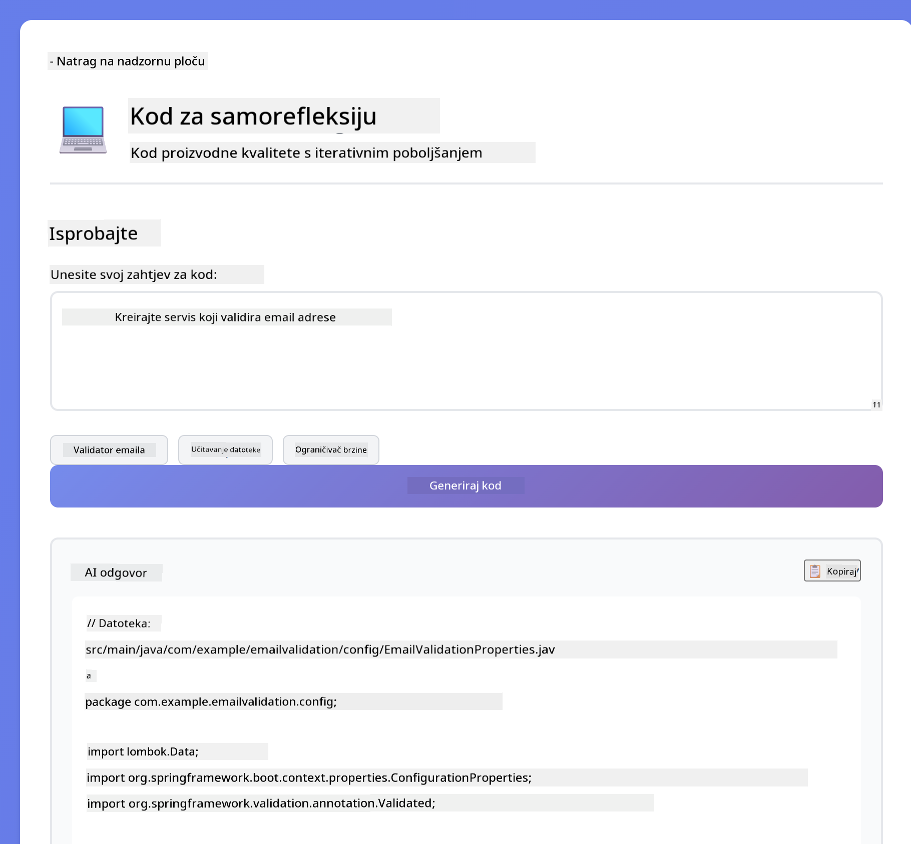
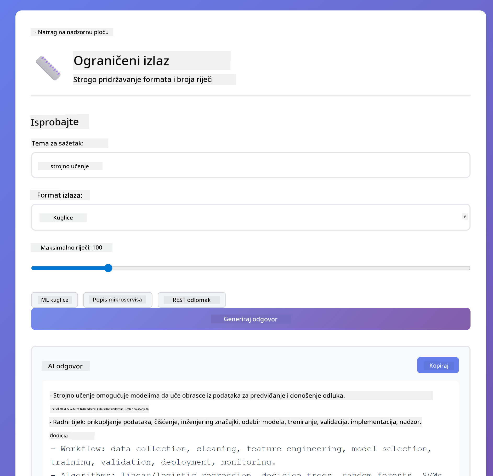

<!--
CO_OP_TRANSLATOR_METADATA:
{
  "original_hash": "8d787826cad7e92bf5cdbd116b1e6116",
  "translation_date": "2025-12-13T16:28:41+00:00",
  "source_file": "02-prompt-engineering/README.md",
  "language_code": "hr"
}
-->
# Modul 02: Inženjering upita s GPT-5

## Sadržaj

- [Što ćete naučiti](../../../02-prompt-engineering)
- [Preduvjeti](../../../02-prompt-engineering)
- [Razumijevanje inženjeringa upita](../../../02-prompt-engineering)
- [Kako se koristi LangChain4j](../../../02-prompt-engineering)
- [Osnovni obrasci](../../../02-prompt-engineering)
- [Korištenje postojećih Azure resursa](../../../02-prompt-engineering)
- [Snimke zaslona aplikacije](../../../02-prompt-engineering)
- [Istraživanje obrazaca](../../../02-prompt-engineering)
  - [Niska vs Visoka želja](../../../02-prompt-engineering)
  - [Izvršavanje zadataka (Uvodni tekstovi alata)](../../../02-prompt-engineering)
  - [Samoreflektirajući kod](../../../02-prompt-engineering)
  - [Strukturirana analiza](../../../02-prompt-engineering)
  - [Višekratni razgovor](../../../02-prompt-engineering)
  - [Razumijevanje korak po korak](../../../02-prompt-engineering)
  - [Ograničeni izlaz](../../../02-prompt-engineering)
- [Što zapravo učite](../../../02-prompt-engineering)
- [Sljedeći koraci](../../../02-prompt-engineering)

## Što ćete naučiti

U prethodnom modulu vidjeli ste kako memorija omogućuje konverzacijski AI i koristili GitHub modele za osnovne interakcije. Sada ćemo se usredotočiti na način na koji postavljate pitanja - same upite - koristeći Azure OpenAI GPT-5. Način na koji strukturirate svoje upite dramatično utječe na kvalitetu odgovora koje dobivate.

Koristit ćemo GPT-5 jer uvodi kontrolu rezoniranja - možete modelu reći koliko razmišljanja treba prije odgovora. To čini različite strategije upita jasnijima i pomaže vam razumjeti kada koristiti koji pristup. Također ćemo imati koristi od manjeg broja ograničenja brzine za GPT-5 u Azureu u usporedbi s GitHub modelima.

## Preduvjeti

- Završeni Modul 01 (Azure OpenAI resursi postavljeni)
- `.env` datoteka u korijenskom direktoriju s Azure vjerodajnicama (kreirana pomoću `azd up` u Modulu 01)

> **Napomena:** Ako niste završili Modul 01, prvo slijedite upute za postavljanje tamo.

## Razumijevanje inženjeringa upita

Inženjering upita odnosi se na dizajniranje ulaznog teksta koji dosljedno daje rezultate koje trebate. Nije samo o postavljanju pitanja - radi se o strukturiranju zahtjeva tako da model točno razumije što želite i kako to isporučiti.

Zamislite to kao davanje uputa kolegi. "Popravi grešku" je nejasno. "Popravi iznimku null pointer u UserService.java na liniji 45 dodavanjem provjere null vrijednosti" je specifično. Jezični modeli funkcioniraju na isti način - specifičnost i struktura su bitni.

## Kako se koristi LangChain4j

Ovaj modul demonstrira napredne obrasce upita koristeći istu LangChain4j osnovu iz prethodnih modula, s fokusom na strukturu upita i kontrolu rezoniranja.


*Kako LangChain4j povezuje vaše upite s Azure OpenAI GPT-5*

**Ovisnosti** - Modul 02 koristi sljedeće langchain4j ovisnosti definirane u `pom.xml`:
```xml
<dependency>
    <groupId>dev.langchain4j</groupId>
    <artifactId>langchain4j</artifactId> <!-- Inherited from BOM in root pom.xml -->
</dependency>
<dependency>
    <groupId>dev.langchain4j</groupId>
    <artifactId>langchain4j-open-ai-official</artifactId> <!-- Inherited from BOM in root pom.xml -->
</dependency>
```

**Konfiguracija OpenAiOfficialChatModel** - [LangChainConfig.java](../../../02-prompt-engineering/src/main/java/com/example/langchain4j/prompts/config/LangChainConfig.java)

Chat model je ručno konfiguriran kao Spring bean koristeći OpenAI Official klijent, koji podržava Azure OpenAI krajnje točke. Ključna razlika u odnosu na Modul 01 je kako strukturiramo upite poslani u `chatModel.chat()`, a ne sama konfiguracija modela.

**Sistemske i korisničke poruke** - [Gpt5PromptService.java](../../../02-prompt-engineering/src/main/java/com/example/langchain4j/prompts/service/Gpt5PromptService.java)

LangChain4j razdvaja vrste poruka radi jasnoće. `SystemMessage` postavlja ponašanje i kontekst AI-ja (kao "Vi ste recenzent koda"), dok `UserMessage` sadrži stvarni zahtjev. Ovo razdvajanje omogućuje održavanje dosljednog ponašanja AI-ja kroz različite korisničke upite.

```java
SystemMessage systemMsg = SystemMessage.from(
    "You are a helpful Java programming expert."
);

UserMessage userMsg = UserMessage.from(
    "Explain what a List is in Java"
);

String response = chatModel.chat(systemMsg, userMsg);
```


*SystemMessage pruža trajni kontekst dok UserMessages sadrže pojedinačne zahtjeve*

**MessageWindowChatMemory za višekratne razgovore** - Za obrazac višekratnog razgovora ponovno koristimo `MessageWindowChatMemory` iz Modula 01. Svaka sesija dobiva vlastitu instancu memorije pohranjenu u `Map<String, ChatMemory>`, što omogućuje više istovremenih razgovora bez miješanja konteksta.

**Predlošci upita** - Pravi fokus ovdje je inženjering upita, a ne nove LangChain4j API-je. Svaki obrazac (niska želja, visoka želja, izvršavanje zadataka itd.) koristi istu metodu `chatModel.chat(prompt)` ali s pažljivo strukturiranim nizovima upita. XML oznake, upute i formatiranje su svi dio teksta upita, a ne LangChain4j značajke.

**Kontrola rezoniranja** - Rezoniranje GPT-5 kontrolira se putem uputa u upitu poput "najviše 2 koraka rezoniranja" ili "istraži temeljito". To su tehnike inženjeringa upita, a ne LangChain4j konfiguracije. Biblioteka jednostavno dostavlja vaše upite modelu.

Ključna poruka: LangChain4j pruža infrastrukturu (povezivanje modela preko [LangChainConfig.java](../../../02-prompt-engineering/src/main/java/com/example/langchain4j/prompts/config/LangChainConfig.java), memoriju, rukovanje porukama preko [Gpt5PromptService.java](../../../02-prompt-engineering/src/main/java/com/example/langchain4j/prompts/service/Gpt5PromptService.java)), dok vas ovaj modul uči kako sastaviti učinkovite upite unutar te infrastrukture.

## Osnovni obrasci

Nisu svi problemi isti i ne zahtijevaju isti pristup. Neka pitanja trebaju brze odgovore, druga duboko razmišljanje. Neka trebaju vidljivo rezoniranje, a druga samo rezultate. Ovaj modul pokriva osam obrazaca upita - svaki optimiziran za različite scenarije. Isprobavat ćete sve kako biste naučili kada koji pristup najbolje funkcionira.


*Pregled osam obrazaca inženjeringa upita i njihovih primjena*


*Niska želja (brzo, direktno) vs Visoka želja (temeljito, istraživački) pristupi rezoniranju*

**Niska želja (Brzo i fokusirano)** - Za jednostavna pitanja gdje želite brze, direktne odgovore. Model radi minimalno rezoniranje - najviše 2 koraka. Koristite ovo za izračune, pretraživanja ili jednostavna pitanja.

```java
String prompt = """
    <reasoning_effort>low</reasoning_effort>
    <instruction>maximum 2 reasoning steps</instruction>
    
    What is 15% of 200?
    """;

String response = chatModel.chat(prompt);
```

> 💡 **Istražite s GitHub Copilot:** Otvorite [`Gpt5PromptService.java`](../../../02-prompt-engineering/src/main/java/com/example/langchain4j/prompts/service/Gpt5PromptService.java) i pitajte:
> - "Koja je razlika između obrazaca niske i visoke želje u upitima?"
> - "Kako XML oznake u upitima pomažu strukturirati AI odgovor?"
> - "Kada koristiti obrasce samorefleksije, a kada izravne upute?"

**Visoka želja (Duboko i temeljito)** - Za složene probleme gdje želite sveobuhvatnu analizu. Model temeljito istražuje i prikazuje detaljno rezoniranje. Koristite ovo za dizajn sustava, arhitektonske odluke ili složena istraživanja.

```java
String prompt = """
    <reasoning_effort>high</reasoning_effort>
    <instruction>explore thoroughly, show detailed reasoning</instruction>
    
    Design a caching strategy for a high-traffic REST API.
    """;

String response = chatModel.chat(prompt);
```

**Izvršavanje zadataka (Napredak korak po korak)** - Za višekorake radne tokove. Model daje plan unaprijed, opisuje svaki korak dok radi, zatim daje sažetak. Koristite ovo za migracije, implementacije ili bilo koji višekorak proces.

```java
String prompt = """
    <task>Create a REST endpoint for user registration</task>
    <preamble>Provide an upfront plan</preamble>
    <narration>Narrate each step as you work</narration>
    <summary>Summarize what was accomplished</summary>
    """;

String response = chatModel.chat(prompt);
```

Chain-of-Thought upiti eksplicitno traže od modela da pokaže svoj proces rezoniranja, poboljšavajući točnost za složene zadatke. Razlaganje korak po korak pomaže i ljudima i AI-ju razumjeti logiku.

> **🤖 Isprobajte s [GitHub Copilot](https://github.com/features/copilot) Chat:** Pitajte o ovom obrascu:
> - "Kako bih prilagodio obrazac izvršavanja zadataka za dugotrajne operacije?"
> - "Koje su najbolje prakse za strukturiranje uvodnih tekstova alata u produkcijskim aplikacijama?"
> - "Kako mogu uhvatiti i prikazati međukorake napretka u korisničkom sučelju?"


*Plan → Izvrši → Sažmi radni tok za višekorake zadatke*

**Samoreflektirajući kod** - Za generiranje koda proizvodne kvalitete. Model generira kod, provjerava ga prema kriterijima kvalitete i iterativno poboljšava. Koristite ovo pri izgradnji novih značajki ili servisa.

```java
String prompt = """
    <task>Create an email validation service</task>
    <quality_criteria>
    - Correct logic and error handling
    - Best practices (clean code, proper naming)
    - Performance optimization
    - Security considerations
    </quality_criteria>
    <instruction>Generate code, evaluate against criteria, improve iteratively</instruction>
    """;

String response = chatModel.chat(prompt);
```



*Iterativni ciklus poboljšanja - generiraj, evaluiraj, identificiraj probleme, poboljšaj, ponovi*

**Strukturirana analiza** - Za dosljednu evaluaciju. Model pregledava kod koristeći fiksni okvir (ispravnost, prakse, performanse, sigurnost). Koristite ovo za recenzije koda ili procjene kvalitete.

```java
String prompt = """
    <code>
    public List getUsers() {
        return database.query("SELECT * FROM users");
    }
    </code>
    
    <framework>
    Evaluate using these categories:
    1. Correctness - Logic and functionality
    2. Best Practices - Code quality
    3. Performance - Efficiency concerns
    4. Security - Vulnerabilities
    </framework>
    """;

String response = chatModel.chat(prompt);
```

> **🤖 Isprobajte s [GitHub Copilot](https://github.com/features/copilot) Chat:** Pitajte o strukturiranoj analizi:
> - "Kako mogu prilagoditi okvir analize za različite vrste recenzija koda?"
> - "Koji je najbolji način za parsiranje i programatsko djelovanje na strukturirani izlaz?"
> - "Kako osigurati dosljedne razine ozbiljnosti kroz različite sesije recenzije?"



*Okvir s četiri kategorije za dosljedne recenzije koda s razinama ozbiljnosti*

**Višekratni razgovor** - Za razgovore kojima treba kontekst. Model pamti prethodne poruke i nadograđuje ih. Koristite ovo za interaktivne sesije pomoći ili složena pitanja i odgovore.

```java
ChatMemory memory = MessageWindowChatMemory.withMaxMessages(10);

memory.add(UserMessage.from("What is Spring Boot?"));
AiMessage aiMessage1 = chatModel.chat(memory.messages()).aiMessage();
memory.add(aiMessage1);

memory.add(UserMessage.from("Show me an example"));
AiMessage aiMessage2 = chatModel.chat(memory.messages()).aiMessage();
memory.add(aiMessage2);
```



*Kako se kontekst razgovora akumulira kroz više okretaja dok ne dosegne limit tokena*

**Razumijevanje korak po korak** - Za probleme koji zahtijevaju vidljivu logiku. Model prikazuje eksplicitno rezoniranje za svaki korak. Koristite ovo za matematičke zadatke, logičke zagonetke ili kad trebate razumjeti proces razmišljanja.

```java
String prompt = """
    <instruction>Show your reasoning step-by-step</instruction>
    
    If a train travels 120 km in 2 hours, then stops for 30 minutes,
    then travels another 90 km in 1.5 hours, what is the average speed
    for the entire journey including the stop?
    """;

String response = chatModel.chat(prompt);
```



*Razlaganje problema u eksplicitne logičke korake*

**Ograničeni izlaz** - Za odgovore sa specifičnim zahtjevima formata. Model strogo slijedi pravila formata i duljine. Koristite ovo za sažetke ili kad trebate preciznu strukturu izlaza.

```java
String prompt = """
    <constraints>
    - Exactly 100 words
    - Bullet point format
    - Technical terms only
    </constraints>
    
    Summarize the key concepts of machine learning.
    """;

String response = chatModel.chat(prompt);
```



*Primjena specifičnih zahtjeva formata, duljine i strukture*

## Korištenje postojećih Azure resursa

**Provjerite postavljanje:**

Provjerite postoji li `.env` datoteka u korijenskom direktoriju s Azure vjerodajnicama (kreirana tijekom Modula 01):
```bash
cat ../.env  # Trebalo bi prikazati AZURE_OPENAI_ENDPOINT, API_KEY, DEPLOYMENT
```

**Pokrenite aplikaciju:**

> **Napomena:** Ako ste već pokrenuli sve aplikacije koristeći `./start-all.sh` iz Modula 01, ovaj modul već radi na portu 8083. Možete preskočiti naredbe za pokretanje u nastavku i izravno otići na http://localhost:8083.

**Opcija 1: Korištenje Spring Boot nadzorne ploče (preporučeno za korisnike VS Code-a)**

Dev container uključuje ekstenziju Spring Boot Dashboard, koja pruža vizualno sučelje za upravljanje svim Spring Boot aplikacijama. Možete je pronaći u Activity Baru na lijevoj strani VS Code-a (potražite ikonu Spring Boot).

Iz Spring Boot nadzorne ploče možete:
- Vidjeti sve dostupne Spring Boot aplikacije u radnom prostoru
- Pokrenuti/zaustaviti aplikacije jednim klikom
- Pregledavati logove aplikacije u stvarnom vremenu
- Pratiti status aplikacije

Jednostavno kliknite gumb za pokretanje pored "prompt-engineering" da pokrenete ovaj modul, ili pokrenite sve module odjednom.


**Opcija 2: Korištenje shell skripti**

Pokrenite sve web aplikacije (moduli 01-04):

**Bash:**
```bash
cd ..  # Iz korijenskog direktorija
./start-all.sh
```

**PowerShell:**
```powershell
cd ..  # Iz korijenskog direktorija
.\start-all.ps1
```

Ili pokrenite samo ovaj modul:

**Bash:**
```bash
cd 02-prompt-engineering
./start.sh
```

**PowerShell:**
```powershell
cd 02-prompt-engineering
.\start.ps1
```

Obje skripte automatski učitavaju varijable okoline iz `.env` datoteke u korijenu i izgradit će JAR-ove ako ne postoje.

> **Napomena:** Ako želite ručno izgraditi sve module prije pokretanja:
>
> **Bash:**
> ```bash
> cd ..  # Go to root directory
> mvn clean package -DskipTests
> ```
>
> **PowerShell:**
> ```powershell
> cd ..  # Go to root directory
> mvn clean package -DskipTests
> ```

Otvorite http://localhost:8083 u pregledniku.

**Za zaustavljanje:**

**Bash:**
```bash
./stop.sh  # Samo ovaj modul
# Ili
cd .. && ./stop-all.sh  # Svi moduli
```

**PowerShell:**
```powershell
.\stop.ps1  # Samo ovaj modul
# Ili
cd ..; .\stop-all.ps1  # Svi moduli
```

## Snimke zaslona aplikacije



*Glavna nadzorna ploča koja prikazuje svih 8 obrazaca inženjeringa upita s njihovim karakteristikama i primjenama*

## Istraživanje obrazaca

Web sučelje omogućuje vam eksperimentiranje s različitim strategijama upita. Svaki obrazac rješava različite probleme - isprobajte ih da vidite kada koji pristup najbolje funkcionira.

### Niska vs Visoka želja

Postavite jednostavno pitanje poput "Koliko je 15% od 200?" koristeći Nisku želju. Dobit ćete trenutni, direktan odgovor. Sada postavite nešto složeno poput "Dizajniraj strategiju keširanja za API s velikim prometom" koristeći Visoku želju. Promatrajte kako se model usporava i daje detaljno rezoniranje. Isti model, ista struktura pitanja - ali upit mu govori koliko razmišljanja treba.


*Brzi izračun s minimalnim razmišljanjem*



*Sveobuhvatna strategija keširanja (2.8MB)*

### Izvršavanje zadatka (Uvodni tekstovi alata)

Višestepeni radni tokovi imaju koristi od unaprijed planiranja i naracije napretka. Model iznosi što će učiniti, pripovijeda svaki korak, zatim sažima rezultate.


*Stvaranje REST endpointa s naracijom korak po korak (3.9MB)*

### Samoreflektirajući kod

Probajte "Stvori servis za validaciju e-pošte". Umjesto da samo generira kod i stane, model generira, evaluira prema kriterijima kvalitete, identificira slabosti i poboljšava. Vidjet ćete kako iterira dok kod ne zadovolji proizvodne standarde.



*Potpuni servis za validaciju e-pošte (5.2MB)*

### Strukturirana analiza

Pregledi koda trebaju dosljedne okvire za evaluaciju. Model analizira kod koristeći fiksne kategorije (ispravnost, prakse, performanse, sigurnost) s razinama ozbiljnosti.


*Pregled koda temeljen na okviru*

### Višekratni razgovor

Pitajte "Što je Spring Boot?" zatim odmah nastavite s "Pokaži mi primjer". Model pamti vaše prvo pitanje i daje vam specifičan primjer Spring Boota. Bez memorije, drugo pitanje bilo bi previše neodređeno.


*Očuvanje konteksta kroz pitanja*

### Razmišljanje korak po korak

Odaberite matematički zadatak i isprobajte ga s Razmišljanjem korak po korak i Niskom željom. Niska želja daje samo odgovor - brzo, ali nejasno. Korak po korak pokazuje svaki izračun i odluku.


*Matematički zadatak s eksplicitnim koracima*

### Ograničeni izlaz

Kad trebate specifične formate ili broj riječi, ovaj obrazac osigurava strogo pridržavanje. Probajte generirati sažetak s točno 100 riječi u obliku nabrajanja.



*Sažetak strojnog učenja s kontrolom formata*

## Što zapravo učite

**Uloženi napor u razmišljanje mijenja sve**

GPT-5 vam omogućuje kontrolu računalnog napora kroz vaše upite. Nizak napor znači brze odgovore s minimalnim istraživanjem. Visok napor znači da model uzima vrijeme za duboko razmišljanje. Učite uskladiti napor s kompleksnošću zadatka - nemojte gubiti vrijeme na jednostavna pitanja, ali ni žuriti s kompleksnim odlukama.

**Struktura vodi ponašanje**

Primjećujete XML oznake u upitima? One nisu dekorativne. Modeli pouzdanije slijede strukturirane upute nego slobodni tekst. Kad trebate višestepene procese ili složenu logiku, struktura pomaže modelu pratiti gdje je i što slijedi.


*Anatomija dobro strukturiranog upita s jasnim odjeljcima i XML-stil organizacijom*

**Kvaliteta kroz samo-evaluaciju**

Samoreflektirajući obrasci funkcioniraju tako da eksplicitno definiraju kriterije kvalitete. Umjesto da se nadate da model "radi ispravno", vi mu točno kažete što "ispravno" znači: ispravna logika, rukovanje pogreškama, performanse, sigurnost. Model tada može evaluirati vlastiti izlaz i poboljšati se. Time generiranje koda postaje proces, a ne lutrija.

**Kontekst je ograničen**

Višekratni razgovori funkcioniraju uključivanjem povijesti poruka u svaki zahtjev. Ali postoji ograničenje - svaki model ima maksimalan broj tokena. Kako razgovori rastu, trebat će vam strategije za održavanje relevantnog konteksta bez dosezanja tog limita. Ovaj modul pokazuje kako memorija funkcionira; kasnije ćete naučiti kada sažeti, kada zaboraviti i kada dohvatiti.

## Sljedeći koraci

**Sljedeći modul:** [03-rag - RAG (Retrieval-Augmented Generation)](../03-rag/README.md)

---

**Navigacija:** [← Prethodni: Modul 01 - Uvod](../01-introduction/README.md) | [Natrag na početak](../README.md) | [Sljedeći: Modul 03 - RAG →](../03-rag/README.md)

---

<!-- CO-OP TRANSLATOR DISCLAIMER START -->
**Odricanje od odgovornosti**:
Ovaj dokument preveden je pomoću AI usluge za prevođenje [Co-op Translator](https://github.com/Azure/co-op-translator). Iako nastojimo postići točnost, imajte na umu da automatski prijevodi mogu sadržavati pogreške ili netočnosti. Izvorni dokument na izvornom jeziku treba smatrati autoritativnim izvorom. Za kritične informacije preporučuje se profesionalni ljudski prijevod. Ne snosimo odgovornost za bilo kakva nesporazuma ili pogrešna tumačenja koja proizlaze iz korištenja ovog prijevoda.
<!-- CO-OP TRANSLATOR DISCLAIMER END -->