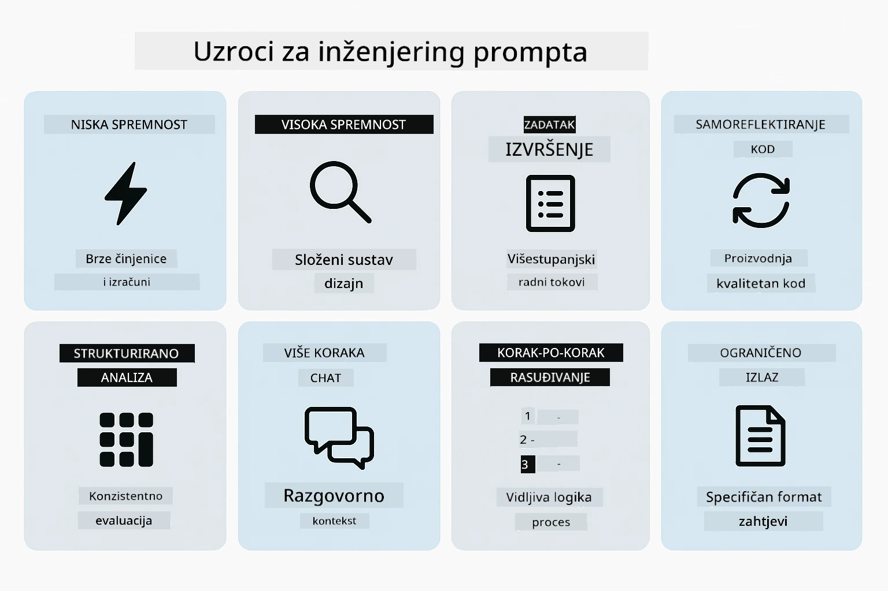
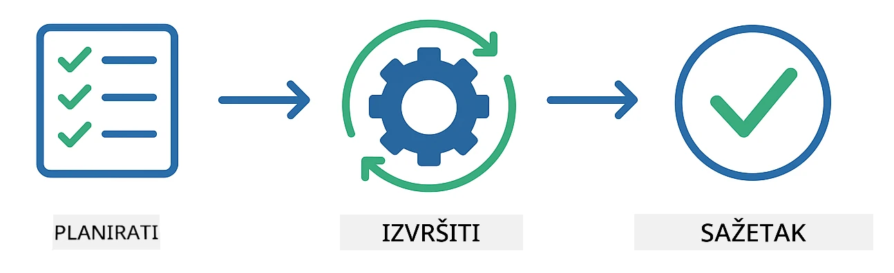
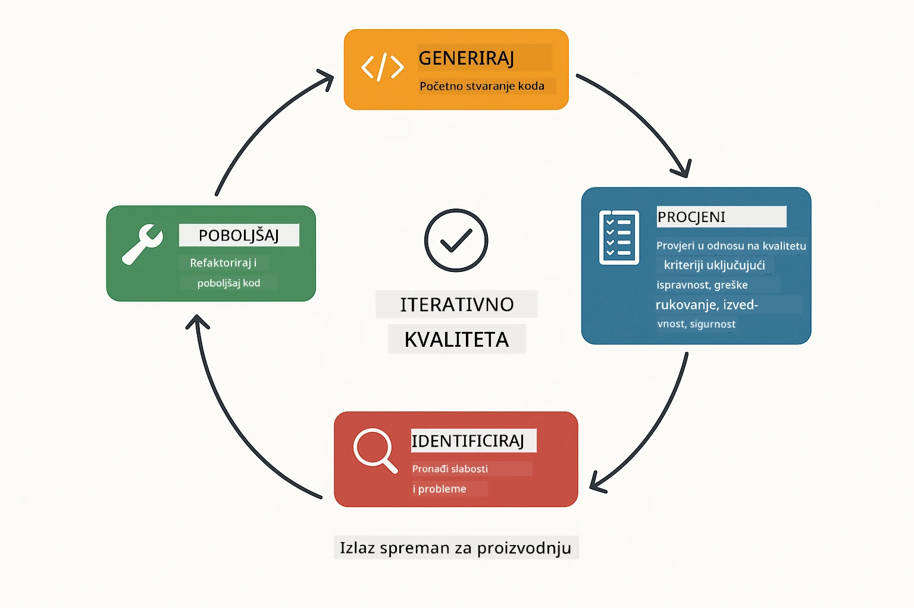
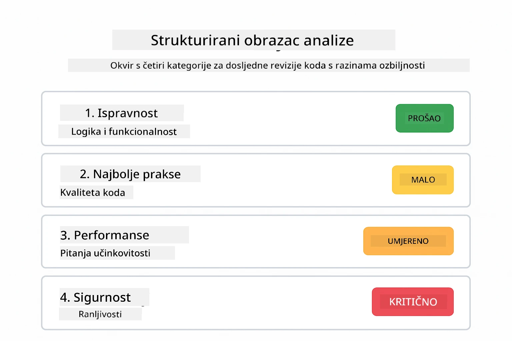
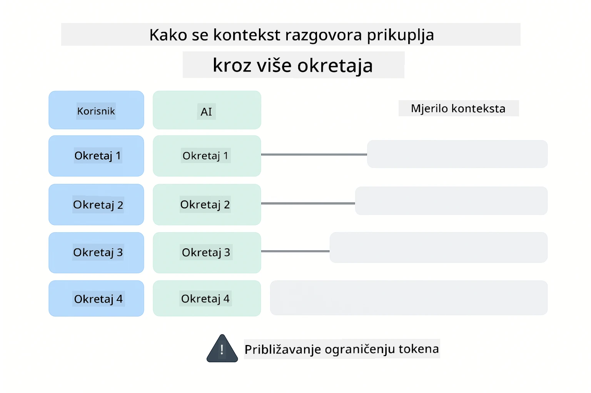
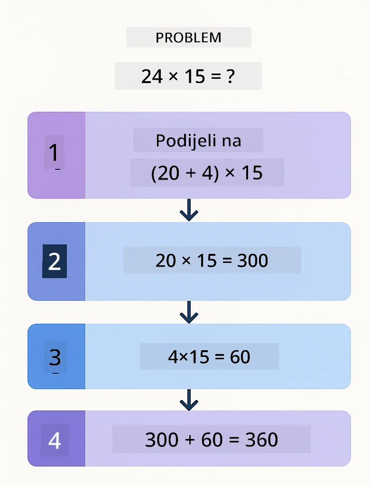
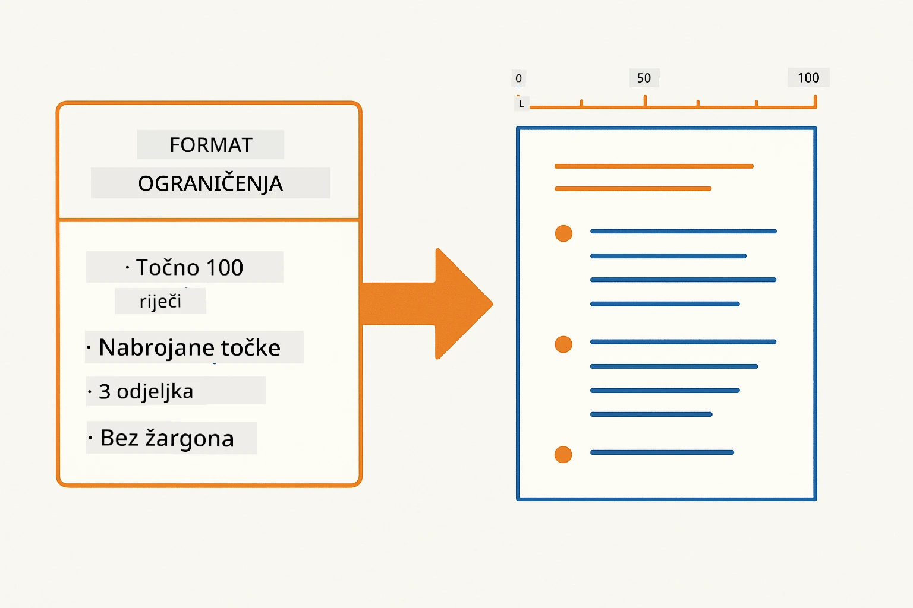
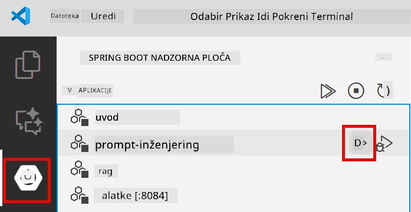
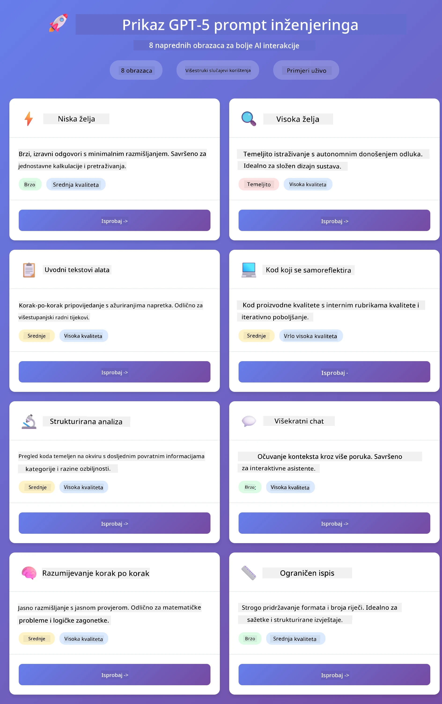
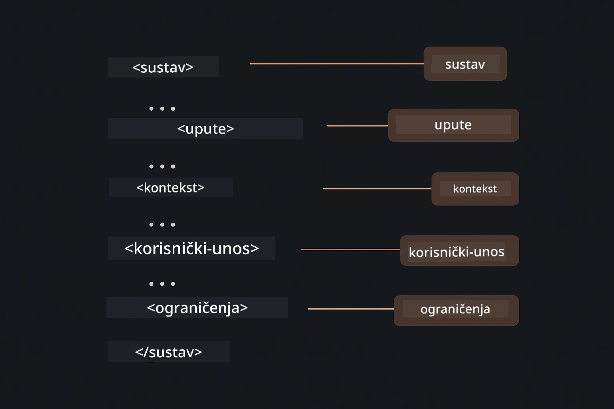

# Modul 02: Izrada upita s GPT-5.2

## Sadržaj

- [Video vodič](#video-vodič)
- [Što ćete naučiti](#što-ćete-naučiti)
- [Preduvjeti](#preduvjeti)
- [Razumijevanje izrade upita](#razumijevanje-izrade-upita)
- [Osnove izrade upita](#osnove-izrade-upita)
  - [Zero-Shot upiti](#zero-shot-upiti)
  - [Few-Shot upiti](#few-shot-upiti)
  - [Lanac razmišljanja](#lanac-razmišljanja)
  - [Upiti temeljeni na ulozi](#upiti-temeljeni-na-ulozi)
  - [Predlošci upita](#predlošci-upita)
- [Napredni obrasci](#napredni-obrasci)
- [Pokretanje aplikacije](#pokreni-aplikaciju)
- [Screenshotovi aplikacije](#snimke-zaslona-aplikacije)
- [Istraživanje obrazaca](#istraživanje-uzoraka)
  - [Niska vs visoka volja](#niska-vs-visoka-željnost-eagerness)
  - [Izvršenje zadatka (Predgovori alata)](#izvršenje-zadatka-unaprijed-definirani-alati)
  - [Kod s vlastitim razmišljanjem](#samoreflektirajući-kod)
  - [Strukturirana analiza](#strukturirana-analiza)
  - [Višekratni razgovor](#višekratni-razgovor)
  - [Razmišljanje korak po korak](#razmišljanje-korak-po-korak)
  - [Ograničeni ishod](#ograničeni-izlaz)
- [Što zaista učite](#što-zapravo-učite)
- [Sljedeći koraci](#sljedeći-koraci)

## Video vodič

Pogledajte ovu live sesiju koja objašnjava kako započeti s ovim modulom:

<a href="https://www.youtube.com/live/PJ6aBaE6bog?si=LDshyBrTRodP-wke"></a>

## Što ćete naučiti

Sljedeći dijagram prikazuje pregled ključnih tema i vještina koje ćete razviti u ovom modulu — od tehnika usavršavanja upita do korak-po-korak tijeka rada koji ćete slijediti.


U prethodnom modulu vidjeli ste kako memorija omogućuje konverzacijski AI s Azure OpenAI. Sada ćemo se usredotočiti na način na koji postavljate pitanja — same upite — koristeći Azure OpenAI GPT-5.2. Način na koji strukturirate svoje upite dramatično utječe na kvalitetu dobivenih odgovora. Počinjemo pregledom osnovnih tehnika izrade upita, a zatim prelazimo na osam naprednih obrazaca koji u potpunosti koriste mogućnosti GPT-5.2.

Koristit ćemo GPT-5.2 jer uvodi kontrolu razmišljanja – možete reći modelu koliko razmišljanja treba prije odgovora. To čini različite strategije upita jasnijima i pomaže vam razumjeti kada koristiti koji pristup.

## Preduvjeti

- Završeni Modul 01 (postavljeni Azure OpenAI resursi)
- `.env` datoteka u korijenskom direktoriju s Azure vjerodajnicama (kreirana naredbom `azd up` u Modulu 01)

> **Napomena:** Ako niste završili Modul 01, prvo slijedite upute za postavljanje iz tog modula.

## Razumijevanje izrade upita

Izrada upita u svojoj suštini razlikuje nejasne upute od preciznih, kao što donja usporedba ilustrira.


Izrada upita znači oblikovanje ulaznog teksta koji konzistentno donosi potrebne rezultate. Nije riječ samo o postavljanju pitanja — radi se o strukturiranju zahtjeva da model točno razumije što želite i kako to isporučiti.

Možete to usporediti s davanjem uputa kolegi. "Popravi grešku" je nejasno. "Popravi iznimku null pointer u UserService.java na liniji 45 dodavanjem provjere null vrijednosti" je specifično. Jezični modeli funkcioniraju isto — specifičnost i struktura su bitni.

Dijagram ispod prikazuje kako se LangChain4j uklapa u ovu sliku — povezujući vaše obrasce upita s modelom putem građevnih blokova SystemMessage i UserMessage.


LangChain4j pruža infrastrukturu — veze s modelom, memoriju i vrste poruka — dok su obrasci upita samo pažljivo strukturirani tekst koji šaljete kroz tu infrastrukturu. Ključni građevni blokovi su `SystemMessage` (koji postavlja ponašanje i ulogu AI-a) i `UserMessage` (koji prenosi vaš stvarni zahtjev).

## Osnove izrade upita

Pet osnovnih tehnika prikazanih u nastavku čine temelj učinkovite izrade upita. Svaka se bavi različitim aspektom kako komunicirate s jezičnim modelima.


Prije nego što zaronimo u napredne obrasce ovog modula, pregledajmo pet osnovnih tehnika izrade upita. To su gradivni blokovi koje svaki inženjer upita treba znati.

### Zero-Shot upiti

Najjednostavniji pristup: dajte modelu izravnu uputu bez primjera. Model se u potpunosti oslanja na svoje treniranje da razumije i izvrši zadatak. Ovo dobro funkcionira za jednostavne zahtjeve gdje je očekivano ponašanje očito.


*Izravna uputa bez primjera — model zaključuje zadatak samo na temelju upute*

```java
String prompt = "Classify this sentiment: 'I absolutely loved the movie!'";
String response = model.chat(prompt);
// Odgovor: "Pozitivno"
```

**Kada koristiti:** Jednostavne klasifikacije, izravna pitanja, prijevodi ili bilo koji zadatak koji model može obraditi bez dodatnih uputa.

### Few-Shot upiti

Dajte primjere koji demonstriraju obrazac kojeg želite da model slijedi. Model uči očekivani format ulaza i izlaza iz vaših primjera i primjenjuje ga na nove unose. Ovo dramatično poboljšava dosljednost za zadatke gdje željeni format ili ponašanje nije očito.


*Učenje iz primjera — model prepoznaje obrazac i primjenjuje ga na nove unose*

```java
String prompt = """
    Classify the sentiment as positive, negative, or neutral.
    
    Examples:
    Text: "This product exceeded my expectations!" → Positive
    Text: "It's okay, nothing special." → Neutral
    Text: "Waste of money, very disappointed." → Negative
    
    Now classify this:
    Text: "Best purchase I've made all year!"
    """;
String response = model.chat(prompt);
```

**Kada koristiti:** Prilagođene klasifikacije, dosljedno formatiranje, zadatke specifične za domen, ili kada su rezultati zero-shot upita nedosljedni.

### Lanac razmišljanja

Zatražite od modela da pokaže svoje razmišljanje korak po korak. Umjesto da skoči izravno na odgovor, model razlaže problem i prolazi kroz svaki dio u detalje. Ovo poboljšava točnost kod zadataka matematike, logike i višestupanjskog rezoniranja.


*Razmišljanje korak po korak — razbijanje složenih problema u jasne logičke korake*

```java
String prompt = """
    Problem: A store has 15 apples. They sell 8 apples and then 
    receive a shipment of 12 more apples. How many apples do they have now?
    
    Let's solve this step-by-step:
    """;
String response = model.chat(prompt);
// Model pokazuje: 15 - 8 = 7, zatim 7 + 12 = 19 jabuka
```

**Kada koristiti:** Matematiku, logičke zagonetke, otklanjanje pogrešaka ili bilo koji zadatak gdje prikaz procesa razmišljanja poboljšava točnost i povjerenje.

### Upiti temeljeni na ulozi

Postavite AI-u personu ili ulogu prije nego postavite pitanje. To osigurava kontekst koji oblikuje ton, dubinu i fokus odgovora. "Softverski arhitekt" daje drugačije savjete od "mlađeg programera" ili "sigurnosnog revizora".


*Postavljanje konteksta i persone — isto pitanje dobiva različite odgovore ovisno o dodijeljenoj ulozi*

```java
String prompt = """
    You are an experienced software architect reviewing code.
    Provide a brief code review for this function:
    
    def calculate_total(items):
        total = 0
        for item in items:
            total = total + item['price']
        return total
    """;
String response = model.chat(prompt);
```

**Kada koristiti:** Pregled koda, podučavanje, domen-specifične analize ili kada trebate odgovore prilagođene određenoj razini stručnosti ili perspektivi.

### Predlošci upita

Kreirajte ponovno upotrebljive upite s varijabilnim mjestima za unos. Umjesto da svaki put pišete novi upit, definirajte predložak jednom i unutar njega ispunite različite vrijednosti. LangChain4j klasa `PromptTemplate` to olakšava s `{{variable}}` sintaksom.


*Ponovno upotrebljivi upiti s varijabilnim mjestima — jedan predložak, mnogo upotreba*

```java
PromptTemplate template = PromptTemplate.from(
    "What's the best time to visit {{destination}} for {{activity}}?"
);

Prompt prompt = template.apply(Map.of(
    "destination", "Paris",
    "activity", "sightseeing"
));

String response = model.chat(prompt.text());
```

**Kada koristiti:** Ponavljani upiti s različitim unosima, obrada u grupi, izgradnja ponovno upotrebljivih AI tijekova rada ili bilo koji scenarij gdje struktura upita ostaje ista, ali se podaci mijenjaju.

---

Ovih pet osnovnih tehnika pružaju vam solidan alat za većinu zadataka izrade upita. Ostatak ovog modula nadograđuje na njih sa **osam naprednih obrazaca** koji koriste kontrolu razmišljanja GPT-5.2, samoprocjenu i mogućnosti strukturiranog izlaza.

## Napredni obrasci

Nakon što smo pokrili osnove, prelazimo na osam naprednih obrazaca koji ovaj modul čine jedinstvenim. Nisu svi problemi isti. Neka pitanja zahtijevaju brze odgovore, druga duboko razmišljanje. Neki zahtijevaju vidljivo razmišljanje, drugi samo rezultate. Svaki od niže navedenih obrazaca optimiziran je za drugačiji scenarij — a kontrola razmišljanja GPT-5.2 te razlike čini još izraženijima.



*Pregled osam obrazaca izrade upita i njihovih slučajeva upotrebe*

GPT-5.2 dodaje novu dimenziju ovim obrascima: *kontrolu razmišljanja*. Kliznik ispod pokazuje kako možete prilagoditi trud razmišljanja modela — od brzih, izravnih odgovora do duboke, temeljite analize.


*Kontrola razmišljanja GPT-5.2 omogućuje preciziranje koliko razmišljanja model treba izvesti — od brzih izravnih odgovora do dubokog istraživanja*

**Niska volja (Brzo i fokusirano)** - Za jednostavna pitanja gdje želite brze, izravne odgovore. Model radi minimalno razmišljanja – najviše 2 koraka. Koristite ovo za izračune, pretraživanja ili jednostavna pitanja.

```java
String prompt = """
    <context_gathering>
    - Search depth: very low
    - Bias strongly towards providing a correct answer as quickly as possible
    - Usually, this means an absolute maximum of 2 reasoning steps
    - If you think you need more time, state what you know and what's uncertain
    </context_gathering>
    
    Problem: What is 15% of 200?
    
    Provide your answer:
    """;

String response = chatModel.chat(prompt);
```

> 💡 **Istražite s GitHub Copilot:** Otvorite [`Gpt5PromptService.java`](../../../02-prompt-engineering/src/main/java/com/example/langchain4j/prompts/service/Gpt5PromptService.java) i postavite pitanja:
> - "Koja je razlika između obrazaca niske i visoke volje u upitima?"
> - "Kako XML oznake u upitima pomažu u strukturiranju AI odgovora?"
> - "Kada koristiti obrasce sa samoprocjenom umjesto izravnih uputa?"

**Visoka volja (Duboko i temeljito)** - Za složene probleme gdje želite detaljnu analizu. Model dubinski istražuje i pokazuje detaljno razmišljanje. Koristite za dizajn sustava, arhitektonske odluke ili složena istraživanja.

```java
String prompt = """
    Analyze this problem thoroughly and provide a comprehensive solution.
    Consider multiple approaches, trade-offs, and important details.
    Show your analysis and reasoning in your response.
    
    Problem: Design a caching strategy for a high-traffic REST API.
    """;

String response = chatModel.chat(prompt);
```

**Izvršenje zadatka (Napredak korak po korak)** - Za višestepene tijekove rada. Model daje unaprijed plan, opisuje svaki korak dok radi i na kraju daje sažetak. Koristite za migracije, implementacije ili bilo koji višestepeni proces.

```java
String prompt = """
    <task_execution>
    1. First, briefly restate the user's goal in a friendly way
    
    2. Create a step-by-step plan:
       - List all steps needed
       - Identify potential challenges
       - Outline success criteria
    
    3. Execute each step:
       - Narrate what you're doing
       - Show progress clearly
       - Handle any issues that arise
    
    4. Summarize:
       - What was completed
       - Any important notes
       - Next steps if applicable
    </task_execution>
    
    <tool_preambles>
    - Always begin by rephrasing the user's goal clearly
    - Outline your plan before executing
    - Narrate each step as you go
    - Finish with a distinct summary
    </tool_preambles>
    
    Task: Create a REST endpoint for user registration
    
    Begin execution:
    """;

String response = chatModel.chat(prompt);
```

Lanac razmišljanja (Chain-of-Thought) eksplicitno traži model da pokaže proces razmišljanja, poboljšavajući točnost za složene zadatke. Razlaganje korak po korak pomaže i ljudima i AI-u razumjeti logiku.

> **🤖 Isprobajte s [GitHub Copilot](https://github.com/features/copilot) Chat:** Pitajte o ovom obrascu:
> - "Kako bih prilagodio obrazac izvršenja zadatka za dugotrajne operacije?"
> - "Koje su najbolje prakse za strukturiranje predgovora alata u produkcijskim aplikacijama?"
> - "Kako mogu uhvatiti i prikazati međurezultate napretka u korisničkom sučelju?"

Dijagram ispod ilustrira ovaj tijek rada Plan → Izvrši → Sažmi.



*Tijek rada Plan → Izvrši → Sažmi za višestepene zadatke*

**Kod s vlastitim razmišljanjem** - Za generiranje koda koji zadovoljava produkcijske standarde. Model generira kod slijedeći produkcijske standarde s odgovarajućim upravljanjem greškama. Koristite kada razvijate nove značajke ili usluge.

```java
String prompt = """
    Generate Java code with production-quality standards: Create an email validation service
    Keep it simple and include basic error handling.
    """;

String response = chatModel.chat(prompt);
```

Dijagram ispod prikazuje ovu iterativnu petlju poboljšanja — generiraj, procijeni, identificiraj slabosti i usavrši dok kod ne zadovolji standarde.



*Iterativna petlja poboljšanja - generiraj, procijeni, identificiraj probleme, poboljšaj, ponavljaj*

**Strukturirana analiza** - Za konzistentnu evaluaciju. Model pregledava kod koristeći fiksni okvir (ispravnost, prakse, performanse, sigurnost, održivost). Koristite za preglede koda ili procjene kvalitete.

```java
String prompt = """
    <analysis_framework>
    You are an expert code reviewer. Analyze the code for:
    
    1. Correctness
       - Does it work as intended?
       - Are there logical errors?
    
    2. Best Practices
       - Follows language conventions?
       - Appropriate design patterns?
    
    3. Performance
       - Any inefficiencies?
       - Scalability concerns?
    
    4. Security
       - Potential vulnerabilities?
       - Input validation?
    
    5. Maintainability
       - Code clarity?
       - Documentation?
    
    <output_format>
    Provide your analysis in this structure:
    - Summary: One-sentence overall assessment
    - Strengths: 2-3 positive points
    - Issues: List any problems found with severity (High/Medium/Low)
    - Recommendations: Specific improvements
    </output_format>
    </analysis_framework>
    
    Code to analyze:
    ```
    public List getUsers() {
        return database.query("SELECT * FROM users");
    }
    ```
    Provide your structured analysis:
    """;

String response = chatModel.chat(prompt);
```

> **🤖 Isprobajte s [GitHub Copilot](https://github.com/features/copilot) Chat:** Pitajte o strukturiranoj analizi:
> - "Kako mogu prilagoditi okvir analize za različite vrste pregleda koda?"
> - "Koji je najbolji način za parsiranje i programatsko postupanje sa strukturiranim izlazom?"
> - "Kako osigurati dosljedne nivoe ozbiljnosti kroz različite sesije pregleda?"

Sljedeći dijagram prikazuje kako ovaj strukturirani okvir organizira pregled koda u dosljedne kategorije s nivoima ozbiljnosti.



*Okvir za dosljedne preglede koda s nivoima ozbiljnosti*

**Višekratni razgovor** - Za rasprave kojima treba kontekst. Model pamti prethodne poruke i gradi na njima. Koristite za interaktivne sesije pomoći ili složena pitanja i odgovore.

```java
ChatMemory memory = MessageWindowChatMemory.withMaxMessages(10);

memory.add(UserMessage.from("What is Spring Boot?"));
AiMessage aiMessage1 = chatModel.chat(memory.messages()).aiMessage();
memory.add(aiMessage1);

memory.add(UserMessage.from("Show me an example"));
AiMessage aiMessage2 = chatModel.chat(memory.messages()).aiMessage();
memory.add(aiMessage2);
```

Dijagram ispod vizualizira kako se kontekst razgovora akumulira s svakim krugom i kako se odnosi prema ograničenju tokena modela.



*Kako se kontekst razgovora skuplja tijekom više krugova dok ne dostigne limit tokena*

**Razmišljanje korak po korak** - Za probleme koji zahtijevaju vidljivu logiku. Model prikazuje eksplicitno razmišljanje za svaki korak. Koristite za matematičke probleme, logičke zagonetke ili kad trebate razumjeti proces razmišljanja.

```java
String prompt = """
    <instruction>Show your reasoning step-by-step</instruction>
    
    If a train travels 120 km in 2 hours, then stops for 30 minutes,
    then travels another 90 km in 1.5 hours, what is the average speed
    for the entire journey including the stop?
    """;

String response = chatModel.chat(prompt);
```

Dijagram ispod ilustrira kako model razbija probleme u eksplicitne, numerirane logičke korake.


*Razlaganje problema u eksplicitne logičke korake*

**Ograničeni izlaz** - Za odgovore sa zahtjevima za specifični format. Model strogo prati pravila formata i duljine. Koristite ovo za sažetke ili kad vam treba precizna struktura izlaza.

```java
String prompt = """
    <constraints>
    - Exactly 100 words
    - Bullet point format
    - Technical terms only
    </constraints>
    
    Summarize the key concepts of machine learning.
    """;

String response = chatModel.chat(prompt);
```

Sljedeća dijagrama pokazuje kako ograničenja usmjeravaju model da proizvede izlaz koji strogo poštuje vaše zahtjeve za formatom i duljinom.



*Nametanje specifičnih zahtjeva za format, duljinu i strukturu*

## Pokreni aplikaciju

**Provjeri implementaciju:**

Provjeri da datoteka `.env` postoji u korijenskom direktoriju s Azure vjerodajnicama (stvorena tijekom Modula 01). Pokreni ovo iz direktorija modula (`02-prompt-engineering/`):

**Bash:**
```bash
cat ../.env  # Trebalo bi prikazati AZURE_OPENAI_ENDPOINT, API_KEY, DEPLOYMENT
```

**PowerShell:**
```powershell
Get-Content ..\.env  # Trebalo bi prikazati AZURE_OPENAI_ENDPOINT, API_KEY, DEPLOYMENT
```

**Pokreni aplikaciju:**

> **Napomena:** Ako ste već pokrenuli sve aplikacije koristeći `./start-all.sh` iz korijenskog direktorija (kako je opisano u Modulu 01), ovaj modul već radi na portu 8083. Možete preskočiti naredbe za pokretanje ispod i otići direktno na http://localhost:8083.

**Opcija 1: Korištenje Spring Boot nadzorne ploče (Preporučeno za VS Code korisnike)**

Dev container uključuje ekstenziju Spring Boot Dashboard, koja pruža vizualno sučelje za upravljanje svim Spring Boot aplikacijama. Možete je pronaći na traci aktivnosti na lijevoj strani VS Codea (potražite ikonu Spring Boot).

Iz Spring Boot nadzorne ploče možete:
- Vidjeti sve dostupne Spring Boot aplikacije u radnom prostoru
- Pokretati/zaustavljati aplikacije jednim klikom
- Pratiti dnevnike aplikacija u stvarnom vremenu
- Nadzirati status aplikacija

Jednostavno kliknite gumb za pokretanje pokraj "prompt-engineering" da biste pokrenuli ovaj modul ili pokrenite sve module odjednom.



*Spring Boot nadzorna ploča u VS Code — pokrenite, zaustavite i nadzirite sve module s jednog mjesta*

**Opcija 2: Korištenje shell skripti**

Pokreni sve web aplikacije (moduli 01-04):

**Bash:**
```bash
cd ..  # Iz korijenskog direktorija
./start-all.sh
```

**PowerShell:**
```powershell
cd ..  # Iz korijenskog direktorija
.\start-all.ps1
```

Ili pokreni samo ovaj modul:

**Bash:**
```bash
cd 02-prompt-engineering
./start.sh
```

**PowerShell:**
```powershell
cd 02-prompt-engineering
.\start.ps1
```

Obje skripte automatski učitavaju varijable okoline iz korijenske `.env` datoteke i izgradit će JAR datoteke ako ne postoje.

> **Napomena:** Ako želite ručno izgraditi sve module prije pokretanja:
>
> **Bash:**
> ```bash
> cd ..  # Go to root directory
> mvn clean package -DskipTests
> ```
>
> **PowerShell:**
> ```powershell
> cd ..  # Go to root directory
> mvn clean package -DskipTests
> ```

Otvori http://localhost:8083 u svom pregledniku.

**Zaustavljanje:**

**Bash:**
```bash
./stop.sh  # Samo ovaj modul
# Ili
cd .. && ./stop-all.sh  # Svi moduli
```

**PowerShell:**
```powershell
.\stop.ps1  # Samo ovaj modul
# Ili
cd ..; .\stop-all.ps1  # Svi moduli
```

## Snimke zaslona aplikacije

Ovo je glavno sučelje modula za prompt engineering, gdje možete eksperimentirati sa svih osam uzoraka jedan pored drugog.



*Glavna nadzorna ploča prikazuje svih 8 uzoraka prompt engineeringa s njihovim karakteristikama i slučajevima upotrebe*

## Istraživanje uzoraka

Web sučelje omogućava eksperimentiranje s različitim strategijama promptanja. Svaki uzorak rješava različite probleme – isprobajte ih da vidite kad koji pristup najbolje funkcionira.

> **Napomena: Streaming vs Nesreaming** — Svaka stranica uzorka nudi dva gumba: **🔴 Stream Response (uživo)** i opciju **Nesreaming**. Streaming koristi Server-Sent Events (SSE) za prikaz tokena u stvarnom vremenu dok model generira, tako da odmah vidite tijek. Nesreaming opcija čeka cijeli odgovor prije prikaza. Za upite koji zahtijevaju duboko razmišljanje (npr. High Eagerness, Self-Reflecting Code), nesreaming poziv može trajati dugo — ponekad minute — bez vidljivog povratnog signala. **Koristite streaming pri eksperimentiranju s kompleksnim upitima** kako biste vidjeli kako model radi i izbjegli dojam da je zahtjev istekao.
>
> **Napomena: Zahtjevi preglednika** — Streaming značajka koristi Fetch Streams API (`response.body.getReader()`) koji zahtijeva punu podršku preglednika (Chrome, Edge, Firefox, Safari). NE radi u VS Code ugrađenom Simple Browseru jer njegov webview ne podržava ReadableStream API. Ako koristite Simple Browser, nesreaming gumbi će raditi normalno — zahvaćeni su samo streaming gumbi. Otvorite `http://localhost:8083` u vanjskom pregledniku za punu funkcionalnost.

### Niska vs visoka željnost (Eagerness)

Postavite jednostavno pitanje poput "Koliko je 15% od 200?" koristeći Nisku željnost. Dobit ćete trenutni, direktan odgovor. Sada postavite nešto složenije poput "Dizajniraj strategiju keširanja za API s velikim prometom" koristeći Visoku željnost. Kliknite **🔴 Stream Response (uživo)** i gledajte kako se pojavljiva detaljna analiza modela token po token. Isti model, ista struktura pitanja – ali prompt određuje koliko razmišljanja treba biti.

### Izvršenje zadatka (Unaprijed definirani alati)

Višestepeni tijek rada ima koristi od prethodnog planiranja i praćenja napretka. Model navodi što će raditi, objašnjava svaki korak, zatim sažima rezultate.

### Samoreflektirajući kod

Isprobajte "Napravite servis za validaciju e-pošte". Umjesto da samo generira kod i stane, model generira, evaluira prema kriterijima kvalitete, identificira slabosti i poboljšava. Vidjet ćete kako ponavlja dok kod ne zadovolji proizvodne standarde.

### Strukturirana analiza

Pregledi koda zahtijevaju dosljedne okvire evaluacije. Model analizira kod koristeći fiksne kategorije (ispravnost, praksa, izvedba, sigurnost) s razinama ozbiljnosti.

### Višekratni razgovor

Pitajte "Što je Spring Boot?" zatim odmah postavite "Pokaži mi primjer". Model pamti prvo pitanje i daje primjer specifičan za Spring Boot. Bez memorije, drugo pitanje bi bilo previše neodređeno.

### Razmišljanje korak-po-korak

Odaberite matematički problem i isprobajte ga s Razmišljanjem korak-po-korak i Niskom željnošću. Niska željnost samo daje odgovor – brzo ali nejasno. Razmišljanje korak-po-korak pokazuje svaki izračun i odluku.

### Ograničeni izlaz

Kad vam treba specifičan format ili točan broj riječi, ovaj uzorak nameće strogo pridržavanje. Pokušajte generirati sažetak s točno 100 riječi u obliku popisa.

## Što zapravo učite

**Napori u razmišljanju mijenjaju sve**

GPT-5.2 vam omogućuje kontrolu računalnog napora kroz vaše upite. Nizak napor znači brze odgovore s minimalnim istraživanjem. Visok napor znači da model uzima vrijeme za duboko razmišljanje. Učite uskladiti napor s kompleksnošću zadatka – ne trošite vrijeme na jednostavna pitanja, ali nemojte ni požurivati složene odluke.

**Struktura usmjerava ponašanje**

Primijetite XML oznake u promptima? Nisu samo ukras. Modeli pouzdanije slijede strukturirane upute nego slobodan tekst. Kad trebate višestepene procese ili složenu logiku, struktura pomaže modelu pratiti gdje je i što slijedi. Dijagram u nastavku razlaže dobro strukturirani prompt, pokazujući kako oznake poput `<system>`, `<instructions>`, `<context>`, `<user-input>` i `<constraints>` organiziraju vaše upute u jasne sekcije.



*Anatomija dobro strukturiranog prompta s jasnim sekcijama i organizacijom u XML stilu*

**Kvaliteta kroz samo-evaluaciju**

Samoreflektirajući uzorci rade tako da eksplicitno definiraju kriterije kvalitete. Umjesto da se nadaju da će model "ispravno napraviti", kažete mu točno što "ispravno" znači: ispravna logika, rukovanje greškama, izvedba, sigurnost. Model tada može vrednovati vlastiti izlaz i poboljšati ga. Time se generiranje koda pretvara iz lutrije u proces.

**Kontekst je ograničen**

Višekratni razgovori rade tako da uključuju povijest poruka u svaki zahtjev. No postoji granica – svaki model ima maksimalni broj tokena. Kako razgovori rastu, trebate strategije za održavanje relevantnog konteksta bez prekoračenja limita. Ovaj modul pokazuje kako radi memorija; kasnije ćete naučiti kad sažimati, kad zaboraviti i kad dohvatiti.

## Sljedeći koraci

**Sljedeći modul:** [03-rag - RAG (generiranje potpomognuto dohvaćanjem)](../03-rag/README.md)

---

**Navigacija:** [← Prethodno: Modul 01 - Uvod](../01-introduction/README.md) | [Natrag na početak](../README.md) | [Sljedeće: Modul 03 - RAG →](../03-rag/README.md)

---

<!-- CO-OP TRANSLATOR DISCLAIMER START -->
**Napomena**:
Ovaj dokument je preveden korištenjem AI prevoditeljskog servisa [Co-op Translator](https://github.com/Azure/co-op-translator). Iako težimo točnosti, imajte na umu da automatski prijevodi mogu sadržavati greške ili netočnosti. Izvorni dokument na izvornom jeziku treba smatrati autoritativnim izvorom. Za važne informacije preporuča se profesionalni ljudski prijevod. Nismo odgovorni za bilo kakva nesporazumevanja ili pogrešne interpretacije koje proizlaze iz korištenja ovog prijevoda.
<!-- CO-OP TRANSLATOR DISCLAIMER END -->