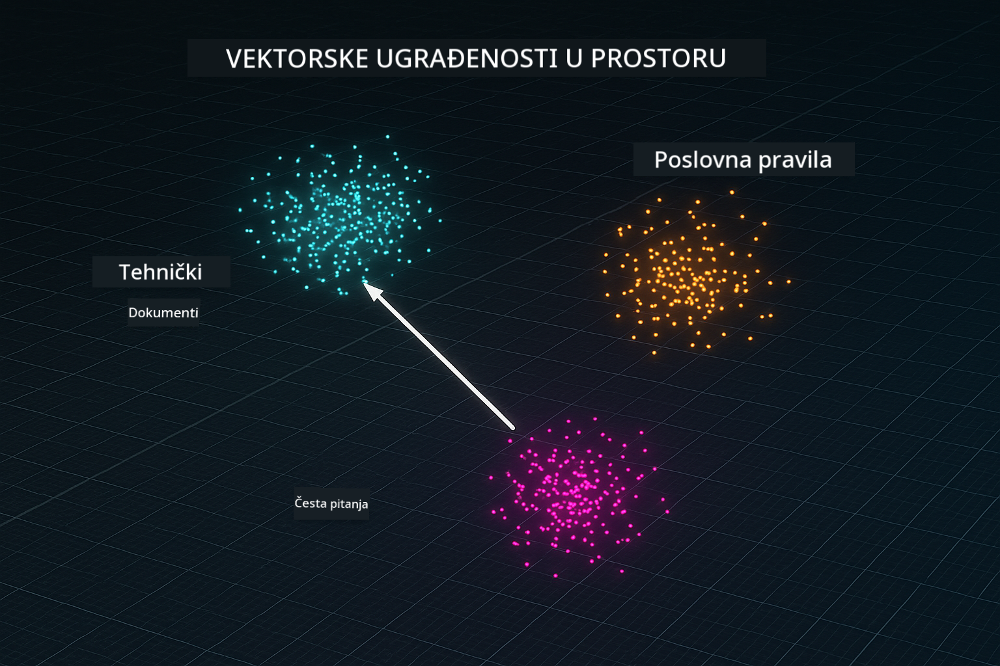

<!--
CO_OP_TRANSLATOR_METADATA:
{
  "original_hash": "f538a51cfd13147d40d84e936a0f485c",
  "translation_date": "2025-12-13T17:20:25+00:00",
  "source_file": "03-rag/README.md",
  "language_code": "hr"
}
-->
# Modul 03: RAG (Retrieval-Augmented Generation)

## Sadržaj

- [Što ćete naučiti](../../../03-rag)
- [Preduvjeti](../../../03-rag)
- [Razumijevanje RAG-a](../../../03-rag)
- [Kako radi](../../../03-rag)
  - [Obrada dokumenata](../../../03-rag)
  - [Izrada ugradnji](../../../03-rag)
  - [Semantičko pretraživanje](../../../03-rag)
  - [Generiranje odgovora](../../../03-rag)
- [Pokrenite aplikaciju](../../../03-rag)
- [Korištenje aplikacije](../../../03-rag)
  - [Učitajte dokument](../../../03-rag)
  - [Postavljajte pitanja](../../../03-rag)
  - [Provjerite izvore](../../../03-rag)
  - [Eksperimentirajte s pitanjima](../../../03-rag)
- [Ključni pojmovi](../../../03-rag)
  - [Strategija dijeljenja na dijelove](../../../03-rag)
  - [Ocjene sličnosti](../../../03-rag)
  - [Pohrana u memoriji](../../../03-rag)
  - [Upravljanje kontekstnim prozorom](../../../03-rag)
- [Kada je RAG važan](../../../03-rag)
- [Sljedeći koraci](../../../03-rag)

## Što ćete naučiti

U prethodnim modulima naučili ste kako voditi razgovore s AI-jem i učinkovito strukturirati svoje upite. No postoji temeljno ograničenje: jezični modeli znaju samo ono što su naučili tijekom treninga. Ne mogu odgovoriti na pitanja o pravilima vaše tvrtke, dokumentaciji vašeg projekta ili bilo kojim informacijama na kojima nisu trenirani.

RAG (Retrieval-Augmented Generation) rješava ovaj problem. Umjesto da pokušavate modelu podučiti vaše informacije (što je skupo i nepraktično), dajete mu mogućnost pretraživanja vaših dokumenata. Kad netko postavi pitanje, sustav pronalazi relevantne informacije i uključuje ih u upit. Model zatim odgovara na temelju tog dohvaćenog konteksta.

Zamislite RAG kao da modelu dajete referentnu knjižnicu. Kad postavite pitanje, sustav:

1. **Korisnički upit** - Postavite pitanje  
2. **Ugradnja** - Pretvara vaše pitanje u vektor  
3. **Vektorsko pretraživanje** - Pronalazi slične dijelove dokumenata  
4. **Sastavljanje konteksta** - Dodaje relevantne dijelove u upit  
5. **Odgovor** - LLM generira odgovor na temelju konteksta  

Ovo utemeljuje odgovore modela u vašim stvarnim podacima umjesto da se oslanja na znanje iz treninga ili izmišlja odgovore.


*RAG tijek rada - od korisničkog upita do semantičkog pretraživanja do generiranja odgovora u kontekstu*

## Preduvjeti

- Završeni Modul 01 (Azure OpenAI resursi postavljeni)
- `.env` datoteka u korijenskom direktoriju s Azure vjerodajnicama (kreirana pomoću `azd up` u Modulu 01)

> **Napomena:** Ako niste završili Modul 01, prvo slijedite upute za postavljanje tamo.

## Kako radi

**Obrada dokumenata** - [DocumentService.java](../../../03-rag/src/main/java/com/example/langchain4j/rag/service/DocumentService.java)

Kad učitate dokument, sustav ga razbija na dijelove - manje dijelove koji se udobno uklapaju u kontekstni prozor modela. Ti dijelovi se malo preklapaju kako ne biste izgubili kontekst na granicama.

```java
Document document = FileSystemDocumentLoader.loadDocument("sample-document.txt");

DocumentSplitter splitter = DocumentSplitters
    .recursive(300, 30, new OpenAiTokenizer());

List<TextSegment> segments = splitter.split(document);
```

> **🤖 Isprobajte s [GitHub Copilot](https://github.com/features/copilot) Chat:** Otvorite [`DocumentService.java`](../../../03-rag/src/main/java/com/example/langchain4j/rag/service/DocumentService.java) i pitajte:
> - "Kako LangChain4j dijeli dokumente na dijelove i zašto je preklapanje važno?"
> - "Koja je optimalna veličina dijelova za različite vrste dokumenata i zašto?"
> - "Kako rukovati dokumentima na više jezika ili sa specijalnim formatiranjem?"

**Izrada ugradnji** - [LangChainRagConfig.java](../../../03-rag/src/main/java/com/example/langchain4j/rag/config/LangChainRagConfig.java)

Svaki dio se pretvara u numerički prikaz nazvan ugradnja - u biti matematički otisak koji hvata značenje teksta. Sličan tekst proizvodi slične ugradnje.

```java
@Bean
public EmbeddingModel embeddingModel() {
    return OpenAiOfficialEmbeddingModel.builder()
        .baseUrl(azureOpenAiEndpoint)
        .apiKey(azureOpenAiKey)
        .modelName(azureEmbeddingDeploymentName)
        .build();
}

EmbeddingStore<TextSegment> embeddingStore = 
    new InMemoryEmbeddingStore<>();
```



*Dokumenti predstavljeni kao vektori u prostoru ugradnji - sličan sadržaj se grupira*

**Semantičko pretraživanje** - [RagService.java](../../../03-rag/src/main/java/com/example/langchain4j/rag/service/RagService.java)

Kad postavite pitanje, i vaše pitanje postaje ugradnja. Sustav uspoređuje ugradnju vašeg pitanja sa svim ugradnjama dijelova dokumenata. Pronalazi dijelove s najsličnijim značenjima - ne samo podudaranje ključnih riječi, već stvarnu semantičku sličnost.

```java
Embedding queryEmbedding = embeddingModel.embed(question).content();

List<EmbeddingMatch<TextSegment>> matches = 
    embeddingStore.findRelevant(queryEmbedding, 5, 0.7);

for (EmbeddingMatch<TextSegment> match : matches) {
    String relevantText = match.embedded().text();
    double score = match.score();
}
```

> **🤖 Isprobajte s [GitHub Copilot](https://github.com/features/copilot) Chat:** Otvorite [`RagService.java`](../../../03-rag/src/main/java/com/example/langchain4j/rag/service/RagService.java) i pitajte:
> - "Kako radi pretraživanje sličnosti s ugradnjama i što određuje ocjenu?"
> - "Koju granicu sličnosti trebam koristiti i kako to utječe na rezultate?"
> - "Kako postupiti ako se ne pronađu relevantni dokumenti?"

**Generiranje odgovora** - [RagService.java](../../../03-rag/src/main/java/com/example/langchain4j/rag/service/RagService.java)

Najrelevantniji dijelovi se uključuju u upit modelu. Model pročita te specifične dijelove i odgovara na vaše pitanje na temelju tih informacija. Ovo sprječava halucinacije - model može odgovoriti samo na temelju onoga što mu je dano.

## Pokrenite aplikaciju

**Provjerite postavljanje:**

Provjerite postoji li `.env` datoteka u korijenskom direktoriju s Azure vjerodajnicama (kreirana tijekom Modula 01):
```bash
cat ../.env  # Trebalo bi prikazati AZURE_OPENAI_ENDPOINT, API_KEY, DEPLOYMENT
```

**Pokrenite aplikaciju:**

> **Napomena:** Ako ste već pokrenuli sve aplikacije pomoću `./start-all.sh` iz Modula 01, ovaj modul već radi na portu 8081. Možete preskočiti naredbe za pokretanje u nastavku i izravno otići na http://localhost:8081.

**Opcija 1: Korištenje Spring Boot nadzorne ploče (preporučeno za korisnike VS Code-a)**

Razvojni kontejner uključuje ekstenziju Spring Boot Dashboard, koja pruža vizualno sučelje za upravljanje svim Spring Boot aplikacijama. Možete je pronaći u traci aktivnosti na lijevoj strani VS Code-a (potražite ikonu Spring Boot).

Iz Spring Boot nadzorne ploče možete:
- Vidjeti sve dostupne Spring Boot aplikacije u radnom prostoru
- Pokrenuti/zaustaviti aplikacije jednim klikom
- Pregledavati dnevnike aplikacija u stvarnom vremenu
- Pratiti status aplikacije

Jednostavno kliknite gumb za pokretanje pored "rag" da pokrenete ovaj modul, ili pokrenite sve module odjednom.


**Opcija 2: Korištenje shell skripti**

Pokrenite sve web aplikacije (moduli 01-04):

**Bash:**
```bash
cd ..  # Iz korijenskog direktorija
./start-all.sh
```

**PowerShell:**
```powershell
cd ..  # Iz korijenskog direktorija
.\start-all.ps1
```

Ili pokrenite samo ovaj modul:

**Bash:**
```bash
cd 03-rag
./start.sh
```

**PowerShell:**
```powershell
cd 03-rag
.\start.ps1
```

Obje skripte automatski učitavaju varijable okoline iz `.env` datoteke u korijenu i izgradit će JAR-ove ako ne postoje.

> **Napomena:** Ako želite ručno izgraditi sve module prije pokretanja:
>
> **Bash:**
> ```bash
> cd ..  # Go to root directory
> mvn clean package -DskipTests
> ```
>
> **PowerShell:**
> ```powershell
> cd ..  # Go to root directory
> mvn clean package -DskipTests
> ```

Otvorite http://localhost:8081 u pregledniku.

**Za zaustavljanje:**

**Bash:**
```bash
./stop.sh  # Samo ovaj modul
# Ili
cd .. && ./stop-all.sh  # Svi moduli
```

**PowerShell:**
```powershell
.\stop.ps1  # Samo ovaj modul
# Ili
cd ..; .\stop-all.ps1  # Svi moduli
```

## Korištenje aplikacije

Aplikacija pruža web sučelje za učitavanje dokumenata i postavljanje pitanja.

<a href="images/rag-homepage.png"></a>

*Sučelje RAG aplikacije - učitajte dokumente i postavljajte pitanja*

**Učitajte dokument**

Započnite učitavanjem dokumenta - TXT datoteke najbolje funkcioniraju za testiranje. U ovom direktoriju nalazi se `sample-document.txt` koji sadrži informacije o značajkama LangChain4j, implementaciji RAG-a i najboljim praksama - savršeno za testiranje sustava.

Sustav obrađuje vaš dokument, razbija ga na dijelove i stvara ugradnje za svaki dio. To se događa automatski kad učitate.

**Postavljajte pitanja**

Sada postavite specifična pitanja o sadržaju dokumenta. Isprobajte nešto činjenično što je jasno navedeno u dokumentu. Sustav traži relevantne dijelove, uključuje ih u upit i generira odgovor.

**Provjerite izvore**

Primijetite da svaki odgovor uključuje izvore s ocjenama sličnosti. Te ocjene (od 0 do 1) pokazuju koliko je svaki dio bio relevantan za vaše pitanje. Više ocjene znače bolje podudaranje. Ovo vam omogućuje da provjerite odgovor u odnosu na izvorni materijal.

<a href="images/rag-query-results.png"></a>

*Rezultati upita prikazuju odgovor s referencama izvora i ocjenama relevantnosti*

**Eksperimentirajte s pitanjima**

Isprobajte različite vrste pitanja:
- Specifične činjenice: "Koja je glavna tema?"
- Usporedbe: "Koja je razlika između X i Y?"
- Sažeci: "Sažmi ključne točke o Z"

Promatrajte kako se ocjene relevantnosti mijenjaju ovisno o tome koliko dobro vaše pitanje odgovara sadržaju dokumenta.

## Ključni pojmovi

**Strategija dijeljenja na dijelove**

Dokumenti se dijele na dijelove od 300 tokena s preklapanjem od 30 tokena. Ova ravnoteža osigurava da svaki dio ima dovoljno konteksta da bude smislen, a istovremeno ostaje dovoljno mali da se u upit može uključiti više dijelova.

**Ocjene sličnosti**

Ocjene se kreću od 0 do 1:
- 0.7-1.0: Vrlo relevantno, točno podudaranje
- 0.5-0.7: Relevantno, dobar kontekst
- Ispod 0.5: Filtrirano, previše različito

Sustav dohvaća samo dijelove iznad minimalnog praga kako bi osigurao kvalitetu.

**Pohrana u memoriji**

Ovaj modul koristi pohranu u memoriji radi jednostavnosti. Kad ponovno pokrenete aplikaciju, učitani dokumenti se gube. Produkcijski sustavi koriste trajne vektorske baze podataka poput Qdrant ili Azure AI Search.

**Upravljanje kontekstnim prozorom**

Svaki model ima maksimalni kontekstni prozor. Ne možete uključiti svaki dio iz velikog dokumenta. Sustav dohvaća top N najrelevantnijih dijelova (zadano 5) kako bi ostao unutar ograničenja, a istovremeno pružio dovoljno konteksta za točne odgovore.

## Kada je RAG važan

**Koristite RAG kada:**
- Odgovarate na pitanja o vlasničkim dokumentima
- Informacije se često mijenjaju (pravila, cijene, specifikacije)
- Točnost zahtijeva navođenje izvora
- Sadržaj je prevelik da stane u jedan upit
- Trebate provjerljive, utemeljene odgovore

**Nemojte koristiti RAG kada:**
- Pitanja zahtijevaju opće znanje koje model već ima
- Potrebni su podaci u stvarnom vremenu (RAG radi na učitanim dokumentima)
- Sadržaj je dovoljno mali da se može izravno uključiti u upite

## Sljedeći koraci

**Sljedeći modul:** [04-tools - AI agenti s alatima](../04-tools/README.md)

---

**Navigacija:** [← Prethodni: Modul 02 - Prompt Engineering](../02-prompt-engineering/README.md) | [Natrag na početak](../README.md) | [Sljedeći: Modul 04 - Alati →](../04-tools/README.md)

---

<!-- CO-OP TRANSLATOR DISCLAIMER START -->
**Odricanje od odgovornosti**:
Ovaj dokument preveden je pomoću AI usluge za prevođenje [Co-op Translator](https://github.com/Azure/co-op-translator). Iako nastojimo postići točnost, imajte na umu da automatski prijevodi mogu sadržavati pogreške ili netočnosti. Izvorni dokument na izvornom jeziku treba smatrati autoritativnim izvorom. Za kritične informacije preporučuje se profesionalni ljudski prijevod. Ne snosimo odgovornost za bilo kakva nesporazuma ili pogrešna tumačenja koja proizlaze iz korištenja ovog prijevoda.
<!-- CO-OP TRANSLATOR DISCLAIMER END -->