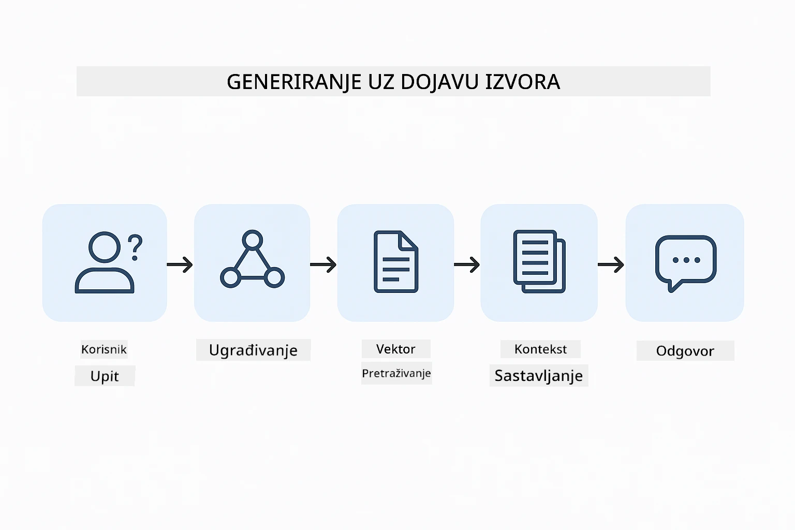
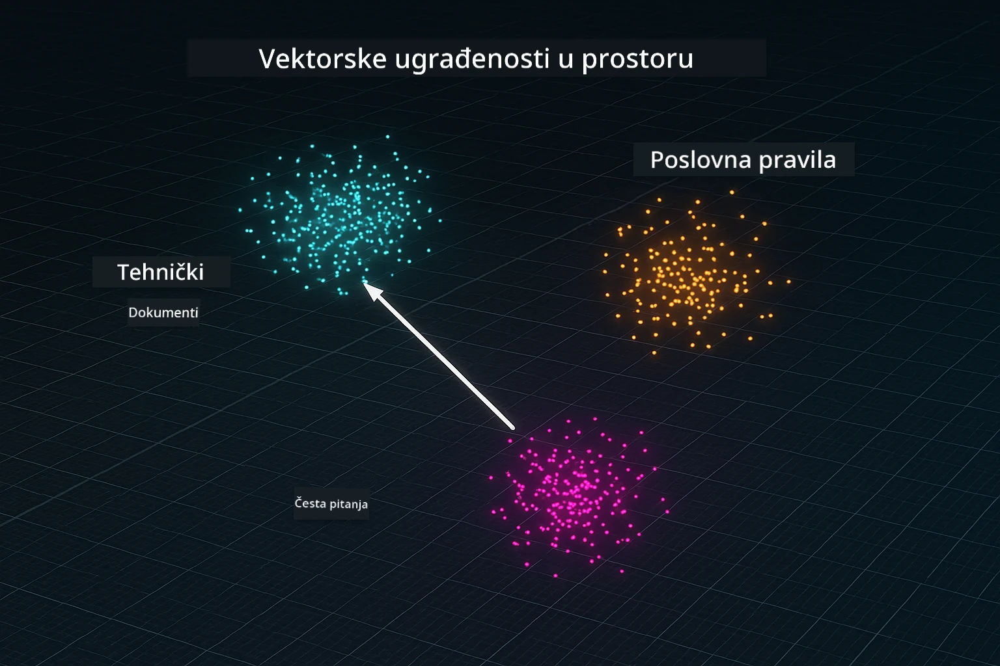
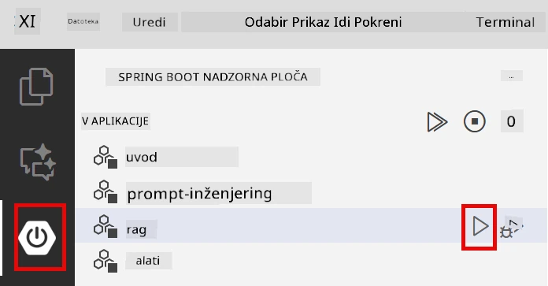
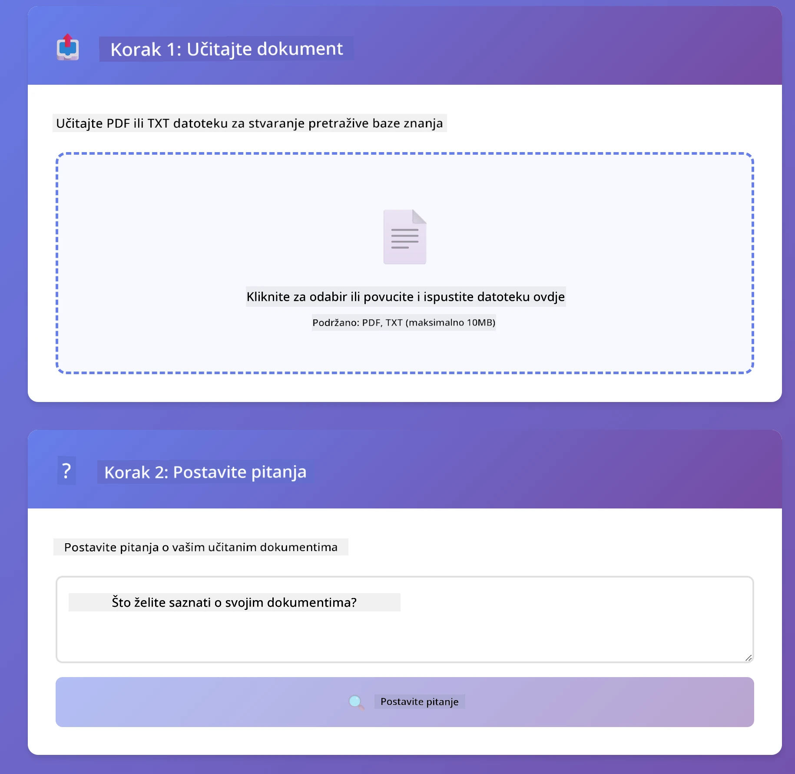
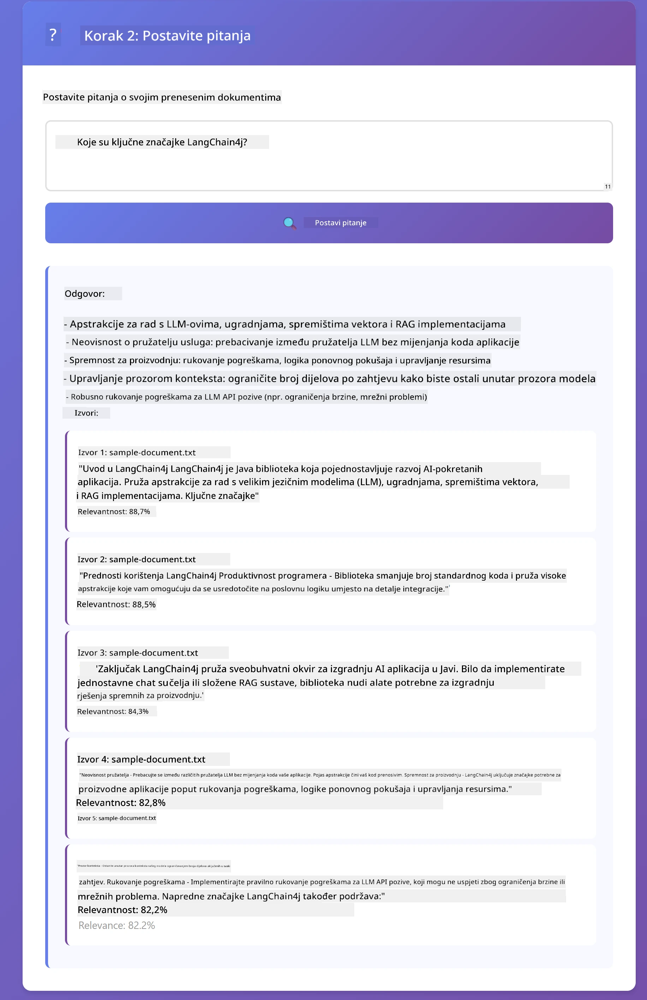

# Modul 03: RAG (Generacija potpomognuta dohvaćanjem)

## Sadržaj

- [Video vodič](#video-vodič)
- [Što ćete naučiti](#što-ćete-naučiti)
- [Preduvjeti](#preduvjeti)
- [Razumijevanje RAG-a](#razumijevanje-rag-a)
  - [Koji RAG pristup koristi ovaj vodič?](#koji-rag-pristup-koristi-ovaj-vodič)
- [Kako to radi](#kako-to-radi)
  - [Obrada dokumenata](#obrada-dokumenata)
  - [Stvaranje ugradnji (embeddinga)](#stvaranje-ugradnji-embeddinga)
  - [Semantičko pretraživanje](#semantičko-pretraživanje)
  - [Generiranje odgovora](#generiranje-odgovora)
- [Pokretanje aplikacije](#pokretanje-aplikacije)
- [Korištenje aplikacije](#korištenje-aplikacije)
  - [Učitajte dokument](#prenesite-dokument)
  - [Postavljajte pitanja](#postavljajte-pitanja)
  - [Provjerite izvore](#provjerite-izvore)
  - [Eksperimentirajte s pitanjima](#eksperimentirajte-s-pitanjima)
- [Ključni pojmovi](#ključni-pojmovi)
  - [Strategija dijeljenja na dijelove](#strategija-dijeljenja-chunkanja)
  - [Ocjene sličnosti](#rezultati-sličnosti)
  - [Spremište u memoriji](#pohrana-u-memoriji)
  - [Upravljanje kontekstom](#upravljanje-kontekstnim-prozorom)
- [Kada je RAG važan](#kada-je-rag-važan)
- [Sljedeći koraci](#sljedeći-koraci)

## Video vodič

Pogledajte ovu uživo sesiju koja objašnjava kako započeti s ovim modulom:

<a href="https://www.youtube.com/watch?v=_olq75ZH_eY"></a>

## Što ćete naučiti

U prethodnim modulima naučili ste kako voditi razgovore s AI-jem i kako učinkovito strukturirati upite (prompte). No postoji temeljno ograničenje: jezični modeli znaju samo ono što su naučili tijekom treniranja. Ne mogu odgovoriti na pitanja o pravilnicima vaše tvrtke, dokumentaciji vašeg projekta ili bilo kojim informacijama na kojima nisu bili trenirani.

RAG (Generacija potpomognuta dohvaćanjem) rješava ovaj problem. Umjesto da pokušavate podučiti model vašim informacijama (što je skupo i nepraktično), dajete mu mogućnost da pretražuje vaše dokumente. Kad netko postavi pitanje, sustav pronalazi relevantne informacije i uključuje ih u prompt. Model zatim daje odgovor temeljen na tom dohvaćenom kontekstu.

Zamislite RAG kao davanje modelu referentne knjižnice. Kad postavite pitanje, sustav:

1. **Korisnički upit** - Postavite pitanje  
2. **Ugradnja (embedding)** - Pretvara vaše pitanje u vektor  
3. **Vektorska pretraga** - Pronalazi slične dijelove dokumenata  
4. **Sastavljanje konteksta** - Dodaje relevantne dijelove u prompt  
5. **Odgovor** - LLM generira odgovor temeljen na kontekstu  

Ovo utemeljuje odgovore modela na vašim stvarnim podacima, a ne na njegovom znanju iz treninga ili izmišljenim odgovorima.

## Preduvjeti

- Završeni [Modul 01 - Uvod](../01-introduction/README.md) (Azure OpenAI resursi postavljeni, uključujući model ugradnje `text-embedding-3-small`)  
- `.env` datoteka u root direktoriju s Azure vjerodajnicama (kreirana komandom `azd up` u Modulu 01)  

> **Napomena:** Ako niste završili Modul 01, prvo slijedite upute za postavljanje tamo. Komanda `azd up` postavlja i GPT chat model i embedding model koji koristi ovaj modul.

## Razumijevanje RAG-a

Slika ispod ilustrira osnovni koncept: umjesto da se oslanjamo samo na podatke dobivene tijekom treninga modela, RAG modelu daje referentnu knjižnicu vaših dokumenata za konzultaciju prije generiranja svakog odgovora.


*Ova dijagram prikazuje razliku između standardnog LLM-a (koji nagađa na temelju treninga) i LLM-a poboljšanog RAG-om (koji prvo konzultira vaše dokumente).*

Evo kako dijelovi međusobno povezuju end-to-end. Korisničko pitanje prolazi kroz četiri faze — ugradnju, vektorsku pretragu, sastavljanje konteksta i generiranje odgovora — pri čemu se svaka nadovezuje na prethodnu:



*Ovaj dijagram prikazuje end-to-end RAG pipeline — korisnički upit prolazi kroz ugradnju, vektorsku pretragu, sastavljanje konteksta i generiranju odgovora.*

Ostatak ovog modula detaljno obrađuje svaku fazu, s kodom koji možete pokrenuti i mijenjati.

### Koji RAG pristup koristi ovaj vodič?

LangChain4j nudi tri načina implementacije RAG-a, svaki sa različitim razinama apstrakcije. Dijagram ispod ih uspoređuje:


*Ovaj dijagram uspoređuje tri LangChain4j RAG pristupa — Easy, Native i Advanced — prikazujući njihove ključne komponente i kada koristiti koji.*

| Pristup | Što radi | Kompromis |
|---|---|---|
| **Easy RAG** | Automatski povezuje sve kroz `AiServices` i `ContentRetriever`. Označite sučelje, dodate retriever, a LangChain4j iza scene rukuje ugradnjom, pretragom i sastavljanjem prompta. | Minimalno koda, ali ne vidite što se događa u svakom koraku. |
| **Native RAG** | Vi pozivate embedding model, pretražujete pohranu, gradite prompt i generirate odgovor — pojedinačno, jasno i korak po korak. | Više koda, ali svaki je korak vidljiv i možete ga mijenjati. |
| **Advanced RAG** | Koristi `RetrievalAugmentor` okvir s pluggable transformatorima upita, routerima, re-rankerima i izvorima sadržaja za produkcijske pipeline. | Maksimalna fleksibilnost, ali znatno složenije. |

**Ovaj vodič koristi Native pristup.** Svaki korak RAG pipelinea — ugradnja upita, pretraga vektorske pohrane, sastavljanje konteksta i generiranje odgovora — eksplicitno je napisan u [`RagService.java`](../../../03-rag/src/main/java/com/example/langchain4j/rag/service/RagService.java). To je namjerno: kao resurs za učenje, važnije je da vidite i razumijete svaki korak negoli da je kod maksimalno skraćen. Kad ste upoznati s funkcioniranjem, možete prijeći na Easy RAG za brze prototipove ili Advanced RAG za produkcijske sustave.

> **💡 Zanimate Easy RAG?** LangChain4j također nudi pristup *Easy RAG* gdje `AiServices` i `ContentRetriever` automatski rukuju ugradnjom, pretragom i sastavljanjem prompta. Ovaj modul ide eksplicitnijim putem — razbijajući pipeline tako da možete vidjeti i kontrolirati svaki korak sami.

Dijagram ispod prikazuje Easy RAG pipeline. Primijetite kako `AiServices` i `EmbeddingStoreContentRetriever` skrivaju svu složenost — učitate dokument, dodate retriever i dobijete odgovore. Native pristup u ovom modulu ruši te skrivene korake:


*Ovaj dijagram prikazuje Easy RAG pipeline. Usporedite ovo s Native pristupom u ovom modulu: Easy RAG skriva ugradnju, pretraživanje i sastavljanje prompta iza `AiServices` i `ContentRetriever` — učitate dokument, dodate retriever i dobijete odgovore. Native pristup u ovom modulu razlaže pipeline tako da sami pozivate svaki korak (ugradnja, pretraga, sastavljanje konteksta, generiranje), dajući vam potpunu vidljivost i kontrolu.*

## Kako to radi

RAG pipeline u ovom modulu sastoji se od četiri faze koje se izvode redom svaki put kad korisnik postavi pitanje. Prvo se učitani dokument **parsira i dijeli na dijelove** pogodne za korištenje. Ti se dijelovi potom pretvaraju u **vektorske ugradnje** i pohranjuju kako bi se mogli matematički uspoređivati. Kad dođe upit, sustav izvodi **semantičku pretragu** za pronalaženje najrelevantnijih dijelova i na kraju ih prosljeđuje kao kontekst LLM-u za **generiranje odgovora**. Sljedeći odjeljci detaljno objašnjavaju svaki korak s kodom i dijagramima. Pogledajmo prvi korak.

### Obrada dokumenata

[DocumentService.java](../../../03-rag/src/main/java/com/example/langchain4j/rag/service/DocumentService.java)

Kad učitate dokument, sustav ga parsira (PDF ili obični tekst), dodaje metapodatke poput naziva datoteke, a zatim ga dijeli na dijelove — manje cjeline koje stanu u kontekstni prozor modela. Ti se dijelovi djelomično preklapaju kako se ne bi izgubio kontekst na granicama.

```java
// Parsiraj učitanu datoteku i umotaj je u LangChain4j dokument
Document document = Document.from(content, metadata);

// Podijeli na dijelove od 300 tokena s preklapanjem od 30 tokena
DocumentSplitter splitter = DocumentSplitters
    .recursive(300, 30);

List<TextSegment> segments = splitter.split(document);
```

Slika ispod vizualno prikazuje kako to funkcionira. Primijetite da svaki dio dijeli neke tokene s susjednim dijelovima — preklapanje od 30 tokena osigurava da nijedan važan kontekst ne ostane izgubljen između dijelova:


*Ovaj dijagram prikazuje dokument podijeljen u dijelove od 300 tokena s preklapanjem od 30 tokena, čuvajući kontekst na granicama dijelova.*

> **🤖 Isprobajte s [GitHub Copilot](https://github.com/features/copilot) Chat:** Otvorite [`DocumentService.java`](../../../03-rag/src/main/java/com/example/langchain4j/rag/service/DocumentService.java) i pitajte:
> - "Kako LangChain4j dijeli dokumente na dijelove i zašto je preklapanje važno?"
> - "Koja je optimalna veličina dijelova za različite vrste dokumenata i zašto?"
> - "Kako rukovati dokumentima na više jezika ili sa specijalnim formatiranjem?"

### Stvaranje ugradnji (embeddinga)

[LangChainRagConfig.java](../../../03-rag/src/main/java/com/example/langchain4j/rag/config/LangChainRagConfig.java)

Svaki dio se pretvara u numerički prikaz nazvan embedding — u osnovi pretvarač značenja u brojeve. Embedding model nije "inteligentan" kao chat model; ne može slijediti upute, rezonirati ili odgovarati na pitanja. Ono što može jest preslikavati tekst u matematički prostor gdje slična značenja završavaju blizu jedno drugome — "auto" blizu "vozilo", "pravila povrata" blizu "vrati mi novac". Možete zamisliti chat model kao osobu s kojom razgovarate; embedding model je izuzetno dobar sustav za arhiviranje.

Dijagram ispod vizualizira ovaj koncept — ulazi tekst, izlaze numerički vektori, a slična značenja proizvode vektore blizu jedan drugome:


*Ovaj dijagram pokazuje kako embedding model pretvara tekst u numeričke vektore, smještajući slična značenja — poput "automobil" i "vozilo" — blizu jedno drugome u vektorskom prostoru.*

```java
@Bean
public EmbeddingModel embeddingModel() {
    return OpenAiOfficialEmbeddingModel.builder()
        .baseUrl(azureOpenAiEndpoint)
        .apiKey(azureOpenAiKey)
        .modelName(azureEmbeddingDeploymentName)
        .build();
}

EmbeddingStore<TextSegment> embeddingStore = 
    new InMemoryEmbeddingStore<>();
```

Dijagram klasa ispod prikazuje dva zasebna toka u RAG pipelineu i LangChain4j klase koje ih implementiraju. **Tok unosa** (izvodi se jednom pri učitavanju) dijeli dokument, ugrađuje dijelove i pohranjuje ih preko `.addAll()`. **Tok upita** (izvodi se svaki put kad korisnik pita) ugrađuje upit, pretražuje pohranu preko `.search()`, i prosljeđuje podudarajući kontekst chat modelu. Oboje se spajaju na zajedničko sučelje `EmbeddingStore<TextSegment>`:


*Ovaj dijagram prikazuje dva toka u RAG pipelineu — unos i upit — i kako se povezuju preko zajedničkog EmbeddingStore sučelja.*

Kad se embeddingi pohrane, sličan sadržaj prirodno klasterira u prostoru vektora. Vizualizacija ispod prikazuje kako dokumenti o srodnim temama završavaju kao susjedne točke, što omogućuje semantičku pretragu:



*Ova vizualizacija prikazuje kako se povezani dokumenti grupiraju u 3D vektorskom prostoru, s temama poput Tehničke dokumentacije, Poslovnih pravila i Često postavljanih pitanja formirajući odvojene skupine.*

Kad korisnik pretražuje, sustav slijedi četiri koraka: jednom ugrađuje dokumente, kod svake pretrage ugrađuje upit, uspoređuje vektor upita sa svim pohranjenim vektorima koristeći kosinusnu sličnost i vraća top-K najviših rezultata. Dijagram ispod prikazuje svaki korak i LangChain4j klase uključene u proces:


*Ovaj dijagram pokazuje četverostepeni proces pretrage embeddinga: ugradnju dokumenata, ugradnju upita, usporedbu vektora kosinusnom sličnosti i vraćanje top-K rezultata.*

### Semantičko pretraživanje

[RagService.java](../../../03-rag/src/main/java/com/example/langchain4j/rag/service/RagService.java)

Kad postavite pitanje, to pitanje se također pretvara u embedding. Sustav uspoređuje embedding vašeg pitanja sa svim embeddingima dijelova dokumenata. Pronalazi dijelove s najviše sličnosti u značenju — ne samo podudaranje ključnih riječi, već stvarnu semantičku sličnost.

```java
Embedding queryEmbedding = embeddingModel.embed(question).content();

EmbeddingSearchRequest searchRequest = EmbeddingSearchRequest.builder()
    .queryEmbedding(queryEmbedding)
    .maxResults(5)
    .minScore(0.5)
    .build();

EmbeddingSearchResult<TextSegment> searchResult = embeddingStore.search(searchRequest);
List<EmbeddingMatch<TextSegment>> matches = searchResult.matches();

for (EmbeddingMatch<TextSegment> match : matches) {
    String relevantText = match.embedded().text();
    double score = match.score();
}
```

Dijagram ispod uspoređuje semantičku pretragu s tradicionalnom pretragom po ključnim riječima. Pretraga po ključnoj riječi "vozilo" promašuje dio o "automobilima i kamionima", ali semantička pretraga razumije da znače isto i vraća ga kao visokorangiranu podudarnost:


*Ovaj dijagram uspoređuje pretraživanje na temelju ključnih riječi s semantičkom pretragom, pokazujući kako semantička pretraga dohvaća konceptualno povezani sadržaj čak i kad se ne podudaraju točne ključne riječi.*

Ispod haube, sličnost se mjeri korištenjem kosinusne sličnosti — u osnovi se pita "pokazuju li ove dvije strelice u istom smjeru?" Dva dijela mogu koristiti potpuno drukčije riječi, ali ako znače isto, njihovi vektori pokazuju u isti smjer i daju rezultat blizu 1.0:


*Ovaj dijagram ilustrira kosinusnu sličnost kao kut između vektora ugradnje — vektori koji su bliže usklađeni dobivaju rezultat bliži 1.0, što ukazuje na veću semantičku sličnost.*

> **🤖 Isprobajte s [GitHub Copilot](https://github.com/features/copilot) Chat:** Otvorite [`RagService.java`](../../../03-rag/src/main/java/com/example/langchain4j/rag/service/RagService.java) i pitajte:
> - "Kako radi pretraživanje sličnosti s ugradnjama i što određuje rezultat?"
> - "Koju prag sličnosti bih trebao koristiti i kako to utječe na rezultate?"
> - "Kako postupiti kada se ne pronađu relevantni dokumenti?"

### Generiranje odgovora

[RagService.java](../../../03-rag/src/main/java/com/example/langchain4j/rag/service/RagService.java)

Najrelevantniji dijelovi se sastavljaju u strukturirani upit koji uključuje eksplicitne upute, dohvaćeni kontekst i korisničko pitanje. Model čita te specifične dijelove i daje odgovor na temelju tih informacija — može koristiti samo ono što mu je predano, što sprječava halucinacije.

```java
String context = matches.stream()
    .map(match -> match.embedded().text())
    .collect(Collectors.joining("\n\n"));

String prompt = String.format("""
    Answer the question based on the following context.
    If the answer cannot be found in the context, say so.

    Context:
    %s

    Question: %s

    Answer:""", context, request.question());

String answer = chatModel.chat(prompt);
```

Dijagram u nastavku prikazuje taj proces sastavljanja — dijelovi s najboljim ocjenama iz koraka pretraživanja ugrađuju se u predložak upita, a `OpenAiOfficialChatModel` generira utemeljen odgovor:


*Ovaj dijagram prikazuje kako se dijelovi s najboljim ocjenama sastavljaju u strukturirani upit, omogućujući modelu generiranje utemeljenog odgovora iz vaših podataka.*

## Pokretanje aplikacije

**Provjerite implementaciju:**

Provjerite postoji li `.env` datoteka u glavnom direktoriju sa Azure vjerodajnicama (stvorena tijekom Modula 01). Pokrenite ovo iz direktorija modula (`03-rag/`):

**Bash:**
```bash
cat ../.env  # Trebalo bi prikazati AZURE_OPENAI_ENDPOINT, API_KEY, DEPLOYMENT
```

**PowerShell:**
```powershell
Get-Content ..\.env  # Trebao bi prikazati AZURE_OPENAI_ENDPOINT, API_KEY, DEPLOYMENT
```

**Pokrenite aplikaciju:**

> **Napomena:** Ako ste već pokrenuli sve aplikacije koristeći `./start-all.sh` iz glavnog direktorija (kako je opisano u Modulu 01), ovaj modul već radi na portu 8081. Možete preskočiti naredbe za pokretanje u nastavku i izravno otvoriti http://localhost:8081.

**Opcija 1: Korištenje Spring Boot nadzorne ploče (preporučeno za korisnike VS Codea)**

Razvojno okruženje uključuje Spring Boot nadzornu ploču, koja pruža vizualno sučelje za upravljanje svim Spring Boot aplikacijama. Pronaći ćete je u Traci aktivnosti s lijeve strane VS Codea (potražite ikonu Spring Boota).

Iz Spring Boot nadzorne ploče možete:
- Vidjeti sve dostupne Spring Boot aplikacije u radnom prostoru
- Jednim klikom pokretati/zaustavljati aplikacije
- Pratiti logove aplikacije u stvarnom vremenu
- Nadzirati status aplikacije

Jednostavno kliknite gumb za reprodukciju pored "rag" za pokretanje ovog modula ili pokrenite sve module odjednom.



*Ovaj zaslon prikazuje Spring Boot nadzornu ploču u VS Codeu, gdje možete vizualno pokretati, zaustavljati i nadzirati aplikacije.*

**Opcija 2: Korištenje skripti u terminalu**

Pokrenite sve web aplikacije (moduli 01-04):

**Bash:**
```bash
cd ..  # Iz korijenskog direktorija
./start-all.sh
```

**PowerShell:**
```powershell
cd ..  # Iz korijenskog direktorija
.\start-all.ps1
```

Ili pokrenite samo ovaj modul:

**Bash:**
```bash
cd 03-rag
./start.sh
```

**PowerShell:**
```powershell
cd 03-rag
.\start.ps1
```

Obje skripte automatski učitavaju varijable okoline iz glavne `.env` datoteke i izgradit će JAR datoteke ako ne postoje.

> **Napomena:** Ako želite ručno izgraditi sve module prije pokretanja:
>
> **Bash:**
> ```bash
> cd ..  # Go to root directory
> mvn clean package -DskipTests
> ```

> **PowerShell:**
> ```powershell
> cd ..  # Go to root directory
> mvn clean package -DskipTests
> ```

Otvorite http://localhost:8081 u vašem pregledniku.

**Za zaustavljanje:**

**Bash:**
```bash
./stop.sh  # Samo ovaj modul
# Ili
cd .. && ./stop-all.sh  # Svi moduli
```

**PowerShell:**
```powershell
.\stop.ps1  # Samo ovaj modul
# Ili
cd ..; .\stop-all.ps1  # Svi moduli
```

## Korištenje aplikacije

Aplikacija pruža web sučelje za prijenos dokumenata i postavljanje pitanja.

<a href="images/rag-homepage.png"></a>

*Ovaj zaslon prikazuje sučelje RAG aplikacije gdje prenosite dokumente i postavljate pitanja.*

### Prenesite dokument

Počnite prijenosom dokumenta – TXT datoteke najbolje funkcioniraju za testiranje. U ovom direktoriju nalazi se `sample-document.txt` koji sadrži informacije o značajkama LangChain4j, implementaciji RAG-a i najboljim praksama – savršen za testiranje sustava.

Sustav obrađuje vaš dokument, dijeli ga u dijelove i stvara ugradnje za svaki dio. To se događa automatski pri prijenosu.

### Postavljajte pitanja

Sada postavite specifična pitanja o sadržaju dokumenta. Isprobajte nešto faktualno što je jasno navedeno u dokumentu. Sustav traži relevantne dijelove, uključuje ih u upit i generira odgovor.

### Provjerite izvore

Primijetite da svaki odgovor uključuje reference izvora sa sličnostnim rezultatima. Ti rezultati (od 0 do 1) pokazuju koliko je svaki dio bio relevantan za vaše pitanje. Viši rezultati znače bolje podudaranje. To vam omogućuje da provjerite točnost odgovora u odnosu na izvorni materijal.

<a href="images/rag-query-results.png"></a>

*Ovaj zaslon prikazuje rezultate upita s generiranim odgovorom, referencama izvora i rezultatima relevantnosti za svaki dohvaćeni dio.*

### Eksperimentirajte s pitanjima

Isprobajte različite vrste pitanja:
- Specifične činjenice: "Koja je glavna tema?"
- Usporedbe: "Koja je razlika između X i Y?"
- Sažetke: "Sažmi ključne točke o Z"

Promatrajte kako se rezultati relevantnosti mijenjaju ovisno o tome koliko vaše pitanje odgovara sadržaju dokumenta.

## Ključni pojmovi

### Strategija dijeljenja (chunkanja)

Dokumenti se dijele na dijelove od 300 tokena s preklapanjem od 30 tokena. Ovaj omjer osigurava da svaki dio ima dovoljno konteksta da bude smislen, a istovremeno ostaje dovoljno malen da se može uključiti više dijelova u upit.

### Rezultati sličnosti

Svaki dohvaćeni dio dolazi s rezultatom sličnosti između 0 i 1 koji pokazuje koliko je blisko odgovarao korisničkom pitanju. Dijagram u nastavku vizualizira raspon rezultata i kako sustav koristi te vrijednosti za filtriranje rezultata:


*Ovaj dijagram prikazuje raspon rezultata od 0 do 1, s minimalnim pragom od 0.5 koji filtrira nerelevantne dijelove.*

Rezultati se kreću od 0 do 1:
- 0.7-1.0: Vrlo relevantno, točno podudaranje
- 0.5-0.7: Relevantno, dobar kontekst
- Ispod 0.5: Filtrirano, previše različito

Sustav dohvaća samo dijelove koji prelaze minimalni prag kako bi osigurao kvalitetu.

Ugradnje dobro funkcioniraju kad se značenje jasno grupira, ali imaju i slabosti. Dijagram u nastavku prikazuje uobičajene načine pada—preveliki dijelovi proizvode mutne vektore, premali dijelovi nemaju kontekst, dvosmisleni pojmovi upućuju na više klastera, a točna pretraživanja (ID-ovi, brojevi dijelova) uopće ne rade s ugradnjama:


*Ovaj dijagram prikazuje uobičajene načine pada ugradnji: prevelike dijelove, premale dijelove, dvosmislene pojmove koji upućuju na više skupina, te točna pretraživanja poput ID-ova.*

### Pohrana u memoriji

Ovaj modul koristi pohranu u memoriji radi jednostavnosti. Kada ponovno pokrenete aplikaciju, preneseni dokumenti se izgube. Produkcijski sustavi koriste trajne vektorske baze podataka poput Qdranta ili Azure AI Search.

### Upravljanje kontekstnim prozorom

Svaki model ima maksimalni kontekstni prozor. Ne možete uključiti svaki dio iz velikog dokumenta. Sustav dohvaća prvih N najrelevantnijih dijelova (zadano 5) kako bi ostao unutar granica, a istovremeno pružio dovoljno konteksta za točne odgovore.

## Kada je RAG važan

RAG nije uvijek pravi pristup. Sljedeći vodič za odluku pomaže procijeniti kada RAG donosi dodatnu vrijednost, a kada su jednostavniji pristupi — poput direktnog uključivanja sadržaja u upit ili oslanjanja na ugrađeno znanje modela — dovoljni:


*Ovaj dijagram prikazuje vodič za odluku kada RAG dodaje vrijednost nasuprot kad su jednostavniji pristupi dovoljni.*

## Sljedeći koraci

**Sljedeći modul:** [04-tools - AI agenti s alatima](../04-tools/README.md)

---

**Navigacija:** [← Prethodno: Modul 02 - Inženjering prompta](../02-prompt-engineering/README.md) | [Natrag na početak](../README.md) | [Sljedeće: Modul 04 - Alati →](../04-tools/README.md)

---

<!-- CO-OP TRANSLATOR DISCLAIMER START -->
**Napomena**:
Ovaj dokument je preveden korištenjem AI prevoditeljskog servisa [Co-op Translator](https://github.com/Azure/co-op-translator). Iako težimo točnosti, imajte na umu da automatski prijevodi mogu sadržavati greške ili netočnosti. Izvorni dokument na izvornom jeziku treba smatrati autoritativnim izvorom. Za važne informacije preporuča se profesionalni ljudski prijevod. Nismo odgovorni za bilo kakva nesporazumevanja ili pogrešne interpretacije koje proizlaze iz korištenja ovog prijevoda.
<!-- CO-OP TRANSLATOR DISCLAIMER END -->