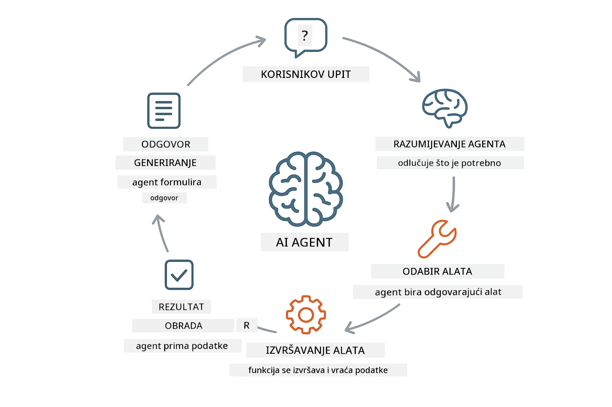
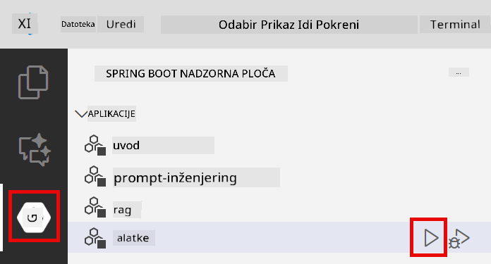
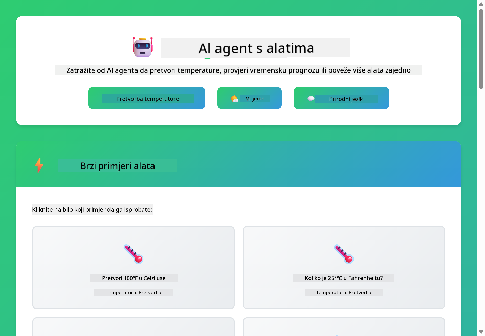
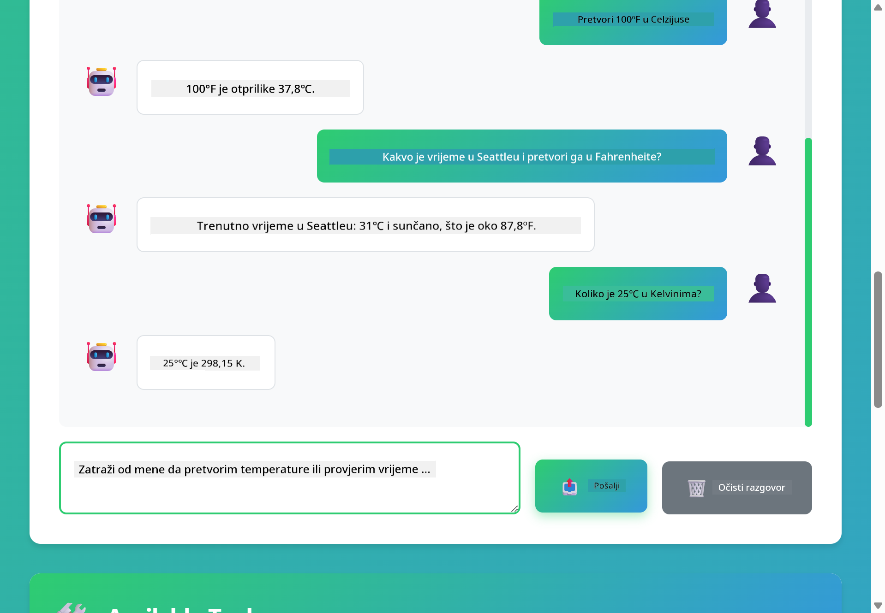

<!--
CO_OP_TRANSLATOR_METADATA:
{
  "original_hash": "844788938b26242f3cc54ce0d0951bea",
  "translation_date": "2026-01-06T01:26:07+00:00",
  "source_file": "04-tools/README.md",
  "language_code": "hr"
}
-->
# Modul 04: AI agenti s alatima

## Sadržaj

- [Što ćete naučiti](../../../04-tools)
- [Preduvjeti](../../../04-tools)
- [Razumijevanje AI agenata s alatima](../../../04-tools)
- [Kako funkcionira pozivanje alata](../../../04-tools)
  - [Definicije alata](../../../04-tools)
  - [Donošenje odluka](../../../04-tools)
  - [Izvršenje](../../../04-tools)
  - [Generiranje odgovora](../../../04-tools)
- [Povezivanje alata](../../../04-tools)
- [Pokrenite aplikaciju](../../../04-tools)
- [Korištenje aplikacije](../../../04-tools)
  - [Isprobajte jednostavnu upotrebu alata](../../../04-tools)
  - [Testirajte povezivanje alata](../../../04-tools)
  - [Pogledajte tijek razgovora](../../../04-tools)
  - [Eksperimentirajte s različitim zahtjevima](../../../04-tools)
- [Ključni pojmovi](../../../04-tools)
  - [ReAct obrazac (razmišljanje i djelovanje)](../../../04-tools)
  - [Opis alata je važan](../../../04-tools)
  - [Upravljanje sesijom](../../../04-tools)
  - [Rukovanje pogreškama](../../../04-tools)
- [Dostupni alati](../../../04-tools)
- [Kada koristiti agente temeljene na alatima](../../../04-tools)
- [Sljedeći koraci](../../../04-tools)

## Što ćete naučiti

Do sada ste naučili kako voditi razgovore s AI-jem, učinkovito strukturirati upite i utemeljiti odgovore u svojim dokumentima. Ali postoji osnovno ograničenje: jezični modeli mogu samo generirati tekst. Ne mogu provjeravati vremensku prognozu, obavljati izračune, upitavati baze podataka niti komunicirati s vanjskim sustavima.

Alati to mijenjaju. Dajući modelu pristup funkcijama koje može pozivati, pretvarate ga iz generatora teksta u agenta koji može poduzimati radnje. Model odlučuje kada mu treba alat, koji alat koristiti i koje parametre proslijediti. Vaš kod izvršava funkciju i vraća rezultat. Model uključi taj rezultat u svoj odgovor.

## Preduvjeti

- Završeni Modul 01 (postavljeni Azure OpenAI resursi)
- `.env` datoteka u glavnom direktoriju s Azure vjerodajnicama (kreirana naredbom `azd up` u Modulu 01)

> **Napomena:** Ako niste završili Modul 01, prvo pratite upute za postavljanje tamo.

## Razumijevanje AI agenata s alatima

> **📝 Napomena:** Pojam "agenti" u ovom modulu odnosi se na AI asistente poboljšane mogućnostima pozivanja alata. To je različito od **Agentic AI** obrazaca (autonomnih agenata s planiranjem, memorijom i višestupanjskim rezoniranjem) koje ćemo obraditi u [Modulu 05: MCP](../05-mcp/README.md).

AI agent s alatima prati obrazac razmišljanja i djelovanja (ReAct):

1. Korisnik postavlja pitanje
2. Agent razmišlja o tome što treba znati
3. Agent odlučuje treba li mu alat za odgovor
4. Ako da, agent poziva odgovarajući alat s pravim parametrima
5. Alat izvršava i vraća podatke
6. Agent uključuje rezultat i daje konačni odgovor



*ReAct obrazac - kako AI agenti naizmjence razmišljaju i djeluju da riješe probleme*

Ovo se odvija automatski. Definirate alate i njihove opise. Model donosi odluke o tome kada i kako ih koristiti.

## Kako funkcionira pozivanje alata

### Definicije alata

[WeatherTool.java](../../../04-tools/src/main/java/com/example/langchain4j/agents/tools/WeatherTool.java) | [TemperatureTool.java](../../../04-tools/src/main/java/com/example/langchain4j/agents/tools/TemperatureTool.java)

Definirate funkcije s jasnim opisima i specifikacijama parametara. Model vidi te opise u svom sistemskom pozivu i razumije što svaki alat radi.

```java
@Component
public class WeatherTool {
    
    @Tool("Get the current weather for a location")
    public String getCurrentWeather(@P("Location name") String location) {
        // Vaša logika za pretraživanje vremena
        return "Weather in " + location + ": 22°C, cloudy";
    }
}

@AiService
public interface Assistant {
    String chat(@MemoryId String sessionId, @UserMessage String message);
}

// Asistent je automatski povezan pomoću Spring Boota s:
// - ChatModel beanom
// - Svim @Tool metodama iz @Component klasa
// - ChatMemoryProvider za upravljanje sesijama
```

> **🤖 Isprobajte s [GitHub Copilot](https://github.com/features/copilot) Chat:** Otvorite [`WeatherTool.java`](../../../04-tools/src/main/java/com/example/langchain4j/agents/tools/WeatherTool.java) i pitajte:
> - "Kako bih integrirao stvarni vremenski API poput OpenWeatherMap umjesto lažnih podataka?"
> - "Što čini dobar opis alata koji pomaže AI-ju da ga pravilno koristi?"
> - "Kako rukovati pogreškama API-ja i ograničenjima broja poziva u implementaciji alata?"

### Donošenje odluka

Kad korisnik pita "Kakvo je vrijeme u Seattleu?", model prepoznaje da mu treba alat za vremensku prognozu. Generira poziv funkciji s parametrima lokacije postavljenim na "Seattle".

### Izvršenje

[AgentService.java](../../../04-tools/src/main/java/com/example/langchain4j/agents/service/AgentService.java)

Spring Boot automatski spaja deklarativni `@AiService` sučelje sa svim registriranim alatima, a LangChain4j automatski izvršava pozive alata.

> **🤖 Isprobajte s [GitHub Copilot](https://github.com/features/copilot) Chat:** Otvorite [`AgentService.java`](../../../04-tools/src/main/java/com/example/langchain4j/agents/service/AgentService.java) i pitajte:
> - "Kako funkcionira ReAct obrazac i zašto je učinkovit za AI agente?"
> - "Kako agent odlučuje koji alat koristiti i kojim redoslijedom?"
> - "Što se događa ako izvršenje alata ne uspije - kako robustno rukovati pogreškama?"

### Generiranje odgovora

Model prima vremenske podatke i oblikuje ih u prirodan jezični odgovor za korisnika.

### Zašto koristiti deklarativne AI servise?

Ovaj modul koristi LangChain4j integraciju za Spring Boot s deklarativnim `@AiService` sučeljima:

- **Spring Boot automatsko povezivanje** - ChatModel i alati se ubrizgavaju automatski
- **@MemoryId obrazac** - Automatsko upravljanje memorijom temeljeno na sesiji
- **Jedinstvena instanca** - Asistent se stvara jednom i ponovno koristi za bolju izvedbu
- **Izvršenje sa sigurnošću tipa** - Java metode se pozivaju direktno s pretvorbom tipova
- **Višekratna orkestracija** - Automatski upravlja povezivanjem alata
- **Nema nepotrebnog koda** - Bez ručnih poziva AiServices.builder() ili memorijskih HashMap-a

Alternativni pristupi (ručni `AiServices.builder()`) zahtijevaju više koda i nemaju prednosti integracije sa Spring Boot-om.

## Povezivanje alata

**Povezivanje alata** - AI može pozvati više alata u nizu. Pitajte "Kakvo je vrijeme u Seattleu i trebam li ponijeti kišobran?" i gledajte kako povezuje `getCurrentWeather` s razmišljanjem o kišnoj opremi.

<a href="images/tool-chaining.png"></a>

*Nizovi poziva alata - izlaz jednog alata koristi se za sljedeću odluku*

**Ljubazno rješavanje pogrešaka** - Tražite vremensku prognozu za grad koji nije u lažnim podacima. Alat vraća poruku o pogrešci, a AI objašnjava da ne može pomoći. Alati sigurno ne uspijevaju.

Ovo se događa u jednom krugu razgovora. Agent samostalno upravlja višestrukim pozivima alata.

## Pokrenite aplikaciju

**Provjerite postavljanje:**

Provjerite postoji li `.env` datoteka u glavnom direktoriju s Azure vjerodajnicama (kreirana tijekom Modula 01):
```bash
cat ../.env  # Trebalo bi prikazati AZURE_OPENAI_ENDPOINT, API_KEY, DEPLOYMENT
```

**Pokrenite aplikaciju:**

> **Napomena:** Ako ste već pokrenuli sve aplikacije naredbom `./start-all.sh` iz Modula 01, ovaj modul već radi na portu 8084. Možete preskočiti naredbe za pokretanje i izravno posjetiti http://localhost:8084.

**Opcija 1: Korištenje Spring Boot nadzorne ploče (preporučeno za VS Code korisnike)**

Kontejner za razvoj uključuje Spring Boot nadzornu ploču koja pruža vizualno sučelje za upravljanje svim Spring Boot aplikacijama. Možete ju pronaći u traci aktivnosti s lijeve strane VS Code-a (ikona Spring Boota).

S nadzorne ploče možete:
- Vidjeti sve dostupne Spring Boot aplikacije u radnom prostoru
- Jednim klikom pokrenuti/zaustaviti aplikacije
- Pregledavati logove aplikacija u stvarnom vremenu
- Pratiti status aplikacija

Jednostavno kliknite gumb za pokretanje pored "tools" da pokrenete ovaj modul, ili pokrenite sve module odjednom.



**Opcija 2: Korištenje skripti**

Pokrenite sve web aplikacije (moduli 01-04):

**Bash:**
```bash
cd ..  # Iz korijenskog direktorija
./start-all.sh
```

**PowerShell:**
```powershell
cd ..  # Iz korijenskog direktorija
.\start-all.ps1
```

Ili pokrenite samo ovaj modul:

**Bash:**
```bash
cd 04-tools
./start.sh
```

**PowerShell:**
```powershell
cd 04-tools
.\start.ps1
```

Obje skripte automatski učitavaju varijable okruženja iz `.env` datoteke u glavnom direktoriju i grade JAR-ove ako oni ne postoje.

> **Napomena:** Ako želite ručno izgraditi sve module prije pokretanja:
>
> **Bash:**
> ```bash
> cd ..  # Go to root directory
> mvn clean package -DskipTests
> ```
>
> **PowerShell:**
> ```powershell
> cd ..  # Go to root directory
> mvn clean package -DskipTests
> ```

Otvorite http://localhost:8084 u pregledniku.

**Za zaustavljanje:**

**Bash:**
```bash
./stop.sh  # Samo ovaj modul
# Ili
cd .. && ./stop-all.sh  # Svi moduli
```

**PowerShell:**
```powershell
.\stop.ps1  # Samo ovaj modul
# Ili
cd ..; .\stop-all.ps1  # Svi moduli
```

## Korištenje aplikacije

Aplikacija pruža web sučelje gdje možete komunicirati s AI agentom koji ima pristup alatima za vremensku prognozu i pretvorbu temperatura.

<a href="images/tools-homepage.png"></a>

*Sučelje AI agenata s alatima - brzi primjeri i chat za interakciju s alatima*

### Isprobajte jednostavnu upotrebu alata

Započnite s jednostavnim zahtjevom: "Pretvori 100 stupnjeva Farenheita u Celzijuse". Agent prepoznaje da mu treba alat za pretvorbu temperature, poziva ga s pravim parametrima i vraća rezultat. Primijetite koliko to djeluje prirodno - niste specificirali koji alat koristiti niti kako ga pozvati.

### Testirajte povezivanje alata

Sad pokušajte nešto složenije: "Kakvo je vrijeme u Seattleu i pretvori to u Fahrenheit?" Gledajte kako agent radi to korak po korak. Prvo dobiva vremensku prognozu (koja vraća u Celzijusima), prepoznaje potrebu za pretvorbom u Farenheit, poziva alat za pretvorbu i kombinira oba rezultata u jedan odgovor.

### Pogledajte tijek razgovora

Chat sučelje čuva povijest razgovora, omogućujući višekratne interakcije. Možete vidjeti sve prethodne upite i odgovore, što olakšava praćenje razgovora i razumijevanje kako agent gradi kontekst kroz višestruke razmjene.

<a href="images/tools-conversation-demo.png"></a>

*Višekratni razgovor koji prikazuje jednostavne pretvorbe, vremenske preglede i povezivanje alata*

### Eksperimentirajte s različitim zahtjevima

Isprobajte razne kombinacije:
- Pregled vremenske prognoze: "Kakvo je vrijeme u Tokiju?"
- Pretvorbe temperatura: "Koliko je 25°C u Kelvinu?"
- Kombinirani upiti: "Provjeri vremensku prognozu za Pariz i reci mi je li iznad 20°C"

Primijetite kako agent interpretira prirodni jezik i mapira ga na odgovarajuće pozive alata.

## Ključni pojmovi

### ReAct obrazac (razmišljanje i djelovanje)

Agent naizmjence razmatra (odlučuje što učiniti) i djeluje (koristi alate). Ovaj obrazac omogućava autonomno rješavanje problema umjesto samo reagiranja na upute.

### Opis alata je važan

Kvaliteta opisa vaših alata izravno utječe na to koliko ih dobro agent koristi. Jasni, specifični opisi pomažu modelu razumjeti kada i kako pozvati svaki alat.

### Upravljanje sesijom

`@MemoryId` oznaka omogućuje automatsko upravljanje memorijom temeljeno na sesiji. Svaka sesija dobiva vlastitu `ChatMemory` instancu koju upravlja `ChatMemoryProvider` bean, eliminirajući potrebu za ručnim praćenjem memorije.

### Rukovanje pogreškama

Alati mogu ne uspjeti - API-ji mogu imati isteke vremena, parametri mogu biti nevaljani, vanjske usluge mogu biti nedostupne. Produkcijski agenti trebaju rukovanje pogreškama da model može objasniti probleme ili pokušati alternative.

## Dostupni alati

**Alati za vremensku prognozu** (lažni podaci za demonstraciju):
- Dobivanje trenutnog vremena za lokaciju
- Višednevna prognoza

**Alati za pretvorbu temperature**:
- Celzijus u Farenheit
- Farenheit u Celzijus
- Celzijus u Kelvin
- Kelvin u Celzijus
- Farenheit u Kelvin
- Kelvin u Farenheit

Ovo su jednostavni primjeri, ali obrazac se može proširiti na bilo koju funkciju: upiti baza podataka, pozivi API-ja, izračuni, rad s datotekama ili sistemski naredbe.

## Kada koristiti agente temeljene na alatima

**Koristite alate kada:**
- Odgovori zahtijevaju podatke u stvarnom vremenu (vrijeme, cijene dionica, zalihe)
- Trebate izvesti izračune izvan osnovne matematike
- Pristupate bazama podataka ili API-jima
- Poduzimate radnje (slanje e-pošte, stvaranje tiketa, ažuriranje zapisa)
- Kombinirate više izvora podataka

**Ne koristite alate kada:**
- Pitanja se mogu odgovoriti općim znanjem
- Odgovor je isključivo konverzacijski
- Kašnjenje alata bi usporilo iskustvo

## Sljedeći koraci

**Sljedeći modul:** [05-mcp - Model Context Protocol (MCP)](../05-mcp/README.md)

---

**Navigacija:** [← Prethodno: Modul 03 - RAG](../03-rag/README.md) | [Natrag na početak](../README.md) | [Sljedeće: Modul 05 - MCP →](../05-mcp/README.md)

---

<!-- CO-OP TRANSLATOR DISCLAIMER START -->
**Napomena**:  
Ovaj dokument preveden je korištenjem AI prevoditeljskog servisa [Co-op Translator](https://github.com/Azure/co-op-translator). Iako težimo točnosti, imajte na umu da automatski prijevodi mogu sadržavati pogreške ili netočnosti. Izvorni dokument na izvornom jeziku treba smatrati službenim i autoritativnim izvorom. Za važne informacije preporučuje se profesionalni ljudski prijevod. Nismo odgovorni za bilo kakva nesporazuma ili pogrešna tumačenja koja mogu proizaći iz korištenja ovog prijevoda.
<!-- CO-OP TRANSLATOR DISCLAIMER END -->