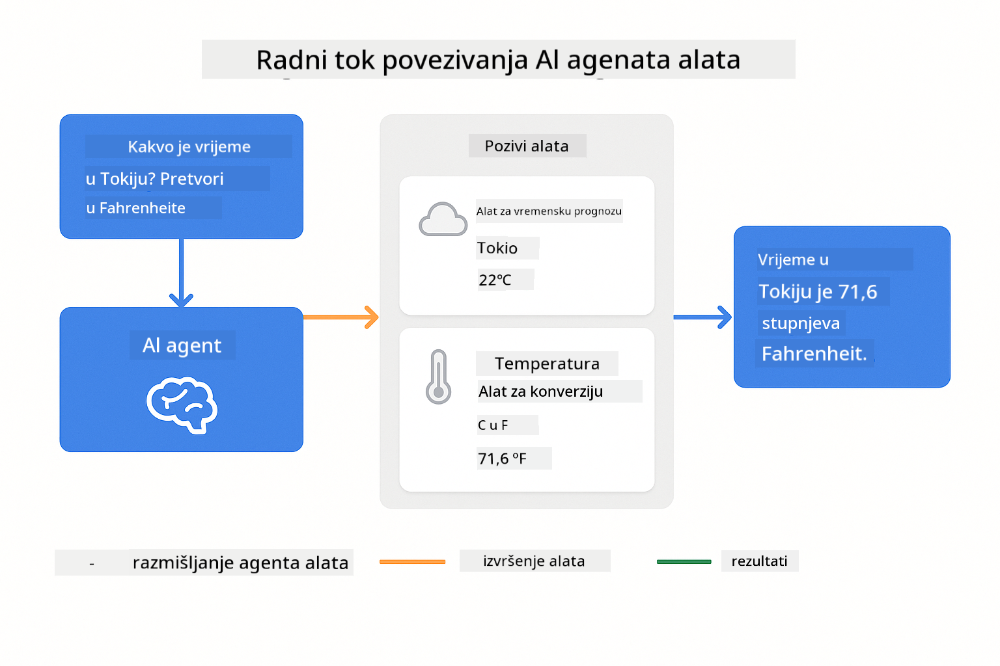

<!--
CO_OP_TRANSLATOR_METADATA:
{
  "original_hash": "aa23f106e7f53270924c9dd39c629004",
  "translation_date": "2025-12-13T19:26:14+00:00",
  "source_file": "04-tools/README.md",
  "language_code": "hr"
}
-->
# Modul 04: AI agenti s alatima

## Sadržaj

- [Što ćete naučiti](../../../04-tools)
- [Preduvjeti](../../../04-tools)
- [Razumijevanje AI agenata s alatima](../../../04-tools)
- [Kako funkcionira pozivanje alata](../../../04-tools)
  - [Definicije alata](../../../04-tools)
  - [Donošenje odluka](../../../04-tools)
  - [Izvršenje](../../../04-tools)
  - [Generiranje odgovora](../../../04-tools)
- [Povezivanje alata](../../../04-tools)
- [Pokrenite aplikaciju](../../../04-tools)
- [Korištenje aplikacije](../../../04-tools)
  - [Isprobajte jednostavnu upotrebu alata](../../../04-tools)
  - [Testirajte povezivanje alata](../../../04-tools)
  - [Pogledajte tijek razgovora](../../../04-tools)
  - [Promatrajte rezoniranje](../../../04-tools)
  - [Eksperimentirajte s različitim zahtjevima](../../../04-tools)
- [Ključni pojmovi](../../../04-tools)
  - [ReAct obrazac (razmišljanje i djelovanje)](../../../04-tools)
  - [Opis alata je važan](../../../04-tools)
  - [Upravljanje sesijama](../../../04-tools)
  - [Rukovanje pogreškama](../../../04-tools)
- [Dostupni alati](../../../04-tools)
- [Kada koristiti agente temeljene na alatima](../../../04-tools)
- [Sljedeći koraci](../../../04-tools)

## Što ćete naučiti

Do sada ste naučili kako voditi razgovore s AI, učinkovito strukturirati upite i utemeljiti odgovore u vašim dokumentima. No postoji temeljno ograničenje: jezični modeli mogu samo generirati tekst. Ne mogu provjeriti vremensku prognozu, izvoditi izračune, upitavati baze podataka ili komunicirati s vanjskim sustavima.

Alati to mijenjaju. Dajući modelu pristup funkcijama koje može pozivati, pretvarate ga iz generatora teksta u agenta koji može poduzimati radnje. Model odlučuje kada mu treba alat, koji alat koristiti i koje parametre proslijediti. Vaš kod izvršava funkciju i vraća rezultat. Model uklapa taj rezultat u svoj odgovor.

## Preduvjeti

- Završeni Modul 01 (postavljeni Azure OpenAI resursi)
- `.env` datoteka u korijenskom direktoriju s Azure vjerodajnicama (kreirana pomoću `azd up` u Modulu 01)

> **Napomena:** Ako niste završili Modul 01, prvo slijedite upute za postavljanje tamo.

## Razumijevanje AI agenata s alatima

AI agent s alatima slijedi obrazac razmišljanja i djelovanja (ReAct):

1. Korisnik postavlja pitanje
2. Agent razmišlja o tome što treba znati
3. Agent odlučuje treba li mu alat za odgovor
4. Ako da, agent poziva odgovarajući alat s pravim parametrima
5. Alat izvršava i vraća podatke
6. Agent uklapa rezultat i daje konačni odgovor


*ReAct obrazac - kako AI agenti izmjenjuju razmišljanje i djelovanje za rješavanje problema*

Ovo se događa automatski. Definirate alate i njihove opise. Model upravlja donošenjem odluka o tome kada i kako ih koristiti.

## Kako funkcionira pozivanje alata

**Definicije alata** - [WeatherTool.java](../../../04-tools/src/main/java/com/example/langchain4j/agents/tools/WeatherTool.java) | [TemperatureTool.java](../../../04-tools/src/main/java/com/example/langchain4j/agents/tools/TemperatureTool.java)

Definirate funkcije s jasnim opisima i specifikacijama parametara. Model vidi te opise u svom sistemskom upitu i razumije što svaki alat radi.

```java
@Component
public class WeatherTool {
    
    @Tool("Get the current weather for a location")
    public String getCurrentWeather(@P("Location name") String location) {
        // Vaša logika za pretraživanje vremenske prognoze
        return "Weather in " + location + ": 22°C, cloudy";
    }
}

@AiService
public interface Assistant {
    String chat(@MemoryId String sessionId, @UserMessage String message);
}

// Asistent je automatski povezan putem Spring Boot-a sa:
// - ChatModel bean
// - Sve @Tool metode iz @Component klasa
// - ChatMemoryProvider za upravljanje sesijama
```

> **🤖 Isprobajte s [GitHub Copilot](https://github.com/features/copilot) Chat:** Otvorite [`WeatherTool.java`](../../../04-tools/src/main/java/com/example/langchain4j/agents/tools/WeatherTool.java) i pitajte:
> - "Kako bih integrirao stvarni vremenski API poput OpenWeatherMap umjesto lažnih podataka?"
> - "Što čini dobar opis alata koji pomaže AI-u da ga pravilno koristi?"
> - "Kako rukovati pogreškama API-ja i ograničenjima poziva u implementacijama alata?"

**Donošenje odluka**

Kad korisnik pita "Kakvo je vrijeme u Seattleu?", model prepoznaje da mu treba vremenski alat. Generira poziv funkcije s parametrom lokacije postavljenim na "Seattle".

**Izvršenje** - [AgentService.java](../../../04-tools/src/main/java/com/example/langchain4j/agents/service/AgentService.java)

Spring Boot automatski povezuje deklarativni `@AiService` sučelje sa svim registriranim alatima, a LangChain4j automatski izvršava pozive alata.

> **🤖 Isprobajte s [GitHub Copilot](https://github.com/features/copilot) Chat:** Otvorite [`AgentService.java`](../../../04-tools/src/main/java/com/example/langchain4j/agents/service/AgentService.java) i pitajte:
> - "Kako funkcionira ReAct obrazac i zašto je učinkovit za AI agente?"
> - "Kako agent odlučuje koji alat koristiti i kojim redoslijedom?"
> - "Što se događa ako izvršenje alata ne uspije - kako robustno rukovati pogreškama?"

**Generiranje odgovora**

Model prima vremenske podatke i oblikuje ih u prirodni jezik za korisnika.

### Zašto koristiti deklarativne AI servise?

Ovaj modul koristi LangChain4j integraciju sa Spring Bootom s deklarativnim `@AiService` sučeljima:

- **Spring Boot automatsko povezivanje** - ChatModel i alati se automatski ubrizgavaju
- **@MemoryId obrazac** - Automatsko upravljanje memorijom po sesiji
- **Jedinstvena instanca** - Asistent se kreira jednom i ponovno koristi za bolju izvedbu
- **Izvršenje s tipovima** - Java metode se pozivaju izravno s konverzijom tipova
- **Orkestracija višekratnih koraka** - Automatski upravlja povezivanjem alata
- **Nula dodatnog koda** - Nema ručnih poziva AiServices.builder() ili memorijskih HashMap

Alternativni pristupi (ručni `AiServices.builder()`) zahtijevaju više koda i propuštaju prednosti Spring Boot integracije.

## Povezivanje alata

**Povezivanje alata** - AI može pozvati više alata u nizu. Pitajte "Kakvo je vrijeme u Seattleu i trebam li kišobran?" i promatrajte kako povezuje `getCurrentWeather` s razmišljanjem o kišnoj opremi.

<a href="images/tool-chaining.png"></a>

*Sekvencijalni pozivi alata - izlaz jednog alata ulazi u sljedeću odluku*

**Ljubazni neuspjesi** - Pitajte za vrijeme u gradu koji nije u lažnim podacima. Alat vraća poruku o pogrešci, a AI objašnjava da ne može pomoći. Alati sigurno ne uspijevaju.

Ovo se događa u jednom koraku razgovora. Agent samostalno orkestrira više poziva alata.

## Pokrenite aplikaciju

**Provjerite postavljanje:**

Provjerite postoji li `.env` datoteka u korijenskom direktoriju s Azure vjerodajnicama (kreirana tijekom Modula 01):
```bash
cat ../.env  # Trebalo bi prikazati AZURE_OPENAI_ENDPOINT, API_KEY, DEPLOYMENT
```

**Pokrenite aplikaciju:**

> **Napomena:** Ako ste već pokrenuli sve aplikacije pomoću `./start-all.sh` iz Modula 01, ovaj modul već radi na portu 8084. Možete preskočiti naredbe za pokretanje i otići izravno na http://localhost:8084.

**Opcija 1: Korištenje Spring Boot nadzorne ploče (preporučeno za korisnike VS Code-a)**

Razvojni kontejner uključuje ekstenziju Spring Boot Dashboard, koja pruža vizualno sučelje za upravljanje svim Spring Boot aplikacijama. Možete je pronaći u traci aktivnosti na lijevoj strani VS Code-a (potražite ikonu Spring Boota).

Iz Spring Boot nadzorne ploče možete:
- Vidjeti sve dostupne Spring Boot aplikacije u radnom prostoru
- Pokrenuti/zaustaviti aplikacije jednim klikom
- Pregledavati zapise aplikacija u stvarnom vremenu
- Pratiti status aplikacije

Jednostavno kliknite gumb za pokretanje pored "tools" da biste pokrenuli ovaj modul, ili pokrenite sve module odjednom.


**Opcija 2: Korištenje shell skripti**

Pokrenite sve web aplikacije (moduli 01-04):

**Bash:**
```bash
cd ..  # Iz korijenskog direktorija
./start-all.sh
```

**PowerShell:**
```powershell
cd ..  # Iz korijenskog direktorija
.\start-all.ps1
```

Ili pokrenite samo ovaj modul:

**Bash:**
```bash
cd 04-tools
./start.sh
```

**PowerShell:**
```powershell
cd 04-tools
.\start.ps1
```

Obje skripte automatski učitavaju varijable okoline iz `.env` datoteke u korijenu i izgradit će JAR-ove ako ne postoje.

> **Napomena:** Ako želite ručno izgraditi sve module prije pokretanja:
>
> **Bash:**
> ```bash
> cd ..  # Go to root directory
> mvn clean package -DskipTests
> ```
>
> **PowerShell:**
> ```powershell
> cd ..  # Go to root directory
> mvn clean package -DskipTests
> ```

Otvorite http://localhost:8084 u pregledniku.

**Za zaustavljanje:**

**Bash:**
```bash
./stop.sh  # Samo ovaj modul
# Ili
cd .. && ./stop-all.sh  # Svi moduli
```

**PowerShell:**
```powershell
.\stop.ps1  # Samo ovaj modul
# Ili
cd ..; .\stop-all.ps1  # Svi moduli
```

## Korištenje aplikacije

Aplikacija pruža web sučelje gdje možete komunicirati s AI agentom koji ima pristup alatima za vremensku prognozu i pretvorbu temperature.

<a href="images/tools-homepage.png"></a>

*Sučelje AI agenata s alatima - brzi primjeri i chat sučelje za interakciju s alatima*

**Isprobajte jednostavnu upotrebu alata**

Započnite s jednostavnim zahtjevom: "Pretvori 100 stupnjeva Fahrenheita u Celzijuse". Agent prepoznaje da mu treba alat za pretvorbu temperature, poziva ga s pravim parametrima i vraća rezultat. Primijetite koliko je prirodno - niste specificirali koji alat koristiti niti kako ga pozvati.

**Testirajte povezivanje alata**

Sada isprobajte nešto složenije: "Kakvo je vrijeme u Seattleu i pretvori ga u Fahrenheite?" Promatrajte kako agent radi korak po korak. Prvo dobiva vremenske podatke (u Celzijusima), prepoznaje da treba pretvoriti u Fahrenheite, poziva alat za pretvorbu i kombinira oba rezultata u jedan odgovor.

**Pogledajte tijek razgovora**

Chat sučelje održava povijest razgovora, omogućujući višekratne interakcije. Možete vidjeti sve prethodne upite i odgovore, što olakšava praćenje razgovora i razumijevanje kako agent gradi kontekst kroz više razmjena.

<a href="images/tools-conversation-demo.png"></a>

*Višekratni razgovor koji prikazuje jednostavne pretvorbe, preglede vremena i povezivanje alata*

**Eksperimentirajte s različitim zahtjevima**

Isprobajte različite kombinacije:
- Pregledi vremena: "Kakvo je vrijeme u Tokiju?"
- Pretvorbe temperature: "Koliko je 25°C u Kelvinu?"
- Kombinirani upiti: "Provjeri vrijeme u Parizu i reci mi je li iznad 20°C"

Primijetite kako agent interpretira prirodni jezik i preslikava ga u odgovarajuće pozive alata.

## Ključni pojmovi

**ReAct obrazac (razmišljanje i djelovanje)**

Agent izmjenjuje razmišljanje (odlučivanje što učiniti) i djelovanje (korištenje alata). Ovaj obrazac omogućuje autonomno rješavanje problema, a ne samo odgovaranje na upute.

**Opis alata je važan**

Kvaliteta opisa vaših alata izravno utječe na to koliko ih agent dobro koristi. Jasni, specifični opisi pomažu modelu razumjeti kada i kako pozvati svaki alat.

**Upravljanje sesijama**

`@MemoryId` anotacija omogućuje automatsko upravljanje memorijom po sesiji. Svaki ID sesije dobiva vlastitu `ChatMemory` instancu kojom upravlja `ChatMemoryProvider` bean, eliminirajući potrebu za ručnim praćenjem memorije.

**Rukovanje pogreškama**

Alati mogu ne uspjeti - API-ji mogu isteći, parametri mogu biti nevažeći, vanjske usluge mogu biti nedostupne. Produkcijski agenti trebaju rukovanje pogreškama kako bi model mogao objasniti probleme ili pokušati alternative.

## Dostupni alati

**Vremenski alati** (lažni podaci za demonstraciju):
- Dohvati trenutno vrijeme za lokaciju
- Dohvati višednevnu prognozu

**Alati za pretvorbu temperature**:
- Celzijus u Fahrenheit
- Fahrenheit u Celzijus
- Celzijus u Kelvin
- Kelvin u Celzijus
- Fahrenheit u Kelvin
- Kelvin u Fahrenheit

Ovo su jednostavni primjeri, ali obrazac se može proširiti na bilo koju funkciju: upite baza podataka, API pozive, izračune, rad s datotekama ili sistemske naredbe.

## Kada koristiti agente temeljene na alatima

**Koristite alate kada:**
- Odgovor zahtijeva podatke u stvarnom vremenu (vrijeme, cijene dionica, zalihe)
- Trebate izvesti izračune složenije od osnovne matematike
- Pristupate bazama podataka ili API-jima
- Poduzimate radnje (slanje e-pošte, kreiranje tiketa, ažuriranje zapisa)
- Kombinirate više izvora podataka

**Nemojte koristiti alate kada:**
- Pitanja se mogu odgovoriti iz općeg znanja
- Odgovor je isključivo konverzacijski
- Kašnjenje alata bi usporilo iskustvo

## Sljedeći koraci

**Sljedeći modul:** [05-mcp - Model Context Protocol (MCP)](../05-mcp/README.md)

---

**Navigacija:** [← Prethodni: Modul 03 - RAG](../03-rag/README.md) | [Natrag na početak](../README.md) | [Sljedeći: Modul 05 - MCP →](../05-mcp/README.md)

---

<!-- CO-OP TRANSLATOR DISCLAIMER START -->
**Odricanje od odgovornosti**:
Ovaj dokument preveden je pomoću AI usluge za prevođenje [Co-op Translator](https://github.com/Azure/co-op-translator). Iako nastojimo postići točnost, imajte na umu da automatski prijevodi mogu sadržavati pogreške ili netočnosti. Izvorni dokument na izvornom jeziku treba smatrati autoritativnim izvorom. Za kritične informacije preporučuje se profesionalni ljudski prijevod. Ne snosimo odgovornost za bilo kakva nesporazuma ili pogrešna tumačenja koja proizlaze iz korištenja ovog prijevoda.
<!-- CO-OP TRANSLATOR DISCLAIMER END -->