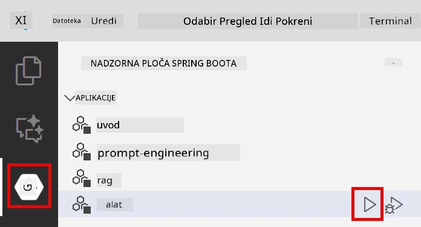
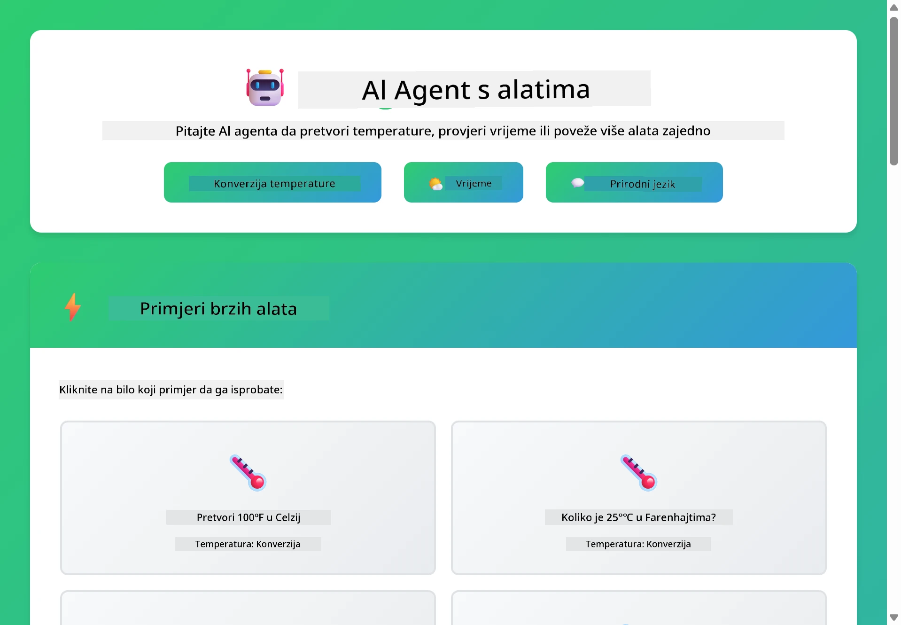
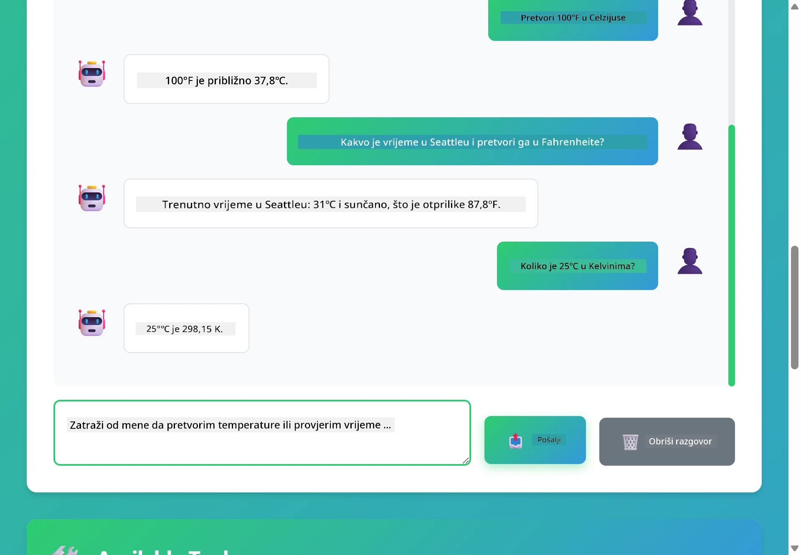

# Modul 04: AI agenti s alatima

## Sadržaj

- [Video vodič](#video-vodič)
- [Što ćete naučiti](#što-ćete-naučiti)
- [Preduvjeti](#preduvjeti)
- [Razumijevanje AI agenata s alatima](#razumijevanje-ai-agenata-s-alatima)
- [Kako funkcionira pozivanje alata](#kako-funkcionira-pozivanje-alata)
  - [Definicije alata](#definicije-alata)
  - [Donošenje odluka](#donošenje-odluka)
  - [Izvršavanje](#izvršavanje)
  - [Generiranje odgovora](#generiranje-odgovora)
  - [Arhitektura: Spring Boot automatsko povezivanje](#arhitektura-spring-boot-automatsko-povezivanje)
- [Povezivanje alata](#povezivanje-alata)
- [Pokrenite aplikaciju](#pokrenite-aplikaciju)
- [Korištenje aplikacije](#korištenje-aplikacije)
  - [Isprobajte jednostavnu upotrebu alata](#isprobajte-jednostavnu-uporabu-alata)
  - [Testirajte povezivanje alata](#testirajte-lančano-korištenje-alata)
  - [Pogledajte tijek razgovora](#pogledajte-tijek-razgovora)
  - [Eksperimentirajte s različitim zahtjevima](#eksperimentirajte-s-različitim-zahtjevima)
- [Ključni pojmovi](#ključni-pojmovi)
  - [ReAct obrazac (razmišljanje i djelovanje)](#react-obrazac-razmišljanje-i-djelovanje)
  - [Opis alata je važan](#opisi-alata-su-važni)
  - [Upravljanje sesijama](#upravljanje-sesijom)
  - [Rukovanje pogreškama](#rukovanje-pogreškama)
- [Dostupni alati](#dostupni-alati)
- [Kada koristiti agente temeljene na alatima](#kada-koristiti-agente-koji-koriste-alate)
- [Alati vs RAG](#alati-naspram-rag)
- [Sljedeći koraci](#daljnji-koraci)

## Video vodič

Pogledajte ovu live sesiju koja objašnjava kako započeti s ovim modulom:

<a href="https://www.youtube.com/watch?v=O_J30kZc0rw"></a>

## Što ćete naučiti

Do sada ste naučili kako voditi razgovore s AI, učinkovito strukturirati upite i povezati odgovore s vašim dokumentima. No postoji temeljno ograničenje: jezični modeli mogu samo generirati tekst. Ne mogu provjeriti vremensku prognozu, izračunavati, upitavati baze podataka ili komunicirati s vanjskim sustavima.

Alati to mijenjaju. Dajući modelu pristup funkcijama koje može pozivati, pretvarate ga iz generatora teksta u agenta koji može poduzimati radnje. Model odlučuje kad mu treba alat, koji alat koristiti i koje parametre poslati. Vaš kod izvršava funkciju i vraća rezultat. Model taj rezultat uključuje u svoj odgovor.

## Preduvjeti

- Završeni [Modul 01 - Uvod](../01-introduction/README.md) (procure Azure OpenAI resursi)
- Prethodni moduli preporučeni (ovaj modul se u usporedbi Alati vs RAG poziva na [RAG koncepte iz Modula 03](../03-rag/README.md))
- `.env` datoteka u korijenskom direktoriju sa Azure vjerodajnicama (kreirana naredbom `azd up` u Modulu 01)

> **Napomena:** Ako niste završili Modul 01, prvo slijedite upute za postavljanje tamo.

## Razumijevanje AI agenata s alatima

> **📝 Napomena:** Termin "agenti" u ovom modulu odnosi se na AI asistente obogaćene sposobnostima pozivanja alata. To se razlikuje od **Agentic AI** obrazaca (autonomni agenti s planiranjem, memorijom i višestupanjskim zaključivanjem) koje ćemo obraditi u [Modulu 05: MCP](../05-mcp/README.md).

Bez alata, jezični model može samo generirati tekst na temelju svojih podataka za učenje. Pitajte ga za trenutnu vremensku prognozu i on mora nagađati. Dajte mu alate i on može pozvati vremenski API, izračunavati ili upitavati bazu podataka — a zatim te stvarne rezultate utkati u svoj odgovor.


*Bez alata model može samo nagađati — s alatima može pozivati API-je, izvoditi izračune i vraćati podatke u stvarnom vremenu.*

AI agent s alatima slijedi **ReAct** obrazac (razmišljanje i djelovanje). Model ne samo da odgovara — on razmišlja što mu treba, djeluje pozivajući alat, promatra rezultat, pa odlučuje hoće li ponovno djelovati ili dati konačni odgovor:

1. **Razmišljanje** — Agent analizira korisničko pitanje i određuje koje informacije su mu potrebne
2. **Djelovanje** — Agent odabire pravi alat, generira ispravne parametre i poziva alat
3. **Promatranje** — Agent prima izlaz alata i evaluira rezultat
4. **Ponavljanje ili Odgovor** — Ako je potrebno više podataka, agent se vraća na početak; inače sastavlja odgovor u prirodnom jeziku


*ReAct ciklus — agent razmišlja što treba napraviti, djeluje pozivajući alat, promatra rezultat i ponavlja dok ne može dati konačni odgovor.*

Ovo se događa automatski. Vi definirate alate i njihove opise. Model donosi odluke o tome kada i kako ih koristiti.

## Kako funkcionira pozivanje alata

### Definicije alata

[WeatherTool.java](../../../04-tools/src/main/java/com/example/langchain4j/agents/tools/WeatherTool.java) | [TemperatureTool.java](../../../04-tools/src/main/java/com/example/langchain4j/agents/tools/TemperatureTool.java)

Definirate funkcije s jasnim opisima i specifikacijama parametara. Model vidi te opise u svom sistemskom promptu i razumije što svaki alat radi.

```java
@Component
public class WeatherTool {
    
    @Tool("Get the current weather for a location")
    public String getCurrentWeather(@P("Location name") String location) {
        // Vaša logika za pretraživanje vremenske prognoze
        return "Weather in " + location + ": 22°C, cloudy";
    }
}

@AiService
public interface Assistant {
    String chat(@MemoryId String sessionId, @UserMessage String message);
}

// Asistent je automatski povezan putem Spring Boot-a sa:
// - ChatModel bean
// - Sve @Tool metode iz @Component klasa
// - ChatMemoryProvider za upravljanje sesijom
```

Sljedeća dijagram razlaže svaku oznaku i pokazuje kako svaki dio pomaže AI-u da razumije kada pozvati alat i koje argumente poslati:


*Anatomija definicije alata — @Tool kaže AI-u kada ga koristiti, @P opisuje svaki parametar, a @AiService povezuje sve pri pokretanju.*

> **🤖 Isprobajte s [GitHub Copilot](https://github.com/features/copilot) Chat:** Otvorite [`WeatherTool.java`](../../../04-tools/src/main/java/com/example/langchain4j/agents/tools/WeatherTool.java) i pitajte:
> - "Kako bih integrirao pravi vremenski API poput OpenWeatherMap umjesto testnih podataka?"
> - "Što čini dobar opis alata koji pomaže AI-u da ga pravilno koristi?"
> - "Kako se nositi s API pogreškama i ograničenjima u implementacijama alata?"

### Donošenje odluka

Kad korisnik pita "Kakvo je vrijeme u Seattleu?", model ne bira alat nasumično. On uspoređuje korisničku namjeru s opisima svakog dostupnog alata, ocjenjuje relevantnost i odabire najbolju opciju. Zatim generira strukturirani poziv funkcije s pravim parametrima — u ovom slučaju, `location` postavlja na `"Seattle"`.

Ako nijedan alat ne odgovara zahtjevu korisnika, model se vraća na odgovore iz vlastitog znanja. Ako više alata odgovara, odabire najprecizniji.


*Model procjenjuje svaki dostupan alat u odnosu na korisničku namjeru i bira najbolju opciju — zbog toga je važno pisati jasne i specifične opise alata.*

### Izvršavanje

[AgentService.java](../../../04-tools/src/main/java/com/example/langchain4j/agents/service/AgentService.java)

Spring Boot automatski povezuje deklarativno `@AiService` sučelje sa svim registriranim alatima, a LangChain4j automatski izvršava pozive alata. Iza kulisa, kompletan poziv alata prolazi kroz šest faza — od korisničkog pitanja u prirodnom jeziku do odgovora u istom obliku:


*Krajnji tijek — korisnik postavlja pitanje, model bira alat, LangChain4j ga izvršava, a model uklapa rezultat u prirodni odgovor.*

Iza scene, `AiServices` pokreće isti ciklus pozivanja alata za bilo koji alat — ovdje prikazan s jednostavnim `Calculator`. Sekvencijski dijagram prikazuje što se točno događa u pozadini:


*Ciklus pozivanja alata — `AiServices` šalje vašu poruku i sheme alata LLM-u, LLM vraća funkcijski poziv poput `add(42, 58)`, LangChain4j lokalno izvršava metodu `Calculator`, i rezultat vraća na sastavljanje konačnog odgovora.*

> **🤖 Isprobajte s [GitHub Copilot](https://github.com/features/copilot) Chat:** Otvorite [`AgentService.java`](../../../04-tools/src/main/java/com/example/langchain4j/agents/service/AgentService.java) i pitajte:
> - "Kako funkcionira ReAct obrazac i zašto je učinkovit za AI agente?"
> - "Kako agent odlučuje koji alat koristiti i kojim redoslijedom?"
> - "Što se događa ako izvršavanje alata ne uspije - kako robusno rukovati pogreškama?"

### Generiranje odgovora

Model prima podatke o vremenu i oblikuje ih u prirodni odgovor za korisnika.

### Arhitektura: Spring Boot automatsko povezivanje

Ovaj modul koristi LangChain4j Spring Boot integraciju s deklarativnim `@AiService` sučeljima. Pri pokretanju, Spring Boot otkriva svaki `@Component` koji sadrži `@Tool` metode, vaš `ChatModel` bean i `ChatMemoryProvider` — te ih povezuje u jedinstveno `Assistant` sučelje bez dodatnog koda.


*@AiService sučelje povezuje ChatModel, komponente alata i memory provider — Spring Boot automatski upravlja povezivanjem.*

Evo kompletnog životnog ciklusa zahtjeva u obliku sekvencijskog dijagrama — od HTTP zahtjeva kroz kontroler, servis i automatski povezan proxy, do izvršavanja alata i vraćanja:


*Kompletan Spring Boot životni ciklus zahtjeva — HTTP zahtjev prolazi kroz kontroler i servis do automatski povezanog Assistant proxy-ja koji orkestrira LLM i pozive alata automatski.*

Ključne prednosti ovog pristupa:

- **Spring Boot automatsko povezivanje** — ChatModel i alati injektirani automatski
- **@MemoryId obrazac** — Automatsko upravljanje memorijom po sesiji
- **Jedinstvena instanca** — Assistant kreiran jednom i ponovno korišten za bolju izvedbu
- **Sigurno izvršavanje po tipu** — Java metode pozivane direktno s konverzijom tipova
- **Višestupanjska orkestracija** — Automatski rukuje povezivanjem alata
- **Nula suvišnog koda** — Nema ručnih poziva `AiServices.builder()` niti memorijskih HashMap-a

Alternativni pristupi (ručni `AiServices.builder()`) zahtijevaju više koda i ne iskorištavaju prednosti Spring Boot integracije.

## Povezivanje alata

**Povezivanje alata** — prava snaga agenata temeljenih na alatima dolazi do izražaja kad jedno pitanje zahtijeva više alata. Pitajte "Kakvo je vrijeme u Seattleu u Fahrenheitima?" i agent automatski povezuje dva alata: prvo poziva `getCurrentWeather` za temperaturu u Celzijusima, zatim prosljeđuje tu vrijednost u `celsiusToFahrenheit` za konverziju — sve u jednom koraku razgovora.


*Povezivanje alata u praksi — agent prvo poziva getCurrentWeather, zatim šalje rezultat u Celzijusima u celsiusToFahrenheit i daje objedinjeni odgovor.*

**Lagana obrada pogrešaka** — Pitajte za vrijeme u gradu koji nije u testnim podacima. Alat vraća poruku o pogrešci, a AI objašnjava da ne može pomoći umjesto da se sruši. Alati se sigurno kvare. Sljedeći dijagram uspoređuje dva pristupa — uz pravilnu obradu pogrešaka, agent hvata iznimku i korisno odgovara, dok bez nje cijela aplikacija pada:


*Kad alat zakaže, agent hvata pogrešku i korisno objašnjava umjesto da izazove pad aplikacije.*

Sve se događa u jednom koraku razgovora. Agent samostalno orkestrira višestruke pozive alata.

## Pokrenite aplikaciju

**Provjerite postavke:**

Provjerite postoji li `.env` datoteka u korijenskom direktoriju sa Azure vjerodajnicama (kreirana tijekom Modula 01). Pokrenite ovo iz direktorija ovog modula (`04-tools/`):

**Bash:**
```bash
cat ../.env  # Trebalo bi prikazati AZURE_OPENAI_ENDPOINT, API_KEY, DEPLOYMENT
```

**PowerShell:**
```powershell
Get-Content ..\.env  # Trebalo bi prikazati AZURE_OPENAI_ENDPOINT, API_KEY, DEPLOYMENT
```

**Pokrenite aplikaciju:**

> **Napomena:** Ako ste već pokrenuli sve aplikacije pomoću `./start-all.sh` iz korijena (kako je opisano u Modulu 01), ovaj modul već radi na portu 8084. Možete preskočiti naredbe za pokretanje i odmah otići na http://localhost:8084.

**Opcija 1: Korištenje Spring Boot nadzorne ploče (preporučeno za korisnike VS Code-a)**

Razvojni kontejner uključuje ekstenziju Spring Boot Dashboard koja pruža vizualni sučelje za upravljanje svim Spring Boot aplikacijama. Možete je pronaći u traci aktivnosti na lijevoj strani VS Code-a (potražite ikonu Spring Boot).

Iz Spring Boot nadzorne ploče možete:
- Vidjeti sve dostupne Spring Boot aplikacije u prostoru za rad
- Pokrenuti/zaustaviti aplikacije jednim klikom
- Pregledavati dnevnik aplikacija u stvarnom vremenu
- Nadzirati status aplikacija

Jednostavno kliknite gumb za pokretanje pored "tools" da pokrenete ovaj modul, ili pokrenite sve module odjednom.

Evo kako Spring Boot nadzorna ploča izgleda u VS Code-u:


*Spring Boot nadzorna ploča u VS Code — pokrenite, zaustavite i nadgledajte sve module s jednog mjesta*

**Opcija 2: Korištenje shell skripti**

Pokrenite sve web aplikacije (moduli 01-04):

**Bash:**
```bash
cd ..  # Iz korijenskog direktorija
./start-all.sh
```

**PowerShell:**
```powershell
cd ..  # Iz korijenskog direktorija
.\start-all.ps1
```

Ili pokrenite samo ovaj modul:

**Bash:**
```bash
cd 04-tools
./start.sh
```

**PowerShell:**
```powershell
cd 04-tools
.\start.ps1
```

Oba skripta automatski učitavaju varijable okoline iz glavne `.env` datoteke i izgradit će JAR-ove ako ne postoje.

> **Napomena:** Ako radije želite ručno izgraditi sve module prije pokretanja:
>
> **Bash:**
> ```bash
> cd ..  # Go to root directory
> mvn clean package -DskipTests
> ```
>
> **PowerShell:**
> ```powershell
> cd ..  # Go to root directory
> mvn clean package -DskipTests
> ```

Otvorite http://localhost:8084 u svom pregledniku.

**Za zaustavljanje:**

**Bash:**
```bash
./stop.sh  # Samo ovaj modul
# Ili
cd .. && ./stop-all.sh  # Svi moduli
```

**PowerShell:**
```powershell
.\stop.ps1  # Samo ovaj modul
# Ili
cd ..; .\stop-all.ps1  # Svi moduli
```

## Korištenje aplikacije

Aplikacija pruža web sučelje gdje možete komunicirati s AI agentom koji ima pristup alatima za vremensku prognozu i pretvorbu temperature. Evo kako sučelje izgleda — uključuje primjere za brzi početak i chat panel za slanje zahtjeva:

<a href="images/tools-homepage.png"></a>

*Sučelje AI Agent Tools - brzi primjeri i chat sučelje za interakciju s alatima*

### Isprobajte jednostavnu uporabu alata

Započnite sa jednostavnim zahtjevom: "Pretvori 100 stupnjeva Fahrenheit u Celzij." Agent prepoznaje da treba alat za pretvorbu temperature, poziva ga s odgovarajućim parametrima i vraća rezultat. Primijetite koliko je to prirodno - niste specificirali koji alat koristiti ili kako ga pozvati.

### Testirajte lančano korištenje alata

Sada pokušajte nešto složenije: "Kakvo je vrijeme u Seattleu i pretvori ga u Fahrenheit?" Promatrajte kako agent to obrađuje u koracima. Prvo dobiva vremensku prognozu (koja vraća Celzij), prepoznaje da treba pretvoriti u Fahrenheit, poziva alat za pretvorbu i spaja oba rezultata u jedan odgovor.

### Pogledajte tijek razgovora

Chat sučelje održava povijest razgovora, što vam omogućuje višekratne interakcije. Možete vidjeti sve prethodne upite i odgovore, što olakšava praćenje razgovora i razumijevanje kako agent gradi kontekst kroz više izmjena.

<a href="images/tools-conversation-demo.png"></a>

*Višekratni razgovor koji pokazuje jednostavne pretvorbe, preglede vremenske prognoze i lančano korištenje alata*

### Eksperimentirajte s različitim zahtjevima

Isprobajte razne kombinacije:
- Pregledi vremenske prognoze: "Kakvo je vrijeme u Tokiju?"
- Pretvorbe temperature: "Koliko je 25°C u Kelvinu?"
- Kombinirani upiti: "Provjeri vrijeme u Parizu i reci mi je li iznad 20°C"

Primijetite kako agent interpretira prirodni jezik i povezuje ga s odgovarajućim pozivima alata.

## Ključni pojmovi

### ReAct obrazac (Razmišljanje i djelovanje)

Agent naizmjence razmišlja (odlučuje što učiniti) i djeluje (koristi alate). Ovaj obrazac omogućuje autonomno rješavanje problema umjesto samo odgovaranja na upute.

### Opisi alata su važni

Kvaliteta opisa vaših alata izravno utječe na to koliko ih agent učinkovito koristi. Jasni, specifični opisi pomažu modelu da razumije kada i kako pozvati svaki alat.

### Upravljanje sesijom

@MemoryId anotacija omogućava automatsko upravljanje memorijom baziranom na sesiji. Svakom ID-u sesije dodjeljuje se vlastita instanca `ChatMemory` kojom upravlja `ChatMemoryProvider` bean, tako da više korisnika može istovremeno komunicirati s agentom bez međusobnog miješanja razgovora. Sljedeća shema prikazuje kako su više korisnika usmjereni na izolirane memorijske spremnike prema njihovim ID-ovima sesije:


*Svaki ID sesije mapira se na izoliranu povijest razgovora — korisnici nikada ne vide poruke jedni drugih.*

### Rukovanje pogreškama

Alati mogu zakašljati — API-ji mogu isteći, parametri mogu biti nevaljani, vanjske usluge mogu prestati raditi. Producenti agenata trebaju rukovanje pogreškama kako bi model mogao objasniti probleme ili pokušati alternative umjesto da cijela aplikacija padne. Kad alat baci iznimku, LangChain4j je uhvati i proslijedi poruku o pogrešci natrag modelu, koji tada može objasniti problem prirodnim jezikom.

## Dostupni alati

Sljedeća ilustracija prikazuje široki ekosustav alata koje možete izgraditi. Ovaj modul demonstrira vremenske i temperaturne alate, ali isti `@Tool` obrazac radi za bilo koju Java metodu — od upita u bazu podataka do obrade plaćanja.


*Svaka Java metoda označena s @Tool postaje dostupna AI-u — obrazac se širi na baze podataka, API-je, e-mail, rad s datotekama i još mnogo toga.*

## Kada koristiti agente koji koriste alate

Ne treba svaki zahtjev koristiti alate. Odluka ovisi o tome treba li AI interakciju s vanjskim sustavima ili može odgovoriti iz vlastitog znanja. Sljedeći vodič sažima kada alati donose vrijednost, a kada nisu potrebni:


*Brzi vodič za odluke — alati su za podatke u stvarnom vremenu, izračune i radnje; opće znanje i kreativni zadaci ih ne trebaju.*

## Alati naspram RAG

Moduli 03 i 04 oboje proširuju što AI može učiniti, ali na temeljno različite načine. RAG omogućuje modelu pristup **znanju** dohvaćanjem dokumenata. Alati omogućuju modelu da poduzima **radnje** pozivajući funkcije. Sljedeća ilustracija uspoređuje ova dva pristupa jedan uz drugi — od načina rada svakog tijeka do kompromisa između njih:


*RAG dohvaća informacije iz statičnih dokumenata — alati izvršavaju radnje i dohvaćaju dinamične, podatke u stvarnom vremenu. Mnogi produkcijski sustavi kombiniraju oba.*

U praksi, mnogi produkcijski sustavi kombiniraju oba pristupa: RAG za osnivanje odgovora u dokumentaciji, i Alate za dohvat uživo podataka ili izvođenje operacija.

## Daljnji koraci

**Sljedeći modul:** [05-mcp - Model Context Protocol (MCP)](../05-mcp/README.md)

---

**Navigacija:** [← Prethodni: Modul 03 - RAG](../03-rag/README.md) | [Natrag na početak](../README.md) | [Sljedeći: Modul 05 - MCP →](../05-mcp/README.md)

---

<!-- CO-OP TRANSLATOR DISCLAIMER START -->
**Napomena**:
Ovaj dokument je preveden korištenjem AI prevoditeljskog servisa [Co-op Translator](https://github.com/Azure/co-op-translator). Iako težimo točnosti, imajte na umu da automatski prijevodi mogu sadržavati greške ili netočnosti. Izvorni dokument na izvornom jeziku treba smatrati autoritativnim izvorom. Za važne informacije preporuča se profesionalni ljudski prijevod. Nismo odgovorni za bilo kakva nesporazumevanja ili pogrešne interpretacije koje proizlaze iz korištenja ovog prijevoda.
<!-- CO-OP TRANSLATOR DISCLAIMER END -->