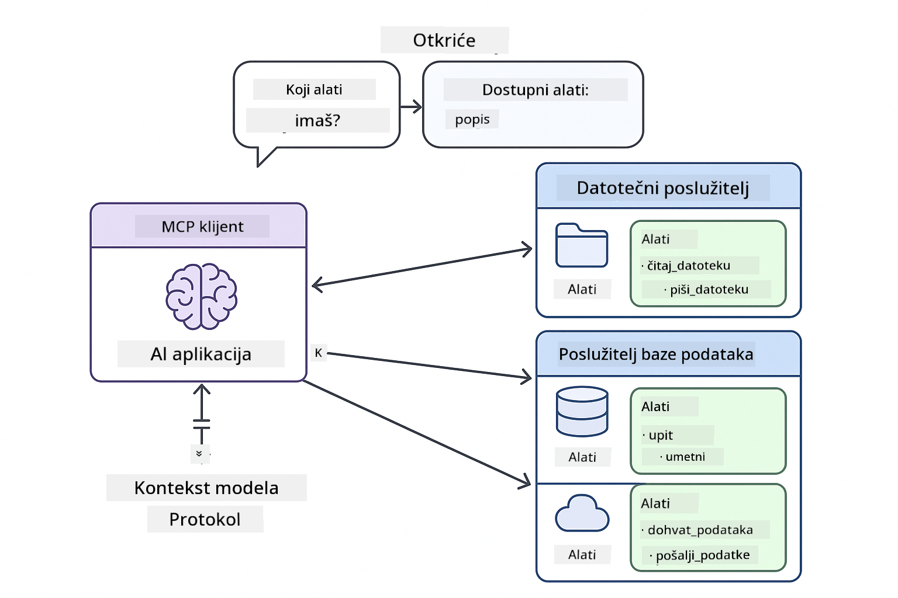

<!--
CO_OP_TRANSLATOR_METADATA:
{
  "original_hash": "c25ec1f10ef156c53e190cdf8b0711ab",
  "translation_date": "2025-12-13T18:07:35+00:00",
  "source_file": "05-mcp/README.md",
  "language_code": "hr"
}
-->
# Modul 05: Protokol konteksta modela (MCP)

## Sadržaj

- [Što ćete naučiti](../../../05-mcp)
- [Razumijevanje MCP-a](../../../05-mcp)
- [Kako MCP radi](../../../05-mcp)
  - [Arhitektura poslužitelj-klijent](../../../05-mcp)
  - [Otkrivanje alata](../../../05-mcp)
  - [Mehanizmi prijenosa](../../../05-mcp)
- [Preduvjeti](../../../05-mcp)
- [Što ovaj modul pokriva](../../../05-mcp)
- [Brzi početak](../../../05-mcp)
  - [Primjer 1: Daljinski kalkulator (Streamable HTTP)](../../../05-mcp)
  - [Primjer 2: Operacije s datotekama (Stdio)](../../../05-mcp)
  - [Primjer 3: Git analiza (Docker)](../../../05-mcp)
- [Ključni pojmovi](../../../05-mcp)
  - [Odabir prijenosa](../../../05-mcp)
  - [Otkrivanje alata](../../../05-mcp)
  - [Upravljanje sesijama](../../../05-mcp)
  - [Razmatranja za različite platforme](../../../05-mcp)
- [Kada koristiti MCP](../../../05-mcp)
- [MCP ekosustav](../../../05-mcp)
- [Čestitamo!](../../../05-mcp)
  - [Što dalje?](../../../05-mcp)
- [Rješavanje problema](../../../05-mcp)

## Što ćete naučiti

Izgradili ste konverzacijski AI, savladali promptove, utemeljili odgovore u dokumentima i stvorili agente s alatima. Ali svi ti alati bili su prilagođeni vašoj specifičnoj aplikaciji. Što ako biste svojem AI-u mogli dati pristup standardiziranom ekosustavu alata koje svatko može stvoriti i dijeliti?

Protokol konteksta modela (MCP) pruža upravo to - standardizirani način za AI aplikacije da otkriju i koriste vanjske alate. Umjesto pisanja prilagođenih integracija za svaki izvor podataka ili uslugu, povezujete se s MCP poslužiteljima koji izlažu svoje mogućnosti u dosljednom formatu. Vaš AI agent tada može automatski otkriti i koristiti te alate.


*Prije MCP-a: složene integracije točka-do-točke. Nakon MCP-a: jedan protokol, beskonačne mogućnosti.*

## Razumijevanje MCP-a

MCP rješava temeljni problem u razvoju AI-ja: svaka integracija je prilagođena. Želite pristupiti GitHubu? Prilagođeni kod. Želite čitati datoteke? Prilagođeni kod. Želite upit u bazu podataka? Prilagođeni kod. I nijedna od tih integracija ne radi s drugim AI aplikacijama.

MCP to standardizira. MCP poslužitelj izlaže alate s jasnim opisima i shemama. Bilo koji MCP klijent može se povezati, otkriti dostupne alate i koristiti ih. Izgradite jednom, koristite svugdje.



*Arhitektura protokola konteksta modela - standardizirano otkrivanje i izvršavanje alata*

## Kako MCP radi

**Arhitektura poslužitelj-klijent**

MCP koristi model klijent-poslužitelj. Poslužitelji pružaju alate - čitanje datoteka, upite u baze podataka, pozive API-ja. Klijenti (vaša AI aplikacija) se povezuju na poslužitelje i koriste njihove alate.

**Otkrivanje alata**

Kad se vaš klijent poveže na MCP poslužitelj, pita "Koje alate imate?" Poslužitelj odgovara popisom dostupnih alata, svaki s opisima i shemama parametara. Vaš AI agent tada može odlučiti koje alate koristiti na temelju korisničkih zahtjeva.

**Mehanizmi prijenosa**

MCP definira dva mehanizma prijenosa: HTTP za udaljene poslužitelje, Stdio za lokalne procese (uključujući Docker kontejnere):


*Mehanizmi prijenosa MCP-a: HTTP za udaljene poslužitelje, Stdio za lokalne procese (uključujući Docker kontejnere)*

**Streamable HTTP** - [StreamableHttpDemo.java](../../../05-mcp/src/main/java/com/example/langchain4j/mcp/StreamableHttpDemo.java)

Za udaljene poslužitelje. Vaša aplikacija šalje HTTP zahtjeve poslužitelju koji radi negdje na mreži. Koristi Server-Sent Events za komunikaciju u stvarnom vremenu.

```java
McpTransport httpTransport = new StreamableHttpMcpTransport.Builder()
    .url("http://localhost:3001/mcp")
    .timeout(Duration.ofSeconds(60))
    .logRequests(true)
    .logResponses(true)
    .build();
```

> **🤖 Isprobajte s [GitHub Copilot](https://github.com/features/copilot) Chat:** Otvorite [`StreamableHttpDemo.java`](../../../05-mcp/src/main/java/com/example/langchain4j/mcp/StreamableHttpDemo.java) i pitajte:
> - "Kako se MCP razlikuje od izravne integracije alata kao u Modulu 04?"
> - "Koje su prednosti korištenja MCP-a za dijeljenje alata među aplikacijama?"
> - "Kako rukovati neuspjesima veze ili istekom vremena prema MCP poslužiteljima?"

**Stdio** - [StdioTransportDemo.java](../../../05-mcp/src/main/java/com/example/langchain4j/mcp/StdioTransportDemo.java)

Za lokalne procese. Vaša aplikacija pokreće poslužitelj kao podproces i komunicira putem standardnog ulaza/izlaza. Korisno za pristup datotečnom sustavu ili alatima naredbenog retka.

```java
McpTransport stdioTransport = new StdioMcpTransport.Builder()
    .command(List.of(
        npmCmd, "exec",
        "@modelcontextprotocol/server-filesystem@0.6.2",
        resourcesDir
    ))
    .logEvents(false)
    .build();
```

> **🤖 Isprobajte s [GitHub Copilot](https://github.com/features/copilot) Chat:** Otvorite [`StdioTransportDemo.java`](../../../05-mcp/src/main/java/com/example/langchain4j/mcp/StdioTransportDemo.java) i pitajte:
> - "Kako radi Stdio prijenos i kada ga trebam koristiti umjesto HTTP-a?"
> - "Kako LangChain4j upravlja životnim ciklusom pokrenutih MCP poslužiteljskih procesa?"
> - "Koje su sigurnosne implikacije davanja AI pristupa datotečnom sustavu?"

**Docker (koristi Stdio)** - [GitRepositoryAnalyzer.java](../../../05-mcp/src/main/java/com/example/langchain4j/mcp/GitRepositoryAnalyzer.java)

Za usluge u kontejnerima. Koristi stdio prijenos za komunikaciju s Docker kontejnerom putem `docker run`. Dobro za složene ovisnosti ili izolirana okruženja.

```java
McpTransport dockerTransport = new StdioMcpTransport.Builder()
    .command(List.of(
        "docker", "run",
        "-e", "GITHUB_PERSONAL_ACCESS_TOKEN=" + System.getenv("GITHUB_TOKEN"),
        "-v", volumeMapping,
        "-i", "mcp/git"
    ))
    .logEvents(true)
    .build();
```

> **🤖 Isprobajte s [GitHub Copilot](https://github.com/features/copilot) Chat:** Otvorite [`GitRepositoryAnalyzer.java`](../../../05-mcp/src/main/java/com/example/langchain4j/mcp/GitRepositoryAnalyzer.java) i pitajte:
> - "Kako Docker prijenos izolira MCP poslužitelje i koje su prednosti?"
> - "Kako konfigurirati montiranje volumena za dijeljenje podataka između hosta i MCP kontejnera?"
> - "Koje su najbolje prakse za upravljanje životnim ciklusom MCP poslužitelja temeljenih na Dockeru u produkciji?"

## Pokretanje primjera

### Preduvjeti

- Java 21+, Maven 3.9+
- Node.js 16+ i npm (za MCP poslužitelje)
- **Docker Desktop** - mora biti **POKRENUT** za Primjer 3 (ne samo instaliran)
- GitHub osobni pristupni token konfiguriran u `.env` datoteci (iz Modula 00)

> **Napomena:** Ako još niste postavili svoj GitHub token, pogledajte [Modul 00 - Brzi početak](../00-quick-start/README.md) za upute.

> **⚠️ Korisnici Dockera:** Prije pokretanja Primjera 3, provjerite je li Docker Desktop pokrenut s `docker ps`. Ako vidite pogreške veze, pokrenite Docker Desktop i pričekajte ~30 sekundi za inicijalizaciju.

## Brzi početak

**Korištenje VS Code-a:** Jednostavno kliknite desnom tipkom miša na bilo koju demo datoteku u Exploreru i odaberite **"Run Java"**, ili koristite konfiguracije za pokretanje iz panela Run and Debug (prvo se pobrinite da ste dodali svoj token u `.env` datoteku).

**Korištenje Mavena:** Alternativno, možete pokrenuti s naredbenog retka s primjerima u nastavku.

**⚠️ Važno:** Neki primjeri imaju preduvjete (kao što je pokretanje MCP poslužitelja ili izgradnja Docker slika). Provjerite zahtjeve svakog primjera prije pokretanja.

### Primjer 1: Daljinski kalkulator (Streamable HTTP)

Ovo demonstrira integraciju alata preko mreže.

**⚠️ Preduvjet:** Prvo morate pokrenuti MCP poslužitelj (pogledajte Terminal 1 dolje).

**Terminal 1 - Pokrenite MCP poslužitelj:**

**Bash:**
```bash
git clone https://github.com/modelcontextprotocol/servers.git
cd servers/src/everything
npm install
node dist/streamableHttp.js
```

**PowerShell:**
```powershell
git clone https://github.com/modelcontextprotocol/servers.git
cd servers/src/everything
npm install
node dist/streamableHttp.js
```

**Terminal 2 - Pokrenite primjer:**

**Korištenje VS Code-a:** Kliknite desnom tipkom na `StreamableHttpDemo.java` i odaberite **"Run Java"**.

**Korištenje Mavena:**

**Bash:**
```bash
export GITHUB_TOKEN=your_token_here
cd 05-mcp
mvn compile exec:java -Dexec.mainClass=com.example.langchain4j.mcp.StreamableHttpDemo
```

**PowerShell:**
```powershell
$env:GITHUB_TOKEN=your_token_here
cd 05-mcp
mvn --% compile exec:java -Dexec.mainClass=com.example.langchain4j.mcp.StreamableHttpDemo
```

Promatrajte kako agent otkriva dostupne alate, zatim koristite kalkulator za izvođenje zbrajanja.

### Primjer 2: Operacije s datotekama (Stdio)

Ovo demonstrira alate temeljene na lokalnim podprocesima.

**✅ Nema potrebnih preduvjeta** - MCP poslužitelj se automatski pokreće.

**Korištenje VS Code-a:** Kliknite desnom tipkom na `StdioTransportDemo.java` i odaberite **"Run Java"**.

**Korištenje Mavena:**

**Bash:**
```bash
export GITHUB_TOKEN=your_token_here
cd 05-mcp
mvn compile exec:java -Dexec.mainClass=com.example.langchain4j.mcp.StdioTransportDemo
```

**PowerShell:**
```powershell
$env:GITHUB_TOKEN=your_token_here
cd 05-mcp
mvn --% compile exec:java -Dexec.mainClass=com.example.langchain4j.mcp.StdioTransportDemo
```

Aplikacija automatski pokreće MCP poslužitelj za datotečni sustav i čita lokalnu datoteku. Primijetite kako se upravljanje podprocesom odvija za vas.

**Očekivani izlaz:**
```
Assistant response: The content of the file is "Kaboom!".
```

### Primjer 3: Git analiza (Docker)

Ovo demonstrira poslužitelje alata u kontejnerima.

**⚠️ Preduvjeti:** 
1. **Docker Desktop mora biti POKRENUT** (ne samo instaliran)
2. **Korisnici Windowsa:** preporučen WSL 2 način rada (Docker Desktop Settings → General → "Use the WSL 2 based engine"). Hyper-V način zahtijeva ručnu konfiguraciju dijeljenja datoteka.
3. Prvo morate izgraditi Docker sliku (pogledajte Terminal 1 dolje)

**Provjerite je li Docker pokrenut:**

**Bash:**
```bash
docker ps  # Trebalo bi prikazati popis spremnika, a ne grešku
```

**PowerShell:**
```powershell
docker ps  # Trebalo bi prikazati popis spremnika, a ne grešku
```

Ako vidite pogrešku poput "Cannot connect to Docker daemon" ili "The system cannot find the file specified", pokrenite Docker Desktop i pričekajte da se inicijalizira (~30 sekundi).

**Rješavanje problema:**
- Ako AI prijavljuje prazan repozitorij ili nema datoteka, montiranje volumena (`-v`) ne radi.
- **Korisnici Windows Hyper-V:** Dodajte direktorij projekta u Docker Desktop Settings → Resources → File sharing, zatim ponovno pokrenite Docker Desktop.
- **Preporučeno rješenje:** Prebacite se na WSL 2 način rada za automatsko dijeljenje datoteka (Settings → General → omogućite "Use the WSL 2 based engine").

**Terminal 1 - Izgradite Docker sliku:**

**Bash:**
```bash
cd servers/src/git
docker build -t mcp/git .
```

**PowerShell:**
```powershell
cd servers/src/git
docker build -t mcp/git .
```

**Terminal 2 - Pokrenite analizator:**

**Korištenje VS Code-a:** Kliknite desnom tipkom na `GitRepositoryAnalyzer.java` i odaberite **"Run Java"**.

**Korištenje Mavena:**

**Bash:**
```bash
export GITHUB_TOKEN=your_token_here
cd 05-mcp
mvn compile exec:java -Dexec.mainClass=com.example.langchain4j.mcp.GitRepositoryAnalyzer
```

**PowerShell:**
```powershell
$env:GITHUB_TOKEN=your_token_here
cd 05-mcp
mvn --% compile exec:java -Dexec.mainClass=com.example.langchain4j.mcp.GitRepositoryAnalyzer
```

Aplikacija pokreće Docker kontejner, montira vaš repozitorij i analizira strukturu i sadržaj repozitorija putem AI agenta.

## Ključni pojmovi

**Odabir prijenosa**

Odaberite ovisno o tome gdje se vaši alati nalaze:
- Udaljene usluge → Streamable HTTP
- Lokalni datotečni sustav → Stdio
- Složene ovisnosti → Docker

**Otkrivanje alata**

MCP klijenti automatski otkrivaju dostupne alate prilikom povezivanja. Vaš AI agent vidi opise alata i odlučuje koje koristiti na temelju zahtjeva korisnika.

**Upravljanje sesijama**

Streamable HTTP prijenos održava sesije, omogućujući interakcije s memorijom s udaljenim poslužiteljima. Stdio i Docker prijenosi su obično bezstanja.

**Razmatranja za različite platforme**

Primjeri automatski rješavaju razlike među platformama (razlike u naredbama Windows vs Unix, konverzije putanja za Docker). Ovo je važno za produkcijska okruženja na različitim platformama.

## Kada koristiti MCP

**Koristite MCP kada:**
- Želite iskoristiti postojeće ekosustave alata
- Gradite alate koje će koristiti više aplikacija
- Integrirate usluge trećih strana sa standardnim protokolima
- Trebate mijenjati implementacije alata bez promjena koda

**Koristite prilagođene alate (Modul 04) kada:**
- Gradite funkcionalnost specifičnu za aplikaciju
- Performanse su kritične (MCP dodaje režiju)
- Vaši alati su jednostavni i neće se ponovno koristiti
- Trebate potpunu kontrolu nad izvršavanjem

## MCP ekosustav

Protokol konteksta modela je otvoreni standard s rastućim ekosustavom:

- Službeni MCP poslužitelji za uobičajene zadatke (datotečni sustav, Git, baze podataka)
- Poslužitelji koje doprinosi zajednica za razne usluge
- Standardizirani opisi alata i sheme
- Kompatibilnost među različitim okvirima (radi s bilo kojim MCP klijentom)

Ova standardizacija znači da alati izrađeni za jednu AI aplikaciju rade i s drugima, stvarajući zajednički ekosustav mogućnosti.

## Čestitamo!

Završili ste tečaj LangChain4j za početnike. Naučili ste:

- Kako izgraditi konverzacijski AI s memorijom (Modul 01)
- Obrasce za inženjering promptova za različite zadatke (Modul 02)
- Utemeljenje odgovora u vašim dokumentima s RAG-om (Modul 03)
- Stvaranje AI agenata s prilagođenim alatima (Modul 04)
- Integraciju standardiziranih alata putem MCP-a (Modul 05)

Sada imate temelj za izgradnju produkcijskih AI aplikacija. Koncepti koje ste naučili primjenjivi su bez obzira na specifične okvire ili modele - to su temeljni obrasci u AI inženjerstvu.

### Što dalje?

Nakon završetka modula, istražite [Vodič za testiranje](../docs/TESTING.md) da vidite koncepte testiranja LangChain4j u praksi.

**Službeni resursi:**
- [Dokumentacija LangChain4j](https://docs.langchain4j.dev/) - Sveobuhvatni vodiči i API referenca
- [LangChain4j GitHub](https://github.com/langchain4j/langchain4j) - Izvorni kod i primjeri
- [LangChain4j tutorijali](https://docs.langchain4j.dev/tutorials/) - Korak-po-korak tutorijali za različite slučajeve upotrebe

Hvala što ste završili ovaj tečaj!

---

**Navigacija:** [← Prethodno: Modul 04 - Alati](../04-tools/README.md) | [Natrag na početak](../README.md)

---

## Rješavanje problema

### Sintaksa PowerShell Maven naredbe
**Problem**: Maven naredbe ne uspijevaju s greškom `Unknown lifecycle phase ".mainClass=..."`

**Uzrok**: PowerShell tumači `=` kao operator dodjele varijable, što prekida sintaksu Maven svojstava

**Rješenje**: Koristite operator za zaustavljanje parsiranja `--%` prije Maven naredbe:

**PowerShell:**
```powershell
mvn --% compile exec:java -Dexec.mainClass=com.example.langchain4j.mcp.StreamableHttpDemo
```

**Bash:**
```bash
mvn compile exec:java -Dexec.mainClass=com.example.langchain4j.mcp.StreamableHttpDemo
```

Operator `--%` govori PowerShellu da sve preostale argumente proslijedi doslovno Maven-u bez tumačenja.

### Problemi s Docker vezom

**Problem**: Docker naredbe ne uspijevaju s porukom "Cannot connect to Docker daemon" ili "The system cannot find the file specified"

**Uzrok**: Docker Desktop nije pokrenut ili nije u potpunosti inicijaliziran

**Rješenje**: 
1. Pokrenite Docker Desktop
2. Pričekajte ~30 sekundi za potpunu inicijalizaciju
3. Provjerite s `docker ps` (trebao bi prikazati popis kontejnera, a ne grešku)
4. Zatim pokrenite svoj primjer

### Montiranje Docker volumena na Windowsu

**Problem**: Analizator Git repozitorija prijavljuje prazan repozitorij ili nema datoteka

**Uzrok**: Montiranje volumena (`-v`) ne radi zbog konfiguracije dijeljenja datoteka

**Rješenje**:
- **Preporučeno:** Prebacite se na WSL 2 način rada (Docker Desktop Settings → General → "Use the WSL 2 based engine")
- **Alternativa (Hyper-V):** Dodajte direktorij projekta u Docker Desktop Settings → Resources → File sharing, zatim ponovno pokrenite Docker Desktop

---

<!-- CO-OP TRANSLATOR DISCLAIMER START -->
**Odricanje od odgovornosti**:
Ovaj dokument preveden je pomoću AI usluge za prevođenje [Co-op Translator](https://github.com/Azure/co-op-translator). Iako nastojimo postići točnost, imajte na umu da automatski prijevodi mogu sadržavati pogreške ili netočnosti. Izvorni dokument na izvornom jeziku treba smatrati autoritativnim izvorom. Za kritične informacije preporučuje se profesionalni ljudski prijevod. Ne snosimo odgovornost za bilo kakva nesporazuma ili pogrešna tumačenja koja proizlaze iz korištenja ovog prijevoda.
<!-- CO-OP TRANSLATOR DISCLAIMER END -->