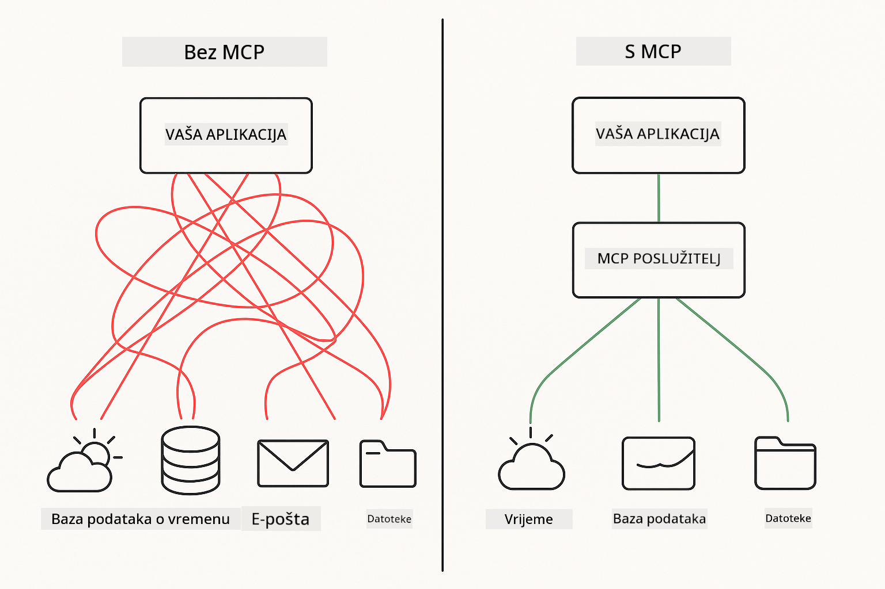
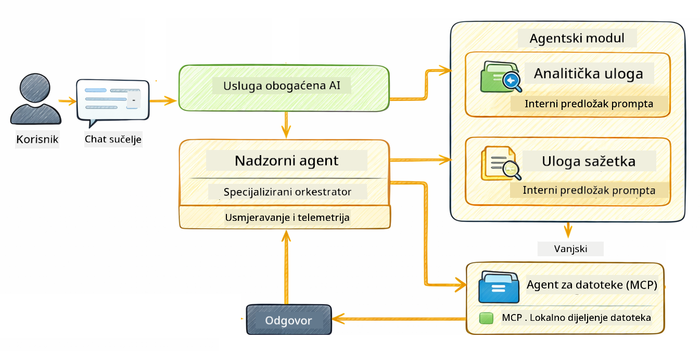

<!--
CO_OP_TRANSLATOR_METADATA:
{
  "original_hash": "f89f4c106d110e4943c055dd1a2f1dff",
  "translation_date": "2025-12-31T05:36:11+00:00",
  "source_file": "05-mcp/README.md",
  "language_code": "hr"
}
-->
# Modul 05: Model Context Protocol (MCP)

## Sadržaj

- [Što ćete naučiti](../../../05-mcp)
- [Što je MCP?](../../../05-mcp)
- [Kako MCP radi](../../../05-mcp)
- [Agentični modul](../../../05-mcp)
- [Pokretanje primjera](../../../05-mcp)
  - [Preduvjeti](../../../05-mcp)
- [Brzi početak](../../../05-mcp)
  - [Operacije datoteka (Stdio)](../../../05-mcp)
  - [Supervisor Agent](../../../05-mcp)
    - [Razumijevanje izlaza](../../../05-mcp)
    - [Objašnjenje značajki agentičnog modula](../../../05-mcp)
- [Ključni pojmovi](../../../05-mcp)
- [Čestitamo!](../../../05-mcp)
  - [Što dalje?](../../../05-mcp)

## Što ćete naučiti

Izgradili ste konverzacijsko AI, savladali prompt dizajn, utemeljili odgovore u dokumentima i stvorili agente s alatima. Ali svi ti alati bili su prilagođeni za vašu specifičnu aplikaciju. Što ako biste svojem AI-ju mogli omogućiti pristup standardiziranom ekosustavu alata koje netko može stvoriti i podijeliti? U ovom modulu naučit ćete upravo to s Model Context Protocolom (MCP) i agentičnim modulom LangChain4j. Najprije prikazujemo jednostavan MCP čitač datoteka, a zatim pokazujemo kako se lako integrira u napredne agentičke tokove rada koristeći obrazac Supervisor Agenta.



*Prije MCP-a: složene point-to-point integracije. Nakon MCP-a: jedan protokol, bezgranične mogućnosti.*

MCP rješava temeljni problem u razvoju AI-ja: svaka je integracija prilagođena. Želite pristup GitHubu? Prilagođeni kod. Želite čitati datoteke? Prilagođeni kod. Želite upit u bazu podataka? Prilagođeni kod. I nijedna od tih integracija ne radi s drugim AI aplikacijama.

MCP to standardizira. MCP poslužitelj izlaže alate s jasnim opisima i shemama. Bilo koji MCP klijent može se povezati, otkriti dostupne alate i koristiti ih. Izgradite jednom, koristite svugdje.


*Arhitektura Model Context Protocola - standardizirano otkrivanje i izvršavanje alata*

## Kako MCP radi

**Arhitektura poslužitelj-klijent**

MCP koristi model klijent-poslužitelj. Poslužitelji pružaju alate - čitanje datoteka, upiti u baze podataka, pozive API-ja. Klijenti (vaša AI aplikacija) se povezuju s poslužiteljima i koriste njihove alate.

Da biste koristili MCP s LangChain4j, dodajte ovu Maven ovisnost:

```xml
<dependency>
    <groupId>dev.langchain4j</groupId>
    <artifactId>langchain4j-mcp</artifactId>
    <version>${langchain4j.version}</version>
</dependency>
```

**Otkrivanje alata**

Kada se vaš klijent poveže na MCP poslužitelj, pita "Koje alate imate?" Poslužitelj odgovara popisom dostupnih alata, svaki s opisima i shemama parametara. Vaš AI agent tada može odlučiti koje alate koristiti na temelju korisničkih zahtjeva.

**Mehanizmi prijenosa**

MCP podržava različite mehanizme prijenosa. Ovaj modul demonstrira Stdio prijenos za lokalne procese:


*MCP mehanizmi prijenosa: HTTP za udaljene poslužitelje, Stdio za lokalne procese*

**Stdio** - [StdioTransportDemo.java](../../../05-mcp/src/main/java/com/example/langchain4j/mcp/StdioTransportDemo.java)

Za lokalne procese. Vaša aplikacija pokreće poslužitelj kao podproces i komunicira putem standardnog ulaza/izlaza. Korisno za pristup datotečnom sustavu ili naredbenim alatima.

```java
McpTransport stdioTransport = new StdioMcpTransport.Builder()
    .command(List.of(
        npmCmd, "exec",
        "@modelcontextprotocol/server-filesystem@2025.12.18",
        resourcesDir
    ))
    .logEvents(false)
    .build();
```

> **🤖 Pokušajte s [GitHub Copilot](https://github.com/features/copilot) Chat:** Open [`StdioTransportDemo.java`](../../../05-mcp/src/main/java/com/example/langchain4j/mcp/StdioTransportDemo.java) and ask:
> - "Kako Stdio transport radi i kada bih ga trebao koristiti umjesto HTTP-a?"
> - "Kako LangChain4j upravlja životnim ciklusom pokrenutih MCP poslužiteljskih procesa?"
> - "Koje su sigurnosne implikacije davanja AI pristupa datotečnom sustavu?"

## Agentični modul

Dok MCP pruža standardizirane alate, agentični modul LangChain4j pruža deklarativni način izgradnje agenata koji orkestriraju te alate. `@Agent` anotacija i `AgenticServices` omogućuju definiranje ponašanja agenta putem sučelja umjesto imperativnog koda.

U ovom modulu istražit ćete obrazac **Supervisor Agenta** — napredni agentički pristup AI-ju gdje "supervizor" agent dinamički odlučuje koje pod-agente pozvati na temelju korisničkih zahtjeva. Kombiniramo oba koncepta dajući jednom od naših pod-agenta MCP-pogonjene mogućnosti pristupa datotekama.

Da biste koristili agentični modul, dodajte ovu Maven ovisnost:

```xml
<dependency>
    <groupId>dev.langchain4j</groupId>
    <artifactId>langchain4j-agentic</artifactId>
    <version>${langchain4j.mcp.version}</version>
</dependency>
```

> **⚠️ Eksperimentalno:** modul `langchain4j-agentic` je **eksperimentalan** i podložan promjenama. Stabilan način izrade AI asistenata i dalje ostaje `langchain4j-core` s prilagođenim alatima (Modul 04).

## Pokretanje primjera

### Preduvjeti

- Java 21+, Maven 3.9+
- Node.js 16+ i npm (za MCP poslužitelje)
- Varijable okoline konfigurirane u `.env` datoteci (iz korijenskog direktorija):
  - **Za StdioTransportDemo:** `GITHUB_TOKEN` (GitHub Personal Access Token)
  - **Za SupervisorAgentDemo:** `AZURE_OPENAI_ENDPOINT`, `AZURE_OPENAI_API_KEY`, `AZURE_OPENAI_DEPLOYMENT` (isto kao u Modulima 01-04)

> **Napomena:** Ako još niste postavili svoje varijable okoline, pogledajte [Modul 00 - Brzi početak](../00-quick-start/README.md) za upute, ili kopirajte `.env.example` u `.env` u korijenskom direktoriju i ispunite svoje vrijednosti.

## Brzi početak

**Korištenje VS Code-a:** Jednostavno desni klik na bilo koju demo datoteku u Exploreru i odaberite **"Run Java"**, ili koristite konfiguracije za pokretanje iz panela Run and Debug (provjerite jeste li prvo dodali svoj token u `.env` datoteku).

**Korištenje Mavena:** Alternativno, možete pokrenuti iz naredbenog retka s primjerima ispod.

### Operacije datoteka (Stdio)

Ovo demonstrira alate temeljene na lokalnim podprocesima.

**✅ Nema potrebnih preduvjeta** - MCP poslužitelj se pokreće automatski.

**Korištenje VS Code-a:** Desni klik na `StdioTransportDemo.java` i odaberite **"Run Java"**.

**Korištenje Mavena:**

**Bash:**
```bash
export GITHUB_TOKEN=your_token_here
cd 05-mcp
mvn compile exec:java -Dexec.mainClass=com.example.langchain4j.mcp.StdioTransportDemo
```

**PowerShell:**
```powershell
$env:GITHUB_TOKEN=your_token_here
cd 05-mcp
mvn --% compile exec:java -Dexec.mainClass=com.example.langchain4j.mcp.StdioTransportDemo
```

Aplikacija automatski pokreće MCP poslužitelj za datotečni sustav i čita lokalnu datoteku. Obratite pažnju kako je upravljanje podprocesima riješeno umjesto vas.

**Očekivani izlaz:**
```
Assistant response: The file provides an overview of LangChain4j, an open-source Java library
for integrating Large Language Models (LLMs) into Java applications...
```

### Supervisor Agent




Obrazac **Supervisor Agenta** je **fleksibilan** oblik agentičkog AI-ja. Za razliku od determinističkih tijekova rada (sekvencijalni, petlja, paralelni), Supervisor koristi LLM da autonomno odluči koje agente pozvati na temelju korisničkog zahtjeva.

**Kombiniranje Supervisor-a s MCP-om:** U ovom primjeru dajemo `FileAgent` pristup MCP alatima za datotečni sustav putem `toolProvider(mcpToolProvider)`. Kad korisnik zatraži "pročitaj i analiziraj datoteku", Supervisor analizira zahtjev i generira plan izvršenja. Zatim usmjerava zahtjev `FileAgent`u, koji koristi MCP-ov alat `read_file` za dohvat sadržaja. Supervisor prosljeđuje taj sadržaj `AnalysisAgent`u na interpretaciju, i opcionalno poziva `SummaryAgent` da sažme rezultate.

Ovo pokazuje kako se MCP alati besprijekorno integriraju u agentičke tokove rada — Supervisor ne mora znati *kako* se datoteke čitaju, samo da `FileAgent` to može učiniti. Supervisor se dinamički prilagođava različitim vrstama zahtjeva i vraća ili odgovor posljednjeg agenta ili sažetak svih operacija.

**Korištenje start skripti (preporučeno):**

Start skripte automatski učitavaju varijable okoline iz `.env` datoteke u korijenu:

**Bash:**
```bash
cd 05-mcp
chmod +x start.sh
./start.sh
```

**PowerShell:**
```powershell
cd 05-mcp
.\start.ps1
```

**Korištenje VS Code-a:** Desni klik na `SupervisorAgentDemo.java` i odaberite **"Run Java"** (provjerite da je vaša `.env` datoteka konfigurirana).

**Kako Supervisor radi:**

```java
// Definirajte više agenata s određenim sposobnostima
FileAgent fileAgent = AgenticServices.agentBuilder(FileAgent.class)
        .chatModel(model)
        .toolProvider(mcpToolProvider)  // Ima MCP alate za rad s datotekama
        .build();

AnalysisAgent analysisAgent = AgenticServices.agentBuilder(AnalysisAgent.class)
        .chatModel(model)
        .build();

SummaryAgent summaryAgent = AgenticServices.agentBuilder(SummaryAgent.class)
        .chatModel(model)
        .build();

// Stvorite nadzornika koji orkestrira ove agente
SupervisorAgent supervisor = AgenticServices.supervisorBuilder()
        .chatModel(model)  // Model "planner"
        .subAgents(fileAgent, analysisAgent, summaryAgent)
        .responseStrategy(SupervisorResponseStrategy.SUMMARY)
        .build();

// Nadzornik samostalno odlučuje koje agente pozvati
// Samo pošaljite zahtjev na prirodnom jeziku - LLM planira izvršenje
String response = supervisor.invoke("Read the file at /path/file.txt and analyze it");
```

Pogledajte [SupervisorAgentDemo.java](../../../05-mcp/src/main/java/com/example/langchain4j/mcp/SupervisorAgentDemo.java) za kompletnu implementaciju.

> **🤖 Pokušajte s [GitHub Copilot](https://github.com/features/copilot) Chat:** Open [`SupervisorAgentDemo.java`](../../../05-mcp/src/main/java/com/example/langchain4j/mcp/SupervisorAgentDemo.java) and ask:
> - "Kako Supervisor odlučuje koje agente pozvati?"
> - "Koja je razlika između Supervisor i Sekvencijalnog obrasca tijeka rada?"
> - "Kako mogu prilagoditi Supervizorovo ponašanje planiranja?"

#### Razumijevanje izlaza

Kada pokrenete demo, vidjet ćete strukturirani prikaz kako Supervisor orkestrira više agenata. Evo što svako poglavlje znači:

```
======================================================================
  SUPERVISOR AGENT DEMO
======================================================================

This demo shows how a Supervisor Agent orchestrates multiple specialized agents.
The Supervisor uses an LLM to decide which agent to call based on the task.
```

**Zaglavlje** uvodi demo i objašnjava osnovni koncept: Supervisor koristi LLM (ne tvrdo kodirana pravila) da odluči koje agente pozvati.

```
--- AVAILABLE AGENTS -------------------------------------------------
  [FILE]     FileAgent     - Reads files using MCP filesystem tools
  [ANALYZE]  AnalysisAgent - Analyzes content for structure, tone, and themes
  [SUMMARY]  SummaryAgent  - Creates concise summaries of content
```

**Dostupni agenti** prikazuju tri specijalizirana agenta koje Supervisor može odabrati. Svaki agent ima specifičnu sposobnost:
- **FileAgent** može čitati datoteke koristeći MCP alate (vanjska mogućnost)
- **AnalysisAgent** analizira sadržaj (isključivo LLM sposobnost)
- **SummaryAgent** stvara sažetke (isključivo LLM sposobnost)

```
--- USER REQUEST -----------------------------------------------------
  "Read the file at .../file.txt and analyze what it's about"
```

**Korisnički zahtjev** prikazuje što je zatraženo. Supervisor mora parsirati ovo i odlučiti koje agente pozvati.

```
--- SUPERVISOR ORCHESTRATION -----------------------------------------
  The Supervisor will now decide which agents to invoke and in what order...

  +-- STEP 1: Supervisor chose -> FileAgent (reading file via MCP)
  |
  |   Input: .../file.txt
  |
  |   Result: LangChain4j is an open-source Java library designed to simplify...
  +-- [OK] FileAgent (reading file via MCP) completed

  +-- STEP 2: Supervisor chose -> AnalysisAgent (analyzing content)
  |
  |   Input: LangChain4j is an open-source Java library...
  |
  |   Result: Structure: The content is organized into clear paragraphs that int...
  +-- [OK] AnalysisAgent (analyzing content) completed
```

**Supervisorova orkestracija** je mjesto gdje se događa čarolija. Pogledajte kako:
1. Supervisor je **prvo odabrao FileAgent** jer je zahtjev spominjao "pročitaj datoteku"
2. FileAgent je koristio MCP-ov `read_file` alat za dohvat sadržaja datoteke
3. Supervisor je zatim **odabrao AnalysisAgent** i proslijedio mu sadržaj datoteke
4. AnalysisAgent je analizirao strukturu, ton i teme

Primijetite da je Supervisor donosio ove odluke **autonomno** na temelju korisničkog zahtjeva — bez tvrdo kodiranog tijeka rada!

**Konačni odgovor** je sintetizirani odgovor Supervizora, kombinirajući izlaze iz svih agenata koje je pozvao. Primjer ispisuje agentični scope pokazujući sažetak i rezultate analize pohranjenima od strane svakog agenta.

```
--- FINAL RESPONSE ---------------------------------------------------
I read the contents of the file and analyzed its structure, tone, and key themes.
The file introduces LangChain4j as an open-source Java library for integrating
large language models...

--- AGENTIC SCOPE (Shared Memory) ------------------------------------
  Agents store their results in a shared scope for other agents to use:
  * summary: LangChain4j is an open-source Java library...
  * analysis: Structure: The content is organized into clear paragraphs that in...
```

### Objašnjenje značajki agentičnog modula

Primjer demonstrira nekoliko naprednih značajki agentičnog modula. Pogledajmo bliže Agentic Scope i Agent Listeners.

**Agentic Scope** pokazuje zajedničku memoriju gdje su agenti pohranili svoje rezultate koristeći `@Agent(outputKey="...")`. Ovo omogućuje:
- Kasnijim agentima pristup izlazima ranijih agenata
- Supervisoru sintetiziranje konačnog odgovora
- Vama pregled što je svaki agent proizveo

```java
ResultWithAgenticScope<String> result = supervisor.invokeWithAgenticScope(request);
AgenticScope scope = result.agenticScope();
String story = scope.readState("story");
List<AgentInvocation> history = scope.agentInvocations("analysisAgent");
```

**Agent Listeners** omogućuju praćenje i otklanjanje pogrešaka tijekom izvršavanja agenata. Korak-po-korak izlaz koji vidite u demo dolazi iz AgentListener-a koji se priključuje na svaku invokaciju agenta:
- **beforeAgentInvocation** - Poziva se kada Supervisor odabere agenta, omogućujući vam da vidite koji je agent odabran i zašto
- **afterAgentInvocation** - Poziva se kada agent završi, prikazujući njegov rezultat
- **inheritedBySubagents** - Kada je istina, listener nadgleda sve agente u hijerarhiji

```java
AgentListener monitor = new AgentListener() {
    private int step = 0;
    
    @Override
    public void beforeAgentInvocation(AgentRequest request) {
        step++;
        System.out.println("  +-- STEP " + step + ": " + request.agentName());
    }
    
    @Override
    public void afterAgentInvocation(AgentResponse response) {
        System.out.println("  +-- [OK] " + response.agentName() + " completed");
    }
    
    @Override
    public boolean inheritedBySubagents() {
        return true; // Proslijedi svim podagentima
    }
};
```

Osim Supervisor obrasca, modul `langchain4j-agentic` pruža nekoliko moćnih obrazaca tijeka rada i značajki:

| Pattern | Description | Use Case |
|---------|-------------|----------|
| **Sequential** | Izvršava agente redom, izlaz teče u sljedeći | Tijekovi: istraživanje → analiza → izvještaj |
| **Parallel** | Pokreće agente istovremeno | Neovisni zadaci: vremenska prognoza + vijesti + dionice |
| **Loop** | Iterira dok se ne ispuni uvjet | Ocjenjivanje kvalitete: poboljšava dok ocjena ≥ 0.8 |
| **Conditional** | Usmjerava na temelju uvjeta | Klasifikacija → usmjeravanje specijalistu |
| **Human-in-the-Loop** | Dodaje ljudske provjere | Radni tokovi odobravanja, pregled sadržaja |

## Ključni pojmovi

**MCP** je idealan kada želite iskoristiti postojeće ekosustave alata, izgraditi alate koje može dijeliti više aplikacija, integrirati third-party servise sa standardnim protokolima, ili zamijeniti implementacije alata bez mijenjanja koda.

**Agentični modul** najbolje funkcionira kada želite deklarativne definicije agenata s `@Agent` anotacijama, trebate orkestraciju tijekova rada (sekvencijalno, petlja, paralelno), preferirate dizajn agenata temeljen na sučeljima umjesto imperativnog koda, ili kombinirate više agenata koji dijele izlaze putem `outputKey`.

**Obrazac Supervisor Agenta** se ističe kada tijek rada nije unaprijed predvidljiv i želite da LLM odlučuje, kada imate više specijaliziranih agenata koji trebaju dinamičku orkestraciju, pri izgradnji konverzacijskih sustava koji usmjeravaju prema različitim sposobnostima, ili kada želite najsvestranije, prilagodljivo ponašanje agenta.

## Čestitamo!

Završili ste LangChain4j za početnike tečaj. Naučili ste:

- Kako izgraditi konverzacijsko AI s memorijom (Modul 01)
- Obrasce za prompt inženjering za različite zadatke (Modul 02)
- Utemeljivanje odgovora u vašim dokumentima s RAG-om (Modul 03)
- Stvaranje osnovnih AI agenata (asistenata) s prilagođenim alatima (Modul 04)
- Integriranje standardiziranih alata s LangChain4j MCP i Agentic modulima (Modul 05)

### Što slijedi?

Nakon dovršetka modula, pogledajte [Vodič za testiranje](../docs/TESTING.md) da vidite koncepte testiranja LangChain4j u praksi.

**Službeni resursi:**
- [Dokumentacija LangChain4j](https://docs.langchain4j.dev/) - Sveobuhvatni vodiči i referenca API-ja
- [LangChain4j GitHub](https://github.com/langchain4j/langchain4j) - Izvorni kod i primjeri
- [Tutoriali LangChain4j](https://docs.langchain4j.dev/tutorials/) - Tutorijali korak po korak za različite slučajeve upotrebe

Hvala što ste dovršili ovaj tečaj!

---

**Navigacija:** [← Prethodno: Modul 04 - Alati](../04-tools/README.md) | [Natrag na početnu](../README.md)

---

<!-- CO-OP TRANSLATOR DISCLAIMER START -->
Odricanje odgovornosti:
Ovaj je dokument preveden pomoću AI usluge za prevođenje [Co-op Translator](https://github.com/Azure/co-op-translator). Iako nastojimo osigurati točnost, imajte na umu da automatski prijevodi mogu sadržavati pogreške ili netočnosti. Izvorni dokument na njegovu izvornom jeziku treba smatrati mjerodavnim izvorom. Za kritične informacije preporučuje se profesionalni ljudski prijevod. Ne snosimo odgovornost za bilo kakve nesporazume ili pogrešna tumačenja koja proizlaze iz upotrebe ovog prijevoda.
<!-- CO-OP TRANSLATOR DISCLAIMER END -->