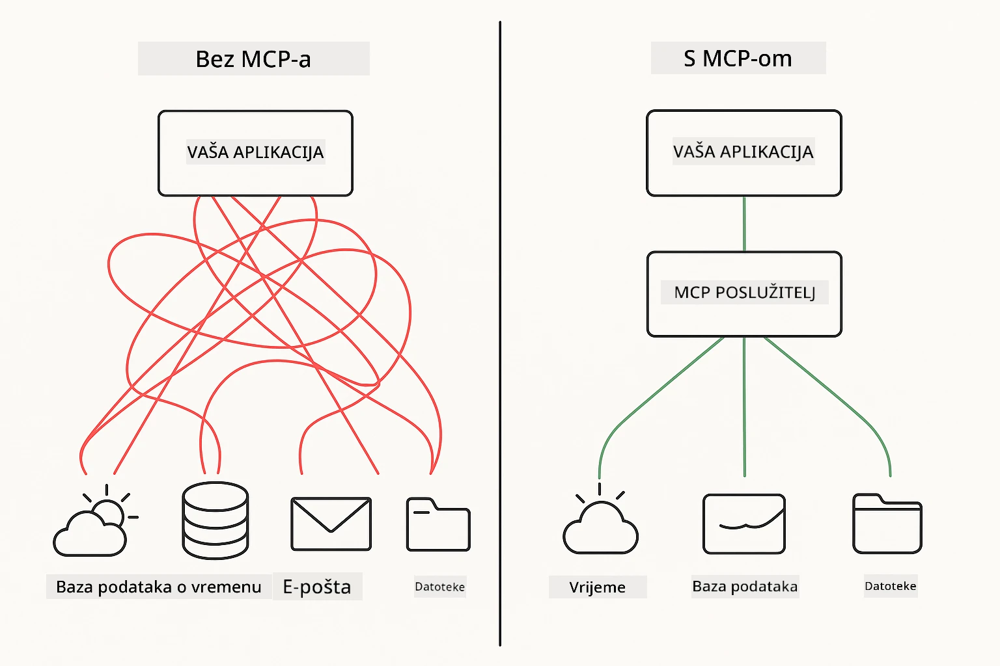
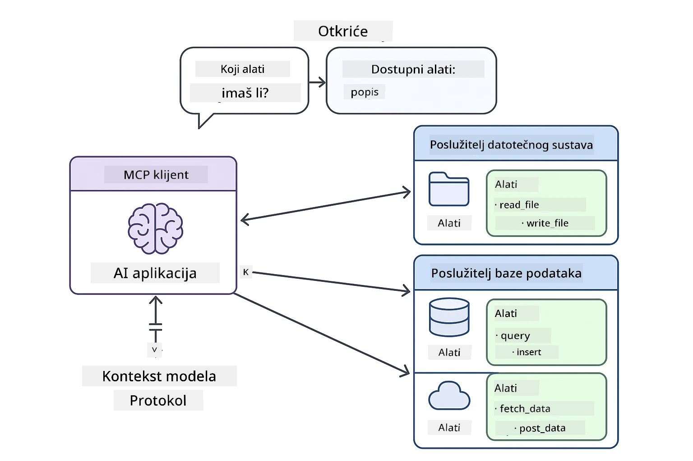
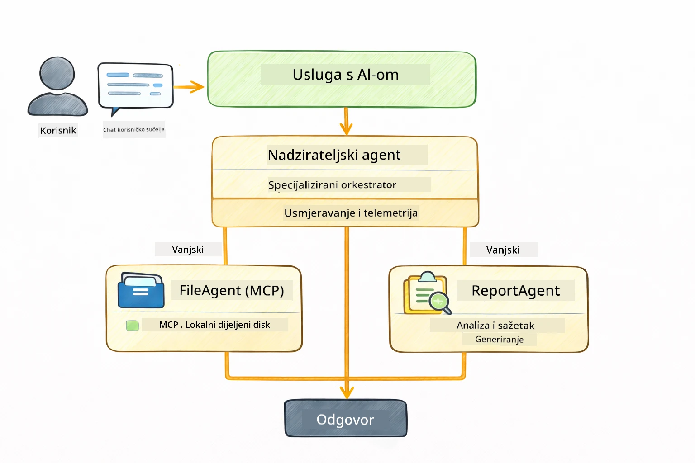

# Modul 05: Protokol Konteksta Modela (MCP)

## Sadržaj

- [Što ćete naučiti](../../../05-mcp)
- [Što je MCP?](../../../05-mcp)
- [Kako MCP radi](../../../05-mcp)
- [Agentni modul](../../../05-mcp)
- [Pokretanje primjera](../../../05-mcp)
  - [Preduvjeti](../../../05-mcp)
- [Brzi početak](../../../05-mcp)
  - [Rad s datotekama (Stdio)](../../../05-mcp)
  - [Supervisor agent](../../../05-mcp)
    - [Razumijevanje izlaza](../../../05-mcp)
    - [Strategije odgovora](../../../05-mcp)
    - [Objašnjenje značajki agentnog modula](../../../05-mcp)
- [Ključni koncepti](../../../05-mcp)
- [Čestitke!](../../../05-mcp)
  - [Što slijedi?](../../../05-mcp)

## Što ćete naučiti

Sastavili ste konverzacijski AI, savladali promptove, utemeljili odgovore u dokumentima i kreirali agente s alatima. Ali svi ti alati bili su prilagođeni vašoj specifičnoj aplikaciji. A što ako biste svom AI-ju mogli dati pristup standardiziranom ekosustavu alata koje bilo tko može napraviti i dijeliti? U ovom modulu naučit ćete upravo to s Protokolom Konteksta Modela (MCP) i agentnim modulom LangChain4j. Prvo prikazujemo jednostavan MCP čitač datoteka, a zatim pokazujemo kako se lako integrira u napredne agentne tokove rada koristeći uzorak Supervisor agenta.

## Što je MCP?

Protokol Konteksta Modela (MCP) pruža upravo to – standardizirani način za AI aplikacije da otkriju i koriste vanjske alate. Umjesto da pišete prilagođene integracije za svaki izvor podataka ili uslugu, povezujete se s MCP poslužiteljima koji izlažu svoje mogućnosti u dosljednom formatu. Vaš AI agent tada može automatski otkriti i koristiti te alate.



*Prije MCP-a: složene točkastije integracije. Nakon MCP-a: jedan protokol, beskonačne mogućnosti.*

MCP rješava temeljni problem u razvoju AI-ja: svaka integracija je prilagođena. Želite pristupiti GitHubu? Prilagođeni kod. Želite čitati datoteke? Prilagođeni kod. Želite postavljati upite u bazu podataka? Prilagođeni kod. I nijedna od tih integracija ne radi s drugim AI aplikacijama.

MCP to standardizira. MCP poslužitelj izlaže alate s jasnim opisima i šemama. Bilo koji MCP klijent može se spojiti, otkriti dostupne alate i koristiti ih. Izgradi jednom, koristi svugdje.



*Arhitektura Protokola Konteksta Modela – standardizirano otkrivanje i izvršavanje alata*

## Kako MCP radi

**Arhitektura poslužitelj-klijent**

MCP koristi model poslužitelj-klijent. Poslužitelji pružaju alate – čitanje datoteka, upite baza podataka, pozive API-ja. Klijenti (vaša AI aplikacija) se povezuju na poslužitelje i koriste njihove alate.

Za korištenje MCP-a s LangChain4j dodajte ovu Maven ovisnost:

```xml
<dependency>
    <groupId>dev.langchain4j</groupId>
    <artifactId>langchain4j-mcp</artifactId>
    <version>${langchain4j.version}</version>
</dependency>
```

**Otkrivanje alata**

Kad se vaš klijent spoji na MCP poslužitelj, pita: "Koje alate imate?" Poslužitelj odgovara s popisom dostupnih alata, svaki s opisima i parametrima u šemi. Vaš AI agent tada može odlučiti koje će alate koristiti na temelju korisničkih zahtjeva.

**Mehanizmi prijenosa**

MCP podržava različite mehanizme prijenosa. Ovaj modul pokazuje Stdio transport za lokalne procese:


*Mehanizmi prijenosa MCP-a: HTTP za udaljene poslužitelje, Stdio za lokalne procese*

**Stdio** - [StdioTransportDemo.java](../../../05-mcp/src/main/java/com/example/langchain4j/mcp/StdioTransportDemo.java)

Za lokalne procese. Vaša aplikacija pokreće poslužitelj kao podproces i komunicira putem standardnog ulaza/izlaza. Korisno za pristup datotečnom sustavu ili alatima naredbenog retka.

```java
McpTransport stdioTransport = new StdioMcpTransport.Builder()
    .command(List.of(
        npmCmd, "exec",
        "@modelcontextprotocol/server-filesystem@2025.12.18",
        resourcesDir
    ))
    .logEvents(false)
    .build();
```

> **🤖 Isprobajte s [GitHub Copilot](https://github.com/features/copilot) Chat:** Otvorite [`StdioTransportDemo.java`](../../../05-mcp/src/main/java/com/example/langchain4j/mcp/StdioTransportDemo.java) i pitajte:
> - "Kako radi Stdio transport i kada ga koristiti u odnosu na HTTP?"
> - "Kako LangChain4j upravlja životnim ciklusom pokrenutih MCP poslužiteljskih procesa?"
> - "Koje su sigurnosne implikacije davanja AI pristupa datotečnom sustavu?"

## Agentni modul

Dok MCP pruža standardizirane alate, LangChain4j-ev **agentni modul** pruža deklarativan način izgradnje agenata koji orkestriraju te alate. `@Agent` anotacija i `AgenticServices` omogućuju definiranje ponašanja agenta putem sučelja umjesto imperativnog koda.

U ovom modulu istražit ćete uzorak **Supervisor agenta** — napredni agentni AI pristup u kojem "supervisor" agent dinamički odlučuje koje pod-agente pozvati na temelju korisničkih zahtjeva. Kombinirat ćemo oba koncepta tako da jednom od naših pod-agenta damo mogućnosti pristupa datotekama preko MCP-a.

Za korištenje agentnog modula dodajte ovu Maven ovisnost:

```xml
<dependency>
    <groupId>dev.langchain4j</groupId>
    <artifactId>langchain4j-agentic</artifactId>
    <version>${langchain4j.mcp.version}</version>
</dependency>
```

> **⚠️ Eksperimentalno:** `langchain4j-agentic` modul je **eksperimentalan** i podložan promjenama. Stabilan način za izgradnju AI asistenata ostaje `langchain4j-core` s prilagođenim alatima (Modul 04).

## Pokretanje primjera

### Preduvjeti

- Java 21+, Maven 3.9+
- Node.js 16+ i npm (za MCP poslužitelje)
- Postavljene varijable okoline u `.env` datoteci (u korijenskom direktoriju):
  - `AZURE_OPENAI_ENDPOINT`, `AZURE_OPENAI_API_KEY`, `AZURE_OPENAI_DEPLOYMENT` (isto kao Moduli 01-04)

> **Napomena:** Ako još niste postavili varijable okoline, pogledajte [Modul 00 - Brzi početak](../00-quick-start/README.md) za upute ili kopirajte `.env.example` u `.env` u korijenskom direktoriju i ispunite svoje vrijednosti.

## Brzi početak

**Korištenje VS Code-a:** Jednostavno desni klik na bilo koju demo datoteku u Exploreru i odaberite **"Run Java"**, ili koristite konfiguracije za pokretanje u Run and Debug panelu (prvo pazite da ste dodali svoj token u `.env` datoteku).

**Korištenje Mavena:** Alternativno, možete pokrenuti iz komandne linije s primjerima dolje.

### Rad s datotekama (Stdio)

Ovo demonstrira alate temeljene na lokalnim podprocesima.

**✅ Nema potrebnih preduvjeta** - MCP poslužitelj se pokreće automatski.

**Korištenje početnih skripti (preporučeno):**

Početne skripte automatski učitavaju varijable okoline iz `.env` datoteke u korijenu:

**Bash:**
```bash
cd 05-mcp
chmod +x start-stdio.sh
./start-stdio.sh
```

**PowerShell:**
```powershell
cd 05-mcp
.\start-stdio.ps1
```

**Korištenje VS Code-a:** Desni klik na `StdioTransportDemo.java` i odaberite **"Run Java"** (provjerite je li vaša `.env` konfigurirana).

Aplikacija automatski pokreće MCP poslužitelj za datotečni sustav i čita lokalnu datoteku. Primijetite kako se upravljanje podprocesom obavlja za vas.

**Očekivani ispis:**
```
Assistant response: The file provides an overview of LangChain4j, an open-source Java library
for integrating Large Language Models (LLMs) into Java applications...
```

### Supervisor agent

Uzorak **Supervisor agenta** je **fleksibilan** oblik agentnog AI-ja. Supervisor koristi LLM da autonomno odluči koje agente pozvati na temelju korisničkog zahtjeva. U sljedećem primjeru kombiniramo MCP-podržani pristup datotekama sa LLM agentom za izradu nadziranog tijeka rada čitanja datoteke → izvještaja.

U demonstraciji, `FileAgent` čita datoteku koristeći MCP alate za datotečni sustav, a `ReportAgent` generira strukturirani izvještaj s izvršnim sažetkom (1 rečenica), 3 ključne točke i preporuke. Supervisor automatski orkestrira ovaj tijek:



```
┌─────────────┐      ┌──────────────┐
│  FileAgent  │ ───▶ │ ReportAgent  │
│ (MCP tools) │      │  (pure LLM)  │
└─────────────┘      └──────────────┘
   outputKey:           outputKey:
  'fileContent'         'report'
```

Svaki agent pohranjuje svoj izlaz u **Agentni opseg** (zajednička memorija), omogućujući agentima u nastavku da pristupe prethodnim rezultatima. Ovo demonstrira kako se MCP alati besprijekorno integriraju u agentne tokove rada — Supervisor ne mora znati *kako* se datoteke čitaju, samo da to `FileAgent` može.

#### Pokretanje demonstracije

Početne skripte automatski učitavaju varijable okoline iz `.env` datoteke u korijenu:

**Bash:**
```bash
cd 05-mcp
chmod +x start-supervisor.sh
./start-supervisor.sh
```

**PowerShell:**
```powershell
cd 05-mcp
.\start-supervisor.ps1
```

**Korištenje VS Code-a:** Desni klik na `SupervisorAgentDemo.java` i odaberite **"Run Java"** (provjerite je li vaša `.env` konfigurirana).

#### Kako Supervisor radi

```java
// Korak 1: FileAgent čita datoteke koristeći MCP alate
FileAgent fileAgent = AgenticServices.agentBuilder(FileAgent.class)
        .chatModel(model)
        .toolProvider(mcpToolProvider)  // Ima MCP alate za rad s datotekama
        .build();

// Korak 2: ReportAgent generira strukturirane izvještaje
ReportAgent reportAgent = AgenticServices.agentBuilder(ReportAgent.class)
        .chatModel(model)
        .build();

// Supervisor koordinira tijek rada od datoteke do izvještaja
SupervisorAgent supervisor = AgenticServices.supervisorBuilder()
        .chatModel(model)
        .subAgents(fileAgent, reportAgent)
        .responseStrategy(SupervisorResponseStrategy.LAST)  // Vratiti konačni izvještaj
        .build();

// Supervisor odlučuje koje agente pozvati na temelju zahtjeva
String response = supervisor.invoke("Read the file at /path/file.txt and generate a report");
```

#### Strategije odgovora

Kada konfigurirate `SupervisorAgent`, određujete kako bi trebao formulirati svoj konačni odgovor korisniku nakon što su pod-agenti završili svoje zadatke. Dostupne strategije su:

| Strategija | Opis |
|------------|-------|
| **LAST** | Supervisor vraća izlaz posljednjeg pozvanog pod-agenta ili alata. Korisno kada je zadnji agent u tijeku rada posebno dizajniran za izradu potpunog, konačnog odgovora (npr. "Agent za sažetke" u istraživačkom procesu). |
| **SUMMARY** | Supervisor koristi vlastiti unutarnji jezični model (LLM) da sintetizira sažetak cijele interakcije i svih izlaza pod-agenta, zatim vraća taj sažetak kao konačni odgovor. Ovo pruža jasan, objedinjeni odgovor korisniku. |
| **SCORED** | Sustav koristi interni LLM za ocjenjivanje i odgovora po modelu LAST i modelu SUMMARY u odnosu na izvorni korisnički zahtjev, i vraća onaj izlaz koji dobije veću ocjenu. |

Pogledajte [SupervisorAgentDemo.java](../../../05-mcp/src/main/java/com/example/langchain4j/mcp/SupervisorAgentDemo.java) za potpunu implementaciju.

> **🤖 Isprobajte s [GitHub Copilot](https://github.com/features/copilot) Chat:** Otvorite [`SupervisorAgentDemo.java`](../../../05-mcp/src/main/java/com/example/langchain4j/mcp/SupervisorAgentDemo.java) i pitajte:
> - "Kako Supervisor odlučuje koje agente pozvati?"
> - "Koja je razlika između Supervisor i Sekvencijalnih obrazaca radnih tokova?"
> - "Kako mogu prilagoditi ponašanje planiranja Supervisora?"

#### Razumijevanje izlaza

Kada pokrenete demo, vidjet ćete strukturirani pregled kako Supervisor orkestrira više agenata. Evo što svaki dio znači:

```
======================================================================
  FILE → REPORT WORKFLOW DEMO
======================================================================

This demo shows a clear 2-step workflow: read a file, then generate a report.
The Supervisor orchestrates the agents automatically based on the request.
```

**Zaglavlje** uvodi koncept tijeka rada: fokusirani lanac od čitanja datoteke do izrade izvještaja.

```
--- WORKFLOW ---------------------------------------------------------
  ┌─────────────┐      ┌──────────────┐
  │  FileAgent  │ ───▶ │ ReportAgent  │
  │ (MCP tools) │      │  (pure LLM)  │
  └─────────────┘      └──────────────┘
   outputKey:           outputKey:
   'fileContent'        'report'

--- AVAILABLE AGENTS -------------------------------------------------
  [FILE]   FileAgent   - Reads files via MCP → stores in 'fileContent'
  [REPORT] ReportAgent - Generates structured report → stores in 'report'
```

**Dijagram tijeka rada** prikazuje protok podataka između agenata. Svaki agent ima specifičnu ulogu:
- **FileAgent** čita datoteke pomoću MCP alata i sprema sirovi sadržaj u `fileContent`
- **ReportAgent** koristi taj sadržaj i proizvodi strukturirani izvještaj u `report`

```
--- USER REQUEST -----------------------------------------------------
  "Read the file at .../file.txt and generate a report on its contents"
```

**Korisnički zahtjev** prikazuje zadatak. Supervisor ga analizira i odlučuje pozvati FileAgent → ReportAgent.

```
--- SUPERVISOR ORCHESTRATION -----------------------------------------
  The Supervisor decides which agents to invoke and passes data between them...

  +-- STEP 1: Supervisor chose -> FileAgent (reading file via MCP)
  |
  |   Input: .../file.txt
  |
  |   Result: LangChain4j is an open-source, provider-agnostic Java framework for building LLM...
  +-- [OK] FileAgent (reading file via MCP) completed

  +-- STEP 2: Supervisor chose -> ReportAgent (generating structured report)
  |
  |   Input: LangChain4j is an open-source, provider-agnostic Java framew...
  |
  |   Result: Executive Summary...
  +-- [OK] ReportAgent (generating structured report) completed
```

**Supervisorova orkestracija** pokazuje izvedbu u 2 koraka:
1. **FileAgent** čita datoteku preko MCP-a i sprema sadržaj
2. **ReportAgent** prima sadržaj i generira strukturirani izvještaj

Supervisor je te odluke donio **autonomno** na temelju korisničkog zahtjeva.

```
--- FINAL RESPONSE ---------------------------------------------------
Executive Summary
...

Key Points
...

Recommendations
...

--- AGENTIC SCOPE (Data Flow) ----------------------------------------
  Each agent stores its output for downstream agents to consume:
  * fileContent: LangChain4j is an open-source, provider-agnostic Java framework...
  * report: Executive Summary...
```

#### Objašnjenje značajki agentnog modula

Primjer demonstrira nekoliko naprednih značajki agentnog modula. Pogledajmo bliže Agentni opseg i Slušatelje agenata.

**Agentni opseg** prikazuje zajedničku memoriju gdje su agenti pohranili svoje rezultate koristeći `@Agent(outputKey="...")`. To omogućuje:
- Kasnijim agentima pristup izlazima ranijih agenata
- Supervisoru da sintetizira konačni odgovor
- Vama da pregledate što je svaki agent proizveo

```java
ResultWithAgenticScope<String> result = supervisor.invokeWithAgenticScope(request);
AgenticScope scope = result.agenticScope();
String fileContent = scope.readState("fileContent");  // Neobrađeni podaci datoteke iz FileAgenta
String report = scope.readState("report");            // Strukturirani izvještaj iz ReportAgenta
```

**Slušatelji agenata** omogućuju nadzor i otklanjanje pogrešaka u izvršavanju agenata. Korak-po-korak ispis koji vidite u demu dolazi od AgentListenera koji se veže za svaki poziv agenta:
- **beforeAgentInvocation** – poziva se kada Supervisor bira agenta, dopuštajući vam da vidite koji agent je odabran i zašto
- **afterAgentInvocation** – poziva se kada agent završi, prikazujući njegov rezultat
- **inheritedBySubagents** – ukoliko je true, slušač prati sve agente u hijerarhiji

```java
AgentListener monitor = new AgentListener() {
    private int step = 0;
    
    @Override
    public void beforeAgentInvocation(AgentRequest request) {
        step++;
        System.out.println("  +-- STEP " + step + ": " + request.agentName());
    }
    
    @Override
    public void afterAgentInvocation(AgentResponse response) {
        System.out.println("  +-- [OK] " + response.agentName() + " completed");
    }
    
    @Override
    public boolean inheritedBySubagents() {
        return true; // Proširi na sve pod-agente
    }
};
```

Osim Supervisor obrasca, `langchain4j-agentic` modul pruža nekoliko moćnih obrazaca i značajki za tijekove rada:

| Obrazac | Opis | Primjena |
|---------|-------|----------|
| **Sekvencijalni** | Izvršavanje agenata po redoslijedu, izlaz teče u sljedećeg | Lanci: istraživanje → analiza → izvještaj |
| **Paralelni** | Izvršavanje agenata istovremeno | Neovisni zadaci: vremenska prognoza + vijesti + dionice |
| **Petlja** | Iteracija dok se ne ispuni uvjet | Ocjenjivanje kvalitete: dorađuj dok ocjena ≥ 0.8 |
| **Uvjetni** | Usmjeravanje po uvjetima | Klasifikacija → usmjeravanje specijaliziranom agentu |
| **Čovjek-u-petlji** | Dodavanje ljudskih provjera | Procesi odobrenja, pregled sadržaja |

## Ključni koncepti

Sad kad ste istražili MCP i agentni modul u praksi, sažmimo kada koristiti svaki pristup.

**MCP** je idealan kad želite iskoristiti postojeće ekosustave alata, graditi alate koje mogu dijeliti različite aplikacije, integrirati usluge trećih strana standardnim protokolima ili mijenjati implementacije alata bez promjene koda.

**Agentni modul** najbolje funkcionira kad želite deklarativne definicije agenata s `@Agent` anotacijama, trebate orkestraciju tijekova rada (sekvencijalno, petlja, paralelno), preferirate dizajn agenata temeljen na sučeljima umjesto imperativnog koda ili kombinirate više agenata koji dijele izlaze preko `outputKey`.

**Uzorak Supervisor agenta** pokazuje snagu kad tijek rada nije unaprijed predvidiv i želite da LLM odlučuje, kada imate više specijaliziranih agenata kojima je potrebna dinamična orkestracija, pri izgradnji konverzacijskih sustava koji usmjeravaju na različite sposobnosti ili kad želite najfleksibilnije, najadaptivnije ponašanje agenta.
## Čestitamo!

Završili ste tečaj LangChain4j za početnike. Naučili ste:

- Kako izgraditi razgovorni AI s memorijom (Modul 01)
- Obrasce inženjeringa upita za različite zadatke (Modul 02)
- Povezivanje odgovora s vašim dokumentima koristeći RAG (Modul 03)
- Izradu osnovnih AI agenata (asistenata) s prilagođenim alatima (Modul 04)
- Integraciju standardiziranih alata s LangChain4j MCP i Agentic modulima (Modul 05)

### Što slijedi?

Nakon završetka modula, istražite [Vodič za testiranje](../docs/TESTING.md) da vidite koncepte testiranja LangChain4j u akciji.

**Službeni resursi:**
- [LangChain4j Dokumentacija](https://docs.langchain4j.dev/) - Detaljni vodiči i API reference
- [LangChain4j GitHub](https://github.com/langchain4j/langchain4j) - Izvorni kod i primjeri
- [LangChain4j Tutorijali](https://docs.langchain4j.dev/tutorials/) - Vodiči korak-po-korak za razne slučajeve upotrebe

Hvala vam što ste završili ovaj tečaj!

---

**Navigacija:** [← Prethodno: Modul 04 - Alati](../04-tools/README.md) | [Natrag na početak](../README.md)

---

<!-- CO-OP TRANSLATOR DISCLAIMER START -->
**Odricanje od odgovornosti**:
Ovaj dokument je preveden koristeći AI prijevodnu uslugu [Co-op Translator](https://github.com/Azure/co-op-translator). Iako nastojimo osigurati točnost, imajte na umu da automatski prijevodi mogu sadržavati pogreške ili netočnosti. Izvorni dokument na njegovom izvornom jeziku treba smatrati autoritativnim izvorom. Za ključne informacije preporučuje se profesionalni ljudski prijevod. Ne snosimo odgovornost za bilo kakva nerazumijevanja ili pogrešne interpretacije proizašle iz korištenja ovog prijevoda.
<!-- CO-OP TRANSLATOR DISCLAIMER END -->