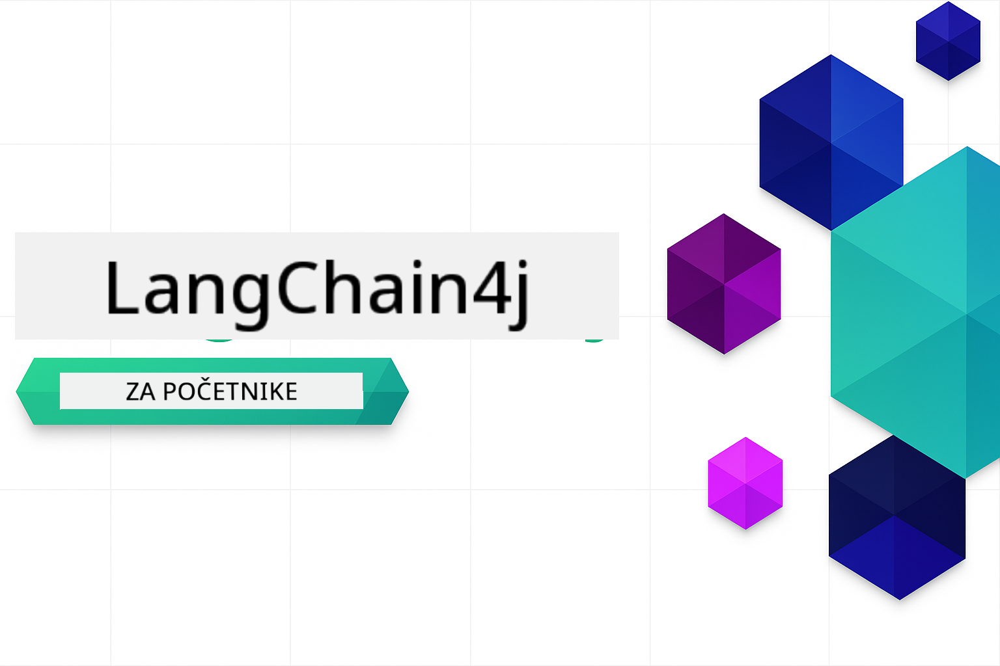

<!--
CO_OP_TRANSLATOR_METADATA:
{
  "original_hash": "e137234b4d3a7fcbbfc93bf17ae8a621",
  "translation_date": "2025-12-19T10:47:12+00:00",
  "source_file": "README.md",
  "language_code": "hr"
}
-->


### 🌐 Podrška za više jezika

#### Podržano putem GitHub Action (Automatizirano i uvijek ažurno)

<!-- CO-OP TRANSLATOR LANGUAGES TABLE START -->
[Arabic](../ar/README.md) | [Bengali](../bn/README.md) | [Bulgarian](../bg/README.md) | [Burmese (Myanmar)](../my/README.md) | [Chinese (Simplified)](../zh/README.md) | [Chinese (Traditional, Hong Kong)](../hk/README.md) | [Chinese (Traditional, Macau)](../mo/README.md) | [Chinese (Traditional, Taiwan)](../tw/README.md) | [Croatian](./README.md) | [Czech](../cs/README.md) | [Danish](../da/README.md) | [Dutch](../nl/README.md) | [Estonian](../et/README.md) | [Finnish](../fi/README.md) | [French](../fr/README.md) | [German](../de/README.md) | [Greek](../el/README.md) | [Hebrew](../he/README.md) | [Hindi](../hi/README.md) | [Hungarian](../hu/README.md) | [Indonesian](../id/README.md) | [Italian](../it/README.md) | [Japanese](../ja/README.md) | [Kannada](../kn/README.md) | [Korean](../ko/README.md) | [Lithuanian](../lt/README.md) | [Malay](../ms/README.md) | [Malayalam](../ml/README.md) | [Marathi](../mr/README.md) | [Nepali](../ne/README.md) | [Nigerian Pidgin](../pcm/README.md) | [Norwegian](../no/README.md) | [Persian (Farsi)](../fa/README.md) | [Polish](../pl/README.md) | [Portuguese (Brazil)](../br/README.md) | [Portuguese (Portugal)](../pt/README.md) | [Punjabi (Gurmukhi)](../pa/README.md) | [Romanian](../ro/README.md) | [Russian](../ru/README.md) | [Serbian (Cyrillic)](../sr/README.md) | [Slovak](../sk/README.md) | [Slovenian](../sl/README.md) | [Spanish](../es/README.md) | [Swahili](../sw/README.md) | [Swedish](../sv/README.md) | [Tagalog (Filipino)](../tl/README.md) | [Tamil](../ta/README.md) | [Telugu](../te/README.md) | [Thai](../th/README.md) | [Turkish](../tr/README.md) | [Ukrainian](../uk/README.md) | [Urdu](../ur/README.md) | [Vietnamese](../vi/README.md)
<!-- CO-OP TRANSLATOR LANGUAGES TABLE END -->

# LangChain4j za početnike

Tečaj za izgradnju AI aplikacija s LangChain4j i Azure OpenAI GPT-5, od osnovnog chata do AI agenata.

**Novi ste u LangChain4j?** Pogledajte [Rječnik](docs/GLOSSARY.md) za definicije ključnih pojmova i koncepata.

## Sadržaj

1. [Brzi početak](00-quick-start/README.md) - Počnite s LangChain4j
2. [Uvod](01-introduction/README.md) - Naučite osnove LangChain4j
3. [Inženjering prompta](02-prompt-engineering/README.md) - Ovladavanje učinkovitim dizajnom prompta
4. [RAG (Retrieval-Augmented Generation)](03-rag/README.md) - Izgradite inteligentne sustave temeljene na znanju
5. [Alati](04-tools/README.md) - Integrirajte vanjske alate i API-je s AI agentima
6. [MCP (Model Context Protocol)](05-mcp/README.md) - Rad s Model Context Protocolom
---

## Put učenja

> **Brzi početak**

1. Forkajte ovaj repozitorij na svoj GitHub račun
2. Kliknite **Code** → karticu **Codespaces** → **...** → **New with options...**
3. Koristite zadane postavke – ovo će odabrati razvojni kontejner kreiran za ovaj tečaj
4. Kliknite **Create codespace**
5. Pričekajte 5-10 minuta da se okruženje pripremi
6. Odmah prijeđite na [Brzi početak](./00-quick-start/README.md) i započnite!

> **Radije klonirati lokalno?**
>
> Ovaj repozitorij uključuje 50+ prijevoda jezika što značajno povećava veličinu preuzimanja. Za kloniranje bez prijevoda, koristite sparse checkout:
> ```bash
> git clone --filter=blob:none --sparse https://github.com/microsoft/LangChain4j-for-Beginners.git
> cd LangChain4j-for-Beginners
> git sparse-checkout set --no-cone '/*' '!translations' '!translated_images'
> ```
> Ovo vam daje sve što vam treba za dovršetak tečaja s mnogo bržim preuzimanjem.

Započnite s modulom [Brzi početak](00-quick-start/README.md) i napredujte kroz svaki modul kako biste korak po korak gradili svoje vještine. Isprobajte osnovne primjere da razumijete osnove prije nego što prijeđete na modul [Uvod](01-introduction/README.md) za dublje upoznavanje s GPT-5.


Nakon završetka modula, istražite [Vodič za testiranje](docs/TESTING.md) da vidite koncepte testiranja LangChain4j u praksi.

> **Napomena:** Ova obuka koristi i GitHub modele i Azure OpenAI. Moduli [Brzi početak](00-quick-start/README.md) i [MCP](05-mcp/README.md) koriste GitHub modele (nije potrebna Azure pretplata), dok moduli 1-4 koriste Azure OpenAI GPT-5.


## Učenje s GitHub Copilotom

Za brzo započinjanje kodiranja, otvorite ovaj projekt u GitHub Codespaceu ili u svom lokalnom IDE-u s priloženim devcontainerom. Devcontainer korišten u ovom tečaju dolazi unaprijed konfiguriran s GitHub Copilotom za AI upareno programiranje.

Svaki primjer koda uključuje predložena pitanja koja možete postaviti GitHub Copilotu za dublje razumijevanje. Potražite 💡/🤖 oznake u:

- **Zaglavlja Java datoteka** - Pitanja specifična za svaki primjer
- **README datoteke modula** - Istraživački upiti nakon primjera koda

**Kako koristiti:** Otvorite bilo koju datoteku s kodom i postavite Copilotu predložena pitanja. Ima puni kontekst baze koda i može objasniti, proširiti i predložiti alternative.

Želite li saznati više? Pogledajte [Copilot za AI upareno programiranje](https://aka.ms/GitHubCopilotAI).


## Dodatni resursi

<!-- CO-OP TRANSLATOR OTHER COURSES START -->
### LangChain
[](https://aka.ms/langchain4j-for-beginners)
[](https://aka.ms/langchainjs-for-beginners?WT.mc_id=m365-94501-dwahlin)

---

### Azure / Edge / MCP / Agenti
[](https://github.com/microsoft/AZD-for-beginners?WT.mc_id=academic-105485-koreyst)
[](https://github.com/microsoft/edgeai-for-beginners?WT.mc_id=academic-105485-koreyst)
[](https://github.com/microsoft/mcp-for-beginners?WT.mc_id=academic-105485-koreyst)
[](https://github.com/microsoft/ai-agents-for-beginners?WT.mc_id=academic-105485-koreyst)

---
 
### Serija generativne AI
[](https://github.com/microsoft/generative-ai-for-beginners?WT.mc_id=academic-105485-koreyst)
[-9333EA?style=for-the-badge&labelColor=E5E7EB&color=9333EA)](https://github.com/microsoft/Generative-AI-for-beginners-dotnet?WT.mc_id=academic-105485-koreyst)
[-C084FC?style=for-the-badge&labelColor=E5E7EB&color=C084FC)](https://github.com/microsoft/generative-ai-for-beginners-java?WT.mc_id=academic-105485-koreyst)
[-E879F9?style=for-the-badge&labelColor=E5E7EB&color=E879F9)](https://github.com/microsoft/generative-ai-with-javascript?WT.mc_id=academic-105485-koreyst)

---
 
### Osnovno učenje
[](https://aka.ms/ml-beginners?WT.mc_id=academic-105485-koreyst)
[](https://aka.ms/datascience-beginners?WT.mc_id=academic-105485-koreyst)
[](https://aka.ms/ai-beginners?WT.mc_id=academic-105485-koreyst)
[](https://github.com/microsoft/Security-101?WT.mc_id=academic-96948-sayoung)
[](https://aka.ms/webdev-beginners?WT.mc_id=academic-105485-koreyst)
[](https://aka.ms/iot-beginners?WT.mc_id=academic-105485-koreyst)
[](https://github.com/microsoft/xr-development-for-beginners?WT.mc_id=academic-105485-koreyst)

---
 
### Serija Copilot
[](https://aka.ms/GitHubCopilotAI?WT.mc_id=academic-105485-koreyst)
[](https://github.com/microsoft/mastering-github-copilot-for-dotnet-csharp-developers?WT.mc_id=academic-105485-koreyst)
[](https://github.com/microsoft/CopilotAdventures?WT.mc_id=academic-105485-koreyst)
<!-- CO-OP TRANSLATOR OTHER COURSES END -->

## Dobivanje pomoći

Ako zapnete ili imate pitanja o izradi AI aplikacija, pridružite se:

[](https://aka.ms/foundry/discord)

Ako imate povratne informacije o proizvodu ili greške tijekom izrade, posjetite:

[](https://aka.ms/foundry/forum)

## Licenca

MIT licenca - Pogledajte datoteku [LICENSE](../../LICENSE) za detalje.

---

<!-- CO-OP TRANSLATOR DISCLAIMER START -->
**Odricanje od odgovornosti**:
Ovaj dokument je preveden korištenjem AI usluge za prevođenje [Co-op Translator](https://github.com/Azure/co-op-translator). Iako nastojimo postići točnost, imajte na umu da automatski prijevodi mogu sadržavati pogreške ili netočnosti. Izvorni dokument na izvornom jeziku treba smatrati autoritativnim izvorom. Za kritične informacije preporučuje se profesionalni ljudski prijevod. Ne snosimo odgovornost za bilo kakva nesporazume ili pogrešna tumačenja koja proizlaze iz korištenja ovog prijevoda.
<!-- CO-OP TRANSLATOR DISCLAIMER END -->