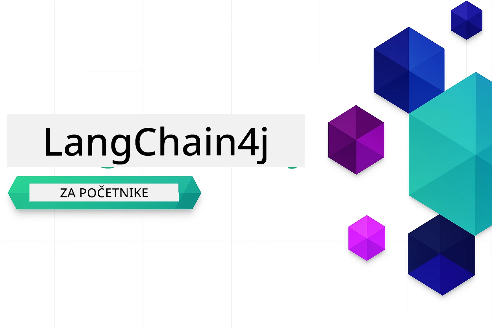

# LangChain4j za početnike

Tečaj za izgradnju AI aplikacija s LangChain4j i Azure OpenAI GPT-5.2, od osnovnog chata do AI agenata.

### 🌐 Podrška za više jezika

#### Podržano putem GitHub Akcije (Automatski i uvijek ažurno)

<!-- CO-OP TRANSLATOR LANGUAGES TABLE START -->
[Arabski](../ar/README.md) | [Bengalski](../bn/README.md) | [Bugarski](../bg/README.md) | [Burmanski (Myanmar)](../my/README.md) | [Kineski (pojednostavljeni)](../zh-CN/README.md) | [Kineski (tradicionalni, Hong Kong)](../zh-HK/README.md) | [Kineski (tradicionalni, Makao)](../zh-MO/README.md) | [Kineski (tradicionalni, Tajvan)](../zh-TW/README.md) | [Hrvatski](./README.md) | [Češki](../cs/README.md) | [Danski](../da/README.md) | [Nizozemski](../nl/README.md) | [Estonski](../et/README.md) | [Finski](../fi/README.md) | [Francuski](../fr/README.md) | [Njemački](../de/README.md) | [Grčki](../el/README.md) | [Hebrejski](../he/README.md) | [Hindi](../hi/README.md) | [Mađarski](../hu/README.md) | [Indonezijski](../id/README.md) | [Talijanski](../it/README.md) | [Japanski](../ja/README.md) | [Kannada](../kn/README.md) | [Khmer](../km/README.md) | [Korejski](../ko/README.md) | [Litavski](../lt/README.md) | [Malajski](../ms/README.md) | [Malajalamski](../ml/README.md) | [Marathi](../mr/README.md) | [Nepalski](../ne/README.md) | [Nigerijski pidžin](../pcm/README.md) | [Norveški](../no/README.md) | [Perzijski (Farsi)](../fa/README.md) | [Poljski](../pl/README.md) | [Portugalski (Brazil)](../pt-BR/README.md) | [Portugalski (Portugal)](../pt-PT/README.md) | [Punjabi (Gurmukhi)](../pa/README.md) | [Rumunjski](../ro/README.md) | [Ruski](../ru/README.md) | [Srpski (ćirilica)](../sr/README.md) | [Slovački](../sk/README.md) | [Slovenski](../sl/README.md) | [Španjolski](../es/README.md) | [Svahili](../sw/README.md) | [Švedski](../sv/README.md) | [Tagalog (Filipino)](../tl/README.md) | [Tamil](../ta/README.md) | [Telugu](../te/README.md) | [Tajlandski](../th/README.md) | [Turski](../tr/README.md) | [Ukrajinski](../uk/README.md) | [Urdu](../ur/README.md) | [Vijetnamski](../vi/README.md)

> **Radije želite klonirati lokalno?**
>
> Ovaj repozitorij uključuje više od 50 prijevoda jezika što znatno povećava veličinu preuzimanja. Za kloniranje bez prijevoda, upotrijebite sparse checkout:
>
> **Bash / macOS / Linux:**
> ```bash
> git clone --filter=blob:none --sparse https://github.com/microsoft/LangChain4j-for-Beginners.git
> cd LangChain4j-for-Beginners
> git sparse-checkout set --no-cone '/*' '!translations' '!translated_images'
> ```
>
> **CMD (Windows):**
> ```cmd
> git clone --filter=blob:none --sparse https://github.com/microsoft/LangChain4j-for-Beginners.git
> cd LangChain4j-for-Beginners
> git sparse-checkout set --no-cone "/*" "!translations" "!translated_images"
> ```
>
> Ovo vam daje sve što trebate za dovršetak tečaja s mnogo bržim preuzimanjem.
<!-- CO-OP TRANSLATOR LANGUAGES TABLE END -->

## Sadržaj

1. [Uvod](01-introduction/README.md) - Naučite osnove LangChain4j
2. [Dizajn upita (Prompt Engineering)](02-prompt-engineering/README.md) - Ovladavanje efektivnim dizajnom upita
3. [RAG (poboljšana generacija)](03-rag/README.md) - Izgradite inteligentne sustave znanja
4. [Alati](04-tools/README.md) - Integrirajte vanjske alate i jednostavne asistente
5. [MCP (Model Context Protocol)](05-mcp/README.md) - Rad s Model Context Protocol (MCP) i agentnim modulima

### Video vodiči

Svaki modul ima prateću live sesiju gdje detaljno prolazimo koncepte i kod korak po korak.

| Modul | Video |
|--------|-------|
| 01 - Uvod | [Početak s LangChain4j](https://www.youtube.com/live/nl_troDm8rQ) |
| 02 - Dizajn upita | [Prompt Engineering s LangChain4j](https://www.youtube.com/live/PJ6aBaE6bog) |
| 03 - RAG | [RAG s LangChain4j](https://www.youtube.com/watch?v=_olq75ZH_eY) |
| 04 - Alati & 05 - MCP | [AI agenti s alatima i MCP](https://www.youtube.com/watch?v=O_J30kZc0rw) |

---

## Put učenja

**Novi ste u LangChain4j?** Pogledajte [Rječnik](docs/GLOSSARY.md) za definicije ključnih pojmova i koncepata.

> **Brzi početak**

1. Napravite fork ovog repozitorija na svoj GitHub račun
2. Kliknite **Code** → karticu **Codespaces** → **...** → **New with options...**
3. Koristite zadane vrijednosti – ovo će odabrati razvojni kontejner kreiran za ovaj tečaj
4. Kliknite **Create codespace**
5. Pričekajte 5-10 minuta da se okruženje pripremi
6. Odmah krenite na [Uvod](./01-introduction/README.md) i započnite!

Nakon dovršetka modula, istražite [Vodič za testiranje](docs/TESTING.md) da vidite koncepte testiranja LangChain4j u praksi.

> **Napomena:** Ova obuka koristi Azure OpenAI. Započnite s [BESPLATNIM Azure računom](https://aka.ms/azure-free-account) ako ga još nemate.


## Učenje s GitHub Copilotom

Da brzo započnete s kodiranjem, otvorite ovaj projekt u GitHub Codespace ili u svom lokalnom IDE-u s priloženim devcontainerom. Devcontainer korišten u ovom tečaju dolazi unaprijed konfiguriran s GitHub Copilotom za AI zajedničko programiranje.

Svaki primjer koda uključuje predložena pitanja koja možete postaviti GitHub Copilotu za dublje razumijevanje. Potražite 💡/🤖 oznake u:

- **Zaglavlja Java datoteka** - Pitanja specifična za svaki primjer
- **READMEs modula** - Poticaji za istraživanje nakon primjera koda

**Kako koristiti:** Otvorite bilo koju datoteku s kodom i postavite Copilotu predložena pitanja. Ima potpuni kontekst baze koda i može objasniti, proširiti i predložiti alternative.

Želite li saznati više? Pogledajte [Copilot za AI zajedničko programiranje](https://aka.ms/GitHubCopilotAI).


## Dodatni resursi

<!-- CO-OP TRANSLATOR OTHER COURSES START -->
### LangChain
[](https://aka.ms/langchain4j-for-beginners)
[](https://aka.ms/langchainjs-for-beginners?WT.mc_id=m365-94501-dwahlin)
[](https://github.com/microsoft/langchain-for-beginners?WT.mc_id=m365-94501-dwahlin)
---

### Azure / Edge / MCP / Agenti
[](https://github.com/microsoft/AZD-for-beginners?WT.mc_id=academic-105485-koreyst)
[](https://github.com/microsoft/edgeai-for-beginners?WT.mc_id=academic-105485-koreyst)
[](https://github.com/microsoft/mcp-for-beginners?WT.mc_id=academic-105485-koreyst)
[](https://github.com/microsoft/ai-agents-for-beginners?WT.mc_id=academic-105485-koreyst)

---
 
### Serija Generativnog AI
[](https://github.com/microsoft/generative-ai-for-beginners?WT.mc_id=academic-105485-koreyst)
[-9333EA?style=for-the-badge&labelColor=E5E7EB&color=9333EA)](https://github.com/microsoft/Generative-AI-for-beginners-dotnet?WT.mc_id=academic-105485-koreyst)
[-C084FC?style=for-the-badge&labelColor=E5E7EB&color=C084FC)](https://github.com/microsoft/generative-ai-for-beginners-java?WT.mc_id=academic-105485-koreyst)
[-E879F9?style=for-the-badge&labelColor=E5E7EB&color=E879F9)](https://github.com/microsoft/generative-ai-with-javascript?WT.mc_id=academic-105485-koreyst)

---
 
### Temeljno učenje
[](https://aka.ms/ml-beginners?WT.mc_id=academic-105485-koreyst)
[](https://aka.ms/datascience-beginners?WT.mc_id=academic-105485-koreyst)
[](https://aka.ms/ai-beginners?WT.mc_id=academic-105485-koreyst)
[](https://github.com/microsoft/Security-101?WT.mc_id=academic-96948-sayoung)
[](https://aka.ms/webdev-beginners?WT.mc_id=academic-105485-koreyst)
[](https://aka.ms/iot-beginners?WT.mc_id=academic-105485-koreyst)
[](https://github.com/microsoft/xr-development-for-beginners?WT.mc_id=academic-105485-koreyst)

---
 
### Serija Copilot
[](https://aka.ms/GitHubCopilotAI?WT.mc_id=academic-105485-koreyst)
[](https://github.com/microsoft/mastering-github-copilot-for-dotnet-csharp-developers?WT.mc_id=academic-105485-koreyst)
[](https://github.com/microsoft/CopilotAdventures?WT.mc_id=academic-105485-koreyst)
<!-- CO-OP TRANSLATOR OTHER COURSES END -->

## Dobivanje pomoći

Ako zapnete ili imate pitanja o izradi AI aplikacija, pridružite se:

[](https://aka.ms/foundry/discord)

Ako imate povratne informacije o proizvodu ili se pojave greške tijekom izrade, posjetite:

[](https://aka.ms/foundry/forum)

## Licenca

MIT licenca - pogledajte datoteku [LICENSE](../../LICENSE) za detalje.

---

<!-- CO-OP TRANSLATOR DISCLAIMER START -->
**Napomena**:
Ovaj dokument je preveden korištenjem AI prevoditeljskog servisa [Co-op Translator](https://github.com/Azure/co-op-translator). Iako težimo točnosti, imajte na umu da automatski prijevodi mogu sadržavati greške ili netočnosti. Izvorni dokument na izvornom jeziku treba smatrati autoritativnim izvorom. Za važne informacije preporuča se profesionalni ljudski prijevod. Nismo odgovorni za bilo kakva nesporazumevanja ili pogrešne interpretacije koje proizlaze iz korištenja ovog prijevoda.
<!-- CO-OP TRANSLATOR DISCLAIMER END -->