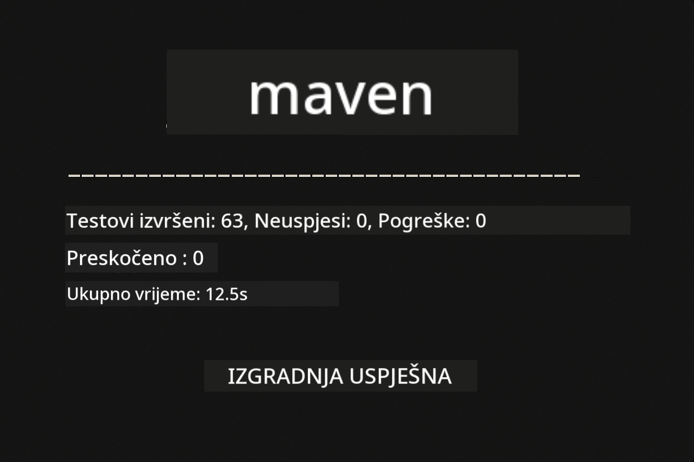
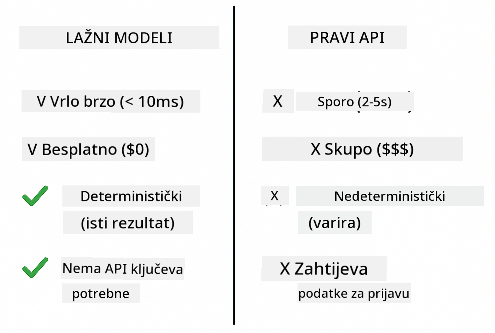
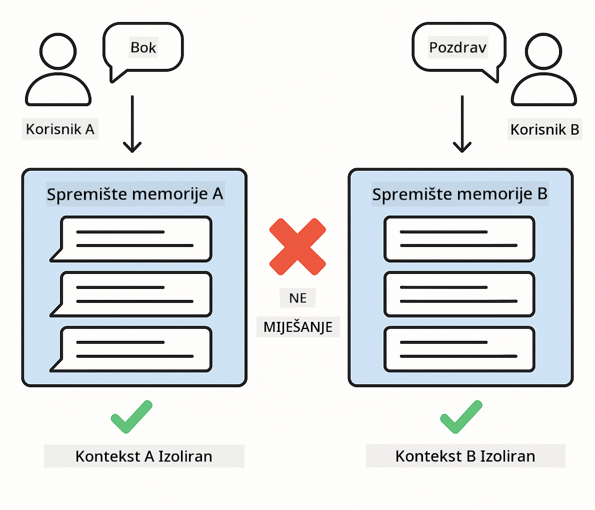

<!--
CO_OP_TRANSLATOR_METADATA:
{
  "original_hash": "ed93b3c14d58734ac10162967da958c1",
  "translation_date": "2025-12-31T05:44:34+00:00",
  "source_file": "docs/TESTING.md",
  "language_code": "hr"
}
-->
# Testiranje LangChain4j aplikacija

## Sadržaj

- [Brzi početak](../../../docs)
- [Što testovi obuhvaćaju](../../../docs)
- [Pokretanje testova](../../../docs)
- [Pokretanje testova u VS Code](../../../docs)
- [Obrasci testiranja](../../../docs)
- [Filozofija testiranja](../../../docs)
- [Sljedeći koraci](../../../docs)

Ovaj vodič vodi vas kroz testove koji pokazuju kako testirati AI aplikacije bez potrebe za API ključevima ili vanjskim servisima.

## Brzi početak

Pokrenite sve testove jednom naredbom:

**Bash:**
```bash
mvn test
```

**PowerShell:**
```powershell
mvn --% test
```



*Uspješno izvršavanje testova koje prikazuje da su svi testovi prošli bez neuspjeha*

## Što testovi obuhvaćaju

Ovaj tečaj fokusira se na **jedinične testove** koji se izvode lokalno. Svaki test demonstrira određeni LangChain4j koncept u izolaciji.


*Piramida testiranja koja prikazuje ravnotežu između jediničnih testova (brzi, izolirani), integracijskih testova (stvarne komponente) i end-to-end testova. Ova obuka pokriva jedinično testiranje.*

| Modul | Testovi | Fokus | Ključne datoteke |
|--------|-------|-------|-----------|
| **00 - Brzi početak** | 6 | Predlošci promptova i zamjena varijabli | `SimpleQuickStartTest.java` |
| **01 - Uvod** | 8 | Memorija konverzacije i chat s održavanjem stanja | `SimpleConversationTest.java` |
| **02 - Prompt Engineering** | 12 | Uzorci GPT-5, razine "eagerness", strukturirani izlaz | `SimpleGpt5PromptTest.java` |
| **03 - RAG** | 10 | Učitavanje dokumenata, embeddings, pretraživanje po sličnosti | `DocumentServiceTest.java` |
| **04 - Alati** | 12 | Pozivanje funkcija i povezivanje alata | `SimpleToolsTest.java` |
| **05 - MCP** | 8 | Model Context Protocol s stdio transportom | `SimpleMcpTest.java` |

## Pokretanje testova

**Pokreni sve testove iz root direktorija:**

**Bash:**
```bash
mvn test
```

**PowerShell:**
```powershell
mvn --% test
```

**Pokreni testove za određeni modul:**

**Bash:**
```bash
cd 01-introduction && mvn test
# Ili kao root
mvn test -pl 01-introduction
```

**PowerShell:**
```powershell
cd 01-introduction; mvn --% test
# Ili iz root-a
mvn --% test -pl 01-introduction
```

**Pokreni jednu test klasu:**

**Bash:**
```bash
mvn test -Dtest=SimpleConversationTest
```

**PowerShell:**
```powershell
mvn --% test -Dtest=SimpleConversationTest
```

**Pokreni određeni test metod:**

**Bash:**
```bash
mvn test -Dtest=SimpleConversationTest#treba održavati povijest razgovora
```

**PowerShell:**
```powershell
mvn --% test -Dtest=SimpleConversationTest#trebao bi održavati povijest razgovora
```

## Pokretanje testova u VS Code

Ako koristite Visual Studio Code, Test Explorer pruža grafičko sučelje za pokretanje i otklanjanje pogrešaka testova.


*VS Code Test Explorer koji prikazuje stablo testova sa svim Java test klasama i pojedinačnim test metodama*

**Za pokretanje testova u VS Codeu:**

1. Otvorite Test Explorer klikom na ikonu epruvete u Activity Baru
2. Proširite stablo testova da vidite sve module i test klase
3. Kliknite gumb za pokretanje pored bilo kojeg testa da ga pokrenete pojedinačno
4. Kliknite "Run All Tests" da izvršite cijeli skup
5. Desni klik na bilo koji test i odaberite "Debug Test" da postavite breakpointe i korak po korak pratite kod

Istraživač testova prikazuje zelene kvačice za uspješne testove i daje detaljne poruke o pogreškama kada testovi padnu.

## Obrasci testiranja

### Obrazac 1: Testiranje predložaka promptova

Najjednostavniji obrazac testira predloške promptova bez pozivanja ikakvog AI modela. Provjeravate da zamjena varijabli radi ispravno i da su promptovi formatirani kako se očekuje.


*Testiranje predložaka prompta koje prikazuje tok zamjene varijabli: predložak s rezerviranim mjestima → primijenjene vrijednosti → provjeren formatirani izlaz*

```java
@Test
@DisplayName("Should format prompt template with variables")
void testPromptTemplateFormatting() {
    PromptTemplate template = PromptTemplate.from(
        "Best time to visit {{destination}} for {{activity}}?"
    );
    
    Prompt prompt = template.apply(Map.of(
        "destination", "Paris",
        "activity", "sightseeing"
    ));
    
    assertThat(prompt.text()).isEqualTo("Best time to visit Paris for sightseeing?");
}
```

Ovaj test se nalazi u `00-quick-start/src/test/java/com/example/langchain4j/quickstart/SimpleQuickStartTest.java`.

**Pokreni ga:**

**Bash:**
```bash
cd 00-quick-start && mvn test -Dtest=SimpleQuickStartTest#testFormatiranjaPredloškaUpita
```

**PowerShell:**
```powershell
cd 00-quick-start; mvn --% test -Dtest=SimpleQuickStartTest#testiranje formatiranja predloška upita
```

### Obrazac 2: Mockiranje jezičnih modela

Prilikom testiranja logike razgovora koristite Mockito za stvaranje lažnih modela koji vraćaju unaprijed određene odgovore. To čini testove brzim, besplatnim i determinističkim.



*Usporedba koja pokazuje zašto su mockovi preferirani za testiranje: brzi su, besplatni, deterministični i ne zahtijevaju API ključeve*

```java
@ExtendWith(MockitoExtension.class)
class SimpleConversationTest {
    
    private ConversationService conversationService;
    
    @Mock
    private OpenAiOfficialChatModel mockChatModel;
    
    @BeforeEach
    void setUp() {
        ChatResponse mockResponse = ChatResponse.builder()
            .aiMessage(AiMessage.from("This is a test response"))
            .build();
        when(mockChatModel.chat(anyList())).thenReturn(mockResponse);
        
        conversationService = new ConversationService(mockChatModel);
    }
    
    @Test
    void shouldMaintainConversationHistory() {
        String conversationId = conversationService.startConversation();
        
        ChatResponse mockResponse1 = ChatResponse.builder()
            .aiMessage(AiMessage.from("Response 1"))
            .build();
        ChatResponse mockResponse2 = ChatResponse.builder()
            .aiMessage(AiMessage.from("Response 2"))
            .build();
        ChatResponse mockResponse3 = ChatResponse.builder()
            .aiMessage(AiMessage.from("Response 3"))
            .build();
        
        when(mockChatModel.chat(anyList()))
            .thenReturn(mockResponse1)
            .thenReturn(mockResponse2)
            .thenReturn(mockResponse3);

        conversationService.chat(conversationId, "First message");
        conversationService.chat(conversationId, "Second message");
        conversationService.chat(conversationId, "Third message");

        List<ChatMessage> history = conversationService.getHistory(conversationId);
        assertThat(history).hasSize(6); // 3 poruke korisnika + 3 AI poruke
    }
}
```

Ovaj obrazac se pojavljuje u `01-introduction/src/test/java/com/example/langchain4j/service/SimpleConversationTest.java`. Mock osigurava konzistentno ponašanje tako da možete provjeriti ispravno upravljanje memorijom.

### Obrazac 3: Testiranje izolacije razgovora

Memorija konverzacije mora držati više korisnika odvojenima. Ovaj test provjerava da se konteksti razgovora ne miješaju.



*Testiranje izolacije razgovaja koje prikazuje odvojene spremišta memorije za različite korisnike kako bi se spriječilo miješanje konteksta*

```java
@Test
void shouldIsolateConversationsByid() {
    String conv1 = conversationService.startConversation();
    String conv2 = conversationService.startConversation();
    
    ChatResponse mockResponse = ChatResponse.builder()
        .aiMessage(AiMessage.from("Response"))
        .build();
    when(mockChatModel.chat(anyList())).thenReturn(mockResponse);

    conversationService.chat(conv1, "Message for conversation 1");
    conversationService.chat(conv2, "Message for conversation 2");

    List<ChatMessage> history1 = conversationService.getHistory(conv1);
    List<ChatMessage> history2 = conversationService.getHistory(conv2);
    
    assertThat(history1).hasSize(2);
    assertThat(history2).hasSize(2);
}
```

Svaka konverzacija održava vlastitu neovisnu povijest. U proizvodnim sustavima ta je izolacija kritična za aplikacije s više korisnika.

### Obrazac 4: Testiranje alata neovisno

Alati su funkcije koje AI može pozvati. Testirajte ih izravno kako biste bili sigurni da rade ispravno bez obzira na odluke AI-ja.


*Neovisno testiranje alata koje prikazuje izvršavanje mock alata bez AI poziva kako bi se provjerila poslovna logika*

```java
@Test
void shouldConvertCelsiusToFahrenheit() {
    TemperatureTool tempTool = new TemperatureTool();
    String result = tempTool.celsiusToFahrenheit(25.0);
    assertThat(result).containsPattern("77[.,]0°F");
}

@Test
void shouldDemonstrateToolChaining() {
    WeatherTool weatherTool = new WeatherTool();
    TemperatureTool tempTool = new TemperatureTool();

    String weatherResult = weatherTool.getCurrentWeather("Seattle");
    assertThat(weatherResult).containsPattern("\\d+°C");

    String conversionResult = tempTool.celsiusToFahrenheit(22.0);
    assertThat(conversionResult).containsPattern("71[.,]6°F");
}
```

Ovi testovi iz `04-tools/src/test/java/com/example/langchain4j/agents/tools/SimpleToolsTest.java` provjeravaju logiku alata bez uključivanja AI-ja. Primjer povezivanja pokazuje kako izlaz jednog alata ulazi kao ulaz drugog.

### Obrazac 5: RAG testiranje u memoriji

RAG sustavi tradicionalno zahtijevaju vektorske baze podataka i servis za embeddinge. Obrazac u memoriji omogućuje testiranje cijelog pipelinea bez vanjskih ovisnosti.


*RAG testiranje u memoriji koje prikazuje parsiranje dokumenata, pohranu embeddinga i pretraživanje po sličnosti bez potrebe za bazom podataka*

```java
@Test
void testProcessTextDocument() {
    String content = "This is a test document.\nIt has multiple lines.";
    InputStream inputStream = new ByteArrayInputStream(content.getBytes(StandardCharsets.UTF_8));
    
    DocumentService.ProcessedDocument result = 
        documentService.processDocument(inputStream, "test.txt");

    assertNotNull(result);
    assertTrue(result.segments().size() > 0);
    assertEquals("test.txt", result.segments().get(0).metadata().getString("filename"));
}
```

Ovaj test iz `03-rag/src/test/java/com/example/langchain4j/rag/service/DocumentServiceTest.java` stvara dokument u memoriji i provjerava chunking i rukovanje metapodacima.

### Obrazac 6: MCP integracijsko testiranje

MCP modul testira integraciju Model Context Protocol-a koristeći stdio transport. Ovi testovi provjeravaju da vaša aplikacija može spawnati i komunicirati s MCP serverima kao podprocesima.

Testovi u `05-mcp/src/test/java/com/example/langchain4j/mcp/SimpleMcpTest.java` provjeravaju ponašanje MCP klijenta.

**Pokreni ih:**

**Bash:**
```bash
cd 05-mcp && mvn test
```

**PowerShell:**
```powershell
cd 05-mcp; mvn --% test
```

## Filozofija testiranja

Testirajte svoj kod, ne AI. Vaši testovi trebaju validirati kod koji napišete provjeravajući kako su prompti konstruirani, kako se upravlja memorijom i kako se izvršavaju alati. AI odgovori variraju i ne bi trebali biti dio tvrdnji u testovima. Zapitajte se je li vaš predložak prompta ispravno zamijenio varijable, a ne daje li AI ispravan odgovor.

Koristite mockove za jezične modele. Oni su vanjski ovisnici koji su spori, skupi i nedeterministični. Mockiranje čini testove brzim s milisekundama umjesto sekundi, besplatnim bez troškova API-ja i determinističnim s istim rezultatom svaki put.

Držite testove neovisnima. Svaki test bi trebao postaviti vlastite podatke, ne oslanjati se na druge testove i očistiti za sobom. Testovi bi trebali prolaziti neovisno o redoslijedu izvođenja.

Testirajte rubne slučajeve izvan sretnog puta. Isprobajte prazne ulaze, vrlo velike ulaze, posebne znakove, nevažeće parametre i granične uvjete. Oni često otkrivaju bugove koje normalna uporaba ne otkriva.

Koristite opisne nazive. Usporedite shouldMaintainConversationHistoryAcrossMultipleMessages() s test1(). Prvi vam točno govori što se testira, olakšavajući otklanjanje pogrešaka kada test padne.

## Sljedeći koraci

Sada kada razumijete obrasce testiranja, uronite dublje u svaki modul:

- **[00 - Brzi početak](../00-quick-start/README.md)** - Počnite s osnovama predložaka promptova
- **[01 - Uvod](../01-introduction/README.md)** - Naučite upravljanje memorijom konverzacije
- **[02 - Prompt Engineering](../02-prompt-engineering/README.md)** - Svladajte GPT-5 obrasce za promptanje
- **[03 - RAG](../03-rag/README.md)** - Izgradite sustave s retrieval-augmented generation
- **[04 - Alati](../04-tools/README.md)** - Implementirajte pozivanje funkcija i lance alata
- **[05 - MCP](../05-mcp/README.md)** - Integrirajte Model Context Protocol

README svakog modula pruža detaljna objašnjenja koncepata testiranih ovdje.

---

**Navigacija:** [← Natrag na početak](../README.md)

---

<!-- CO-OP TRANSLATOR DISCLAIMER START -->
Odricanje odgovornosti:
Ovaj dokument preveden je pomoću AI usluge prevođenja [Co-op Translator](https://github.com/Azure/co-op-translator). Iako nastojimo postići točnost, imajte na umu da automatski prijevodi mogu sadržavati pogreške ili netočnosti. Izvorni dokument na njegovu izvornom jeziku treba smatrati autoritativnim izvorom. Za kritične informacije preporučuje se profesionalni ljudski prijevod. Ne snosimo odgovornost za bilo kakve nesporazume ili krive interpretacije koje proizlaze iz upotrebe ovog prijevoda.
<!-- CO-OP TRANSLATOR DISCLAIMER END -->