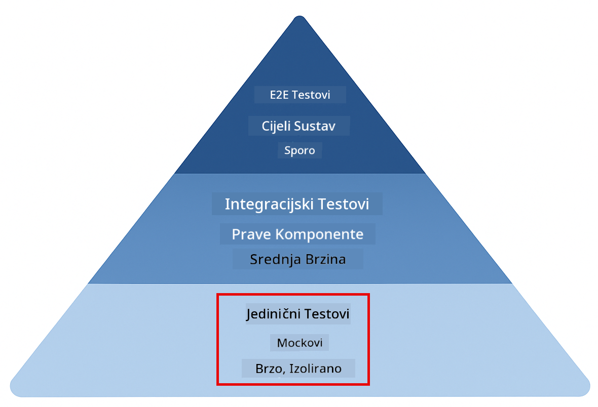
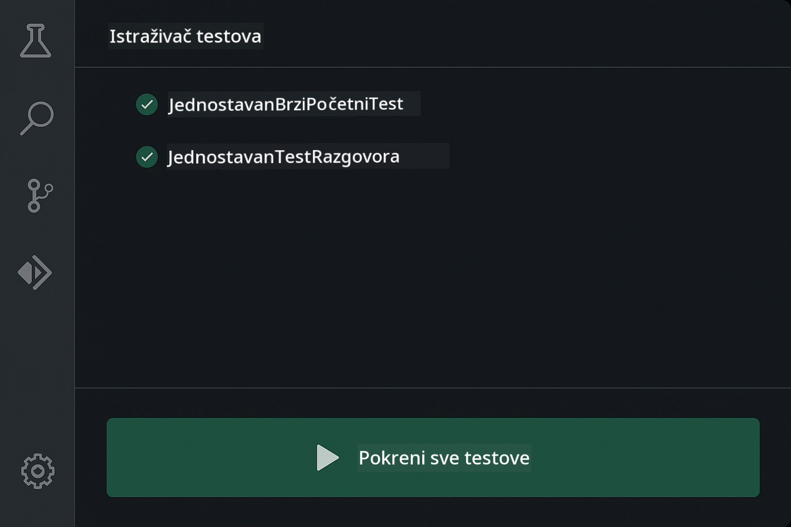
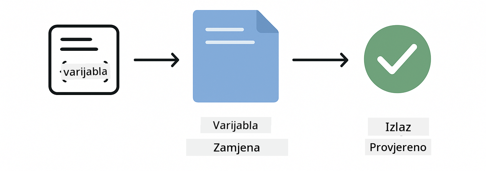
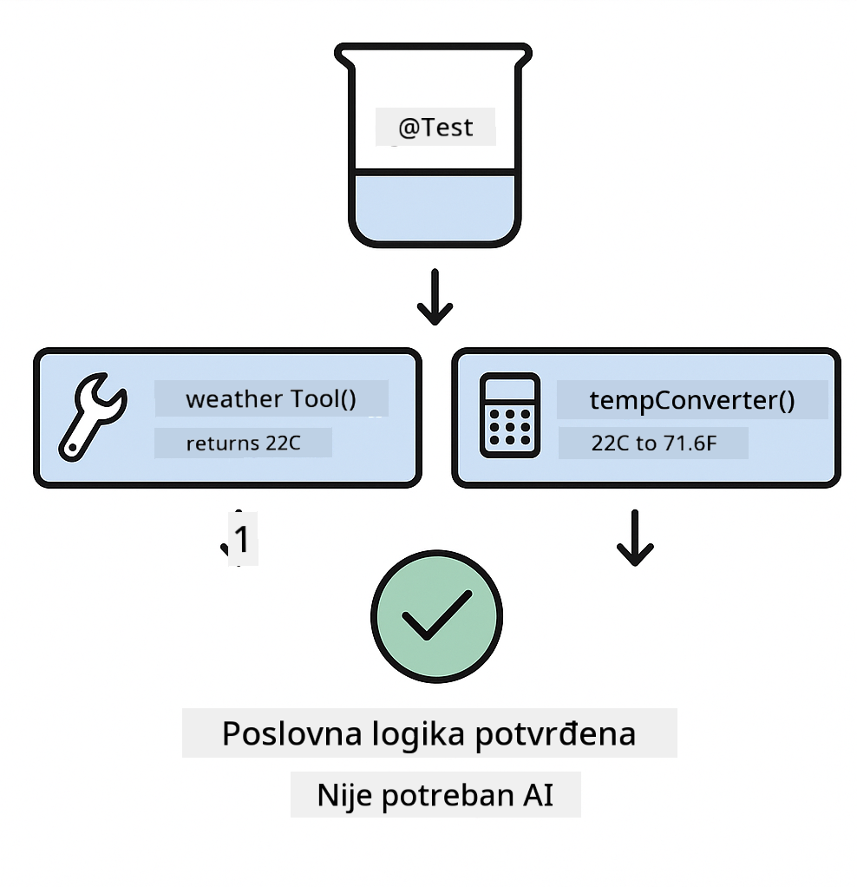
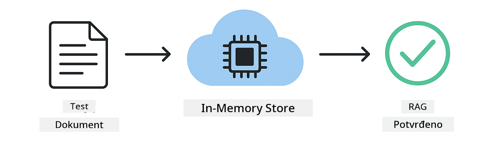

<!--
CO_OP_TRANSLATOR_METADATA:
{
  "original_hash": "b975537560c404d5f254331832811e78",
  "translation_date": "2025-12-13T21:26:44+00:00",
  "source_file": "docs/TESTING.md",
  "language_code": "hr"
}
-->
# Testiranje LangChain4j aplikacija

## Sadržaj

- [Brzi početak](../../../docs)
- [Što testovi pokrivaju](../../../docs)
- [Pokretanje testova](../../../docs)
- [Pokretanje testova u VS Codeu](../../../docs)
- [Obrasci testiranja](../../../docs)
- [Filozofija testiranja](../../../docs)
- [Sljedeći koraci](../../../docs)

Ovaj vodič vodi vas kroz testove koji pokazuju kako testirati AI aplikacije bez potrebe za API ključevima ili vanjskim uslugama.

## Brzi početak

Pokrenite sve testove jednom naredbom:

**Bash:**
```bash
mvn test
```

**PowerShell:**
```powershell
mvn --% test
```


*Uspješno izvršavanje testova koje pokazuje da su svi testovi prošli bez grešaka*

## Što testovi pokrivaju

Ovaj tečaj se fokusira na **jedinične testove** koji se izvode lokalno. Svaki test demonstrira određeni LangChain4j koncept u izolaciji.



*Piramida testiranja koja prikazuje ravnotežu između jediničnih testova (brzi, izolirani), integracijskih testova (stvarne komponente) i end-to-end testova (cijeli sustav s Dockerom). Ova obuka pokriva jedinično testiranje.*

| Modul | Testovi | Fokus | Ključne datoteke |
|--------|-------|-------|-----------|
| **00 - Brzi početak** | 6 | Predlošci upita i zamjena varijabli | `SimpleQuickStartTest.java` |
| **01 - Uvod** | 8 | Memorija razgovora i stanje chata | `SimpleConversationTest.java` |
| **02 - Inženjering upita** | 12 | GPT-5 obrasci, razine želje, strukturirani izlaz | `SimpleGpt5PromptTest.java` |
| **03 - RAG** | 10 | Učitavanje dokumenata, ugradnje, pretraživanje sličnosti | `DocumentServiceTest.java` |
| **04 - Alati** | 12 | Pozivanje funkcija i povezivanje alata | `SimpleToolsTest.java` |
| **05 - MCP** | 15 | Model Context Protocol s Dockerom | `SimpleMcpTest.java`, `McpDockerTransportTest.java` |

## Pokretanje testova

**Pokrenite sve testove iz korijena:**

**Bash:**
```bash
mvn test
```

**PowerShell:**
```powershell
mvn --% test
```

**Pokrenite testove za određeni modul:**

**Bash:**
```bash
cd 01-introduction && mvn test
# Ili iz korijena
mvn test -pl 01-introduction
```

**PowerShell:**
```powershell
cd 01-introduction; mvn --% test
# Ili iz korijena
mvn --% test -pl 01-introduction
```

**Pokrenite pojedinačnu test klasu:**

**Bash:**
```bash
mvn test -Dtest=SimpleConversationTest
```

**PowerShell:**
```powershell
mvn --% test -Dtest=SimpleConversationTest
```

**Pokrenite određenu test metodu:**

**Bash:**
```bash
mvn test -Dtest=SimpleConversationTest#trebaOdržavatiPovijestRazgovora
```

**PowerShell:**
```powershell
mvn --% test -Dtest=SimpleConversationTest#trebaOdržavatiPovijestRazgovora
```

## Pokretanje testova u VS Codeu

Ako koristite Visual Studio Code, Test Explorer pruža grafičko sučelje za pokretanje i otklanjanje pogrešaka testova.



*VS Code Test Explorer prikazuje stablo testova sa svim Java test klasama i pojedinačnim test metodama*

**Za pokretanje testova u VS Codeu:**

1. Otvorite Test Explorer klikom na ikonu epruvete u Activity Baru
2. Proširite stablo testova da vidite sve module i test klase
3. Kliknite na gumb za reprodukciju pored bilo kojeg testa da ga pokrenete pojedinačno
4. Kliknite "Run All Tests" za izvršavanje cijelog skupa
5. Desni klik na bilo koji test i odaberite "Debug Test" za postavljanje točaka prekida i korak po korak pregled koda

Test Explorer prikazuje zelene kvačice za uspješne testove i daje detaljne poruke o pogreškama kada testovi ne uspiju.

## Obrasci testiranja


*Šest obrazaca testiranja za LangChain4j aplikacije: predlošci upita, lažni modeli, izolacija razgovora, testiranje alata, RAG u memoriji i Docker integracija*

### Obrazac 1: Testiranje predložaka upita

Najjednostavniji obrazac testira predloške upita bez pozivanja bilo kojeg AI modela. Provjeravate da zamjena varijabli radi ispravno i da su upiti formatirani kako se očekuje.



*Testiranje predložaka upita koje prikazuje tijek zamjene varijabli: predložak s rezerviranim mjestima → primijenjene vrijednosti → provjeren formatirani izlaz*

```java
@Test
@DisplayName("Should format prompt template with variables")
void testPromptTemplateFormatting() {
    PromptTemplate template = PromptTemplate.from(
        "Best time to visit {{destination}} for {{activity}}?"
    );
    
    Prompt prompt = template.apply(Map.of(
        "destination", "Paris",
        "activity", "sightseeing"
    ));
    
    assertThat(prompt.text()).isEqualTo("Best time to visit Paris for sightseeing?");
}
```

Ovaj test se nalazi u `00-quick-start/src/test/java/com/example/langchain4j/quickstart/SimpleQuickStartTest.java`.

**Pokrenite ga:**

**Bash:**
```bash
cd 00-quick-start && mvn test -Dtest=SimpleQuickStartTest#testiranjeFormatiranjaPredloškaUpita
```

**PowerShell:**
```powershell
cd 00-quick-start; mvn --% test -Dtest=SimpleQuickStartTest#testiranjeFormatiranjaPredloškaUpita
```

### Obrazac 2: Lažni jezični modeli

Kod testiranja logike razgovora, koristite Mockito za stvaranje lažnih modela koji vraćaju unaprijed određene odgovore. To čini testove brzim, besplatnim i determinističkim.


*Usporedba koja pokazuje zašto su lažni modeli poželjniji za testiranje: brzi su, besplatni, deterministički i ne zahtijevaju API ključeve*

```java
@ExtendWith(MockitoExtension.class)
class SimpleConversationTest {
    
    private ConversationService conversationService;
    
    @Mock
    private OpenAiOfficialChatModel mockChatModel;
    
    @BeforeEach
    void setUp() {
        ChatResponse mockResponse = ChatResponse.builder()
            .aiMessage(AiMessage.from("This is a test response"))
            .build();
        when(mockChatModel.chat(anyList())).thenReturn(mockResponse);
        
        conversationService = new ConversationService(mockChatModel);
    }
    
    @Test
    void shouldMaintainConversationHistory() {
        String conversationId = conversationService.startConversation();
        
        ChatResponse mockResponse1 = ChatResponse.builder()
            .aiMessage(AiMessage.from("Response 1"))
            .build();
        ChatResponse mockResponse2 = ChatResponse.builder()
            .aiMessage(AiMessage.from("Response 2"))
            .build();
        ChatResponse mockResponse3 = ChatResponse.builder()
            .aiMessage(AiMessage.from("Response 3"))
            .build();
        
        when(mockChatModel.chat(anyList()))
            .thenReturn(mockResponse1)
            .thenReturn(mockResponse2)
            .thenReturn(mockResponse3);

        conversationService.chat(conversationId, "First message");
        conversationService.chat(conversationId, "Second message");
        conversationService.chat(conversationId, "Third message");

        List<ChatMessage> history = conversationService.getHistory(conversationId);
        assertThat(history).hasSize(6); // 3 korisnička + 3 AI poruke
    }
}
```

Ovaj obrazac se pojavljuje u `01-introduction/src/test/java/com/example/langchain4j/service/SimpleConversationTest.java`. Lažni model osigurava dosljedno ponašanje kako biste mogli provjeriti ispravno upravljanje memorijom.

### Obrazac 3: Testiranje izolacije razgovora

Memorija razgovora mora držati više korisnika odvojenima. Ovaj test provjerava da se konteksti razgovora ne miješaju.


*Testiranje izolacije razgovora koje prikazuje odvojene memorijske pohrane za različite korisnike kako bi se spriječilo miješanje konteksta*

```java
@Test
void shouldIsolateConversationsByid() {
    String conv1 = conversationService.startConversation();
    String conv2 = conversationService.startConversation();
    
    ChatResponse mockResponse = ChatResponse.builder()
        .aiMessage(AiMessage.from("Response"))
        .build();
    when(mockChatModel.chat(anyList())).thenReturn(mockResponse);

    conversationService.chat(conv1, "Message for conversation 1");
    conversationService.chat(conv2, "Message for conversation 2");

    List<ChatMessage> history1 = conversationService.getHistory(conv1);
    List<ChatMessage> history2 = conversationService.getHistory(conv2);
    
    assertThat(history1).hasSize(2);
    assertThat(history2).hasSize(2);
}
```

Svaki razgovor održava vlastitu neovisnu povijest. U produkcijskim sustavima, ta izolacija je ključna za aplikacije s više korisnika.

### Obrazac 4: Nezavisno testiranje alata

Alati su funkcije koje AI može pozvati. Testirajte ih izravno kako biste osigurali da rade ispravno bez obzira na AI odluke.



*Nezavisno testiranje alata koje prikazuje izvršavanje lažnog alata bez AI poziva za provjeru poslovne logike*

```java
@Test
void shouldConvertCelsiusToFahrenheit() {
    TemperatureTool tempTool = new TemperatureTool();
    String result = tempTool.celsiusToFahrenheit(25.0);
    assertThat(result).containsPattern("77[.,]0°F");
}

@Test
void shouldDemonstrateToolChaining() {
    WeatherTool weatherTool = new WeatherTool();
    TemperatureTool tempTool = new TemperatureTool();

    String weatherResult = weatherTool.getCurrentWeather("Seattle");
    assertThat(weatherResult).containsPattern("\\d+°C");

    String conversionResult = tempTool.celsiusToFahrenheit(22.0);
    assertThat(conversionResult).containsPattern("71[.,]6°F");
}
```

Ovi testovi iz `04-tools/src/test/java/com/example/langchain4j/agents/tools/SimpleToolsTest.java` potvrđuju logiku alata bez uključivanja AI. Primjer povezivanja pokazuje kako izlaz jednog alata ulazi kao ulaz drugog.

### Obrazac 5: RAG testiranje u memoriji

RAG sustavi tradicionalno zahtijevaju vektorske baze podataka i usluge ugradnje. Obrazac u memoriji omogućuje testiranje cijelog procesa bez vanjskih ovisnosti.



*Radni tijek RAG testiranja u memoriji koji prikazuje parsiranje dokumenata, pohranu ugradnji i pretraživanje sličnosti bez potrebe za bazom podataka*

```java
@Test
void testProcessTextDocument() {
    String content = "This is a test document.\nIt has multiple lines.";
    InputStream inputStream = new ByteArrayInputStream(content.getBytes(StandardCharsets.UTF_8));
    
    DocumentService.ProcessedDocument result = 
        documentService.processDocument(inputStream, "test.txt");

    assertNotNull(result);
    assertTrue(result.segments().size() > 0);
    assertEquals("test.txt", result.segments().get(0).metadata().getString("filename"));
}
```

Ovaj test iz `03-rag/src/test/java/com/example/langchain4j/rag/service/DocumentServiceTest.java` stvara dokument u memoriji i provjerava dijeljenje i rukovanje metapodacima.

### Obrazac 6: Integracijsko testiranje s Dockerom

Neke značajke zahtijevaju stvarnu infrastrukturu. MCP modul koristi Testcontainers za pokretanje Docker kontejnera za integracijske testove. Oni potvrđuju da vaš kod radi sa stvarnim uslugama uz održavanje izolacije testova.


*Integracijsko testiranje MCP-a s Testcontainers koje prikazuje automatizirani životni ciklus kontejnera: pokretanje, izvršavanje testa, zaustavljanje i čišćenje*

Testovi u `05-mcp/src/test/java/com/example/langchain4j/mcp/McpDockerTransportTest.java` zahtijevaju da Docker radi.

**Pokrenite ih:**

**Bash:**
```bash
cd 05-mcp && mvn test
```

**PowerShell:**
```powershell
cd 05-mcp; mvn --% test
```

## Filozofija testiranja

Testirajte svoj kod, ne AI. Vaši testovi trebaju potvrditi kod koji pišete provjeravajući kako se upiti konstruiraju, kako se upravlja memorijom i kako se izvršavaju alati. AI odgovori variraju i ne bi trebali biti dio testnih tvrdnji. Pitajte se radi li vaš predložak upita ispravno zamjenu varijabli, a ne daje li AI točan odgovor.

Koristite lažne modele za jezik. Oni su vanjske ovisnosti koje su spore, skupe i nedeterminističke. Lažno modeliranje čini testove brzim s milisekundama umjesto sekundi, besplatnim bez troškova API-ja i determinističkim s istim rezultatom svaki put.

Održavajte testove neovisnima. Svaki test treba postaviti vlastite podatke, ne oslanjati se na druge testove i očistiti nakon sebe. Testovi trebaju prolaziti bez obzira na redoslijed izvođenja.

Testirajte rubne slučajeve izvan sretnih putanja. Isprobajte prazne ulaze, vrlo velike ulaze, posebne znakove, nevažeće parametre i granične uvjete. Oni često otkrivaju greške koje normalna upotreba ne otkriva.

Koristite opisna imena. Usporedite `shouldMaintainConversationHistoryAcrossMultipleMessages()` s `test1()`. Prvo vam točno govori što se testira, što olakšava otklanjanje pogrešaka.

## Sljedeći koraci

Sada kada razumijete obrasce testiranja, zaronite dublje u svaki modul:

- **[00 - Brzi početak](../00-quick-start/README.md)** - Počnite s osnovama predložaka upita
- **[01 - Uvod](../01-introduction/README.md)** - Naučite upravljanje memorijom razgovora
- **[02 - Inženjering upita](../02-prompt-engineering/README.md)** - Ovladavanje GPT-5 obrascima upita
- **[03 - RAG](../03-rag/README.md)** - Izgradnja sustava za generiranje s podrškom pretraživanja
- **[04 - Alati](../04-tools/README.md)** - Implementacija pozivanja funkcija i lanaca alata
- **[05 - MCP](../05-mcp/README.md)** - Integracija Model Context Protocol s Dockerom

README svakog modula pruža detaljna objašnjenja koncepata testiranih ovdje.

---

**Navigacija:** [← Natrag na početak](../README.md)

---

<!-- CO-OP TRANSLATOR DISCLAIMER START -->
**Odricanje od odgovornosti**:
Ovaj dokument preveden je pomoću AI usluge za prevođenje [Co-op Translator](https://github.com/Azure/co-op-translator). Iako nastojimo postići točnost, imajte na umu da automatski prijevodi mogu sadržavati pogreške ili netočnosti. Izvorni dokument na izvornom jeziku treba smatrati autoritativnim izvorom. Za kritične informacije preporučuje se profesionalni ljudski prijevod. Ne snosimo odgovornost za bilo kakva nesporazuma ili pogrešna tumačenja koja proizlaze iz korištenja ovog prijevoda.
<!-- CO-OP TRANSLATOR DISCLAIMER END -->