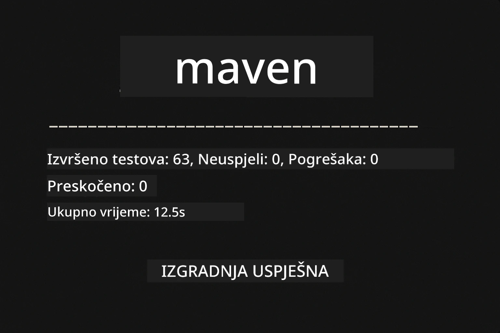
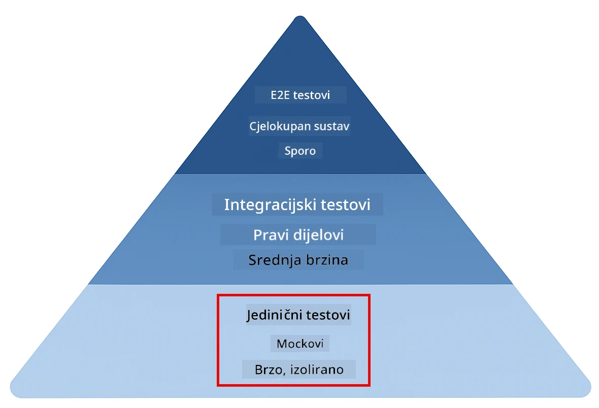
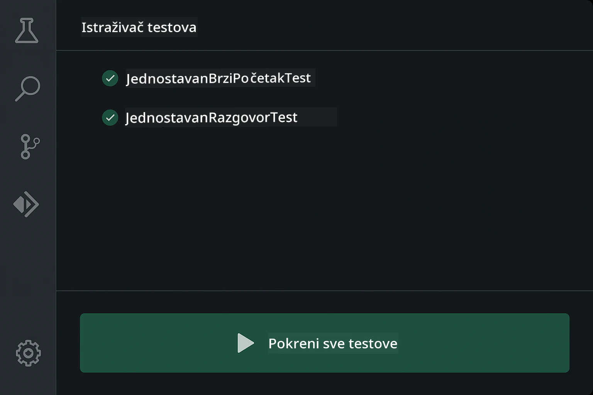
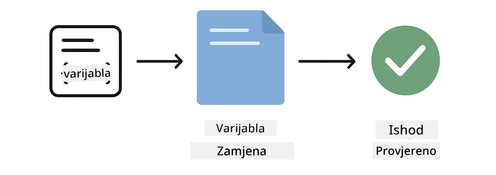
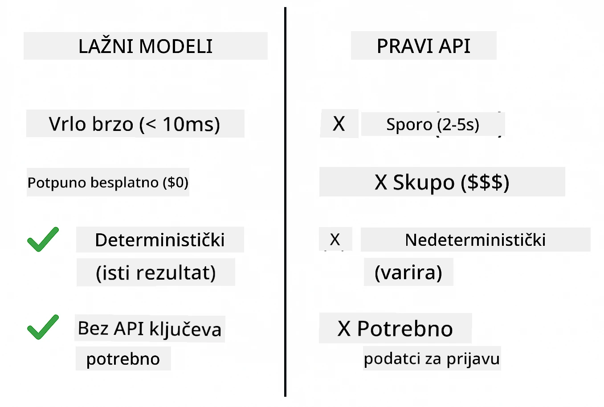
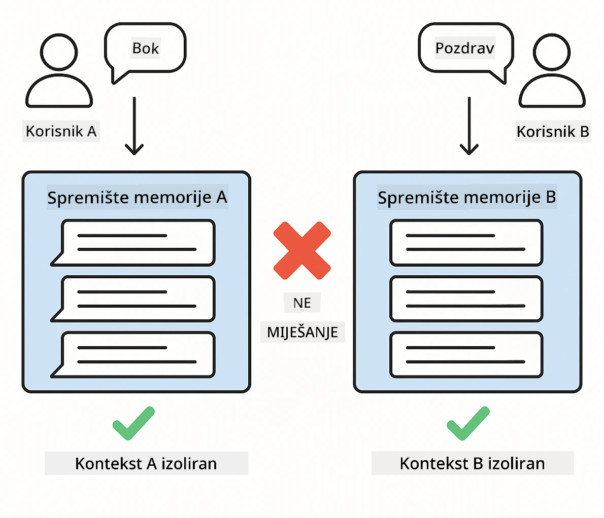
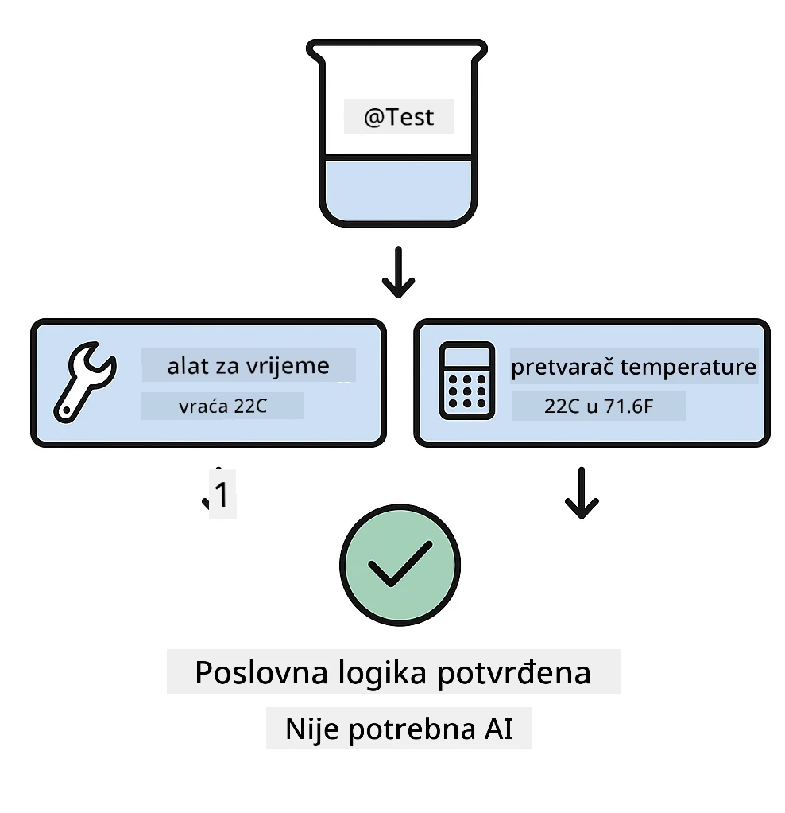
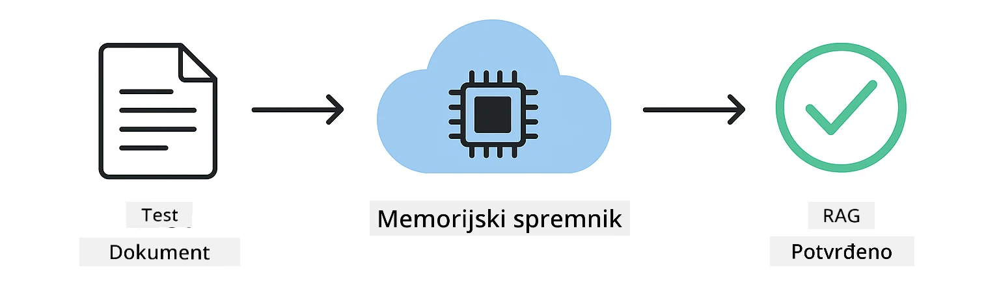

# Testiranje LangChain4j aplikacija

## Sadržaj

- [Brzi početak](#brzi-početak)
- [Što testovi pokrivaju](#što-testovi-pokrivaju)
- [Pokretanje testova](#pokretanje-testova)
- [Pokretanje testova u VS Codeu](#pokretanje-testova-u-vs-codeu)
- [Obrasci testiranja](#obrasci-testiranja)
- [Filozofija testiranja](#filozofija-testiranja)
- [Sljedeći koraci](#sljedeći-koraci)

Ovaj vodič vodi vas kroz testove koji pokazuju kako testirati AI aplikacije bez potrebe za API ključevima ili vanjskim uslugama.

## Brzi početak

Pokrenite sve testove jednom naredbom:

**Bash:**
```bash
mvn test
```

**PowerShell:**
```powershell
mvn --% test
```

Kada svi testovi prođu, trebali biste vidjeti izlaz poput zaslonske snimke ispod — testovi su pokrenuti bez pogrešaka.



*Uspješno izvršavanje testova koje pokazuje da svi testovi prolaze bez pogrešaka*

## Što testovi pokrivaju

Ovaj tečaj fokusira se na **jedinične testove** koji se izvode lokalno. Svaki test prikazuje specifičan LangChain4j koncept u izolaciji. Prikazana je piramida testiranja koja pokazuje gdje se uklapaju jedinični testovi — oni čine brzu, pouzdanu osnovu na kojoj se gradi ostatak vaše test strategije.



*Piramida testiranja koja pokazuje ravnotežu između jediničnih testova (brzi, izolirani), integracijskih testova (stvarne komponente) i end-to-end testova. Ova obuka pokriva jedinično testiranje.*

| Modul | Testovi | Fokus | Ključne Datoteke |
|--------|---------|-------|------------------|
| **01 - Uvod** | 8 | Memorija razgovora i stanje chat-a | `SimpleConversationTest.java` |
| **02 - Izrada prompta** | 12 | GPT-5.2 obrasci, razine spremnosti, strukturirani izlaz | `SimpleGpt5PromptTest.java` |
| **03 - RAG** | 10 | Učitavanje dokumenata, embeddings, pretraživanje sličnosti | `DocumentServiceTest.java` |
| **04 - Alati** | 12 | Pozivanje funkcija i lančanje alata | `SimpleToolsTest.java` |
| **05 - MCP** | 8 | Model Context Protocol sa stdio transportom | `SimpleMcpTest.java` |

## Pokretanje testova

**Pokrenite sve testove iz korijena:**

**Bash:**
```bash
mvn test
```

**PowerShell:**
```powershell
mvn --% test
```

**Pokrenite testove za određeni modul:**

**Bash:**
```bash
cd 01-introduction && mvn test
# Ili iz korijena
mvn test -pl 01-introduction
```

**PowerShell:**
```powershell
cd 01-introduction; mvn --% test
# Ili iz korijena
mvn --% test -pl 01-introduction
```

**Pokrenite jednu test klasu:**

**Bash:**
```bash
mvn test -Dtest=SimpleConversationTest
```

**PowerShell:**
```powershell
mvn --% test -Dtest=SimpleConversationTest
```

**Pokrenite specifičnu test metodu:**

**Bash:**
```bash
mvn test -Dtest=SimpleConversationTest#trebaOdržavatiPovijestRazgovora
```

**PowerShell:**
```powershell
mvn --% test -Dtest=SimpleConversationTest#trebaOdržavatiPovijestRazgovora
```

## Pokretanje testova u VS Codeu

Ako koristite Visual Studio Code, Test Explorer pruža grafičko sučelje za pokretanje i ispravljanje testova.



*VS Code Test Explorer koji prikazuje test stablo sa svim Java test klasama i pojedinačnim test metodama*

**Za pokretanje testova u VS Codeu:**

1. Otvorite Test Explorer klikom na ikonu epruvete u trakci aktivnosti
2. Proširite stablo testova da vidite sve module i test klase
3. Kliknite gumb za pokretanje pokraj bilo kojeg testa da ga pojedinačno pokrenete
4. Kliknite "Run All Tests" za izvršenje cijelog skupa
5. Desni klik na bilo koji test i odaberite "Debug Test" za postavljanje točaka prekida i korak po korak praćenje koda

Test Explorer prikazuje zelene kvačice za prolazne testove i pruža detaljne poruke o pogreškama kada testovi ne prođu.

## Obrasci testiranja

### Obrazac 1: Testiranje prompt predložaka

Najjednostavniji obrazac testira prompt predloške bez pozivanja ikakvog AI modela. Provjeravate da li zamjena varijabli radi ispravno i da su promptovi formatirani kako se očekuje.



*Testiranje prompt predložaka koje prikazuje tijek zamjene varijabli: predložak s rezerviranim mjestima → primijenjene vrijednosti → potvrđeni formatirani izlaz*

```java
@Test
@DisplayName("Should format prompt template with variables")
void testPromptTemplateFormatting() {
    PromptTemplate template = PromptTemplate.from(
        "Best time to visit {{destination}} for {{activity}}?"
    );
    
    Prompt prompt = template.apply(Map.of(
        "destination", "Paris",
        "activity", "sightseeing"
    ));
    
    assertThat(prompt.text()).isEqualTo("Best time to visit Paris for sightseeing?");
}
```

Ovaj obrazac potvrđuje da zamjena varijabli radi ispravno i da su promptovi formatirani kako se očekuje — nije potreban API ključ niti poziv modela.

### Obrazac 2: Mockiranje jezičnih modela

Prilikom testiranja logike razgovora, koristite Mockito za stvaranje lažnih modela koji vraćaju unaprijed određene odgovore. Ovo čini testove brzim, besplatnim i determinističkim.



*Usporedba koja pokazuje zašto su mockovi poželjniji za testiranje: brzi su, besplatni, deterministički i ne zahtijevaju API ključeve*

```java
@ExtendWith(MockitoExtension.class)
class SimpleConversationTest {
    
    private ConversationService conversationService;
    
    @Mock
    private OpenAiOfficialChatModel mockChatModel;
    
    @BeforeEach
    void setUp() {
        ChatResponse mockResponse = ChatResponse.builder()
            .aiMessage(AiMessage.from("This is a test response"))
            .build();
        when(mockChatModel.chat(anyList())).thenReturn(mockResponse);
        
        conversationService = new ConversationService(mockChatModel);
    }
    
    @Test
    void shouldMaintainConversationHistory() {
        String conversationId = conversationService.startConversation();
        
        ChatResponse mockResponse1 = ChatResponse.builder()
            .aiMessage(AiMessage.from("Response 1"))
            .build();
        ChatResponse mockResponse2 = ChatResponse.builder()
            .aiMessage(AiMessage.from("Response 2"))
            .build();
        ChatResponse mockResponse3 = ChatResponse.builder()
            .aiMessage(AiMessage.from("Response 3"))
            .build();
        
        when(mockChatModel.chat(anyList()))
            .thenReturn(mockResponse1)
            .thenReturn(mockResponse2)
            .thenReturn(mockResponse3);

        conversationService.chat(conversationId, "First message");
        conversationService.chat(conversationId, "Second message");
        conversationService.chat(conversationId, "Third message");

        List<ChatMessage> history = conversationService.getHistory(conversationId);
        assertThat(history).hasSize(6); // 3 korisnička + 3 AI poruke
    }
}
```

Ovaj obrazac nalazi se u `01-introduction/src/test/java/com/example/langchain4j/service/SimpleConversationTest.java`. Mock jamči dosljedno ponašanje kako bi se moglo potvrditi da upravljanje memorijom radi ispravno.

### Obrazac 3: Testiranje izolacije razgovora

Memorija razgovora mora držati različite korisnike odvojeno. Ovaj test potvrđuje da se razgovori ne miješaju.



*Testiranje izolacije razgovora koje prikazuje odvojene memorijske pohrane za različite korisnike kako bi se spriječilo miješanje konteksta*

```java
@Test
void shouldIsolateConversationsByid() {
    String conv1 = conversationService.startConversation();
    String conv2 = conversationService.startConversation();
    
    ChatResponse mockResponse = ChatResponse.builder()
        .aiMessage(AiMessage.from("Response"))
        .build();
    when(mockChatModel.chat(anyList())).thenReturn(mockResponse);

    conversationService.chat(conv1, "Message for conversation 1");
    conversationService.chat(conv2, "Message for conversation 2");

    List<ChatMessage> history1 = conversationService.getHistory(conv1);
    List<ChatMessage> history2 = conversationService.getHistory(conv2);
    
    assertThat(history1).hasSize(2);
    assertThat(history2).hasSize(2);
}
```

Svaki razgovor održava vlastitu neovisnu povijest. U produkcijskim sustavima ova izolacija je ključna za multi-korisničke aplikacije.

### Obrazac 4: Testiranje alata neovisno

Alati su funkcije koje AI može pozivati. Testirajte ih izravno kako biste osigurali da rade ispravno bez obzira na AI odluke.



*Testiranje alata neovisno koje prikazuje izvršavanje mock alata bez AI poziva za potvrdu poslovne logike*

```java
@Test
void shouldConvertCelsiusToFahrenheit() {
    TemperatureTool tempTool = new TemperatureTool();
    String result = tempTool.celsiusToFahrenheit(25.0);
    assertThat(result).containsPattern("77[.,]0°F");
}

@Test
void shouldDemonstrateToolChaining() {
    WeatherTool weatherTool = new WeatherTool();
    TemperatureTool tempTool = new TemperatureTool();

    String weatherResult = weatherTool.getCurrentWeather("Seattle");
    assertThat(weatherResult).containsPattern("\\d+°C");

    String conversionResult = tempTool.celsiusToFahrenheit(22.0);
    assertThat(conversionResult).containsPattern("71[.,]6°F");
}
```

Ovi testovi iz `04-tools/src/test/java/com/example/langchain4j/agents/tools/SimpleToolsTest.java` validiraju logiku alata bez sudjelovanja AI-ja. Primjer lančanja pokazuje kako izlaz jednog alata ulazi u ulaz drugog.

### Obrazac 5: Testiranje RAG u memoriji

RAG sustavi tradicionalno zahtijevaju vektorske baze podataka i usluge za embeddings. Obrazac u memoriji omogućuje testiranje cijelog procesa bez vanjskih ovisnosti.



*Radni tijek testiranja RAG u memoriji koji prikazuje parsiranje dokumenata, pohranu embeddings i pretraživanje sličnosti bez baze podataka*

```java
@Test
void testProcessTextDocument() {
    String content = "This is a test document.\nIt has multiple lines.";
    InputStream inputStream = new ByteArrayInputStream(content.getBytes(StandardCharsets.UTF_8));
    
    DocumentService.ProcessedDocument result = 
        documentService.processDocument(inputStream, "test.txt");

    assertNotNull(result);
    assertTrue(result.segments().size() > 0);
    assertEquals("test.txt", result.segments().get(0).metadata().getString("filename"));
}
```

Ovaj test iz `03-rag/src/test/java/com/example/langchain4j/rag/service/DocumentServiceTest.java` stvara dokument u memoriji i provjerava dijeljenje i rukovanje metapodacima.

### Obrazac 6: MCP integracijsko testiranje

MCP modul testira Model Context Protocol integraciju koristeći stdio transport. Ovi testovi potvrđuju da vaša aplikacija može pokretati i komunicirati s MCP serverima kao podprocesima.

Testovi u `05-mcp/src/test/java/com/example/langchain4j/mcp/SimpleMcpTest.java` validiraju ponašanje MCP klijenta.

**Pokrenite ih:**

**Bash:**
```bash
cd 05-mcp && mvn test
```

**PowerShell:**
```powershell
cd 05-mcp; mvn --% test
```

## Filozofija testiranja

Testirajte svoj kod, ne AI. Vaši testovi trebaju potvrditi kod koji pišete provjeravajući kako se promptovi konstruiraju, kako se upravlja memorijom i kako alati izvršavaju. AI odgovori variraju i ne bi trebali biti dio testnih tvrdnji. Pitajte se je li vaš prompt predložak ispravno zamijenio varijable, a ne daje li AI točan odgovor.

Koristite mockove za jezične modele. Oni su vanjske ovisnosti koje su spore, skupe i nedeterminističke. Mockiranje testove čini brzim s milisekundama umjesto sekundi, besplatnim bez troškova API-ja i determinističkim s istim rezultatom svaki put.

Održavajte testove neovisnima. Svaki test treba postaviti svoje podatke, ne oslanjati se na druge testove i očistiti nakon sebe. Testovi bi trebali prolaziti bez obzira na redoslijed izvođenja.

Testirajte rubne slučajeve izvan sretnog puta. Isprobajte prazne ulaze, vrlo velike ulaze, posebne znakove, nevažeće parametre i granične uvjete. Oni često otkrivaju pogreške koje normalna upotreba ne pokazuje.

Koristite opisna imena. Usporedite `shouldMaintainConversationHistoryAcrossMultipleMessages()` sa `test1()`. Prvo vam točno govori što se testira, što olakšava otklanjanje pogrešaka.

## Sljedeći koraci

Sada kada razumijete obrasce testiranja, detaljnije se upoznajte sa svakim modulom:

- **[01 - Uvod](../01-introduction/README.md)** - Naučite upravljanje memorijom razgovora
- **[02 - Izrada prompta](../02/prompt-engineering/README.md)** - Savladajte obrasce promptiranja GPT-5.2
- **[03 - RAG](../03-rag/README.md)** - Izgradite sustave za generiranje potpomognuto pretraživanjem
- **[04 - Alati](../04-tools/README.md)** - Implementirajte pozivanje funkcija i lančanje alata
- **[05 - MCP](../05-mcp/README.md)** - Integrirajte Model Context Protocol

README svakog modula pruža detaljna objašnjenja pojmova testiranih ovdje.

---

**Navigacija:** [← Natrag na početnu](../README.md)

---

<!-- CO-OP TRANSLATOR DISCLAIMER START -->
**Napomena**:
Ovaj dokument je preveden korištenjem AI prevoditeljskog servisa [Co-op Translator](https://github.com/Azure/co-op-translator). Iako težimo točnosti, imajte na umu da automatski prijevodi mogu sadržavati greške ili netočnosti. Izvorni dokument na izvornom jeziku treba smatrati autoritativnim izvorom. Za važne informacije preporuča se profesionalni ljudski prijevod. Nismo odgovorni za bilo kakva nesporazumevanja ili pogrešne interpretacije koje proizlaze iz korištenja ovog prijevoda.
<!-- CO-OP TRANSLATOR DISCLAIMER END -->