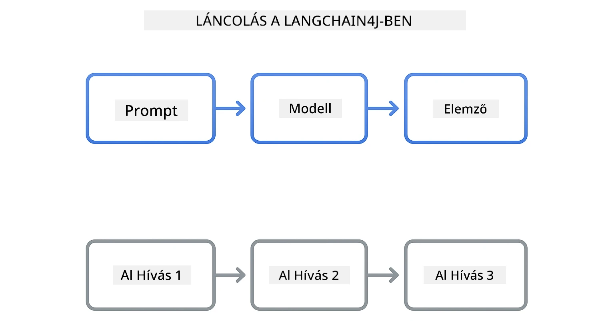
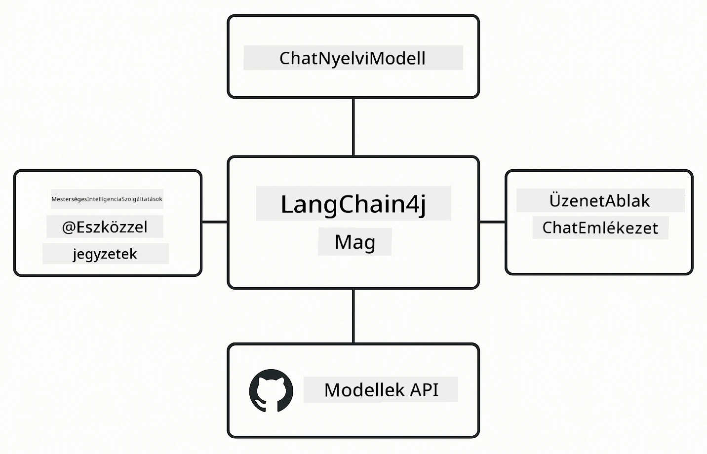

<!--
CO_OP_TRANSLATOR_METADATA:
{
  "original_hash": "22b5d7c8d7585325e38b37fd29eafe25",
  "translation_date": "2026-01-06T00:42:34+00:00",
  "source_file": "00-quick-start/README.md",
  "language_code": "hu"
}
-->
# Modul 00: Gyors Elindulás

## Tartalomjegyzék

- [Bevezetés](../../../00-quick-start)
- [Mi az a LangChain4j?](../../../00-quick-start)
- [LangChain4j Függőségek](../../../00-quick-start)
- [Előfeltételek](../../../00-quick-start)
- [Beállítás](../../../00-quick-start)
  - [1. Szerezd meg a GitHub tokened](../../../00-quick-start)
  - [2. Állítsd be a tokened](../../../00-quick-start)
- [Futtasd a példákat](../../../00-quick-start)
  - [1. Alap csevegés](../../../00-quick-start)
  - [2. Prompt minták](../../../00-quick-start)
  - [3. Függvényhívás](../../../00-quick-start)
  - [4. Dokumentum Kérdések & Válaszok (RAG)](../../../00-quick-start)
  - [5. Felelős MI](../../../00-quick-start)
- [Mit mutat meg minden példa?](../../../00-quick-start)
- [Következő lépések](../../../00-quick-start)
- [Hibaelhárítás](../../../00-quick-start)

## Bevezetés

Ez a gyorsstart arra szolgál, hogy a lehető leggyorsabban elindulj a LangChain4j használatával. Lefedi az AI alkalmazások építésének legfontosabb alapjait LangChain4j-vel és GitHub Modellekkel. A következő modulokban az Azure OpenAI-t fogod használni a LangChain4j-vel, hogy fejlettebb alkalmazásokat építs.

## Mi az a LangChain4j?

A LangChain4j egy Java könyvtár, amely leegyszerűsíti az MI-alapú alkalmazások fejlesztését. Ahelyett, hogy HTTP kliensként és JSON parszolással bajlódsz, tiszta Java API-kkal dolgozol.

A "chain" a LangChain-ben arra utal, hogy több komponenst láncolsz össze – összekapcsolhatsz egy promptot egy modellel, aztán egy parzerrel, vagy láncolhatsz egymás után több MI hívást, ahol az egyik kimenet a következő bemenete. Ez a gyorsstart az alapokra koncentrál, mielőtt bonyolultabb láncokat fedeznénk fel.



*komponensek láncolása a LangChain4j-ben – az építő blokkok kapcsolódnak, hogy erőteljes MI munkafolyamatokat hozzanak létre*

Három fő komponenst használunk:

**ChatLanguageModel** - az MI modellel való interakció felülete. Meghívod `model.chat("prompt")` és kapsz egy válaszüzenetet. Az `OpenAiOfficialChatModel`-t használjuk, amely OpenAI-kompatibilis végpontokkal működik, mint a GitHub Modellek.

**AiServices** - típusbiztos MI szolgáltatás interfészeket hoz létre. Definiáld a metódusokat, annotáld őket `@Tool`-lal, és a LangChain4j intézi az összehangolást. Az MI automatikusan hívja a Java függvényeidet, amikor kell.

**MessageWindowChatMemory** - a beszélgetési előzményeket kezeli. Enélkül minden kérés független. Ezzel az MI emlékszik az előző üzenetekre és fenntartja a kontextust több körön át.



*LangChain4j architektúra – a fő komponensek együttműködnek, hogy erőteljes MI alkalmazásokat működtessenek*

## LangChain4j Függőségek

Ez a gyorsstart két Maven függőséget használ a [`pom.xml`](../../../00-quick-start/pom.xml) fájlban:

```xml
<!-- Core LangChain4j library -->
<dependency>
    <groupId>dev.langchain4j</groupId>
    <artifactId>langchain4j</artifactId> <!-- Inherited from BOM in root pom.xml -->
</dependency>

<!-- OpenAI integration (works with GitHub Models) -->
<dependency>
    <groupId>dev.langchain4j</groupId>
    <artifactId>langchain4j-open-ai-official</artifactId> <!-- Inherited from BOM in root pom.xml -->
</dependency>
```

A `langchain4j-open-ai-official` modul biztosítja az `OpenAiOfficialChatModel` osztályt, amely az OpenAI-kompatibilis API-khoz csatlakozik. A GitHub Modellek ugyanezt az API formátumot használják, ezért nincs szükség speciális adapterre – csak a bázis URL-t irányítsd `https://models.github.ai/inference`-re.

## Előfeltételek

**Fejlesztői konténer használata?** A Java és Maven már telepítve van. Csak egy GitHub Személyes hozzáférési tokenre van szükséged.

**Helyi fejlesztéshez:**
- Java 21+, Maven 3.9+
- GitHub Személyes hozzáférési token (alább leírás)

> **Megjegyzés:** Ez a modul a GitHub Modellek `gpt-4.1-nano` modelljét használja. Ne módosítsd a modell nevét a kódban – az a GitHub elérhető modelljeivel működésre van konfigurálva.

## Beállítás

### 1. Szerezd meg a GitHub tokened

1. Lépj a [GitHub Beállítások → Személyes hozzáférési tokenek](https://github.com/settings/personal-access-tokens) oldalra
2. Kattints a „Generate new token” gombra
3. Adj meg egy leíró nevet (pl. „LangChain4j Demo”)
4. Állíts be lejárati időt (ajánlott 7 nap)
5. Az „Account permissions” alatt keresd meg a „Models” engedélyt és állítsd „Csak olvasásra”
6. Kattints a „Generate token” gombra
7. Másold ki és mentsd el a tokened – többé nem fogod látni

### 2. Állítsd be a tokened

**1. Opció: VS Code használata (ajánlott)**

Ha VS Code-ot használsz, add hozzá a tokened a projekt gyökerében lévő `.env` fájlhoz:

Ha a `.env` fájl nem létezik, másold a `.env.example`-t `.env`-re vagy hozz létre új `.env` fájlt a projekt gyökérkönyvtárban.

**Példa `.env` fájl:**
```bash
# A /workspaces/LangChain4j-for-Beginners/.env fájlban
GITHUB_TOKEN=your_token_here
```

Ezután egyszerűen kattints jobb gombbal bármelyik demó fájlra (pl. `BasicChatDemo.java`) a Fájlkezelőben, és válaszd a **„Run Java”** lehetőséget, vagy használd a Futtatás és Hibakeresés panel indítási konfigurációit.

**2. Opció: Terminál használata**

Állítsd be a token környezeti változóként:

**Bash:**
```bash
export GITHUB_TOKEN=your_token_here
```

**PowerShell:**
```powershell
$env:GITHUB_TOKEN=your_token_here
```

## Futtasd a példákat

**VS Code használata:** Egyszerűen kattints jobb gombbal bármelyik demó fájlra a Fájlkezelőben, és válaszd a **„Run Java”** lehetőséget, vagy használd a Futtatás és Hibakeresés panel indítási konfigurációit (előtte győződj meg róla, hogy hozzáadtad a tokened a `.env` fájlhoz).

**Maven használata:** Alternatívaként futtathatod a parancssorból:

### 1. Alap csevegés

**Bash:**
```bash
mvn compile exec:java -Dexec.mainClass=com.example.langchain4j.quickstart.BasicChatDemo
```

**PowerShell:**
```powershell
mvn --% compile exec:java -Dexec.mainClass=com.example.langchain4j.quickstart.BasicChatDemo
```

### 2. Prompt minták

**Bash:**
```bash
mvn compile exec:java -Dexec.mainClass=com.example.langchain4j.quickstart.PromptEngineeringDemo
```

**PowerShell:**
```powershell
mvn --% compile exec:java -Dexec.mainClass=com.example.langchain4j.quickstart.PromptEngineeringDemo
```

Mutatja a zero-shot, few-shot, lánc-gondolat és szerepalapú promptokat.

### 3. Függvényhívás

**Bash:**
```bash
mvn compile exec:java -Dexec.mainClass=com.example.langchain4j.quickstart.ToolIntegrationDemo
```

**PowerShell:**
```powershell
mvn --% compile exec:java -Dexec.mainClass=com.example.langchain4j.quickstart.ToolIntegrationDemo
```

Az MI automatikusan hívja a Java metódusaidat, amikor szükséges.

### 4. Dokumentum Kérdés & Válasz (RAG)

**Bash:**
```bash
mvn compile exec:java -Dexec.mainClass=com.example.langchain4j.quickstart.SimpleReaderDemo
```

**PowerShell:**
```powershell
mvn --% compile exec:java -Dexec.mainClass=com.example.langchain4j.quickstart.SimpleReaderDemo
```

Kérdéseket tehetsz fel a `document.txt` tartalmáról.

### 5. Felelős MI

**Bash:**
```bash
mvn compile exec:java -Dexec.mainClass=com.example.langchain4j.quickstart.ResponsibleAIDemo
```

**PowerShell:**
```powershell
mvn --% compile exec:java -Dexec.mainClass=com.example.langchain4j.quickstart.ResponsibleAIDemo
```

Lásd, hogyan blokkolják az MI biztonsági szűrői a káros tartalmakat.

## Mit mutat meg minden példa?

**Alap csevegés** - [BasicChatDemo.java](../../../00-quick-start/src/main/java/com/example/langchain4j/quickstart/BasicChatDemo.java)

Kezdd itt, hogy megismerd a LangChain4j legegyszerűbb használatát. Létrehozol egy `OpenAiOfficialChatModel`-t, küldesz egy promptot `.chat()`-tel, és kapsz egy választ. Ez bemutatja az alapokat: hogyan inicializálj modelleket egyedi végpontokkal és API kulcsokkal. Ha ezt megérted, minden más erre épül.

```java
ChatLanguageModel model = OpenAiOfficialChatModel.builder()
    .baseUrl("https://models.github.ai/inference")
    .apiKey(System.getenv("GITHUB_TOKEN"))
    .modelName("gpt-4.1-nano")
    .build();

String response = model.chat("What is LangChain4j?");
System.out.println(response);
```

> **🤖 Próbáld ki a [GitHub Copilot](https://github.com/features/copilot) Csevegővel:** Nyisd meg a [`BasicChatDemo.java`](../../../00-quick-start/src/main/java/com/example/langchain4j/quickstart/BasicChatDemo.java) fájlt és kérdezd meg:
> - „Hogyan váltsak GitHub Modellekről Azure OpenAI-ra ebben a kódban?”
> - „Milyen más paramétereket állíthatok az OpenAiOfficialChatModel.builder() metódusban?”
> - „Hogyan adhatok hozzá streaming válaszokat a teljes válaszra való várakozás helyett?”

**Prompt tervezés** - [PromptEngineeringDemo.java](../../../00-quick-start/src/main/java/com/example/langchain4j/quickstart/PromptEngineeringDemo.java)

Most, hogy tudod, hogyan beszélj egy modellel, fedezzük fel mit mondasz neki. Ez a demó ugyanazt a modell beállítást használja, de négy különböző prompt mintát mutat. Próbáld ki a zero-shot promptokat közvetlen utasításokra, few-shot promptokat példák tanulásához, lánc-gondolat promptokat az érvelési lépések feltárásához, és szerepalapú promptokat, amelyek kontextust állítanak be. Látni fogod, hogy ugyanaz a modell drámaian eltérő eredményeket ad attól függően, hogyan fogalmazod meg a kérdést.

```java
PromptTemplate template = PromptTemplate.from(
    "What's the best time to visit {{destination}} for {{activity}}?"
);

Prompt prompt = template.apply(Map.of(
    "destination", "Paris",
    "activity", "sightseeing"
));

String response = model.chat(prompt.text());
```

> **🤖 Próbáld ki a [GitHub Copilot](https://github.com/features/copilot) Csevegővel:** Nyisd meg a [`PromptEngineeringDemo.java`](../../../00-quick-start/src/main/java/com/example/langchain4j/quickstart/PromptEngineeringDemo.java) fájlt és kérdezd meg:
> - „Mi a különbség zero-shot és few-shot promptolás között, és mikor melyiket használjam?”
> - „Hogyan befolyásolja a 'temperature' paraméter a modell válaszait?”
> - „Milyen technikák vannak a prompt injekció támadások megakadályozására éles környezetben?”
> - „Hogyan hozhatok létre újrahasználható PromptTemplate objektumokat gyakori mintákhoz?”

**Eszköz integráció** - [ToolIntegrationDemo.java](../../../00-quick-start/src/main/java/com/example/langchain4j/quickstart/ToolIntegrationDemo.java)

Itt válik igazán erőssé a LangChain4j. Az `AiServices` segítségével létrehozol egy MI asszisztenst, amely képes meghívni a Java metódusaidat. Csak annotáld a metódusokat `@Tool("leírás")`-lal, és a LangChain4j intézi a többit – az MI automatikusan eldönti, mikor melyik eszközt használja aszerint, amit a felhasználó kér. Ez bemutatja a függvényhívást, ami kulcsfontosságú technika AI építéséhez, ami nem csak válaszol, hanem cselekszik is.

```java
@Tool("Performs addition of two numeric values")
public double add(double a, double b) {
    return a + b;
}

MathAssistant assistant = AiServices.create(MathAssistant.class, model);
String response = assistant.chat("What is 25 plus 17?");
```

> **🤖 Próbáld ki a [GitHub Copilot](https://github.com/features/copilot) Csevegővel:** Nyisd meg a [`ToolIntegrationDemo.java`](../../../00-quick-start/src/main/java/com/example/langchain4j/quickstart/ToolIntegrationDemo.java) fájlt és kérdezd meg:
> - „Hogyan működik az @Tool annotáció és mit csinál vele a LangChain4j a háttérben?”
> - „Tud az MI több eszközt egymás után hívni bonyolult problémák megoldásához?”
> - „Mi történik, ha egy eszköz kivételt dob – hogyan kezeljem a hibákat?”
> - „Hogyan integrálnék egy valós API-t a kalkulátor példa helyett?”

**Dokumentum Kérdések & Válaszok (RAG)** - [SimpleReaderDemo.java](../../../00-quick-start/src/main/java/com/example/langchain4j/quickstart/SimpleReaderDemo.java)

Itt látod a RAG (lekérdezésalapú generálás) alapjait. Ahelyett, hogy a modell tanulási adataira támaszkodnál, betöltöd a tartalmat a [`document.txt`](../../../00-quick-start/document.txt) fájlból és beépíted a promptba. Az MI a dokumentum alapján válaszol, nem az általános tudása alapján. Ez az első lépés az olyan rendszerek építéséhez, amelyek a saját adataiddal tudnak dolgozni.

```java
Document document = FileSystemDocumentLoader.loadDocument("document.txt");
String content = document.text();

String prompt = "Based on this document: " + content + 
                "\nQuestion: What is the main topic?";
String response = model.chat(prompt);
```

> **Megjegyzés:** Ez az egyszerű megközelítés az egész dokumentumot beletölti a promptba. Nagy fájlok (>10KB) esetén túlléped a kontextus korlátokat. A 03-as modul a darabolásról és vektor keresésről szól a termelési RAG rendszerekhez.

> **🤖 Próbáld ki a [GitHub Copilot](https://github.com/features/copilot) Csevegővel:** Nyisd meg a [`SimpleReaderDemo.java`](../../../00-quick-start/src/main/java/com/example/langchain4j/quickstart/SimpleReaderDemo.java) fájlt és kérdezd meg:
> - „Hogyan akadályozza meg a RAG az MI tévesztéseket a modell tanulási adataival szemben?”
> - „Mi a különbség a sima megközelítés és a vektoros beágyazások alapú keresés között?”
> - „Hogyan méretezném ezt több dokumentum vagy nagyobb tudásbázis kezelésére?”
> - „Mik a legjobb gyakorlatok a prompt szerkezetének kialakításához, hogy az MI csak a megadott kontextust használja?”

**Felelős MI** - [ResponsibleAIDemo.java](../../../00-quick-start/src/main/java/com/example/langchain4j/quickstart/ResponsibleAIDemo.java)

Építs MI biztonságot több védelmi réteggel. Ez a demó két réteg védelmet mutat be együtt:

**1. rész: LangChain4j Bemeneti Védősávok** – blokkolja a veszélyes promptokat mielőtt elérnék az NLP modellt. Hozz létre egyedi védősávokat, amelyek tiltott kulcsszavakat vagy mintákat ellenőriznek. Ezek a kódodban futnak, gyorsak és ingyenesek.

```java
class DangerousContentGuardrail implements InputGuardrail {
    @Override
    public InputGuardrailResult validate(UserMessage userMessage) {
        String text = userMessage.singleText().toLowerCase();
        if (text.contains("explosives")) {
            return fatal("Blocked: contains prohibited keyword");
        }
        return success();
    }
}
```

**2. rész: Szolgáltató Biztonsági Szűrők** – a GitHub Modellek beépített szűrői elkapják, amit a védősávok esetleg kihagynának. Láthatod a kemény blokkokat (HTTP 400 hibák) súlyos sértések esetén, és a puhán visszautasításokat, amikor az MI udvariasan elutasít.

> **🤖 Próbáld ki a [GitHub Copilot](https://github.com/features/copilot) Csevegővel:** Nyisd meg a [`ResponsibleAIDemo.java`](../../../00-quick-start/src/main/java/com/example/langchain4j/quickstart/ResponsibleAIDemo.java) fájlt és kérdezd meg:
> - „Mi az InputGuardrail és hogyan készíthetek sajátot?”
> - „Mi a különbség a kemény blokk és a puha elutasítás között?”
> - „Miért érdemes egyszerre használni védősávokat és szolgáltató szűrőket?”

## Következő lépések

**Következő modul:** [01-bevezetés - Kezdés LangChain4j és gpt-5 használatával az Azure-on](../01-introduction/README.md)

---

**Navigáció:** [← Vissza a főoldalra](../README.md) | [Következő: Modul 01 - Bevezetés →](../01-introduction/README.md)

---

## Hibaelhárítás

### Első Maven build

**Probléma:** Az első `mvn clean compile` vagy `mvn package` futtatása hosszú ideig tart (10-15 perc)

**Ok:** Maven az első build során le kell töltse az összes projektfüggőséget (Spring Boot, LangChain4j könyvtárak, Azure SDK-k stb.)

**Megoldás:** Ez normális viselkedés. A következő buildek sokkal gyorsabbak lesznek, mert a függőségek helyben vannak cache-elve. A letöltési idő a hálózati sebességedtől függ.

### PowerShell Maven parancs szintaxis

**Probléma:** A Maven parancsok hibára futnak: `Unknown lifecycle phase ".mainClass=..."`

**Ok:** A PowerShell az `=` jelet változó hozzárendelésként értelmezi, ez megszakítja a Maven tulajdonság szintaxisát
**Megoldás**: Használja a `--%` stop-parsing operátort a Maven parancs előtt:

**PowerShell:**
```powershell
mvn --% compile exec:java -Dexec.mainClass=com.example.langchain4j.quickstart.BasicChatDemo
```

**Bash:**
```bash
mvn compile exec:java -Dexec.mainClass=com.example.langchain4j.quickstart.BasicChatDemo
```

A `--%` operátor azt mondja a PowerShellnek, hogy az összes további argumentumot szó szerint, értelmezés nélkül adja át a Mavennek.

### Windows PowerShell Emoji megjelenítés

**Probléma**: Az AI válaszokban szeméttel teli karakterek jelennek meg (pl. `????` vagy `â??`) az emojik helyett PowerShellben

**Ok**: A PowerShell alapértelmezett kódolása nem támogatja az UTF-8 emojikat

**Megoldás**: Futtassa ezt a parancsot Java alkalmazások indítása előtt:
```cmd
chcp 65001
```

Ez erőlteti az UTF-8 kódolást a terminálban. Alternatívaként használhatja a Windows Terminalt, amely jobb Unicode támogatással rendelkezik.

### API hívások hibakeresése

**Probléma**: Hitelesítési hibák, sebességkorlátok vagy váratlan válaszok az AI modelltől

**Megoldás**: A példák tartalmazzák a `.logRequests(true)` és `.logResponses(true)` beállításokat, hogy az API hívások megjelenjenek a konzolon. Ez segít a hitelesítési hibák, sebességkorlátok vagy váratlan válaszok elhárításában. Éles környezetben távolítsa el ezeket a kapcsolókat a naplózási zaj csökkentése érdekében.

---

<!-- CO-OP TRANSLATOR DISCLAIMER START -->
**Jó tudni**:
Ezt a dokumentumot az AI fordító szolgáltatás [Co-op Translator](https://github.com/Azure/co-op-translator) használatával fordítottuk. Bár a pontosságra törekszünk, kérjük, vegye figyelembe, hogy az automatikus fordítások tartalmazhatnak hibákat vagy pontatlanságokat. Az eredeti dokumentum a saját nyelvén tekintendő hiteles forrásnak. Kritikus információk esetén professzionális, emberi fordítás ajánlott. Nem vállalunk felelősséget az ebből eredő félreértésekért vagy félreértelmezésekért.
<!-- CO-OP TRANSLATOR DISCLAIMER END -->