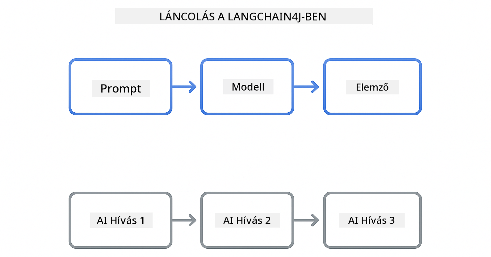

<!--
CO_OP_TRANSLATOR_METADATA:
{
  "original_hash": "377b3e3e6f8d02965bf0fbbc9ccb45c5",
  "translation_date": "2025-12-13T15:12:22+00:00",
  "source_file": "00-quick-start/README.md",
  "language_code": "hu"
}
-->
# Modul 00: Gyors kezdés

## Tartalomjegyzék

- [Bevezetés](../../../00-quick-start)
- [Mi az a LangChain4j?](../../../00-quick-start)
- [LangChain4j függőségek](../../../00-quick-start)
- [Előfeltételek](../../../00-quick-start)
- [Beállítás](../../../00-quick-start)
  - [1. Szerezd meg a GitHub tokened](../../../00-quick-start)
  - [2. Állítsd be a tokened](../../../00-quick-start)
- [Futtasd a példákat](../../../00-quick-start)
  - [1. Alap chat](../../../00-quick-start)
  - [2. Prompt minták](../../../00-quick-start)
  - [3. Függvényhívás](../../../00-quick-start)
  - [4. Dokumentum kérdés-válasz (RAG)](../../../00-quick-start)
- [Mit mutat meg minden példa](../../../00-quick-start)
- [Következő lépések](../../../00-quick-start)
- [Hibaelhárítás](../../../00-quick-start)

## Bevezetés

Ez a gyors kezdő útmutató arra szolgál, hogy a lehető leggyorsabban elindulj a LangChain4j használatával. Lefedi az AI alkalmazások építésének alapjait LangChain4j-vel és GitHub Modellekkel. A következő modulokban Azure OpenAI-t fogsz használni LangChain4j-vel, hogy fejlettebb alkalmazásokat építs.

## Mi az a LangChain4j?

A LangChain4j egy Java könyvtár, amely leegyszerűsíti az AI-alapú alkalmazások fejlesztését. HTTP klienssel és JSON feldolgozással való bajlódás helyett tiszta Java API-kkal dolgozol.

A LangChain "lánc" arra utal, hogy több komponenst összefűzünk – például egy promptot egy modellhez, majd egy elemzőhöz, vagy több AI hívást egymás után, ahol az egyik kimenete a következő bemenete. Ez a gyors kezdés az alapokra fókuszál, mielőtt bonyolultabb láncokat vizsgálnánk.



*Komponensek összefűzése LangChain4j-ben – építőelemek kapcsolódnak, hogy erőteljes AI munkafolyamatokat hozzanak létre*

Három fő komponenst használunk:

**ChatLanguageModel** – Az AI modellel való interakciók interfésze. Meghívod a `model.chat("prompt")` metódust, és választ kapsz szövegként. Az `OpenAiOfficialChatModel`-t használjuk, amely OpenAI-kompatibilis végpontokkal, például GitHub Modellekkel működik.

**AiServices** – Típusbiztos AI szolgáltatás interfészek létrehozása. Definiálsz metódusokat, annotálod őket `@Tool`-lal, és a LangChain4j kezeli az összehangolást. Az AI automatikusan meghívja a Java metódusaidat, amikor szükséges.

**MessageWindowChatMemory** – Megőrzi a beszélgetés előzményeit. Enélkül minden kérés független. Ezzel az AI emlékszik az előző üzenetekre és fenntartja a kontextust több körön át.


*LangChain4j architektúra – a fő komponensek együtt dolgoznak, hogy meghajtják az AI alkalmazásaidat*

## LangChain4j függőségek

Ez a gyors kezdés két Maven függőséget használ a [`pom.xml`](../../../00-quick-start/pom.xml) fájlban:

```xml
<!-- Core LangChain4j library -->
<dependency>
    <groupId>dev.langchain4j</groupId>
    <artifactId>langchain4j</artifactId> <!-- Inherited from BOM in root pom.xml -->
</dependency>

<!-- OpenAI integration (works with GitHub Models) -->
<dependency>
    <groupId>dev.langchain4j</groupId>
    <artifactId>langchain4j-open-ai-official</artifactId> <!-- Inherited from BOM in root pom.xml -->
</dependency>
```

A `langchain4j-open-ai-official` modul biztosítja az `OpenAiOfficialChatModel` osztályt, amely OpenAI-kompatibilis API-khoz csatlakozik. A GitHub Modellek ugyanazt az API formátumot használják, így nincs szükség külön adapterre – csak állítsd be az alap URL-t `https://models.github.ai/inference`-re.

## Előfeltételek

**Fejlesztői konténer használata?** Java és Maven már telepítve van. Csak egy GitHub személyes hozzáférési tokenre van szükséged.

**Helyi fejlesztés:**
- Java 21+, Maven 3.9+
- GitHub személyes hozzáférési token (lásd alább)

> **Megjegyzés:** Ez a modul a GitHub Modellek `gpt-4.1-nano` modelljét használja. Ne módosítsd a modell nevét a kódban – ez a konfiguráció a GitHub elérhető modelljeivel működik.

## Beállítás

### 1. Szerezd meg a GitHub tokened

1. Lépj a [GitHub Beállítások → Személyes hozzáférési tokenek](https://github.com/settings/personal-access-tokens) oldalra
2. Kattints az "Új token generálása" gombra
3. Adj egy leíró nevet (pl. "LangChain4j Demo")
4. Állítsd be a lejárati időt (ajánlott 7 nap)
5. Az "Fiók jogosultságai" alatt keresd meg a "Modellek" részt, és állítsd "Csak olvasás" módra
6. Kattints a "Token generálása" gombra
7. Másold ki és mentsd el a tokent – később nem fogod látni újra

### 2. Állítsd be a tokened

**1. lehetőség: VS Code használata (ajánlott)**

Ha VS Code-ot használsz, add hozzá a tokened a projekt gyökerében lévő `.env` fájlhoz:

Ha a `.env` fájl nem létezik, másold a `.env.example` fájlt `.env` néven, vagy hozz létre egy új `.env` fájlt a projekt gyökerében.

**Példa `.env` fájl:**
```bash
# A /workspaces/LangChain4j-for-Beginners/.env fájlban
GITHUB_TOKEN=your_token_here
```

Ezután egyszerűen kattints jobb gombbal bármelyik demó fájlra (pl. `BasicChatDemo.java`) a Fájlkezelőben, és válaszd a **"Run Java"** opciót, vagy használd a Futtatás és Hibakeresés panel indítási konfigurációit.

**2. lehetőség: Terminál használata**

Állítsd be a tokened környezeti változóként:

**Bash:**
```bash
export GITHUB_TOKEN=your_token_here
```

**PowerShell:**
```powershell
$env:GITHUB_TOKEN=your_token_here
```

## Futtasd a példákat

**VS Code használata:** Egyszerűen kattints jobb gombbal bármelyik demó fájlra a Fájlkezelőben, és válaszd a **"Run Java"** opciót, vagy használd a Futtatás és Hibakeresés panel indítási konfigurációit (előtte győződj meg róla, hogy a tokened hozzáadtad a `.env` fájlhoz).

**Maven használata:** Alternatívaként futtathatod parancssorból:

### 1. Alap chat

**Bash:**
```bash
mvn compile exec:java -Dexec.mainClass=com.example.langchain4j.quickstart.BasicChatDemo
```

**PowerShell:**
```powershell
mvn --% compile exec:java -Dexec.mainClass=com.example.langchain4j.quickstart.BasicChatDemo
```

### 2. Prompt minták

**Bash:**
```bash
mvn compile exec:java -Dexec.mainClass=com.example.langchain4j.quickstart.PromptEngineeringDemo
```

**PowerShell:**
```powershell
mvn --% compile exec:java -Dexec.mainClass=com.example.langchain4j.quickstart.PromptEngineeringDemo
```

Bemutatja a zero-shot, few-shot, chain-of-thought és szerepalapú promptokat.

### 3. Függvényhívás

**Bash:**
```bash
mvn compile exec:java -Dexec.mainClass=com.example.langchain4j.quickstart.ToolIntegrationDemo
```

**PowerShell:**
```powershell
mvn --% compile exec:java -Dexec.mainClass=com.example.langchain4j.quickstart.ToolIntegrationDemo
```

Az AI automatikusan meghívja a Java metódusaidat, amikor szükséges.

### 4. Dokumentum kérdés-válasz (RAG)

**Bash:**
```bash
mvn compile exec:java -Dexec.mainClass=com.example.langchain4j.quickstart.SimpleReaderDemo
```

**PowerShell:**
```powershell
mvn --% compile exec:java -Dexec.mainClass=com.example.langchain4j.quickstart.SimpleReaderDemo
```

Kérdezz a `document.txt` tartalmáról.

## Mit mutat meg minden példa

**Alap chat** - [BasicChatDemo.java](../../../00-quick-start/src/main/java/com/example/langchain4j/quickstart/BasicChatDemo.java)

Innen kezdve láthatod a LangChain4j legegyszerűbb használatát. Létrehozol egy `OpenAiOfficialChatModel`-t, küldesz egy promptot `.chat()`-tel, és kapsz egy választ. Ez bemutatja az alapokat: hogyan inicializálj modelleket egyedi végpontokkal és API kulcsokkal. Ha ezt a mintát megérted, minden más erre épül.

```java
ChatLanguageModel model = OpenAiOfficialChatModel.builder()
    .baseUrl("https://models.github.ai/inference")
    .apiKey(System.getenv("GITHUB_TOKEN"))
    .modelName("gpt-4.1-nano")
    .build();

String response = model.chat("What is LangChain4j?");
System.out.println(response);
```

> **🤖 Próbáld ki a [GitHub Copilot](https://github.com/features/copilot) Chattel:** Nyisd meg a [`BasicChatDemo.java`](../../../00-quick-start/src/main/java/com/example/langchain4j/quickstart/BasicChatDemo.java) fájlt, és kérdezd meg:
> - "Hogyan válthatnék GitHub Modellekről Azure OpenAI-ra ebben a kódban?"
> - "Milyen más paramétereket állíthatok be az OpenAiOfficialChatModel.builder()-ben?"
> - "Hogyan adhatok hozzá streaming válaszokat a teljes válasz várása helyett?"

**Prompt tervezés** - [PromptEngineeringDemo.java](../../../00-quick-start/src/main/java/com/example/langchain4j/quickstart/PromptEngineeringDemo.java)

Most, hogy tudod, hogyan beszélj egy modellel, nézzük meg, mit mondasz neki. Ez a demo ugyanazt a modell beállítást használja, de négy különböző prompt mintát mutat be. Próbáld ki a zero-shot promptokat közvetlen utasításokhoz, few-shot promptokat példákból tanuláshoz, chain-of-thought promptokat, amelyek feltárják az érvelési lépéseket, és szerepalapú promptokat, amelyek kontextust állítanak be. Láthatod, hogy ugyanaz a modell drámaian eltérő eredményeket ad attól függően, hogyan fogalmazod meg a kérésed.

```java
PromptTemplate template = PromptTemplate.from(
    "What's the best time to visit {{destination}} for {{activity}}?"
);

Prompt prompt = template.apply(Map.of(
    "destination", "Paris",
    "activity", "sightseeing"
));

String response = model.chat(prompt.text());
```

> **🤖 Próbáld ki a [GitHub Copilot](https://github.com/features/copilot) Chattel:** Nyisd meg a [`PromptEngineeringDemo.java`](../../../00-quick-start/src/main/java/com/example/langchain4j/quickstart/PromptEngineeringDemo.java) fájlt, és kérdezd meg:
> - "Mi a különbség a zero-shot és a few-shot prompt között, és mikor használjam melyiket?"
> - "Hogyan befolyásolja a hőmérséklet paraméter a modell válaszait?"
> - "Milyen technikák vannak a prompt injekciós támadások megelőzésére éles környezetben?"
> - "Hogyan hozhatok létre újrahasználható PromptTemplate objektumokat gyakori mintákhoz?"

**Eszköz integráció** - [ToolIntegrationDemo.java](../../../00-quick-start/src/main/java/com/example/langchain4j/quickstart/ToolIntegrationDemo.java)

Itt válik igazán erőssé a LangChain4j. Az `AiServices` segítségével létrehozol egy AI asszisztenst, amely meghívhatja a Java metódusaidat. Csak annotáld a metódusokat `@Tool("leírás")`-ral, és a LangChain4j kezeli a többit – az AI automatikusan eldönti, mikor használja az egyes eszközöket a felhasználó kérdése alapján. Ez bemutatja a függvényhívást, egy kulcsfontosságú technikát az AI számára, hogy ne csak válaszoljon, hanem cselekedjen is.

```java
@Tool("Performs addition of two numeric values")
public double add(double a, double b) {
    return a + b;
}

MathAssistant assistant = AiServices.create(MathAssistant.class, model);
String response = assistant.chat("What is 25 plus 17?");
```

> **🤖 Próbáld ki a [GitHub Copilot](https://github.com/features/copilot) Chattel:** Nyisd meg a [`ToolIntegrationDemo.java`](../../../00-quick-start/src/main/java/com/example/langchain4j/quickstart/ToolIntegrationDemo.java) fájlt, és kérdezd meg:
> - "Hogyan működik az @Tool annotáció, és mit csinál vele a LangChain4j a háttérben?"
> - "Tud az AI több eszközt egymás után hívni összetett problémák megoldására?"
> - "Mi történik, ha egy eszköz kivételt dob – hogyan kezeljem a hibákat?"
> - "Hogyan integrálnék egy valódi API-t a kalkulátor példa helyett?"

**Dokumentum kérdés-válasz (RAG)** - [SimpleReaderDemo.java](../../../00-quick-start/src/main/java/com/example/langchain4j/quickstart/SimpleReaderDemo.java)

Itt látod a RAG (retrieval-augmented generation) alapjait. Ahelyett, hogy a modell tanulási adataira támaszkodnál, betöltöd a tartalmat a [`document.txt`](../../../00-quick-start/document.txt) fájlból, és beilleszted a promptba. Az AI a dokumentumod alapján válaszol, nem az általános tudása alapján. Ez az első lépés olyan rendszerek építéséhez, amelyek a saját adataiddal dolgoznak.

```java
Document document = FileSystemDocumentLoader.loadDocument("document.txt");
String content = document.text();

String prompt = "Based on this document: " + content + 
                "\nQuestion: What is the main topic?";
String response = model.chat(prompt);
```

> **Megjegyzés:** Ez az egyszerű megközelítés az egész dokumentumot betölti a promptba. Nagy fájlok (>10KB) esetén túlléped a kontextus korlátokat. A 03-as modul foglalkozik a darabolással és vektoralapú kereséssel az éles RAG rendszerekhez.

> **🤖 Próbáld ki a [GitHub Copilot](https://github.com/features/copilot) Chattel:** Nyisd meg a [`SimpleReaderDemo.java`](../../../00-quick-start/src/main/java/com/example/langchain4j/quickstart/SimpleReaderDemo.java) fájlt, és kérdezd meg:
> - "Hogyan akadályozza meg a RAG az AI tévesztéseket a modell tanulási adatainak használatához képest?"
> - "Mi a különbség ez az egyszerű megközelítés és a vektoros beágyazásokkal történő lekérdezés között?"
> - "Hogyan skálázhatnám ezt több dokumentum vagy nagyobb tudásbázis kezelésére?"
> - "Mik a legjobb gyakorlatok a prompt struktúrázására, hogy az AI csak a megadott kontextust használja?"

## Hibakeresés

A példák tartalmazzák a `.logRequests(true)` és `.logResponses(true)` beállításokat, hogy az API hívások megjelenjenek a konzolon. Ez segít azonosítani az autentikációs hibákat, korlátozásokat vagy váratlan válaszokat. Éles környezetben távolítsd el ezeket a beállításokat a naplózási zaj csökkentése érdekében.

## Következő lépések

**Következő modul:** [01-bevezetés - LangChain4j és gpt-5 Azure-on kezdőknek](../01-introduction/README.md)

---

**Navigáció:** [← Vissza a főoldalra](../README.md) | [Következő: Modul 01 - Bevezetés →](../01-introduction/README.md)

---

## Hibaelhárítás

### Első Maven build

**Probléma:** Az első `mvn clean compile` vagy `mvn package` hosszú ideig tart (10-15 perc)

**Ok:** A Mavennek le kell töltenie az összes projektfüggőséget (Spring Boot, LangChain4j könyvtárak, Azure SDK-k stb.) az első build során.

**Megoldás:** Ez normális viselkedés. A későbbi build-ek sokkal gyorsabbak lesznek, mert a függőségek helyileg cache-lve vannak. A letöltési idő a hálózati sebességedtől függ.

### PowerShell Maven parancsszintaxis

**Probléma:** A Maven parancsok hibával leállnak: `Unknown lifecycle phase ".mainClass=..."`

**Ok:** A PowerShell az `=` jelet változó hozzárendelésként értelmezi, ami megtöri a Maven tulajdonság szintaxist.

**Megoldás:** Használd a stop-parsing operátort `--%` a Maven parancs előtt:

**PowerShell:**
```powershell
mvn --% compile exec:java -Dexec.mainClass=com.example.langchain4j.quickstart.BasicChatDemo
```

**Bash:**
```bash
mvn compile exec:java -Dexec.mainClass=com.example.langchain4j.quickstart.BasicChatDemo
```

A `--%` operátor megmondja a PowerShellnek, hogy az összes további argumentumot szó szerint adja át a Mavennek, értelmezés nélkül.

### Windows PowerShell Emoji megjelenítés

**Probléma:** Az AI válaszok szemét karaktereket (pl. `????` vagy `â??`) mutatnak emoji helyett PowerShell-ben

**Ok:** A PowerShell alapértelmezett kódolása nem támogatja az UTF-8 emojikat

**Megoldás:** Futtasd ezt a parancsot Java alkalmazások indítása előtt:
```cmd
chcp 65001
```

Ez kényszeríti az UTF-8 kódolást a terminálban. Alternatívaként használd a Windows Terminalt, amely jobb Unicode támogatással rendelkezik.

---

<!-- CO-OP TRANSLATOR DISCLAIMER START -->
**Jogi nyilatkozat**:
Ezt a dokumentumot az AI fordító szolgáltatás, a [Co-op Translator](https://github.com/Azure/co-op-translator) segítségével fordítottuk le. Bár a pontosságra törekszünk, kérjük, vegye figyelembe, hogy az automatikus fordítások hibákat vagy pontatlanságokat tartalmazhatnak. Az eredeti dokumentum az anyanyelvén tekintendő hiteles forrásnak. Fontos információk esetén szakmai, emberi fordítást javaslunk. Nem vállalunk felelősséget a fordítás használatából eredő félreértésekért vagy félreértelmezésekért.
<!-- CO-OP TRANSLATOR DISCLAIMER END -->