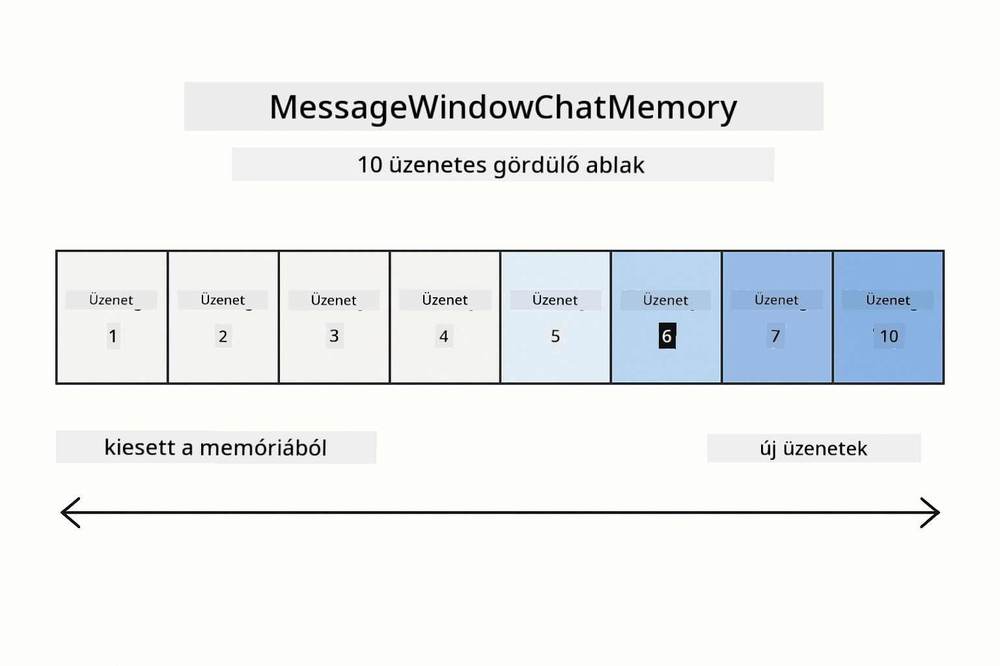
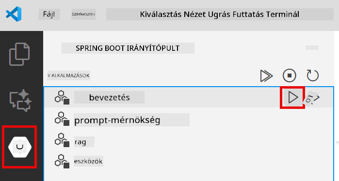
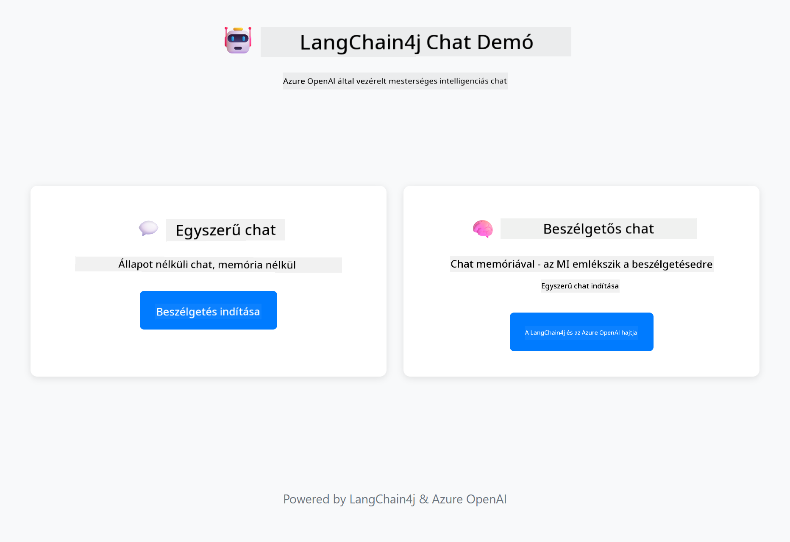

<!--
CO_OP_TRANSLATOR_METADATA:
{
  "original_hash": "c3e07ca58d0b8a3f47d3bf5728541e0a",
  "translation_date": "2025-12-13T13:56:48+00:00",
  "source_file": "01-introduction/README.md",
  "language_code": "hu"
}
-->
# Modul 01: Kezdés a LangChain4j-vel

## Tartalomjegyzék

- [Mit fogsz megtanulni](../../../01-introduction)
- [Előfeltételek](../../../01-introduction)
- [Az alapvető probléma megértése](../../../01-introduction)
- [A tokenek megértése](../../../01-introduction)
- [Hogyan működik a memória](../../../01-introduction)
- [Hogyan használja ezt a LangChain4j](../../../01-introduction)
- [Azure OpenAI infrastruktúra telepítése](../../../01-introduction)
- [Az alkalmazás helyi futtatása](../../../01-introduction)
- [Az alkalmazás használata](../../../01-introduction)
  - [Állapot nélküli csevegés (bal panel)](../../../01-introduction)
  - [Állapotfüggő csevegés (jobb panel)](../../../01-introduction)
- [Következő lépések](../../../01-introduction)

## Mit fogsz megtanulni

Ha elvégezted a gyors kezdést, láttad, hogyan lehet promptokat küldeni és válaszokat kapni. Ez az alap, de a valódi alkalmazások ennél többet igényelnek. Ez a modul megtanítja, hogyan építs olyan beszélgető AI-t, amely emlékszik a kontextusra és fenntartja az állapotot – ez a különbség egy egyszeri demó és egy éles, használatra kész alkalmazás között.

Az útmutató során az Azure OpenAI GPT-5-öt használjuk, mert fejlett érvelési képességei miatt a különböző minták viselkedése egyértelműbbé válik. Ha memóriát adsz hozzá, világosan látni fogod a különbséget. Ez megkönnyíti megérteni, hogy az egyes komponensek mit hoznak az alkalmazásodba.

Egy alkalmazást fogsz építeni, amely mindkét mintát bemutatja:

**Állapot nélküli csevegés** – Minden kérés független. A modell nem emlékszik az előző üzenetekre. Ez az a minta, amit a gyors kezdésben használtál.

**Állapotfüggő beszélgetés** – Minden kérés tartalmazza a beszélgetés előzményeit. A modell több körön át fenntartja a kontextust. Erre van szükség az éles alkalmazásoknál.

## Előfeltételek

- Azure előfizetés Azure OpenAI hozzáféréssel
- Java 21, Maven 3.9+
- Azure CLI (https://learn.microsoft.com/en-us/cli/azure/install-azure-cli)
- Azure Developer CLI (azd) (https://learn.microsoft.com/en-us/azure/developer/azure-developer-cli/install-azd)

> **Megjegyzés:** A Java, Maven, Azure CLI és Azure Developer CLI (azd) előre telepítve van a biztosított fejlesztői konténerben.

> **Megjegyzés:** Ez a modul az Azure OpenAI GPT-5-öt használja. A telepítés automatikusan konfigurálódik az `azd up` parancs által – ne módosítsd a modell nevét a kódban.

## Az alapvető probléma megértése

A nyelvi modellek állapot nélküliak. Minden API hívás független. Ha elküldöd, hogy „A nevem John”, majd megkérdezed, hogy „Mi a nevem?”, a modellnek fogalma sincs, hogy épp bemutatkoztál. Minden kérést úgy kezel, mintha ez lenne az első beszélgetésed valaha.

Ez rendben van egyszerű kérdés-válasz esetén, de használhatatlan valódi alkalmazásokhoz. Az ügyfélszolgálati botoknak emlékezniük kell arra, amit mondtál. A személyi asszisztenseknek kontextusra van szükségük. Bármilyen többkörös beszélgetés memóriát igényel.


*Az állapot nélküli (független hívások) és az állapotfüggő (kontextusérzékeny) beszélgetések közötti különbség*

## A tokenek megértése

Mielőtt belevágnánk a beszélgetésekbe, fontos megérteni a tokeneket – a szöveg alapvető egységeit, amelyeket a nyelvi modellek feldolgoznak:


*Példa arra, hogyan törik fel a szöveg tokenekre – az „I love AI!” 4 külön feldolgozási egységgé válik*

A tokenek azok, ahogyan az AI modellek mérik és feldolgozzák a szöveget. Szavak, írásjelek és akár szóközök is lehetnek tokenek. A modellednek van egy korlátja, hogy egyszerre hány tokent tud feldolgozni (GPT-5 esetén 400 000, ebből legfeljebb 272 000 bemeneti és 128 000 kimeneti token). A tokenek megértése segít kezelni a beszélgetés hosszát és a költségeket.

## Hogyan működik a memória

A csevegési memória megoldja az állapot nélküli problémát azáltal, hogy fenntartja a beszélgetés előzményeit. Mielőtt elküldenéd a kérést a modellnek, a keretrendszer hozzáfűzi a releváns korábbi üzeneteket. Amikor megkérdezed, hogy „Mi a nevem?”, a rendszer valójában az egész beszélgetési előzményt elküldi, így a modell látja, hogy korábban azt mondtad: „A nevem John.”

A LangChain4j memóriamegoldásokat kínál, amelyek ezt automatikusan kezelik. Te választod ki, hogy hány üzenetet tartasz meg, a keretrendszer pedig kezeli a kontextusablakot.



*MessageWindowChatMemory egy csúszó ablakot tart fenn a legutóbbi üzenetekből, automatikusan eldobva a régieket*

## Hogyan használja ezt a LangChain4j

Ez a modul kiterjeszti a gyors kezdést a Spring Boot integrációjával és a beszélgetési memória hozzáadásával. Így illeszkednek össze az elemek:

**Függőségek** – Adj hozzá két LangChain4j könyvtárat:

```xml
<dependency>
    <groupId>dev.langchain4j</groupId>
    <artifactId>langchain4j</artifactId> <!-- Inherited from BOM in root pom.xml -->
</dependency>
<dependency>
    <groupId>dev.langchain4j</groupId>
    <artifactId>langchain4j-open-ai-official</artifactId> <!-- Inherited from BOM in root pom.xml -->
</dependency>
```

**Csevegő modell** – Konfiguráld az Azure OpenAI-t Spring bean-ként ([LangChainConfig.java](../../../01-introduction/src/main/java/com/example/langchain4j/config/LangChainConfig.java)):

```java
@Bean
public OpenAiOfficialChatModel openAiOfficialChatModel() {
    return OpenAiOfficialChatModel.builder()
            .baseUrl(azureEndpoint)
            .apiKey(azureApiKey)
            .modelName(deploymentName)
            .timeout(Duration.ofMinutes(5))
            .maxRetries(3)
            .build();
}
```

A builder az `azd up` által beállított környezeti változókból olvassa be a hitelesítő adatokat. A `baseUrl` beállítása az Azure végpontodra teszi lehetővé, hogy az OpenAI kliens az Azure OpenAI-val működjön.

**Beszélgetési memória** – Kövesd a csevegési előzményeket a MessageWindowChatMemory-vel ([ConversationService.java](../../../01-introduction/src/main/java/com/example/langchain4j/service/ConversationService.java)):

```java
ChatMemory memory = MessageWindowChatMemory.withMaxMessages(10);

memory.add(UserMessage.from("My name is John"));
memory.add(AiMessage.from("Nice to meet you, John!"));

memory.add(UserMessage.from("What's my name?"));
AiMessage aiMessage = chatModel.chat(memory.messages()).aiMessage();
memory.add(aiMessage);
```

Hozz létre memóriát `withMaxMessages(10)`-nel, hogy az utolsó 10 üzenetet megtartsd. Adj hozzá felhasználói és AI üzeneteket típusos csomagolókkal: `UserMessage.from(text)` és `AiMessage.from(text)`. A történetet a `memory.messages()`-szel kérheted le, és küldheted a modellnek. A szolgáltatás külön memóriapéldányokat tárol beszélgetésazonosítónként, így több felhasználó is egyszerre cseveghet.

> **🤖 Próbáld ki a [GitHub Copilot](https://github.com/features/copilot) Chat segítségével:** Nyisd meg a [`ConversationService.java`](../../../01-introduction/src/main/java/com/example/langchain4j/service/ConversationService.java) fájlt, és kérdezd meg:
> - „Hogyan dönt a MessageWindowChatMemory, hogy mely üzeneteket dobja el, amikor az ablak megtelik?”
> - „Megvalósíthatok-e egyedi memória tárolást adatbázis használatával a memóriában tárolás helyett?”
> - „Hogyan adhatnék hozzá összefoglalást a régi beszélgetési előzmények tömörítéséhez?”

Az állapot nélküli csevegési végpont teljesen kihagyja a memóriát – csak `chatModel.chat(prompt)` hívás, mint a gyors kezdésben. Az állapotfüggő végpont hozzáadja az üzeneteket a memóriához, lekéri a történetet, és ezt a kontextust minden kéréshez hozzáadja. Ugyanaz a modellkonfiguráció, különböző minták.

## Azure OpenAI infrastruktúra telepítése

**Bash:**
```bash
cd 01-introduction
azd up  # Válassza ki az előfizetést és a helyszínt (az eastus2 ajánlott)
```

**PowerShell:**
```powershell
cd 01-introduction
azd up  # Válassza ki az előfizetést és a helyszínt (az eastus2 ajánlott)
```

> **Megjegyzés:** Ha időtúllépési hibát kapsz (`RequestConflict: Cannot modify resource ... provisioning state is not terminal`), egyszerűen futtasd újra az `azd up` parancsot. Az Azure erőforrások még háttérben települhetnek, és az ismétlés lehetővé teszi, hogy a telepítés befejeződjön, amikor az erőforrások elérik a végleges állapotot.

Ez a következőket teszi:
1. Telepíti az Azure OpenAI erőforrást GPT-5 és text-embedding-3-small modellekkel
2. Automatikusan létrehozza a `.env` fájlt a projekt gyökérkönyvtárában a hitelesítő adatokkal
3. Beállítja az összes szükséges környezeti változót

**Telepítési problémák esetén?** Nézd meg az [Infrastruktúra README](infra/README.md) fájlt részletes hibakeresési útmutatóval, beleértve az aldomain névütközéseket, kézi Azure Portal telepítési lépéseket és modellkonfigurációs tanácsokat.

**Ellenőrizd, hogy a telepítés sikeres volt-e:**

**Bash:**
```bash
cat ../.env  # Meg kell jelenítenie az AZURE_OPENAI_ENDPOINT, API_KEY stb. értékeket.
```

**PowerShell:**
```powershell
Get-Content ..\.env  # Meg kell jelenítenie az AZURE_OPENAI_ENDPOINT, API_KEY stb. értékeket.
```

> **Megjegyzés:** Az `azd up` parancs automatikusan generálja a `.env` fájlt. Ha később frissíteni kell, vagy szerkesztheted kézzel a `.env` fájlt, vagy újragenerálhatod a következő parancsokkal:
>
> **Bash:**
> ```bash
> cd ..
> bash .azd-env.sh
> ```
>
> **PowerShell:**
> ```powershell
> cd ..
> .\.azd-env.ps1
> ```

## Az alkalmazás helyi futtatása

**Ellenőrizd a telepítést:**

Győződj meg róla, hogy a `.env` fájl létezik a gyökérkönyvtárban az Azure hitelesítő adatokkal:

**Bash:**
```bash
cat ../.env  # Meg kell jelenítenie az AZURE_OPENAI_ENDPOINT, API_KEY, DEPLOYMENT értékeket
```

**PowerShell:**
```powershell
Get-Content ..\.env  # Meg kell jelenítenie az AZURE_OPENAI_ENDPOINT, API_KEY, DEPLOYMENT értékeket
```

**Indítsd el az alkalmazásokat:**

**1. lehetőség: Spring Boot Dashboard használata (ajánlott VS Code felhasználóknak)**

A fejlesztői konténer tartalmazza a Spring Boot Dashboard kiterjesztést, amely vizuális felületet biztosít az összes Spring Boot alkalmazás kezeléséhez. A VS Code bal oldali tevékenységsávjában találod (keresd a Spring Boot ikont).

A Spring Boot Dashboard segítségével:
- Megtekintheted az összes elérhető Spring Boot alkalmazást a munkaterületen
- Egy kattintással indíthatod/leállíthatod az alkalmazásokat
- Valós időben nézheted az alkalmazás naplóit
- Figyelheted az alkalmazás állapotát

Egyszerűen kattints a lejátszás gombra az „introduction” modul mellett, hogy elindítsd ezt a modult, vagy indítsd el az összes modult egyszerre.



**2. lehetőség: Shell szkriptek használata**

Indítsd el az összes webalkalmazást (01-04 modulok):

**Bash:**
```bash
cd ..  # A gyökérkönyvtárból
./start-all.sh
```

**PowerShell:**
```powershell
cd ..  # A gyökérkönyvtárból
.\start-all.ps1
```

Vagy indítsd csak ezt a modult:

**Bash:**
```bash
cd 01-introduction
./start.sh
```

**PowerShell:**
```powershell
cd 01-introduction
.\start.ps1
```

Mindkét szkript automatikusan betölti a környezeti változókat a gyökér `.env` fájlból, és ha a JAR fájlok nem léteznek, lefordítja azokat.

> **Megjegyzés:** Ha inkább manuálisan szeretnéd lefordítani az összes modult indítás előtt:
>
> **Bash:**
> ```bash
> cd ..  # Go to root directory
> mvn clean package -DskipTests
> ```
>
> **PowerShell:**
> ```powershell
> cd ..  # Go to root directory
> mvn clean package -DskipTests
> ```

Nyisd meg a http://localhost:8080 címet a böngésződben.

**Leállításhoz:**

**Bash:**
```bash
./stop.sh  # Csak ez a modul
# Vagy
cd .. && ./stop-all.sh  # Minden modul
```

**PowerShell:**
```powershell
.\stop.ps1  # Csak ez a modul
# Vagy
cd ..; .\stop-all.ps1  # Minden modul
```

## Az alkalmazás használata

Az alkalmazás egy webes felületet biztosít két párhuzamos csevegő implementációval.



*Irányítópult, amely mind az Egyszerű csevegés (állapot nélküli), mind a Beszélgető csevegés (állapotfüggő) opciókat mutatja*

### Állapot nélküli csevegés (bal panel)

Ezzel kezd el. Kérdezd meg, hogy „A nevem John”, majd azonnal, hogy „Mi a nevem?” A modell nem fog emlékezni, mert minden üzenet független. Ez bemutatja az alapvető problémát az egyszerű nyelvi modell integrációval – nincs beszélgetési kontextus.


*Az AI nem emlékszik a nevedre az előző üzenetből*

### Állapotfüggő csevegés (jobb panel)

Most próbáld ki ugyanazt a sorrendet itt. Kérdezd meg, hogy „A nevem John”, majd „Mi a nevem?” Ezúttal emlékszik. A különbség a MessageWindowChatMemory – ez fenntartja a beszélgetési előzményeket, és minden kéréshez hozzáadja azt. Így működik az éles beszélgető AI.


*Az AI emlékszik a nevedre a beszélgetés korábbi részéből*

Mindkét panel ugyanazt a GPT-5 modellt használja. Az egyetlen különbség a memória. Ez világossá teszi, hogy a memória mit hoz az alkalmazásodba, és miért elengedhetetlen a valódi használati esetekhez.

## Következő lépések

**Következő modul:** [02-prompt-engineering - Prompt tervezés GPT-5-tel](../02-prompt-engineering/README.md)

---

**Navigáció:** [← Előző: Modul 00 - Gyors kezdés](../00-quick-start/README.md) | [Vissza a főoldalra](../README.md) | [Következő: Modul 02 - Prompt tervezés →](../02-prompt-engineering/README.md)

---

<!-- CO-OP TRANSLATOR DISCLAIMER START -->
**Jogi nyilatkozat**:
Ezt a dokumentumot az AI fordító szolgáltatás, a [Co-op Translator](https://github.com/Azure/co-op-translator) segítségével fordítottuk le. Bár a pontosságra törekszünk, kérjük, vegye figyelembe, hogy az automatikus fordítások hibákat vagy pontatlanságokat tartalmazhatnak. Az eredeti dokumentum az anyanyelvén tekintendő hiteles forrásnak. Fontos információk esetén professzionális emberi fordítást javaslunk. Nem vállalunk felelősséget a fordítás használatából eredő félreértésekért vagy félreértelmezésekért.
<!-- CO-OP TRANSLATOR DISCLAIMER END -->