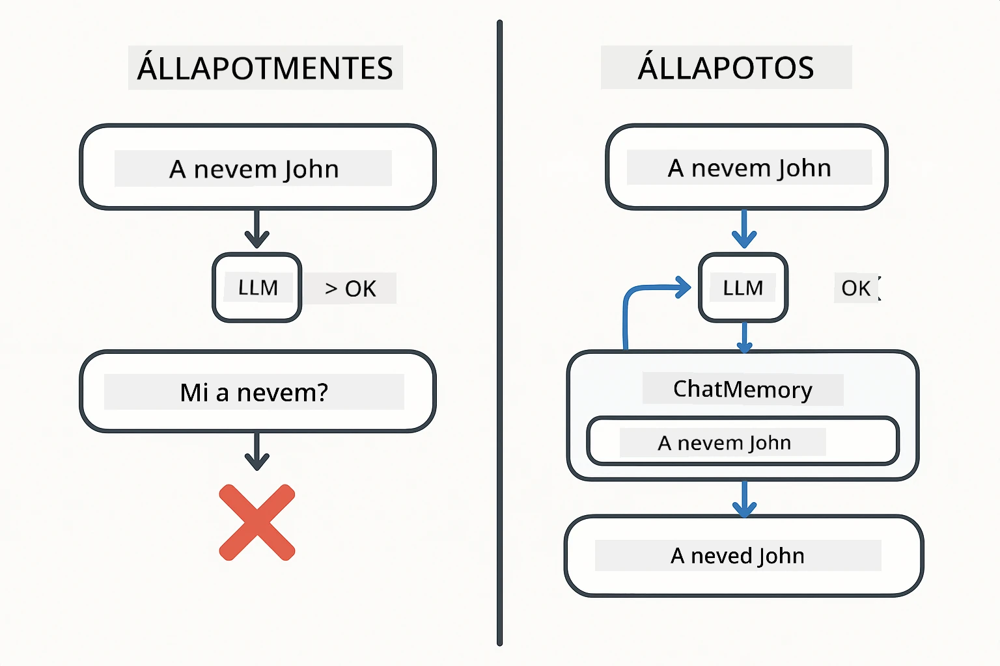
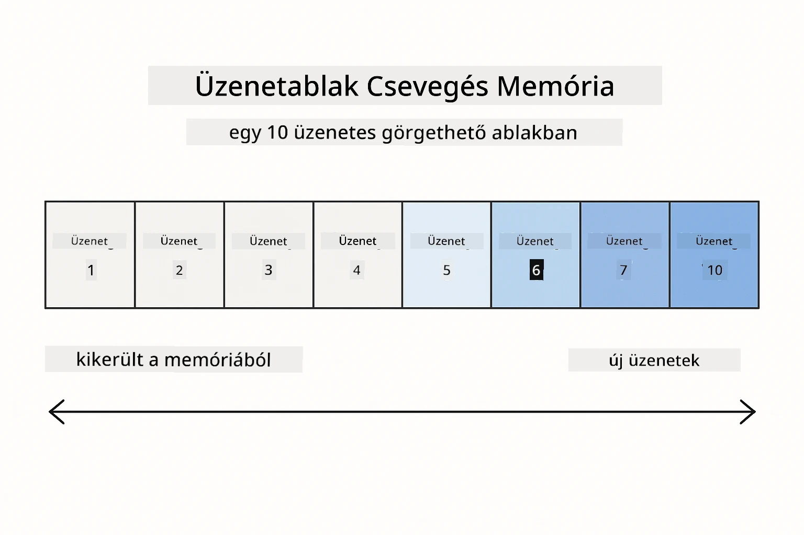
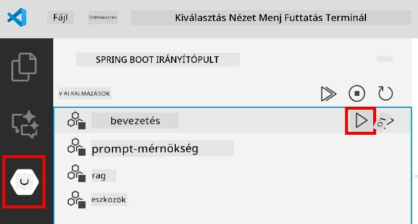
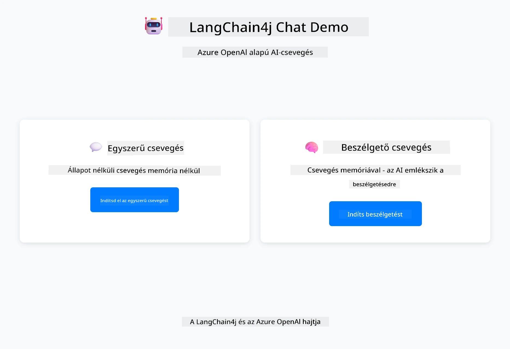
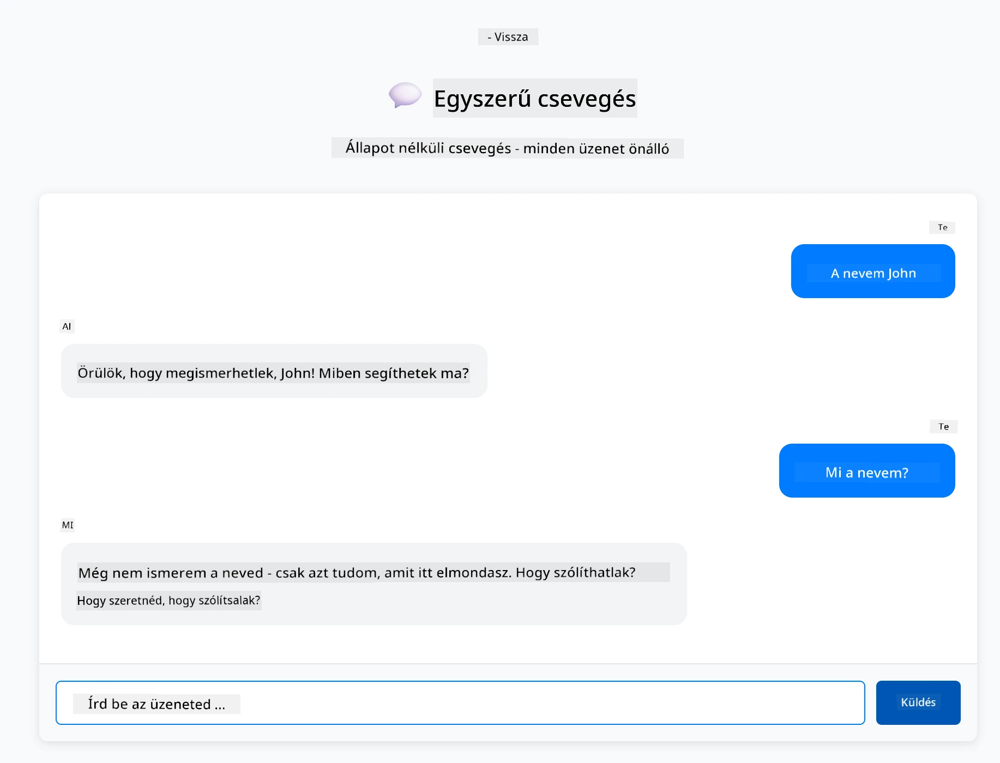
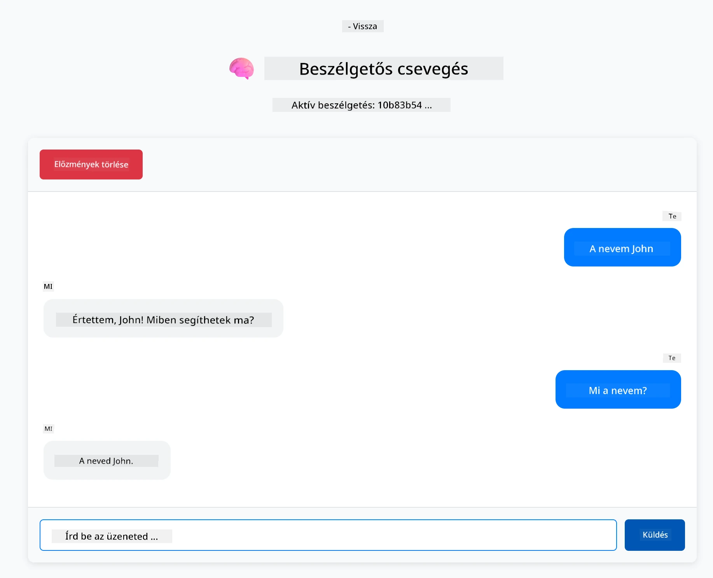

# Modul 01: Kezdés a LangChain4j-vel

## Tartalomjegyzék

- [Videós bemutató](#videós-bemutató)
- [Mit fogsz megtanulni](#mit-fogsz-megtanulni)
- [Előfeltételek](#előfeltételek)
- [Az alapvető probléma megértése](#az-alapvető-probléma-megértése)
- [Tokenek megértése](#tokenek-megértése)
- [Hogyan működik a memória](#hogyan-működik-a-memória)
- [Hogyan használja ezt a LangChain4j](#hogyan-használja-ezt-a-langchain4j)
- [Azure OpenAI infrastruktúra telepítése](#azure-openai-infrastruktúra-telepítése)
- [Alkalmazás helyi futtatása](#alkalmazás-helyi-futtatása)
- [Az alkalmazás használata](#az-alkalmazás-használata)
  - [Állapot nélküli chat (bal panel)](#állapot-nélküli-chat-bal-panel)
  - [Állapotkövető chat (jobb panel)](#állapotkövető-chat-jobb-panel)
- [Következő lépések](#következő-lépések)

## Videós bemutató

Nézd meg ezt az élő adást, amely elmagyarázza, hogyan kezdj neki ennek a modulnak:

<a href="https://www.youtube.com/live/nl_troDm8rQ?si=6b85S8xGjWnT2fX9"></a>

## Mit fogsz megtanulni

Ez a kiindulópontod a LangChain4j és Azure OpenAI használatában. Az alapoktól indulunk, és elkezdjük építeni a produkciós stílusú alkalmazásokat. Ez a modul a beszélgető AI-ra fókuszál, amely emlékszik a kontextusra és fenntartja az állapotot — ezek az alapvető fogalmak, amelyekre a későbbi modulok épülnek.

Az útmutató során az Azure OpenAI GPT-5.2-jét használjuk, mivel fejlett érvelési képességei miatt jobban láthatóvá válik a különböző minták viselkedése. Ha memóriát adsz hozzá, világosan látni fogod a különbséget. Ez megkönnyíti megérteni, hogy melyik komponens mit ad az alkalmazásodhoz.

Egy alkalmazást fogsz építeni, amely mindkét mintát bemutatja:

**Állapot nélküli chat** – Minden kérés független. A modell nem emlékszik a korábbi üzenetekre. Ez a legegyszerűbb kiindulási pont.

**Állapotkövető beszélgetés** – Minden kérés tartalmazza a beszélgetés előzményeit. A modell több fordulón keresztül fenntartja a kontextust. Ez kell a produkciós alkalmazásokhoz.

## Előfeltételek

- Azure előfizetés Azure OpenAI-hozzáféréssel
- Java 21, Maven 3.9+
- Azure CLI (https://learn.microsoft.com/en-us/cli/azure/install-azure-cli)
- Azure Developer CLI (azd) (https://learn.microsoft.com/en-us/azure/developer/azure-developer-cli/install-azd)

> **Megjegyzés:** A Java, Maven, Azure CLI és Azure Developer CLI (azd) előre telepítve van a biztosított devcontainerben.

> **Megjegyzés:** Ez a modul az Azure OpenAI GPT-5.2 verzióját használja. A telepítés automatikusan konfigurálódik az `azd up` használatával – NE módosítsd a modell nevét a kódban.

## Az alapvető probléma megértése

A nyelvi modellek állapot nélküli(ek). Minden API hívás független. Ha elküldöd, hogy "A nevem John", majd megkérdezed, hogy "Mi a nevem?", a modellnek fogalma sincs, hogy éppen bemutatkoztál. Minden kérést úgy kezel, mintha az lenne az első beszélgetésed valaha.

Ez rendben van egyszerű kérdés-válasz esetén, de semmit sem ér valós alkalmazásokban. Az ügyfélszolgálati botoknak emlékezniük kell arra, amit mondtál nekik. A személyi asszisztenseknek kontextusra van szükségük. Bármilyen többfordulós beszélgetéshez memória kell.

A következő ábra bemutatja a két megközelítést – bal oldalon egy állapot nélküli hívás, amely elfelejti a neved; jobbra egy állapotkövető hívás a ChatMemory támogatásával, amely emlékszik rá.



*Az állapot nélküli (független hívások) és az állapotkövető (kontextus-érzékeny) beszélgetések közötti különbség*

## Tokenek megértése

Mielőtt belemerülnénk a beszélgetésekbe, fontos megérteni a tokeneket - a nyelvi modellek által feldolgozott alapvető szövegegységeket:


*Példa arra, hogyan törik fel a szöveg tokenekre – az "I love AI!" 4 külön feldolgozási egységgé válik*

A tokenek azok az egységek, amikkel az AI modellek mérik és feldolgozzák a szöveget. Szavak, írásjelek és akár szóközök is lehetnek tokenek. A modellednek van egy határa, hogy egyszerre hány tokent képes feldolgozni (GPT-5.2 esetében 400,000 token, amiből legfeljebb 272,000 bemeneti és 128,000 kimeneti token lehet). A tokenek megértése segít szabályozni a beszélgetés hosszát és költségeit.

## Hogyan működik a memória

A chat memória megoldja az állapot nélküli problémát azáltal, hogy fenntartja a beszélgetés előzményeit. Mielőtt elküldenéd a kérést a modellnek, a keretrendszer hozzáfűzi a releváns korábbi üzeneteket. Amikor megkérdezed, hogy "Mi a nevem?", a rendszer valójában az egész beszélgetési előzményt továbbítja, így a modell látja, hogy korábban azt mondtad: "A nevem John."

A LangChain4j memória implementációkat biztosít, amelyek ezt automatikusan kezelik. Te választod meg, hány üzenetet szeretnél megtartani, a keretrendszer pedig kezeli a kontextus ablakot. Az alábbi ábra azt mutatja, hogy a MessageWindowChatMemory hogyan tart fenn egy csúszóablakot a legfrissebb üzenetekből.



*MessageWindowChatMemory egy csúszóablakot tart fenn a legfrissebb üzenetekből, automatikusan törölve a régebbieket*

## Hogyan használja ezt a LangChain4j

Ez a modul integrálja a Spring Boot-ot és hozzáadja a beszélgetési memóriát. Így kapcsolódnak össze az elemek:

**Függőségek** – Két LangChain4j könyvtár hozzáadása:

```xml
<dependency>
    <groupId>dev.langchain4j</groupId>
    <artifactId>langchain4j</artifactId> <!-- Inherited from BOM in root pom.xml -->
</dependency>
<dependency>
    <groupId>dev.langchain4j</groupId>
    <artifactId>langchain4j-open-ai-official</artifactId> <!-- Inherited from BOM in root pom.xml -->
</dependency>
```

**Chat modell** – Azure OpenAI configuração, Spring bean-ként ([LangChainConfig.java](../../../01-introduction/src/main/java/com/example/langchain4j/config/LangChainConfig.java)):

```java
@Bean
public OpenAiOfficialChatModel openAiOfficialChatModel() {
    return OpenAiOfficialChatModel.builder()
            .baseUrl(azureEndpoint)
            .apiKey(azureApiKey)
            .modelName(deploymentName)
            .timeout(Duration.ofMinutes(5))
            .maxRetries(3)
            .build();
}
```

A builder az `azd up` által beállított környezeti változókból olvassa a hitelesítést. A `baseUrl` beállítása az Azure végpontodra teszi az OpenAI klienst működővé Azure OpenAI-val.

**Beszélgetési memória** – Követi a chat előzményeket a MessageWindowChatMemory segítségével ([ConversationService.java](../../../01-introduction/src/main/java/com/example/langchain4j/service/ConversationService.java)):

```java
ChatMemory memory = MessageWindowChatMemory.withMaxMessages(10);

memory.add(UserMessage.from("My name is John"));
memory.add(AiMessage.from("Nice to meet you, John!"));

memory.add(UserMessage.from("What's my name?"));
AiMessage aiMessage = chatModel.chat(memory.messages()).aiMessage();
memory.add(aiMessage);
```

A memóriát a `withMaxMessages(10)`-zel hozod létre, hogy az utolsó 10 üzenet maradjon meg. A felhasználói és AI üzeneteket típusos csomagolókkal adod hozzá: `UserMessage.from(text)` és `AiMessage.from(text)`. Az előzmények lekéréséhez `memory.messages()` hívható és küldhető a modellnek. A szolgáltatás minden beszélgetésazonosítóhoz külön memóriát tárol, így több felhasználó is egyszerre chatelhet.

> **🤖 Próbáld ki [GitHub Copilot](https://github.com/features/copilot) Chattel:** Nyisd meg a [`ConversationService.java`](../../../01-introduction/src/main/java/com/example/langchain4j/service/ConversationService.java)-t és kérdezd meg:
> - "Hogyan dönti el a MessageWindowChatMemory, hogy melyik üzeneteket dobja el, ha megtelik az ablak?"
> - "Meg tudok valósítani egyedi memória tárolást adatbázis használatával a memóriában?"
> - "Hogyan adnám hozzá az összefoglalást, hogy tömörítsem a régi beszélgetési előzményeket?"

Az állapot nélküli chat végpont teljesen kihagyja a memóriát – csak `chatModel.chat(prompt)` mint a gyors kezdésnél. Az állapotkövető végpont hozzáadja az üzeneteket a memóriához, lekéri az előzményeket, és ezt a kontextust küldi minden kérésnél. Ugyanaz a modellkonfiguráció, más minták.

## Azure OpenAI infrastruktúra telepítése

**Bash:**
```bash
cd 01-introduction
azd up  # Válassza ki az előfizetést és a helyszínt (az eastus2 javasolt)
```

**PowerShell:**
```powershell
cd 01-introduction
azd up  # Válassza ki az előfizetést és a helyszínt (eastus2 ajánlott)
```

> **Megjegyzés:** Ha időtúllépési hibát kapsz (`RequestConflict: Cannot modify resource ... provisioning state is not terminal`), egyszerűen futtasd újra az `azd up` parancsot. Az Azure erőforrások még háttérben települhetnek, és az újrapróbálkozás engedélyezi, hogy a telepítés befejeződjön, amint az erőforrások elérnek egy végső állapotot.

A parancs:
1. Telepíti az Azure OpenAI erőforrást a GPT-5.2 és text-embedding-3-small modellekkel
2. Automatikusan létrehozza a `.env` fájlt a projekt gyökérkönyvtárában a hitelesítő adatokkal
3. Beállít minden szükséges környezeti változót

**Telepítési hibák esetén?** Lásd az [Infrastruktúra README](infra/README.md) fájlt részletes hibakereséssel, beleértve az aldoménnév konfliktusokat, kézi Azure Portal telepítési lépéseket és modellkonfigurációs útmutatót.

**Ellenőrizd a telepítés sikerességét:**

**Bash:**
```bash
cat ../.env  # Meg kell jelenítenie az AZURE_OPENAI_ENDPOINT, API_KEY stb. értékeket.
```

**PowerShell:**
```powershell
Get-Content ..\.env  # Meg kell jeleníteni az AZURE_OPENAI_ENDPOINT, API_KEY stb. értékeket.
```

> **Megjegyzés:** Az `azd up` parancs automatikusan generálja a `.env` fájlt. Ha később módosítani kell, vagy szerkesztheted kézzel, vagy újra generálhatod:
>
> **Bash:**
> ```bash
> cd ..
> bash .azd-env.sh
> ```
>
> **PowerShell:**
> ```powershell
> cd ..
> .\.azd-env.ps1
> ```

## Alkalmazás helyi futtatása

**Ellenőrizd a telepítést:**

Győződj meg róla, hogy a `.env` fájl létezik a gyökérkönyvtárban az Azure hitelesítő adatokkal. Futtasd ezt a modul könyvtárából (`01-introduction/`):

**Bash:**
```bash
cat ../.env  # Meg kell jeleníteni az AZURE_OPENAI_ENDPOINT, API_KEY, DEPLOYMENT értékeket
```

**PowerShell:**
```powershell
Get-Content ..\.env  # Meg kell jeleníteni az AZURE_OPENAI_ENDPOINT, API_KEY, DEPLOYMENT értékeket
```

**Indítsd el az alkalmazásokat:**

**Opció 1: Spring Boot Dashboard használata (ajánlott VS Code felhasználóknak)**

A dev konténer tartalmazza a Spring Boot Dashboard kiterjesztést, amely vizuális felületet biztosít az összes Spring Boot alkalmazás kezeléséhez. Megtalálod a VS Code bal oldalán az Activity Barban (keresd a Spring Boot ikont).

A Spring Boot Dashboard segítségével:
- Láthatod az összes rendelkezésre álló Spring Boot alkalmazást a munkaterületen
- Egy kattintással indíthatod/leállíthatod az alkalmazásokat
- Valós időben megtekintheted az alkalmazás naplóit
- Figyelheted az alkalmazás állapotát

Csak kattints a lejátszás gombra az "introduction" mellett, hogy elindítsd ezt a modult, vagy indítsd el egyszerre az összes modult.



*A Spring Boot Dashboard a VS Code-ban – indíts, állíts le és felügyelj minden modult egy helyről*

**Opció 2: Shell scriptek használata**

Indítsd el az összes webalkalmazást (az 01-04 modulokat):

**Bash:**
```bash
cd ..  # Gyökérkönyvtárból
./start-all.sh
```

**PowerShell:**
```powershell
cd ..  # A gyökérkönyvtárból
.\start-all.ps1
```

Vagy csak ezt a modult:

**Bash:**
```bash
cd 01-introduction
./start.sh
```

**PowerShell:**
```powershell
cd 01-introduction
.\start.ps1
```

Mindkét script automatikusan betölti a környezeti változókat a gyökér `.env` fájljából, és ha a JAR fájlok nem léteznek, lefordítja őket.

> **Megjegyzés:** Ha inkább manuálisan építenéd meg az összes modult indulás előtt:
>
> **Bash:**
> ```bash
> cd ..  # Go to root directory
> mvn clean package -DskipTests
> ```
>
> **PowerShell:**
> ```powershell
> cd ..  # Go to root directory
> mvn clean package -DskipTests
> ```

Nyisd meg böngészőben a http://localhost:8080 címet.

**Leállításhoz:**

**Bash:**
```bash
./stop.sh  # Csak ez a modul
# Vagy
cd .. && ./stop-all.sh  # Minden modul
```

**PowerShell:**
```powershell
.\stop.ps1  # Csak ez a modul
# Vagy
cd ..; .\stop-all.ps1  # Minden modul
```

## Az alkalmazás használata

Az alkalmazás egy webes felületet biztosít két chat implementációval egymás mellett.



*Vezérlőpult, amely mind az Egyszerű Chat (állapot nélküli), mind a Beszélgető Chat (állapotkövető) lehetőségeket mutatja*

### Állapot nélküli chat (bal panel)

Ezt próbáld ki először. Írd be, hogy "A nevem John", majd azonnal kérdezd meg, hogy "Mi a nevem?" A modell nem fog emlékezni, mert minden üzenet független. Ez bemutatja az alapnyelvi modell integráció alapvető problémáját – nincs beszélgetési kontextus.



*Az AI nem emlékszik a nevedre az előző üzenetből*

### Állapotkövető chat (jobb panel)

Most próbáld ugyanazt a sorrendet itt. Írd be, hogy "A nevem John", majd kérdezd meg, hogy "Mi a nevem?" Most emlékszik rá. A különbség a MessageWindowChatMemory – ez fenntartja a beszélgetési előzményeket, és minden kéréshez hozzáadja azokat. Így működik a produkciós beszélgető AI.



*Az AI emlékszik a nevedre a beszélgetés korábbi részéből*

Mindkét panel ugyanazt a GPT-5.2 modellt használja. Az egyetlen különbség a memória. Ez világossá teszi, hogy mit ad a memória az alkalmazásodhoz és miért elengedhetetlen a valós esetekhez.

## Következő lépések

**Következő modul:** [02-prompt-engineering - Prompt engineering GPT-5.2-vel](../02-prompt-engineering/README.md)

---

**Navigáció:** [← Vissza a főoldalra](../README.md) | [Következő: Modul 02 - Prompt engineering →](../02-prompt-engineering/README.md)

---

<!-- CO-OP TRANSLATOR DISCLAIMER START -->
**Jogi nyilatkozat**:
Ez a dokumentum az AI fordítási szolgáltatás, a [Co-op Translator](https://github.com/Azure/co-op-translator) segítségével készült. Bár az pontosságra törekszünk, kérjük, vegye figyelembe, hogy az automatikus fordítások hibákat vagy pontatlanságokat tartalmazhatnak. Az eredeti dokumentum az anyanyelvén tekintendő hiteles forrásnak. Fontos információk esetén professzionális emberi fordítást javasolunk. Nem vállalunk felelősséget semmilyen félreértésért vagy téves értelmezésért, amely ebből a fordításból ered.
<!-- CO-OP TRANSLATOR DISCLAIMER END -->