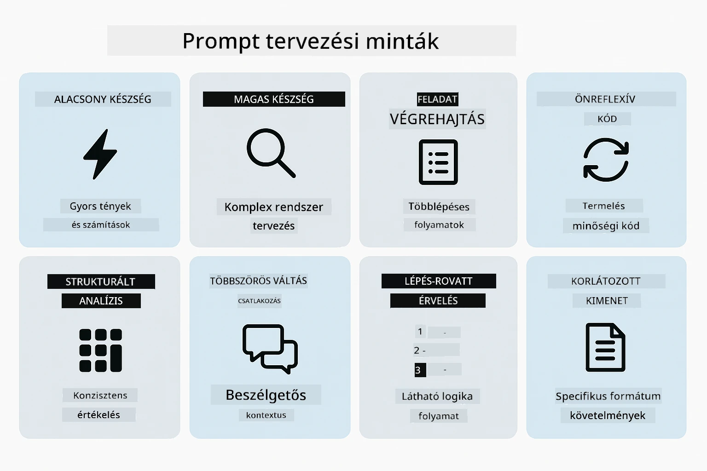
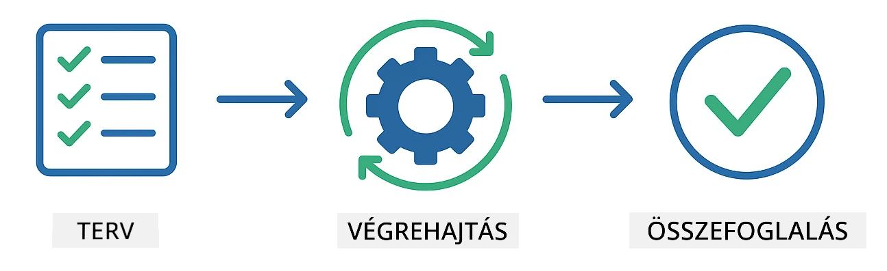
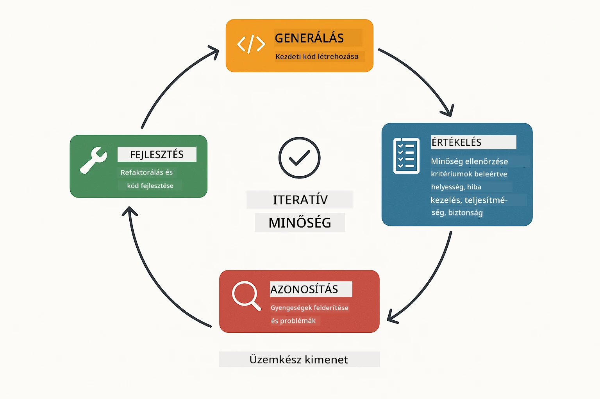
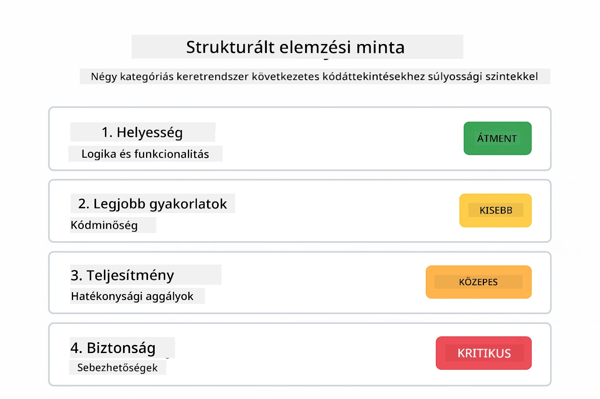
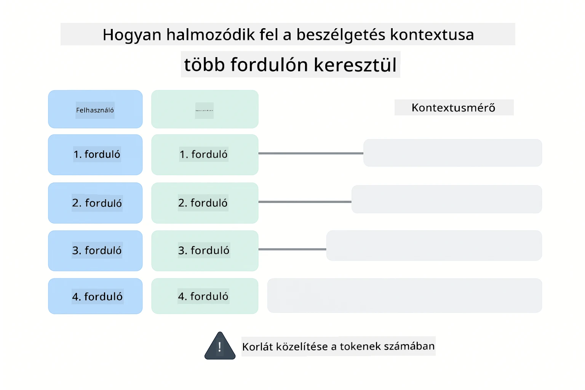
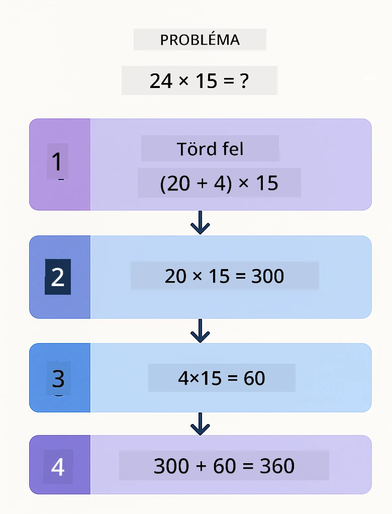
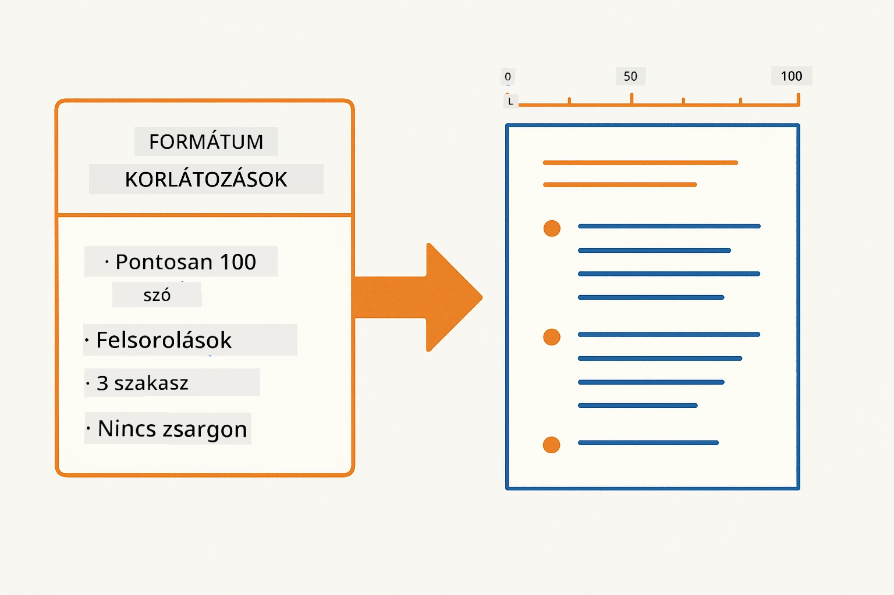
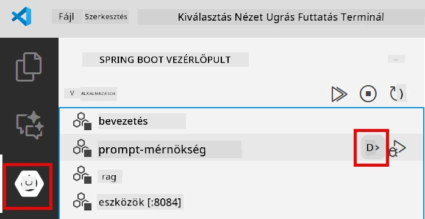
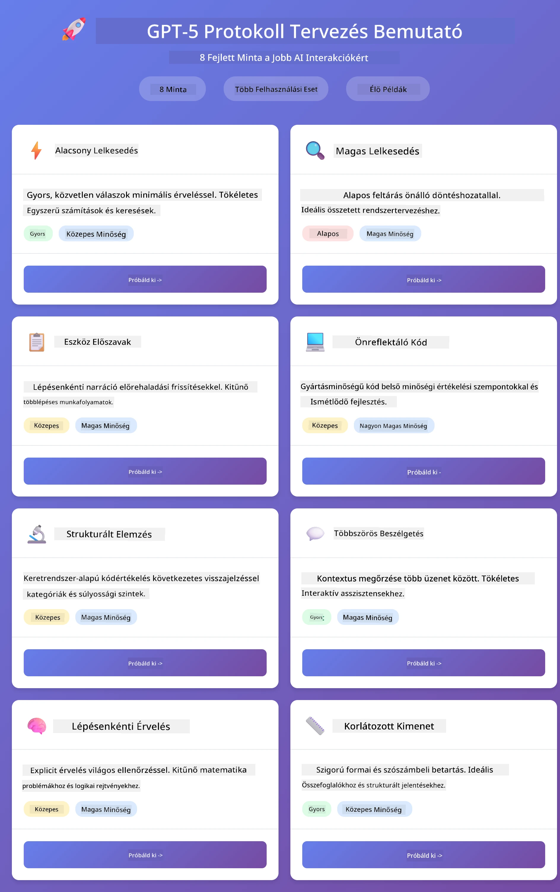
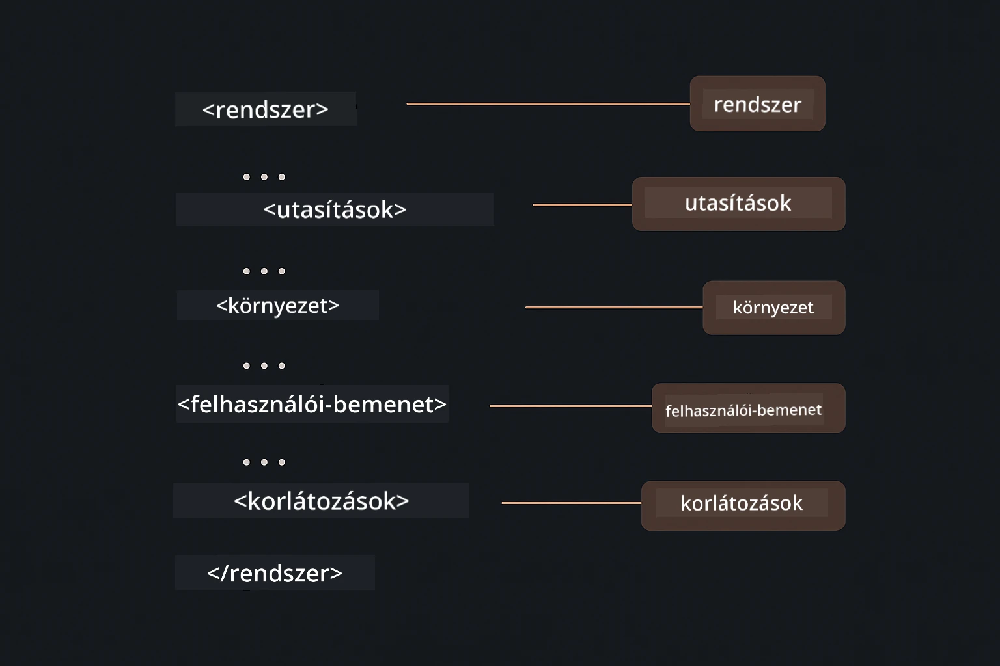

# Modul 02: Prompt Mérés GPT-5.2-vel

## Tartalomjegyzék

- [Videós bemutató](#videós-bemutató)
- [Amit megtanulsz](#amit-megtanulsz)
- [Előfeltételek](#előfeltételek)
- [A Prompt Mérés megértése](#a-prompt-mérés-megértése)
- [A Prompt Mérés alapjai](#a-prompt-mérés-alapjai)
  - [Zero-Shot Prompting](#zero-shot-prompting)
  - [Few-Shot Prompting](#few-shot-prompting)
  - [Gondolatmenet láncolata](#gondolatmenet-láncolata)
  - [Szerepalapú Prompting](#szerepalapú-prompting)
  - [Prompt sablonok](#prompt-sablonok)
- [Fejlett minták](#fejlett-minták)
- [Az alkalmazás futtatása](#az-alkalmazás-futtatása)
- [Az alkalmazás képernyőképei](#alkalmazás-képernyőképek)
- [A minták felfedezése](#a-minták-felfedezése)
  - [Alacsony vs magas lelkesedés](#alacsony-vs-magas-lelkesedés)
  - [Feladat-végrehajtás (Eszköz-előszavak)](#feladatteljesítés-eszköz-bevezetők)
  - [Önreflektáló kód](#önszemléletű-kód)
  - [Strukturált elemzés](#strukturált-elemzés)
  - [Többfordulós csevegés](#többfordulós-chat)
  - [Lépésről lépésre való érvelés](#lépésről-lépésre-történő-érvelés)
  - [Korlátozott kimenet](#korlátozott-kimenet)
- [Amit valóban megtanulsz](#amit-valójában-tanulsz)
- [Következő lépések](#következő-lépések)

## Videós bemutató

Nézd meg ezt az élő adást, amely elmagyarázza, hogyan kezdj neki ennek a modulnak:

<a href="https://www.youtube.com/live/PJ6aBaE6bog?si=LDshyBrTRodP-wke"></a>

## Amit megtanulsz

Az alábbi diagram áttekintést nyújt a modul kulcsfontosságú témáiról és készségeiről — a prompt finomítási technikáktól a lépésenkénti munkafolyamatig, amelyet követni fogsz.


Az előző modulban láttad, hogyan teszi lehetővé a memória a konverzációs AI-t az Azure OpenAI-val. Most arra fókuszálunk, hogyan teszel fel kérdéseket — azaz magukra a promptokra — az Azure OpenAI GPT-5.2 segítségével. A promptok felépítése drámaian befolyásolja a kapott válaszok minőségét. Először áttekintjük az alapvető prompting technikákat, majd áttérünk nyolc fejlett mintára, amelyek teljes mértékben kihasználják a GPT-5.2 képességeit.

A GPT-5.2-t azért használjuk, mert bevezeti az érvelés szabályozását - megmondhatod a modellnek, mennyi gondolkodást végezzen a válaszadás előtt. Ez tisztábban láttatja a különböző prompting stratégiákat és segít megérteni, mikor melyiket alkalmazd.

## Előfeltételek

- Az 01-es modul elvégzése (Azure OpenAI erőforrások telepítve)
- `.env` fájl a gyökérkönyvtárban Azure hitelesítő adatokkal (az `azd up` parancs hozta létre az 01-es modulban)

> **Megjegyzés:** Ha még nem végezted el az 01-es modult, először ott kövesd a telepítési utasításokat.

## A Prompt Mérés megértése

Lényegében a prompt mérnökség a homályos utasítások és a pontosak közötti különbség, ahogy az alábbi összehasonlítás is mutatja.


A prompt mérnökség arról szól, hogy olyan bemenetet tervezz, amely következetesen a kívánt eredményeket hozza. Nem csak kérdések feltevése – hanem az igények olyan strukturálása, hogy a modell pontosan értse, mit szeretnél, és hogyan adja vissza.

Gondolj rá úgy, mint amikor utasítást adsz egy kollégának. „Javítsd a hibát” homályos. „Javítsd a null pointer exception-t a UserService.java 45. sorában egy null ellenőrzés hozzáadásával” specifikus. A nyelvi modellek ugyanígy működnek – a konkrétság és az struktúra számít.

Az alábbi diagram azt mutatja, hogyan illeszkedik ebbe a képbe a LangChain4j — összekapcsolva a prompt mintáidat a modellel a SystemMessage és UserMessage építőelemek segítségével.


A LangChain4j az infrastruktúrát biztosítja — modellkapcsolatokat, memóriát és üzenettípusokat — míg a prompt minták csupán gondosan strukturált szövegek, amelyeket ezen az infrastruktúrán keresztül küldesz. A kulcsfontosságú építőelemek a `SystemMessage` (ami beállítja az AI viselkedését és szerepét) és a `UserMessage` (ami az aktuális kérést hordozza).

## A Prompt Mérés alapjai

Az alább látható öt alapvető technika képezi a hatékony prompt mérnökség alapját. Mindegyik más-más aspektusát célozza meg annak, ahogyan kommunikálsz a nyelvi modellekkel.


Mielőtt belevágnánk a fejlett mintákba, nézzük át az öt alapvető prompting technikát. Ezek az építőelemei minden prompt mérnök eszköztárának.

### Zero-Shot Prompting

A legegyszerűbb megközelítés: adj közvetlen utasítást a modellnek példák nélkül. A modell teljes mértékben a tanulására támaszkodik a feladat megértéséhez és végrehajtásához. Ez jól működik egyszerű kéréseknél, ahol az elvárt viselkedés nyilvánvaló.


*Közvetlen utasítás példák nélkül — a modell csak az utasításból következtet a feladatra*

```java
String prompt = "Classify this sentiment: 'I absolutely loved the movie!'";
String response = model.chat(prompt);
// Válasz: "Pozitív"
```

**Mikor használd:** Egyszerű osztályozások, közvetlen kérdések, fordítások vagy bármilyen feladat, amit a modell további iránymutatás nélkül kezelni tud.

### Few-Shot Prompting

Adj példákat, amelyek megmutatják, milyen mintát szeretnél, hogy a modell kövessen. A modell megtanulja az elvárt input-output formátumot a példáidból, és alkalmazza azt új bemenetekre. Ez drámaian javítja a következetességet azoknál a feladatoknál, ahol a kívánt formátum vagy viselkedés nem nyilvánvaló.


*Példákból tanulva — a modell felismeri a mintát, és alkalmazza új inputokra*

```java
String prompt = """
    Classify the sentiment as positive, negative, or neutral.
    
    Examples:
    Text: "This product exceeded my expectations!" → Positive
    Text: "It's okay, nothing special." → Neutral
    Text: "Waste of money, very disappointed." → Negative
    
    Now classify this:
    Text: "Best purchase I've made all year!"
    """;
String response = model.chat(prompt);
```

**Mikor használd:** Egyedi osztályozások, következetes formázás, domain-specifikus feladatok, vagy amikor a zero-shot eredmények nem megbízhatóak.

### Gondolatmenet láncolata

Kérd meg a modellt, hogy mutassa meg érvelését lépésről lépésre. Ahelyett, hogy azonnal válaszolna, a modell lebontja a problémát, és expliciten végighalad minden részen. Ez javítja a pontosságot matek, logika és többlépéses érvelési feladatoknál.


*Lépésenkénti érvelés — a komplex problémák explicit logikai lépésekre bontása*

```java
String prompt = """
    Problem: A store has 15 apples. They sell 8 apples and then 
    receive a shipment of 12 more apples. How many apples do they have now?
    
    Let's solve this step-by-step:
    """;
String response = model.chat(prompt);
// A modell azt mutatja: 15 - 8 = 7, majd 7 + 12 = 19 alma
```

**Mikor használd:** Matematikai problémák, logikai rejtvények, hibakeresés vagy bármilyen feladat, ahol az érvelési folyamat láthatósága növeli a pontosságot és a bizalmat.

### Szerepalapú Prompting

Állíts be egy személyiséget vagy szerepet az AI-nak a kérdésed feltétele előtt. Ez kontextust ad, ami alakítja a válasz hangnemét, mélységét és fókuszát. Egy „szoftver architect” más tanácsot ad, mint egy „junior fejlesztő” vagy egy „biztonsági auditor”.


*Kontextus és személyiség beállítása — ugyanaz a kérdés más választ kap a megadott szerep függvényében*

```java
String prompt = """
    You are an experienced software architect reviewing code.
    Provide a brief code review for this function:
    
    def calculate_total(items):
        total = 0
        for item in items:
            total = total + item['price']
        return total
    """;
String response = model.chat(prompt);
```

**Mikor használd:** Kódellenőrzés, oktatás, domain-specifikus elemzések, vagy amikor a válaszokat egy adott szakértelmi szinthez vagy nézőponthoz kell szabni.

### Prompt sablonok

Készíts újrahasználható promptokat változó helyőrzőkkel. Új prompt írása helyett egyszer definiálsz egy sablont, majd különféle értékekkel töltöd fel. A LangChain4j `PromptTemplate` osztálya ezt `{{variable}}` szintaxissal egyszerűvé teszi.


*Újrahasználható prompt változó helyőrzőkkel — egy sablon, sok használat*

```java
PromptTemplate template = PromptTemplate.from(
    "What's the best time to visit {{destination}} for {{activity}}?"
);

Prompt prompt = template.apply(Map.of(
    "destination", "Paris",
    "activity", "sightseeing"
));

String response = model.chat(prompt.text());
```

**Mikor használd:** Ismétlődő lekérdezések különböző bemenetekkel, tömeges feldolgozás, újrahasználható AI munkafolyamatok építése, vagy bármilyen eset, ahol a prompt struktúrája azonos, de az adat változik.

---

Ezek az öt alapelv egy szilárd eszköztárat ad a legtöbb prompting feladathoz. A modul további része erre épít **nyolc fejlett mintával**, amelyek kihasználják a GPT-5.2 érvelés-szabályozását, önértékelését és strukturált kimenet képességeit.

## Fejlett minták

Az alapok után térjünk át a nyolc fejlett mintára, amelyek egyedivé teszik ezt a modult. Nem minden probléma igényli ugyanazt a megközelítést. Egyes kérdések gyors válaszokat kívánnak, mások mély gondolkodást. Egyeseknél szükséges az érvelés láthatósága, másoknál csak az eredmény számít. Az alábbi minták mindegyike más helyzetre lett optimalizálva — és a GPT-5.2 érvelés-szabályozása még nyilvánvalóbbá teszi a különbségeket.



*A nyolc prompt mérnökségi minta áttekintése és felhasználási eseteik*

A GPT-5.2 egy új dimenziót ad ezekhez a mintákhoz: *érvelés szabályozása*. Az alábbi csúszka azt mutatja, hogyan állíthatod be a modell gondolkodási erőfeszítését — a gyors, közvetlen válaszoktól a mély, alapos elemzésig.


*A GPT-5.2 érvelés szabályozásával megadhatod, mennyi gondolkodást végezzen a modell — a gyors közvetlen válaszoktól a mély feltárásig*

**Alacsony lelkesedés (gyors és fókuszált)** - Egyszerű kérdésekhez, ahol gyors, tömör válaszokat akarsz. A modell minimális érvelést végez - maximum 2 lépés. Használd számításokhoz, keresésekhez, vagy egyenes kérdésekhez.

```java
String prompt = """
    <context_gathering>
    - Search depth: very low
    - Bias strongly towards providing a correct answer as quickly as possible
    - Usually, this means an absolute maximum of 2 reasoning steps
    - If you think you need more time, state what you know and what's uncertain
    </context_gathering>
    
    Problem: What is 15% of 200?
    
    Provide your answer:
    """;

String response = chatModel.chat(prompt);
```

> 💡 **Fedezd fel GitHub Copilot-tal:** Nyisd meg a [`Gpt5PromptService.java`](../../../02-prompt-engineering/src/main/java/com/example/langchain4j/prompts/service/Gpt5PromptService.java) fájlt és kérdezd:
> - „Mi a különbség az alacsony és magas lelkesedésű prompting minták között?”
> - „Hogyan segítenek az XML tagek a promptokban az AI válaszának strukturálásában?”
> - „Mikor használjam az önreflexiós mintákat közvetlen utasítás helyett?”

**Magas lelkesedés (mély és alapos)** - Komplex problémákhoz, ahol átfogó elemzést szeretnél. A modell alaposan vizsgálódik és részletes érvelést mutat. Használd rendszertervezéshez, architektúra döntésekhez vagy komplex kutatáshoz.

```java
String prompt = """
    Analyze this problem thoroughly and provide a comprehensive solution.
    Consider multiple approaches, trade-offs, and important details.
    Show your analysis and reasoning in your response.
    
    Problem: Design a caching strategy for a high-traffic REST API.
    """;

String response = chatModel.chat(prompt);
```

**Feladat-végrehajtás (lépésenkénti haladás)** - Többlépéses munkafolyamatokhoz. A modell előzetesen tervet ad, narrálja az egyes lépéseket, majd összefoglal. Használd migrációkhoz, implementációkhoz, vagy bármilyen többlépéses folyamathoz.

```java
String prompt = """
    <task_execution>
    1. First, briefly restate the user's goal in a friendly way
    
    2. Create a step-by-step plan:
       - List all steps needed
       - Identify potential challenges
       - Outline success criteria
    
    3. Execute each step:
       - Narrate what you're doing
       - Show progress clearly
       - Handle any issues that arise
    
    4. Summarize:
       - What was completed
       - Any important notes
       - Next steps if applicable
    </task_execution>
    
    <tool_preambles>
    - Always begin by rephrasing the user's goal clearly
    - Outline your plan before executing
    - Narrate each step as you go
    - Finish with a distinct summary
    </tool_preambles>
    
    Task: Create a REST endpoint for user registration
    
    Begin execution:
    """;

String response = chatModel.chat(prompt);
```

A Chain-of-Thought prompting kifejezetten kéri a modellt, hogy mutassa meg érvelési folyamatát, ami növeli a pontosságot összetett feladatoknál. A lépésenkénti bontás segíti az embereket és az AI-t is az értelem megértésében.

> **🤖 Próbáld ki a [GitHub Copilot](https://github.com/features/copilot) Csevegéssel:** Kérdezz erről a mintáról:
> - „Hogyan alakítanám át a feladat-végrehajtási mintát hosszú ideig futó műveletekre?”
> - „Mik a legjobb gyakorlatok eszköz-előszavak strukturálására éles alkalmazásokban?”
> - „Hogyan tudok rögzíteni és megjeleníteni köztes előrehaladási állapotokat egy UI-ban?”

Az alábbi diagram illusztrálja a Terv → Végrehajtás → Összefoglalás munkafolyamatot.



*Terv → Végrehajtás → Összefoglalás munkafolyamat többlépéses feladatokhoz*

**Önreflektáló kód** - Termelési minőségű kód generálásához. A modell termelési szabványok szerint generál kódot megfelelő hibakezeléssel. Használd új funkciók vagy szolgáltatások fejlesztésénél.

```java
String prompt = """
    Generate Java code with production-quality standards: Create an email validation service
    Keep it simple and include basic error handling.
    """;

String response = chatModel.chat(prompt);
```

Az alábbi diagram ezt az iteratív fejlesztési ciklust mutatja be — generálás, értékelés, gyengeségek azonosítása és finomítás, amíg a kód megfelel a termelési szabványoknak.



*Iteratív fejlesztési ciklus - generálás, értékelés, problémák azonosítása, javítás, ismétlés*

**Strukturált elemzés** - Következetes értékeléshez. A modell egy rögzített keretrendszerrel vizsgálja a kódot (helyesség, gyakorlatok, teljesítmény, biztonság, fenntarthatóság). Használd kódellenőrzéshez vagy minőségellenőrzéshez.

```java
String prompt = """
    <analysis_framework>
    You are an expert code reviewer. Analyze the code for:
    
    1. Correctness
       - Does it work as intended?
       - Are there logical errors?
    
    2. Best Practices
       - Follows language conventions?
       - Appropriate design patterns?
    
    3. Performance
       - Any inefficiencies?
       - Scalability concerns?
    
    4. Security
       - Potential vulnerabilities?
       - Input validation?
    
    5. Maintainability
       - Code clarity?
       - Documentation?
    
    <output_format>
    Provide your analysis in this structure:
    - Summary: One-sentence overall assessment
    - Strengths: 2-3 positive points
    - Issues: List any problems found with severity (High/Medium/Low)
    - Recommendations: Specific improvements
    </output_format>
    </analysis_framework>
    
    Code to analyze:
    ```
    public List getUsers() {
        return database.query("SELECT * FROM users");
    }
    ```
    Provide your structured analysis:
    """;

String response = chatModel.chat(prompt);
```

> **🤖 Próbáld ki a [GitHub Copilot](https://github.com/features/copilot) Csevegéssel:** Kérdezz a strukturált elemzésről:
> - „Hogyan testre szabhatom az elemzési keretrendszert különböző kódellenőrzési típusokra?”
> - „Mi a legjobb módja a strukturált kimenet programozott feldolgozásának és feldolgozásának?”
> - „Hogyan biztosíthatom a következetes súlyossági szinteket különböző ellenőrzési ülések között?”

Az alábbi diagram bemutatja, hogyan szervezi ezt a strukturált keretrendszer egy kódellenőrzést következetes kategóriákba súlyossági szintekkel.



*Következetes kódellenőrzések keretrendszere súlyossági szintekkel*

**Többfordulós csevegés** - Kontextust igénylő beszélgetésekhez. A modell emlékszik az előző üzenetekre és azokra épít. Használd interaktív segítségnyújtó vagy összetett kérdés-felelet alkalmakhoz.

```java
ChatMemory memory = MessageWindowChatMemory.withMaxMessages(10);

memory.add(UserMessage.from("What is Spring Boot?"));
AiMessage aiMessage1 = chatModel.chat(memory.messages()).aiMessage();
memory.add(aiMessage1);

memory.add(UserMessage.from("Show me an example"));
AiMessage aiMessage2 = chatModel.chat(memory.messages()).aiMessage();
memory.add(aiMessage2);
```

Az alábbi diagram szemlélteti, hogyan halmozódik fel a beszélgetés kontextusa fordulóról fordulóra, és hogyan kapcsolódik a modell token-korlátjához.



*Hogyan gyűlik össze a beszélgetés kontextusa több fordulón át a token-korlátig*

**Lépésről lépésre való érvelés** - Látható logikát igénylő problémákhoz. A modell minden lépésnél explicit érvelést mutat. Használd matek problémákhoz, logikai rejtvényekhez, vagy amikor meg kell értened a gondolkodási folyamatot.

```java
String prompt = """
    <instruction>Show your reasoning step-by-step</instruction>
    
    If a train travels 120 km in 2 hours, then stops for 30 minutes,
    then travels another 90 km in 1.5 hours, what is the average speed
    for the entire journey including the stop?
    """;

String response = chatModel.chat(prompt);
```

Az alábbi diagram bemutatja, hogyan bontja a modell a problémákat explicit, számozott logikai lépésekre.


*Problémák lebontása kifejezett logikai lépésekre*

**Korlátozott kimenet** – Olyan válaszokhoz, amelyeknek specifikus formátum- és hosszúságkövetelményük van. A modell szigorúan követi a formátum és hosszúság szabályait. Használd ezt összefoglalókhoz vagy ha pontos kimeneti szerkezetre van szükséged.

```java
String prompt = """
    <constraints>
    - Exactly 100 words
    - Bullet point format
    - Technical terms only
    </constraints>
    
    Summarize the key concepts of machine learning.
    """;

String response = chatModel.chat(prompt);
```

Az alábbi diagram bemutatja, hogyan irányítják a korlátozások a modellt, hogy olyan kimenetet készítsen, amely szigorúan megfelel a formátum- és hosszúsági követelményeknek.



*Speciális formátum-, hosszúsági és szerkezeti követelmények érvényesítése*

## Az alkalmazás futtatása

**Telepítés ellenőrzése:**

Győződj meg róla, hogy a `.env` fájl létezik a gyökérkönyvtárban az Azure hitelesítési adatokkal (amelyet az 01-es modul során hoztál létre). Futtasd ezt a modul könyvtárából (`02-prompt-engineering/`):

**Bash:**
```bash
cat ../.env  # Meg kell mutatnia az AZURE_OPENAI_ENDPOINT, API_KEY, DEPLOYMENT értékeket
```

**PowerShell:**
```powershell
Get-Content ..\.env  # Meg kell jelenítenie az AZURE_OPENAI_ENDPOINT, API_KEY, DEPLOYMENT értékeket
```

**Az alkalmazás indítása:**

> **Megjegyzés:** Ha már indítottad az összes alkalmazást a `./start-all.sh` használatával a gyökérkönyvtárból (ahogy az az 01-es modulban le van írva), akkor ez a modul már fut a 8083-as porton. Átugorhatod az alábbi indító parancsokat, és közvetlenül elmehetsz a http://localhost:8083 oldalra.

**1. lehetőség: Spring Boot Dashboard használata (ajánlott VS Code felhasználóknak)**

A fejlesztői konténer tartalmazza a Spring Boot Dashboard bővítményt, amely vizuális felületet biztosít az összes Spring Boot alkalmazás kezelésére. Megtalálod a VS Code bal oldali Művelet sávjában (keresd a Spring Boot ikont).

A Spring Boot Dashboard-ról:
- Az összes elérhető Spring Boot alkalmazást látod a munkaterületen
- Egy kattintással indíthatsz/leállíthatsz alkalmazásokat
- Valós időben nézheted az alkalmazások naplóit
- Figyelemmel kísérheted az alkalmazások állapotát

Egyszerűen kattints a lejátszás gombra a "prompt-engineering" mellett az adott modul indításához, vagy indítsd el egyszerre az összes modult.



*A Spring Boot Dashboard a VS Code-ban — indítsd, állítsd le és figyeld az összes modult egy helyről*

**2. lehetőség: Shell script-ek használata**

Indítsd el az összes webalkalmazást (01-04 modulok):

**Bash:**
```bash
cd ..  # A gyökérkönyvtárból
./start-all.sh
```

**PowerShell:**
```powershell
cd ..  # A gyökérkönyvtárból
.\start-all.ps1
```

Vagy indítsd el csak ezt a modult:

**Bash:**
```bash
cd 02-prompt-engineering
./start.sh
```

**PowerShell:**
```powershell
cd 02-prompt-engineering
.\start.ps1
```

Mindkét script automatikusan betölti a root `.env` fájlban lévő környezeti változókat, és felépíti a JAR fájlokat, ha még nem léteznek.

> **Megjegyzés:** Ha manuálisan szeretnéd buildelni az összes modult az indítás előtt:
>
> **Bash:**
> ```bash
> cd ..  # Go to root directory
> mvn clean package -DskipTests
> ```
>
> **PowerShell:**
> ```powershell
> cd ..  # Go to root directory
> mvn clean package -DskipTests
> ```

Nyisd meg a böngésződben a http://localhost:8083 címet.

**Leállításhoz:**

**Bash:**
```bash
./stop.sh  # Csak ez a modul
# Vagy
cd .. && ./stop-all.sh  # Minden modul
```

**PowerShell:**
```powershell
.\stop.ps1  # Csak ez a modul
# Vagy
cd ..; .\stop-all.ps1  # Minden modul
```

## Alkalmazás képernyőképek

Íme a prompt engineering modul fő kezelőfelülete, ahol egyszerre kísérletezhetsz a nyolc minta mindegyikével.



*A fő műszerfal, mely az összes 8 prompt engineering mintát mutatja jellemzőikkel és használati eseteikkel együtt*

## A minták felfedezése

A webes felület lehetővé teszi, hogy különböző promptolási stratégiákkal kísérletezz. Minden minta más problémát old meg – próbáld ki őket, hogy lásd, mikor működik jól egy-egy megközelítés.

> **Megjegyzés: Streaming vagy nem streaming** — Minden mintának van két gombja: **🔴 Stream Response (Live)** és egy **Nem streaming** opció. A streaming a Server-Sent Events (SSE) használatával valós időben mutatja a tokeneket, miközben a modell generálja őket, így azonnal látod a folyamatot. A nem streaming opció megvárja az egész választ, mielőtt megjeleníti. Mély gondolkodást igénylő promptoknál (pl. High Eagerness, Self-Reflecting Code) a nem streaming hívás nagyon hosszú ideig is eltarthat – néha percekig – látható visszajelzés nélkül. **Komplex promptok teszteléséhez használj streaminget**, hogy lásd a modell működését, és ne tűnjön úgy, mintha időtúllépés történt volna.
>
> **Megjegyzés: Böngésző követelmény** — A streaming funkció a Fetch Streams API-t használja (`response.body.getReader()`), ami teljes böngészőt igényel (Chrome, Edge, Firefox, Safari). Nem működik a VS Code beépített Simple Browser-ében, mivel annak webnézetében nem támogatott a ReadableStream API. Ha a Simple Browser-t használod, a nem streaming gombok továbbra is működnek rendesen – csak a streaming gombokat érinti. A teljes élményért nyisd meg `http://localhost:8083` külső böngészőben.

### Alacsony vs Magas lelkesedés

Tegyél fel egy egyszerű kérdést, például „Mi a 15%-a 200-nak?” Alacsony lelkesedéssel azonnali, közvetlen választ kapsz. Most tegyél fel egy összetettebb kérdést, például „Tervezzen gyorsítótárazási stratégiát egy nagyforgalmú API-hoz” Magas lelkesedéssel. Kattints a **🔴 Stream Response (Live)**-re, és nézd, ahogy a modell részletes gondolkodása tokenenként megjelenik. Ugyanaz a modell, ugyanaz a kérdésfelépítés – csak a prompt határozza meg, mennyit gondolkodjon.

### Feladatteljesítés (Eszköz bevezetők)

A többlépéses munkafolyamatok előnyhöz jutnak az előzetes tervezés és az előrehaladás narrációja miatt. A modell vázolja, mit fog csinálni, narrálja az egyes lépéseket, majd összefoglalja az eredményeket.

### Önszemléletű kód

Próbáld ki a „Hozz létre egy e-mail érvényesítő szolgáltatást” kérést. Ahelyett, hogy csak kódot generálna, és abbahagyná, a modell generál, értékel minőségi kritériumok alapján, azonosítja a gyengeségeket, majd javít. Látni fogod, hogy iterál addig, amíg a kód megfelel a termelési követelményeknek.

### Strukturált elemzés

A kódáttekintésekhez konzisztens értékelési keretrendszerek szükségesek. A modell rögzített kategóriák (helyesség, gyakorlatok, teljesítmény, biztonság) és súlyossági szintek alapján elemzi a kódot.

### Többfordulós chat

Kérdezd meg: „Mi az a Spring Boot?”, majd azonnal kérd meg: „Mutass egy példát”. A modell emlékszik az első kérdésedre és egy Spring Boot példát ad speciálisan. Memória nélkül a második kérdés túl általános lenne.

### Lépésről lépésre történő érvelés

Válassz egy matematikai problémát, és próbáld ki mind a Lépésről lépésre érvelést, mind az Alacsony lelkesedést. Az alacsony lelkesedés csak megadja a választ – gyors, de kevésbé átlátható. A lépésről lépésre megmutatja minden számítást és döntést.

### Korlátozott kimenet

Ha specifikus formátumra vagy szószámra van szükséged, ez a minta szigorúan betartatja ezeket. Próbálj meg egy pontosan 100 szóból álló listás összefoglalót generálni.

## Amit valójában tanulsz

**Az érvelési erőfeszítés mindent megváltoztat**

A GPT-5.2 lehetővé teszi, hogy a promptjaidon keresztül szabályozd a számítási erőfeszítést. Az alacsony erőfeszítés gyors válaszokat jelent minimális feltárással. A magas erőfeszítés azt jelenti, hogy a modell időt szán a mély gondolkodásra. Megtanulod, hogyan igazítsd az erőfeszítést a feladat összetettségéhez – ne pazarold az időt egyszerű kérdésekre, de ne siess el összetett döntéseket se.

**A szerkezet szabályozza a viselkedést**

Észrevetted a promptokban szereplő XML címkéket? Nem csupán díszek. A modellek megbízhatóbban követik a strukturált utasításokat, mint a szabad szöveget. Amikor többlépéses folyamatokra vagy összetett logikára van szükség, a szerkezet segít a modellnek követni, hol tart, és mi következik. Az alábbi diagram lebontja egy jól strukturált prompt felépítését, és megmutatja, hogyan szervezik az utasításokat a `<system>`, `<instructions>`, `<context>`, `<user-input>` és `<constraints>` címkék világos szakaszokra.



*A jól strukturált prompt anatómiája világos szakaszokkal és XML-stílusú szervezéssel*

**Minőség önértékeléssel**

Az önreflektáló minták úgy működnek, hogy a minőségi kritériumokat explicit módon megadják. Ahelyett, hogy csak remélnéd, hogy a modell "jól csinálja", pontosan megmondod neki, mit jelent a "jól": helyes logika, hibakezelés, teljesítmény, biztonság. A modell így értékelni tudja saját kimenetét és javítani. Ez a kódgenerálást lotériából folyamatba alakítja.

**A kontextus véges**

A többfordulós beszélgetések úgy működnek, hogy minden kéréshez tartalmazzák az üzenettörténetet. De van egy határ – minden modellnek maximális token száma van. Ahogy a beszélgetések nőnek, stratégiákra lesz szükséged, hogy a releváns kontextust megőrizd anélkül, hogy elérnéd a korlátot. Ez a modul megmutatja, hogyan működik a memória; később megtanulod, mikor foglalj össze, mikor felejts és mikor kérj vissza információt.

## Következő lépések

**Következő modul:** [03-rag - RAG (Retrieval-Augmented Generation)](../03-rag/README.md)

---

**Navigáció:** [← Előző: 01-es modul - Bevezetés](../01-introduction/README.md) | [Vissza a főoldalra](../README.md) | [Következő: 03-as modul - RAG →](../03-rag/README.md)

---

<!-- CO-OP TRANSLATOR DISCLAIMER START -->
**Jogi nyilatkozat**:
Ez a dokumentum az AI fordítási szolgáltatás, a [Co-op Translator](https://github.com/Azure/co-op-translator) segítségével készült. Bár az pontosságra törekszünk, kérjük, vegye figyelembe, hogy az automatikus fordítások hibákat vagy pontatlanságokat tartalmazhatnak. Az eredeti dokumentum az anyanyelvén tekintendő hiteles forrásnak. Fontos információk esetén professzionális emberi fordítást javasolunk. Nem vállalunk felelősséget semmilyen félreértésért vagy téves értelmezésért, amely ebből a fordításból ered.
<!-- CO-OP TRANSLATOR DISCLAIMER END -->