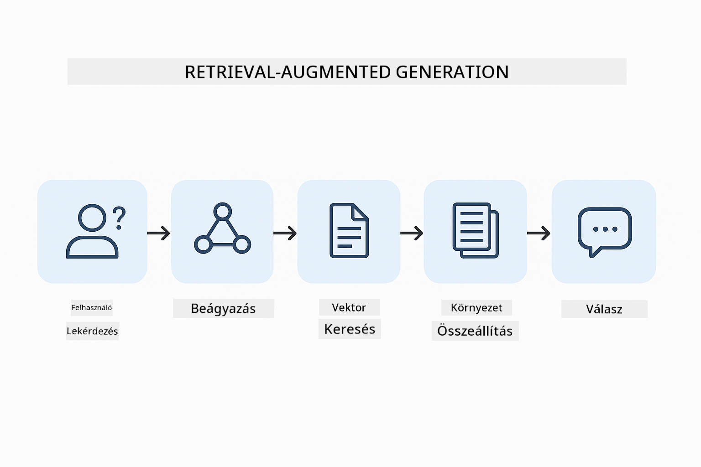
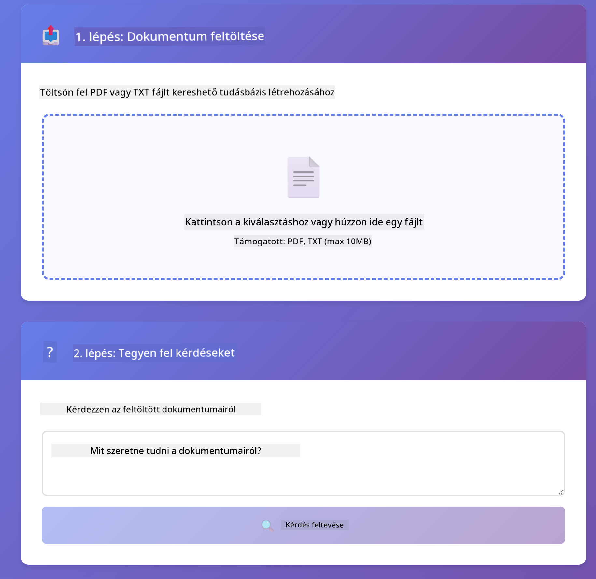
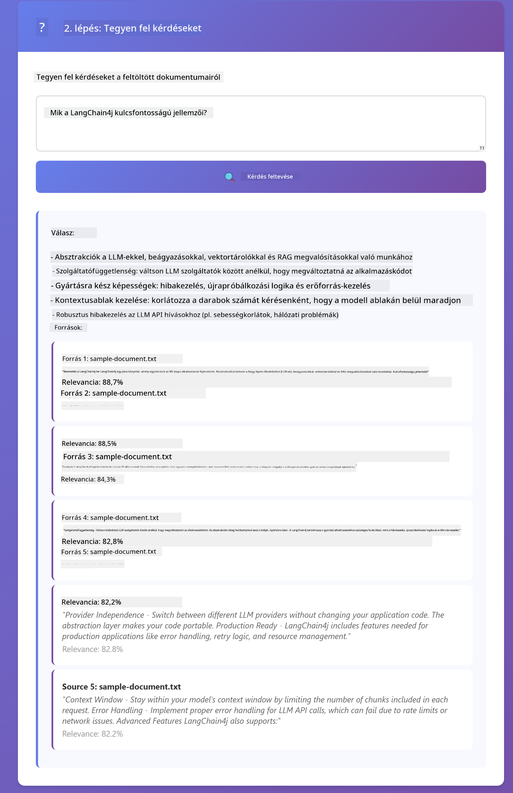

<!--
CO_OP_TRANSLATOR_METADATA:
{
  "original_hash": "f538a51cfd13147d40d84e936a0f485c",
  "translation_date": "2025-12-13T17:13:25+00:00",
  "source_file": "03-rag/README.md",
  "language_code": "hu"
}
-->
# Modul 03: RAG (Retrieval-Augmented Generation)

## Tartalomjegyzék

- [Mit fogsz megtanulni](../../../03-rag)
- [Előfeltételek](../../../03-rag)
- [A RAG megértése](../../../03-rag)
- [Hogyan működik](../../../03-rag)
  - [Dokumentum feldolgozás](../../../03-rag)
  - [Beágyazások létrehozása](../../../03-rag)
  - [Szemantikus keresés](../../../03-rag)
  - [Válaszgenerálás](../../../03-rag)
- [Az alkalmazás futtatása](../../../03-rag)
- [Az alkalmazás használata](../../../03-rag)
  - [Dokumentum feltöltése](../../../03-rag)
  - [Kérdések feltevése](../../../03-rag)
  - [Forrás hivatkozások ellenőrzése](../../../03-rag)
  - [Kísérletezés kérdésekkel](../../../03-rag)
- [Kulcsfogalmak](../../../03-rag)
  - [Darabolási stratégia](../../../03-rag)
  - [Hasonlósági pontszámok](../../../03-rag)
  - [Memóriában tárolás](../../../03-rag)
  - [Kontextus ablak kezelése](../../../03-rag)
- [Mikor fontos a RAG](../../../03-rag)
- [Következő lépések](../../../03-rag)

## Mit fogsz megtanulni

Az előző modulokban megtanultad, hogyan folytass beszélgetéseket az MI-vel, és hogyan strukturáld hatékonyan a promptjaidat. De van egy alapvető korlát: a nyelvi modellek csak azt tudják, amit a tanítás során megtanultak. Nem tudnak válaszolni a céged szabályzataival, projekt dokumentációjával vagy bármilyen olyan információval kapcsolatos kérdésekre, amire nem képezték őket.

A RAG (Retrieval-Augmented Generation) megoldja ezt a problémát. Ahelyett, hogy megpróbálnád megtanítani a modellnek az információidat (ami drága és nem praktikus), képessé teszed arra, hogy átkutassa a dokumentumaidat. Amikor valaki kérdést tesz fel, a rendszer megtalálja a releváns információkat, és beilleszti azokat a promptba. A modell ezután a lekért kontextus alapján válaszol.

Gondolj a RAG-ra úgy, mint egy hivatkozási könyvtár biztosítására a modell számára. Amikor kérdezel, a rendszer:

1. **Felhasználói kérdés** - Felteszel egy kérdést
2. **Beágyazás** - A kérdésedet vektorrá alakítja
3. **Vektoros keresés** - Megkeresi a hasonló dokumentumdarabokat
4. **Kontextus összeállítása** - Hozzáadja a releváns darabokat a prompthoz
5. **Válasz** - Az LLM a kontextus alapján generál választ

Ez a modell válaszait a tényleges adataidra alapozza, nem csak a tanítási tudására vagy kitalált válaszokra.



*RAG munkafolyamat – a felhasználói kérdéstől a szemantikus keresésen át a kontextuális válaszgenerálásig*

## Előfeltételek

- Az 01-es modul befejezve (Azure OpenAI erőforrások telepítve)
- `.env` fájl a gyökérkönyvtárban Azure hitelesítő adatokkal (az 01-es modulban az `azd up` hozta létre)

> **Megjegyzés:** Ha még nem fejezted be az 01-es modult, először kövesd ott a telepítési utasításokat.

## Hogyan működik

**Dokumentum feldolgozás** - [DocumentService.java](../../../03-rag/src/main/java/com/example/langchain4j/rag/service/DocumentService.java)

Amikor feltöltesz egy dokumentumot, a rendszer kisebb darabokra bontja – olyan részekre, amelyek kényelmesen beleférnek a modell kontextusablakába. Ezek a darabok kissé átfedik egymást, hogy a határoknál ne veszíts el kontextust.

```java
Document document = FileSystemDocumentLoader.loadDocument("sample-document.txt");

DocumentSplitter splitter = DocumentSplitters
    .recursive(300, 30, new OpenAiTokenizer());

List<TextSegment> segments = splitter.split(document);
```

> **🤖 Próbáld ki a [GitHub Copilot](https://github.com/features/copilot) Chattel:** Nyisd meg a [`DocumentService.java`](../../../03-rag/src/main/java/com/example/langchain4j/rag/service/DocumentService.java) fájlt, és kérdezd meg:
> - "Hogyan darabolja a LangChain4j a dokumentumokat darabokra, és miért fontos az átfedés?"
> - "Mi az optimális darabméret különböző dokumentumtípusokhoz, és miért?"
> - "Hogyan kezelem a többnyelvű vagy speciális formázású dokumentumokat?"

**Beágyazások létrehozása** - [LangChainRagConfig.java](../../../03-rag/src/main/java/com/example/langchain4j/rag/config/LangChainRagConfig.java)

Minden darabot egy numerikus reprezentációvá alakítanak, amit beágyazásnak hívunk – lényegében egy matematikai ujjlenyomat, amely megragadja a szöveg jelentését. Hasonló szövegek hasonló beágyazásokat eredményeznek.

```java
@Bean
public EmbeddingModel embeddingModel() {
    return OpenAiOfficialEmbeddingModel.builder()
        .baseUrl(azureOpenAiEndpoint)
        .apiKey(azureOpenAiKey)
        .modelName(azureEmbeddingDeploymentName)
        .build();
}

EmbeddingStore<TextSegment> embeddingStore = 
    new InMemoryEmbeddingStore<>();
```


*Dokumentumok vektorokként ábrázolva a beágyazási térben – hasonló tartalmak csoportosulnak*

**Szemantikus keresés** - [RagService.java](../../../03-rag/src/main/java/com/example/langchain4j/rag/service/RagService.java)

Amikor kérdést teszel fel, a kérdésed is beágyazássá válik. A rendszer összehasonlítja a kérdésed beágyazását az összes dokumentumdarab beágyazásával. Megkeresi a leginkább hasonló jelentésű darabokat – nem csak a kulcsszavak egyezését, hanem a tényleges szemantikus hasonlóságot.

```java
Embedding queryEmbedding = embeddingModel.embed(question).content();

List<EmbeddingMatch<TextSegment>> matches = 
    embeddingStore.findRelevant(queryEmbedding, 5, 0.7);

for (EmbeddingMatch<TextSegment> match : matches) {
    String relevantText = match.embedded().text();
    double score = match.score();
}
```

> **🤖 Próbáld ki a [GitHub Copilot](https://github.com/features/copilot) Chattel:** Nyisd meg a [`RagService.java`](../../../03-rag/src/main/java/com/example/langchain4j/rag/service/RagService.java) fájlt, és kérdezd meg:
> - "Hogyan működik a hasonlóság keresés beágyazásokkal, és mi határozza meg a pontszámot?"
> - "Milyen hasonlósági küszöböt használjak, és ez hogyan befolyásolja az eredményeket?"
> - "Hogyan kezelem az eseteket, amikor nem található releváns dokumentum?"

**Válaszgenerálás** - [RagService.java](../../../03-rag/src/main/java/com/example/langchain4j/rag/service/RagService.java)

A legrelevánsabb darabokat beillesztik a modell promptjába. A modell elolvassa ezeket a konkrét darabokat, és ezek alapján válaszol a kérdésedre. Ez megakadályozza a kitalálást – a modell csak az előtte lévő információból tud válaszolni.

## Az alkalmazás futtatása

**Telepítés ellenőrzése:**

Győződj meg róla, hogy a `.env` fájl létezik a gyökérkönyvtárban Azure hitelesítő adatokkal (az 01-es modul során létrehozva):
```bash
cat ../.env  # Meg kell jeleníteni az AZURE_OPENAI_ENDPOINT, API_KEY, DEPLOYMENT értékeket
```

**Az alkalmazás indítása:**

> **Megjegyzés:** Ha már elindítottad az összes alkalmazást az 01-es modulból a `./start-all.sh` segítségével, ez a modul már fut a 8081-es porton. Átugorhatod az alábbi indítási parancsokat, és közvetlenül megnyithatod a http://localhost:8081 címet.

**1. lehetőség: Spring Boot Dashboard használata (ajánlott VS Code felhasználóknak)**

A fejlesztői konténer tartalmazza a Spring Boot Dashboard kiterjesztést, amely vizuális felületet biztosít az összes Spring Boot alkalmazás kezeléséhez. A VS Code bal oldali tevékenységsávjában találod (keresd a Spring Boot ikont).

A Spring Boot Dashboard segítségével:
- Megtekintheted az összes elérhető Spring Boot alkalmazást a munkaterületen
- Egy kattintással indíthatod/leállíthatod az alkalmazásokat
- Valós időben nézheted az alkalmazás naplóit
- Figyelheted az alkalmazás állapotát

Egyszerűen kattints a "rag" melletti lejátszás gombra a modul indításához, vagy indítsd el az összes modult egyszerre.


**2. lehetőség: Shell szkriptek használata**

Indítsd el az összes webalkalmazást (01-04 modulok):

**Bash:**
```bash
cd ..  # A gyökérkönyvtárból
./start-all.sh
```

**PowerShell:**
```powershell
cd ..  # A gyökérkönyvtárból
.\start-all.ps1
```

Vagy indítsd el csak ezt a modult:

**Bash:**
```bash
cd 03-rag
./start.sh
```

**PowerShell:**
```powershell
cd 03-rag
.\start.ps1
```

Mindkét szkript automatikusan betölti a környezeti változókat a gyökér `.env` fájlból, és ha szükséges, lefordítja a JAR fájlokat.

> **Megjegyzés:** Ha inkább manuálisan szeretnéd lefordítani az összes modult indítás előtt:
>
> **Bash:**
> ```bash
> cd ..  # Go to root directory
> mvn clean package -DskipTests
> ```
>
> **PowerShell:**
> ```powershell
> cd ..  # Go to root directory
> mvn clean package -DskipTests
> ```

Nyisd meg a http://localhost:8081 címet a böngésződben.

**Leállításhoz:**

**Bash:**
```bash
./stop.sh  # Csak ez a modul
# Vagy
cd .. && ./stop-all.sh  # Minden modul
```

**PowerShell:**
```powershell
.\stop.ps1  # Csak ez a modul
# Vagy
cd ..; .\stop-all.ps1  # Minden modul
```

## Az alkalmazás használata

Az alkalmazás webes felületet biztosít dokumentum feltöltéshez és kérdések feltevéséhez.

<a href="images/rag-homepage.png"></a>

*A RAG alkalmazás felülete – dokumentumok feltöltése és kérdések feltevése*

**Dokumentum feltöltése**

Kezdd egy dokumentum feltöltésével – teszteléshez a TXT fájlok a legjobbak. Ebben a könyvtárban található egy `sample-document.txt`, amely információkat tartalmaz a LangChain4j funkcióiról, a RAG megvalósításról és a legjobb gyakorlatokról – tökéletes a rendszer teszteléséhez.

A rendszer feldolgozza a dokumentumot, darabokra bontja, és minden darabhoz beágyazást készít. Ez automatikusan történik a feltöltéskor.

**Kérdések feltevése**

Most tegyél fel konkrét kérdéseket a dokumentum tartalmáról. Próbálj meg valami tényalapút, ami egyértelműen szerepel a dokumentumban. A rendszer megkeresi a releváns darabokat, beilleszti őket a promptba, és választ generál.

**Forrás hivatkozások ellenőrzése**

Figyeld meg, hogy minden válasz tartalmaz forrás hivatkozásokat hasonlósági pontszámokkal. Ezek a pontszámok (0-tól 1-ig) megmutatják, mennyire volt releváns az adott darab a kérdésedhez. A magasabb pontszám jobb egyezést jelent. Ez lehetővé teszi, hogy ellenőrizd a választ az eredeti anyag alapján.

<a href="images/rag-query-results.png"></a>

*Kérdezési eredmények, válasz forrás hivatkozásokkal és relevancia pontszámokkal*

**Kísérletezz kérdésekkel**

Próbálj ki különböző típusú kérdéseket:
- Konkrét tények: "Mi a fő téma?"
- Összehasonlítások: "Mi a különbség X és Y között?"
- Összefoglalók: "Foglald össze a legfontosabb pontokat Z-ről"

Figyeld, hogyan változnak a relevancia pontszámok attól függően, mennyire illeszkedik a kérdésed a dokumentum tartalmához.

## Kulcsfogalmak

**Darabolási stratégia**

A dokumentumokat 300 tokenes darabokra bontjuk, 30 token átfedéssel. Ez az egyensúly biztosítja, hogy minden darab elég kontextust tartalmazzon, hogy értelmes legyen, miközben elég kicsi marad ahhoz, hogy több darab is beleférjen egy promptba.

**Hasonlósági pontszámok**

A pontszámok 0 és 1 között mozognak:
- 0,7-1,0: Nagyon releváns, pontos egyezés
- 0,5-0,7: Releváns, jó kontextus
- 0,5 alatt: Kiszűrve, túl eltérő

A rendszer csak a minimum küszöböt meghaladó darabokat veszi figyelembe a minőség biztosítása érdekében.

**Memóriában tárolás**

Ez a modul egyszerűség kedvéért memóriában tárolja az adatokat. Az alkalmazás újraindításakor a feltöltött dokumentumok elvesznek. Éles rendszerek tartós vektor adatbázisokat használnak, mint például a Qdrant vagy az Azure AI Search.

**Kontextus ablak kezelése**

Minden modellnek van egy maximális kontextus ablaka. Nem lehet minden darabot belefoglalni egy nagy dokumentumból. A rendszer a legrelevánsabb N darabot (alapértelmezett 5) választja ki, hogy a korlátokon belül maradjon, miközben elegendő kontextust biztosít a pontos válaszokhoz.

## Mikor fontos a RAG

**Használd a RAG-ot, ha:**
- Saját dokumentumokkal kapcsolatos kérdésekre válaszolsz
- Az információ gyakran változik (szabályzatok, árak, specifikációk)
- Pontosságot igényel a forrás megjelölése
- A tartalom túl nagy ahhoz, hogy egy promptba beleférjen
- Ellenőrizhető, megalapozott válaszokra van szükség

**Ne használd a RAG-ot, ha:**
- Általános tudást igénylő kérdések vannak, amit a modell már ismer
- Valós idejű adatokra van szükség (a RAG feltöltött dokumentumokon működik)
- A tartalom elég kicsi ahhoz, hogy közvetlenül a promptba kerüljön

## Következő lépések

**Következő modul:** [04-tools - AI ügynökök eszközökkel](../04-tools/README.md)

---

**Navigáció:** [← Előző: Modul 02 - Prompt tervezés](../02-prompt-engineering/README.md) | [Vissza a főoldalra](../README.md) | [Következő: Modul 04 - Eszközök →](../04-tools/README.md)

---

<!-- CO-OP TRANSLATOR DISCLAIMER START -->
**Jogi nyilatkozat**:
Ezt a dokumentumot az AI fordító szolgáltatás, a [Co-op Translator](https://github.com/Azure/co-op-translator) segítségével fordítottuk le. Bár a pontosságra törekszünk, kérjük, vegye figyelembe, hogy az automatikus fordítások hibákat vagy pontatlanságokat tartalmazhatnak. Az eredeti dokumentum az anyanyelvén tekintendő hiteles forrásnak. Fontos információk esetén szakmai, emberi fordítást javaslunk. Nem vállalunk felelősséget a fordítás használatából eredő félreértésekért vagy téves értelmezésekért.
<!-- CO-OP TRANSLATOR DISCLAIMER END -->