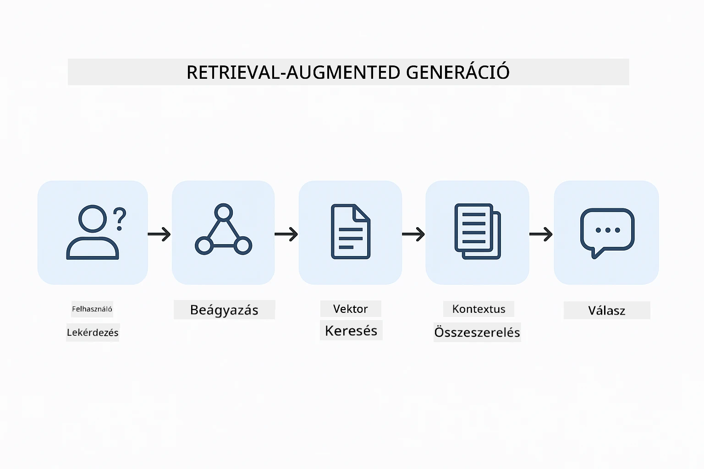
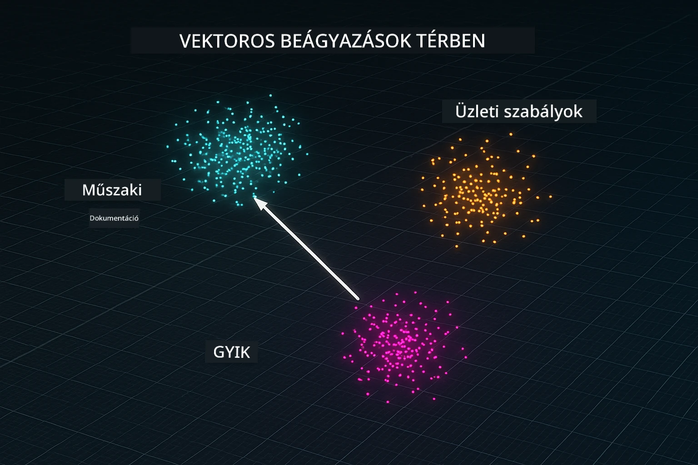
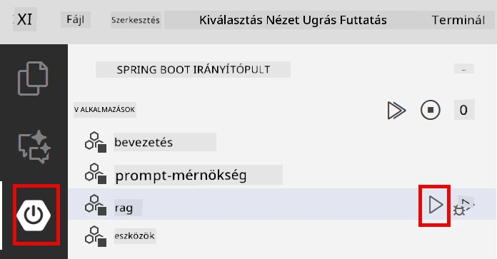
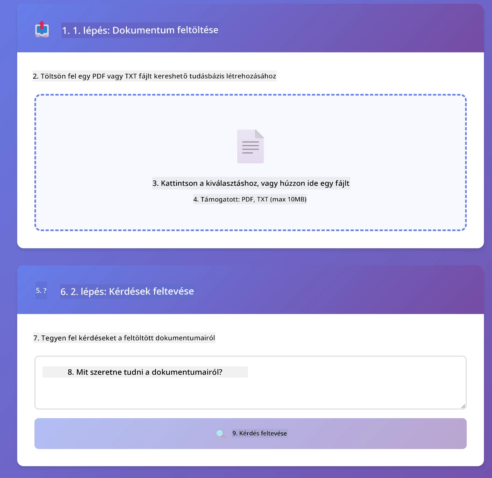
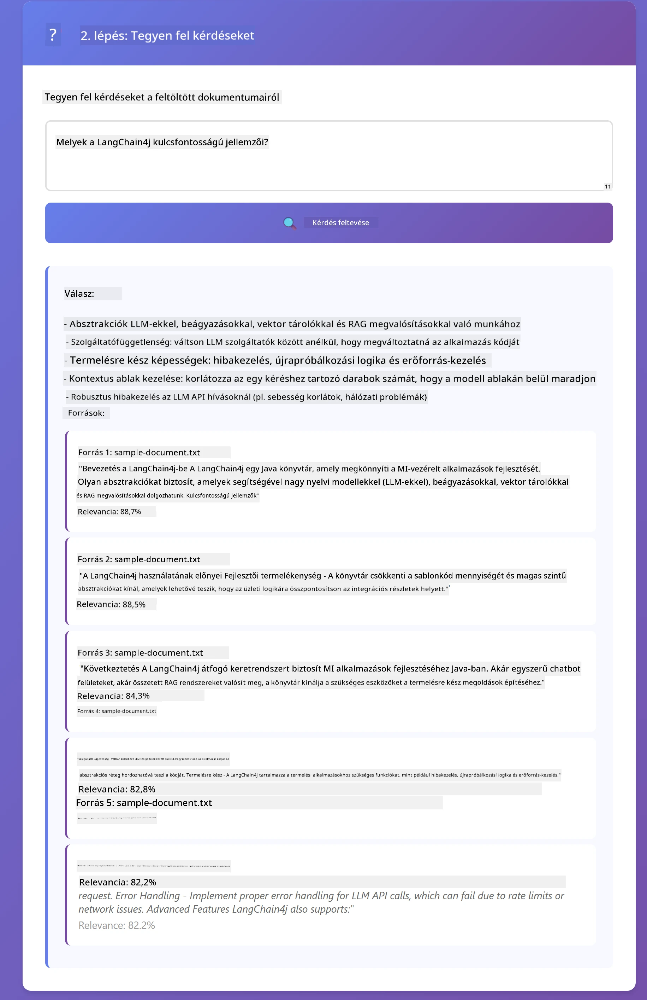

# Modul 03: RAG (Retrieval-Augmented Generation)

## Tartalomjegyzék

- [Videós bemutató](#videós-bemutató)
- [Mit fogsz megtanulni](#mit-fogsz-megtanulni)
- [Előfeltételek](#előfeltételek)
- [A RAG megértése](#a-rag-megértése)
  - [Melyik RAG megközelítést használja ez a bemutató?](#melyik-rag-megközelítést-használja-ez-a-bemutató)
- [Hogyan működik](#hogyan-működik)
  - [Dokumentumfeldolgozás](#dokumentumfeldolgozás)
  - [Beágyazások készítése](#beágyazások-készítése)
  - [Szemantikus keresés](#szemantikus-keresés)
  - [Válaszgenerálás](#válaszgenerálás)
- [Az alkalmazás futtatása](#az-alkalmazás-futtatása)
- [Az alkalmazás használata](#az-alkalmazás-használata)
  - [Dokumentum feltöltése](#dokumentum-feltöltése)
  - [Kérdések feltevése](#kérdések-feltevése)
  - [Forrás hivatkozások ellenőrzése](#forráshivatkozások-ellenőrzése)
  - [Kísérletezés a kérdésekkel](#kísérletezz-a-kérdésekkel)
- [Kulcsfogalmak](#kulcsfogalmak)
  - [Darabolási stratégia](#szeletelési-stratégia)
  - [Hasonlósági pontszámok](#hasonlósági-pontszámok)
  - [Memóriában tárolás](#memóriában-tárolás)
  - [Kontextusablak kezelése](#kontextusablak-kezelése)
- [Mikor fontos a RAG](#mikor-fontos-a-rag)
- [Következő lépések](#következő-lépések)

## Videós bemutató

Nézd meg ezt az élő adást, amely elmagyarázza, hogyan kezdhetsz neki ennek a modulnak:

<a href="https://www.youtube.com/watch?v=_olq75ZH_eY"></a>

## Mit fogsz megtanulni

Az előző modulokban megtanultad, hogyan folytass beszélgetéseket az MI-vel, és hogyan strukturáld hatékonyan a parancsaidat. De van egy alapvető korlát: a nyelvi modellek csak azt tudják, amit a tanítási folyamat során megtanultak. Nem képesek válaszolni a céges szabályzataiddal, a projekt dokumentációddal vagy bármilyen olyan információval kapcsolatos kérdésekre, amit nem tanítottak nekik.

A RAG (Retrieval-Augmented Generation) megoldja ezt a problémát. Ahelyett, hogy megpróbálnád megtanítani a modellnek az információidat (ami költséges és nem praktikus), képessé teszed arra, hogy a dokumentumaid között keressen. Ha valaki kérdést tesz fel, a rendszer megtalálja a releváns információkat és beépíti azokat a promptba. A modell pedig ezen visszakeresett kontextus alapján válaszol.

Gondolj a RAG-re úgy, mint egy hivatkozási könyvtár biztosítására a modell számára. Ha kérdezel valamit, a rendszer:

1. **Felhasználói kérdés** – Feltesszük a kérdést
2. **Beágyazás** – A kérdés vektorosításra kerül
3. **Vektorkeresés** – Megkeresi a hasonló dokumentumdarabokat
4. **Kontextus összeállítása** – A releváns darabokat hozzáadja a prompthoz
5. **Válasz** – Az LLM a kontextus alapján válaszol

Ez alapozza meg a modell válaszait a tényleges adataidra, ahelyett hogy a tanítási tudására hagyatkozna vagy találgatna válaszokat.

## Előfeltételek

- Befejezett [01-es modul - Bevezetés](../01-introduction/README.md) (az Azure OpenAI erőforrások telepítve, beleértve a `text-embedding-3-small` beágyazási modellt)
- `.env` fájl a gyökérkönyvtárban Azure hitelesítő adatokkal (a 01-es modulban a `azd up` parancs hozza létre)

> **Megjegyzés:** Ha még nem végezted el az 01-es modult, először kövesd ott a telepítési útmutatót. Az `azd up` parancs telepíti mind a GPT chat modellt, mind a beágyazási modellt, amelyet ez a modul használ.

## A RAG megértése

Az alábbi ábra szemlélteti az alap koncepciót: ahelyett, hogy csak a modell tanítási adataira hagyatkozna, a RAG egy hivatkozási könyvtárt ad neki a dokumentumaidról, hogy minden válaszadás előtt konzultálhasson velük.


*Ez az ábra bemutatja a különbséget a hagyományos LLM (ami a tanítási adatból tippel) és a RAG-megerősített LLM között (ami először megkeresi a dokumentumaidat).*

Így kapcsolódnak össze az egyes részek végponttól végpontig. A felhasználói kérdés négy lépésen megy keresztül — beágyazás, vektorkeresés, kontextus összeállítás, válaszgenerálás — mindegyik az előzőre épül:



*Ez az ábra a RAG végponttól végpontig terjedő folyamatát mutatja — a felhasználói kérdés a beágyazáson, vektorkeresésen, kontextus összeállításon és válaszgeneráláson megy keresztül.*

A modul további része részletesen végigvezet az egyes szakaszokon, futtatható és módosítható kóddal.

### Melyik RAG megközelítést használja ez a bemutató?

A LangChain4j három módot kínál a RAG implementálására, mindegyik más szintű absztrakciót nyújt. Az alábbi ábra ezeket hasonlítja össze egymás mellett:


*Ez az ábra összehasonlítja a három LangChain4j RAG megközelítést – Easy, Native és Advanced – bemutatva kulcsfontosságú összetevőiket és az alkalmazási területüket.*

| Megközelítés | Mit csinál | Kompromisszum |
|---|---|---|
| **Easy RAG** | Automatikusan beköti az egészet az `AiServices` és a `ContentRetriever` segítségével. Egy interfészt annotálsz, hozzácsatolsz egy retrievert, a LangChain4j pedig mögöttesen kezeli a beágyazást, keresést és prompt összeállítást. | Minimális kód, de nem látod az egyes lépéseket. |
| **Native RAG** | Te magad hívod meg a beágyazási modellt, keresel az adattárban, építed össze a promptot és generálod a választ — lépésenként, expliciten. | Több kód, de minden lépés látható és módosítható. |
| **Advanced RAG** | A `RetrievalAugmentor` keretrendszert használja csatlakoztatható lekérdező transzformerekkel, routerekkel, újrarendezőkkel és tartalom injektorokkal produkciós minőségű csővezetékekhez. | Maximális rugalmasság, de jelentősen bonyolultabb. |

**Ez a bemutató a Native megközelítést használja.** A RAG csővezeték minden lépése — a lekérdezés beágyazása, a vektortár keresése, a kontextus összeállítása és a válasz generálása — egyértelműen ki van írva a [`RagService.java`](../../../03-rag/src/main/java/com/example/langchain4j/rag/service/RagService.java) fájlban. Ez szándékos: tanulási erőforrásként fontosabb, hogy lásd és megértsd az összes lépést, mint hogy a kód minimális legyen. Ha már kényelmesen érted az összefüggéseket, léphetsz tovább az Easy RAG-re gyors prototípusokhoz vagy az Advanced RAG-re produkciós rendszerekhez.

> **💡 Kíváncsi vagy az Easy RAG-re?** A LangChain4j kínál egy *Easy RAG* megközelítést is, ahol az `AiServices` és a `ContentRetriever` automatikusan kezelik a beágyazást, keresést és prompt összeállítást. Ez a modul az explicitabb utat választja — a csővezetéket megnyitva, hogy te lásd és irányítsd az egyes lépéseket.

Az alábbi ábra az Easy RAG csővezetéket mutatja. Figyeld meg, hogy az `AiServices` és az `EmbeddingStoreContentRetriever` hogyan rejti el a teljes bonyolultságot — dokumentumot töltesz be, csatolsz retrievert és kapsz válaszokat. Ez a modul natív megközelítése azonban kinyitja a rejtett lépéseket:


*Ez az ábra az Easy RAG csővezetéket ábrázolja. Hasonlítsd össze a natív megközeléssel, amit ebben a modulban használsz: az Easy RAG elrejti a beágyazást, visszakeresést és prompt összeállítást az `AiServices` és `ContentRetriever` mögött — dokumentumot töltesz be, hozzácsatolsz egy retrievert és kapsz válaszokat. A Natív megközelítés ezen modulban kinyitja a csővezetéket, így magad hívod az egyes lépéseket (beágyazás, keresés, kontextus összeállítás, generálás), teljes láthatóságot és kontrollt adva.*

## Hogyan működik

Az ebben a modulban lévő RAG csővezeték négy egymást követő lépésből áll, amelyek lefutnak minden alkalommal, amikor egy felhasználó kérdést tesz fel. Először az feltöltött dokumentumot **feldolgozza és darabolja** kezelhető darabokra. Ezeket a darabokat aztán **vektor beágyazásokká** alakítja és eltárolja, hogy matematikailag össze lehessen hasonlítani őket. Amikor érkezik egy lekérdezés, a rendszer **szemantikus keresést** végez a legrelevánsabb darabok megtalálására, majd ezeket átadja kontextusként az LLM-nek a **válaszgenerálás**hez. Az alábbi szakaszok vezetik végig az egyes lépéseket valós kóddal és ábrákkal. Nézzük az első lépést.

### Dokumentumfeldolgozás

[DocumentService.java](../../../03-rag/src/main/java/com/example/langchain4j/rag/service/DocumentService.java)

Amikor feltöltesz egy dokumentumot, a rendszer feldolgozza (PDF vagy sima szöveg), hozzácsatol metaadatokat, mint például a fájlnév, majd darabokra bontja — kisebb részekre, amelyek kényelmesen beleférnek a modell kontextusablakába. Ezek a darabok kicsit átfedik egymást, hogy ne vesszen el kontextus a határoknál.

```java
// Elemezze a feltöltött fájlt, és csomagolja LangChain4j Dokumentumba
Document document = Document.from(content, metadata);

// Ossza 300 tokenes darabokra, 30 token átfedéssel
DocumentSplitter splitter = DocumentSplitters
    .recursive(300, 30);

List<TextSegment> segments = splitter.split(document);
```
  
Az alábbi ábra vizuálisan mutatja ennek működését. Figyeld meg, hogy minden darab egyes tokeneket megoszt a szomszédjaival — a 30 tokenes átfedés biztosítja, hogy ne vesszen el fontos kontextus a darabhatároknál:


*Ez az ábra egy dokumentum 300 tokenes darabokra bontását mutatja 30 token átfedéssel, megőrizve a darabhatárok kontextusát.*

> **🤖 Próbáld ki [GitHub Copilot](https://github.com/features/copilot) Chattel:** Nyisd meg a [`DocumentService.java`](../../../03-rag/src/main/java/com/example/langchain4j/rag/service/DocumentService.java) fájlt és kérdezd meg:
> - "Hogyan darabolja a LangChain4j a dokumentumokat és miért fontos az átfedés?"
> - "Mi az optimális darabméret különböző dokumentumtípusok esetén és miért?"
> - "Hogyan kezeljem a többnyelvű vagy speciális formázású dokumentumokat?"

### Beágyazások készítése

[LangChainRagConfig.java](../../../03-rag/src/main/java/com/example/langchain4j/rag/config/LangChainRagConfig.java)

Minden darabot egy numerikus ábrázolássá alakítanak, amit beágyazásnak nevezünk — lényegében egy jelentés-számokra átalakító. A beágyazási modell nem "intelligens" úgy, mint egy chat modell; nem követ utasításokat, nem gondolkodik, nem válaszol kérdésekre. Amit viszont tud, hogy a szöveget egy matematikai térbe helyezi, ahol hasonló jelentések egymáshoz közel eső vektorok lesznek — például "autó" közel "járműhöz", "visszatérítési szabályzat" közel a "pénzem vissza" kifejezéshez. Gondolj a chat modellre, mint egy beszélgető partnerre; egy beágyazási modell egy kimagaslóan jó iratkezelő rendszer.

Az alábbi ábra ezt a koncepciót szemlélteti — bejön a szöveg, kimennek numerikus vektorok, és a hasonló jelentések közeli vektorokat eredményeznek:


*Ez az ábra megmutatja, hogyan alakít egy beágyazási modell szöveget numerikus vektorokká, ahol a hasonló jelentések egymáshoz közel helyezkednek el a vektortérben — például "autó" és "jármű".*

```java
@Bean
public EmbeddingModel embeddingModel() {
    return OpenAiOfficialEmbeddingModel.builder()
        .baseUrl(azureOpenAiEndpoint)
        .apiKey(azureOpenAiKey)
        .modelName(azureEmbeddingDeploymentName)
        .build();
}

EmbeddingStore<TextSegment> embeddingStore = 
    new InMemoryEmbeddingStore<>();
```
  
Az osztálydiagram az alábbi két folyamatról szól a RAG-csővezetékben, és a LangChain4j osztályokról, amelyek megvalósítják őket. Az **adatfeltöltési folyamat** (feltöltéskor fut egyszer) szétbontja a dokumentumot, beágyazza a darabokat, majd eltárolja őket `.addAll()` segítségével. A **lekérdezési folyamat** (minden kérdésnél fut) beágyazza a kérdést, megkeresi az adattárat `.search()`-al, és átadja a talált kontextust a chat modellnek. Mindkét folyamat találkozik a közös `EmbeddingStore<TextSegment>` interfészen:


*Ez az ábra a RAG két folyamatát mutatja — adatfeltöltést és lekérdezést —, és azt, hogy ezek hogyan kapcsolódnak a közös EmbeddingStore-hoz.*

Ha egyszer eltároltuk a beágyazásokat, a hasonló tartalmak természetesen együtt csoportosulnak a vektortérben. Az alábbi vizualizáció megmutatja, hogy a kapcsolódó témákhoz tartozó dokumentumok hogyan állnak össze közeli pontokká, ami lehetővé teszi a szemantikus keresést:



*Ez a vizualizáció mutatja, hogyan csoportosulnak a kapcsolódó dokumentumok 3D vektortérben, ahol a technikai dokumentumok, üzleti szabályok és GYIK témakörök elkülönülő csoportokat alkotnak.*

Amikor a felhasználó keres, a rendszer négy lépést követ: egyszer beágyazza a dokumentumokat, minden keresésnél beágyazza a lekérdezést, összehasonlítja a kérdés vektorát az összes eltárolt vektorral koszinusz hasonlósággal, majd visszaadja a legjobb K darabot. Az alábbi ábra végigvezet minden lépésen és a kapcsolódó LangChain4j osztályokon:


*Ez az ábra a beágyazási keresés négy lépését mutatja: dokumentumok beágyazása, lekérdezés beágyazása, vektorok összehasonlítása koszinusz hasonlósággal és a legjobb K eredmény visszaadása.*

### Szemantikus keresés

[RagService.java](../../../03-rag/src/main/java/com/example/langchain4j/rag/service/RagService.java)

Amikor kérdést teszel fel, a kérdésed is beágyazódik. A rendszer összehasonlítja a kérdés beágyazását az összes dokumentumdarab beágyazásával. Megtalálja a leginkább hasonló jelentésű darabokat — nem csak kulcsszó egyezést, hanem tényleges szemantikus hasonlóságot keres.

```java
Embedding queryEmbedding = embeddingModel.embed(question).content();

EmbeddingSearchRequest searchRequest = EmbeddingSearchRequest.builder()
    .queryEmbedding(queryEmbedding)
    .maxResults(5)
    .minScore(0.5)
    .build();

EmbeddingSearchResult<TextSegment> searchResult = embeddingStore.search(searchRequest);
List<EmbeddingMatch<TextSegment>> matches = searchResult.matches();

for (EmbeddingMatch<TextSegment> match : matches) {
    String relevantText = match.embedded().text();
    double score = match.score();
}
```
  
Az alábbi ábra összehasonlítja a szemantikus keresést a hagyományos kulcsszavas kereséssel. Egy kulcsszavas keresés a "jármű" szóra nem talál meg egy "autókról és teherautókról" szóló darabot, de a szemantikus keresés megérti, hogy ezek ugyanazt jelentik, és magas pontszámmal visszaadja:


*Ez az ábra összehasonlítja a kulcsszó-alapú keresést a szemantikus kereséssel, megmutatva, hogy a szemantikus keresés konceptuálisan kapcsolódó tartalmakat is visszaad akkor is, ha a kulcsszavak eltérnek.*

A háttérben a hasonlóságot koszinusz hasonlósággal mérik — lényegében azt kérdezik: "ez a két nyíl ugyanabba az irányba mutat?" Két darab teljesen eltérő szavakat használhat, de ha ugyanazt jelenti, a vektoraik ugyanabba az irányba mutatnak és közelítik az 1.0 értéket:


*Ez az ábra a koszinusz hasonlóságot szemlélteti, mint a beágyazási vektorok közötti szög – minél jobban illeszkednek a vektorok, annál közelebb kerül az érték 1.0-hoz, ami magasabb szemantikai hasonlóságot jelez.*

> **🤖 Próbáld ki a [GitHub Copilot](https://github.com/features/copilot) Chat segítségével:** Nyisd meg a [`RagService.java`](../../../03-rag/src/main/java/com/example/langchain4j/rag/service/RagService.java) fájlt, és kérdezd meg:
> - "Hogyan működik a hasonlóság alapú keresés a beágyazásokkal, és mi határozza meg a pontszámot?"
> - "Milyen hasonlósági küszöböt használjak, és ez hogyan befolyásolja az eredményeket?"
> - "Hogyan kezeljem azokat az eseteket, amikor nem található releváns dokumentum?"

### Válaszgenerálás

[RagService.java](../../../03-rag/src/main/java/com/example/langchain4j/rag/service/RagService.java)

A legrelevánsabb szeletek egy strukturált promptba vannak összerakva, amely tartalmaz explicit utasításokat, a lekérdezett kontextust és a felhasználó kérdését. A modell ezeket a konkrét szeleteket olvassa el, és ezek alapján válaszol – csak a rendelkezésre álló információt használhatja, ami megakadályozza a kitalációt.

```java
String context = matches.stream()
    .map(match -> match.embedded().text())
    .collect(Collectors.joining("\n\n"));

String prompt = String.format("""
    Answer the question based on the following context.
    If the answer cannot be found in the context, say so.

    Context:
    %s

    Question: %s

    Answer:""", context, request.question());

String answer = chatModel.chat(prompt);
```

Az alábbi ábra mutatja ezt az összerakást működés közben – a keresési lépésből a legjobb pontszámú szeletek beépülnek a prompt sablonba, majd az `OpenAiOfficialChatModel` generál egy megalapozott választ:


*Ez az ábra megmutatja, hogyan épülnek be a legjobb pontszámú szeletek egy strukturált promptba, lehetővé téve, hogy a modell megalapozott választ generáljon az adataidból.*

## Az alkalmazás futtatása

**Telepítés ellenőrzése:**

Győződj meg róla, hogy a gyökérkönyvtárban létezik a `.env` fájl Azure hitelesítő adatokkal (amely a 01-es modul során jön létre). Futtasd ezt a modul könyvtárából (`03-rag/`):

**Bash:**
```bash
cat ../.env  # Meg kell jeleníteni az AZURE_OPENAI_ENDPOINT, API_KEY, DEPLOYMENT értékeket
```

**PowerShell:**
```powershell
Get-Content ..\.env  # Meg kell jeleníteni az AZURE_OPENAI_ENDPOINT, API_KEY, DEPLOYMENT értékeket
```

**Az alkalmazás indítása:**

> **Megjegyzés:** Ha már elindítottad az összes alkalmazást az `./start-all.sh` segítségével a gyökérkönyvtárból (ahogy az 01-es modulban le van írva), ez a modul már fut a 8081-es porton. Megspórolhatod az alábbi indító parancsokat, és egyből megnyithatod a http://localhost:8081 címet.

**1. lehetőség: Spring Boot Dashboard használata (ajánlott VS Code felhasználóknak)**

A fejlesztői konténer tartalmazza a Spring Boot Dashboard bővítményt, amely vizuális felületet biztosít az összes Spring Boot alkalmazás kezeléséhez. A VS Code bal oldali Activity Bar-ján találod (keresd a Spring Boot ikont).

A Spring Boot Dashboard-ból elvégezheted:
- Az összes elérhető Spring Boot alkalmazás megtekintését a munkaterületen
- Az alkalmazások egy kattintással való indítását/leállítását
- Az alkalmazás naplóinak valós idejű megtekintését
- Az alkalmazás állapotának monitorozását

Egyszerűen kattints a lejátszás gombra a "rag" modul mellett az indításhoz, vagy indítsd el az összes modult egyszerre.



*Ez a képernyőkép a Spring Boot Dashboard-ot mutatja VS Code-ban, ahol vizuálisan indíthatsz, leállíthatsz és figyelhetsz alkalmazásokat.*

**2. lehetőség: Shell scriptek használata**

Indítsd el az összes webalkalmazást (01-04 modulok):

**Bash:**
```bash
cd ..  # A gyökérkönyvtárból
./start-all.sh
```

**PowerShell:**
```powershell
cd ..  # A gyökér könyvtárból
.\start-all.ps1
```

Vagy indítsd el csak ezt a modult:

**Bash:**
```bash
cd 03-rag
./start.sh
```

**PowerShell:**
```powershell
cd 03-rag
.\start.ps1
```

Mindkét script automatikusan betölti a környezeti változókat a gyökér `.env` fájlból, és lefordítja a JAR fájlokat, ha még nem léteznek.

> **Megjegyzés:** Ha inkább kézzel fordítanád le az összes modult az indítás előtt:
>
> **Bash:**
> ```bash
> cd ..  # Go to root directory
> mvn clean package -DskipTests
> ```
>
> **PowerShell:**
> ```powershell
> cd ..  # Go to root directory
> mvn clean package -DskipTests
> ```

Nyisd meg a http://localhost:8081 címet a böngésződben.

**Leállításhoz:**

**Bash:**
```bash
./stop.sh  # Csak ez a modul
# Vagy
cd .. && ./stop-all.sh  # Minden modul
```

**PowerShell:**
```powershell
.\stop.ps1  # Csak ez a modul
# Vagy
cd ..; .\stop-all.ps1  # Minden modul
```

## Az alkalmazás használata

Az alkalmazás egy webes felületet kínál dokumentum feltöltéshez és kérdések feltevéséhez.

<a href="images/rag-homepage.png"></a>

*Ez a képernyőkép a RAG alkalmazás felületét mutatja, ahol dokumentumokat töltesz fel és kérdéseket teszel fel.*

### Dokumentum feltöltése

Kezdd egy dokumentum feltöltésével – teszteléshez a TXT fájlok a legjobbak. Ehhez a könyvtárhoz tartozik egy `sample-document.txt`, amely a LangChain4j jellemzőiről, a RAG implementációról és legjobb gyakorlatokról tartalmaz információkat – tökéletes a rendszer teszteléséhez.

A rendszer feldolgozza a dokumentumodat, felbontja szeletekre, és létrehozza minden szelethez a beágyazást. Ez automatikusan megtörténik a feltöltéskor.

### Kérdések feltevése

Most tegyél fel konkrét kérdéseket a dokumentum tartalmáról. Próbálj meg valami tényszerűt, ami egyértelműen benne van a dokumentumban. A rendszer megkeresi a releváns szeleteket, beilleszti azokat a promptba és generál egy választ.

### Forráshivatkozások ellenőrzése

Vegyük észre, hogy minden válasz tartalmaz forráshivatkozásokat a hasonlósági pontszámokkal együtt. Ezek a pontszámok (0-tól 1-ig) azt jelzik, milyen releváns volt az adott szelet a kérdésedre. A magasabb pontszám jobb találatot jelent. Így ellenőrizheted a választ az eredeti forrással szemben.

<a href="images/rag-query-results.png"></a>

*Ez a képernyőkép kérdező eredményeket mutat, a generált választ, forráshivatkozásokat és az egyes lekért szeletek relevancia pontszámait.*

### Kísérletezz a kérdésekkel

Próbálj ki különböző típusú kérdéseket:
- Konkrét tények: "Mi a fő téma?"
- Összehasonlítások: "Mi a különbség X és Y között?"
- Összefoglalók: "Foglald össze a Z legfontosabb pontjait"

Figyeld meg, hogyan változnak a relevancia pontszámok attól függően, mennyire egyezik a kérdésed a dokumentum tartalmával.

## Kulcsfogalmak

### Szeletelési stratégia

A dokumentumokat 300 tokenes szeletekre bontjuk, 30 token átfedéssel. Ez az egyensúly biztosítja, hogy minden szeletnek elegendő kontextusa legyen a jelentéshez, miközben elég kicsi ahhoz, hogy több szelet is bekerülhessen egy promptba.

### Hasonlósági pontszámok

Minden lekért szelethez tartozik egy 0 és 1 közötti hasonlósági pontszám, amely azt mutatja, mennyire egyezik a felhasználó kérdésével. Az alábbi ábra vizualizálja a pontszám tartományokat és azt, hogyan használja a rendszer ezeket az eredmények szűrésére:


*Ez az ábra a 0-tól 1-ig tartó pontszámokat mutatja, egy 0,5-ös minimum küszöbbel, amely kiszűri a nem releváns szeleteket.*

A pontszámok tartománya:
- 0,7-1,0: Nagyon releváns, pontos találat
- 0,5-0,7: Releváns, jó kontextus
- 0,5 alatt: Kiszűrt, túl eltérő

A rendszer csak a minimum küszöböt meghaladó szeleteket hozza vissza a minőség biztosítása érdekében.

A beágyazások jól működnek, ha a jelentés tisztán csoportosul, de vannak gyenge pontjaik. Az alábbi ábra bemutatja a gyakori hibamódokat – túl nagy szeletek zavaros vektorokat eredményeznek, túl kicsik kontextus hiányában szenvednek, kétértelmű kifejezések több klaszterre mutathatnak, és az azonosítás alapú keresések (azonosítók, cikkszámok) egyáltalán nem működnek beágyazásokkal:


*Ez az ábra a beágyazások általános hibamódjait mutatja: túl nagy szeletek, túl kicsi szeletek, kétértelmű kifejezések, és pontos egyezésű keresések, mint az azonosítók.*

### Memóriában tárolás

Ez a modul egyszerűség kedvéért memóriában tárolja az adatokat. Az alkalmazás újraindításakor a feltöltött dokumentumok elvesznek. Éles rendszerek tartós vektordatabázisokat használnak, például Qdrant vagy Azure AI Search.

### Kontextusablak kezelése

Minden modellnek van maximális kontextusablaka. Nem fér be minden szelet nagy dokumentumokból. A rendszer az N legrelevánsabb szeletet hozza vissza (alapértelmezett 5), hogy a határokon belül maradjon, miközben elég kontextust ad a pontos válaszokhoz.

## Mikor fontos a RAG

A RAG nem mindig a megfelelő megoldás. Az alábbi döntési útmutató segít eldönteni, mikor ad hozzáadott értéket a RAG, és mikor elegendőek egyszerűbb megoldások – például a tartalom közvetlen beillesztése a promptba vagy a modell beépített tudására támaszkodás:


*Ez az ábra döntési útmutatót mutat, hogy mikor érdemes használni a RAG-ot, és mikor elegendőek egyszerűbb megoldások.*

## Következő lépések

**Következő modul:** [04-tools - AI ügynökök eszközökkel](../04-tools/README.md)

---

**Navigáció:** [← Előző: 02-es modul – Prompt mérnökség](../02-prompt-engineering/README.md) | [Vissza a főoldalra](../README.md) | [Következő: 04-es modul – Eszközök →](../04-tools/README.md)

---

<!-- CO-OP TRANSLATOR DISCLAIMER START -->
**Jogi nyilatkozat**:
Ez a dokumentum az AI fordítási szolgáltatás, a [Co-op Translator](https://github.com/Azure/co-op-translator) segítségével készült. Bár az pontosságra törekszünk, kérjük, vegye figyelembe, hogy az automatikus fordítások hibákat vagy pontatlanságokat tartalmazhatnak. Az eredeti dokumentum az anyanyelvén tekintendő hiteles forrásnak. Fontos információk esetén professzionális emberi fordítást javasolunk. Nem vállalunk felelősséget semmilyen félreértésért vagy téves értelmezésért, amely ebből a fordításból ered.
<!-- CO-OP TRANSLATOR DISCLAIMER END -->