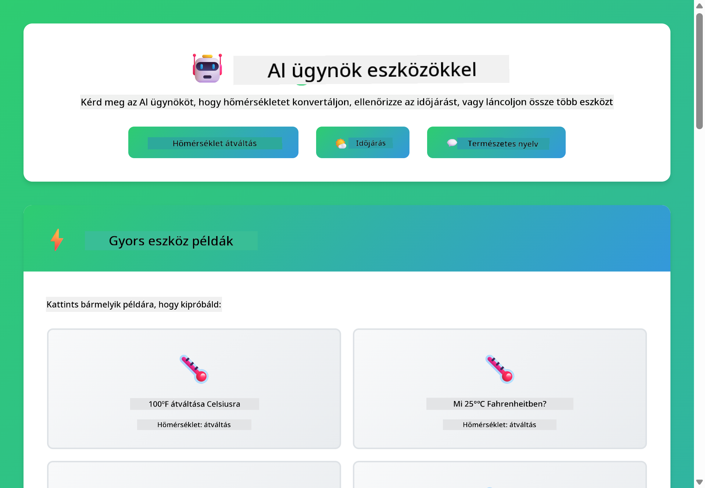

<!--
CO_OP_TRANSLATOR_METADATA:
{
  "original_hash": "13ec450c12cdd1a863baa2b778f27cd7",
  "translation_date": "2025-12-31T04:01:21+00:00",
  "source_file": "04-tools/README.md",
  "language_code": "hu"
}
-->
# Modul 04: Eszközökkel rendelkező AI-ügynökök

## Tartalomjegyzék

- [Mit fogsz megtanulni](../../../04-tools)
- [Előfeltételek](../../../04-tools)
- [Az eszközökkel rendelkező AI-ügynökök megértése](../../../04-tools)
- [Hogyan működik az eszközhívás](../../../04-tools)
  - [Eszközdefiníciók](../../../04-tools)
  - [Döntéshozatal](../../../04-tools)
  - [Végrehajtás](../../../04-tools)
  - [Válaszgenerálás](../../../04-tools)
- [Eszközláncolás](../../../04-tools)
- [Az alkalmazás futtatása](../../../04-tools)
- [Az alkalmazás használata](../../../04-tools)
  - [Próbálj egyszerű eszközhasználatot](../../../04-tools)
  - [Teszteld az eszközláncolást](../../../04-tools)
  - [Lásd a beszélgetés folyamatát](../../../04-tools)
  - [Figyeld meg az érvelést](../../../04-tools)
  - [Kísérletezz különböző kérésekkel](../../../04-tools)
- [Kulcsfogalmak](../../../04-tools)
  - [ReAct minta (Gondolkodás és Cselekvés)](../../../04-tools)
  - [Az eszközleírások számítanak](../../../04-tools)
  - [Munkamenet-kezelés](../../../04-tools)
  - [Hiba kezelés](../../../04-tools)
- [Elérhető eszközök](../../../04-tools)
- [Mikor érdemes eszközalapú ügynököket használni](../../../04-tools)
- [Következő lépések](../../../04-tools)

## Mit fogsz megtanulni

Eddig megtanultad, hogyan folytass beszélgetéseket az AI-val, hogyan strukturáld hatékonyan a promptokat, és hogyan alapozd meg a válaszokat a dokumentumaidban. Van azonban egy alapvető korlát: a nyelvi modellek csak szöveget tudnak generálni. Nem tudják ellenőrizni az időjárást, végezni számításokat, lekérdezni adatbázisokat vagy külső rendszerekkel kommunikálni.

Az eszközök ezt megváltoztatják. Ha a modellhez olyan függvényekhez való hozzáférést adsz, amelyeket meghívhat, akkor a modellt egy szöveggenerátorból olyan ügynökké alakítod, amely képes cselekedni. A modell eldönti, mikor van szüksége egy eszközre, melyik eszközt használja, és milyen paramétereket adjon át. A kódod végrehajtja a függvényt és visszaadja az eredményt. A modell beépíti az eredményt a válaszába.

## Előfeltételek

- A 01. modul befejezve (Azure OpenAI erőforrások telepítve)
- `.env` fájl a gyökérkönyvtárban Azure hitelesítő adatokkal (a `azd up` parancs hozza létre a 01. modulban)

> **Megjegyzés:** Ha még nem végezted el az 01. modult, kövesd előbb ott a telepítési utasításokat.

## Az eszközökkel rendelkező AI-ügynökök megértése

> **📝 Megjegyzés:** Ebben a modulban az "ügynökök" kifejezés olyan AI-asszisztenseket jelöl, amelyek eszközhívási képességekkel vannak kibővítve. Ez különbözik azoktól az Agentic AI mintáktól (autonóm ügynökök tervezéssel, memóriával és többlépéses érveléssel), amelyeket a [05-ös modul: MCP](../05-mcp/README.md) fog tárgyalni.

Egy eszközökkel rendelkező AI-ügynök a gondolkodás és cselekvés mintát követi (ReAct):

1. A felhasználó kérdez
2. Az ügynök átgondolja, mire van szüksége
3. Az ügynök eldönti, szüksége van-e eszközre a válaszhoz
4. Ha igen, az ügynök meghívja a megfelelő eszközt a megfelelő paraméterekkel
5. Az eszköz végrehajtódik és adatot ad vissza
6. Az ügynök beépíti az eredményt és megadja a végső választ


*A ReAct minta – hogyan váltakoznak az AI-ügynökök a gondolkodás és a cselekvés között a problémamegoldás során*

Ez automatikusan történik. Te definiálod az eszközöket és a leírásaikat. A modell kezeli a döntéshozatalt arról, mikor és hogyan használja azokat.

## Hogyan működik az eszközhívás

**Eszközdefiníciók** - [WeatherTool.java](../../../04-tools/src/main/java/com/example/langchain4j/agents/tools/WeatherTool.java) | [TemperatureTool.java](../../../04-tools/src/main/java/com/example/langchain4j/agents/tools/TemperatureTool.java)

Függvényeket definiálsz világos leírásokkal és paraméterspecifikációkkal. A modell ezeket a leírásokat látja a rendszer promptjában és megérti, mit csinál minden egyes eszköz.

```java
@Component
public class WeatherTool {
    
    @Tool("Get the current weather for a location")
    public String getCurrentWeather(@P("Location name") String location) {
        // Az időjárás lekérdezési logikád
        return "Weather in " + location + ": 22°C, cloudy";
    }
}

@AiService
public interface Assistant {
    String chat(@MemoryId String sessionId, @UserMessage String message);
}

// Az asszisztens a Spring Boot által automatikusan össze van kötve a következőkkel:
// - ChatModel bean
// - Minden @Tool metódus az @Component osztályokból
// - ChatMemoryProvider a munkamenet-kezeléshez
```

> **🤖 Próbáld ki a [GitHub Copilot](https://github.com/features/copilot) Chat-tel:** Nyisd meg a [`WeatherTool.java`](../../../04-tools/src/main/java/com/example/langchain4j/agents/tools/WeatherTool.java) fájlt és kérdezd meg:
> - "Hogyan integrálnék egy valós időjárás-API-t, például az OpenWeatherMap-et a mock adatok helyett?"
> - "Mi tesz egy jó eszközleírást, ami segít az AI-nak helyesen használni az eszközt?"
> - "Hogyan kezeljem az API hibákat és a sebességkorlátokat az eszközimplementációkban?"

**Döntéshozatal**

Amikor egy felhasználó azt kérdezi, "Milyen az idő Seattle-ben?", a modell felismeri, hogy szüksége van az időjárás eszközre. Függvényhívást generál, ahol a location paraméter "Seattle"-re van állítva.

**Végrehajtás** - [AgentService.java](../../../04-tools/src/main/java/com/example/langchain4j/agents/service/AgentService.java)

A Spring Boot automatikusan beágyazza a deklaratív `@AiService` interfészt az összes regisztrált eszközzel, és a LangChain4j automatikusan végrehajtja az eszközhívásokat.

> **🤖 Próbáld ki a [GitHub Copilot](https://github.com/features/copilot) Chat-tel:** Nyisd meg a [`AgentService.java`](../../../04-tools/src/main/java/com/example/langchain4j/agents/service/AgentService.java) fájlt és kérdezd meg:
> - "Hogyan működik a ReAct minta és miért hatékony az AI-ügynökök számára?"
> - "Hogyan dönt az ügynök arról, melyik eszközt használja és milyen sorrendben?"
> - "Mi történik, ha egy eszközvégrehajtás meghiúsul - hogyan kezeljem a hibákat robusztusan?"

**Válaszgenerálás**

A modell megkapja az időjárás adatokat és természetes nyelvű válaszba formázza azokat a felhasználó számára.

### Miért használjunk deklaratív AI szolgáltatásokat?

Ez a modul a LangChain4j Spring Boot integrációját használja deklaratív `@AiService` interfészekkel:

- **Spring Boot automatikus beágyazás** - ChatModel és az eszközök automatikusan injektálódnak
- **@MemoryId minta** - Automatikus munkamenet-alapú memória kezelés
- **Egyetlen példány** - Az asszisztens egyszer jön létre és újrafelhasználódik a jobb teljesítmény érdekében
- **Típusbiztos végrehajtás** - Java metódusok közvetlen meghívása típuskonverzióval
- **Többfordulós összehangolás** - Az eszközláncolást automatikusan kezeli
- **Zéró boilerplate** - Nincs manuális AiServices.builder() hívás vagy memória HashMap

Alternatív megközelítések (manuális `AiServices.builder()`) több kódot igényelnek és nem élvezik a Spring Boot integráció előnyeit.

## Eszközláncolás

**Eszközláncolás** - Az AI több eszközt is meghívhat egymás után. Kérdezd meg: "Milyen az idő Seattle-ben és vigyek esernyőt?" és figyeld, hogyan láncolja össze a `getCurrentWeather` hívást az esernyővel kapcsolatos érvelésével.

<a href="images/tool-chaining.png"></a>

*Szekvenciális eszközhívások - az egyik eszköz kimenete befolyásolja a következő döntést*

**Zsákmányos hibakezelés** - Kérdezz egy olyan város időjárásáról, ami nincs a mock adatok között. Az eszköz hibát ad vissza, és az AI elmagyarázza, hogy nem tud segíteni. Az eszközök biztonságosan hibáznak.

Ez egyetlen beszélgetési körben történik. Az ügynök autonóm módon szervezi az egymást követő eszközhívásokat.

## Az alkalmazás futtatása

**Ellenőrizd a telepítést:**

Győződj meg róla, hogy a `.env` fájl létezik a gyökérkönyvtárban Azure hitelesítő adatokkal (a 01. modul során jött létre):
```bash
cat ../.env  # Meg kell jelenítenie az AZURE_OPENAI_ENDPOINT, API_KEY és DEPLOYMENT értékeket
```

**Indítsd el az alkalmazást:**

> **Megjegyzés:** Ha már elindítottál minden alkalmazást a `./start-all.sh` használatával a 01. modulból, ez a modul már fut a 8084-es porton. Átugorhatod az alábbi indítási parancsokat és közvetlenül megnyithatod a http://localhost:8084 címet.

**1. lehetőség: Spring Boot Dashboard használata (ajánlott VS Code felhasználóknak)**

A fejlesztői konténer tartalmazza a Spring Boot Dashboard bővítményt, amely vizuális felületet biztosít az összes Spring Boot alkalmazás kezeléséhez. Megtalálod az Activity Bar bal oldalán a VS Code-ban (keresd a Spring Boot ikont).

A Spring Boot Dashboardból:
- Láthatod az összes elérhető Spring Boot alkalmazást a workspace-ben
- Egy kattintással indíthatod/leállíthatod az alkalmazásokat
- Valós időben megtekintheted az alkalmazás naplóit
- Figyelheted az alkalmazás állapotát

Egyszerűen kattints a lejátszás gombra a "tools" mellett ezen a modul elindításához, vagy indíts el minden modult egyszerre.


**2. lehetőség: Shell script-ek használata**

Indítsd el az összes webalkalmazást (01-04 modulok):

**Bash:**
```bash
cd ..  # A gyökérkönyvtárból
./start-all.sh
```

**PowerShell:**
```powershell
cd ..  # A gyökérkönyvtárból
.\start-all.ps1
```

Vagy indítsd el csak ezt a modult:

**Bash:**
```bash
cd 04-tools
./start.sh
```

**PowerShell:**
```powershell
cd 04-tools
.\start.ps1
```

Mindkét script automatikusan betölti a környezeti változókat a gyökér `.env` fájlból és felépíti a JAR-okat, ha azok nem léteznek.

> **Megjegyzés:** Ha inkább manuálisan szeretnéd előre felépíteni az összes modult az indítás előtt:
>
> **Bash:**
> ```bash
> cd ..  # Go to root directory
> mvn clean package -DskipTests
> ```
>
> **PowerShell:**
> ```powershell
> cd ..  # Go to root directory
> mvn clean package -DskipTests
> ```

Nyisd meg a http://localhost:8084 címet a böngésződben.

**Leállításhoz:**

**Bash:**
```bash
./stop.sh  # Csak ez a modul
# Vagy
cd .. && ./stop-all.sh  # Minden modul
```

**PowerShell:**
```powershell
.\stop.ps1  # Csak ez a modul
# Vagy
cd ..; .\stop-all.ps1  # Minden modul
```

## Az alkalmazás használata

Az alkalmazás webes felületet biztosít, ahol interakcióba léphetsz egy olyan AI-ügynökkel, amely hozzáfér az időjárás- és hőmérséklet-átváltó eszközökhöz.

<a href="images/tools-homepage.png"></a>

*Az AI ügynök eszközök felülete - gyors példák és chat felület az eszközökkel való interakcióhoz*

**Próbálj egyszerű eszközhasználatot**

Kezdd egy egyszerű kéréssel: "Konvertáld át a 100 Fahrenheit fokot Celsiusra". Az ügynök felismeri, hogy szüksége van a hőmérséklet-átváltó eszközre, meghívja a megfelelő paraméterekkel, és visszaadja az eredményt. Figyeld meg, milyen természetes ez az élmény - nem kellett megmondanod, melyik eszközt használd vagy hogyan hívd meg.

**Teszteld az eszközláncolást**

Most próbálj valami összetettebbet: "Milyen az idő Seattle-ben és konvertáld át Fahrenheitbe?" Figyeld, ahogy az ügynök lépésről lépésre dolgozik: először lekéri az időjárást (ami Celsiusban tér vissza), felismeri, hogy át kell váltani Fahrenheitbe, meghívja az átváltó eszközt, és egyesíti mindkét eredményt egy válaszban.

**Lásd a beszélgetés folyamatát**

A chat felület megőrzi a beszélgetés előzményeit, lehetővé téve többkörös interakciókat. Láthatod az összes korábbi lekérdezést és választ, így könnyű nyomon követni a beszélgetést és megérteni, hogyan építi az ügynök a kontextust több csere során.

<a href="images/tools-conversation-demo.png"></a>

*Többfordulós beszélgetés, amely egyszerű átváltásokat, időjárás-lekérdezéseket és eszközláncolást mutat be*

**Kísérletezz különböző kérésekkel**

Próbálj ki különféle kombinációkat:
- Időjárás-lekérdezések: "Milyen az idő Tokióban?"
- Hőmérséklet-átváltások: "Mennyi 25°C Kelvinben?"
- Összetett lekérdezések: "Nézd meg Párizs időjárását és mondd meg, hogy 20°C fölött van-e"

Figyeld meg, hogyan értelmezi az ügynök a természetes nyelvet és hogyan térképezi azt megfelelő eszközhívásokra.

## Kulcsfogalmak

**ReAct minta (Gondolkodás és Cselekvés)**

Az ügynök váltakozik a gondolkodás (eldönti, mit kell tenni) és a cselekvés (eszközök használata) között. Ez a minta lehetővé teszi az autonóm problémamegoldást, nem csupán az utasításokra adott reagálást.

**Az eszközleírások számítanak**

Az eszközleírások minősége közvetlenül befolyásolja, hogy az ügynök mennyire jól használja őket. A világos, konkrét leírások segítik a modellt megérteni, mikor és hogyan hívjon meg egy eszközt.

**Munkamenet-kezelés**

A `@MemoryId` annotáció lehetővé teszi az automatikus munkamenet-alapú memória kezelést. Minden munkamenet azonosítóhoz saját `ChatMemory` példány tartozik, amelyet a `ChatMemoryProvider` bean kezel, így nincs szükség manuális memória követésre.

**Hiba kezelés**

Az eszközök meghibásodhatnak - az API-k időtúlléphetnek, a paraméterek érvénytelenek lehetnek, vagy külső szolgáltatások leállhatnak. A termelési ügynököknek hiba kezelést kell beépíteniük, hogy a modell elmagyarázza a problémákat vagy megpróbáljon alternatívákat.

## Elérhető eszközök

**Időjárás eszközök** (mock adatok bemutatásra):
- Aktuális időjárás lekérése egy helyhez
- Többnapos előrejelzés lekérése

**Hőmérséklet-átváltó eszközök**:
- Celsiusról Fahrenheitre
- Fahrenheitből Celsiusra
- Celsiusról Kelvinre
- Kelvinről Celsiusra
- Fahrenheitből Kelvinre
- Kelvinről Fahrenheitre

Ezek egyszerű példák, de a minta kiterjeszthető bármilyen függvényre: adatbázis-lekérdezésekre, API-hívásokra, számításokra, fájműveletekre vagy rendszerparancsokra.

## Mikor érdemes eszközalapú ügynököket használni

**Használj eszközöket, ha:**
- A válasz valós idejű adatot igényel (időjárás, részvényárak, készlet)
- Számításokat kell végezni komplexebb műveletekkel
- Adatbázisokhoz vagy API-khoz kell hozzáférni
- Műveleteket kell végrehajtani (e-mailek küldése, jegyek létrehozása, rekordok frissítése)
- Több adatforrást kell egyesíteni

**Ne használj eszközöket, ha:**
- A kérdés általános tudásból megválaszolható
- A válasz tisztán beszélgető jellegű
- Az eszköz késleltetése túl lassúvá tenné a felhasználói élményt

## Következő lépések

**Következő modul:** [05-mcp - Model Context Protocol (MCP)](../05-mcp/README.md)

---

**Navigáció:** [← Előző: Modul 03 - RAG](../03-rag/README.md) | [Vissza a főoldalra](../README.md) | [Következő: Modul 05 - MCP →](../05-mcp/README.md)

---

<!-- CO-OP TRANSLATOR DISCLAIMER START -->
Felelősségkizárás:
Ez a dokumentum az AI fordító szolgáltatás, a Co‑op Translator (https://github.com/Azure/co-op-translator) segítségével készült. Bár törekszünk a pontosságra, kérjük, vegye figyelembe, hogy az automatikus fordítások hibákat vagy pontatlanságokat tartalmazhatnak. Az eredeti dokumentum az eredeti nyelven tekintendő irányadónak. Kritikus fontosságú információk esetén professzionális emberi fordítást javaslunk. Nem vállalunk felelősséget a jelen fordítás használatából eredő félreértésekért vagy téves értelmezésekért.
<!-- CO-OP TRANSLATOR DISCLAIMER END -->