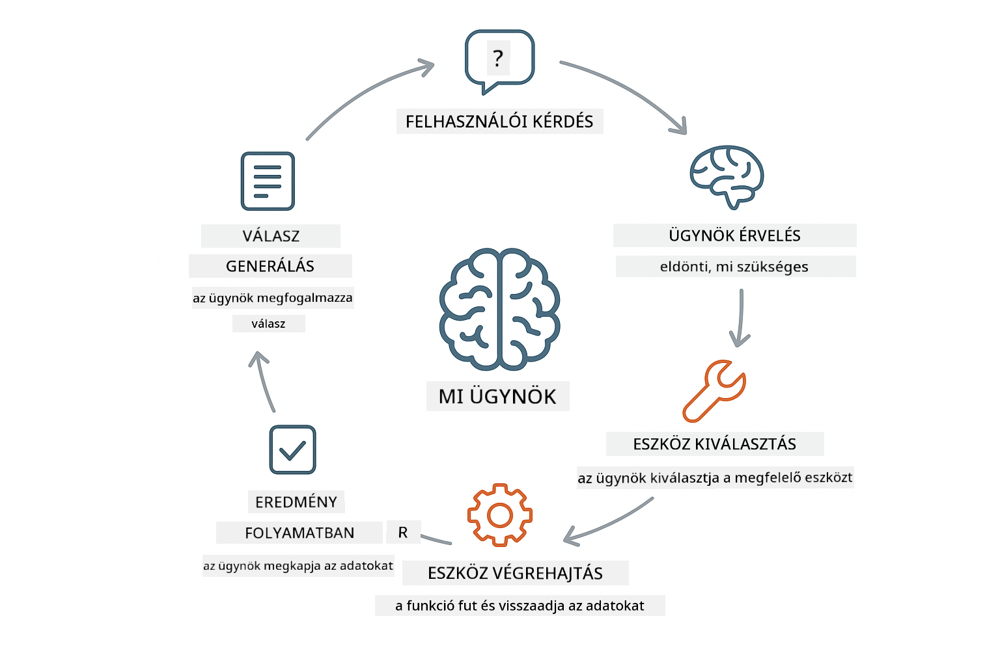
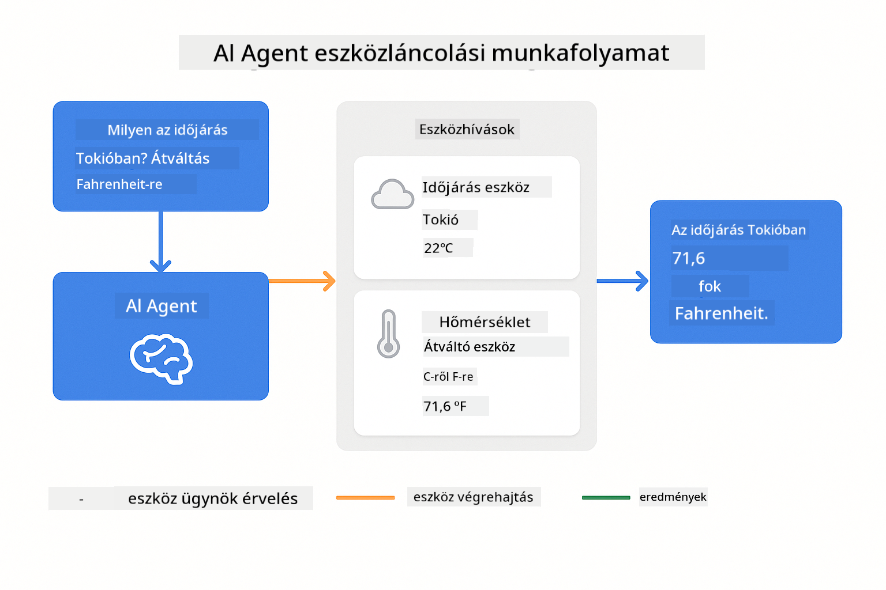
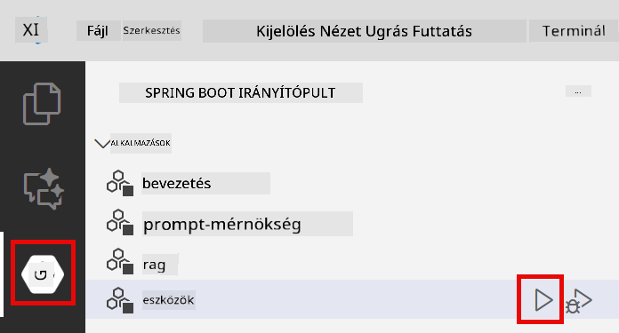
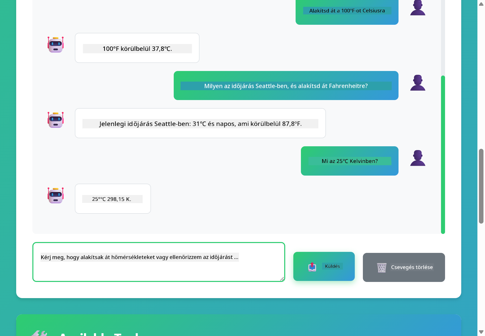

<!--
CO_OP_TRANSLATOR_METADATA:
{
  "original_hash": "aa23f106e7f53270924c9dd39c629004",
  "translation_date": "2025-12-13T19:16:30+00:00",
  "source_file": "04-tools/README.md",
  "language_code": "hu"
}
-->
# Modul 04: AI ügynökök eszközökkel

## Tartalomjegyzék

- [Mit fogsz megtanulni](../../../04-tools)
- [Előfeltételek](../../../04-tools)
- [Az AI ügynökök megértése eszközökkel](../../../04-tools)
- [Hogyan működik az eszközhívás](../../../04-tools)
  - [Eszközdefiníciók](../../../04-tools)
  - [Döntéshozatal](../../../04-tools)
  - [Végrehajtás](../../../04-tools)
  - [Válaszgenerálás](../../../04-tools)
- [Eszközláncolás](../../../04-tools)
- [Az alkalmazás futtatása](../../../04-tools)
- [Az alkalmazás használata](../../../04-tools)
  - [Egyszerű eszközhasználat kipróbálása](../../../04-tools)
  - [Eszközláncolás tesztelése](../../../04-tools)
  - [A beszélgetés folyamatának megtekintése](../../../04-tools)
  - [Az érvelés megfigyelése](../../../04-tools)
  - [Kísérletezés különböző kérésekkel](../../../04-tools)
- [Kulcsfogalmak](../../../04-tools)
  - [ReAct minta (érvelés és cselekvés)](../../../04-tools)
  - [Az eszközleírások fontossága](../../../04-tools)
  - [Munkamenet-kezelés](../../../04-tools)
  - [Hibakezelés](../../../04-tools)
- [Elérhető eszközök](../../../04-tools)
- [Mikor használjunk eszközalapú ügynököket](../../../04-tools)
- [Következő lépések](../../../04-tools)

## Mit fogsz megtanulni

Eddig megtanultad, hogyan folytass beszélgetéseket AI-val, hogyan strukturáld hatékonyan a promptokat, és hogyan alapozd válaszaidat a dokumentumaidra. De van egy alapvető korlát: a nyelvi modellek csak szöveget tudnak generálni. Nem tudják lekérdezni az időjárást, számításokat végezni, adatbázisokat lekérdezni vagy külső rendszerekkel kommunikálni.

Az eszközök ezt megváltoztatják. Ha a modell hozzáférést kap olyan funkciókhoz, amelyeket meghívhat, akkor szöveggenerátorból olyan ügynökké válik, amely képes cselekedni. A modell eldönti, mikor van szüksége eszközre, melyiket használja, és milyen paramétereket ad át. A kódod végrehajtja a funkciót és visszaadja az eredményt. A modell beépíti ezt az eredményt a válaszába.

## Előfeltételek

- Az 01-es modul befejezése (Azure OpenAI erőforrások telepítve)
- `.env` fájl a gyökérkönyvtárban Azure hitelesítő adatokkal (az `azd up` parancs hozta létre az 01-es modulban)

> **Megjegyzés:** Ha még nem fejezted be az 01-es modult, először kövesd ott a telepítési utasításokat.

## Az AI ügynökök megértése eszközökkel

Az eszközökkel rendelkező AI ügynök egy érvelési és cselekvési mintát követ (ReAct):

1. A felhasználó kérdez
2. Az ügynök átgondolja, mire van szüksége
3. Az ügynök eldönti, hogy szüksége van-e eszközre a válaszadáshoz
4. Ha igen, az ügynök meghívja a megfelelő eszközt a megfelelő paraméterekkel
5. Az eszköz végrehajtja és adatokat ad vissza
6. Az ügynök beépíti az eredményt és megadja a végső választ



*A ReAct minta – hogyan váltakoznak az AI ügynökök az érvelés és a cselekvés között a problémák megoldásához*

Ez automatikusan történik. Te definiálod az eszközöket és azok leírásait. A modell kezeli a döntéshozatalt arról, mikor és hogyan használja őket.

## Hogyan működik az eszközhívás

**Eszközdefiníciók** - [WeatherTool.java](../../../04-tools/src/main/java/com/example/langchain4j/agents/tools/WeatherTool.java) | [TemperatureTool.java](../../../04-tools/src/main/java/com/example/langchain4j/agents/tools/TemperatureTool.java)

Funkciókat definiálsz világos leírásokkal és paraméter specifikációkkal. A modell ezeket a leírásokat látja a rendszer promptjában, és érti, mit csinál az egyes eszköz.

```java
@Component
public class WeatherTool {
    
    @Tool("Get the current weather for a location")
    public String getCurrentWeather(@P("Location name") String location) {
        // Az időjárás lekérdezési logikád
        return "Weather in " + location + ": 22°C, cloudy";
    }
}

@AiService
public interface Assistant {
    String chat(@MemoryId String sessionId, @UserMessage String message);
}

// Az asszisztens automatikusan össze van kötve a Spring Boot által:
// - ChatModel bean
// - Minden @Tool metódus az @Component osztályokból
// - ChatMemoryProvider a munkamenet kezeléséhez
```

> **🤖 Próbáld ki a [GitHub Copilot](https://github.com/features/copilot) Chattel:** Nyisd meg a [`WeatherTool.java`](../../../04-tools/src/main/java/com/example/langchain4j/agents/tools/WeatherTool.java) fájlt és kérdezd meg:
> - "Hogyan integrálnék egy valódi időjárás API-t, mint az OpenWeatherMap a mock adatok helyett?"
> - "Mi tesz egy jó eszközleírást, ami segíti az AI-t a helyes használatban?"
> - "Hogyan kezelem az API hibákat és a lekérdezési korlátokat az eszköz implementációkban?"

**Döntéshozatal**

Amikor a felhasználó megkérdezi: "Milyen az időjárás Seattle-ben?", a modell felismeri, hogy szüksége van az időjárás eszközre. Létrehoz egy funkcióhívást a hely paraméterrel "Seattle" értékre állítva.

**Végrehajtás** - [AgentService.java](../../../04-tools/src/main/java/com/example/langchain4j/agents/service/AgentService.java)

A Spring Boot automatikusan összekapcsolja a deklaratív `@AiService` interfészt az összes regisztrált eszközzel, és a LangChain4j automatikusan végrehajtja az eszközhívásokat.

> **🤖 Próbáld ki a [GitHub Copilot](https://github.com/features/copilot) Chattel:** Nyisd meg az [`AgentService.java`](../../../04-tools/src/main/java/com/example/langchain4j/agents/service/AgentService.java) fájlt és kérdezd meg:
> - "Hogyan működik a ReAct minta és miért hatékony az AI ügynökök számára?"
> - "Hogyan dönt az ügynök, melyik eszközt használja és milyen sorrendben?"
> - "Mi történik, ha egy eszköz végrehajtása meghiúsul – hogyan kezeljem robosztusan a hibákat?"

**Válaszgenerálás**

A modell megkapja az időjárási adatokat és természetes nyelvű válaszba formázza a felhasználó számára.

### Miért használjunk deklaratív AI szolgáltatásokat?

Ez a modul a LangChain4j Spring Boot integrációját használja deklaratív `@AiService` interfészekkel:

- **Spring Boot automatikus összekapcsolás** – ChatModel és eszközök automatikusan injektálva
- **@MemoryId minta** – Automatikus munkamenet-alapú memória kezelés
- **Egyetlen példány** – Az asszisztens egyszer jön létre és újrahasznosul a jobb teljesítményért
- **Típusbiztos végrehajtás** – Java metódusok közvetlen hívása típuskonverzióval
- **Többkörös koordináció** – Automatikusan kezeli az eszközláncolást
- **Nulla boilerplate** – Nincs kézi AiServices.builder() hívás vagy memória HashMap

Alternatív megközelítések (kézi `AiServices.builder()`) több kódot igényelnek és nem használják ki a Spring Boot integráció előnyeit.

## Eszközláncolás

**Eszközláncolás** – Az AI több eszközt is hívhat egymás után. Kérdezd meg: "Milyen az időjárás Seattle-ben és vigyek-e esernyőt?" és figyeld, ahogy összekapcsolja a `getCurrentWeather` hívást az esőfelszerelésről való érveléssel.

<a href="images/tool-chaining.png"></a>

*Egymás utáni eszközhívások – az egyik eszköz kimenete a következő döntés bemenete*

**Zökkenőmentes hibakezelés** – Kérdezz rá egy olyan város időjárására, ami nincs a mock adatok között. Az eszköz hibát jelez, az AI pedig elmagyarázza, hogy nem tud segíteni. Az eszközök biztonságosan hibáznak.

Ez egyetlen beszélgetési körben történik. Az ügynök önállóan koordinálja a több eszközhívást.

## Az alkalmazás futtatása

**Ellenőrizd a telepítést:**

Győződj meg róla, hogy a `.env` fájl létezik a gyökérkönyvtárban Azure hitelesítő adatokkal (az 01-es modul során jött létre):
```bash
cat ../.env  # Meg kell jelenítenie az AZURE_OPENAI_ENDPOINT, API_KEY, DEPLOYMENT értékeket
```

**Indítsd el az alkalmazást:**

> **Megjegyzés:** Ha már elindítottad az összes alkalmazást a `./start-all.sh` segítségével az 01-es modulból, ez a modul már fut a 8084-es porton. Kihagyhatod az alábbi indítási parancsokat és közvetlenül megnyithatod a http://localhost:8084 címet.

**1. lehetőség: Spring Boot Dashboard használata (ajánlott VS Code felhasználóknak)**

A fejlesztői konténer tartalmazza a Spring Boot Dashboard kiterjesztést, amely vizuális felületet biztosít az összes Spring Boot alkalmazás kezeléséhez. A VS Code bal oldali Activity Bar-ján találod (keresd a Spring Boot ikont).

A Spring Boot Dashboard segítségével:
- Megtekintheted az összes elérhető Spring Boot alkalmazást a munkaterületen
- Egy kattintással indíthatod/leállíthatod az alkalmazásokat
- Valós időben nézheted az alkalmazás naplóit
- Figyelheted az alkalmazás állapotát

Egyszerűen kattints a "tools" melletti lejátszás gombra a modul indításához, vagy indítsd el az összes modult egyszerre.



**2. lehetőség: Shell szkriptek használata**

Indítsd el az összes webalkalmazást (01-04 modulok):

**Bash:**
```bash
cd ..  # A gyökérkönyvtárból
./start-all.sh
```

**PowerShell:**
```powershell
cd ..  # A gyökérkönyvtárból
.\start-all.ps1
```

Vagy indítsd csak ezt a modult:

**Bash:**
```bash
cd 04-tools
./start.sh
```

**PowerShell:**
```powershell
cd 04-tools
.\start.ps1
```

Mindkét szkript automatikusan betölti a környezeti változókat a gyökér `.env` fájlból és lefordítja a JAR fájlokat, ha még nem léteznek.

> **Megjegyzés:** Ha inkább manuálisan fordítanád le az összes modult indítás előtt:
>
> **Bash:**
> ```bash
> cd ..  # Go to root directory
> mvn clean package -DskipTests
> ```
>
> **PowerShell:**
> ```powershell
> cd ..  # Go to root directory
> mvn clean package -DskipTests
> ```

Nyisd meg a http://localhost:8084 címet a böngésződben.

**Leállításhoz:**

**Bash:**
```bash
./stop.sh  # Csak ez a modul
# Vagy
cd .. && ./stop-all.sh  # Minden modul
```

**PowerShell:**
```powershell
.\stop.ps1  # Csak ez a modul
# Vagy
cd ..; .\stop-all.ps1  # Minden modul
```

## Az alkalmazás használata

Az alkalmazás webes felületet biztosít, ahol egy AI ügynökkel kommunikálhatsz, amely hozzáfér az időjárás- és hőmérséklet átváltó eszközökhöz.

<a href="images/tools-homepage.png"></a>

*Az AI ügynök eszközök felülete – gyors példák és chat felület az eszközökkel való interakcióhoz*

**Egyszerű eszközhasználat kipróbálása**

Kezdj egy egyszerű kéréssel: "Alakítsd át a 100 Fahrenheit fokot Celsiusra". Az ügynök felismeri, hogy szüksége van a hőmérséklet átváltó eszközre, meghívja a megfelelő paraméterekkel, és visszaadja az eredményt. Figyeld meg, milyen természetes ez – nem kellett megadnod, melyik eszközt használja vagy hogyan hívja meg.

**Eszközláncolás tesztelése**

Most próbálj valami összetettebbet: "Milyen az időjárás Seattle-ben és alakítsd át Fahrenheitre?" Figyeld, ahogy az ügynök lépésről lépésre dolgozza fel. Először lekéri az időjárást (ami Celsiusban van), felismeri, hogy át kell váltania Fahrenheitre, meghívja az átváltó eszközt, és mindkét eredményt egy válaszba foglalja.

**A beszélgetés folyamatának megtekintése**

A chat felület megőrzi a beszélgetés előzményeit, így többkörös interakciókat folytathatsz. Láthatod az összes korábbi kérdést és választ, ami megkönnyíti a beszélgetés követését és megértését, hogyan építi az ügynök a kontextust több váltáson keresztül.

<a href="images/tools-conversation-demo.png"></a>

*Többkörös beszélgetés egyszerű átváltásokkal, időjárás lekérdezésekkel és eszközláncolással*

**Kísérletezés különböző kérésekkel**

Próbálj ki különféle kombinációkat:
- Időjárás lekérdezések: "Milyen az időjárás Tokióban?"
- Hőmérséklet átváltások: "Mennyi 25°C Kelvinben?"
- Összetett kérdések: "Nézd meg Párizs időjárását és mondd meg, hogy 20°C felett van-e"

Figyeld meg, hogyan értelmezi az ügynök a természetes nyelvet és hogyan térképezi le a megfelelő eszközhívásokra.

## Kulcsfogalmak

**ReAct minta (érvelés és cselekvés)**

Az ügynök váltakozik az érvelés (eldönti, mit tegyen) és a cselekvés (eszközök használata) között. Ez a minta lehetővé teszi az autonóm problémamegoldást, nem csak az utasításokra adott válaszokat.

**Az eszközleírások fontossága**

Az eszközleírások minősége közvetlenül befolyásolja, mennyire jól használja az ügynök azokat. Világos, specifikus leírások segítik a modellt megérteni, mikor és hogyan hívja meg az egyes eszközöket.

**Munkamenet-kezelés**

Az `@MemoryId` annotáció automatikus munkamenet-alapú memória kezelést tesz lehetővé. Minden munkamenet azonosítóhoz saját `ChatMemory` példány tartozik, amelyet a `ChatMemoryProvider` bean kezel, így nincs szükség kézi memória követésre.

**Hibakezelés**

Az eszközök hibázhatnak – API-k időtúlléphetnek, paraméterek érvénytelenek lehetnek, külső szolgáltatások leállhatnak. A termelési ügynököknek hibakezelésre van szükségük, hogy a modell elmagyarázhassa a problémákat vagy alternatívákat próbálhasson.

## Elérhető eszközök

**Időjárás eszközök** (bemutatóhoz mock adatokkal):
- Aktuális időjárás lekérése hely szerint
- Többnapos előrejelzés lekérése

**Hőmérséklet átváltó eszközök**:
- Celsiusról Fahrenheitre
- Fahrentheit-ről Celsiusra
- Celsiusról Kelvinre
- Kelvinről Celsiusra
- Fahrentheit-ről Kelvinre
- Kelvinről Fahrentheit-re

Ezek egyszerű példák, de a minta bármilyen funkcióra kiterjeszthető: adatbázis lekérdezések, API hívások, számítások, fájlműveletek vagy rendszerparancsok.

## Mikor használjunk eszközalapú ügynököket

**Használj eszközöket, ha:**
- Valós idejű adatokra van szükség (időjárás, részvényárak, készlet)
- Számításokat kell végezni az egyszerű matematikán túl
- Adatbázisokat vagy API-kat kell elérni
- Műveleteket kell végrehajtani (e-mailek küldése, jegyek létrehozása, rekordok frissítése)
- Több adatforrást kell kombinálni

**Ne használj eszközöket, ha:**
- A kérdések általános tudásból megválaszolhatók
- A válasz kizárólag beszélgető jellegű
- Az eszköz késleltetése túl lassúvá tenné a felhasználói élményt

## Következő lépések

**Következő modul:** [05-mcp - Model Context Protocol (MCP)](../05-mcp/README.md)

---

**Navigáció:** [← Előző: Modul 03 - RAG](../03-rag/README.md) | [Vissza a főoldalra](../README.md) | [Következő: Modul 05 - MCP →](../05-mcp/README.md)

---

<!-- CO-OP TRANSLATOR DISCLAIMER START -->
**Jogi nyilatkozat**:
Ezt a dokumentumot az AI fordító szolgáltatás, a [Co-op Translator](https://github.com/Azure/co-op-translator) segítségével fordítottuk le. Bár a pontosságra törekszünk, kérjük, vegye figyelembe, hogy az automatikus fordítások hibákat vagy pontatlanságokat tartalmazhatnak. Az eredeti dokumentum az anyanyelvén tekintendő hiteles forrásnak. Fontos információk esetén professzionális emberi fordítást javaslunk. Nem vállalunk felelősséget a fordítás használatából eredő félreértésekért vagy félreértelmezésekért.
<!-- CO-OP TRANSLATOR DISCLAIMER END -->