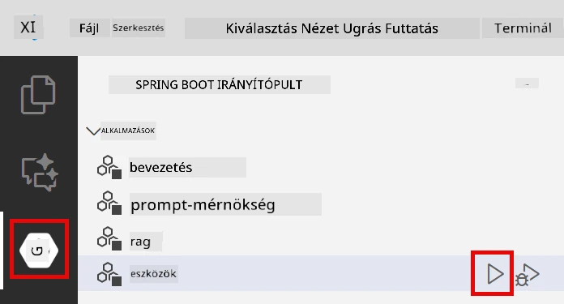
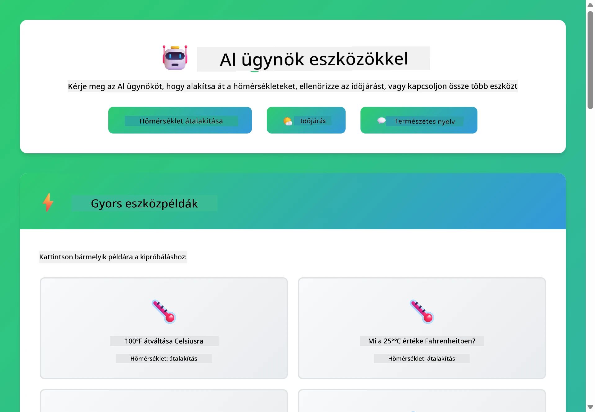
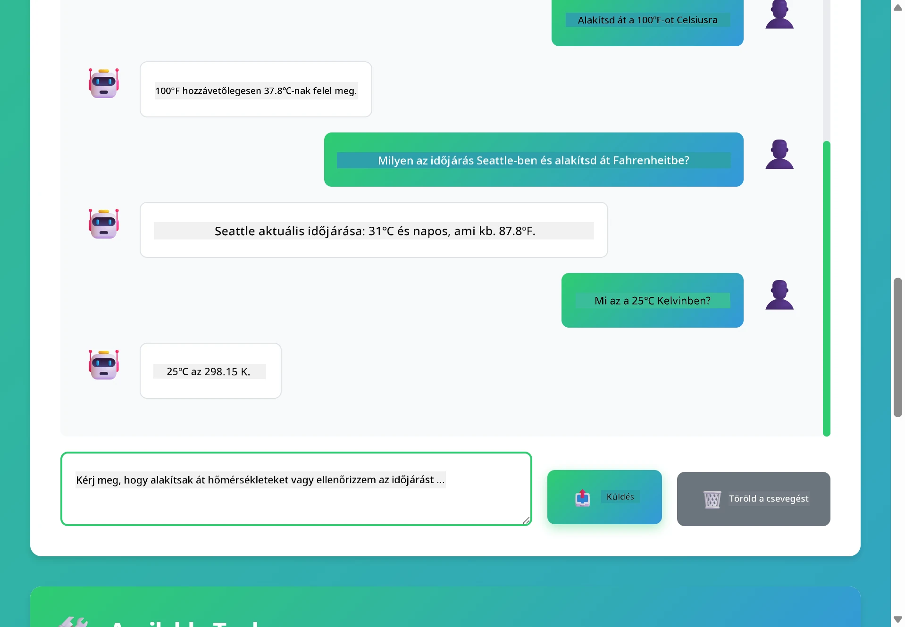

# Modul 04: MI Ügynökök eszközökkel

## Tartalomjegyzék

- [Videó Bemutató](#videó-bemutató)
- [Amit Megtanulsz](#amit-megtanulsz)
- [Előfeltételek](#előfeltételek)
- [Mesterséges Intelligencia Ügynökök Eszközökkel](#mesterséges-intelligencia-ügynökök-eszközökkel)
- [Hogyan Működik az Eszköz Meghívás](#hogyan-működik-az-eszköz-meghívás)
  - [Eszköz Definíciók](#eszköz-definíciók)
  - [Döntéshozatal](#döntéshozatal)
  - [Végrehajtás](#végrehajtás)
  - [Válaszgenerálás](#válaszgenerálás)
  - [Architektúra: Spring Boot Automatikus Bekötés](#architektúra-spring-boot-automatikus-bekötés)
- [Eszközláncolás](#eszközláncolás)
- [Az Alkalmazás Futattása](#az-alkalmazás-futattása)
- [Az Alkalmazás Használata](#az-alkalmazás-használata)
  - [Egyszerű Eszköz Használat Kipróbálása](#próbálj-ki-egyszerű-eszközhasználatot)
  - [Eszközláncolás Tesztelése](#teszteld-az-eszköz-láncolást)
  - [Beszélgetési Folyamat Megtekintése](#nézd-meg-a-beszélgetés-menetét)
  - [Különböző Kérések Kipróbálása](#kísérletezz-különféle-kérésekkel)
- [Kulcsfogalmak](#főbb-fogalmak)
  - [ReAct Minta (Érvelés és Cselekvés)](#react-minta-gondolkodás-és-cselekvés)
  - [Az Eszköz Leírások Fontossága](#az-eszközleírások-fontossága)
  - [Munkamenet Kezelés](#munkamenet-kezelés)
  - [Hibakezelés](#hibakezelés)
- [Elérhető Eszközök](#elérhető-eszközök)
- [Mikor Használjunk Eszköz-alapú Ügynököket](#mikor-használj-eszköz-alapú-ügynököket)
- [Eszközök vs RAG](#eszközök-vs-rag)
- [Következő Lépések](#következő-lépések)

## Videó Bemutató

Nézd meg ezt az élő munkamenetet, amely elmagyarázza, hogyan kezdj neki ennek a modulnak:

<a href="https://www.youtube.com/watch?v=O_J30kZc0rw"></a>

## Amit Megtanulsz

Eddig megtanultad, hogyan folytass beszélgetést a MI-vel, hogyan strukturáld hatékonyan a promptokat, és hogyan kötöd válaszaidat a dokumentumaidhoz. De van egy alapvető korlát: a nyelvi modellek csak szöveget generálnak. Nem tudják lekérdezni az időjárást, számításokat végezni, adatbázisokat lekérdezni vagy külső rendszerekkel kommunikálni.

Az eszközök ezt megváltoztatják. Azáltal, hogy a modellhez hozzáférést adsz hívható funkciókhoz, alakítsd át szöveggenerátorból ügynökké, aki képes cselekedni. A modell eldönti, mikor van szüksége eszközre, melyik eszközt használja, és milyen paramétereket ad át. A kódod végrehajtja a funkciót és visszaadja az eredményt. A modell beépíti ezt az eredményt a válaszába.

## Előfeltételek

- Elkészült a [01. modul - Bevezetés](../01-introduction/README.md) (Azure OpenAI erőforrások telepítve)
- Az előző modulok elvégzése ajánlott (ez a modul hivatkozik a [RAG koncepciókra a 03. modulból](../03-rag/README.md) az Eszközök vs RAG összehasonlításban)
- `.env` fájl a gyökérkönyvtárban Azure hitelesítő adatokkal (az `azd up` létrehozza az 01. modulban)

> **Megjegyzés:** Ha nem végezted el az 01. modul befejezését, előbb kövesd az ottani telepítési utasításokat.

## Mesterséges Intelligencia Ügynökök Eszközökkel

> **📝 Megjegyzés:** Ebben a modulban az „ügynökök” kifejezés olyan MI asszisztenseket jelöl, amelyek eszköz-hívási képességekkel bővültek. Ez eltér az **Agentic AI** mintáktól (önálló ügynökök tervezéssel, memóriával és többlépcsős érveléssel), amelyeket a [05. modulban: MCP](../05-mcp/README.md) fedünk le.

Eszközök nélkül a nyelvi modell csak szöveget generál a tanulási adataiból. Ha megkérdezed az aktuális időjárást, csak találgat. Ha eszközöket adsz neki, hívhat időjárás API-t, végezhet számításokat vagy adatbázis lekérdezést — majd a valós eredményeket beépíti a válaszába.


*Eszközök nélkül a modell csak találgat — eszközökkel API-kat hívhat, számításokat végezhet, és valós idejű adatokat szolgáltathat.*

Az eszközökkel rendelkező MI ügynök egy **Reasoning and Acting (ReAct)** mintát követ. A modell nem csak válaszol — megfontolja, mire van szüksége, cselekszik eszközhívással, megfigyeli az eredményt, majd eldönti, hogy újra cselekszik-e vagy végső választ ad:

1. **Érvelés** — Az ügynök elemzi a felhasználó kérdését és meghatározza, milyen információ szükséges
2. **Cselekvés** — Az ügynök kiválasztja a megfelelő eszközt, előállítja a helyes paramétereket, és hívja azt
3. **Megfigyelés** — Az ügynök megkapja az eszköz kimenetét és értékeli az eredményt
4. **Ismétlés vagy Válaszadás** — Ha további adatok kellettek, visszatér a ciklus elejére; másképp összefoglalja a választ természetes nyelven


*A ReAct ciklus — az ügynök megfontolja, mit kell tennie, cselekszik eszközhívással, megfigyeli az eredményt, és addig ismétel, amíg végső választ nem adhat.*

Ez automatikusan történik. Te határozod meg az eszközöket és azok leírásait. A modell kezeli a döntéshozatalt arról, mikor és hogyan használja őket.

## Hogyan Működik az Eszköz Meghívás

### Eszköz Definíciók

[WeatherTool.java](../../../04-tools/src/main/java/com/example/langchain4j/agents/tools/WeatherTool.java) | [TemperatureTool.java](../../../04-tools/src/main/java/com/example/langchain4j/agents/tools/TemperatureTool.java)

Egyértelmű leírással és paraméter specifikációkkal rendelkezel a funkciókat. A modell ezeknek a leírásoknak látja a tartalmát a rendszerpromptban, és megérti, mire való az egyes eszköz.

```java
@Component
public class WeatherTool {
    
    @Tool("Get the current weather for a location")
    public String getCurrentWeather(@P("Location name") String location) {
        // Az időjárás lekérdezés logikája
        return "Weather in " + location + ": 22°C, cloudy";
    }
}

@AiService
public interface Assistant {
    String chat(@MemoryId String sessionId, @UserMessage String message);
}

// Az asszisztens automatikusan össze van kötve a Spring Boot által:
// - ChatModel bean
// - Minden @Tool metódus az @Component osztályokból
// - ChatMemoryProvider a munkamenet kezelésére
```

Az alábbi diagram lebontja az összes annotációt, és megmutatja, hogyan segít minden elem az MI-nek megérteni, mikor kell meghívni az eszközt és milyen argumentumokat adjon át:


*Az eszköz definíció anatómiája — az @Tool megmondja az MI-nek, mikor használja, az @P leírja az egyes paramétereket, és az @AiService mindent összeköt indításkor.*

> **🤖 Próbáld ki a [GitHub Copilot](https://github.com/features/copilot) Chattel:** Nyisd meg a [`WeatherTool.java`](../../../04-tools/src/main/java/com/example/langchain4j/agents/tools/WeatherTool.java) fájlt és kérdezd meg:
> - "Hogyan integrálnék egy valós időjárás API-t, mint az OpenWeatherMap ahelyett, hogy teszt adatot használok?"
> - "Mi tesz egy jó eszköz leírást, ami segíti az MI helyes használatát?"
> - "Hogyan kezelem az API hibákat és korlátokat az eszköz implementációkban?"

### Döntéshozatal

Amikor a felhasználó megkérdezi: „Milyen az idő Seattle-ben?”, a modell nem véletlenszerűen választ eszközt. Összeveti a felhasználó szándékát az összes hozzáférhető eszköz leírásával, pontozza azok relevanciáját, és kiválasztja a legjobbat. Ezután előállít egy strukturált függvényhívást a megfelelő paraméterekkel — jelen esetben `location` értéke `"Seattle"`.

Ha egyik eszköz sem felel meg, a modell a saját tudásából válaszol. Ha több eszköz is megfelel, a legspecifikusabbat választja ki.


*A modell minden elérhető eszközt értékel a felhasználó szándékához képest és kiválasztja a legjobb találatot — ezért fontos a tiszta, pontos eszközleírás megírása.*

### Végrehajtás

[AgentService.java](../../../04-tools/src/main/java/com/example/langchain4j/agents/service/AgentService.java)

Spring Boot automatikusan beköti a deklaratív `@AiService` interfészt az összes regisztrált eszközhöz, és a LangChain4j automatikusan végrehajtja az eszközhívásokat. A háttérben egy komplett eszközhívási folyamat zajlik hat szakaszon át — a felhasználó természetes nyelvű kérdésétől a válasz természetes nyelvű megformálásáig:


*Az end-to-end folyamat — a felhasználó kérdez, a modell kiválaszt egy eszközt, a LangChain4j végrehajtja, és a modell beépíti az eredményt a válaszba.*

A háttérben az `AiServices` futtatja ugyanazt az eszközhívási ciklust bármely eszköz esetén — itt egy egyszerű `Calculator` példával illusztrálva. Az alábbi sorrendi diagram pontosan megmutatja a belső lépéseket:


*Az eszközhívási ciklus — az `AiServices` elküldi az üzenetedet és az eszköz sémákat az LLM-nek, az LLM válasza egy függvényhívás, például `add(42, 58)`, a LangChain4j helyben végrehajtja a `Calculator` metódust, majd az eredményt visszaküldi a végső válaszhoz.*

> **🤖 Próbáld ki a [GitHub Copilot](https://github.com/features/copilot) Chattel:** Nyisd meg a [`AgentService.java`](../../../04-tools/src/main/java/com/example/langchain4j/agents/service/AgentService.java) fájlt és kérdezd meg:
> - "Hogyan működik a ReAct minta és miért hatékony MI ügynökök számára?"
> - "Hogyan dönt az ügynök, melyik eszközt használja és milyen sorrendben?"
> - "Mi történik, ha egy eszközhívás sikertelen — hogyan kezeljem robusztusan a hibákat?"

### Válaszgenerálás

A modell megkapja az időjárási adatot és természetes nyelvű válaszra formázza a felhasználó számára.

### Architektúra: Spring Boot Automatikus Bekötés

Ez a modul használja a LangChain4j Spring Boot integrációját deklaratív `@AiService` interfészekkel. Indításkor a Spring Boot felfedezi az összes `@Component`-et, amelyek tartalmaznak `@Tool` metódusokat, a te `ChatModel` binnedet, és a `ChatMemoryProvider`-t — majd mindet egyetlen `Assistant` interfészbe köt összeszerelés nélkül.


*Az @AiService interfész összekapcsolja a ChatModelt, eszköz komponenseket és memória szolgáltatót — a Spring Boot automatikusan kezeli a bekötést.*

Itt van a teljes kérés-életciklus egy sorrendi diagramon — a HTTP kérésből a kontrolleren át a szolgáltatásig, az automatikusan bekötött proxyig, majd az eszköz végrehajtásig és vissza:


*Teljes Spring Boot kérés életciklus — HTTP kérés a kontrolleren és szolgáltatáson áthalad az automatikusan bekötött Assistant proxyhoz, amely automatikusan koordinálja az LLM-et és az eszközhívásokat.*

E megközelítés fő előnyei:

- **Spring Boot automatikus bekötés** — ChatModel és eszközök automatikusan be vannak injektálva
- **@MemoryId minta** — Automatikus munkamenet alapú memória kezelés
- **Egyetlen példány** — Assistant egyszer létrejön és újrahasználható a jobb teljesítményért
- **Típusbiztos végrehajtás** — Java metódusok közvetlen hívása típuskonverzióval
- **Több körös koordinálás** — Automatikusan kezeli az eszközláncolást
- **Nulla alap kódolás** — Nem szükséges kézi `AiServices.builder()` hívás vagy memória HashMap

Alternatív megoldások (kézi `AiServices.builder()`) több kódot igényelnek és nem használják ki a Spring Boot előnyeit.

## Eszközláncolás

**Eszközláncolás** — Az eszköz-alapú ügynökök valódi ereje akkor mutatkozik meg, amikor egyetlen kérdés több eszközt igényel. Kérdezd meg: „Milyen az idő Seattle-ben Fahrenheitben?”, és az ügynök automatikusan összefűz két eszközt: először meghívja a `getCurrentWeather`-t, hogy megszerezze a Celsius hőmérsékletet, majd átadja azt a `celsiusToFahrenheit`-nek átváltásra — mindezt egyetlen beszélgetési körben.


*Eszközláncolás működés közben — az ügynök először hívja a getCurrentWeather-t, majd a Celsius eredményt átvezeti a celsiusToFahrenheit-nek, és összetett választ ad.*

**Kulturált Hibakezelés** — Kérdezz rá egy város időjárására, ami nincs benne a teszt adatokban. Az eszköz hibát jelez, és az MI elmagyarázza, hogy nem tud segíteni ahelyett, hogy összeomlik. Az eszközök biztonságosan hibáznak. Az alábbi diagram összehasonlítja a két megközelítést — megfelelő hibakezeléssel az ügynök elkapja a kivételt és segítőkész választ ad, hibakezelés nélkül pedig az egész alkalmazás összeomlik:


*Ha egy eszköz hibát okoz, az ügynök elkapja és inkább hasznos magyarázattal válaszol, nem pedig összeomlik.*

Ez egyetlen beszélgetési körben történik. Az ügynök önállóan koordinál több eszközhívást.

## Az Alkalmazás Futattása

**Telepítés ellenőrzése:**

Ellenőrizd, hogy a `.env` fájl létezik a gyökérkönyvtárban Azure hitelesítő adatokkal (az 01. modul során készült). Futtasd ezt a modul könyvtárában (`04-tools/`):

**Bash:**
```bash
cat ../.env  # Meg kell jelenítenie az AZURE_OPENAI_ENDPOINT, API_KEY, DEPLOYMENT értékeket
```

**PowerShell:**
```powershell
Get-Content ..\.env  # Meg kell jelenítenie az AZURE_OPENAI_ENDPOINT, API_KEY, DEPLOYMENT értékeket
```

**Indítsd el az alkalmazást:**

> **Megjegyzés:** Ha már elindítottad az összes alkalmazást a gyökérkönyvtárból `./start-all.sh` használatával (amint az az 01. modulban szerepel), akkor ez a modul már fut a 8084-es porton. Átugorhatod a lentebb lévő indító parancsokat, és közvetlenül a http://localhost:8084 címre mehetsz.

**1. lehetőség: Spring Boot Dashboard használata (ajánlott VS Code felhasználóknak)**

A fejlesztői konténer tartalmazza a Spring Boot Dashboard bővítményt, amely vizuális felületet biztosít minden Spring Boot alkalmazás kezeléséhez. A bal oldali tevékenységsávban találod a Spring Boot ikont.

A Spring Boot Dashboard-ból:
- Láthatod az összes elérhető Spring Boot alkalmazást a munkaterületen
- Egy kattintással indíthatsz/leállíthatsz alkalmazásokat
- Valós időben megtekintheted az alkalmazás naplóit
- Figyelheted az alkalmazás állapotát

Egyszerűen kattints a "tools" melletti lejátszás gombra ennek a modulnak az indításához, vagy indítsd el az összes modult egyszerre.

Így néz ki a Spring Boot Dashboard a VS Code-ban:


*A Spring Boot műszerfal a VS Code-ban — indítsd, állítsd le és figyeld az összes modult egy helyről*

**2. lehetőség: Shell szkriptek használata**

Indítsd el az összes webalkalmazást (01-04 modulok):

**Bash:**
```bash
cd ..  # A gyökérkönyvtárból
./start-all.sh
```

**PowerShell:**
```powershell
cd ..  # A gyökérkönyvtárból
.\start-all.ps1
```

Vagy indítsd el csak ezt a modult:

**Bash:**
```bash
cd 04-tools
./start.sh
```

**PowerShell:**
```powershell
cd 04-tools
.\start.ps1
```

Mindkét szkript automatikusan betölti a környezeti változókat a gyökér `.env` fájlból, és felépíti a JAR fájlokat, ha azok nem léteznek.

> **Megjegyzés:** Ha inkább kézzel akarod felépíteni az összes modult indulás előtt:
>
> **Bash:**
> ```bash
> cd ..  # Go to root directory
> mvn clean package -DskipTests
> ```
>
> **PowerShell:**
> ```powershell
> cd ..  # Go to root directory
> mvn clean package -DskipTests
> ```

Nyisd meg a http://localhost:8084 címet a böngésződben.

**Leállításhoz:**

**Bash:**
```bash
./stop.sh  # Csak ez a modul
# Vagy
cd .. && ./stop-all.sh  # Minden modul
```

**PowerShell:**
```powershell
.\stop.ps1  # Csak ez a modul
# Vagy
cd ..; .\stop-all.ps1  # Minden modul
```

## Az alkalmazás használata

Az alkalmazás webes felületet biztosít, ahol egy AI ügynökkel léphetsz kapcsolatba, mely hozzáfér időjárás- és hőmérséklet-konvertáló eszközökhöz. Így néz ki a felület — tartalmaz gyorsindító példákat és egy chat panelt a kérések küldéséhez:

<a href="images/tools-homepage.png"></a>

*Az AI Ügynök Eszközök felülete - gyors példák és chat felület az eszközökkel való interakcióhoz*

### Próbálj ki egyszerű eszközhasználatot

Kezdj egy egyszerű kéréssel: „Alakítsd át a 100 Fahrenheit fokot Celsiusra”. Az ügynök felismeri, hogy szüksége van a hőmérséklet-konvertáló eszközre, meghívja a megfelelő paraméterekkel, és visszaadja az eredményt. Figyeld meg, milyen természetes érzés — nem kellett megadnod, melyik eszközt használja vagy hogyan hívja meg.

### Teszteld az eszköz láncolást

Most próbálj valami bonyolultabbat: „Milyen az időjárás Seattle-ben és alakítsd át Fahrenheitre?” Nézd, ahogy az ügynök lépésenként dolgozik. Először lekéri az időjárást (ami Celsiusban ad választ), felismeri, hogy át kell konvertálni Fahrenheitre, meghívja a konverziós eszközt, majd összefűzi mindkét eredményt egy válaszba.

### Nézd meg a beszélgetés menetét

A chat felület megőrzi a beszélgetés előzményeit, lehetővé téve a többlépcsős interakciókat. Láthatod az összes korábbi kérdést és választ, így könnyű nyomon követni a párbeszédet és megérteni, hogyan építi fel az ügynök a kontextust több forduló alatt.

<a href="images/tools-conversation-demo.png"></a>

*Többlépcsős beszélgetés egyszerű átalakításokról, időjárás lekérdezésekről és eszköz láncolásról*

### Kísérletezz különféle kérésekkel

Próbálj ki különböző kombinációkat:
- Időjárás lekérdezések: „Milyen az időjárás Tokióban?”
- Hőmérséklet átváltások: „Mennyi 25 °C Kelvinben?”
- Összetett kérdések: „Nézd meg az időjárást Párizsban, és mondd meg, hogy 20 °C felett van-e”

Figyeld meg, ahogy az ügynök a természetes nyelvet értelmezi és hozzárendeli a megfelelő eszközhívásokat.

## Főbb fogalmak

### ReAct minta (Gondolkodás és Cselekvés)

Az ügynök váltogat a gondolkodás (döntés, mit tegyen) és a cselekvés (eszközök használata) között. Ez a minta lehetővé teszi az autonóm problémamegoldást, nem csak az utasításokra adott válaszokat.

### Az eszközleírások fontossága

Az eszközleírások minősége közvetlenül befolyásolja, hogy az ügynök mennyire jól használja őket. Egyértelmű, pontos leírások segítik a modellt megérteni, mikor és hogyan hívja meg az adott eszközt.

### Munkamenet-kezelés

Az `@MemoryId` annotáció lehetővé teszi az automatikus munkamenetalapú memória kezelését. Minden munkamenet ID saját `ChatMemory` példányt kap, melyet a `ChatMemoryProvider` bean kezel, így egyszerre több felhasználó is kommunikálhat az ügynökkel anélkül, hogy egymás beszélgetéseit látnák. Az alábbi ábra mutatja, hogyan irányítja a rendszer a felhasználókat különálló memória tárolókba az ID-jük alapján:


*Minden munkamenet ID különálló beszélgetési előzményhez tartozik — a felhasználók sosem látják egymás üzeneteit.*

### Hibakezelés

Az eszközök hibázhatnak — API-k időtúllépnek, hibás paraméterek lehetnek, külső szolgáltatások leállhatnak. A gyártásban használt ügynököknek szükségük van hibakezelésre, hogy a modell elmagyarázhassa a problémákat, vagy alternatívákat próbálhasson ahelyett, hogy az egész alkalmazás összeomlana. Ha egy eszköz kivételt dob, a LangChain4j elkapja azt, majd visszajuttatja a hibaüzenetet a modellnek, amely természetes nyelven képes elmagyarázni a problémát.

## Elérhető eszközök

Az alábbi ábra bemutatja az eszközök széles ökoszisztémáját, amelyet építhetsz. Ez a modul időjárás- és hőmérséklet-eszközöket mutat be, de az `@Tool` minta bármilyen Java metódusra működik — az adatbázis-lekérdezésektől a fizetési feldolgozásig.


*Bármely `@Tool` annotációval ellátott Java metódus elérhetővé válik az AI számára — a minta kiterjed adatbázisokra, API-kra, e-mailekre, fájlműveletekre és még sok másra.*

## Mikor használj eszköz-alapú ügynököket

Nem minden kérés igényel eszközöket. A döntés azon múlik, hogy az AI-nak szüksége van-e külső rendszerekkel való interakcióra, vagy saját tudásából tud válaszolni. Az alábbi útmutató összefoglalja, mikor tesznek hozzá értéket az eszközök, és mikor feleslegesek:


*Egy gyors döntési útmutató — az eszközök valós idejű adatokra, számításokra és műveletekre valók; az általános tudás és kreatív feladatok nem igénylik őket.*

## Eszközök vs. RAG

A 03-as és 04-es modulok egyaránt bővítik az AI képességeit, ám alapvetően más módon. A RAG a modellt **tudással** látja el dokumentumok előhívásával. Az eszközök a modellnek cselekvési képességet adnak függvényhívások által. Az alábbi ábra összehasonlítja ezt a két megközelítést egymás mellett — hogyan működik mindkét munkafolyamat és milyen kompromisszumokat rejtenek:


*A RAG statikus dokumentumokból gyűjt információt — az eszközök műveleteket hajtanak végre és dinamikus, valós idejű adatokat szereznek. Sok termelési rendszer mindkettőt használja.*

Gyakorlatban sok termelési rendszer kombinálja a két megoldást: RAG a dokumentációban való alátámasztáshoz, és eszközök az élő adatok lekéréséhez vagy műveletek végrehajtásához.

## Következő lépések

**Következő modul:** [05-mcp - Model Context Protocol (MCP)](../05-mcp/README.md)

---

**Navigáció:** [← Előző: 03-as modul - RAG](../03-rag/README.md) | [Vissza a főoldalra](../README.md) | [Következő: 05-ös modul - MCP →](../05-mcp/README.md)

---

<!-- CO-OP TRANSLATOR DISCLAIMER START -->
**Jogi nyilatkozat**:
Ez a dokumentum az AI fordítási szolgáltatás, a [Co-op Translator](https://github.com/Azure/co-op-translator) segítségével készült. Bár az pontosságra törekszünk, kérjük, vegye figyelembe, hogy az automatikus fordítások hibákat vagy pontatlanságokat tartalmazhatnak. Az eredeti dokumentum az anyanyelvén tekintendő hiteles forrásnak. Fontos információk esetén professzionális emberi fordítást javasolunk. Nem vállalunk felelősséget semmilyen félreértésért vagy téves értelmezésért, amely ebből a fordításból ered.
<!-- CO-OP TRANSLATOR DISCLAIMER END -->