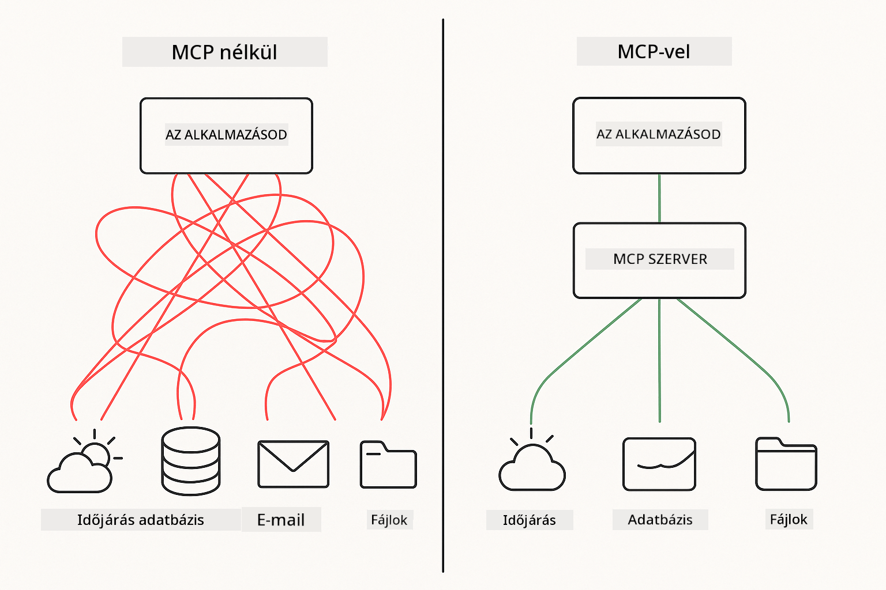

<!--
CO_OP_TRANSLATOR_METADATA:
{
  "original_hash": "c25ec1f10ef156c53e190cdf8b0711ab",
  "translation_date": "2025-12-13T18:02:38+00:00",
  "source_file": "05-mcp/README.md",
  "language_code": "hu"
}
-->
# Modul 05: Model Context Protocol (MCP)

## Tartalomjegyzék

- [Mit fogsz megtanulni](../../../05-mcp)
- [Az MCP megértése](../../../05-mcp)
- [Hogyan működik az MCP](../../../05-mcp)
  - [Szerver-kliens architektúra](../../../05-mcp)
  - [Eszközfelismerés](../../../05-mcp)
  - [Átvitel mechanizmusok](../../../05-mcp)
- [Előfeltételek](../../../05-mcp)
- [Mit fed le ez a modul](../../../05-mcp)
- [Gyors kezdés](../../../05-mcp)
  - [Példa 1: Távoli számológép (Streamable HTTP)](../../../05-mcp)
  - [Példa 2: Fájlműveletek (Stdio)](../../../05-mcp)
  - [Példa 3: Git elemzés (Docker)](../../../05-mcp)
- [Kulcsfogalmak](../../../05-mcp)
  - [Átvitel kiválasztása](../../../05-mcp)
  - [Eszközfelismerés](../../../05-mcp)
  - [Munkamenet-kezelés](../../../05-mcp)
  - [Platformok közötti megfontolások](../../../05-mcp)
- [Mikor használd az MCP-t](../../../05-mcp)
- [MCP ökoszisztéma](../../../05-mcp)
- [Gratulálunk!](../../../05-mcp)
  - [Mi következik?](../../../05-mcp)
- [Hibaelhárítás](../../../05-mcp)

## Mit fogsz megtanulni

Beszélgető AI-t építettél, elsajátítottad a promptokat, dokumentumok alapján megalapozott válaszokat készítettél, és eszközökkel rendelkező ügynököket hoztál létre. De ezek az eszközök mind az adott alkalmazásodra szabottak voltak. Mi lenne, ha az AI-d hozzáférést kapna egy szabványosított eszközök ökoszisztémájához, amelyet bárki létrehozhat és megoszthat?

A Model Context Protocol (MCP) pontosan ezt nyújtja – egy szabványos módot arra, hogy az AI alkalmazások felfedezzék és használják a külső eszközöket. Ahelyett, hogy minden adatforráshoz vagy szolgáltatáshoz egyedi integrációt írnál, MCP szerverekhez csatlakozol, amelyek képességeiket egységes formátumban teszik elérhetővé. Az AI ügynököd így automatikusan felfedezheti és használhatja ezeket az eszközöket.



*MCP előtt: bonyolult pont-pont integrációk. MCP után: Egy protokoll, végtelen lehetőségek.*

## Az MCP megértése

Az MCP egy alapvető problémát old meg az AI fejlesztésben: minden integráció egyedi. GitHub-hoz akarsz hozzáférni? Egyedi kód. Fájlokat olvasni? Egyedi kód. Adatbázist lekérdezni? Egyedi kód. És ezek az integrációk nem működnek más AI alkalmazásokkal.

Az MCP ezt szabványosítja. Egy MCP szerver eszközöket tesz elérhetővé világos leírásokkal és sémákkal. Bármely MCP kliens csatlakozhat, felfedezheti az elérhető eszközöket, és használhatja azokat. Egyszer építsd meg, bárhol használd.


*Model Context Protocol architektúra – szabványosított eszközfelismerés és végrehajtás*

## Hogyan működik az MCP

**Szerver-kliens architektúra**

Az MCP kliens-szerver modellt használ. A szerverek eszközöket biztosítanak – fájlok olvasása, adatbázis lekérdezése, API hívások. A kliensek (az AI alkalmazásod) csatlakoznak a szerverekhez és használják az eszközeiket.

**Eszközfelismerés**

Amikor a kliensed csatlakozik egy MCP szerverhez, megkérdezi: „Milyen eszközeid vannak?” A szerver válaszként elérhető eszközök listáját adja meg, mindegyikhez leírással és paramétersémával. Az AI ügynököd ezután eldöntheti, mely eszközöket használja a felhasználói kérések alapján.

**Átvitel mechanizmusok**

Az MCP két átvitel mechanizmust definiál: HTTP távoli szerverekhez, Stdio helyi folyamatokhoz (beleértve a Docker konténereket):


*MCP átvitel mechanizmusok: HTTP távoli szerverekhez, Stdio helyi folyamatokhoz (beleértve Docker konténereket)*

**Streamable HTTP** - [StreamableHttpDemo.java](../../../05-mcp/src/main/java/com/example/langchain4j/mcp/StreamableHttpDemo.java)

Távoli szerverekhez. Az alkalmazás HTTP kéréseket küld egy hálózaton futó szerverhez. Server-Sent Events-t használ valós idejű kommunikációhoz.

```java
McpTransport httpTransport = new StreamableHttpMcpTransport.Builder()
    .url("http://localhost:3001/mcp")
    .timeout(Duration.ofSeconds(60))
    .logRequests(true)
    .logResponses(true)
    .build();
```

> **🤖 Próbáld ki a [GitHub Copilot](https://github.com/features/copilot) Chattel:** Nyisd meg a [`StreamableHttpDemo.java`](../../../05-mcp/src/main/java/com/example/langchain4j/mcp/StreamableHttpDemo.java) fájlt és kérdezd meg:
> - "Miben különbözik az MCP a közvetlen eszközintegrációtól, mint a Modul 04-ben?"
> - "Milyen előnyei vannak az MCP használatának az eszközmegosztásban alkalmazások között?"
> - "Hogyan kezelem a kapcsolatmegszakadásokat vagy időtúllépéseket az MCP szerverekhez?"

**Stdio** - [StdioTransportDemo.java](../../../05-mcp/src/main/java/com/example/langchain4j/mcp/StdioTransportDemo.java)

Helyi folyamatokhoz. Az alkalmazás egy alfolyamatként indít szervert, és a szabványos bemeneten/kimeneten keresztül kommunikál. Hasznos fájlrendszer eléréshez vagy parancssori eszközökhöz.

```java
McpTransport stdioTransport = new StdioMcpTransport.Builder()
    .command(List.of(
        npmCmd, "exec",
        "@modelcontextprotocol/server-filesystem@0.6.2",
        resourcesDir
    ))
    .logEvents(false)
    .build();
```

> **🤖 Próbáld ki a [GitHub Copilot](https://github.com/features/copilot) Chattel:** Nyisd meg a [`StdioTransportDemo.java`](../../../05-mcp/src/main/java/com/example/langchain4j/mcp/StdioTransportDemo.java) fájlt és kérdezd meg:
> - "Hogyan működik a Stdio átvitel és mikor érdemes használni a HTTP-vel szemben?"
> - "Hogyan kezeli a LangChain4j az MCP szerver folyamatok életciklusát?"
> - "Milyen biztonsági kockázatokkal jár, ha az AI hozzáfér a fájlrendszerhez?"

**Docker (Stdio-t használ)** - [GitRepositoryAnalyzer.java](../../../05-mcp/src/main/java/com/example/langchain4j/mcp/GitRepositoryAnalyzer.java)

Konténerizált szolgáltatásokhoz. Stdio átvitel segítségével kommunikál egy Docker konténerrel a `docker run` parancson keresztül. Jó összetett függőségekhez vagy izolált környezetekhez.

```java
McpTransport dockerTransport = new StdioMcpTransport.Builder()
    .command(List.of(
        "docker", "run",
        "-e", "GITHUB_PERSONAL_ACCESS_TOKEN=" + System.getenv("GITHUB_TOKEN"),
        "-v", volumeMapping,
        "-i", "mcp/git"
    ))
    .logEvents(true)
    .build();
```

> **🤖 Próbáld ki a [GitHub Copilot](https://github.com/features/copilot) Chattel:** Nyisd meg a [`GitRepositoryAnalyzer.java`](../../../05-mcp/src/main/java/com/example/langchain4j/mcp/GitRepositoryAnalyzer.java) fájlt és kérdezd meg:
> - "Hogyan izolálja a Docker az MCP szervereket és mik az előnyei?"
> - "Hogyan konfiguráljam a volume mountokat az adatok megosztásához a host és az MCP konténerek között?"
> - "Mik a legjobb gyakorlatok a Docker alapú MCP szerverek életciklusának kezelésére éles környezetben?"

## A példák futtatása

### Előfeltételek

- Java 21+, Maven 3.9+
- Node.js 16+ és npm (az MCP szerverekhez)
- **Docker Desktop** – Futnia kell az 3. példához (nem elég csak telepítve)
- GitHub személyes hozzáférési token beállítva a `.env` fájlban (a Modul 00-ból)

> **Megjegyzés:** Ha még nem állítottad be a GitHub tokened, lásd a [Modul 00 - Gyors kezdés](../00-quick-start/README.md) útmutatót.

> **⚠️ Docker felhasználók:** Az 3. példa futtatása előtt ellenőrizd, hogy a Docker Desktop fut a `docker ps` paranccsal. Ha kapcsolat hibákat látsz, indítsd el a Docker Desktopot és várj kb. 30 másodpercet az inicializálásra.

## Gyors kezdés

**VS Code használata:** Egyszerűen kattints jobb gombbal bármelyik demo fájlra a Felfedezőben és válaszd a **"Run Java"** opciót, vagy használd a Futtatás és Hibakeresés panel indítási konfigurációit (előtte győződj meg róla, hogy a tokened hozzáadtad a `.env` fájlhoz).

**Maven használata:** Alternatívaként a parancssorból is futtathatod az alábbi példákat.

**⚠️ Fontos:** Néhány példához előfeltételek szükségesek (pl. MCP szerver indítása vagy Docker képek építése). Ellenőrizd az egyes példák követelményeit futtatás előtt.

### Példa 1: Távoli számológép (Streamable HTTP)

Ez a hálózati alapú eszközintegrációt mutatja be.

**⚠️ Előfeltétel:** Először el kell indítanod az MCP szervert (lásd az 1. terminált lent).

**1. terminál – MCP szerver indítása:**

**Bash:**
```bash
git clone https://github.com/modelcontextprotocol/servers.git
cd servers/src/everything
npm install
node dist/streamableHttp.js
```

**PowerShell:**
```powershell
git clone https://github.com/modelcontextprotocol/servers.git
cd servers/src/everything
npm install
node dist/streamableHttp.js
```

**2. terminál – Példa futtatása:**

**VS Code használata:** Kattints jobb gombbal a `StreamableHttpDemo.java` fájlra és válaszd a **"Run Java"** opciót.

**Maven használata:**

**Bash:**
```bash
export GITHUB_TOKEN=your_token_here
cd 05-mcp
mvn compile exec:java -Dexec.mainClass=com.example.langchain4j.mcp.StreamableHttpDemo
```

**PowerShell:**
```powershell
$env:GITHUB_TOKEN=your_token_here
cd 05-mcp
mvn --% compile exec:java -Dexec.mainClass=com.example.langchain4j.mcp.StreamableHttpDemo
```

Figyeld, ahogy az ügynök felfedezi az elérhető eszközöket, majd használja a számológépet összeadás végrehajtására.

### Példa 2: Fájlműveletek (Stdio)

Ez a helyi alfolyamat alapú eszközöket mutatja be.

**✅ Nincs szükség előfeltételre** – az MCP szerver automatikusan elindul.

**VS Code használata:** Kattints jobb gombbal a `StdioTransportDemo.java` fájlra és válaszd a **"Run Java"** opciót.

**Maven használata:**

**Bash:**
```bash
export GITHUB_TOKEN=your_token_here
cd 05-mcp
mvn compile exec:java -Dexec.mainClass=com.example.langchain4j.mcp.StdioTransportDemo
```

**PowerShell:**
```powershell
$env:GITHUB_TOKEN=your_token_here
cd 05-mcp
mvn --% compile exec:java -Dexec.mainClass=com.example.langchain4j.mcp.StdioTransportDemo
```

Az alkalmazás automatikusan elindít egy fájlrendszer MCP szervert és beolvas egy helyi fájlt. Figyeld meg, hogyan kezeli helyetted az alfolyamat menedzsmentet.

**Várt kimenet:**
```
Assistant response: The content of the file is "Kaboom!".
```

### Példa 3: Git elemzés (Docker)

Ez a konténerizált eszközszervereket mutatja be.

**⚠️ Előfeltételek:** 
1. **Docker Desktopnak FUTNIA kell** (nem elég csak telepítve)
2. **Windows felhasználók:** Ajánlott a WSL 2 mód (Docker Desktop Beállítások → Általános → „Use the WSL 2 based engine”). A Hyper-V mód kézi fájlmegosztás konfigurációt igényel.
3. Először építened kell a Docker képet (lásd az 1. terminált lent)

**Ellenőrizd, hogy a Docker fut:**

**Bash:**
```bash
docker ps  # Konténerlistát kellene mutatnia, nem hibát
```

**PowerShell:**
```powershell
docker ps  # Konténerlistát kellene mutatnia, nem hibát
```

Ha olyan hibát látsz, hogy „Cannot connect to Docker daemon” vagy „The system cannot find the file specified”, indítsd el a Docker Desktopot és várj az inicializálásra (~30 másodperc).

**Hibaelhárítás:**
- Ha az AI üres repót vagy fájlok hiányát jelzi, a volume mount (`-v`) nem működik.
- **Windows Hyper-V felhasználók:** Add hozzá a projekt könyvtárat a Docker Desktop Beállítások → Erőforrások → Fájlmegosztás menüben, majd indítsd újra a Docker Desktopot.
- **Ajánlott megoldás:** Váltás WSL 2 módra az automatikus fájlmegosztásért (Beállítások → Általános → engedélyezd a „Use the WSL 2 based engine” opciót).

**1. terminál – Docker kép építése:**

**Bash:**
```bash
cd servers/src/git
docker build -t mcp/git .
```

**PowerShell:**
```powershell
cd servers/src/git
docker build -t mcp/git .
```

**2. terminál – Elemző futtatása:**

**VS Code használata:** Kattints jobb gombbal a `GitRepositoryAnalyzer.java` fájlra és válaszd a **"Run Java"** opciót.

**Maven használata:**

**Bash:**
```bash
export GITHUB_TOKEN=your_token_here
cd 05-mcp
mvn compile exec:java -Dexec.mainClass=com.example.langchain4j.mcp.GitRepositoryAnalyzer
```

**PowerShell:**
```powershell
$env:GITHUB_TOKEN=your_token_here
cd 05-mcp
mvn --% compile exec:java -Dexec.mainClass=com.example.langchain4j.mcp.GitRepositoryAnalyzer
```

Az alkalmazás elindít egy Docker konténert, csatolja a repódat, és az AI ügynökön keresztül elemzi a repó szerkezetét és tartalmát.

## Kulcsfogalmak

**Átvitel kiválasztása**

Válassz az eszközeid helye alapján:
- Távoli szolgáltatások → Streamable HTTP
- Helyi fájlrendszer → Stdio
- Összetett függőségek → Docker

**Eszközfelismerés**

Az MCP kliensek automatikusan felfedezik az elérhető eszközöket csatlakozáskor. Az AI ügynök látja az eszközleírásokat és a felhasználói kérés alapján dönt, melyeket használja.

**Munkamenet-kezelés**

A Streamable HTTP átvitel munkameneteket tart fenn, lehetővé téve az állapotfüggő interakciókat távoli szerverekkel. A Stdio és Docker átvitelek általában állapotmentesek.

**Platformok közötti megfontolások**

A példák automatikusan kezelik a platformok közötti különbségeket (Windows vs Unix parancsok, útvonal konverziók Dockerhez). Ez fontos a különböző környezetekben történő éles telepítésekhez.

## Mikor használd az MCP-t

**Használd az MCP-t, ha:**
- Ki akarod használni a meglévő eszközök ökoszisztémáját
- Több alkalmazás által használt eszközöket építesz
- Harmadik fél szolgáltatásait integrálod szabványos protokollokkal
- Szeretnéd eszköz implementációkat cserélni kódmódosítás nélkül

**Használj egyedi eszközöket (Modul 04), ha:**
- Alkalmazás-specifikus funkciókat építesz
- Kritikus a teljesítmény (az MCP többletterhet jelent)
- Egyszerű eszközöket készítesz, amiket nem használnak újra
- Teljes kontrollra van szükséged a végrehajtás felett

## MCP ökoszisztéma

A Model Context Protocol egy nyílt szabvány növekvő ökoszisztémával:

- Hivatalos MCP szerverek gyakori feladatokra (fájlrendszer, Git, adatbázisok)
- Közösségi hozzájárulású szerverek különféle szolgáltatásokhoz
- Szabványosított eszközleírások és sémák
- Keretrendszer-független kompatibilitás (bármely MCP klienssel működik)

Ez a szabványosítás azt jelenti, hogy egy AI alkalmazásra épített eszközök másokkal is működnek, létrehozva egy megosztott képesség-ökoszisztémát.

## Gratulálunk!

Befejezted a LangChain4j kezdőknek tanfolyamot. Megtanultad:

- Hogyan építs beszélgető AI-t memóriával (Modul 01)
- Prompt tervezési mintákat különböző feladatokra (Modul 02)
- Válaszok megalapozását dokumentumokban RAG segítségével (Modul 03)
- AI ügynökök létrehozását egyedi eszközökkel (Modul 04)
- Szabványosított eszközök integrálását MCP-n keresztül (Modul 05)

Most már megvan az alapod éles AI alkalmazások építéséhez. A tanult fogalmak függetlenek a konkrét keretrendszerektől vagy modellektől – alapvető minták az AI mérnökségben.

### Mi következik?

A modulok elvégzése után fedezd fel a [Tesztelési útmutatót](../docs/TESTING.md), hogy lásd a LangChain4j tesztelési koncepcióit működés közben.

**Hivatalos források:**
- [LangChain4j dokumentáció](https://docs.langchain4j.dev/) – Átfogó útmutatók és API referencia
- [LangChain4j GitHub](https://github.com/langchain4j/langchain4j) – Forráskód és példák
- [LangChain4j oktatóanyagok](https://docs.langchain4j.dev/tutorials/) – Lépésről lépésre oktatóanyagok különböző felhasználási esetekhez

Köszönjük, hogy elvégezted ezt a tanfolyamot!

---

**Navigáció:** [← Előző: Modul 04 - Eszközök](../04-tools/README.md) | [Vissza a főoldalra](../README.md)

---

## Hibaelhárítás

### PowerShell Maven parancs szintaxis
**Probléma**: A Maven parancsok hibával leállnak: `Unknown lifecycle phase ".mainClass=..."`

**Ok**: A PowerShell az `=` jelet változó hozzárendelésként értelmezi, ami megszakítja a Maven tulajdonság szintaxisát

**Megoldás**: Használja a stop-parsing operátort `--%` a Maven parancs előtt:

**PowerShell:**
```powershell
mvn --% compile exec:java -Dexec.mainClass=com.example.langchain4j.mcp.StreamableHttpDemo
```

**Bash:**
```bash
mvn compile exec:java -Dexec.mainClass=com.example.langchain4j.mcp.StreamableHttpDemo
```

A `--%` operátor azt mondja a PowerShellnek, hogy az összes további argumentumot szó szerint adja át a Mavennek értelmezés nélkül.

### Docker kapcsolódási problémák

**Probléma**: A Docker parancsok hibával leállnak: "Cannot connect to Docker daemon" vagy "The system cannot find the file specified"

**Ok**: A Docker Desktop nem fut vagy nincs teljesen inicializálva

**Megoldás**: 
1. Indítsa el a Docker Desktopot
2. Várjon kb. 30 másodpercet a teljes inicializálásra
3. Ellenőrizze a `docker ps` paranccsal (konténerlista jelenjen meg, ne hiba)
4. Ezután futtassa a példáját

### Windows Docker kötet csatolás

**Probléma**: A Git repository elemző üres tárolót vagy fájlok hiányát jelzi

**Ok**: A kötet csatolás (`-v`) nem működik a fájlmegosztási beállítás miatt

**Megoldás**:
- **Ajánlott:** Váltson WSL 2 módra (Docker Desktop Beállítások → Általános → "Use the WSL 2 based engine")
- **Alternatíva (Hyper-V):** Adja hozzá a projekt könyvtárát a Docker Desktop Beállítások → Erőforrások → Fájlmegosztás menüben, majd indítsa újra a Docker Desktopot

---

<!-- CO-OP TRANSLATOR DISCLAIMER START -->
**Jogi nyilatkozat**:
Ezt a dokumentumot az AI fordító szolgáltatás, a [Co-op Translator](https://github.com/Azure/co-op-translator) segítségével fordítottuk le. Bár a pontosságra törekszünk, kérjük, vegye figyelembe, hogy az automatikus fordítások hibákat vagy pontatlanságokat tartalmazhatnak. Az eredeti dokumentum az anyanyelvén tekintendő hiteles forrásnak. Fontos információk esetén professzionális emberi fordítást javaslunk. Nem vállalunk felelősséget a fordítás használatából eredő félreértésekért vagy félreértelmezésekért.
<!-- CO-OP TRANSLATOR DISCLAIMER END -->