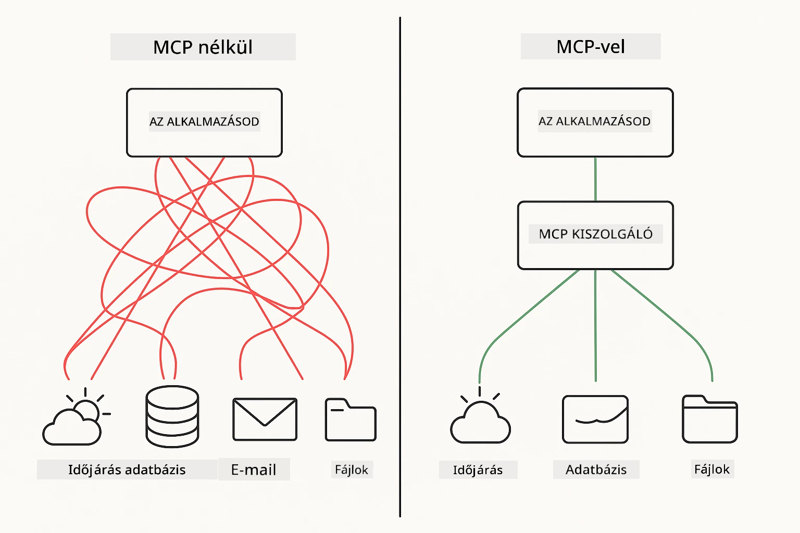
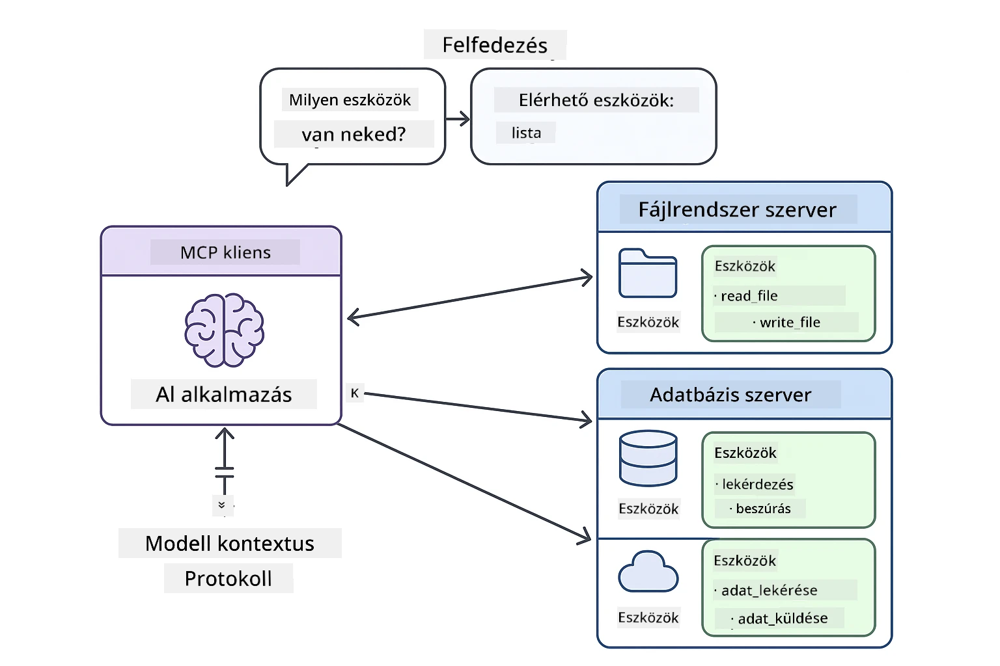
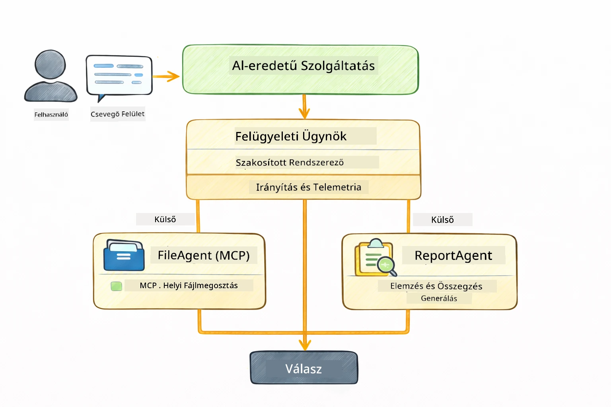

<!--
CO_OP_TRANSLATOR_METADATA:
{
  "original_hash": "6c816d130a1fa47570c11907e72d84ae",
  "translation_date": "2026-01-06T00:45:17+00:00",
  "source_file": "05-mcp/README.md",
  "language_code": "hu"
}
-->
# Modul 05: Modell Kontextus Protokoll (MCP)

## Tartalomjegyzék

- [Mit fogsz megtanulni](../../../05-mcp)
- [Mi az MCP?](../../../05-mcp)
- [Hogyan működik az MCP](../../../05-mcp)
- [Az Agentic modul](../../../05-mcp)
- [A példák futtatása](../../../05-mcp)
  - [Előfeltételek](../../../05-mcp)
- [Gyors indítás](../../../05-mcp)
  - [Fájl műveletek (Stdio)](../../../05-mcp)
  - [Felügyelő Agent](../../../05-mcp)
    - [Az eredmény megértése](../../../05-mcp)
    - [Válaszadási stratégiák](../../../05-mcp)
    - [Az Agentic modul funkcióinak magyarázata](../../../05-mcp)
- [Kulcsfogalmak](../../../05-mcp)
- [Gratulálunk!](../../../05-mcp)
  - [Mi következik?](../../../05-mcp)

## Mit fogsz megtanulni

Építettél már beszélgető AI-t, elsajátítottad a promptok használatát, dokumentumokra alapozott válaszokat készítettél, és létrehoztál ügynököket eszközökkel. De ezek az eszközök mind egyedileg készültek a te alkalmazásodhoz. Mi van, ha az AI-d hozzáférést kapna egy szabványosított eszközök ökoszisztémájához, amit bárki létrehozhat és megoszthat? Ebben a modulban pontosan ezt tanulod meg a Modell Kontextus Protokollal (MCP) és a LangChain4j agentic moduljával. Először bemutatunk egy egyszerű MCP fájlolvasót, majd megmutatjuk, hogyan integrálható ez könnyedén fejlett agentic munkafolyamatokba a Felügyelő Agent mintával.

## Mi az MCP?

A Modell Kontextus Protokoll (MCP) pontosan ezt nyújtja - egy szabványos módot arra, hogy az AI-alkalmazások felfedezhessék és használhassák a külső eszközöket. Egyedi integrációk helyett minden adatforráshoz vagy szolgáltatáshoz MCP szerverek csatlakoznak, amelyek képességeiket egységes formátumban teszik elérhetővé. Az AI ügynököd ezután automatikusan képes felfedezni és használni ezeket az eszközöket.



*Előtte MCP: bonyolult pont-pont integrációk. Utána MCP: Egy protokoll, végtelen lehetőségek.*

Az MCP megold egy alapvető problémát az AI fejlesztésben: minden integráció egyedi. GitHub elérés? Egyedi kód. Fájlok olvasása? Egyedi kód. Adatbázis lekérdezése? Egyedi kód. És egyik sem működik más AI alkalmazásokkal.

Az MCP ezt szabványosítja. Egy MCP szerver eszközöket tesz elérhetővé világos leírásokkal és sémákkal. Bármely MCP kliens csatlakozhat, felfedezheti az elérhető eszközöket, és használhatja azokat. Egyszer építsd meg, bárhol használd.



*Modell Kontextus Protokoll architektúra - szabványosított eszköz felfedezés és használat*

## Hogyan működik az MCP

**Szerver-kliens architektúra**

Az MCP kliens-szerver modellt használ. A szerverek eszközöket biztosítanak – fájlok olvasása, adatbázis lekérdezés, API hívások. A kliensek (az AI alkalmazásod) csatlakoznak a szerverekhez, és használják az eszközeiket.

Az MCP használatához a LangChain4j-vel add hozzá ezt a Maven függőséget:

```xml
<dependency>
    <groupId>dev.langchain4j</groupId>
    <artifactId>langchain4j-mcp</artifactId>
    <version>${langchain4j.version}</version>
</dependency>
```

**Eszköz felfedezés**

Amikor a kliensed csatlakozik egy MCP szerverhez, megkérdezi: „Milyen eszközeid vannak?” A szerver egy listával válaszol, amely tartalmazza a rendelkezésre álló eszközöket, leírásokkal és paramétersémákkal. Az AI ügynököd ezek alapján dönt, mely eszközöket használja a felhasználói igények szerint.

**Átvitel mechanizmusok**

Az MCP különböző átvitel mechanizmusokat támogat. Ez a modul a Stdio átvitel demonstrációját mutatja be helyi folyamatokhoz:


*MCP átvitel mechanizmusok: HTTP távoli szerverekhez, Stdio helyi folyamatokhoz*

**Stdio** - [StdioTransportDemo.java](../../../05-mcp/src/main/java/com/example/langchain4j/mcp/StdioTransportDemo.java)

Helyi folyamatokhoz. Az alkalmazás egy alfolyamként indít egy szervert és a standard bemenet/kimeneten keresztül kommunikál. Hasznos fájlrendszer eléréshez vagy parancssori eszközökhöz.

```java
McpTransport stdioTransport = new StdioMcpTransport.Builder()
    .command(List.of(
        npmCmd, "exec",
        "@modelcontextprotocol/server-filesystem@2025.12.18",
        resourcesDir
    ))
    .logEvents(false)
    .build();
```

> **🤖 Próbáld ki a [GitHub Copilot](https://github.com/features/copilot) Chattel:** Nyisd meg a [`StdioTransportDemo.java`](../../../05-mcp/src/main/java/com/example/langchain4j/mcp/StdioTransportDemo.java) fájlt és kérdezd meg:
> - "Hogyan működik a Stdio átvitel, és mikor használjam HTTP helyett?"
> - "Hogyan kezeli a LangChain4j a született MCP szerver folyamatok életciklusát?"
> - "Milyen biztonsági kockázatai vannak annak, ha az AI hozzáfér a fájlrendszerhez?"

## Az Agentic modul

Míg az MCP szabványos eszközöket biztosít, a LangChain4j **agentic modulja** deklaratív módon teszi lehetővé az ügynökök építését, amelyek ezeknek az eszközöknek az összehangolását végzik. Az `@Agent` annotáció és az `AgenticServices` lehetővé teszi, hogy az ügynök viselkedését interfészeken keresztül definiáld, nem imperatív kóddal.

Ebben a modulban a **Felügyelő Agent** mintát vizsgáljuk — egy fejlett agentic AI megközelítést, ahol egy „felügyelő” ügynök dinamikusan dönti el, mely alügynököket hívja meg a felhasználói kérések alapján. Mindkét koncepciót kombinálva egyik alügynökünk MCP-alapú fájlhozzáférési képességeket kap.

Az agentic modul használatához add hozzá ezt a Maven függőséget:

```xml
<dependency>
    <groupId>dev.langchain4j</groupId>
    <artifactId>langchain4j-agentic</artifactId>
    <version>${langchain4j.mcp.version}</version>
</dependency>
```

> **⚠️ Kísérleti:** A `langchain4j-agentic` modul **kísérleti jellegű** és változhat. Az AI asszisztensek stabil építési módja továbbra is a `langchain4j-core` egyedi eszközökkel (Modul 04).

## A példák futtatása

### Előfeltételek

- Java 21+, Maven 3.9+
- Node.js 16+ és npm (MCP szerverekhez)
- Környezeti változók konfigurálva `.env` fájlban (az alapkönyvtárból):
  - `AZURE_OPENAI_ENDPOINT`, `AZURE_OPENAI_API_KEY`, `AZURE_OPENAI_DEPLOYMENT` (ugyanaz mint az 01-04 moduloknál)

> **Megjegyzés:** Ha még nem állítottad be a környezeti változóidat, lásd a [Module 00 - Gyorsindítás](../00-quick-start/README.md) útmutatót, vagy másold át az `.env.example` fájlt `.env` névre az alapkönyvtárban és töltsd ki az értékeket.

## Gyors indítás

**VS Code használata:** Egyszerűen kattints jobb gombbal bármelyik demó fájlra a Fájlkezelőben, és válaszd a **"Run Java"** opciót, vagy használd a Futtatás és Hibakeresés panel indítási konfigurációit (előtte győződj meg róla, hogy a tokened a `.env` fájlban van).

**Maven használata:** Alternatívaként parancssorból is futtathatod az alábbi példákat.

### Fájl műveletek (Stdio)

Ez helyi alfolyamat alapú eszközöket mutat be.

**✅ Nincs szükség előfeltételekre** - az MCP szerver automatikusan elindul.

**Start scriptek használata (Ajánlott):**

A start scriptek automatikusan betöltik a környezeti változókat az alap `.env` fájlból:

**Bash:**
```bash
cd 05-mcp
chmod +x start-stdio.sh
./start-stdio.sh
```

**PowerShell:**
```powershell
cd 05-mcp
.\start-stdio.ps1
```

**VS Code használata:** Jobb kattintás a `StdioTransportDemo.java` fájlon, majd **"Run Java"** (győződj meg hogy a `.env` fájl be van állítva).

Az alkalmazás automatikusan elindít egy MCP fájlrendszer szervert és beolvas egy helyi fájlt. Figyeld meg, hogy az alfolyamat kezelése automatikusan történik.

**Várt kimenet:**
```
Assistant response: The file provides an overview of LangChain4j, an open-source Java library
for integrating Large Language Models (LLMs) into Java applications...
```

### Felügyelő Agent

A **Felügyelő Agent minta** egy **rugalmas** agentic AI forma. Egy felügyelő LLM segítségével autonóm módon dönt arról, mely ügynököket hívja meg a felhasználó kérésének megfelelően. A következő példában az MCP-alapú fájlhozzáférést LLM agenttel kombináljuk, hogy egy felügyelt fájlolvasás → jelentés készítés munkafolyamatot hozzunk létre.

A demóban a `FileAgent` MCP fájlrendszer eszközökkel olvassa a fájlt, a `ReportAgent` pedig strukturált jelentést készít egy végrehajtói összefoglalóval (1 mondat), 3 kulcsponttal és ajánlásokkal. A Felügyelő automatikusan irányítja ezt a folyamatot:



```
┌─────────────┐      ┌──────────────┐
│  FileAgent  │ ───▶ │ ReportAgent  │
│ (MCP tools) │      │  (pure LLM)  │
└─────────────┘      └──────────────┘
   outputKey:           outputKey:
  'fileContent'         'report'
```

Minden agent az **Agentic Scope**-ban tárolja az eredményét (megosztott memória), lehetővé téve, hogy a későbbi agentek hozzáférjenek a korábbi eredményekhez. Ez jól mutatja, hogy az MCP eszközök zökkenőmentesen illeszkednek agentic munkafolyamatokba — a Felügyelőnek nem kell tudnia, *hogyan* olvassa be a fájlokat, csak azt, hogy a `FileAgent` képes rá.

#### A demó futtatása

A start scriptek automatikusan betöltik a környezeti változókat az alap `.env` fájlból:

**Bash:**
```bash
cd 05-mcp
chmod +x start-supervisor.sh
./start-supervisor.sh
```

**PowerShell:**
```powershell
cd 05-mcp
.\start-supervisor.ps1
```

**VS Code használata:** Jobb kattintás a `SupervisorAgentDemo.java` fájlon, majd **"Run Java"** (győződj meg hogy a `.env` fájl be van állítva).

#### Hogyan működik a Felügyelő

```java
// 1. lépés: A FileAgent az MCP eszközökkel olvassa be a fájlokat
FileAgent fileAgent = AgenticServices.agentBuilder(FileAgent.class)
        .chatModel(model)
        .toolProvider(mcpToolProvider)  // Rendelkezik MCP eszközökkel fájlműveletekhez
        .build();

// 2. lépés: A ReportAgent strukturált jelentéseket készít
ReportAgent reportAgent = AgenticServices.agentBuilder(ReportAgent.class)
        .chatModel(model)
        .build();

// A Supervisor irányítja a fájl → jelentés munkafolyamatot
SupervisorAgent supervisor = AgenticServices.supervisorBuilder()
        .chatModel(model)
        .subAgents(fileAgent, reportAgent)
        .responseStrategy(SupervisorResponseStrategy.LAST)  // Visszaadja a végső jelentést
        .build();

// A Supervisor dönt arról, hogy mely ügynököket hívja meg a kérés alapján
String response = supervisor.invoke("Read the file at /path/file.txt and generate a report");
```

#### Válaszadási stratégiák

Amikor konfigurálsz egy `SupervisorAgent`-et, megadhatod, hogyan fogalmazza meg a végső választ a felhasználónak miután az alügynökök befejezték a feladataikat. A rendelkezésre álló stratégiák:

| Stratégia | Leírás |
|----------|-------------|
| **LAST** | A felügyelő visszaadja az utoljára hívott alügynök vagy eszköz kimenetét. Ez akkor hasznos, ha a munkafolyamat utolsó ügynöke kifejezetten a teljes, végleges választ állítja elő (pl. „Összefoglaló agent” egy kutatási folyamatban). |
| **SUMMARY** | A felügyelő a saját belső nyelvi modelljét (LLM) használja az egész interakció és az alügynökök kimeneteinek összefoglalására, majd ezt az összefoglalót adja vissza végső válaszként. Ez tiszta, összesített választ nyújt a felhasználónak. |
| **SCORED** | A rendszer a belső LLM-mel értékeli mind az utolsó választ, mind az összefoglalót az eredeti felhasználói kéréshez képest, és azt az eredményt adja vissza, amelyik magasabb pontot kapott. |

Lásd a [SupervisorAgentDemo.java](../../../05-mcp/src/main/java/com/example/langchain4j/mcp/SupervisorAgentDemo.java) teljes megvalósítást.

> **🤖 Próbáld ki a [GitHub Copilot](https://github.com/features/copilot) Chattel:** Nyisd meg a [`SupervisorAgentDemo.java`](../../../05-mcp/src/main/java/com/example/langchain4j/mcp/SupervisorAgentDemo.java) fájlt és kérdezd meg:
> - "Hogyan dönt a Felügyelő, mely ügynököket hívja meg?"
> - "Mi a különbség a Felügyelő és a Szekvenciális munkafolyamat minták között?"
> - "Hogyan testre szabhatom a Felügyelő tervezési viselkedését?"

#### Az eredmény megértése

Amikor futtatod a demót, egy részletes bemutatót látsz arról, hogyan hangolja össze a Felügyelő több ügynök munkáját. Íme, mit jelentenek az egyes szakaszok:

```
======================================================================
  FILE → REPORT WORKFLOW DEMO
======================================================================

This demo shows a clear 2-step workflow: read a file, then generate a report.
The Supervisor orchestrates the agents automatically based on the request.
```

**A fejléc** bemutatja a munkafolyamat koncepcióját: fókuszált folyamat a fájlolvasástól a jelentéskészítésig.

```
--- WORKFLOW ---------------------------------------------------------
  ┌─────────────┐      ┌──────────────┐
  │  FileAgent  │ ───▶ │ ReportAgent  │
  │ (MCP tools) │      │  (pure LLM)  │
  └─────────────┘      └──────────────┘
   outputKey:           outputKey:
   'fileContent'        'report'

--- AVAILABLE AGENTS -------------------------------------------------
  [FILE]   FileAgent   - Reads files via MCP → stores in 'fileContent'
  [REPORT] ReportAgent - Generates structured report → stores in 'report'
```

**Munkafolyamat ábra** mutatja az adatok áramlását az ügynökök között. Minden ügynöknek meghatározott szerepe van:
- **FileAgent** MCP eszközökkel olvas fájlokat és a nyers tartalmat a `fileContent` változóban tárolja
- **ReportAgent** ezt a tartalmat használja fel, és strukturált jelentést készít a `report` változóban

```
--- USER REQUEST -----------------------------------------------------
  "Read the file at .../file.txt and generate a report on its contents"
```

**Felhasználói kérés** mutatja a feladatot. A Felügyelő ezt feldolgozza és eldönti, hogy FileAgent → ReportAgent hívás történjen.

```
--- SUPERVISOR ORCHESTRATION -----------------------------------------
  The Supervisor decides which agents to invoke and passes data between them...

  +-- STEP 1: Supervisor chose -> FileAgent (reading file via MCP)
  |
  |   Input: .../file.txt
  |
  |   Result: LangChain4j is an open-source, provider-agnostic Java framework for building LLM...
  +-- [OK] FileAgent (reading file via MCP) completed

  +-- STEP 2: Supervisor chose -> ReportAgent (generating structured report)
  |
  |   Input: LangChain4j is an open-source, provider-agnostic Java framew...
  |
  |   Result: Executive Summary...
  +-- [OK] ReportAgent (generating structured report) completed
```

**Felügyelő irányítása** mutatja a 2 lépéses folyamatot:
1. **FileAgent** az MCP-n keresztül beolvassa a fájlt és elmenti a tartalmat
2. **ReportAgent** megkapja a tartalmat és strukturált jelentést készít

A Felügyelő ezeket a döntéseket **önállóan** hozta a felhasználói kérés alapján.

```
--- FINAL RESPONSE ---------------------------------------------------
Executive Summary
...

Key Points
...

Recommendations
...

--- AGENTIC SCOPE (Data Flow) ----------------------------------------
  Each agent stores its output for downstream agents to consume:
  * fileContent: LangChain4j is an open-source, provider-agnostic Java framework...
  * report: Executive Summary...
```

#### Az Agentic modul funkcióinak magyarázata

A példa több fejlett agentic modul funkciót is bemutat. Tekintsük át az Agentic Scope és az Agent Listeners jelentőségét.

**Agentic Scope** mutatja a megosztott memóriát, ahol az ügynökök az `@Agent(outputKey="...")` segítségével tárolták eredményeiket. Ez lehetővé teszi:
- a későbbi ügynökök számára, hogy hozzáférjenek a korábbi ügynökök kimenetéhez
- a Felügyelőnek, hogy összefoglaló választ készítsen
- neked, hogy megvizsgáld, mit állított elő az egyes agentek

```java
ResultWithAgenticScope<String> result = supervisor.invokeWithAgenticScope(request);
AgenticScope scope = result.agenticScope();
String fileContent = scope.readState("fileContent");  // Nyers fájladat a FileAgent-től
String report = scope.readState("report");            // Strukturált jelentés a ReportAgent-től
```

**Agent Listeners** lehetővé teszik az ügynökök végrehajtásának figyelését és hibakeresését. A demóban látott lépésenkénti kimenet egy AgentListenerből származik, amely minden ügynök hívásába be van kötve:
- **beforeAgentInvocation** - A Felügyelő ügynök kiválasztását követően hívódik meg, így láthatod, melyik ügynök lett kiválasztva és miért
- **afterAgentInvocation** - Az ügynök befejeztével hívódik, és megmutatja az eredményét
- **inheritedBySubagents** - Ha igaz, akkor a listener az egész hierarchiában lévő minden ügynököt figyeli

```java
AgentListener monitor = new AgentListener() {
    private int step = 0;
    
    @Override
    public void beforeAgentInvocation(AgentRequest request) {
        step++;
        System.out.println("  +-- STEP " + step + ": " + request.agentName());
    }
    
    @Override
    public void afterAgentInvocation(AgentResponse response) {
        System.out.println("  +-- [OK] " + response.agentName() + " completed");
    }
    
    @Override
    public boolean inheritedBySubagents() {
        return true; // Terjessze az összes alügynökre
    }
};
```

A Felügyelő minta mellett a `langchain4j-agentic` modul számos erőteljes munkafolyamat mintát és funkciót kínál:

| Minta | Leírás | Használati eset |
|---------|-------------|----------|
| **Szekvenciális** | Ügynökök sorrendben történő végrehajtása, kimenet továbbítva a következőhöz | Folyamatok: kutatás → elemzés → jelentés |
| **Párhuzamos** | Ügynökök egyidejű futtatása | Független feladatok: időjárás + hírek + részvények |
| **Ciklus** | Ismétlés, amíg a feltétel teljesül | Minőségi értékelés: finomítás amíg pontszám ≥ 0,8 |
| **Feltételes** | Útvonalválasztás feltételek alapján | Osztályozás → szakértő ügynökhöz irányítás |
| **Ember a hurokban** | Emberi ellenőrzőpontok hozzáadása | Jóváhagyási folyamatok, tartalomellenőrzés |

## Kulcsfogalmak

Most, hogy megismerted az MCP és az agentic modul gyakorlati használatát, összegezzük, mikor melyik megközelítést érdemes használni.

**MCP** ideális, ha létező eszközöket és ökoszisztémákat szeretnél kihasználni, olyan eszközöket építesz, amelyeket több alkalmazás is megoszthat, harmadik féltől származó szolgáltatásokat integrálsz sztenderd protokollokon keresztül, vagy eszköz implementációkat szeretnél cserélni kódmódosítás nélkül.

**Az Agentic modul** akkor működik a legjobban, ha deklaratív agent definíciókat szeretnél `@Agent` annotációkkal, munkafolyamat-irányítást (szekvenciális, ciklus, párhuzamos) igényelsz, interfész-alapú agent tervezést preferálsz imperatív kód helyett, vagy több ügynököt kombinálsz, amelyek kimenetüket `outputKey`-n keresztül osztják meg.

**A Felügyelő Agent mint** akkor ragyog, amikor a munkafolyamat előre nem tervezhető és szeretnéd, hogy az LLM döntsön, amikor több specializált ügynököt kell dinamikusan összehangolni, amikor beszélgető rendszereket építesz, amelyek különböző képességekhez irányítanak, vagy amikor a legrugalmasabb, legadaptívabb agent viselkedést akarod elérni.
## Gratulálunk!

Befejezted a LangChain4j kezdőknek szóló tanfolyamot. Megtanultad:

- Hogyan építsünk emlékező beszélgető AI-t (01-es modul)
- Prompt tervezési minták különböző feladatokhoz (02-es modul)
- Válaszok alátámasztása dokumentumaiddal RAG segítségével (03-as modul)
- Alapvető AI ügynökök (asszisztensek) létrehozása egyedi eszközökkel (04-es modul)
- Szabványosított eszközök integrálása a LangChain4j MCP és Agentic modulokkal (05-ös modul)

### Mi következik?

A modulok befejezése után fedezd fel a [Tesztelési útmutatót](../docs/TESTING.md), hogy lásd a LangChain4j tesztelési koncepcióit működés közben.

**Hivatalos források:**
- [LangChain4j dokumentáció](https://docs.langchain4j.dev/) – Átfogó útmutatók és API referencia
- [LangChain4j GitHub](https://github.com/langchain4j/langchain4j) – Forráskód és példák
- [LangChain4j oktatóanyagok](https://docs.langchain4j.dev/tutorials/) – Lépésről lépésre bemutatók különféle használati esetekhez

Köszönjük, hogy elvégezted ezt a tanfolyamot!

---

**Navigáció:** [← Előző: 04-es modul - Eszközök](../04-tools/README.md) | [Vissza a főoldalra](../README.md)

---

<!-- CO-OP TRANSLATOR DISCLAIMER START -->
**Jogi nyilatkozat**:
Ez a dokumentum az AI fordító szolgáltatás, a [Co-op Translator](https://github.com/Azure/co-op-translator) segítségével készült. Bár igyekszünk a pontosságra, kérjük, vegye figyelembe, hogy az automatikus fordítások tartalmazhatnak hibákat vagy pontatlanságokat. Az eredeti dokumentum anyanyelvű változatát tekintse a hiteles forrásnak. Kritikus információk esetén szakmai emberi fordítást javaslunk. Nem vállalunk felelősséget semmilyen félreértésért vagy helytelen értelmezésért, amely ebből a fordításból ered.
<!-- CO-OP TRANSLATOR DISCLAIMER END -->