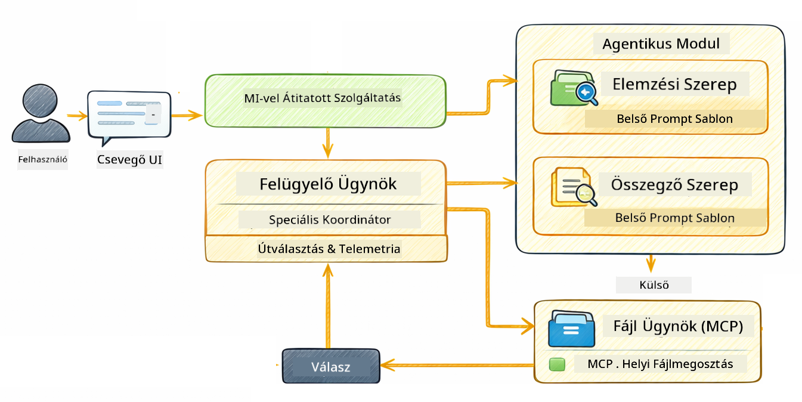

<!--
CO_OP_TRANSLATOR_METADATA:
{
  "original_hash": "f89f4c106d110e4943c055dd1a2f1dff",
  "translation_date": "2025-12-31T03:57:38+00:00",
  "source_file": "05-mcp/README.md",
  "language_code": "hu"
}
-->
# Modul 05: Model Context Protocol (MCP)

## Tartalomjegyzék

- [Mit fogsz megtanulni](../../../05-mcp)
- [Mi az MCP?](../../../05-mcp)
- [Hogyan működik az MCP](../../../05-mcp)
- [Az agentikus modul](../../../05-mcp)
- [A példák futtatása](../../../05-mcp)
  - [Előfeltételek](../../../05-mcp)
- [Gyors kezdés](../../../05-mcp)
  - [Fájlműveletek (Stdio)](../../../05-mcp)
  - [Supervisor Agent](../../../05-mcp)
    - [A kimenet megértése](../../../05-mcp)
    - [Az agentikus modul funkcióinak magyarázata](../../../05-mcp)
- [Kulcsfogalmak](../../../05-mcp)
- [Gratulálunk!](../../../05-mcp)
  - [Mi a következő lépés?](../../../05-mcp)

## Mit fogsz megtanulni

Elsajátítottad a beszélgetés-alapú MI építését, a promptolást, a válaszok dokumentumokhoz való igazítását és eszközökkel rendelkező ügynökök létrehozását. De ezek az eszközök mind egyedi alkalmazásodra voltak szabva. Mi lenne, ha az MI-nek hozzáférése lenne egy szabványos, bárki által létrehozható és megosztható eszközökkel teli ökoszisztémához? Ebben a modulban pontosan ezt tanulod meg a Model Context Protocol (MCP) és a LangChain4j agentikus modulja segítségével. Először bemutatunk egy egyszerű MCP fájlolvasót, majd megmutatjuk, hogyan illeszthető ez be könnyen fejlettebb agentikus munkafolyamatokba a Supervisor Agent mintával.

## Mi az MCP?

A Model Context Protocol (MCP) pontosan ezt nyújtja - egy szabványos módot arra, hogy MI-alkalmazások felfedezzék és használják a külső eszközöket. Egyedi integrációk írása helyett minden adatforráshoz vagy szolgáltatáshoz, kapcsolódhatsz MCP szerverekhez, amelyek következetes formátumban tárják fel képességeiket. Az MI ügynököd ezután automatikusan felfedezheti és használhatja ezeket az eszközöket.


*Az MCP előtt: bonyolult pont-pont integrációk. Az MCP után: egy protokoll, végtelen lehetőségek.*

Az MCP megold egy alapvető problémát az MI fejlesztésben: minden integráció egyedi. GitHub-hoz szeretnél hozzáférni? Egyedi kód. Fájlokat olvasnál? Egyedi kód. Adatbázist lekérdeznél? Egyedi kód. És egyik ilyen integráció sem működik más MI-alkalmazásokkal.

Az MCP ezt szabványosítja. Egy MCP szerver világosan leírt leírásokkal és sémákkal adja meg az eszközöket. Bármely MCP kliens csatlakozhat, felfedezheti a rendelkezésre álló eszközöket, és használhatja azokat. Egyszer építsd meg, bárhol használd.


*Model Context Protocol architektúra - szabványosított eszközfelfedezés és végrehajtás*

## Hogyan működik az MCP

**Szerver-kliens architektúra**

Az MCP kliens-szerver modellt használ. A szerverek eszközöket biztosítanak - fájlolvasás, adatbázis-lekérdezés, API-hívások. A kliensek (a te MI alkalmazásod) csatlakoznak a szerverekhez és használják az eszközeiket.

A LangChain4j-vel való használathoz add hozzá ezt a Maven függőséget:

```xml
<dependency>
    <groupId>dev.langchain4j</groupId>
    <artifactId>langchain4j-mcp</artifactId>
    <version>${langchain4j.version}</version>
</dependency>
```

**Eszközfelfedezés**

Amikor a kliensed csatlakozik egy MCP szerverhez, megkérdezi: "Milyen eszközeid vannak?" A szerver egy listát ad vissza a rendelkezésre álló eszközökről, mindegyikhez leírásokkal és paramétersémákkal. Az MI ügynököd ezután eldöntheti, mely eszközöket használja a felhasználói kérések alapján.

**Átvitel mechanizmusok**

Az MCP különböző átvitel mechanizmusokat támogat. Ez a modul a helyi folyamatokhoz használható Stdio átvitelt mutatja be:


*MCP átvitel mechanizmusok: HTTP távoli szerverekhez, Stdio helyi folyamatokhoz*

**Stdio** - [StdioTransportDemo.java](../../../05-mcp/src/main/java/com/example/langchain4j/mcp/StdioTransportDemo.java)

Helyi folyamatokhoz. Az alkalmazásod egy szervert indít alfolyamatként és a szabványos bemeneten/kimeneten keresztül kommunikál vele. Hasznos fájlrendszer-hozzáféréshez vagy parancssori eszközökhöz.

```java
McpTransport stdioTransport = new StdioMcpTransport.Builder()
    .command(List.of(
        npmCmd, "exec",
        "@modelcontextprotocol/server-filesystem@2025.12.18",
        resourcesDir
    ))
    .logEvents(false)
    .build();
```

> **🤖 Próbáld ki a [GitHub Copilot](https://github.com/features/copilot) Chat-tel:** Nyisd meg a [`StdioTransportDemo.java`](../../../05-mcp/src/main/java/com/example/langchain4j/mcp/StdioTransportDemo.java) fájlt és kérdezd:
> - "Hogyan működik a Stdio átvitel, és mikor érdemes HTTP helyett használni?"
> - "Hogyan kezeli a LangChain4j az indított MCP szerverfolyamatok életciklusát?"
> - "Milyen biztonsági következményei vannak annak, ha az MI-nek hozzáférést adunk a fájlrendszerhez?"

## Az agentikus modul

Míg az MCP szabványos eszközöket biztosít, a LangChain4j **agentikus modulja** deklaratív módot ad az olyan ügynökök felépítéséhez, amelyek ezen eszközöket összehangolják. Az `@Agent` annotáció és az `AgenticServices` lehetővé teszi, hogy interfészeken keresztül, imperatív kód írása helyett határozd meg az ügynök viselkedését.

Ebben a modulban megismerkedsz a **Supervisor Agent** mintával — egy fejlett agentikus MI megközelítéssel, ahol egy "supervisor" ügynök dinamikusan dönt arról, mely al-ügynököket hívja meg a felhasználói kérések alapján. Mindkét koncepciót kombináljuk azáltal, hogy egyik al-ügynökünk MCP-alapú fájlhozzáférést kap.

Az agentikus modul használatához add hozzá ezt a Maven függőséget:

```xml
<dependency>
    <groupId>dev.langchain4j</groupId>
    <artifactId>langchain4j-agentic</artifactId>
    <version>${langchain4j.mcp.version}</version>
</dependency>
```

> **⚠️ Kísérleti:** a `langchain4j-agentic` modul **kísérleti**, és változhat. A stabil mód AI asszisztensek építésére továbbra is a `langchain4j-core` egyedi eszközökkel (Modul 04).

## A példák futtatása

### Előfeltételek

- Java 21+, Maven 3.9+
- Node.js 16+ és npm (az MCP szerverekhez)
- Környezeti változók beállítva a `.env` fájlban (a gyökérkönyvtárból):
  - **A StdioTransportDemo-hoz:** `GITHUB_TOKEN` (GitHub Personal Access Token)
  - **A SupervisorAgentDemo-hoz:** `AZURE_OPENAI_ENDPOINT`, `AZURE_OPENAI_API_KEY`, `AZURE_OPENAI_DEPLOYMENT` (ugyanaz, mint a 01–04 modulokban)

> **Megjegyzés:** Ha még nem állítottad be a környezeti változókat, lásd a [Module 00 - Quick Start](../00-quick-start/README.md) útmutatót, vagy másold a `.env.example` fájlt `.env` néven a gyökérkönyvtárba és töltsd ki az értékeket.

## Gyors kezdés

**VS Code használata:** Egyszerűen kattints jobb gombbal bármely demo fájlra az Explorer-ben és válaszd a **"Run Java"** lehetőséget, vagy használd a Run and Debug panel indítási konfigurációit (győződj meg róla, hogy előbb hozzáadtad a tokened a `.env` fájlhoz).

**Maven használata:** Alternatívaként parancssorból is futtathatod az alábbi példákat.

### Fájlműveletek (Stdio)

Ez helyi, alfolyamat-alapú eszközöket demonstrál.

**✅ Nincs szükség előfeltételekre** - az MCP szerver automatikusan elindul.

**VS Code használata:** Kattints jobb gombbal a `StdioTransportDemo.java` fájlra és válaszd a **"Run Java"** lehetőséget.

**Maven használata:**

**Bash:**
```bash
export GITHUB_TOKEN=your_token_here
cd 05-mcp
mvn compile exec:java -Dexec.mainClass=com.example.langchain4j.mcp.StdioTransportDemo
```

**PowerShell:**
```powershell
$env:GITHUB_TOKEN=your_token_here
cd 05-mcp
mvn --% compile exec:java -Dexec.mainClass=com.example.langchain4j.mcp.StdioTransportDemo
```

Az alkalmazás automatikusan elindít egy fájlrendszer MCP szervert és beolvas egy helyi fájlt. Figyeld meg, hogyan kezelik helyetted az alfolyamat menedzsmentet.

**Várt kimenet:**
```
Assistant response: The file provides an overview of LangChain4j, an open-source Java library
for integrating Large Language Models (LLMs) into Java applications...
```

### Supervisor Agent




A **Supervisor Agent minta** egy **rugalmas** formája az agentikus MI-nek. A determinisztikus munkafolyamatokkal (sorrend, ciklus, párhuzamos) ellentétben a Supervisor egy LLM-et használ, hogy autonóm módon döntsön arról, mely ügynököket hívja meg a felhasználó kérésének alapján.

**Supervisor és MCP kombinálása:** Ebben a példában a `FileAgent` MCP alapú fájlrendszer-eszközökhöz kap hozzáférést a `toolProvider(mcpToolProvider)` beállítással. Amikor a felhasználó azt kéri, hogy "olvasson és elemezzen egy fájlt", a Supervisor elemezi a kérést és végrehajtási tervet generál. Ezután továbbítja a kérést a `FileAgent`-hez, amely az MCP `read_file` eszközét használja a tartalom lekéréséhez. A Supervisor ezt a tartalmat átadja az `AnalysisAgent`-nek értelmezésre, és opcionálisan meghívja a `SummaryAgent`-et az eredmények tömörítésére.

Ez megmutatja, hogyan illeszkednek az MCP eszközök zökkenőmentesen az agentikus munkafolyamatokba — a Supervisornak nem kell tudnia, hogy a fájlok hogyan kerülnek beolvasásra, csak azt, hogy a `FileAgent` képes ezt megtenni. A Supervisor dinamikusan alkalmazkodik a különböző típusú kérésekhez, és visszaadja vagy az utolsó ügynök válaszát, vagy az összes művelet összegzését.

**Ajánlott: indító script-ek használata**

Az indító script-ek automatikusan betöltik a környezeti változókat a gyökér `.env` fájlból:

**Bash:**
```bash
cd 05-mcp
chmod +x start.sh
./start.sh
```

**PowerShell:**
```powershell
cd 05-mcp
.\start.ps1
```

**VS Code használata:** Kattints jobb gombbal a `SupervisorAgentDemo.java` fájlra és válaszd a **"Run Java"** lehetőséget (győződj meg róla, hogy a `.env` fájl be van állítva).

**Hogyan működik a Supervisor:**

```java
// Határozzon meg több ügynököt konkrét képességekkel
FileAgent fileAgent = AgenticServices.agentBuilder(FileAgent.class)
        .chatModel(model)
        .toolProvider(mcpToolProvider)  // MCP eszközökkel rendelkezik fájlműveletekhez
        .build();

AnalysisAgent analysisAgent = AgenticServices.agentBuilder(AnalysisAgent.class)
        .chatModel(model)
        .build();

SummaryAgent summaryAgent = AgenticServices.agentBuilder(SummaryAgent.class)
        .chatModel(model)
        .build();

// Hozzon létre egy Felügyelőt, amely ezeket az ügynököket összehangolja
SupervisorAgent supervisor = AgenticServices.supervisorBuilder()
        .chatModel(model)  // A "tervező" modell
        .subAgents(fileAgent, analysisAgent, summaryAgent)
        .responseStrategy(SupervisorResponseStrategy.SUMMARY)
        .build();

// A Felügyelő önállóan dönt arról, mely ügynököket hívjon meg
// Egyszerűen adjon meg egy természetes nyelvű kérést - az LLM tervezi a végrehajtást
String response = supervisor.invoke("Read the file at /path/file.txt and analyze it");
```

Lásd a [SupervisorAgentDemo.java](../../../05-mcp/src/main/java/com/example/langchain4j/mcp/SupervisorAgentDemo.java) fájlt a teljes megvalósításhoz.

> **🤖 Próbáld ki a [GitHub Copilot](https://github.com/features/copilot) Chat-tel:** Nyisd meg a [`SupervisorAgentDemo.java`](../../../05-mcp/src/main/java/com/example/langchain4j/mcp/SupervisorAgentDemo.java) fájlt és kérdezd:
> - "Hogyan dönt a Supervisor arról, mely ügynököket hívja meg?"
> - "Mi a különbség a Supervisor és a Szekvenciális munkafolyamat minták között?"
> - "Hogyan testreszabhatom a Supervisor tervezési viselkedését?"

#### A kimenet megértése

Amikor lefuttatod a demót, strukturált bemutatót látsz arról, hogyan hangolja össze a Supervisor a több ügynök munkáját. Itt van, mit jelentenek az egyes részek:

```
======================================================================
  SUPERVISOR AGENT DEMO
======================================================================

This demo shows how a Supervisor Agent orchestrates multiple specialized agents.
The Supervisor uses an LLM to decide which agent to call based on the task.
```

**A fejléc** bemutatja a demót és elmagyarázza az alapvető koncepciót: a Supervisor egy LLM-et használ (nem keménykódolt szabályokat) annak eldöntésére, mely ügynököket hívja meg.

```
--- AVAILABLE AGENTS -------------------------------------------------
  [FILE]     FileAgent     - Reads files using MCP filesystem tools
  [ANALYZE]  AnalysisAgent - Analyzes content for structure, tone, and themes
  [SUMMARY]  SummaryAgent  - Creates concise summaries of content
```

**Elérhető ügynökök** megmutatja a három specializált ügynököt, közülük választhat a Supervisor. Minden ügynöknek specifikus képessége van:
- **FileAgent** képes fájlokat olvasni MCP eszközök segítségével (külső képesség)
- **AnalysisAgent** elemez tartalmakat (tiszta LLM képesség)
- **SummaryAgent** összegzéseket készít (tiszta LLM képesség)

```
--- USER REQUEST -----------------------------------------------------
  "Read the file at .../file.txt and analyze what it's about"
```

**Felhasználói kérés** mutatja, mit kértek. A Supervisornak ezt fel kell dolgoznia és el kell döntenie, mely ügynököket hívja meg.

```
--- SUPERVISOR ORCHESTRATION -----------------------------------------
  The Supervisor will now decide which agents to invoke and in what order...

  +-- STEP 1: Supervisor chose -> FileAgent (reading file via MCP)
  |
  |   Input: .../file.txt
  |
  |   Result: LangChain4j is an open-source Java library designed to simplify...
  +-- [OK] FileAgent (reading file via MCP) completed

  +-- STEP 2: Supervisor chose -> AnalysisAgent (analyzing content)
  |
  |   Input: LangChain4j is an open-source Java library...
  |
  |   Result: Structure: The content is organized into clear paragraphs that int...
  +-- [OK] AnalysisAgent (analyzing content) completed
```

**Supervisor orchestration** az a rész, ahol a varázslat történik. Figyeld meg, hogyan:
1. A Supervisor **először a FileAgent-et választotta**, mert a kérés említette a "fájl olvasását"
2. A FileAgent az MCP `read_file` eszközét használta a fájl tartalmának lekérésére
3. A Supervisor ezután **az AnalysisAgent-et választotta**, és átadta neki a fájl tartalmát
4. Az AnalysisAgent elemezte a struktúrát, hangvételt és témákat

Vedd észre, hogy a Supervisor ezeket a döntéseket **önállóan** hozta meg a felhasználói kérés alapján — nincs keménykódolt munkafolyamat!

**Végső válasz** a Supervisor szintetizált válasza, amely egyesíti az összes meghívott ügynök eredményét. A példa kiírja az agentikus scope-ot, megmutatva az összegzést és az egyes ügynökök által tárolt elemzési eredményeket.

```
--- FINAL RESPONSE ---------------------------------------------------
I read the contents of the file and analyzed its structure, tone, and key themes.
The file introduces LangChain4j as an open-source Java library for integrating
large language models...

--- AGENTIC SCOPE (Shared Memory) ------------------------------------
  Agents store their results in a shared scope for other agents to use:
  * summary: LangChain4j is an open-source Java library...
  * analysis: Structure: The content is organized into clear paragraphs that in...
```

### Az agentikus modul funkcióinak magyarázata

A példa több fejlett funkciót demonstrál az agentikus modulból. Nézzük meg közelebbről az Agentic Scope-ot és az Agent Listeners-t.

**Agentic Scope** mutatja a megosztott memóriát, ahol az ügynökök az eredményeiket tárolták `@Agent(outputKey="...")` segítségével. Ez lehetővé teszi:
- Hogy későbbi ügynökök hozzáférjenek korábbi ügynökök kimenetéhez
- Hogy a Supervisor egy végső választ szintetizáljon
- Hogy megtekinthesd, mit hozott létre minden egyes ügynök

```java
ResultWithAgenticScope<String> result = supervisor.invokeWithAgenticScope(request);
AgenticScope scope = result.agenticScope();
String story = scope.readState("story");
List<AgentInvocation> history = scope.agentInvocations("analysisAgent");
```

**Agent Listeners** lehetővé teszik az ügynökök végrehajtásának monitorozását és hibakeresését. A demóban látható lépésről-lépésre kimenet egy AgentListenerből származik, amely minden ügynök meghívásába beépül:
- **beforeAgentInvocation** - Meghívásra kerül, amikor a Supervisor kiválaszt egy ügynököt, így láthatod, melyik ügynököt választották és miért
- **afterAgentInvocation** - Meghívásra kerül, amikor egy ügynök befejeződik, és megmutatja az eredményét
- **inheritedBySubagents** - Ha igaz, a listener figyeli a hierarchiában lévő összes ügynököt is

```java
AgentListener monitor = new AgentListener() {
    private int step = 0;
    
    @Override
    public void beforeAgentInvocation(AgentRequest request) {
        step++;
        System.out.println("  +-- STEP " + step + ": " + request.agentName());
    }
    
    @Override
    public void afterAgentInvocation(AgentResponse response) {
        System.out.println("  +-- [OK] " + response.agentName() + " completed");
    }
    
    @Override
    public boolean inheritedBySubagents() {
        return true; // Terjessze az összes alügynökhöz
    }
};
```

A Supervisor mintán túl, a `langchain4j-agentic` modul számos erőteljes munkafolyamat-mintát és funkciót biztosít:

| Pattern | Description | Use Case |
|---------|-------------|----------|
| **Sequential** | Végrehajtja az ügynököket sorrendben, az egyik kimenete a következő bemenete | Csővezetékek: kutatás → elemzés → jelentés |
| **Parallel** | Egyidejűleg futtatja az ügynököket | Független feladatok: időjárás + hírek + részvények |
| **Loop** | Ismétel, amíg a feltétel teljesül | Minőségértékelés: finomítás, amíg a pontszám ≥ 0.8 |
| **Conditional** | Feltételek alapján irányítja a munkát | Osztályozás → továbbítás szakértő ügynökhöz |
| **Human-in-the-Loop** | Emberi ellenőrzőpontok hozzáadása | Jóváhagyási munkafolyamatok, tartalomellenőrzés |

## Kulcsfogalmak

**MCP** ideális, ha létező eszközök ökoszisztémáit szeretnéd kihasználni, olyan eszközöket építeni, amelyeket több alkalmazás megoszthat, harmadik fél szolgáltatásait szabványos protokollokkal integrálni, vagy eszközimplementációkat cserélni a kód módosítása nélkül.

**Az agentikus modul** akkor működik a legjobban, ha deklaratív ügynökdefiníciókat szeretnél `@Agent` annotációkkal, munkafolyamat-orchestrationre van szükséged (sorrend, ciklus, párhuzamos), interfész-alapú ügynöktervezést részesítesz előnyben az imperatív kóddal szemben, vagy több ügynök kombinálásával dolgozol, amelyek megosztott kimeneteket használnak `outputKey` segítségével.

**A Supervisor Agent minta** akkor kiváló, amikor a munkafolyamat előre nem kiszámítható és szeretnéd, hogy az LLM döntsön; amikor több specializált ügynököd van, amelyek dinamikus összehangolást igényelnek; amikor beszélgetés-alapú rendszereket építesz, amelyek különböző képességekhez irányítanak; vagy amikor a lehető leg rugalmasabb, adaptív ügynökviselkedést szeretnéd.

## Gratulálunk!

Sikeresen teljesítetted a LangChain4j for Beginners kurzust. Megtanultad:

- Hogyan építs beszélgetés-alapú MI-t memóriával (Modul 01)
- Prompt engineering mintákat különböző feladatokra (Modul 02)
- Hogyan igazítsd a válaszokat dokumentumokhoz RAG segítségével (Modul 03)
- Alapvető MI ügynökök (asszisztensek) létrehozását egyedi eszközökkel (Modul 04)
- Szabványos eszközök integrálása a LangChain4j MCP és Agentic modulokkal (Module 05)

### Mi következik?

A modulok elvégzése után tekintsd meg a [Tesztelési útmutatót](../docs/TESTING.md), hogy lásd a LangChain4j tesztelési koncepcióit működés közben.

**Hivatalos források:**
- [LangChain4j dokumentáció](https://docs.langchain4j.dev/) - Átfogó útmutatók és API referencia
- [LangChain4j GitHub](https://github.com/langchain4j/langchain4j) - Forráskód és példák
- [LangChain4j Oktatóanyagok](https://docs.langchain4j.dev/tutorials/) - Lépésről lépésre útmutatók különféle felhasználási esetekhez

Köszönjük, hogy elvégezted ezt a tanfolyamot!

---

**Navigáció:** [← Előző: Module 04 - Tools](../04-tools/README.md) | [Vissza a főoldalhoz](../README.md)

---

<!-- CO-OP TRANSLATOR DISCLAIMER START -->
Felelősségkizárás:
Ezt a dokumentumot az AI fordító szolgáltatás, a Co-op Translator (https://github.com/Azure/co-op-translator) segítségével fordítottuk. Bár törekszünk a pontosságra, kérjük, vegye figyelembe, hogy az automatikus fordítások hibákat vagy pontatlanságokat tartalmazhatnak. Az eredeti dokumentum az eredeti nyelvén tekintendő a hiteles forrásnak. Kritikus fontosságú információk esetén professzionális, emberi fordítást javaslunk. Nem vállalunk felelősséget az e fordítás használatából eredő félreértésekért vagy félreértelmezésekért.
<!-- CO-OP TRANSLATOR DISCLAIMER END -->