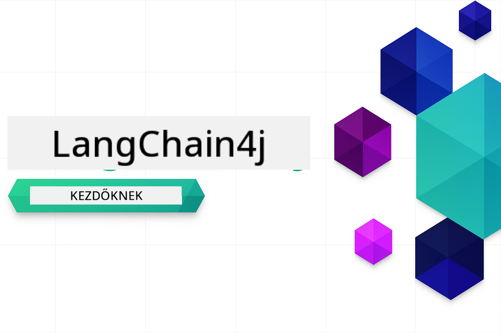

<!--
CO_OP_TRANSLATOR_METADATA:
{
  "original_hash": "69c7e2616c66df6cc296492fbfcad9ec",
  "translation_date": "2025-12-13T12:43:04+00:00",
  "source_file": "README.md",
  "language_code": "hu"
}
-->

# LangChain4j kezdőknek

Egy tanfolyam AI alkalmazások építéséhez LangChain4j-vel és Azure OpenAI GPT-5-tel, az alapvető csevegéstől az AI ügynökökig.

**Új vagy a LangChain4j-ben?** Nézd meg a [Szójegyzéket](docs/GLOSSARY.md) a kulcsfogalmak és kifejezések definícióiért.

## Tartalomjegyzék

1. [Gyors kezdés](00-quick-start/README.md) - Kezdj el dolgozni a LangChain4j-vel
2. [Bevezetés](01-introduction/README.md) - Ismerd meg a LangChain4j alapjait
3. [Prompt tervezés](02-prompt-engineering/README.md) - Sajátítsd el a hatékony prompt tervezést
4. [RAG (Retrieval-Augmented Generation)](03-rag/README.md) - Építs intelligens tudásalapú rendszereket
5. [Eszközök](04-tools/README.md) - Integrálj külső eszközöket és API-kat AI ügynökökkel
6. [MCP (Model Context Protocol)](05-mcp/README.md) - Dolgozz a Model Context Protocol-lal
---

## Tanulási útvonal

Kezdd a [Gyors kezdés](00-quick-start/README.md) modullal, majd haladj végig a modulokon lépésről lépésre, hogy fejleszd képességeidet. Alapvető példákat próbálhatsz ki az alapok megértéséhez, mielőtt mélyebben belemerülnél a [Bevezetés](01-introduction/README.md) modulba a GPT-5-tel.

A modulok elvégzése után fedezd fel a [Tesztelési útmutatót](docs/TESTING.md), hogy lásd a LangChain4j tesztelési koncepcióit működés közben.

> **Megjegyzés:** Ez a képzés mind GitHub Modelleket, mind Azure OpenAI-t használ. A [Gyors kezdés](00-quick-start/README.md) és [MCP](05-mcp/README.md) modulok GitHub Modelleket használnak (nem szükséges Azure előfizetés), míg az 1-4 modulok Azure OpenAI GPT-5-tel dolgoznak.

## Tanulás GitHub Copilottal

A gyors kódolás megkezdéséhez nyisd meg ezt a projektet egy GitHub Codespace-ben vagy a helyi IDE-dben a mellékelt devcontainerrel. A tanfolyamban használt devcontainer előre konfigurált GitHub Copilottal az AI páros programozáshoz.

Minden kódpélda tartalmaz javasolt kérdéseket, amelyeket feltehetsz a GitHub Copilotnak a mélyebb megértés érdekében. Keresd a 💡/🤖 jelzéseket a következőkben:

- **Java fájlfejlécek** - Az adott példához kapcsolódó kérdések
- **Modul README-k** - Felfedező kérdések a kódpéldák után

**Használati útmutató:** Nyiss meg bármilyen kód fájlt, és tedd fel a javasolt kérdéseket Copilotnak. Teljes kontextusa van a kódbázisról, képes magyarázni, bővíteni és alternatívákat javasolni.

Szeretnél többet megtudni? Nézd meg a [Copilot az AI páros programozáshoz](https://aka.ms/GitHubCopilotAI) oldalt.

## További források 

### LangChain

---

### Azure / Edge / MCP / Ügynökök

---
 
### Generatív AI sorozat

[-9333EA?style=for-the-badge&labelColor=E5E7EB&color=9333EA)](https://github.com/microsoft/Generative-AI-for-beginners-dotnet?WT.mc_id=academic-105485-koreyst)
[-C084FC?style=for-the-badge&labelColor=E5E7EB&color=C084FC)](https://github.com/microsoft/generative-ai-for-beginners-java?WT.mc_id=academic-105485-koreyst)
[-E879F9?style=for-the-badge&labelColor=E5E7EB&color=E879F9)](https://github.com/microsoft/generative-ai-with-javascript?WT.mc_id=academic-105485-koreyst)

---
 
### Alapvető tanulás

---
 
### Copilot sorozat

## Segítségkérés

Ha elakadsz vagy kérdésed van az AI alkalmazások építésével kapcsolatban, csatlakozz:

Ha termék visszajelzésed vagy hibák vannak az építés során, látogass el ide:

## Licenc

MIT licenc - Részletekért lásd a [LICENSE](../../LICENSE) fájlt.

---

<!-- CO-OP TRANSLATOR DISCLAIMER START -->
**Jogi nyilatkozat**:
Ezt a dokumentumot az AI fordító szolgáltatás, a [Co-op Translator](https://github.com/Azure/co-op-translator) segítségével fordítottuk le. Bár a pontosságra törekszünk, kérjük, vegye figyelembe, hogy az automatikus fordítások hibákat vagy pontatlanságokat tartalmazhatnak. Az eredeti dokumentum az anyanyelvén tekintendő hiteles forrásnak. Fontos információk esetén szakmai, emberi fordítást javaslunk. Nem vállalunk felelősséget a fordítás használatából eredő félreértésekért vagy félreértelmezésekért.
<!-- CO-OP TRANSLATOR DISCLAIMER END -->