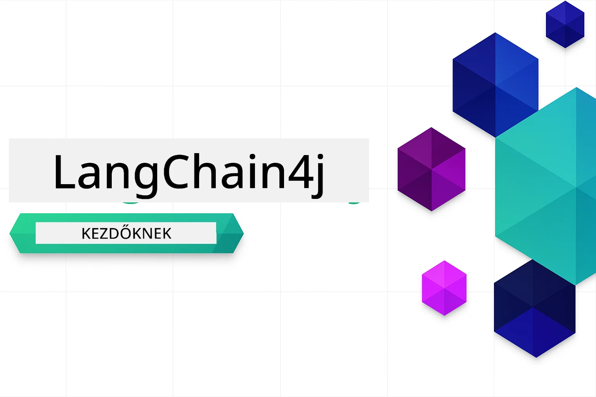

# LangChain4j kezdőknek

Tanfolyam AI alkalmazások építéséhez LangChain4j és Azure OpenAI GPT-5.2 használatával, az alapvető csevegéstől az AI ügynökökig.

### 🌐 Többnyelvű támogatás

#### GitHub Action segítségével támogatott (Automatizált és mindig naprakész)

<!-- CO-OP TRANSLATOR LANGUAGES TABLE START -->
[Arabic](../ar/README.md) | [Bengali](../bn/README.md) | [Bulgarian](../bg/README.md) | [Burmese (Myanmar)](../my/README.md) | [Chinese (Simplified)](../zh-CN/README.md) | [Chinese (Traditional, Hong Kong)](../zh-HK/README.md) | [Chinese (Traditional, Macau)](../zh-MO/README.md) | [Chinese (Traditional, Taiwan)](../zh-TW/README.md) | [Croatian](../hr/README.md) | [Czech](../cs/README.md) | [Danish](../da/README.md) | [Dutch](../nl/README.md) | [Estonian](../et/README.md) | [Finnish](../fi/README.md) | [French](../fr/README.md) | [German](../de/README.md) | [Greek](../el/README.md) | [Hebrew](../he/README.md) | [Hindi](../hi/README.md) | [Hungarian](./README.md) | [Indonesian](../id/README.md) | [Italian](../it/README.md) | [Japanese](../ja/README.md) | [Kannada](../kn/README.md) | [Khmer](../km/README.md) | [Korean](../ko/README.md) | [Lithuanian](../lt/README.md) | [Malay](../ms/README.md) | [Malayalam](../ml/README.md) | [Marathi](../mr/README.md) | [Nepali](../ne/README.md) | [Nigerian Pidgin](../pcm/README.md) | [Norwegian](../no/README.md) | [Persian (Farsi)](../fa/README.md) | [Polish](../pl/README.md) | [Portuguese (Brazil)](../pt-BR/README.md) | [Portuguese (Portugal)](../pt-PT/README.md) | [Punjabi (Gurmukhi)](../pa/README.md) | [Romanian](../ro/README.md) | [Russian](../ru/README.md) | [Serbian (Cyrillic)](../sr/README.md) | [Slovak](../sk/README.md) | [Slovenian](../sl/README.md) | [Spanish](../es/README.md) | [Swahili](../sw/README.md) | [Swedish](../sv/README.md) | [Tagalog (Filipino)](../tl/README.md) | [Tamil](../ta/README.md) | [Telugu](../te/README.md) | [Thai](../th/README.md) | [Turkish](../tr/README.md) | [Ukrainian](../uk/README.md) | [Urdu](../ur/README.md) | [Vietnamese](../vi/README.md)

> **Inkább helyileg klónoznál?**
>
> Ez a tároló több mint 50 nyelvi fordítást tartalmaz, ami jelentősen megnöveli a letöltési méretet. A fordítások nélküli klónozáshoz használd a sparse checkout-ot:
>
> **Bash / macOS / Linux:**
> ```bash
> git clone --filter=blob:none --sparse https://github.com/microsoft/LangChain4j-for-Beginners.git
> cd LangChain4j-for-Beginners
> git sparse-checkout set --no-cone '/*' '!translations' '!translated_images'
> ```
>
> **CMD (Windows):**
> ```cmd
> git clone --filter=blob:none --sparse https://github.com/microsoft/LangChain4j-for-Beginners.git
> cd LangChain4j-for-Beginners
> git sparse-checkout set --no-cone "/*" "!translations" "!translated_images"
> ```
>
> Ezzel minden szükséges fájlt megkapsz a tanfolyam elvégzéséhez sokkal gyorsabb letöltéssel.
<!-- CO-OP TRANSLATOR LANGUAGES TABLE END -->

## Tartalomjegyzék

1. [Bevezetés](01-introduction/README.md) - Ismerkedj meg a LangChain4j alapjaival
2. [Prompt tervezés](02-prompt-engineering/README.md) - Sajátítsd el a hatékony prompt tervezést
3. [RAG (Retrieval-Augmented Generation)](03-rag/README.md) - Építs intelligens tudásalapú rendszereket
4. [Eszközök](04-tools/README.md) - Integrálj külső eszközöket és egyszerű asszisztenseket
5. [MCP (Model Context Protocol)](05-mcp/README.md) - Dolgozz a Model Context Protocol (MCP) és az agenticus modulokkal

### Videós bemutatók

Minden modulhoz tartozik egy élő bemutató, ahol lépésről lépésre végigvezetünk a koncepciókon és a kódon.

| Modul | Videó |
|--------|-------|
| 01 - Bevezetés | [LangChain4j-vel való kezdés](https://www.youtube.com/live/nl_troDm8rQ) |
| 02 - Prompt tervezés | [Prompt tervezés LangChain4j-vel](https://www.youtube.com/live/PJ6aBaE6bog) |
| 03 - RAG | [RAG LangChain4j-vel](https://www.youtube.com/watch?v=_olq75ZH_eY) |
| 04 - Eszközök és 05 - MCP | [AI ügynökök eszközökkel és MCP-vel](https://www.youtube.com/watch?v=O_J30kZc0rw) |

---

## Tanulási útvonal

**Új vagy a LangChain4j-ben?** Nézd meg a [Szójegyzéket](docs/GLOSSARY.md) a kulcsfogalmak és kifejezések magyarázatáért.

> **Gyors kezdés**

1. Forkold ezt a tárolót a GitHub fiókodba
2. Kattints a **Code** → **Codespaces** fülre → **...** → **Új opciókkal...**
3. Használd az alapértelmezetteket – ez kiválasztja a tanfolyamhoz készült fejlesztői konténert
4. Kattints a **Codespace létrehozása** gombra
5. Várj 5-10 percet, amíg az környezet készen áll
6. Ugorj közvetlenül a [Bevezetéshez](./01-introduction/README.md) és kezdj neki!

A modulok teljesítése után fedezd fel a [Tesztelési útmutatót](docs/TESTING.md), hogy lásd a LangChain4j tesztelési koncepcióit működés közben.

> **Megjegyzés:** Ez a képzés Azure OpenAI-t használ. Ha még nincs, kezdj egy [INGYENES Azure fiókkal](https://aka.ms/azure-free-account).


## Tanulás GitHub Copilottal

Gyors kódolásindításhoz nyisd meg ezt a projektet GitHub Codespace-ben vagy helyi fejlesztői környezetben az ehhez a tanfolyamhoz biztosított devcontainer segítségével. A tanfolyamban használt devcontainer előre konfigurálva tartalmazza a GitHub Copilot-ot AI társprogramozáshoz.

Minden kódpéldához tartoznak ajánlott kérdések, amelyeket feltehetsz a GitHub Copilot-nak, hogy mélyítsd a megértésed. Keress a 💡/🤖 jelöléseket:

- **Java fájlfejlécekben** - Példánként specifikus kérdések
- **Modul README-kben** - Feltáró kérdések a kódrészletek után

**Használat:** Nyiss meg egy kódfájlt és tedd fel a javasolt kérdéseket a Copilot-nak. Teljes rálátása van a kódbázisra, így magyarázni, kiegészíteni és alternatívákat javasolni képes.

Szeretnél többet megtudni? Olvasd el a [Copilot AI társprogramozáshoz](https://aka.ms/GitHubCopilotAI) oldalt.


## További források

<!-- CO-OP TRANSLATOR OTHER COURSES START -->
### LangChain
[](https://aka.ms/langchain4j-for-beginners)
[](https://aka.ms/langchainjs-for-beginners?WT.mc_id=m365-94501-dwahlin)
[](https://github.com/microsoft/langchain-for-beginners?WT.mc_id=m365-94501-dwahlin)
---

### Azure / Edge / MCP / Ügynökök
[](https://github.com/microsoft/AZD-for-beginners?WT.mc_id=academic-105485-koreyst)
[](https://github.com/microsoft/edgeai-for-beginners?WT.mc_id=academic-105485-koreyst)
[](https://github.com/microsoft/mcp-for-beginners?WT.mc_id=academic-105485-koreyst)
[](https://github.com/microsoft/ai-agents-for-beginners?WT.mc_id=academic-105485-koreyst)

---
 
### Generatív AI sorozat
[](https://github.com/microsoft/generative-ai-for-beginners?WT.mc_id=academic-105485-koreyst)
[-9333EA?style=for-the-badge&labelColor=E5E7EB&color=9333EA)](https://github.com/microsoft/Generative-AI-for-beginners-dotnet?WT.mc_id=academic-105485-koreyst)
[-C084FC?style=for-the-badge&labelColor=E5E7EB&color=C084FC)](https://github.com/microsoft/generative-ai-for-beginners-java?WT.mc_id=academic-105485-koreyst)
[-E879F9?style=for-the-badge&labelColor=E5E7EB&color=E879F9)](https://github.com/microsoft/generative-ai-with-javascript?WT.mc_id=academic-105485-koreyst)

---
 
### Alapvető tananyag
[](https://aka.ms/ml-beginners?WT.mc_id=academic-105485-koreyst)
[](https://aka.ms/datascience-beginners?WT.mc_id=academic-105485-koreyst)
[](https://aka.ms/ai-beginners?WT.mc_id=academic-105485-koreyst)
[](https://github.com/microsoft/Security-101?WT.mc_id=academic-96948-sayoung)

[](https://aka.ms/webdev-beginners?WT.mc_id=academic-105485-koreyst)
[](https://aka.ms/iot-beginners?WT.mc_id=academic-105485-koreyst)
[](https://github.com/microsoft/xr-development-for-beginners?WT.mc_id=academic-105485-koreyst)

---
 
### Copilot sorozat
[](https://aka.ms/GitHubCopilotAI?WT.mc_id=academic-105485-koreyst)
[](https://github.com/microsoft/mastering-github-copilot-for-dotnet-csharp-developers?WT.mc_id=academic-105485-koreyst)
[](https://github.com/microsoft/CopilotAdventures?WT.mc_id=academic-105485-koreyst)
<!-- CO-OP TRANSLATOR OTHER COURSES END -->

## Segítségkérés

Ha elakadnál vagy bármilyen kérdésed van az AI alkalmazások fejlesztésével kapcsolatban, csatlakozz:

[](https://aka.ms/foundry/discord)

Ha visszajelzésed van a termékről vagy hibákat tapasztalsz fejlesztés közben, látogass el ide:

[](https://aka.ms/foundry/forum)

## Licenc

MIT Licenc - Részletek a [LICENSE](../../LICENSE) fájlban találhatók.

---

<!-- CO-OP TRANSLATOR DISCLAIMER START -->
**Jogi nyilatkozat**:
Ez a dokumentum az AI fordítási szolgáltatás, a [Co-op Translator](https://github.com/Azure/co-op-translator) segítségével készült. Bár az pontosságra törekszünk, kérjük, vegye figyelembe, hogy az automatikus fordítások hibákat vagy pontatlanságokat tartalmazhatnak. Az eredeti dokumentum az anyanyelvén tekintendő hiteles forrásnak. Fontos információk esetén professzionális emberi fordítást javasolunk. Nem vállalunk felelősséget semmilyen félreértésért vagy téves értelmezésért, amely ebből a fordításból ered.
<!-- CO-OP TRANSLATOR DISCLAIMER END -->