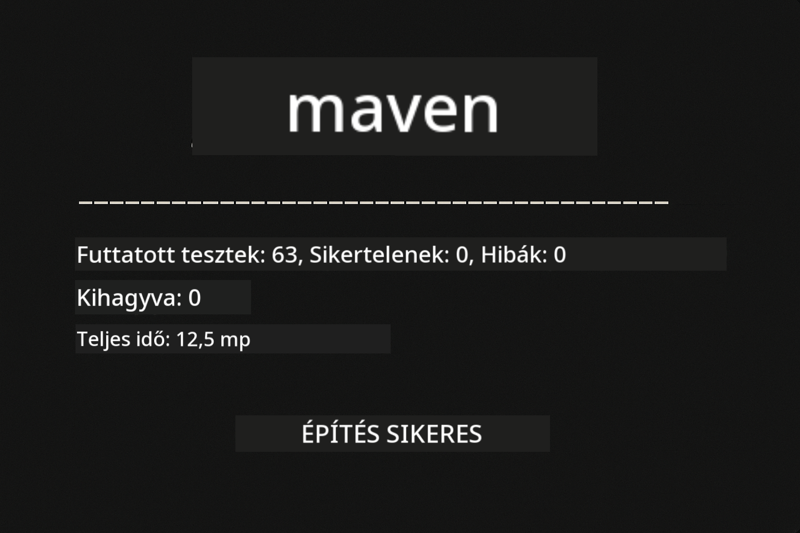
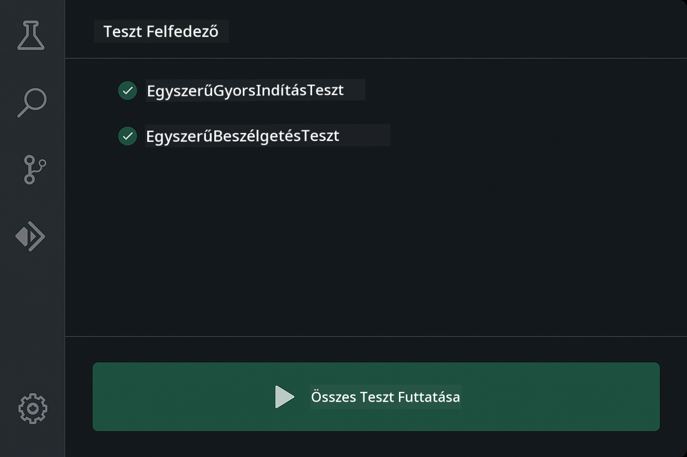
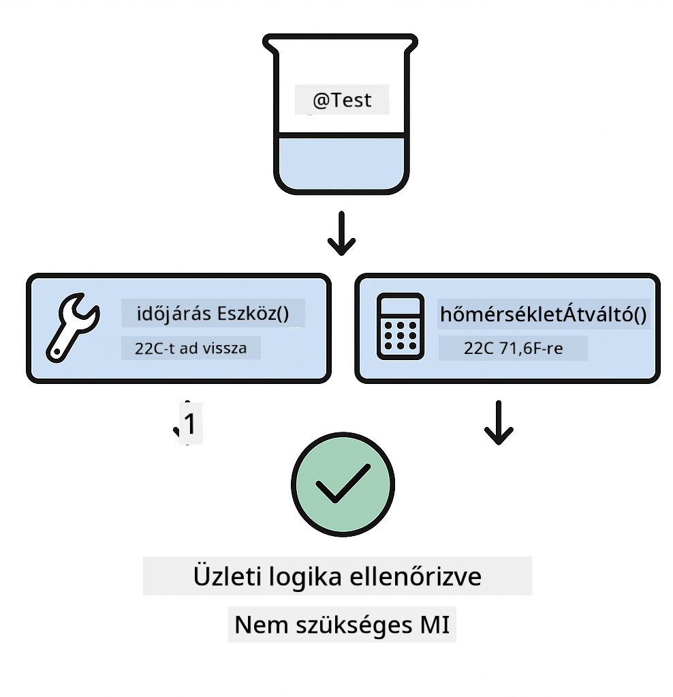
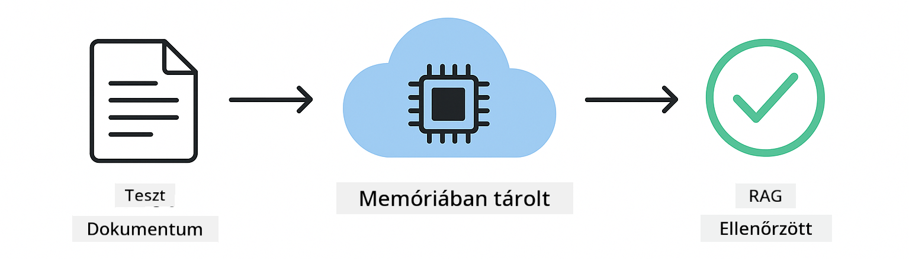

<!--
CO_OP_TRANSLATOR_METADATA:
{
  "original_hash": "b975537560c404d5f254331832811e78",
  "translation_date": "2025-12-13T21:18:59+00:00",
  "source_file": "docs/TESTING.md",
  "language_code": "hu"
}
-->
# LangChain4j alkalmazások tesztelése

## Tartalomjegyzék

- [Gyors kezdés](../../../docs)
- [Mit fednek le a tesztek](../../../docs)
- [A tesztek futtatása](../../../docs)
- [Tesztek futtatása VS Code-ban](../../../docs)
- [Tesztelési minták](../../../docs)
- [Tesztelési filozófia](../../../docs)
- [Következő lépések](../../../docs)

Ez az útmutató végigvezet a teszteken, amelyek bemutatják, hogyan lehet AI alkalmazásokat tesztelni API kulcsok vagy külső szolgáltatások nélkül.

## Gyors kezdés

Futtasd az összes tesztet egyetlen parancs segítségével:

**Bash:**
```bash
mvn test
```

**PowerShell:**
```powershell
mvn --% test
```



*Sikeres tesztfuttatás, amely minden tesztet hibátlanul lefuttat*

## Mit fednek le a tesztek

Ez a tanfolyam a **unit tesztekre** fókuszál, amelyek helyileg futnak. Minden teszt egy adott LangChain4j koncepciót mutat be elszigetelten.


*Tesztelési piramis, amely bemutatja az egységtesztek (gyors, elszigetelt), integrációs tesztek (valódi komponensek) és end-to-end tesztek (teljes rendszer Dockerrel) arányát. Ez a képzés az egységtesztelést fedi le.*

| Modul | Tesztek | Fókusz | Fő fájlok |
|--------|-------|-------|-----------|
| **00 - Gyors kezdés** | 6 | Prompt sablonok és változóhelyettesítés | `SimpleQuickStartTest.java` |
| **01 - Bevezetés** | 8 | Beszélgetés memória és állapotfüggő chat | `SimpleConversationTest.java` |
| **02 - Prompt mérnökség** | 12 | GPT-5 minták, lelkesedési szintek, strukturált kimenet | `SimpleGpt5PromptTest.java` |
| **03 - RAG** | 10 | Dokumentum feldolgozás, beágyazások, hasonlóság keresés | `DocumentServiceTest.java` |
| **04 - Eszközök** | 12 | Függvényhívás és eszközláncolás | `SimpleToolsTest.java` |
| **05 - MCP** | 15 | Model Context Protocol Dockerrel | `SimpleMcpTest.java`, `McpDockerTransportTest.java` |

## A tesztek futtatása

**Futtasd az összes tesztet a gyökérből:**

**Bash:**
```bash
mvn test
```

**PowerShell:**
```powershell
mvn --% test
```

**Futtass teszteket egy adott modulra:**

**Bash:**
```bash
cd 01-introduction && mvn test
# Vagy a gyökérből
mvn test -pl 01-introduction
```

**PowerShell:**
```powershell
cd 01-introduction; mvn --% test
# Vagy a gyökérből
mvn --% test -pl 01-introduction
```

**Futtass egyetlen tesztosztályt:**

**Bash:**
```bash
mvn test -Dtest=SimpleConversationTest
```

**PowerShell:**
```powershell
mvn --% test -Dtest=SimpleConversationTest
```

**Futtass egy adott tesztmetódust:**

**Bash:**
```bash
mvn test -Dtest=SimpleConversationTest#meg kell őrizni a beszélgetés előzményeit
```

**PowerShell:**
```powershell
mvn --% test -Dtest=SimpleConversationTest#meg kell őrizni a beszélgetés előzményeit
```

## Tesztek futtatása VS Code-ban

Ha Visual Studio Code-ot használsz, a Test Explorer grafikus felületet biztosít a tesztek futtatásához és hibakereséséhez.



*VS Code Teszt Explorer, amely megjeleníti a tesztfát az összes Java tesztosztállyal és egyedi tesztmetódussal*

**Tesztek futtatása VS Code-ban:**

1. Nyisd meg a Test Explorert az Activity Bar-ban található lombik ikonra kattintva
2. Bontsd ki a tesztfát, hogy lásd az összes modult és tesztosztályt
3. Kattints a lejátszás gombra bármelyik tesztnél az egyedi futtatáshoz
4. Kattints a "Run All Tests" gombra az egész tesztcsomag futtatásához
5. Jobb klikk bármelyik teszten, majd válaszd a "Debug Test" opciót a töréspontok beállításához és a kód lépésenkénti végrehajtásához

A Test Explorer zöld pipákat mutat a sikeres teszteknél, és részletes hibajelentéseket ad, ha egy teszt megbukik.

## Tesztelési minták


*Hat tesztelési minta LangChain4j alkalmazásokhoz: prompt sablonok, modellek mockolása, beszélgetés izoláció, eszközök tesztelése, memóriabeli RAG, és Docker integráció*

### Minta 1: Prompt sablonok tesztelése

A legegyszerűbb minta a prompt sablonokat teszteli AI modell hívása nélkül. Ellenőrzöd, hogy a változóhelyettesítés helyesen működik-e, és a promptok a várt formátumban vannak-e.


*Prompt sablon tesztelés, amely bemutatja a változóhelyettesítés folyamatát: sablon helyőrzőkkel → értékek alkalmazva → formázott kimenet ellenőrizve*

```java
@Test
@DisplayName("Should format prompt template with variables")
void testPromptTemplateFormatting() {
    PromptTemplate template = PromptTemplate.from(
        "Best time to visit {{destination}} for {{activity}}?"
    );
    
    Prompt prompt = template.apply(Map.of(
        "destination", "Paris",
        "activity", "sightseeing"
    ));
    
    assertThat(prompt.text()).isEqualTo("Best time to visit Paris for sightseeing?");
}
```

Ez a teszt a `00-quick-start/src/test/java/com/example/langchain4j/quickstart/SimpleQuickStartTest.java` fájlban található.

**Futtasd:**

**Bash:**
```bash
cd 00-quick-start && mvn test -Dtest=SimpleQuickStartTest#tesztPromptSablonFormázás
```

**PowerShell:**
```powershell
cd 00-quick-start; mvn --% test -Dtest=SimpleQuickStartTest#tesztPromptSablonFormázás
```

### Minta 2: Nyelvi modellek mockolása

Beszélgetés logika tesztelésekor használd a Mockito-t hamis modellek létrehozásához, amelyek előre meghatározott válaszokat adnak. Ez gyors, ingyenes és determinisztikus teszteket eredményez.


*Összehasonlítás, amely bemutatja, miért előnyösek a mockok teszteléshez: gyorsak, ingyenesek, determinisztikusak és nem igényelnek API kulcsokat*

```java
@ExtendWith(MockitoExtension.class)
class SimpleConversationTest {
    
    private ConversationService conversationService;
    
    @Mock
    private OpenAiOfficialChatModel mockChatModel;
    
    @BeforeEach
    void setUp() {
        ChatResponse mockResponse = ChatResponse.builder()
            .aiMessage(AiMessage.from("This is a test response"))
            .build();
        when(mockChatModel.chat(anyList())).thenReturn(mockResponse);
        
        conversationService = new ConversationService(mockChatModel);
    }
    
    @Test
    void shouldMaintainConversationHistory() {
        String conversationId = conversationService.startConversation();
        
        ChatResponse mockResponse1 = ChatResponse.builder()
            .aiMessage(AiMessage.from("Response 1"))
            .build();
        ChatResponse mockResponse2 = ChatResponse.builder()
            .aiMessage(AiMessage.from("Response 2"))
            .build();
        ChatResponse mockResponse3 = ChatResponse.builder()
            .aiMessage(AiMessage.from("Response 3"))
            .build();
        
        when(mockChatModel.chat(anyList()))
            .thenReturn(mockResponse1)
            .thenReturn(mockResponse2)
            .thenReturn(mockResponse3);

        conversationService.chat(conversationId, "First message");
        conversationService.chat(conversationId, "Second message");
        conversationService.chat(conversationId, "Third message");

        List<ChatMessage> history = conversationService.getHistory(conversationId);
        assertThat(history).hasSize(6); // 3 felhasználói + 3 MI üzenet
    }
}
```

Ez a minta a `01-introduction/src/test/java/com/example/langchain4j/service/SimpleConversationTest.java` fájlban található. A mock biztosítja az állandó viselkedést, így ellenőrizheted, hogy a memória kezelés helyesen működik.

### Minta 3: Beszélgetés izoláció tesztelése

A beszélgetés memóriának meg kell tartania a felhasználók elkülönítését. Ez a teszt ellenőrzi, hogy a beszélgetések nem keverik a kontextusokat.


*Beszélgetés izoláció tesztelése, amely külön memóriatárolókat mutat be a különböző felhasználók számára a kontextus keveredésének megakadályozására*

```java
@Test
void shouldIsolateConversationsByid() {
    String conv1 = conversationService.startConversation();
    String conv2 = conversationService.startConversation();
    
    ChatResponse mockResponse = ChatResponse.builder()
        .aiMessage(AiMessage.from("Response"))
        .build();
    when(mockChatModel.chat(anyList())).thenReturn(mockResponse);

    conversationService.chat(conv1, "Message for conversation 1");
    conversationService.chat(conv2, "Message for conversation 2");

    List<ChatMessage> history1 = conversationService.getHistory(conv1);
    List<ChatMessage> history2 = conversationService.getHistory(conv2);
    
    assertThat(history1).hasSize(2);
    assertThat(history2).hasSize(2);
}
```

Minden beszélgetés saját, független előzményt tart fenn. Éles rendszerekben ez az izoláció kritikus a többfelhasználós alkalmazásokhoz.

### Minta 4: Eszközök önálló tesztelése

Az eszközök olyan függvények, amelyeket az AI hívhat. Teszteld őket közvetlenül, hogy biztosítsd a helyes működést az AI döntéseitől függetlenül.



*Eszközök önálló tesztelése, amely bemutatja a mock eszköz végrehajtást AI hívás nélkül az üzleti logika ellenőrzésére*

```java
@Test
void shouldConvertCelsiusToFahrenheit() {
    TemperatureTool tempTool = new TemperatureTool();
    String result = tempTool.celsiusToFahrenheit(25.0);
    assertThat(result).containsPattern("77[.,]0°F");
}

@Test
void shouldDemonstrateToolChaining() {
    WeatherTool weatherTool = new WeatherTool();
    TemperatureTool tempTool = new TemperatureTool();

    String weatherResult = weatherTool.getCurrentWeather("Seattle");
    assertThat(weatherResult).containsPattern("\\d+°C");

    String conversionResult = tempTool.celsiusToFahrenheit(22.0);
    assertThat(conversionResult).containsPattern("71[.,]6°F");
}
```

Ezek a tesztek a `04-tools/src/test/java/com/example/langchain4j/agents/tools/SimpleToolsTest.java` fájlból valók, és az eszközlogikát validálják AI bevonása nélkül. A láncolás példa megmutatja, hogyan táplálja az egyik eszköz kimenete a másik bemenetét.

### Minta 5: Memóriabeli RAG tesztelés

A RAG rendszerek hagyományosan vektor adatbázisokat és beágyazási szolgáltatásokat igényelnek. A memóriabeli minta lehetővé teszi az egész folyamat tesztelését külső függőségek nélkül.



*Memóriabeli RAG tesztelési munkafolyamat, amely bemutatja a dokumentum feldolgozást, beágyazás tárolást és hasonlóság keresést adatbázis nélkül*

```java
@Test
void testProcessTextDocument() {
    String content = "This is a test document.\nIt has multiple lines.";
    InputStream inputStream = new ByteArrayInputStream(content.getBytes(StandardCharsets.UTF_8));
    
    DocumentService.ProcessedDocument result = 
        documentService.processDocument(inputStream, "test.txt");

    assertNotNull(result);
    assertTrue(result.segments().size() > 0);
    assertEquals("test.txt", result.segments().get(0).metadata().getString("filename"));
}
```

Ez a teszt a `03-rag/src/test/java/com/example/langchain4j/rag/service/DocumentServiceTest.java` fájlból származik, és memóriában hoz létre dokumentumot, ellenőrizve a darabolást és metaadat kezelést.

### Minta 6: Integrációs tesztelés Dockerrel

Néhány funkció valódi infrastruktúrát igényel. Az MCP modul Testcontainers-t használ Docker konténerek indításához integrációs tesztekhez. Ezek ellenőrzik, hogy a kód valódi szolgáltatásokkal működik, miközben megőrzik a tesztek izolációját.


*MCP integrációs tesztelés Testcontainers-szel, amely bemutatja az automatizált konténer életciklust: indítás, teszt futtatás, leállítás és takarítás*

A `05-mcp/src/test/java/com/example/langchain4j/mcp/McpDockerTransportTest.java` tesztekhez futó Docker szükséges.

**Futtasd őket:**

**Bash:**
```bash
cd 05-mcp && mvn test
```

**PowerShell:**
```powershell
cd 05-mcp; mvn --% test
```

## Tesztelési filozófia

A kódodat teszteld, ne az AI-t. A teszteknek a megírt kódot kell validálniuk azáltal, hogy ellenőrzik, hogyan épülnek fel a promptok, hogyan kezelik a memóriát, és hogyan hajtódnak végre az eszközök. Az AI válaszai változóak, és nem szabad, hogy a teszt állítások részei legyenek. Kérdezd meg magadtól, hogy a prompt sablon helyesen helyettesíti-e a változókat, ne azt, hogy az AI adja-e a helyes választ.

Használj mockokat a nyelvi modellekhez. Ezek külső függőségek, amelyek lassúak, drágák és nem determinisztikusak. A mockolás gyors teszteket eredményez milliszekundumok alatt másodpercek helyett, ingyenes, API költségek nélkül, és determinisztikus, mindig ugyanazt az eredményt adja.

Tartsd a teszteket függetlennek. Minden teszt állítsa be a saját adatait, ne függjön más tesztektől, és takarítson maga után. A teszteknek függetlenül a futási sorrendtől sikeresen kell lefutniuk.

Tesztelj szélsőséges eseteket a "boldog út" mellett. Próbálj ki üres bemeneteket, nagyon nagy bemeneteket, speciális karaktereket, érvénytelen paramétereket és határértékeket. Ezek gyakran fednek fel hibákat, amelyeket a normál használat nem mutat ki.

Használj leíró neveket. Hasonlítsd össze a `shouldMaintainConversationHistoryAcrossMultipleMessages()` és a `test1()` neveket. Az első pontosan megmondja, mit tesztel, megkönnyítve a hibakeresést.

## Következő lépések

Most, hogy érted a tesztelési mintákat, mélyedj el minden modulban:

- **[00 - Gyors kezdés](../00-quick-start/README.md)** - Kezdd a prompt sablon alapokkal
- **[01 - Bevezetés](../01-introduction/README.md)** - Tanuld meg a beszélgetés memória kezelését
- **[02 - Prompt mérnökség](../02-prompt-engineering/README.md)** - Sajátítsd el a GPT-5 prompt mintákat
- **[03 - RAG](../03-rag/README.md)** - Építs lekérdezés-alapú generálási rendszereket
- **[04 - Eszközök](../04-tools/README.md)** - Valósítsd meg a függvényhívást és eszközláncokat
- **[05 - MCP](../05-mcp/README.md)** - Integráld a Model Context Protocolt Dockerrel

Minden modul README-je részletes magyarázatokat ad az itt tesztelt koncepciókról.

---

**Navigáció:** [← Vissza a főoldalra](../README.md)

---

<!-- CO-OP TRANSLATOR DISCLAIMER START -->
**Jogi nyilatkozat**:
Ezt a dokumentumot az AI fordító szolgáltatás, a [Co-op Translator](https://github.com/Azure/co-op-translator) segítségével fordítottuk le. Bár a pontosságra törekszünk, kérjük, vegye figyelembe, hogy az automatikus fordítások hibákat vagy pontatlanságokat tartalmazhatnak. Az eredeti dokumentum az anyanyelvén tekintendő hiteles forrásnak. Fontos információk esetén professzionális emberi fordítást javaslunk. Nem vállalunk felelősséget a fordítás használatából eredő félreértésekért vagy félreértelmezésekért.
<!-- CO-OP TRANSLATOR DISCLAIMER END -->