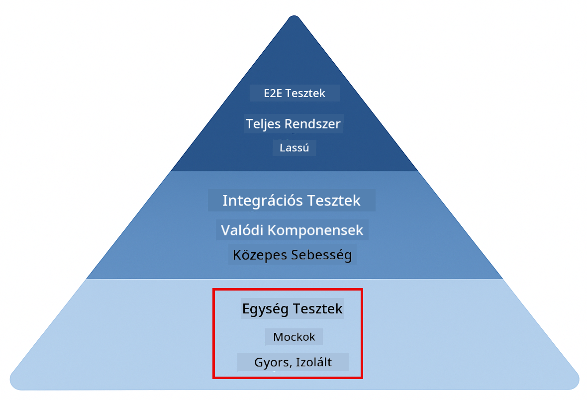
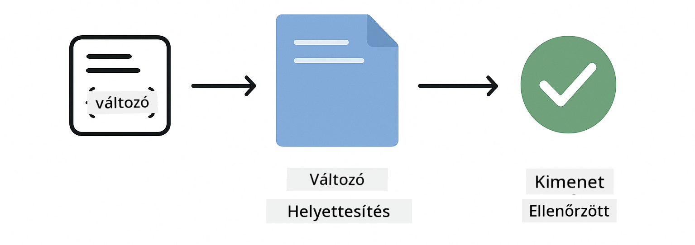
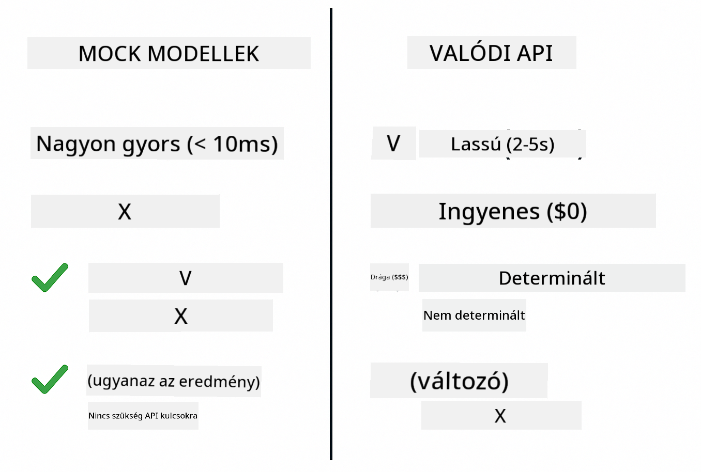
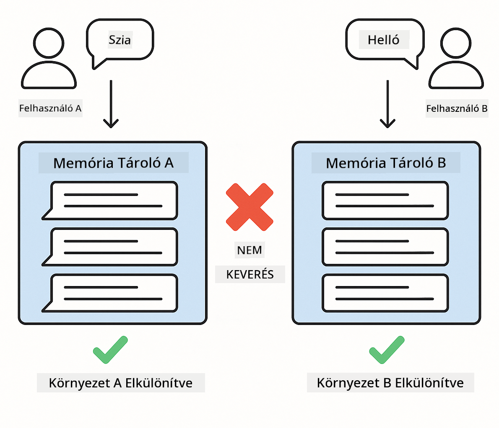

<!--
CO_OP_TRANSLATOR_METADATA:
{
  "original_hash": "ed93b3c14d58734ac10162967da958c1",
  "translation_date": "2025-12-31T04:07:39+00:00",
  "source_file": "docs/TESTING.md",
  "language_code": "hu"
}
-->
# LangChain4j alkalmazások tesztelése

## Tartalomjegyzék

- [Gyors kezdés](../../../docs)
- [Mit fednek le a tesztek](../../../docs)
- [A tesztek futtatása](../../../docs)
- [Tesztek futtatása VS Code-ban](../../../docs)
- [Tesztelési minták](../../../docs)
- [Tesztelési filozófia](../../../docs)
- [Következő lépések](../../../docs)

Ez az útmutató végigvezeti a teszteken, amelyek bemutatják, hogyan lehet AI-alkalmazásokat tesztelni API-kulcsok vagy külső szolgáltatások nélkül.

## Gyors kezdés

A teljes tesztcsomagot egyetlen parancs kiadásával futtathatod:

**Bash:**
```bash
mvn test
```

**PowerShell:**
```powershell
mvn --% test
```


*Sikeres tesztfuttatás, minden teszt sikeresen lefutott, hibák nélkül*

## Mit fednek le a tesztek

Ez a kurzus a helyben futó, **egységtesztekre** koncentrál. Minden teszt egy-egy LangChain4j-koncepciót mutat be izolált módon.



*A tesztelési piramis bemutatja az egyensúlyt az egységtesztek (gyors, izolált), integrációs tesztek (valódi komponensek) és end-to-end tesztek között. Ez a képzés az egységtesztelést fedi le.*

| Modul | Tesztek | Fókusz | Fő fájlok |
|--------|-------|-------|-----------|
| **00 - Gyors kezdés** | 6 | Prompt sablonok és változók behelyettesítése | `SimpleQuickStartTest.java` |
| **01 - Bevezetés** | 8 | Beszélgetések memóriája és állapotalapú chat | `SimpleConversationTest.java` |
| **02 - Prompt tervezés** | 12 | GPT-5 minták, lelkesedési szintek, strukturált kimenet | `SimpleGpt5PromptTest.java` |
| **03 - RAG** | 10 | Dokumentumfeldolgozás, beágyazások, hasonlóságalapú keresés | `DocumentServiceTest.java` |
| **04 - Eszközök** | 12 | Függvényhívás és eszközláncolás | `SimpleToolsTest.java` |
| **05 - MCP** | 8 | Model Context Protocol Stdio szállítással | `SimpleMcpTest.java` |

## A tesztek futtatása

**Futtasd az összes tesztet a projekt gyökérkönyvtárából:**

**Bash:**
```bash
mvn test
```

**PowerShell:**
```powershell
mvn --% test
```

**Egy adott modul tesztjeinek futtatása:**

**Bash:**
```bash
cd 01-introduction && mvn test
# Vagy root felhasználóként
mvn test -pl 01-introduction
```

**PowerShell:**
```powershell
cd 01-introduction; mvn --% test
# Vagy a gyökérkönyvtárból
mvn --% test -pl 01-introduction
```

**Egyetlen tesztosztály futtatása:**

**Bash:**
```bash
mvn test -Dtest=SimpleConversationTest
```

**PowerShell:**
```powershell
mvn --% test -Dtest=SimpleConversationTest
```

**Egy adott tesztmetódus futtatása:**

**Bash:**
```bash
mvn test -Dtest=SimpleConversationTest#meg kellene tartani a beszélgetés előzményeit
```

**PowerShell:**
```powershell
mvn --% test -Dtest=SimpleConversationTest#kellene megőrizni a beszélgetés előzményeit
```

## Tesztek futtatása VS Code-ban

Ha Visual Studio Code-ot használsz, a Test Explorer grafikus felületet biztosít a tesztek futtatásához és hibakereséséhez.


*A VS Code Tesztböngésző a tesztek fáját mutatja az összes Java tesztosztállyal és egyes tesztmetódusokkal*

**Tesztek futtatása VS Code-ban:**

1. Nyisd meg a Test Explorert az Activity Bar-ban található lombik ikonra kattintva
2. Bontsd ki a tesztfát, hogy lásd az összes modult és tesztosztályt
3. Kattints a lejátszás gombra bármelyik teszt mellett, hogy egyedileg futtasd
4. Kattints a "Run All Tests"-re az egész tesztcsomag futtatásához
5. Kattints jobb gombbal bármelyik tesztre, és válaszd a "Debug Test"-et a töréspontok beállításához és a kód lépésenkénti végrehajtásához

A Test Explorer zöld pipa ikonokat mutat a sikeres tesztek mellett, és részletes hibajelentéseket ad, ha a tesztek megbuknak.

## Tesztelési minták

### Minta 1: Prompt sablonok tesztelése

A legegyszerűbb minta a prompt sablonok tesztelése AI-modell meghívása nélkül. Ellenőrzöd, hogy a változók behelyettesítése helyes, és a promptok a várt formátumban jelennek meg.



*A prompt sablonok tesztelését bemutató ábra: sablon helykitöltőkkel → értékek alkalmazása → formázott kimenet ellenőrzése*

```java
@Test
@DisplayName("Should format prompt template with variables")
void testPromptTemplateFormatting() {
    PromptTemplate template = PromptTemplate.from(
        "Best time to visit {{destination}} for {{activity}}?"
    );
    
    Prompt prompt = template.apply(Map.of(
        "destination", "Paris",
        "activity", "sightseeing"
    ));
    
    assertThat(prompt.text()).isEqualTo("Best time to visit Paris for sightseeing?");
}
```

This test lives in `00-quick-start/src/test/java/com/example/langchain4j/quickstart/SimpleQuickStartTest.java`.

**Futtasd:**

**Bash:**
```bash
cd 00-quick-start && mvn test -Dtest=SimpleQuickStartTest#prompt sablon formázásának tesztelése
```

**PowerShell:**
```powershell
cd 00-quick-start; mvn --% test -Dtest=SimpleQuickStartTest#prompt sablon formázásának tesztelése
```

### Minta 2: Nyelvi modellek mockolása

A beszélgetés logikájának tesztelésekor használd a Mockito-t hamis modellek létrehozására, amelyek előre meghatározott válaszokat adnak. Ezáltal a tesztek gyorsak, ingyenesek és determinisztikusak lesznek.



*Összehasonlítás, ami megmutatja, miért kedveltek a mockok a tesztelésben: gyorsak, ingyenesek, determinisztikusak és nem igényelnek API-kulcsokat*

```java
@ExtendWith(MockitoExtension.class)
class SimpleConversationTest {
    
    private ConversationService conversationService;
    
    @Mock
    private OpenAiOfficialChatModel mockChatModel;
    
    @BeforeEach
    void setUp() {
        ChatResponse mockResponse = ChatResponse.builder()
            .aiMessage(AiMessage.from("This is a test response"))
            .build();
        when(mockChatModel.chat(anyList())).thenReturn(mockResponse);
        
        conversationService = new ConversationService(mockChatModel);
    }
    
    @Test
    void shouldMaintainConversationHistory() {
        String conversationId = conversationService.startConversation();
        
        ChatResponse mockResponse1 = ChatResponse.builder()
            .aiMessage(AiMessage.from("Response 1"))
            .build();
        ChatResponse mockResponse2 = ChatResponse.builder()
            .aiMessage(AiMessage.from("Response 2"))
            .build();
        ChatResponse mockResponse3 = ChatResponse.builder()
            .aiMessage(AiMessage.from("Response 3"))
            .build();
        
        when(mockChatModel.chat(anyList()))
            .thenReturn(mockResponse1)
            .thenReturn(mockResponse2)
            .thenReturn(mockResponse3);

        conversationService.chat(conversationId, "First message");
        conversationService.chat(conversationId, "Second message");
        conversationService.chat(conversationId, "Third message");

        List<ChatMessage> history = conversationService.getHistory(conversationId);
        assertThat(history).hasSize(6); // 3 felhasználó + 3 MI-üzenet
    }
}
```

Ez a minta megtalálható a `01-introduction/src/test/java/com/example/langchain4j/service/SimpleConversationTest.java` fájlban. A mock biztosítja az állandó viselkedést, így ellenőrizheted, hogy a memória-kezelés helyesen működik-e.

### Minta 3: Beszélgetések izolációjának tesztelése

A beszélgetések memóriájának külön kell tartania a több felhasználót. Ez a teszt ellenőrzi, hogy a beszélgetések nem keverik össze a kontextusokat.



*A beszélgetési izoláció tesztelése: külön memóriatárolók különböző felhasználók számára a kontextus összekeveredésének megakadályozására*

```java
@Test
void shouldIsolateConversationsByid() {
    String conv1 = conversationService.startConversation();
    String conv2 = conversationService.startConversation();
    
    ChatResponse mockResponse = ChatResponse.builder()
        .aiMessage(AiMessage.from("Response"))
        .build();
    when(mockChatModel.chat(anyList())).thenReturn(mockResponse);

    conversationService.chat(conv1, "Message for conversation 1");
    conversationService.chat(conv2, "Message for conversation 2");

    List<ChatMessage> history1 = conversationService.getHistory(conv1);
    List<ChatMessage> history2 = conversationService.getHistory(conv2);
    
    assertThat(history1).hasSize(2);
    assertThat(history2).hasSize(2);
}
```

Minden beszélgetés saját, független előzményeket őriz. Termelési rendszerekben ez az izoláció kritikus a többfelhasználós alkalmazásoknál.

### Minta 4: Eszközök önálló tesztelése

Az eszközök olyan függvények, amelyeket az AI meghívhat. Teszteld őket közvetlenül, hogy biztosítsd működésüket függetlenül az AI döntéseitől.


*Eszközök önálló tesztelését bemutató ábra: mock eszköz végrehajtás AI-hívások nélkül az üzleti logika ellenőrzéséhez*

```java
@Test
void shouldConvertCelsiusToFahrenheit() {
    TemperatureTool tempTool = new TemperatureTool();
    String result = tempTool.celsiusToFahrenheit(25.0);
    assertThat(result).containsPattern("77[.,]0°F");
}

@Test
void shouldDemonstrateToolChaining() {
    WeatherTool weatherTool = new WeatherTool();
    TemperatureTool tempTool = new TemperatureTool();

    String weatherResult = weatherTool.getCurrentWeather("Seattle");
    assertThat(weatherResult).containsPattern("\\d+°C");

    String conversionResult = tempTool.celsiusToFahrenheit(22.0);
    assertThat(conversionResult).containsPattern("71[.,]6°F");
}
```

Ezek a tesztek a `04-tools/src/test/java/com/example/langchain4j/agents/tools/SimpleToolsTest.java` fájlból érvényesítik az eszközlogikát AI részvétel nélkül. A láncolási példa bemutatja, hogyan lesz az egyik eszköz kimenete a másik bemenete.

### Minta 5: Memóriában történő RAG tesztelés

A RAG-rendszerek hagyományosan vektoralapú adatbázisokat és embedding szolgáltatásokat igényelnek. A memóriában történő minta lehetővé teszi az egész pipeline tesztelését külső függőségek nélkül.


*Memóriában történő RAG tesztelési munkafolyamat: dokumentumfeldolgozás, embedding tárolás és hasonlóságkeresés adatbázis nélkül*

```java
@Test
void testProcessTextDocument() {
    String content = "This is a test document.\nIt has multiple lines.";
    InputStream inputStream = new ByteArrayInputStream(content.getBytes(StandardCharsets.UTF_8));
    
    DocumentService.ProcessedDocument result = 
        documentService.processDocument(inputStream, "test.txt");

    assertNotNull(result);
    assertTrue(result.segments().size() > 0);
    assertEquals("test.txt", result.segments().get(0).metadata().getString("filename"));
}
```

Ez a teszt a `03-rag/src/test/java/com/example/langchain4j/rag/service/DocumentServiceTest.java` fájlból memóriában létrehoz egy dokumentumot, és ellenőrzi a felbontást (chunking) és a metaadatkezelést.

### Minta 6: MCP integrációs tesztelés

Az MCP modul a Model Context Protocol integrációját teszteli stdio szállítással. Ezek a tesztek ellenőrzik, hogy az alkalmazás képes-e MCP szervereket induló folyamatként létrehozni és velük kommunikálni.

A `05-mcp/src/test/java/com/example/langchain4j/mcp/SimpleMcpTest.java` tesztek az MCP kliens viselkedését érvényesítik.

**Futtasd őket:**

**Bash:**
```bash
cd 05-mcp && mvn test
```

**PowerShell:**
```powershell
cd 05-mcp; mvn --% test
```

## Tesztelési filozófia

A kódodat teszteld, ne az AI-t. A teszteknek a te írt kódodat kell érvényesíteniük azáltal, hogy ellenőrzik például, hogyan épülnek fel a promptok, hogyan kezelődik a memória és hogyan hajtódnak végre az eszközök. Az AI válaszai változóak, és nem szabad, hogy részei legyenek a tesztállításoknak. Kérdezd meg magadtól, hogy a prompt sablon helyesen helyettesíti-e be a változókat, ne azt, hogy az AI ad-e helyes választ.

Használj mockokat a nyelvi modellekhez. Ezek külső függőségek, amelyek lassúak, költségesek és nem determinisztikusak. A mockolás gyors teszteket eredményez (milliszekundumok másodpercek helyett), ingyenes megoldást API-költségek nélkül, és determinisztikus, ismételhető eredményeket.

Tartsd a teszteket függetlennek. Minden teszt állítsa elő a saját adatait, ne függjön más tesztektől, és takarítson fel maga után. A teszteknek függetlenül a végrehajtás sorrendjétől is sikeresnek kell lenniük.

Teszteld a szélső eseteket a boldog útvonalon túl. Próbálj üres bemeneteket, nagyon nagy bemeneteket, speciális karaktereket, érvénytelen paramétereket és határfeltételeket. Ezek gyakran olyan hibákat fednek fel, amelyeket a normál használat nem mutatna ki.

Használj leíró neveket. Hasonlítsd össze a `shouldMaintainConversationHistoryAcrossMultipleMessages()`-t a `test1()`-gyel. Az első pontosan megmondja, mi van tesztelve, így a hibakeresés sokkal egyszerűbb.

## Következő lépések

Most, hogy megérted a tesztelési mintákat, mélyedj el minden egyes modulban:

- **[00 - Gyors kezdés](../00-quick-start/README.md)** - Kezdd a prompt sablonok alapjaival
- **[01 - Bevezetés](../01-introduction/README.md)** - Ismerkedj meg a beszélgetések memóriakezelésével
- **[02 - Prompt tervezés](../02-prompt-engineering/README.md)** - Sajátítsd el a GPT-5 promptolási mintákat
- **[03 - RAG](../03-rag/README.md)** - Építs keresés által kiegészített generáló rendszereket
- **[04 - Eszközök](../04-tools/README.md)** - Valósíts meg függvényhívásokat és eszközláncokat
- **[05 - MCP](../05-mcp/README.md)** - Integráld a Model Context Protocolt

Minden modul README fájlja részletes magyarázatokat ad az itt tesztelt koncepciókról.

---

**Navigáció:** [← Vissza a főoldalra](../README.md)

---

<!-- CO-OP TRANSLATOR DISCLAIMER START -->
Felelősségkizárás:
Ezt a dokumentumot az AI fordító szolgáltatás, a Co-op Translator (https://github.com/Azure/co-op-translator) segítségével fordítottuk. Bár törekszünk a pontosságra, kérjük, vegye figyelembe, hogy az automatikus fordítások hibákat vagy pontatlanságokat tartalmazhatnak. A dokumentum eredeti, anyanyelvi változatát tekintendő hiteles forrásnak. Kritikus információk esetén javasolt professzionális, emberi fordítást igénybe venni. Nem vállalunk felelősséget a fordítás használatából eredő félreértésekért vagy téves értelmezésekért.
<!-- CO-OP TRANSLATOR DISCLAIMER END -->