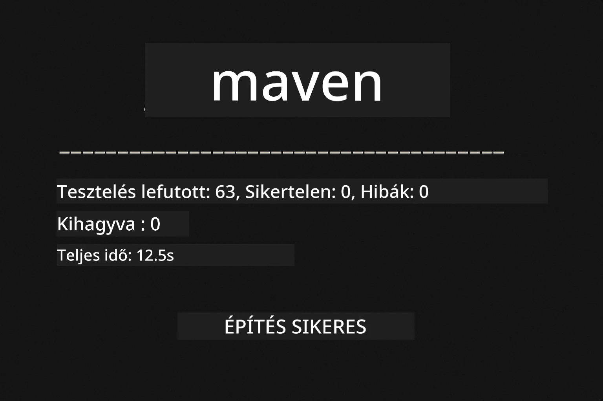
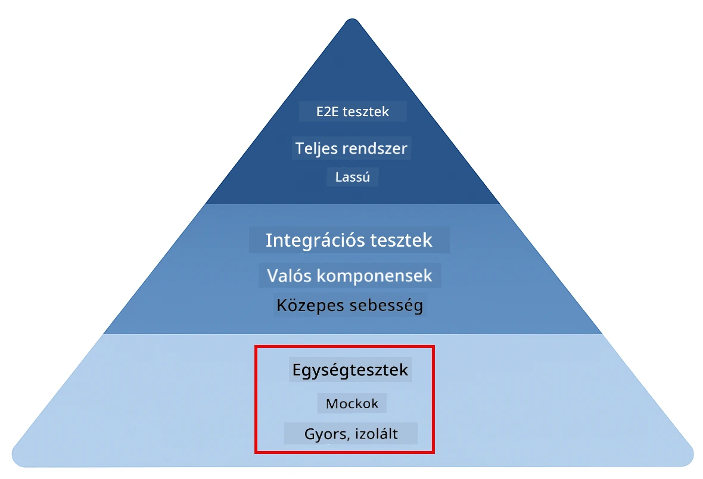
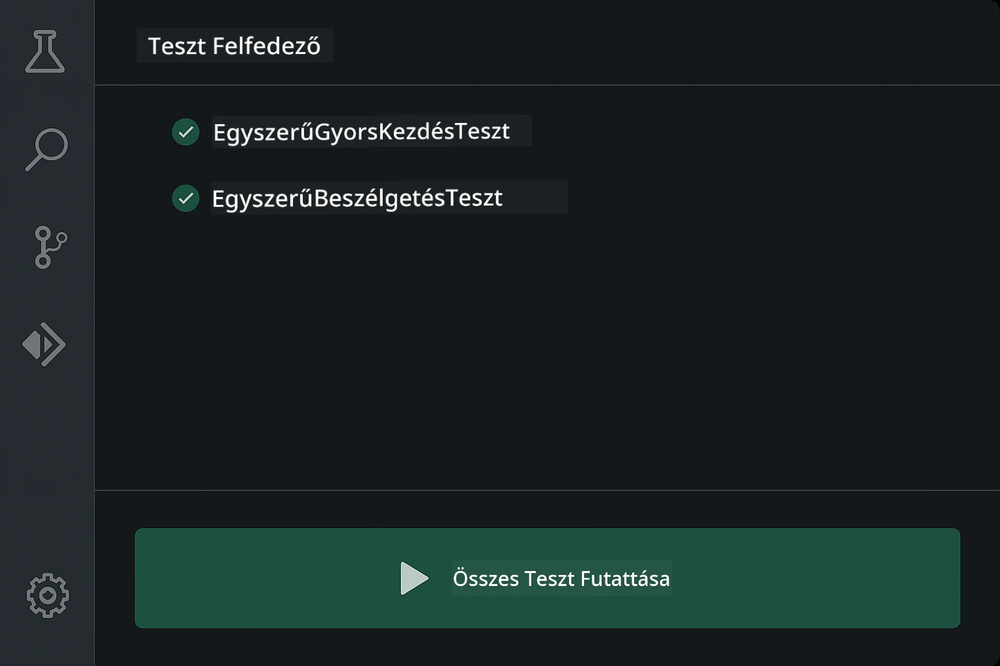
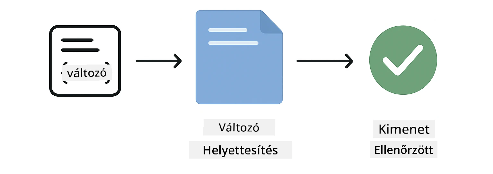
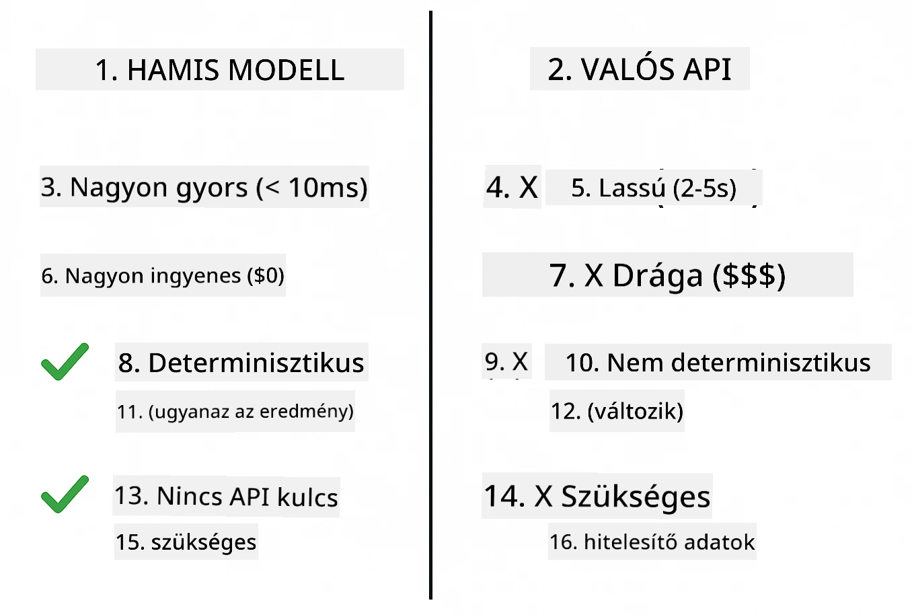
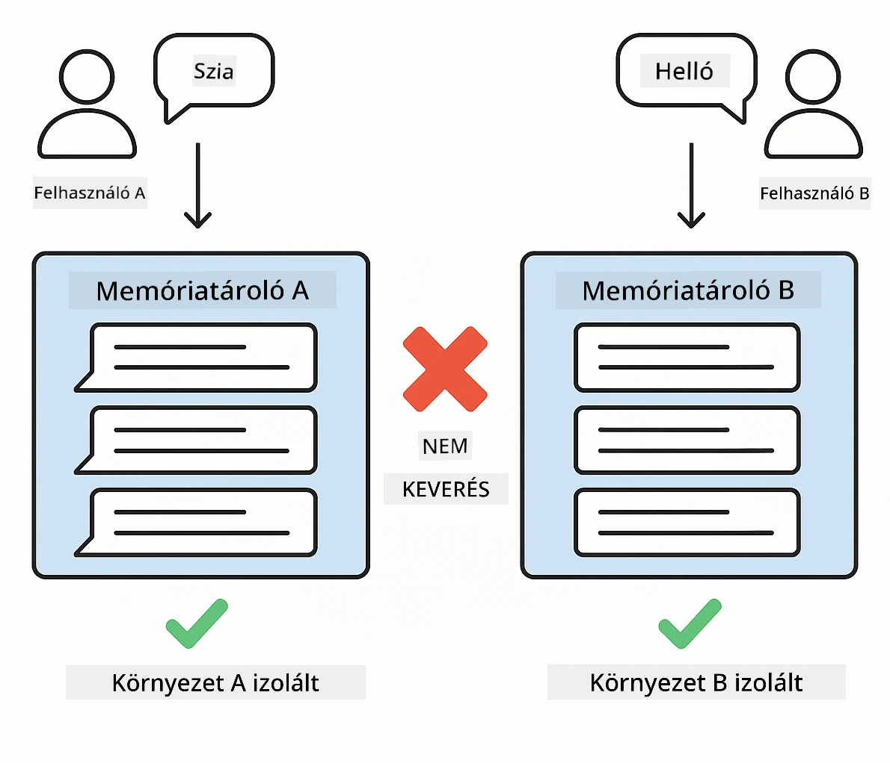
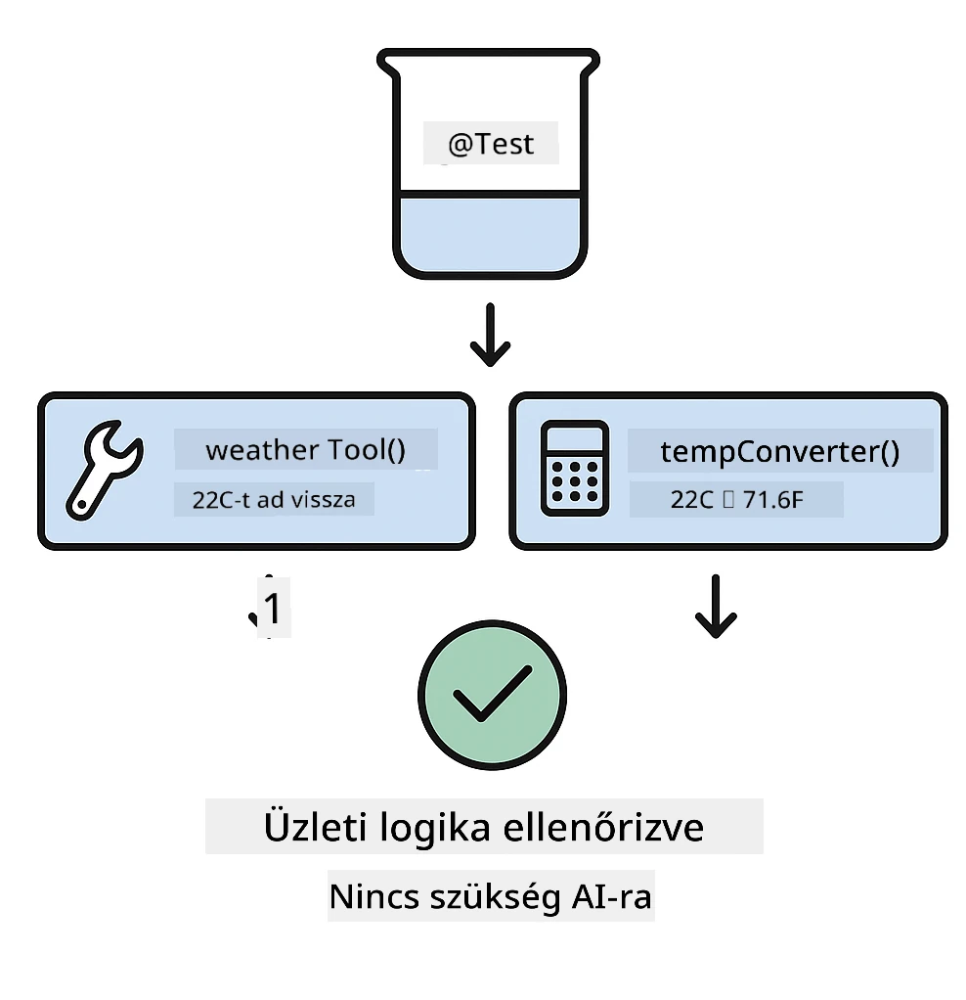
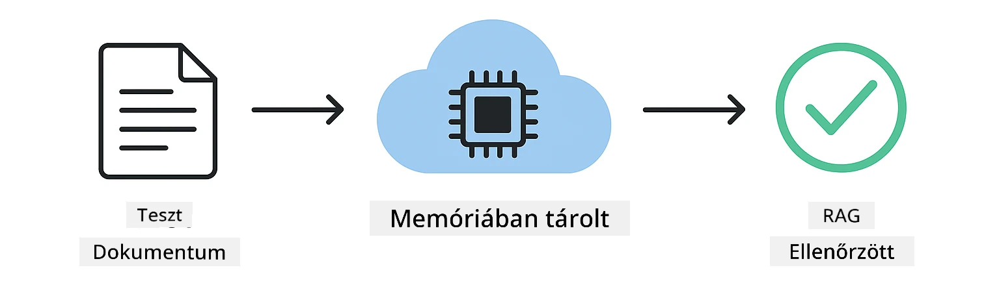

# LangChain4j Alkalmazások Tesztelése

## Tartalomjegyzék

- [Gyors Kezdés](#gyors-kezdés)
- [Mit Fednek Le a Tesztek](#mit-fednek-le-a-tesztek)
- [Tesztek Futtatása](#tesztek-futtatása)
- [Tesztek Futtatása VS Code-ban](#tesztek-futtatása-vs-code-ban)
- [Tesztelési Minták](#tesztelési-minták)
- [Tesztelési Filozófia](#tesztelési-filozófia)
- [Következő Lépések](#következő-lépések)

Ez az útmutató végigvezet a teszteken, amelyek bemutatják, hogyan lehet AI alkalmazásokat tesztelni API-kulcsok vagy külső szolgáltatások nélkül.

## Gyors Kezdés

Futtass minden tesztet egyetlen parancssal:

**Bash:**
```bash
mvn test
```

**PowerShell:**
```powershell
mvn --% test
```

Ha minden teszt sikeresen lefut, a következő képernyőképhez hasonló kimenetet látsz — a tesztek eredménye nulla hiba.



*Sikeres tesztfuttatás, amelyen minden teszt hibamentesen átmegy*

## Mit Fednek Le a Tesztek

Ez a kurzus elsősorban **unit tesztekre** fókuszál, amelyeket helyben futtatunk. Minden teszt egy adott LangChain4j koncepciót mutat be izoláltan. Az alábbi tesztpiramis megmutatja, hova illeszkednek az unit tesztek — ezek alkotják a gyors, megbízható alapot, amelyre a további tesztstratégia épül.



*Tesztelési piramis, amely az unit tesztek (gyors, izolált), integrációs tesztek (valós komponensek) és end-to-end tesztek közötti egyensúlyt ábrázolja. Ez a képzés az unit tesztelést fedi.*

| Modul | Tesztek | Fókusz | Kulcsfájlok |
|--------|-------|-------|-----------|
| **01 - Bevezetés** | 8 | Beszélgetés memóriája és állapotfüggő chat | `SimpleConversationTest.java` |
| **02 - Prompt Tervezés** | 12 | GPT-5.2 minták, lelkesedési szintek, strukturált kimenet | `SimpleGpt5PromptTest.java` |
| **03 - RAG** | 10 | Dokumentum feldolgozás, beágyazások, hasonlóság keresés | `DocumentServiceTest.java` |
| **04 - Eszközök** | 12 | Függvényhívás és eszköz láncolás | `SimpleToolsTest.java` |
| **05 - MCP** | 8 | Model Context Protocol stdio transzporttal | `SimpleMcpTest.java` |

## Tesztek Futtatása

**Minden teszt futtatása a gyökérből:**

**Bash:**
```bash
mvn test
```

**PowerShell:**
```powershell
mvn --% test
```

**Egy adott modul tesztjeinek futtatása:**

**Bash:**
```bash
cd 01-introduction && mvn test
# Vagy a gyökérből
mvn test -pl 01-introduction
```

**PowerShell:**
```powershell
cd 01-introduction; mvn --% test
# Vagy a gyökérből
mvn --% test -pl 01-introduction
```

**Egyetlen tesztosztály futtatása:**

**Bash:**
```bash
mvn test -Dtest=SimpleConversationTest
```

**PowerShell:**
```powershell
mvn --% test -Dtest=SimpleConversationTest
```

**Egy adott tesztmetódus futtatása:**

**Bash:**
```bash
mvn test -Dtest=SimpleConversationTest#meg kell tartani a beszélgetés előzményeit
```

**PowerShell:**
```powershell
mvn --% test -Dtest=SimpleConversationTest#meg kell tartani a beszélgetés előzményeit
```

## Tesztek Futtatása VS Code-ban

Ha Visual Studio Code-ot használsz, a Test Explorer grafikus felületet biztosít a tesztek futtatásához és hibakereséséhez.



*VS Code Test Explorer, amely mutatja a tesztfát az összes Java tesztosztállyal és az egyéni tesztmetódusokkal*

**Tesztek futtatása VS Code-ban:**

1. Nyisd meg a Test Explorert az Activity Bar-ban lévő lombik ikonra kattintva
2. Bontsd ki a tesztfát, hogy lásd az összes modult és tesztosztályt
3. Kattints bármelyik teszthez tartozó lejátszás gombra, hogy azt egyedileg futtasd
4. Kattints a „Run All Tests” gombra az egész tesztcsomag futtatásához
5. Jobb klikk bármely teszt fölött, majd válaszd a „Debug Test” menüpontot a töréspontok beállításához és lépésenkénti futtatáshoz

A Test Explorer zöld pipát mutat a sikeres tesztek mellett és részletes hibajelentést ad, ha egy teszt kudarcot vall.

## Tesztelési Minták

### Minta 1: Prompt Sablonok Tesztelése

A legegyszerűbb minta a prompt sablonokat teszteli AI modell hívása nélkül. Ellenőrzöd, hogy a változó helyettesítés helyesen működik-e és a promptok a várt formában készülnek el.



*Prompt sablon tesztelése változó helyettesítés folyamatával: sablon helyőrzőkkel → értékek alkalmazva → formázott kimenet ellenőrizve*

```java
@Test
@DisplayName("Should format prompt template with variables")
void testPromptTemplateFormatting() {
    PromptTemplate template = PromptTemplate.from(
        "Best time to visit {{destination}} for {{activity}}?"
    );
    
    Prompt prompt = template.apply(Map.of(
        "destination", "Paris",
        "activity", "sightseeing"
    ));
    
    assertThat(prompt.text()).isEqualTo("Best time to visit Paris for sightseeing?");
}
```

Ez a minta ellenőrzi a változó helyettesítést és hogy a promptok a várakozásoknak megfelelően formázottak — nem szükséges API kulcs vagy modell hívás.

### Minta 2: Nyelvi Modellek "Mock"-olása

Beszélgetési logika teszteléskor használj Mockito-t hamis modellek létrehozására, amelyek előre meghatározott válaszokat adnak. Ezáltal a tesztek gyorsak, ingyenesek és determinisztikusak lesznek.



*Összehasonlítás, ami megmutatja, miért előnyösebb a mock az API teszteléshez: gyors, ingyenes, determinisztikus és nem igényel API kulcsokat*

```java
@ExtendWith(MockitoExtension.class)
class SimpleConversationTest {
    
    private ConversationService conversationService;
    
    @Mock
    private OpenAiOfficialChatModel mockChatModel;
    
    @BeforeEach
    void setUp() {
        ChatResponse mockResponse = ChatResponse.builder()
            .aiMessage(AiMessage.from("This is a test response"))
            .build();
        when(mockChatModel.chat(anyList())).thenReturn(mockResponse);
        
        conversationService = new ConversationService(mockChatModel);
    }
    
    @Test
    void shouldMaintainConversationHistory() {
        String conversationId = conversationService.startConversation();
        
        ChatResponse mockResponse1 = ChatResponse.builder()
            .aiMessage(AiMessage.from("Response 1"))
            .build();
        ChatResponse mockResponse2 = ChatResponse.builder()
            .aiMessage(AiMessage.from("Response 2"))
            .build();
        ChatResponse mockResponse3 = ChatResponse.builder()
            .aiMessage(AiMessage.from("Response 3"))
            .build();
        
        when(mockChatModel.chat(anyList()))
            .thenReturn(mockResponse1)
            .thenReturn(mockResponse2)
            .thenReturn(mockResponse3);

        conversationService.chat(conversationId, "First message");
        conversationService.chat(conversationId, "Second message");
        conversationService.chat(conversationId, "Third message");

        List<ChatMessage> history = conversationService.getHistory(conversationId);
        assertThat(history).hasSize(6); // 3 felhasználói + 3 mesterséges intelligencia üzenet
    }
}
```

Ez a minta megtalálható az `01-introduction/src/test/java/com/example/langchain4j/service/SimpleConversationTest.java` fájlban. A mock egységes viselkedést biztosít, így ellenőrizheted, hogy a memória kezelése helyes.

### Minta 3: Beszélgetés Izoláció Tesztelése

A beszélgetés memóriának meg kell tartania az egyes felhasználók szétválasztását. Ez a teszt igazolja, hogy a beszélgetések nem keverik a kontextusokat.



*Beszélgetés izolációjának tesztelése, amely különálló memória tárolókat mutat eltérő felhasználók számára a kontextus keveredés elkerüléséhez*

```java
@Test
void shouldIsolateConversationsByid() {
    String conv1 = conversationService.startConversation();
    String conv2 = conversationService.startConversation();
    
    ChatResponse mockResponse = ChatResponse.builder()
        .aiMessage(AiMessage.from("Response"))
        .build();
    when(mockChatModel.chat(anyList())).thenReturn(mockResponse);

    conversationService.chat(conv1, "Message for conversation 1");
    conversationService.chat(conv2, "Message for conversation 2");

    List<ChatMessage> history1 = conversationService.getHistory(conv1);
    List<ChatMessage> history2 = conversationService.getHistory(conv2);
    
    assertThat(history1).hasSize(2);
    assertThat(history2).hasSize(2);
}
```

Minden beszélgetés saját, független előzményt tart fenn. Termelési rendszerekben ez az izoláció elengedhetetlen a többfelhasználós alkalmazásokhoz.

### Minta 4: Eszközök Független Tesztelése

Az eszközök olyan függvények, amelyeket az AI hívhat meg. Teszteld őket közvetlenül, hogy biztosan helyesen működnek az AI döntéseitől függetlenül.



*Eszközök független tesztelése mock eszköz futtatással AI hívások nélkül az üzleti logika ellenőrzéséhez*

```java
@Test
void shouldConvertCelsiusToFahrenheit() {
    TemperatureTool tempTool = new TemperatureTool();
    String result = tempTool.celsiusToFahrenheit(25.0);
    assertThat(result).containsPattern("77[.,]0°F");
}

@Test
void shouldDemonstrateToolChaining() {
    WeatherTool weatherTool = new WeatherTool();
    TemperatureTool tempTool = new TemperatureTool();

    String weatherResult = weatherTool.getCurrentWeather("Seattle");
    assertThat(weatherResult).containsPattern("\\d+°C");

    String conversionResult = tempTool.celsiusToFahrenheit(22.0);
    assertThat(conversionResult).containsPattern("71[.,]6°F");
}
```

Ezek a tesztek az `04-tools/src/test/java/com/example/langchain4j/agents/tools/SimpleToolsTest.java` fájlból származnak és az eszközök logikáját validálják AI részvétel nélkül. A láncolás példa mutatja, hogyan táplálja egy eszköz kimenete a másikat bemenetként.

### Minta 5: Memóriában Futtatott RAG Tesztelés

A RAG rendszerek hagyományosan vektoralapú adatbázisokat és embedding szolgáltatásokat igényelnek. A memóriában futtatott minta lehetővé teszi, hogy az egész folyamatot külső függőségek nélkül teszteld.



*Memóriában futtatott RAG tesztelési folyamat, amely dokumentum feldolgozást, beágyazott tárolást és hasonlóság keresést mutat be adatbázis nélkül*

```java
@Test
void testProcessTextDocument() {
    String content = "This is a test document.\nIt has multiple lines.";
    InputStream inputStream = new ByteArrayInputStream(content.getBytes(StandardCharsets.UTF_8));
    
    DocumentService.ProcessedDocument result = 
        documentService.processDocument(inputStream, "test.txt");

    assertNotNull(result);
    assertTrue(result.segments().size() > 0);
    assertEquals("test.txt", result.segments().get(0).metadata().getString("filename"));
}
```

Ez a teszt az `03-rag/src/test/java/com/example/langchain4j/rag/service/DocumentServiceTest.java` fájlból létrehoz egy dokumentumot memóriában, és ellenőrzi a szeletelést és metaadat kezelést.

### Minta 6: MCP Integrációs Tesztelés

Az MCP modul a Model Context Protocol integrációját teszteli stdio transzport használatával. Ezek a tesztek igazolják, hogy az alkalmazás képes MCP szervereket alfolyamatként indítani és kommunikálni velük.

Az `05-mcp/src/test/java/com/example/langchain4j/mcp/SimpleMcpTest.java` tesztek validálják az MCP kliens viselkedését.

**Futtasd őket:**

**Bash:**
```bash
cd 05-mcp && mvn test
```

**PowerShell:**
```powershell
cd 05-mcp; mvn --% test
```

## Tesztelési Filozófia

A kódodat teszteld, ne az AI-t. A tesztjeidnek azt kell ellenőrizniük, hogy a kód, amit írsz, helyesen építi fel a promptokat, kezeli a memóriát és futtatja az eszközöket. Az AI válaszai változékonyak, és nem részei a teszt elvárásoknak. Inkább azt kérdezd meg magadtól, hogy a prompt sablonod helyesen helyettesíti-e a változókat, nem azt, hogy az AI ad-e helyes választ.

Használj mockokat a nyelvi modellekhez. Ezek külső függőségek, lassúak, drágák és nem determinisztikusak. A mockolás gyorsítja a teszteket (milliszekundumok), ingyenessé teszi őket (nincs API költség) és determinisztikussá (ugyanaz az eredmény mindig).

Tartsd függetlennek a teszteket. Minden teszt állítsa be saját adatait, ne függjön más tesztektől, és takarítsa el maga után. A teszteknek akkor is sikeresnek kell lenniük, ha a futtatási sorrendet megváltoztatod.

Tesztelj szélsőséges eseteket is a szokásos eseteken túl. Próbálj ki üres bemeneteket, nagyon nagyméretű bemeneteket, speciális karaktereket, érvénytelen paramétereket és határértékeket. Ezek gyakran fednek fel hibákat, amelyeket normál használat nem mutat ki.

Használj leíró neveket. Hasonlítsd össze a `shouldMaintainConversationHistoryAcrossMultipleMessages()` és a `test1()` nevű metódusokat. Az első pontosan elmondja, mit tesztel a kód, így a hibakeresés jóval egyszerűbb.

## Következő Lépések

Most, hogy érted a tesztelési mintákat, mélyedj el minden modulban:

- **[01 - Bevezetés](../01-introduction/README.md)** - Ismerd meg a beszélgetés memóriakezelését
- **[02 - Prompt Tervezés](../02-prompt-engineering/README.md)** - Sajátítsd el a GPT-5.2 prompt mintákat
- **[03 - RAG](../03-rag/README.md)** - Építs lekérdezés-alapú generáló rendszereket
- **[04 - Eszközök](../04-tools/README.md)** - Valósíts meg függvényhívásokat és eszköz láncokat
- **[05 - MCP](../05-mcp/README.md)** - Integráld a Model Context Protocolt

Minden modul README fájl részletesen magyarázza a itt tesztelt koncepciókat.

---

**Navigáció:** [← Vissza a főoldalra](../README.md)

---

<!-- CO-OP TRANSLATOR DISCLAIMER START -->
**Jogi nyilatkozat**:
Ez a dokumentum az AI fordítási szolgáltatás, a [Co-op Translator](https://github.com/Azure/co-op-translator) segítségével készült. Bár az pontosságra törekszünk, kérjük, vegye figyelembe, hogy az automatikus fordítások hibákat vagy pontatlanságokat tartalmazhatnak. Az eredeti dokumentum az anyanyelvén tekintendő hiteles forrásnak. Fontos információk esetén professzionális emberi fordítást javasolunk. Nem vállalunk felelősséget semmilyen félreértésért vagy téves értelmezésért, amely ebből a fordításból ered.
<!-- CO-OP TRANSLATOR DISCLAIMER END -->